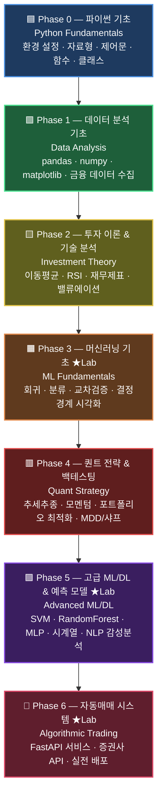
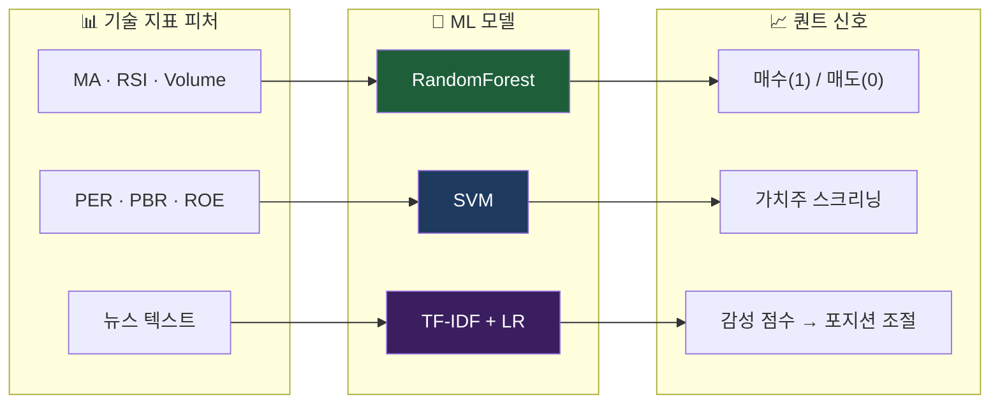
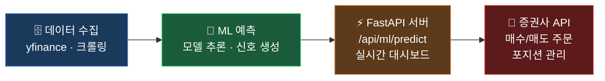

<div align="center">

# 🐍 Python → 퀀트 시스템 개발 완전 로드맵

**파이썬 기초부터 알고리즘 트레이딩 시스템까지 — 실습 중심 교육 플랫폼**

**From Python Basics to Algorithmic Trading System — Hands-on Education Platform**

[](https://github.com/sponsors/edumgt)
[](https://python.org)
[](https://fastapi.tiangolo.com)
[](LICENSE)

[**한국어 README**](README.ko.md) | [**English README**](README.en.md) | [**📚 챕터 문서**](DOC/) | [**📖 퀀트 용어 사전**](README2.md)

</div>

---

## 🗺️ 전체 로드맵 / Full Roadmap



> 📖 퀀트 용어가 낯설다면 [README2.md — 퀀트 투자 용어 사전](README2.md)을 먼저 읽어보세요.

---

## 📚 커리큘럼 상세 / Detailed Curriculum

### 🟦 Phase 0 — 파이썬 기초 (Python Fundamentals)

> 목표: 코딩 경험 없이도 퀀트 실습이 가능한 파이썬 기반 구축

| # | 주제 | 핵심 내용 | 퀀트 연결 |
|---|------|-----------|-----------|
| P0-1 | 환경 설정 | Python 설치, pip, venv, Jupyter | 실습 환경 준비 |
| P0-2 | 자료형 & 연산 | int, float, str, list, dict | 주가·수익률 데이터 표현 |
| P0-3 | 제어문 & 반복 | if/else, for, while | 매매 신호 조건 로직 |
| P0-4 | 함수 & 모듈 | def, import, lambda | 전략 함수화 |
| P0-5 | 클래스 기초 | OOP, \_\_init\_\_, method | 트레이딩 시스템 설계 |

---

### 🟩 Phase 1 — 데이터 분석 기초 (Data Analysis)

> 목표: 금융 데이터를 수집·정제·시각화하는 능력 확보

| # | 주제 | 핵심 라이브러리 | 퀀트 실습 |
|---|------|----------------|-----------|
| P1-1 | 배열 연산 | `numpy` | 수익률 계산, 로그 수익률 |
| P1-2 | 데이터프레임 | `pandas` | OHLCV 데이터 처리 |
| P1-3 | 시각화 | `matplotlib`, `seaborn` | 주가 차트, 수익률 히스토그램 |
| P1-4 | 금융 데이터 수집 | `yfinance`, `FinanceDataReader` | 글로벌·국내 주가 다운로드 |
| P1-5 | 데이터 전처리 | `pandas` | 결측치 처리, 정규화 |

**핵심 코드 예시:**
```python
import FinanceDataReader as fdr
import matplotlib.pyplot as plt

df = fdr.DataReader('005930', '2020-01-01')  # 삼성전자
df['Close'].plot(title='삼성전자 주가')
plt.show()
```

---

### 🟨 Phase 2 — 투자 이론 & 기술 분석 (Investment Theory)

> 목표: 차트 지표와 재무 지표를 코드로 직접 계산·해석

| # | 주제 | 내용 | 관련 용어 |
|---|------|------|-----------|
| P2-1 | 이동평균 & 골든/데드크로스 | MA5/20/60/120, 매매 신호 | [이동평균선 →](README2.md#-이동평균선-moving-average-ma) |
| P2-2 | RSI & 볼린저 밴드 | 과매수/과매도 판단 | [RSI →](README2.md#-rsi-relative-strength-index-상대강도지수) |
| P2-3 | 캔들 차트 분석 | 양봉/음봉, 패턴 인식 | [캔들 차트 →](README2.md#️-캔들-차트-candlestick-chart) |
| P2-4 | 재무제표 수집 | PER, PBR, ROE 계산 | [기본적 분석 →](README2.md#-기본적-분석-fundamental-analysis) |
| P2-5 | 밸류에이션 | DCF 모델, 상대가치 | [밸류에이션 →](README2.md#-밸류에이션-valuation) |
| P2-6 | 거시지표 해석 | 금리·환율·유가와 주식 관계 | [거시경제 →](README2.md#2-거시경제-용어) |

**핵심 코드 예시:**
```python
# RSI 계산
delta = df['Close'].diff()
gain = delta.clip(lower=0).rolling(14).mean()
loss = -delta.clip(upper=0).rolling(14).mean()
rsi = 100 - (100 / (1 + gain / loss))
```

---

### 🟧 Phase 3 — 머신러닝 기초 (ML Fundamentals) `[Lab]`

> 목표: scikit-learn으로 주가 방향 예측 모델 구축의 기초 이해

| Chapter | 주제 | 스크립트 | 퀀트 적용 |
|---------|------|----------|-----------|
| [Ch.02](DOC/Chapter02.md) | 교차 검증 | `CrossValid.py` | 전략 과최적화(overfitting) 방지 |
| [Ch.03](DOC/Chapter03.md) | 결정경계 시각화 | `DecisionBoundary.py` | 매수/매도 구간 시각화 |
| [Ch.04](DOC/Chapter04.md) | 선형·다항 회귀 | `LinearRegression.py` | 가격 예측, 추세선 모델링 |
| — | 특징 공학 | — | 기술 지표 → ML 입력 피처 변환 |

**핵심 퀀트 연결:**
```python
from sklearn.model_selection import cross_val_score
# 교차 검증으로 백테스트 신뢰도 검증
scores = cross_val_score(model, X_features, y_direction, cv=5)
print(f'평균 정확도: {scores.mean():.2%}')
```

---

### 🟥 Phase 4 — 퀀트 전략 & 백테스팅 (Quant Strategy)

> 목표: 실제 투자 전략을 코드로 구현하고 성과를 정량 평가

| # | 전략 | 내용 | 성과 지표 |
|---|------|------|-----------|
| P4-1 | 추세추종 | 이동평균 크로스오버 | 연간 수익률, MDD |
| P4-2 | 모멘텀 | 12개월 수익률 기반 종목 선택 | 샤프 비율 |
| P4-3 | 평균회귀 | 볼린저 밴드 이탈 전략 | 승률, 손익비 |
| P4-4 | 포트폴리오 최적화 | Mean-Variance, Risk Parity | 변동성, 상관계수 |
| P4-5 | 백테스트 구현 | `backtrader` / 직접 구현 | [MDD →](README2.md#-mdd-maximum-drawdown-최대낙폭) · [샤프 →](README2.md#-샤프-비율-sharpe-ratio) |
| P4-6 | 계절성 분석 | 1월 효과, 연말 랠리 탐지 | [계절성 →](README2.md#-시장-계절성-seasonality) |

**핵심 코드 예시:**
```python
# 샤프 비율 계산
def sharpe_ratio(returns, risk_free=0.03):
    excess = returns - risk_free / 252
    return excess.mean() / excess.std() * (252 ** 0.5)

# MDD 계산
def max_drawdown(equity_curve):
    rolling_max = equity_curve.cummax()
    drawdown = (equity_curve - rolling_max) / rolling_max
    return drawdown.min()
```

> ⚠️ 백테스트 주의: 과거 성과 ≠ 미래 수익. 항상 워크포워드 테스트와 교차 검증을 병행하세요.

---

### 🟪 Phase 5 — 고급 ML/DL & 예측 모델 (Advanced ML/DL) `[Lab]`

> 목표: 앙상블·딥러닝·NLP로 퀀트 예측 모델을 고도화

| Chapter | 주제 | 스크립트 | 퀀트 적용 |
|---------|------|----------|-----------|
| [Ch.11](DOC/Chapter11.md) | KMeans 클러스터링 | `KMeansClustering.py` | 주식 섹터 자동 분류, 포트폴리오 분산화 |
| [Ch.12](DOC/Chapter12.md) | SVM 분류기 | `SVMClassifier.py` | 주가 방향(상승/하락) 분류 |
| [Ch.04](DOC/Chapter04.md) | 랜덤 포레스트 | `RandomForest.py` | 팩터 중요도 분석, 앙상블 예측 |
| [Ch.13](DOC/Chapter13.md) | MLP 신경망 | `NeuralNetMLP.py` | 비선형 가격 패턴 학습 |
| [Ch.14](DOC/Chapter14.md) | NLP 감성 분석 | `SentimentAnalysis.py` | 뉴스 감성 → 투자 신호 생성 |
| [Ch.05](DOC/Chapter05.md) | 시계열 예측 | `(ARIMA / LSTM 확장)` | ARIMA → LSTM 순차 예측 |
| [Ch.06](DOC/Chapter06.md) | 생성형 AI | `HuggingFaceGPU.py` | LLM 기반 리포트 요약·분석 |

**ML → 퀀트 파이프라인:**


---

### 🔴 Phase 6 — 자동매매 시스템 (Algorithmic Trading) `[Lab]`

> 목표: ML 모델을 실시간 API 서비스로 만들고 증권사 API에 연결

| Chapter | 주제 | 스크립트 | 내용 |
|---------|------|----------|------|
| [Ch.07](DOC/Chapter07.md) | FastAPI 백엔드 | `app/backend/main.py` | REST API 서버로 모델 서빙 |
| [Ch.08](DOC/Chapter08.md) | Vanilla JS 프론트 | `app/frontend/` | 실시간 대시보드 UI |
| [Ch.09](DOC/Chapter09.md) | 클라우드 배포 | — | AWS/GCP 배포, Docker 컨테이너화 |
| [Ch.10](DOC/Chapter10.md) | 실습 과제 | — | 종합 퀀트 시스템 구축 |
| — | 증권사 API 연결 | — | [KIS·키움·Binance →](README2.md#-api-application-programming-interface) |
| — | 알고리즘 트레이딩 | — | [추세·평균회귀·차익거래 →](README2.md#️-알고리즘-트레이딩-algorithmic-trading) |

**시스템 아키텍처:**


---

## 🗂️ 저장소 구조 / Repository Structure

```text
.
├── CrossValid.py           # Phase 3: K-Fold 교차 검증
├── DecisionBoundary.py     # Phase 3: 결정경계 시각화
├── LinearRegression.py     # Phase 3: 선형·다항 회귀
├── RandomForest.py         # Phase 5: 랜덤 포레스트 (팩터 분석)
├── KMeansClustering.py     # Phase 5: 섹터 클러스터링
├── SVMClassifier.py        # Phase 5: 방향 분류
├── NeuralNetMLP.py         # Phase 5: MLP 신경망
├── SentimentAnalysis.py    # Phase 5: 뉴스 감성 분석
├── OpenCVCPU.py            # Phase 5: 차트 패턴 인식 (OpenCV)
├── HuggingFaceGPU.py       # Phase 5: 생성형 AI (GPU)
├── requirements.txt
├── README2.md              # 📖 퀀트 투자 용어 사전
├── DOC/
│   ├── Chapter01.md        # 저장소 전체 지도 & 학습 전략
│   ├── Chapter02.md        # Cross Validation
│   ├── Chapter03.md        # Decision Boundary
│   ├── Chapter04.md        # Random Forest
│   ├── Chapter05.md        # OpenCV 영상 처리
│   ├── Chapter06.md        # HuggingFace 생성형 AI
│   ├── Chapter07.md        # FastAPI 백엔드
│   ├── Chapter08.md        # Vanilla JS 프론트엔드
│   ├── Chapter09.md        # 클라우드 배포
│   ├── Chapter10.md        # 실습 과제
│   ├── Chapter11.md        # KMeans Clustering
│   ├── Chapter12.md        # SVM Classifier
│   ├── Chapter13.md        # MLP Neural Network
│   └── Chapter14.md        # NLP Text Classification
└── app/
    ├── backend/
    │   └── main.py         # FastAPI 서버 (전체 엔드포인트)
    └── frontend/
        ├── index.html
        ├── styles.css
        └── js/
            ├── app.js · api.js
            └── views/      # 각 실습별 UI 모듈
```

---

## 🚀 빠른 시작 / Quick Start

### Python 환경

```bash
# 1. 의존성 설치
pip install -r requirements.txt

# 2. FastAPI 서버 실행
uvicorn app.backend.main:app --host 0.0.0.0 --port 8000 --reload

# 3. 브라우저 접속
# http://localhost:8000
```

### Node.js 개발 서버

```bash
cd app/frontend
npm install
npm run dev     # http://localhost:3000
```

### 독립 스크립트 실행

```bash
# Phase 3 — ML 기초
python CrossValid.py
python DecisionBoundary.py
python LinearRegression.py

# Phase 5 — 고급 ML/DL
python KMeansClustering.py
python SVMClassifier.py
python RandomForest.py
python NeuralNetMLP.py
python SentimentAnalysis.py
```

---

## 📡 API 엔드포인트 / API Endpoints

| Method | Endpoint | 설명 | 퀀트 용도 |
|--------|----------|------|-----------|
| `GET`  | `/api/health` | 서버 상태 확인 | — |
| `POST` | `/api/ml/cross-validation` | K-Fold 교차 검증 | 전략 신뢰도 검증 |
| `GET`  | `/api/ml/decision-boundary` | 결정경계 시각화 | 매수/매도 구간 확인 |
| `POST` | `/api/ml/linear-regression` | 선형·다항 회귀 | 가격 추세 예측 |
| `POST` | `/api/ml/random-forest` | 랜덤 포레스트 | 팩터 중요도 & 방향 예측 |
| `POST` | `/api/ml/kmeans` | KMeans 클러스터링 | 종목 섹터 자동 분류 |
| `POST` | `/api/ml/svm` | SVM 분류 | 상승/하락 신호 생성 |
| `POST` | `/api/ml/mlp` | MLP 신경망 | 비선형 패턴 학습 |
| `POST` | `/api/nlp/text-classify` | TF-IDF 감성 분류 | 뉴스 → 투자 신호 |
| `POST` | `/api/cv/circle-animation` | OpenCV 영상 | 차트 패턴 시각화 |
| `POST` | `/api/genai/text-to-image` | Stable Diffusion | — (GPU 필요) |

전체 Swagger 문서: `http://localhost:8000/docs`

---

## 🎓 학습 체크리스트 / Learning Checklist

```
Phase 0  [ ] 파이썬 설치 & 기본 문법 완료
         [ ] pandas로 CSV 읽고 가공하기

Phase 1  [ ] yfinance로 삼성전자 주가 다운로드
         [ ] 주가 차트 그리기 (matplotlib)

Phase 2  [ ] 이동평균선 + 골든크로스 신호 코딩
         [ ] RSI 직접 계산 & 과매수/과매도 표시

Phase 3  [ ] CrossValid.py 실행 & 교차 검증 이해
         [ ] LinearRegression.py로 가격 회귀 모델 학습

Phase 4  [ ] 추세추종 전략 백테스트 구현
         [ ] 샤프 비율 & MDD 계산 함수 작성

Phase 5  [ ] KMeans로 코스피 종목 클러스터링
         [ ] SentimentAnalysis로 뉴스 감성 점수 생성

Phase 6  [ ] FastAPI 서버로 모델 API 서빙
         [ ] 증권사 API 연결 & 모의 주문 실행
```


