# 경제지표 분석 (물가, 유가 등)

---

### https://ecos.bok.or.kr/#/StatisticsByTheme/KoreanStat100

# 한국은행 ECOS 100대 지표 쉽게 이해하기

한국은행 경제통계시스템(ECOS)의 **100대 지표**는 한국 경제를 파악하는 데 가장 중요한 핵심 지표들입니다.  
경제 뉴스와 금융 시장에서 자주 등장하는 지표를 중심으로 쉽게 정리하였습니다.

## 1. 금융 분야 주요 지표 (자산운용에서 특히 중요)

- **기준금리 (정책금리)**  
  한국은행이 결정하는 가장 중요한 금리. 모든 시장금리의 기준이 됩니다. 기준금리가 오르면 대출이 줄고 경기가 위축되며, 내리면 반대 효과가 나타납니다.

- **시장금리**  
  - 단기: CD금리, 콜금리 등  
  - 장기: 국고채 3년·5년·10년물 수익률  
  국고채 수익률은 회사채·대출금리의 기준으로 사용되며, 금리가 상승하면 채권 가격은 하락합니다.

- **예금금리 / 대출금리**  
  은행에서 실제 적용되는 예금 이자율과 대출 이자율. 가계와 기업의 자금 조달 비용을 직접적으로 보여줍니다.

- **가계신용·가계대출 및 연체율**  
  가계가 은행에서 빌린 총 금액과, 대출을 제때 갚지 못하는 비율. 연체율 상승은 금융 위험 신호로 해석됩니다.

- **M1·M2 통화 증가율**  
  - M1: 현금 + 요구불예금 (가장 유동성 높은 돈)  
  - M2: M1 + 정기예금 등 (경제 전체에 풀린 돈의 양)  
  M2 증가율이 높으면 물가 상승 압력, 낮으면 경기 둔화 가능성이 있습니다.

## 2. 물가 분야 주요 지표

- **소비자물가 상승률 (CPI)**  
  일반 국민이 실제로 느끼는 물가 상승률. 식료품, 주거, 교통 등 소비 바구니 가격 변동을 측정합니다. 한국은행의 물가 안정 목표(약 2%) 달성 여부를 판단하는 핵심 지표입니다.

- **생산자물가 상승률**  
  기업 간 거래 가격 변동률. 원자재 가격 변화가 먼저 반영되어 향후 소비자물가에 선행하는 경향이 있습니다.

- **근원물가 상승률**  
  식료품과 에너지 가격을 제외한 기조적 물가. 일시적 충격을 제외하고 본질적인 물가 흐름을 파악할 때 사용합니다.

## 3. 실물 경제·경기 관련 주요 지표

- **경제성장률 (GDP 성장률)**  
  우리나라 경제가 얼마나 성장했는지를 보여주는 가장 종합적인 지표. 분기별·연간으로 발표됩니다.

- **민간소비 증가율**  
  가계의 소비 동향. 내수 경기의 핵심 동력입니다.

- **설비투자 증가율**  
  기업이 기계·설비에 투자하는 규모. 미래 성장 잠재력을 보여주는 지표입니다.

- **건설투자 증가율**  
  건물·인프라 건설 투자 동향. 부동산 시장과 밀접한 관련이 있습니다.

- **경상수지**  
  상품·서비스 수출입, 해외 투자 수익 등을 합한 국제수지. 지속적인 흑자는 원화 가치 상승 요인이 됩니다.

- **환율 (원/달러)**  
  1달러를 사는 데 필요한 원화 금액. 수출 기업에는 낮은 환율이, 해외 여행·수입에는 높은 환율이 유리합니다.

## 4. 고용·임금 관련 주요 지표

- **실업률**  
  일할 의사가 있는 사람 중 실제로 일하지 못하는 비율.

- **고용률**  
  15세 이상 인구 중 실제로 일하고 있는 사람의 비율.

- **시간당 명목임금**  
  노동자들이 시간당 받는 평균 임금 수준.

## 활용 팁 (취업 준비 시)

- **자산운용·리서치 직무**에서는 **기준금리, 국고채 수익률, M2, 가계대출, CPI**를 가장 주의 깊게 살펴보세요.  
- ECOS 페이지에서 각 지표를 클릭하면 최신 수치, 그래프, 과거 추이를 바로 확인할 수 있습니다.

---

> 📺 **YouTube 강의**: [🎬 경제지표 분석 물가 유가 환율](https://www.youtube.com/results?search_query=경제지표+분석+물가+유가+환율+한국어+투자)
>
> 📝 **한자 병기 및 어원 사전**: 이 문서에 등장하는 용어의 한자·어원·일제강점기 유래는 → [voca.md](voca.md)

## 오늘 배울 것

> 📺 [🎬 오늘 배울 것](https://www.youtube.com/results?search_query=오늘+배울+것+한국어)

- 소비자물가지수(CPI)와 생산자물가지수(PPI)
- 유가(WTI, 브렌트유) 분석
- 환율과 주가의 관계
- 실업률, GDP 성장률 지표 해석
- 실습: 주요 경제지표 데이터 수집 및 상관관계 분석

---

## 🗓 세부 일정 (1일 8시간)

> 📺 [🎬 세부 일정](https://www.youtube.com/results?search_query=세부+일정+한국어)

> **강의 5시간** (5개 단락 × 50분 + 도입·마무리 50분) + **실습 3시간** = 총 8시간

| 시간 | 구분 | 내용 | 형태 |
|------|------|------|------|
| 09:00 – 09:10 | 도입 | 오늘 학습 목표 확인 | 강의 |
| 09:10 – 09:30 | **1단락** 설명 20분 | 소비자물가지수(CPI)와 생산자물가지수(PPI) | 강의 |
| 09:30 – 10:00 | 각자 정리 & 유튜브 30분 | 노트 정리 · 관련 영상 검색 | 자율 |
| 10:00 – 10:20 | **2단락** 설명 20분 | 유가(WTI, 브렌트유) 분석 | 강의 |
| 10:20 – 10:50 | 각자 정리 & 유튜브 30분 | 노트 정리 · 관련 영상 검색 | 자율 |
| 10:50 – 11:00 | ☕ 휴식 | — | — |
| 11:00 – 11:20 | **3단락** 설명 20분 | 환율과 주가의 관계 | 강의 |
| 11:20 – 11:50 | 각자 정리 & 유튜브 30분 | 노트 정리 · 관련 영상 검색 | 자율 |
| 11:50 – 12:10 | **4단락** 설명 20분 | 실업률, GDP 성장률 지표 해석 | 강의 |
| 12:10 – 12:40 | 각자 정리 & 유튜브 30분 | 노트 정리 · 관련 영상 검색 | 자율 |
| 12:40 – 13:00 | **5단락** 설명 20분 | 경제지표 상관관계 분석 방법론 개요 | 강의 |
| 13:00 – 13:30 | 각자 정리 & 유튜브 30분 | 노트 정리 · 관련 영상 검색 | 자율 |
| 13:30 – 14:00 | 강의 마무리 | Q&A · 핵심 복습 | 강의 |
| 14:00 – 15:00 | 💻 **실습 1부** 60분 | FRED·yfinance로 CPI·PPI·WTI·환율·실업률 데이터 수집 | 실습 |
| 15:00 – 15:10 | ☕ 휴식 | — | — |
| 15:10 – 16:00 | 💻 **실습 2부** 50분 | 상관관계 히트맵 · 롤링 상관관계 시각화 구현 | 실습 |
| 16:00 – 16:10 | ☕ 휴식 | — | — |
| 16:10 – 17:00 | 💻 **실습 발표 & 리뷰** 50분 | 코드 리뷰 · 발표 · 피드백 | 실습 |

> 강의 5시간: 도입 10분 + 단락 5개×50분 + 마무리 30분 = **300분**  
> 실습 3시간: 1부 60분 + 휴식 10분 + 2부 50분 + 휴식 10분 + 발표·리뷰 50분 = **180분**

---

## 🔗 참고 사이트 & 데이터 원천

> 📺 [🎬 참고 사이트 데이터 원천](https://www.youtube.com/results?search_query=참고+사이트+데이터+원천+한국어)

> 이 문서(경제지표 — 물가·유가·환율·실업률)의 실습에 필요한 공식 데이터 출처와 참고 사이트입니다. ⚿ 는 API 키 또는 승인이 필요한 항목입니다.

### 📊 국내 공식 데이터

| 기관 | URL | API 키 | 제공 데이터 |
|------|-----|--------|-------------|
| 통계청 KOSIS | <https://kosis.kr> | ⚿ 권장 | 국내 CPI, PPI, 고용통계, GDP |
| 한국은행 ECOS | <https://ecos.bok.or.kr> | ⚿ 필요 | 환율, 물가지수, 수출입물가 |
| 공공데이터포털 | <https://www.data.go.kr> | ⚿ 필요 | 유가, 원자재 공공 데이터 |
| 산업통상자원부 에너지 통계 | <https://www.motie.go.kr> | 불필요(웹 조회) | 국내 유가·에너지 소비 현황 |

### 🌍 해외 공식 데이터

| 기관 | URL | API 키 | 제공 데이터 |
|------|-----|--------|-------------|
| FRED (St. Louis Fed) | <https://fred.stlouisfed.org> | ⚿ 권장 | CPI, PCE, PPI, 실업률, GDP |
| BLS (미국 노동통계국) | <https://www.bls.gov/developers> | ⚿ 권장 | CPI, PPI, 실업률 원시 데이터 |
| BEA (미국 경제분석국) | <https://apps.bea.gov/api> | ⚿ 필요 | GDP, PCE, 소득 데이터 |
| EIA (미국 에너지정보청) | <https://www.eia.gov/opendata> | ⚿ 필요 | WTI·브렌트 유가, 천연가스, 재고 |
| OECD Data | <https://data.oecd.org> | 불필요 | 국가별 CPI·실업률·GDP 비교 |
| World Bank | <https://data.worldbank.org> | 불필요 | 글로벌 경제 지표 장기 시계열 |
| IMF Data | <https://www.imf.org/en/Data> | 불필요 | 세계경제전망(WEO), 물가·성장률 |

### 📈 차트 & 뉴스 참고

| 분류 | 사이트 | URL | 활용 용도 |
|------|--------|-----|-----------|
| 차트 플랫폼 | TradingView | <https://www.tradingview.com> | 유가·환율·물가 관련 차트 |
| 차트 플랫폼 | Investing.com | <https://www.investing.com> | 경제 지표 캘린더·실시간 시세 |
| 금융 포탈 | 네이버 금융 | <https://finance.naver.com> | 국내 경제지표·환율 현황 |
| 금융 미디어 | 머니투데이 방송(MTN) | <https://mtn.co.kr> | 물가·유가·환율 뉴스 분석 |
| 금융 미디어 | 이데일리 | <https://www.edaily.co.kr> | 경제지표 발표 속보 |
| 금융 정책 | 금융위원회 | <https://www.fsc.go.kr> | 물가·금융안정 정책 정보 |
| 금융 감독 | 금융감독원(FSS) | <https://www.fss.or.kr> | 금융시장 안정 모니터링 |

---

### 1. 소비자물가지수(CPI)와 생산자물가지수(PPI)

> 📖 **Wikipedia**: [소비자 물가 지수](https://ko.wikipedia.org/wiki/소비자_물가_지수) · [생산자 물가 지수](https://ko.wikipedia.org/wiki/생산자_물가_지수) · [인플레이션](https://ko.wikipedia.org/wiki/인플레이션)

**CPI (Consumer Price Index, 소비자물가지수)**

소비자가 실제로 구매하는 상품·서비스 바구니의 가격 변화를 측정하는 지표입니다.

- 기준: 특정 연도를 100으로 설정해 상대적 변화를 나타냄
- 발표: 한국 통계청 (월 1회), 미국 BLS (월 1회)
- **핵심 근원물가(Core CPI)**: 에너지·식품을 제외한 CPI → 변동성이 낮아 추세 파악에 유리

**CPI 수치별 중앙은행 반응**

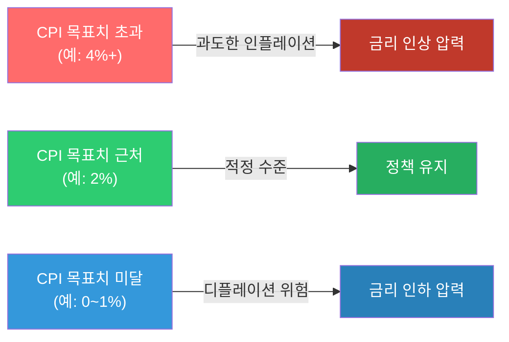

> 📺 [🎬 소비자물가지수 CPI 뜻 설명](https://www.youtube.com/results?search_query=소비자물가지수+CPI+인플레이션+한국어+설명)

**PPI (Producer Price Index, 생산자물가지수)**

기업이 생산·판매하는 상품의 가격 변화를 측정합니다. CPI보다 **선행성**이 있어 미래 물가를 예측하는 데 사용됩니다.

**PPI → CPI 파급 경로**


> 📺 [🎬 PPI 생산자물가지수 CPI 차이](https://www.youtube.com/results?search_query=PPI+생산자물가지수+CPI+차이+한국어)

```python
# CPI 변화율(인플레이션율) 계산 예시
cpi_monthly = [104.5, 105.2, 104.8, 106.3, 107.1, 108.0]

# 전월 대비 변화율 (MoM)
mom = [(cpi_monthly[i] - cpi_monthly[i-1]) / cpi_monthly[i-1] * 100
       for i in range(1, len(cpi_monthly))]

# 연율 환산 (MoM * 12)
annualized = [m * 12 for m in mom]

for i, (m, a) in enumerate(zip(mom, annualized)):
    print(f"{i+2}월: MoM {m:.2f}%  |  연율환산 {a:.1f}%")
```

#### 🔗 Python 소스 연계

이 섹션의 물가지표(CPI)는 웹앱의 **거시경제현황 1 (실시간)** 탭에서 직접 확인할 수 있습니다.

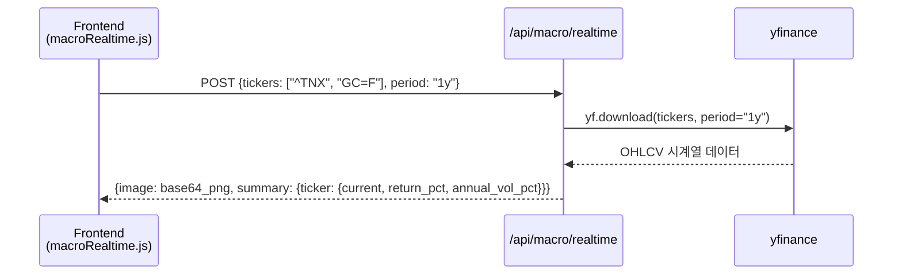

| API 파라미터 | 값 예시 | 설명 |
|---|---|---|
| `tickers` | `["^TNX"]` | 미국 10년물 국채금리 (금리 인상/인하 신호) |
| `period` | `"1y"`, `"6mo"`, `"3mo"` | 조회 기간 |

---

### 2. 유가(WTI, 브렌트유) 분석

> 📖 **Wikipedia**: [서부 텍사스 원유](https://ko.wikipedia.org/wiki/서부_텍사스_원유) · [브렌트유](https://ko.wikipedia.org/wiki/브렌트유) · [석유수출국기구](https://ko.wikipedia.org/wiki/석유수출국기구)

**WTI vs 브렌트유**

| 구분 | WTI (West Texas Intermediate) | 브렌트유 (Brent Crude) |
|------|-------------------------------|------------------------|
| 원산지 | 미국 텍사스 | 북해 |
| 기준 시장 | NYMEX (뉴욕) | ICE (런던) |
| 특징 | 미국 기준 원유, 경질유 | 글로벌 기준 원유 (세계 원유 70%+ 기준) |
| 가격 차이 | 보통 WTI가 $1~3 저렴 | — |

> 📺 [🎬 WTI 브렌트유 차이 원유 투자](https://www.youtube.com/results?search_query=WTI+브렌트유+차이+원유가격+한국어)

**유가 상승 시 경제 파급 경로**

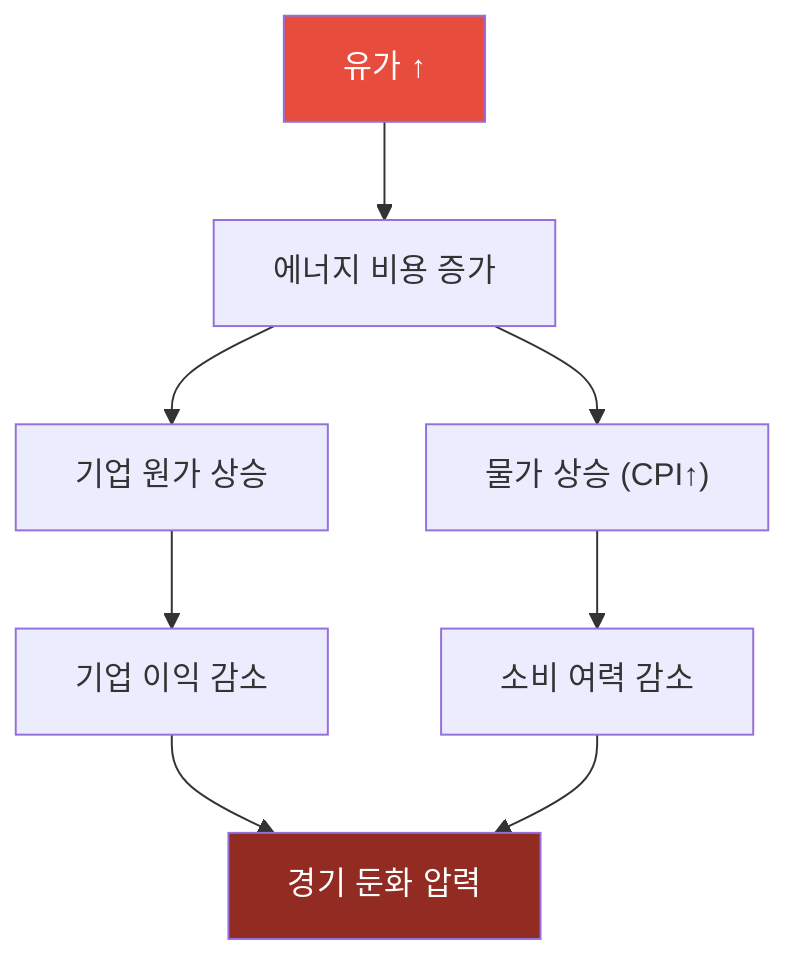

**유가 하락 시 경제 파급 경로**

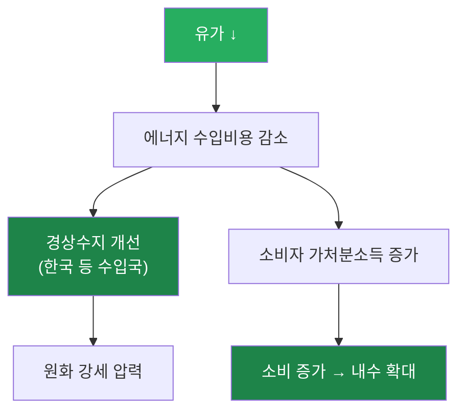

**산업별 유가 영향**

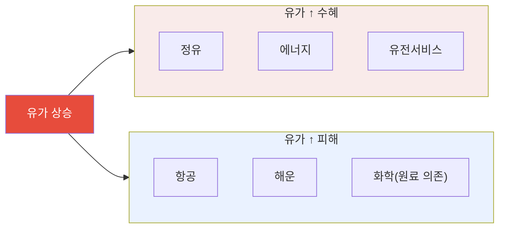

> 📺 [🎬 유가 상승 하락 주식시장 영향](https://www.youtube.com/results?search_query=유가+주식+영향+에너지+섹터+한국어)

```python
import yfinance as yf
import pandas as pd

# WTI 원유 선물 가격 (CL=F) 수집
oil = yf.download("CL=F", start="2022-01-01", end="2024-12-31", auto_adjust=True)["Close"]

# 20일 이동평균 추가
oil_ma20 = oil.rolling(20).mean()

print(f"최근 종가: ${oil.iloc[-1]:.2f}/배럴")
print(f"20일 이동평균: ${oil_ma20.iloc[-1]:.2f}/배럴")
print(f"52주 최고: ${oil[-252:].max():.2f}")
print(f"52주 최저: ${oil[-252:].min():.2f}")
```

#### 🔗 Python 소스 연계

웹앱 **거시경제현황 1 (실시간)** 에서 WTI 유가를 실시간으로 조회합니다.

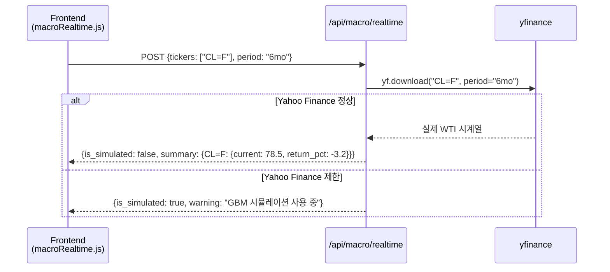

| API 파라미터 | 유가 조회용 값 |
|---|---|
| `tickers` | `["CL=F"]` (WTI 선물) |
| `period` | `"1y"` (연간 추세 파악 권장) |

---

### 3. 환율과 주가의 관계

> 📖 **Wikipedia**: [환율](https://ko.wikipedia.org/wiki/환율) · [외환시장](https://ko.wikipedia.org/wiki/외환시장)

**환율의 기본 개념**

환율은 두 통화의 교환 비율입니다. 원/달러 환율이 1,350원이라면, 달러 1개를 사려면 1,350원이 필요하다는 뜻입니다.

**원화 약세(환율 ↑) 파급 경로**

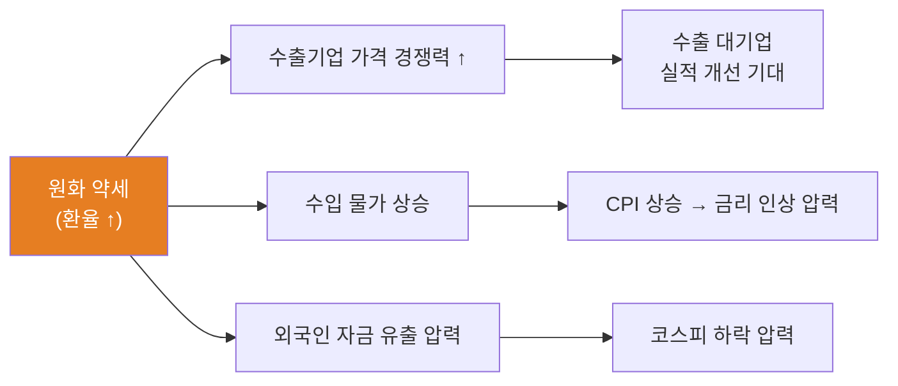

**원화 강세(환율 ↓) 파급 경로**

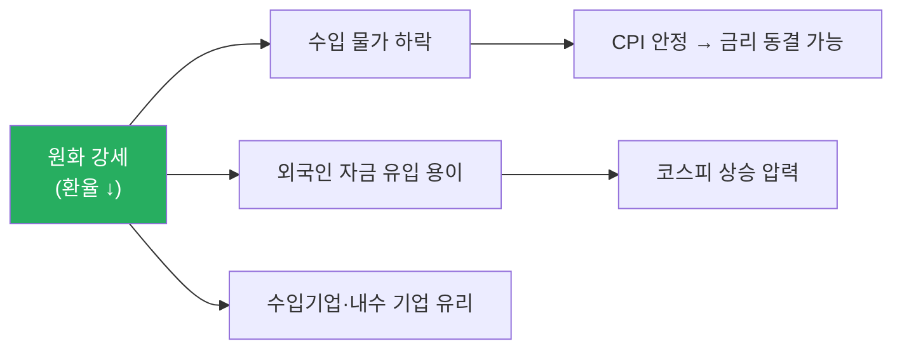

**코스피와 환율의 상호작용**

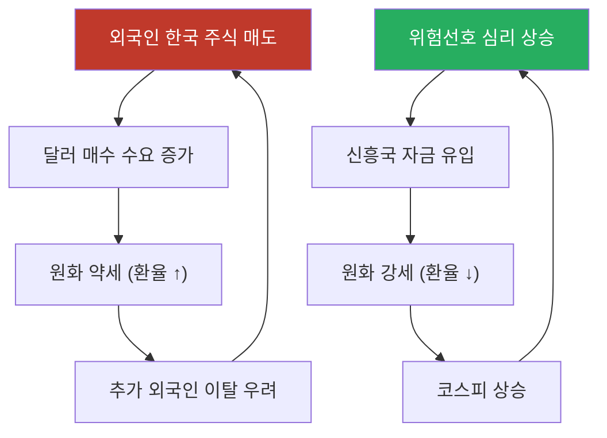

> 📺 [🎬 원달러 환율 주식 관계](https://www.youtube.com/results?search_query=원달러+환율+주식시장+관계+한국어)

> 📺 [🎬 외국인 투자자 환율 코스피 영향](https://www.youtube.com/results?search_query=외국인+투자자+코스피+환율+한국어)

```python
import yfinance as yf
import pandas as pd
import numpy as np

# 원달러 환율 (KRW=X) 및 코스피 ETF (EWY)
usdkrw = yf.download("KRW=X", start="2020-01-01", end="2024-12-31", auto_adjust=True)["Close"]
kospi  = yf.download("EWY",   start="2020-01-01", end="2024-12-31", auto_adjust=True)["Close"]

df = pd.DataFrame({"환율": usdkrw, "코스피ETF": kospi}).dropna()

correlation = df["환율"].corr(df["코스피ETF"])
print(f"원달러 환율 vs 코스피ETF 상관계수: {correlation:.3f}")
print("(음수: 환율 상승 시 코스피 하락 경향)")
```

#### 🔗 Python 소스 연계

환율(USD/KRW)과 코스피를 동시에 조회해 상관관계를 웹앱에서 시각화합니다.

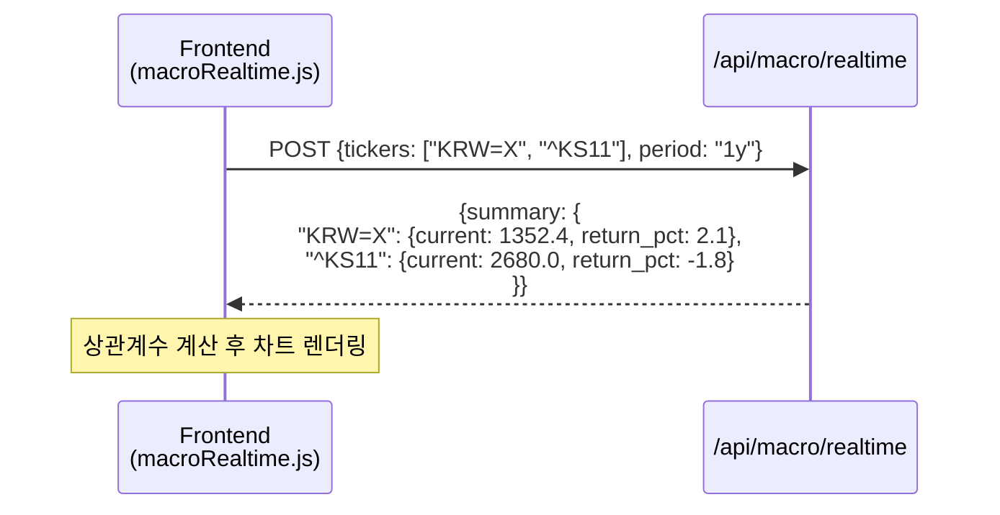

| 환율·주가 동시 조회 파라미터 | 설명 |
|---|---|
| `"KRW=X"` | 달러/원 환율 |
| `"^KS11"` | KOSPI 지수 |
| `"EWY"` | iShares MSCI Korea ETF (대안) |

### 3-1. 외국인의 주가상승 신호

> 📖 **Wikipedia**: [외국인 투자자](https://ko.wikipedia.org/wiki/외국인_투자자) · [코스피](https://ko.wikipedia.org/wiki/코스피)

한국 주식시장에서 **외국인 투자자**는 코스피 시가총액의 약 30~35%를 차지하는 핵심 수급 세력입니다. 외국인의 순매수·순매도 동향은 주가 방향의 중요한 선행 지표로 활용됩니다.

**외국인 순매수가 주가 상승 신호로 해석되는 구조**

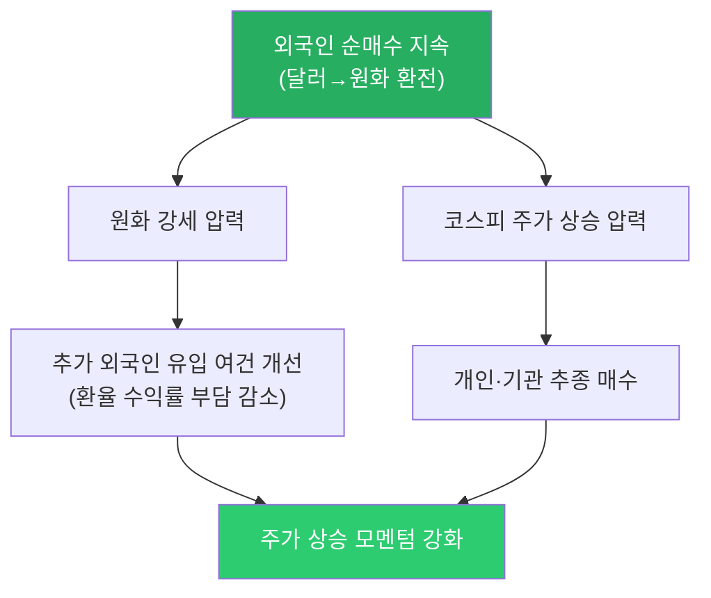

**외국인 주가상승 신호 체크 포인트**

| 신호 | 확인 방법 | 신뢰도 |
|------|---------|--------|
| **5일 이상 연속 순매수** | KRX 투자자별 매매동향 | ★★★★★ |
| **외국인 보유비율 지속 증가** | data.krx.co.kr 종목별 외국인 보유 현황 | ★★★★☆ |
| **원화 강세 동반** | USD/KRW 환율 하락 추세 | ★★★☆☆ |
| **대형주 중심 매수** | 코스피200 핵심 종목 집중 매수 | ★★★★☆ |
| **거래대금 동반 증가** | 순매수 + 거래대금 급증 | ★★★★☆ |

**외국인 매수 vs 매도 시 시장 반응 비교**

| 외국인 동향 | 환율 영향 | 주가 영향 | 투자자 대응 |
|------------|---------|---------|-----------|
| **대규모 순매수** | 원화 강세 (환율 ↓) | 코스피 상승 압력 | 비중 확대 검토 |
| **5일 이상 연속 순매수** | 원화 강세 지속 | 강한 상승 모멘텀 | 모멘텀 추종 전략 |
| **대규모 순매도** | 원화 약세 (환율 ↑) | 코스피 하락 압력 | 리스크 점검·손절 기준 확인 |
| **연속 순매도** | 원화 약세 심화 | 추가 이탈 악순환 가능 | 방어 포지션 검토 |

```python
import yfinance as yf
import pandas as pd

# 외국인 순매수 모멘텀과 코스피 관계 (개념 예시)
# 실제 외국인 매매동향은 KRX data.krx.co.kr에서 다운로드

# 코스피 ETF (EWY)와 원달러 환율 동반 조회
data = yf.download(["EWY", "KRW=X"], start="2023-01-01", end="2024-12-31",
                   auto_adjust=True)["Close"]
data.columns = ["코스피ETF", "환율"]

# 코스피 ETF 수익률과 환율 변화 계산
data["코스피수익"] = data["코스피ETF"].pct_change() * 100
data["환율변화"]   = data["환율"].pct_change() * 100

# 외국인 순매수 가정: 환율이 내려가는 날 → 달러→원화 전환 압력 (순매수 추정)
data["외국인매수추정"] = data["환율변화"] < 0  # 단순 추정

# 외국인 추정 매수일의 코스피 평균 수익률
buy_days  = data[data["외국인매수추정"]]["코스피수익"].mean()
sell_days = data[~data["외국인매수추정"]]["코스피수익"].mean()

print(f"외국인 추정 순매수일 평균 코스피 수익률: {buy_days:.3f}%")
print(f"외국인 추정 순매도일 평균 코스피 수익률: {sell_days:.3f}%")
```

> ⚠️ **주의사항**: 외국인 순매수가 항상 주가 상승으로 이어지지는 않습니다. 파생상품 헤지, 인덱스 리밸런싱, 배당 차익거래 목적의 매수는 주가 상승 신호로 보기 어렵습니다. **순매수의 지속성, 대상 종목, 환율 동향, 거래대금**을 종합해 판단해야 합니다.

---

### 4. 실업률, GDP 성장률 지표 해석

> 📖 **Wikipedia**: [실업률](https://ko.wikipedia.org/wiki/실업률) · [국내총생산](https://ko.wikipedia.org/wiki/국내총생산) · [경기침체](https://ko.wikipedia.org/wiki/경기침체)

**GDP 성장률 (Gross Domestic Product Growth Rate)**

GDP는 일정 기간 국내에서 생산된 모든 재화·서비스의 시장 가치 합계입니다.

- **성장률 = (금기 GDP - 전기 GDP) / 전기 GDP × 100**
- 분기별 발표 (QoQ: 전분기 대비, YoY: 전년 동기 대비)

**GDP 성장률 구간별 신호**

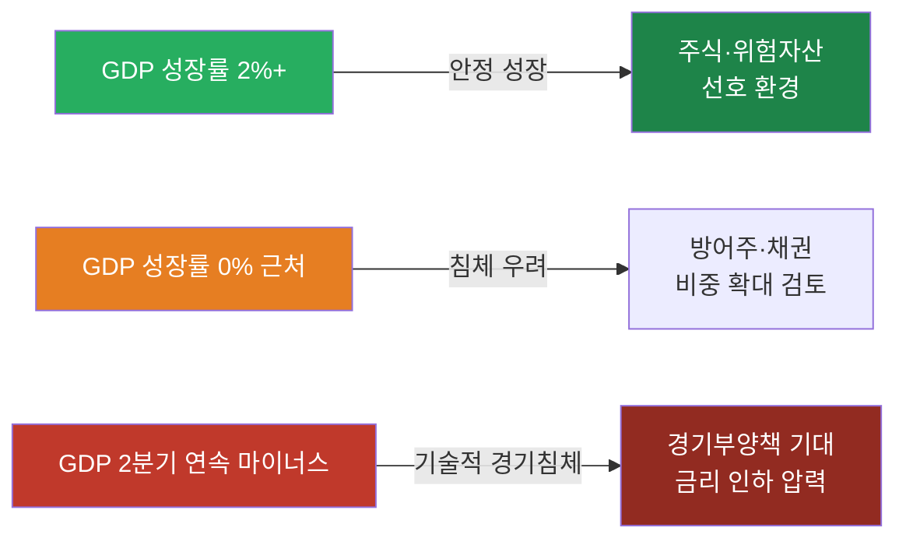

> 📺 [🎬 GDP 성장률 경기침체 투자](https://www.youtube.com/results?search_query=GDP+성장률+경기침체+주식투자+한국어)

**실업률 (Unemployment Rate)**

경제활동인구 중 일할 의사가 있으나 직업이 없는 사람의 비율입니다.

**실업률 신호와 시장 반응**

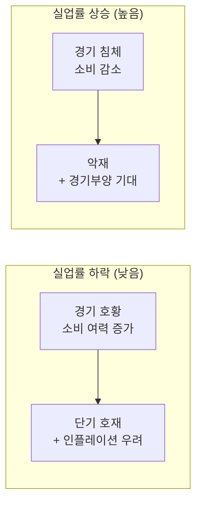

> 📺 [🎬 미국 실업률 비농업고용지수 주식](https://www.youtube.com/results?search_query=미국+실업률+비농업고용+주식시장+한국어)

**미국 고용지표 발표 순서**


| 지표 | 발표 시기 | 핵심 수치 |
|------|-----------|-----------|
| 비농업 고용(NFP) | 매월 첫째 금요일 | 전월 대비 증감 인원 |
| 실업률 | NFP 동시 발표 | % |
| ADP 민간 고용 | NFP 발표 2일 전 수요일 | 선행 지표 |

#### 🔗 Python 소스 연계

GDP·실업률은 yfinance로 직접 수집되지 않지만, 금리(채권 수익률)를 프록시 지표로 활용해 웹앱에서 조회할 수 있습니다.

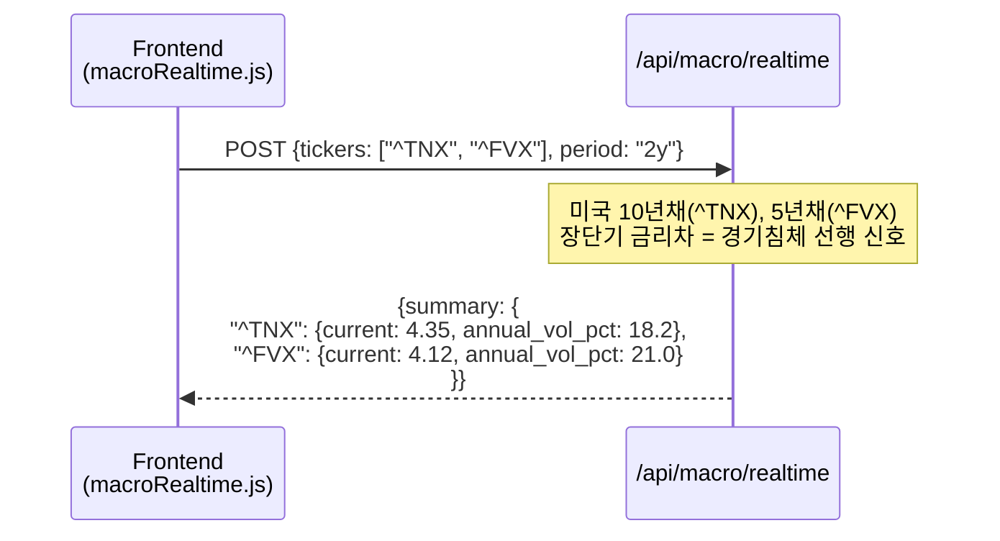

---

### 5. 실습: 주요 경제지표 데이터 수집 및 상관관계 분석

이번 실습은 **시장 데이터만 빠르게 확인하는 yfinance 버전**과 **공식 경제통계 API를 함께 쓰는 확장 버전**으로 나눕니다. 최종 산출물은 `macro_correlation.csv`, `macro_correlation.png`, `macro_rolling_corr.png`, `macro_report.md`입니다.

---

#### 5-1. 실습 목표와 분석 질문

**실습 목표**

1. CPI, PPI, GDP, 실업률, 금리, 유가, 환율, 주가지수 데이터를 수집합니다.
2. 일별·월별·분기별로 다른 데이터 빈도를 월별 기준으로 맞춥니다.
3. 수준값(level), 변화율(return), 전년동월비(YoY)를 구분해 상관관계를 계산합니다.
4. 전체 기간 상관관계뿐 아니라 12개월 롤링 상관관계와 선행·후행 관계를 확인합니다.
5. 웹앱 API와 연결할 수 있는 데이터 구조와 화면 구성을 설계합니다.

**분석 질문 예시**

| 질문 | 필요한 지표 | 분석 방법 |
|---|---|---|
| 유가 상승은 물가 상승과 함께 움직였는가? | WTI, CPI, PPI | 월별 YoY 상관계수, 3개월 시차 상관 |
| 달러 강세는 주가지수에 부정적인가? | 달러인덱스, USD/KRW, S&P500, KOSPI | 월간 수익률 상관계수 |
| 금리 상승기에 금 가격은 약했는가? | 10년물 금리, 금, 달러인덱스 | 산점도, 롤링 상관 |
| 경기 둔화 신호와 주식시장은 언제 연결되는가? | 실업률, GDP, 장단기금리차, S&P500 | 분기/월별 리샘플링, 시차 상관 |

---

#### 5-2. 데이터 출처와 가입/키 발급

실습에서는 `yfinance`로 빠르게 시작한 뒤, 공식 API를 하나씩 붙이는 순서를 권장합니다.

| 출처 | 주요 지표 | 인증 | 실습 용도 |
|---|---|---|---|
| [Yahoo Finance/yfinance](https://pypi.org/project/yfinance/) | WTI, 금, 달러인덱스, S&P500, KOSPI, 환율, 미국채 | 별도 키 없음 | 빠른 시장 데이터 실습 |
| [FRED](https://fred.stlouisfed.org/) | CPI, PPI, GDP, 실업률, 금리, 스프레드 | API Key 권장 | 미국 거시지표 통합 수집 |
| [BLS Public Data API](https://www.bls.gov/bls/api_features.htm) | CPI, PPI, 실업률, 고용 | 공개 API, 등록키 선택 | 미국 노동·물가 원천 확인 |
| [BEA API](https://www.bea.gov/open-data) | GDP, 개인소비, 소득, 기업이익 | API Key 필요 | 미국 국민계정 원천 확인 |
| [EIA API](https://www.eia.gov/opendata/documentation.php) | WTI, Brent, 에너지 재고·수급 | API Key 필요 | 유가 원천 데이터 보강 |
| [한국은행 ECOS](https://ecos.bok.or.kr/) | 기준금리, 환율, GDP, CPI, 시장금리 | API Key 필요 | 한국 거시지표 수집 |
| [KOSIS OpenAPI](https://kosis.kr/openapi/devGuide/devGuide_0201List.do) | 소비자물가, 실업률, 산업활동 | API Key 필요 | 통계청 공식 통계 수집 |

`.env`에는 아래처럼 키를 저장합니다. 키가 없어도 yfinance와 일부 공개 API 실습은 가능합니다.

```bash
FRED_API_KEY=발급받은_FRED_KEY
BLS_API_KEY=선택사항_BLS_KEY
BEA_API_KEY=발급받은_BEA_KEY
EIA_API_KEY=발급받은_EIA_KEY
BOK_API_KEY=발급받은_ECOS_KEY
KOSIS_API_KEY=발급받은_KOSIS_KEY
```

**추가 패키지**

현재 repo의 기본 패키지에 더해, 아래 패키지를 설치하면 실습 코드를 그대로 실행하기 쉽습니다.

```bash
pip install requests seaborn plotly statsmodels openpyxl
```

---

#### 5-3. 표준 데이터 스키마

출처가 달라도 아래 구조로 맞춰 두면 FastAPI, CSV, 차트, 보고서에서 재사용하기 쉽습니다.

| 컬럼 | 예시 | 설명 |
|---|---|---|
| `date` | `2024-12-31` | 관측일 |
| `country` | `US`, `KR` | 국가 |
| `source` | `FRED`, `BLS`, `YFINANCE` | 데이터 출처 |
| `series_id` | `CPIAUCSL`, `CL=F` | 원천 코드 |
| `series_name` | `US CPI`, `WTI` | 표시명 |
| `frequency` | `D`, `M`, `Q` | 원천 주기 |
| `value` | `4.23` | 원천 값 |
| `unit` | `%`, `index`, `USD` | 단위 |
| `transform` | `level`, `return`, `yoy` | 분석용 변환 방식 |

---

#### 5-4. 1단계: yfinance로 빠른 시장 데이터 수집

먼저 일별 금융시장 데이터를 수집합니다. 이 단계는 API Key가 없어도 실행할 수 있어 실습 진입점으로 좋습니다.

```python
import yfinance as yf
import pandas as pd

MARKET_TICKERS = {
    "WTI": "CL=F",
    "Gold": "GC=F",
    "DollarIndex": "DX-Y.NYB",
    "US10Y": "^TNX",
    "SP500": "^GSPC",
    "KOSPI": "^KS11",
    "USDKRW": "KRW=X",
}

def fetch_yfinance_close(tickers, start="2020-01-01", end="2024-12-31"):
    frames = {}
    for name, ticker in tickers.items():
        data = yf.download(
            ticker,
            start=start,
            end=end,
            auto_adjust=True,
            progress=False,
        )
        if data.empty:
            print(f"skip: {name} ({ticker})")
            continue
        frames[name] = data["Close"]
    return pd.DataFrame(frames).sort_index()

daily_prices = fetch_yfinance_close(MARKET_TICKERS)
daily_prices.to_csv("macro_market_daily.csv", encoding="utf-8-sig")
print(daily_prices.tail())
```

**주의할 점**

- `^TNX`는 미국 10년물 금리 자체가 아니라 Yahoo Finance 표기상 10배 조정된 수익률처럼 보일 수 있으므로, 화면 표시 전에 단위와 스케일을 확인합니다.
- `KRW=X`는 USD/KRW 환율입니다. 값이 오르면 원화 약세입니다.
- 선물 가격(`CL=F`, `GC=F`)은 롤오버 영향이 있어 장기 분석에서는 공식 현물 또는 연속선물 정의를 확인합니다.

---

#### 5-5. 2단계: FRED 공식 거시지표 수집

FRED는 CPI, PPI, GDP, 실업률, 금리, 스프레드를 한 번에 가져오기 좋습니다.

| 지표 | FRED 코드 | 주기 | 변환 권장 |
|---|---|---|---|
| 소비자물가지수 | `CPIAUCSL` | 월별 | YoY |
| 생산자물가지수 | `PPIACO` | 월별 | YoY |
| 실업률 | `UNRATE` | 월별 | level, 차분 |
| 실질 GDP | `GDPC1` | 분기별 | QoQ 연율 또는 YoY |
| 연방기금금리 | `FEDFUNDS` | 월별 | level |
| 미국 10년물 국채 | `DGS10` | 일별 | 월말 또는 월평균 |
| 장단기 스프레드 | `T10Y2Y` | 일별 | 월평균 |

```python
import os
import requests
import pandas as pd

FRED_API_KEY = os.getenv("FRED_API_KEY")

FRED_SERIES = {
    "US_CPI": "CPIAUCSL",
    "US_PPI": "PPIACO",
    "US_UNRATE": "UNRATE",
    "US_REAL_GDP": "GDPC1",
    "FEDFUNDS": "FEDFUNDS",
    "US10Y_FRED": "DGS10",
    "US10Y2Y_SPREAD": "T10Y2Y",
}

def fetch_fred_series(series_id, start="2020-01-01", end="2024-12-31"):
    url = "https://api.stlouisfed.org/fred/series/observations"
    params = {
        "series_id": series_id,
        "api_key": FRED_API_KEY,
        "file_type": "json",
        "observation_start": start,
        "observation_end": end,
    }
    data = requests.get(url, params=params, timeout=20).json()
    rows = data.get("observations", [])
    df = pd.DataFrame(rows)
    if df.empty:
        return pd.Series(dtype="float64", name=series_id)
    values = pd.to_numeric(df["value"].replace(".", pd.NA), errors="coerce")
    return pd.Series(values.values, index=pd.to_datetime(df["date"]), name=series_id).dropna()

fred_df = pd.DataFrame({
    name: fetch_fred_series(series_id)
    for name, series_id in FRED_SERIES.items()
})

fred_df.to_csv("macro_fred_raw.csv", encoding="utf-8-sig")
print(fred_df.tail())
```

---

#### 5-6. 3단계: BLS, BEA, EIA 원천 API 보강

FRED만으로도 실습은 가능하지만, “공식 원천에서 직접 수집한다”는 감각을 익히려면 BLS, BEA, EIA 호출도 한 번씩 해봅니다.

**BLS: CPI·실업률 직접 조회**

```python
import os
import requests
import pandas as pd

BLS_API_KEY = os.getenv("BLS_API_KEY")

BLS_SERIES = {
    "BLS_CPI_ALL": "CUSR0000SA0",
    "BLS_UNRATE": "LNS14000000",
}

def fetch_bls(series_ids, start_year=2020, end_year=2024):
    url = "https://api.bls.gov/publicAPI/v2/timeseries/data/"
    payload = {
        "seriesid": list(series_ids.values()),
        "startyear": str(start_year),
        "endyear": str(end_year),
    }
    if BLS_API_KEY:
        payload["registrationkey"] = BLS_API_KEY

    data = requests.post(url, json=payload, timeout=20).json()
    frames = {}
    reverse = {v: k for k, v in series_ids.items()}
    for item in data.get("Results", {}).get("series", []):
        name = reverse.get(item["seriesID"], item["seriesID"])
        rows = []
        for obs in item["data"]:
            if obs["period"].startswith("M"):
                rows.append({
                    "date": pd.to_datetime(f"{obs['year']}-{obs['period'][1:]}-01"),
                    "value": float(obs["value"]),
                })
        frames[name] = pd.DataFrame(rows).set_index("date")["value"].sort_index()
    return pd.DataFrame(frames)

bls_df = fetch_bls(BLS_SERIES)
print(bls_df.tail())
```

**BEA: 분기 GDP 조회**

```python
import os
import requests
import pandas as pd

BEA_API_KEY = os.getenv("BEA_API_KEY")

def fetch_bea_real_gdp(year="X"):
    url = "https://apps.bea.gov/api/data/"
    params = {
        "UserID": BEA_API_KEY,
        "method": "GetData",
        "datasetname": "NIPA",
        "TableName": "T10106",
        "LineNumber": "1",
        "Frequency": "Q",
        "Year": year,
        "ResultFormat": "JSON",
    }
    data = requests.get(url, params=params, timeout=20).json()
    rows = data.get("BEAAPI", {}).get("Results", {}).get("Data", [])
    df = pd.DataFrame(rows)
    if df.empty:
        return pd.Series(dtype="float64", name="BEA_REAL_GDP_GROWTH")
    return pd.Series(
        pd.to_numeric(df["DataValue"].str.replace(",", ""), errors="coerce").values,
        index=pd.PeriodIndex(df["TimePeriod"], freq="Q").to_timestamp("Q"),
        name="BEA_REAL_GDP_GROWTH",
    ).sort_index()

bea_gdp = fetch_bea_real_gdp()
print(bea_gdp.tail())
```

**EIA: WTI 현물 가격 조회**

EIA API v2는 데이터셋별 라우트와 파라미터가 다를 수 있으므로, 먼저 문서의 API Browser에서 WTI 시리즈 라우트를 확인합니다. 빠른 실습에서는 FRED의 `DCOILWTICO` 또는 yfinance `CL=F`를 쓰고, 보고서에는 원천 차이를 적습니다.

```python
# 대체 실습: FRED에서 WTI 현물 가격 조회
wti_spot = fetch_fred_series("DCOILWTICO", start="2020-01-01", end="2024-12-31")
```

---

#### 5-7. 4단계: 빈도 통일과 분석용 변환

상관관계 분석에서 가장 흔한 실수는 일별 금융시장 데이터와 월별/분기별 경제지표를 그대로 붙이는 것입니다. 아래처럼 월말 또는 월평균 기준으로 맞춥니다.

```python
def to_monthly_market(df):
    # 가격성 지표는 월말값을 사용한 뒤 월간 수익률을 계산합니다.
    monthly_level = df.resample("M").last()
    monthly_return = monthly_level.pct_change()
    return monthly_level, monthly_return

def to_monthly_macro(df):
    # 월별/분기별 거시지표는 월말 인덱스로 정렬하고 필요 시 forward fill 합니다.
    monthly = df.resample("M").last().ffill()
    yoy = monthly.pct_change(12)
    mom = monthly.pct_change()
    diff = monthly.diff()
    return monthly, yoy, mom, diff

market_level_m, market_ret_m = to_monthly_market(daily_prices)
macro_level_m, macro_yoy_m, macro_mom_m, macro_diff_m = to_monthly_macro(fred_df)

analysis_df = pd.concat(
    [
        market_ret_m.add_suffix("_ret"),
        macro_yoy_m[["US_CPI", "US_PPI", "US_REAL_GDP"]].add_suffix("_yoy"),
        macro_diff_m[["US_UNRATE", "FEDFUNDS", "US10Y_FRED", "US10Y2Y_SPREAD"]].add_suffix("_diff"),
    ],
    axis=1,
).dropna(how="all")

analysis_df = analysis_df.dropna(thresh=4)
analysis_df.to_csv("macro_analysis_monthly.csv", encoding="utf-8-sig")
print(analysis_df.tail())
```

**변환 선택 원칙**

| 데이터 | 권장 변환 | 이유 |
|---|---|---|
| 주가지수, 유가, 금, 환율 | 월간 수익률 | 가격 레벨보다 변화율 비교가 자연스러움 |
| CPI, PPI | YoY 또는 MoM | 물가의 추세 변화 확인 |
| 실업률 | level 또는 차분 | 상승/하락 방향 자체가 중요 |
| GDP | QoQ, YoY | 분기 지표이므로 월별 분석 시 보간/ffill 주의 |
| 금리 | level 또는 차분 | 금리 레벨과 변화폭 모두 의미 있음 |

---

#### 5-8. 5단계: 상관관계 히트맵

```python
import matplotlib.pyplot as plt
import seaborn as sns

corr = analysis_df.corr(method="pearson")
corr.to_csv("macro_correlation.csv", encoding="utf-8-sig")

plt.figure(figsize=(12, 9))
sns.heatmap(
    corr,
    annot=True,
    fmt=".2f",
    cmap="RdYlGn",
    center=0,
    vmin=-1,
    vmax=1,
    linewidths=0.5,
)
plt.title("주요 경제지표 상관관계: 월별 변환 기준")
plt.tight_layout()
plt.savefig("macro_correlation.png", dpi=150, bbox_inches="tight")
plt.show()
```

**해석 기준**

| 상관계수 | 해석 |
|---|---|
| `0.7 ~ 1.0` | 강한 양의 관계 |
| `0.3 ~ 0.7` | 중간 양의 관계 |
| `-0.3 ~ 0.3` | 뚜렷한 선형 관계 약함 |
| `-0.7 ~ -0.3` | 중간 음의 관계 |
| `-1.0 ~ -0.7` | 강한 음의 관계 |

상관관계는 인과관계가 아닙니다. 예를 들어 유가와 CPI가 같이 올랐더라도, 유가가 CPI를 전부 설명한다는 뜻은 아닙니다.

---

#### 5-9. 6단계: 롤링 상관관계와 시차 상관관계

전체 기간 상관계수 하나만 보면 국면 변화를 놓칩니다. 12개월 롤링 상관관계로 관계가 언제 강해졌는지 확인합니다.

```python
pair_a = "WTI_ret"
pair_b = "US_CPI_yoy"

rolling_corr = analysis_df[pair_a].rolling(12).corr(analysis_df[pair_b])

plt.figure(figsize=(11, 5))
rolling_corr.plot(color="darkorange", linewidth=2)
plt.axhline(0, color="black", linewidth=1)
plt.title(f"12개월 롤링 상관관계: {pair_a} vs {pair_b}")
plt.ylabel("Correlation")
plt.grid(True, alpha=0.3)
plt.tight_layout()
plt.savefig("macro_rolling_corr.png", dpi=150, bbox_inches="tight")
plt.show()
```

시차 상관관계는 “A가 먼저 움직이고 B가 뒤따르는가?”를 보는 기초 도구입니다.

```python
def lag_correlation(df, x, y, max_lag=6):
    rows = []
    for lag in range(-max_lag, max_lag + 1):
        if lag < 0:
            corr_value = df[x].shift(-lag).corr(df[y])
        else:
            corr_value = df[x].corr(df[y].shift(lag))
        rows.append({"lag_months": lag, "correlation": corr_value})
    return pd.DataFrame(rows)

lag_df = lag_correlation(analysis_df, "WTI_ret", "US_CPI_yoy", max_lag=6)
print(lag_df)

plt.figure(figsize=(9, 4))
sns.barplot(data=lag_df, x="lag_months", y="correlation", color="steelblue")
plt.axhline(0, color="black", linewidth=1)
plt.title("시차 상관관계: WTI 월간수익률 vs CPI YoY")
plt.tight_layout()
plt.savefig("macro_lag_correlation.png", dpi=150, bbox_inches="tight")
plt.show()
```

`lag_months > 0`에서 상관관계가 높으면 `x`가 먼저 움직인 뒤 `y`가 뒤따랐을 가능성을 검토합니다. 단, 통계적 검정과 경제적 해석을 함께 해야 합니다.

---

#### 5-10. 7단계: 산점도와 회귀선

```python
plt.figure(figsize=(7, 5))
sns.regplot(
    data=analysis_df,
    x="US10Y_FRED_diff",
    y="SP500_ret",
    scatter_kws={"alpha": 0.65},
    line_kws={"color": "crimson"},
)
plt.title("금리 변화와 S&P500 월간 수익률")
plt.tight_layout()
plt.savefig("macro_scatter_rate_sp500.png", dpi=150, bbox_inches="tight")
plt.show()
```

위 코드의 x축은 FRED 10년물 금리의 월간 변화폭입니다. yfinance의 `US10Y_ret`를 쓰면 금리 자체의 변화율이 되므로, 금리 분석에서는 보통 `US10Y_FRED_diff`처럼 금리 차분을 쓰는 편이 더 자연스럽습니다.

---

#### 5-11. 웹앱 실습 연계

현재 웹앱에는 거시경제현황 API가 있으므로, 이 실습을 다음 구조로 확장할 수 있습니다.

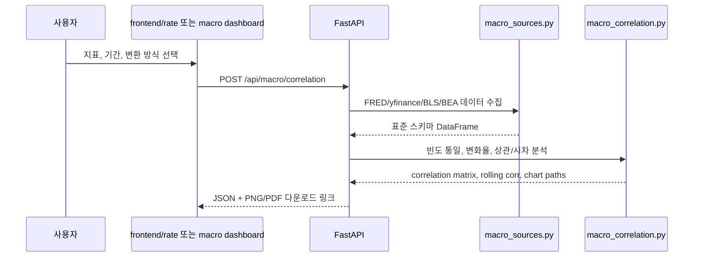

**추천 API 설계**

| 엔드포인트 | 메서드 | 역할 |
|---|---|---|
| `/api/macro/indicators` | `GET` | 사용 가능한 지표 목록과 출처 반환 |
| `/api/macro/history` | `POST` | 선택 지표의 표준화된 시계열 반환 |
| `/api/macro/correlation` | `POST` | 상관계수 행렬과 히트맵 생성 |
| `/api/macro/rolling-correlation` | `POST` | 두 지표의 롤링 상관계수 반환 |
| `/api/macro/lag-correlation` | `POST` | 선행·후행 상관관계 계산 |
| `/api/macro/report` | `POST` | Markdown/PDF 리포트 생성 |

**요청 예시**

```python
import requests

payload = {
    "indicators": ["WTI", "DollarIndex", "US10Y", "SP500", "US_CPI", "US_UNRATE"],
    "start": "2020-01-01",
    "end": "2024-12-31",
    "frequency": "M",
    "transforms": {
        "WTI": "return",
        "DollarIndex": "return",
        "US10Y": "diff",
        "SP500": "return",
        "US_CPI": "yoy",
        "US_UNRATE": "diff",
    },
}

response = requests.post("http://localhost:8000/api/macro/correlation", json=payload)
print(response.json())
```

**응답 예시**

```python
{
    "period": {"start": "2020-01-01", "end": "2024-12-31"},
    "frequency": "M",
    "columns": ["WTI_ret", "DollarIndex_ret", "US10Y_diff", "SP500_ret", "US_CPI_yoy"],
    "correlation": [[1.0, -0.25, 0.31, 0.18, 0.42], "..."],
    "chart": "static/reports/macro_correlation.png",
    "warnings": [
        "GDP는 분기 자료라 월별로 forward-fill 처리했습니다.",
        "상관관계는 인과관계를 의미하지 않습니다."
    ]
}
```

---

#### 5-12. 리포트 작성 템플릿

실습 결과는 아래 형식으로 `macro_report.md`에 정리합니다.

```markdown
# 주요 경제지표 상관관계 분석 리포트

## 1. 분석 조건

> 📺 [🎬 분석 조건](https://www.youtube.com/results?search_query=분석+조건+한국어)

- 기간:
- 사용 데이터:
- 데이터 출처:
- 빈도 변환:
- 결측 처리:

## 2. 주요 결과

> 📺 [🎬 주요 결과](https://www.youtube.com/results?search_query=주요+결과+한국어)

- 가장 강한 양의 상관:
- 가장 강한 음의 상관:
- 롤링 상관관계가 크게 바뀐 시점:
- 시차 상관관계에서 확인한 선행 후보:

## 3. 해석

> 📺 [🎬 해석](https://www.youtube.com/results?search_query=해석+한국어)

- 물가와 유가:
- 달러와 주식:
- 금리와 주식:
- 실업률/GDP와 위험자산:

## 4. 한계

> 📺 [🎬 한계](https://www.youtube.com/results?search_query=한계+한국어)

- 상관관계는 인과관계가 아님
- 월별/분기별 데이터 정렬 방식에 따라 결과가 달라질 수 있음
- 선물/현물/지수 데이터 정의 차이를 확인해야 함
```

---

#### 5-13. 실습 체크리스트

- [ ] `macro_market_daily.csv` 생성
- [ ] `macro_fred_raw.csv` 생성
- [ ] `macro_analysis_monthly.csv` 생성
- [ ] `macro_correlation.csv` 생성
- [ ] `macro_correlation.png` 생성
- [ ] `macro_rolling_corr.png` 생성
- [ ] `macro_lag_correlation.png` 생성
- [ ] `macro_report.md` 작성
- [ ] 데이터 출처, 조회일, 결측 처리 방식 기록

---

## 해보기 활동

> 📺 [🎬 해보기 활동](https://www.youtube.com/results?search_query=해보기+활동+한국어)

1. FRED에서 `CPIAUCSL`, `PPIACO`, `UNRATE`, `GDPC1`, `DGS10`, `T10Y2Y`를 수집하고 각 지표의 주기와 단위를 표로 정리하세요.
2. yfinance에서 `CL=F`, `DX-Y.NYB`, `GC=F`, `^GSPC`, `^KS11`, `KRW=X`를 수집해 월별 수익률 데이터로 변환하세요.
3. 유가(`WTI_ret`)와 CPI(`US_CPI_yoy`)의 전체 기간 상관계수와 12개월 롤링 상관계수를 비교하세요.
4. 달러인덱스와 S&P500, USD/KRW와 KOSPI의 상관계수를 비교하고 한국 시장에서 환율 변수가 더 민감했는지 해석하세요.
5. 장단기금리차(`T10Y2Y`)와 S&P500의 시차 상관관계를 계산해, 어느 lag에서 절댓값이 가장 큰지 확인하세요.
6. 상관계수가 높은 지표쌍 2개를 골라 산점도와 회귀선을 그리고, 경제적 해석과 한계를 각각 3문장으로 정리하세요.
7. 위 결과를 `macro_report.md` 형식으로 정리하고, 웹앱에 `/api/macro/correlation`을 추가한다면 필요한 입력값과 출력값을 설계하세요.

---

# 소부장이란?

**소부장**은 ‘소재·부품·장비’의 줄임말로, 반도체·배터리·디스플레이·자동차 등 한국 제조업의 핵심 기반을 뜻합니다.  
특히 2019년 일본의 반도체 소재 수출 규제 이후 기술 자립과 공급망 안정화를 위해 국가적으로 강조된 개념입니다.

---

## 📌 소부장의 의미
- **소재**: 제품을 만드는 원재료 (예: 실리콘 웨이퍼, OLED 발광 소재).
- **부품**: 소재를 가공해 완제품에 들어가는 기능 단위 (예: 카메라 모듈, 메모리 반도체).
- **장비**: 소재·부품을 생산·조립하는 기계 및 설비 (예: 반도체 노광 장비, 디스플레이 증착 장비).

---

## ⚙️ 왜 중요한가?
- 산업 경쟁력 강화: 핵심 소재·부품을 안정적으로 공급 → 완제품 품질 향상
- 경제 안보: 해외 의존도를 줄여 공급망 위기 대응
- 성장 동력: 첨단 기술 확보 시 자체적으로 수출 산업으로 발전 가능

---

## 🔑 소부장과 한국 산업
- 반도체 소부장: 삼성전자·SK하이닉스에 장비·소재 납품 (EUV 공정 장비, HBM용 소재)
- 배터리 소부장: 전기차 배터리용 양극재·음극재·전해액
- 디스플레이 소부장: OLED 패널용 필름, 증착 장비

---

## 📊 소부장 관련 기업 예시

| 기업 | 산업군 | 주요 제품 |
|---|---|---|
| 삼성전자 | 반도체 | 메모리, 칩셋 |
| 엘앤에프 | 소재 | 2차전지 양극재 |
| 원익IPS | 장비 | 반도체 제조 장비 |
| 에코프로비엠 | 소재 | 전기차 배터리 소재 |
| 한화에어로스페이스 | 부품 | 항공기·방산 부품 |

---

## 🚨 투자·경제적 관점
- 정부 지원: R&D 세제 혜택, 국책 과제 참여 기업에 자금 지원
- 투자 전략: 개별 종목 대신 소부장 ETF (예: KODEX 반도체소부장, TIGER 소부장) 활용 가능
- 위험 요소: 대기업보다 변동성 큼 → 분할 매수 권장

