# Day 044 — 거시경제 상황 분석 실습

> **모듈 7: 투자분석 기초 방법론** | 3/10일차 | 💹 | 학습시간: 8시간

---

> 📺 **YouTube 강의**: [🎬 거시경제 상황 분석 실습](https://www.youtube.com/results?search_query=거시경제+분석+실습+경제지표+파이썬+한국어)

## 오늘 배울 것

- 경기 사이클(Expansion, Peak, Contraction, Trough) 이해
- 경기 선행/동행/후행 지표
- 통화량(M1, M2)과 유동성 분석
- 실습: 거시경제 대시보드 구성 및 현황 분석

---

## 🗓 세부 일정 (1일 8시간)

> **강의 5시간** (5개 단락 × 50분 + 도입·마무리 50분) + **실습 3시간** = 총 8시간

| 시간 | 구분 | 내용 | 형태 |
|------|------|------|------|
| 09:00 – 09:10 | 도입 | 오늘 학습 목표 확인 | 강의 |
| 09:10 – 09:30 | **1단락** 설명 20분 | 경기 사이클(Expansion, Peak, Contraction, Trough) 이해 | 강의 |
| 09:30 – 10:00 | 각자 정리 & 유튜브 30분 | 노트 정리 · 관련 영상 검색 | 자율 |
| 10:00 – 10:20 | **2단락** 설명 20분 | 경기 선행/동행/후행 지표 | 강의 |
| 10:20 – 10:50 | 각자 정리 & 유튜브 30분 | 노트 정리 · 관련 영상 검색 | 자율 |
| 10:50 – 11:00 | ☕ 휴식 | — | — |
| 11:00 – 11:20 | **3단락** 설명 20분 | 통화량(M1, M2)과 유동성 분석 | 강의 |
| 11:20 – 11:50 | 각자 정리 & 유튜브 30분 | 노트 정리 · 관련 영상 검색 | 자율 |
| 11:50 – 12:10 | **4단락** 설명 20분 | 거시경제 대시보드 설계 및 지표 선정 | 강의 |
| 12:10 – 12:40 | 각자 정리 & 유튜브 30분 | 노트 정리 · 관련 영상 검색 | 자율 |
| 12:40 – 13:00 | **5단락** 설명 20분 | 경기국면 점수화 및 위험 경보 시스템 | 강의 |
| 13:00 – 13:30 | 각자 정리 & 유튜브 30분 | 노트 정리 · 관련 영상 검색 | 자율 |
| 13:30 – 14:00 | 강의 마무리 | Q&A · 핵심 복습 | 강의 |
| 14:00 – 15:00 | 💻 **실습 1부** 60분 | 대시보드 1~3단계 구현 (시장 데이터·변화율·FRED 지표 수집) | 실습 |
| 15:00 – 15:10 | ☕ 휴식 | — | — |
| 15:10 – 16:00 | 💻 **실습 2부** 50분 | 경기국면 점수화·위험 경보·대시보드 레이아웃 구현 | 실습 |
| 16:00 – 16:10 | ☕ 휴식 | — | — |
| 16:10 – 17:00 | 💻 **실습 발표 & 리뷰** 50분 | 코드 리뷰 · 발표 · 피드백 | 실습 |

> 강의 5시간: 도입 10분 + 단락 5개×50분 + 마무리 30분 = **300분**  
> 실습 3시간: 1부 60분 + 휴식 10분 + 2부 50분 + 휴식 10분 + 발표·리뷰 50분 = **180분**

---

## 🔗 참고 사이트 & 데이터 원천

> 이 문서(거시경제 상황 분석·경기사이클·통화량)의 실습에 필요한 공식 데이터 출처와 참고 사이트입니다. ⚿ 는 API 키 또는 승인이 필요한 항목입니다.

### 📊 국내 공식 데이터

| 기관 | URL | API 키 | 제공 데이터 |
|------|-----|--------|-------------|
| 한국은행 ECOS | <https://ecos.bok.or.kr> | ⚿ 필요 | M1/M2 통화량, 경기종합지수, 기준금리 |
| 통계청 KOSIS | <https://kosis.kr> | ⚿ 권장 | GDP 성장률, 고용, 산업생산지수 |
| 기획재정부 경제통계 | <https://www.moef.go.kr> | 불필요(웹 조회) | 경기동향·재정 현황 |
| 공공데이터포털 | <https://www.data.go.kr> | ⚿ 필요 | 경기선행·동행·후행지수 API |
| 금융위원회 | <https://www.fsc.go.kr> | 불필요(웹 조회) | 금융안정 보고서, 거시건전성 지표 |
| 금융감독원(FSS) | <https://www.fss.or.kr> | 불필요(웹 조회) | 거시 금융 감독 통계 |

### 🌍 해외 공식 데이터

| 기관 | URL | API 키 | 제공 데이터 |
|------|-----|--------|-------------|
| FRED (St. Louis Fed) | <https://fred.stlouisfed.org> | ⚿ 권장 | M1/M2, 경기선행지수, 실업률, ISM 지수 |
| OECD Composite Leading Indicators | <https://data.oecd.org> | 불필요 | 국가별 경기선행지수(CLI) |
| World Bank | <https://data.worldbank.org> | 불필요 | GDP·성장률·국제수지 장기 시계열 |
| IMF Data (WEO) | <https://www.imf.org/en/Data> | 불필요 | 세계경제전망, 국가별 경기사이클 |
| Conference Board (미국) | <https://www.conference-board.org> | 불필요(웹 조회) | 미국 경기선행지수(LEI) |

### 📈 차트 & 뉴스 참고

| 분류 | 사이트 | URL | 활용 용도 |
|------|--------|-----|-----------|
| 차트 플랫폼 | TradingView | <https://www.tradingview.com> | 경기지표·시장 종합 차트 |
| 차트 플랫폼 | Investing.com | <https://www.investing.com> | 경제 캘린더·경기지표 발표 일정 |
| 금융 포탈 | 네이버 금융 | <https://finance.naver.com> | 국내 경기·지수 현황 |
| 금융 미디어 | 머니투데이 방송(MTN) | <https://mtn.co.kr> | 경기사이클·통화량 뉴스 해설 |
| 금융 미디어 | 한국경제TV(WOW TV) | <https://www.wowtv.co.kr> | 거시경제 분석 방송 |
| 연구기관 | 한국개발연구원(KDI) | <https://www.kdi.re.kr> | 경기 전망·분석 보고서 |
| 연구기관 | 한국금융연구원(KIF) | <https://www.kif.re.kr> | 금융·거시경제 연구 보고서 |

---

### 1. 경기 사이클(Expansion, Peak, Contraction, Trough) 이해

> 📖 **Wikipedia**: [경기 순환](https://ko.wikipedia.org/wiki/경기_순환) · [경기침체](https://ko.wikipedia.org/wiki/경기침체)

경기는 끊임없이 순환합니다. 이 사이클을 이해하면 **지금이 어느 국면인지** 파악해 투자 전략을 조정할 수 있습니다.

**4단계 경기 사이클**

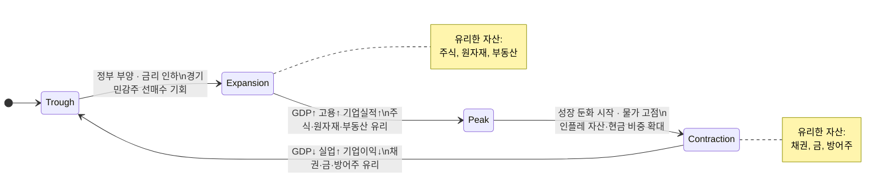

**국면별 투자 전략 요약**

| 국면 | 경제 특징 | 유리한 자산 |
|------|-----------|-------------|
| **Expansion(확장)** | GDP↑, 고용↑, 기업실적↑ | 주식, 원자재, 부동산 |
| **Peak(정점)** | 성장 둔화 시작, 물가 고점 | 인플레 자산, 현금 비중 확대 |
| **Contraction(수축)** | GDP↓, 실업↑, 기업이익↓ | 채권, 금, 방어주 |
| **Trough(저점)** | 침체 바닥, 정부 부양 시작 | 경기민감주 선매수 기회 |

> 📺 [🎬 경기 사이클 투자 전략](https://www.youtube.com/results?search_query=경기사이클+투자전략+확장+수축+한국어)

**경기 사이클별 섹터 로테이션**

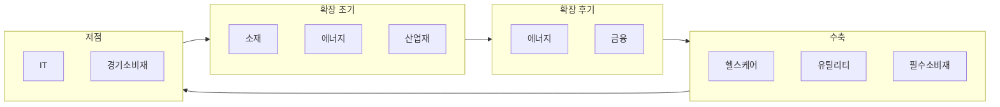

| 국면 | 유리한 섹터 | 불리한 섹터 |
|------|-------------|-------------|
| 확장 초기 | 소재, 에너지, 산업재 | 유틸리티, 필수소비재 |
| 확장 후기 | 에너지, 금융 | 기술, 소비재 |
| 수축 | 헬스케어, 유틸리티, 필수소비재 | 에너지, 소재, 금융 |
| 저점 | IT, 경기소비재 | 필수소비재 |

> 📺 [🎬 섹터 로테이션 경기 사이클](https://www.youtube.com/results?search_query=섹터로테이션+경기사이클+주식투자+한국어)

#### 🔗 Python 소스 연계

웹앱의 **거시경제현황 2 (시뮬레이션)** 탭은 GBM 기반 4단계 경기 사이클을 직접 시뮬레이션합니다. 각 국면은 `mu` 배수로 구현됩니다.

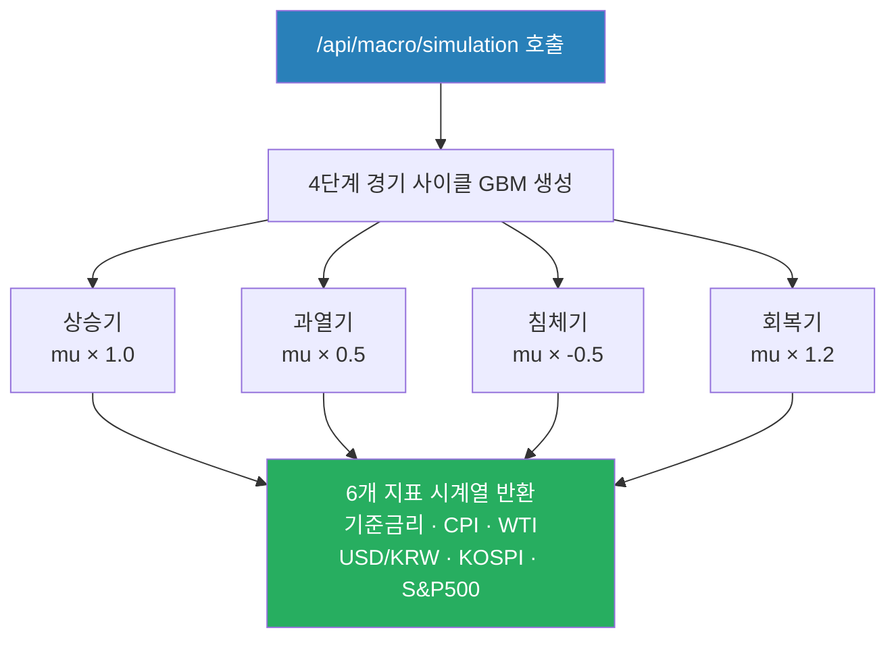

```python
# 웹앱 시뮬레이션 API 호출 예시
import requests

# 1년(252 영업일) 시뮬레이션
response = requests.post("http://localhost:8000/api/macro/simulation", json={
    "n_days": 252,
    "seed": 42       # 동일 seed → 재현 가능
})
data = response.json()
# data["image"] : 6개 지표 멀티 패널 차트 (base64 PNG)
```

---

### 2. 경기 선행/동행/후행 지표

> 📖 **Wikipedia**: [경기종합지수](https://ko.wikipedia.org/wiki/경기종합지수) · [구매관리자지수](https://ko.wikipedia.org/wiki/구매관리자지수)

경기지표는 **언제 경기를 반영하는지**에 따라 세 가지로 나뉩니다.

**3종 지표의 시간 관계**

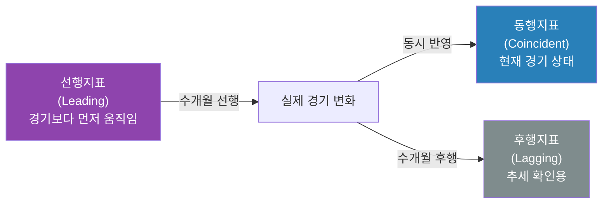

**선행지표 (Leading Indicators)**

경기보다 먼저 움직이는 지표 — 미래 경기를 예측하는 데 활용합니다.

| 지표 | 설명 |
|------|------|
| 주가지수 | 미래 기업 실적 기대를 반영 |
| 건축허가 건수 | 미래 건설투자 선행 |
| ISM 제조업 PMI | 기업 구매관리자 경기 전망 |
| 소비자 기대지수 | 향후 소비 의향 반영 |
| 장단기 금리 스프레드 | 역전 시 경기침체 신호 |

**장단기 금리 역전 → 경기침체 경로**


> 📺 [🎬 경기선행지수 PMI 금리스프레드 설명](https://www.youtube.com/results?search_query=경기선행지수+PMI+금리스프레드+경기예측+한국어)

**동행지표 (Coincident Indicators)**

현재 경기 상황을 나타내는 지표입니다.

| 지표 | 설명 |
|------|------|
| GDP | 현재 경제 규모 |
| 산업생산지수 | 실제 생산량 현황 |
| 취업자 수 | 노동시장 실제 상태 |
| 소매판매 | 실제 소비 상황 |

**후행지표 (Lagging Indicators)**

경기 변화 후 나중에 반영되는 지표 — 추세 확인용입니다.

| 지표 | 설명 |
|------|------|
| 실업률 | 해고 후 한참 지나서 반영 |
| 대출 잔액 | 경기 이후 금융 반응 |
| CPI | 물가는 경기 후행 |

> 📺 [🎬 경기 선행 동행 후행 지표 차이](https://www.youtube.com/results?search_query=경기+선행지표+동행지표+후행지표+투자+한국어)

#### 🔗 Python 소스 연계

장단기 금리 스프레드(경기침체 선행 신호)를 실시간으로 조회하는 방법입니다.

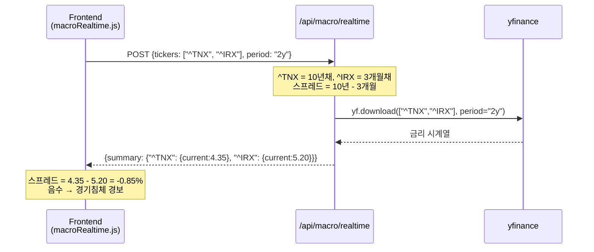

---

### 3. 통화량(M1, M2)과 유동성 분석

> 📖 **Wikipedia**: [통화량](https://ko.wikipedia.org/wiki/통화량) · [유동성](https://ko.wikipedia.org/wiki/유동성_(경제학)) · [양적 완화](https://ko.wikipedia.org/wiki/양적_완화)

**통화량의 종류**

중앙은행은 얼마나 많은 돈이 경제에 돌아다니는지를 단계별로 측정합니다.

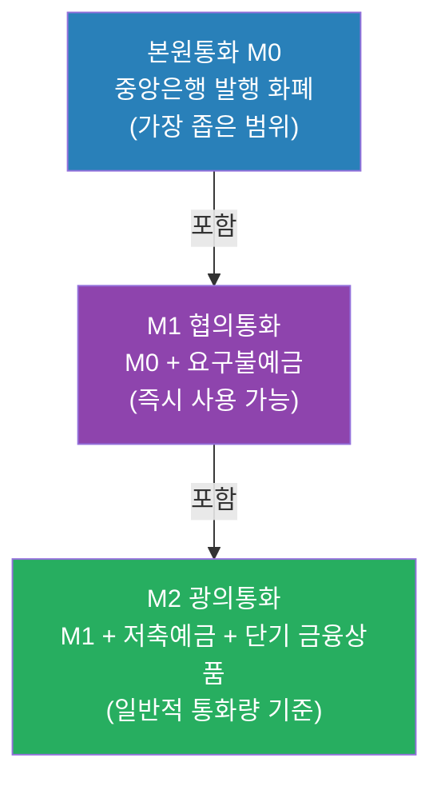

| 구분 | 포함 내용 | 특징 |
|------|-----------|------|
| **본원통화(M0)** | 중앙은행이 발행한 화폐 | 가장 좁은 범위 |
| **M1 (협의통화)** | 현금 + 요구불예금 | 즉시 사용 가능한 돈 |
| **M2 (광의통화)** | M1 + 저축예금 + 단기 금융상품 | 일반적인 통화량 기준 |

> 📺 [🎬 통화량 M1 M2 유동성 설명](https://www.youtube.com/results?search_query=통화량+M1+M2+유동성+중앙은행+한국어)

**양적완화(QE)와 양적긴축(QT) 파급 경로**

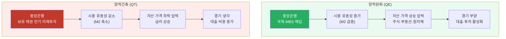

> 📺 [🎬 양적완화 양적긴축 차이 주식](https://www.youtube.com/results?search_query=양적완화+양적긴축+QE+QT+주식시장+한국어)

**M2 증가율과 자산 시장 관계**

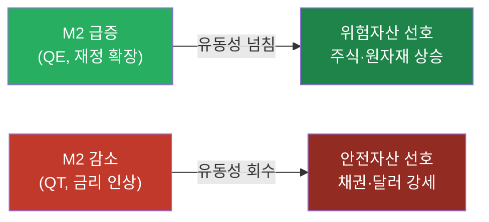

#### 🔗 Python 소스 연계

통화량 M2 데이터는 yfinance가 아닌 FRED(연방준비은행 경제 데이터)에서 제공됩니다. 웹앱 시뮬레이션은 M2 효과를 GBM의 드리프트 파라미터(mu)로 모델링합니다.

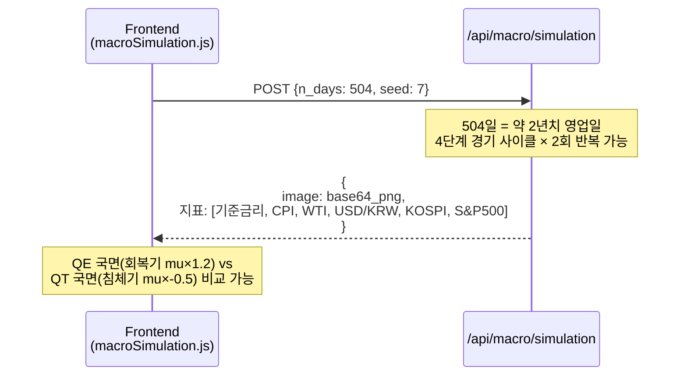

---

### 4. 실습: 거시경제 대시보드 구성 및 현황 분석

이번 실습은 단순한 6개 차트 모음에서 출발해, **경기국면 판정·위험 경보·시나리오 분석·웹 대시보드·리포트 출력**까지 확장할 수 있는 형태로 고도화합니다.

---

#### 4-1. 완성 목표

최종 산출물은 아래와 같습니다.

| 산출물 | 파일/화면 | 설명 |
|---|---|---|
| 원천 데이터 | `macro_dashboard_raw.csv` | yfinance/FRED/ECOS 등에서 수집한 원자료 |
| 분석 데이터 | `macro_dashboard_features.csv` | 변화율, 이동평균, z-score, 스프레드, 경기 점수 |
| 이미지 대시보드 | `macro_dashboard.png` | 주요 지표 6~9개 패널 차트 |
| 신호 테이블 | `macro_signal_table.csv` | 선행/동행/후행 지표별 상태와 점수 |
| 리포트 | `macro_dashboard_report.md` | 현재 경기국면 해석, 위험요인, 투자 아이디어 |
| 웹 API 설계 | `/api/macro/dashboard` | 대시보드 데이터·차트·경보 반환 |

**핵심 질문**

1. 지금은 확장, 정점, 수축, 저점 중 어느 국면에 가까운가?
2. 선행지표는 경기 둔화 또는 회복을 먼저 말하고 있는가?
3. 금리, 유가, 달러, VIX 중 위험 신호가 강한 것은 무엇인가?
4. 유동성(M2)과 위험자산(S&P500/KOSPI)은 같은 방향으로 움직이는가?
5. 대시보드의 결론을 투자 행동으로 연결한다면 무엇을 줄이고 무엇을 늘릴 것인가?

---

#### 4-2. 대시보드 지표 설계

대시보드는 지표를 많이 넣는 것보다 **선행·동행·후행·시장심리·유동성**으로 역할을 나누는 것이 중요합니다.

| 분류 | 지표 | 예시 코드/티커 | 주기 | 해석 포인트 |
|---|---|---|---|---|
| 선행 | 장단기 금리차 | FRED `T10Y2Y`, `T10Y3M` | 일별 | 음수면 경기침체 경보 |
| 선행 | VIX | yfinance `^VIX`, FRED `VIXCLS` | 일별 | 급등 시 위험회피 심리 |
| 선행 | 주가지수 | `^GSPC`, `^KS11` | 일별 | 미래 이익 기대 반영 |
| 선행 | 소비심리 | FRED `UMCSENT` | 월별 | 소비 둔화/회복 확인 |
| 동행 | 산업생산 | FRED `INDPRO` | 월별 | 현재 생산활동 |
| 동행 | 고용 | FRED `PAYEMS` | 월별 | 현재 경기 체력 |
| 후행 | 실업률 | FRED `UNRATE` | 월별 | 경기 악화 확인 |
| 후행 | CPI | FRED `CPIAUCSL` | 월별 | 물가 압력과 정책 제약 |
| 유동성 | M2 | FRED `M2SL` | 월별 | QE/QT, 유동성 환경 |
| 원자재 | WTI, 금 | `CL=F`, `GC=F` | 일별 | 인플레/위험회피 신호 |
| 환율 | 달러인덱스, USD/KRW | `DX-Y.NYB`, `KRW=X` | 일별 | 달러 유동성·외국인 수급 |

한국 중심 대시보드로 확장할 때는 ECOS/KOSIS에서 기준금리, 원/달러 환율, M2, CPI, 실업률, 수출입, 산업생산 코드를 찾아 같은 구조로 붙입니다.

---

#### 4-3. 환경 변수와 추가 패키지

빠른 실습은 `yfinance`만으로 가능하지만, 경기국면 판정을 고도화하려면 FRED API Key를 추가합니다.

```bash
FRED_API_KEY=발급받은_FRED_KEY
BOK_API_KEY=발급받은_ECOS_KEY
KOSIS_API_KEY=발급받은_KOSIS_KEY
```

```bash
pip install requests seaborn plotly statsmodels reportlab
```

---

#### 4-4. 1단계: 시장 데이터 대시보드 만들기

API Key 없이 바로 실행할 수 있는 기본 버전입니다.

```python
import yfinance as yf
import pandas as pd
import matplotlib.pyplot as plt
import matplotlib.gridspec as gridspec

MARKET_INDICATORS = {
    "SP500": "^GSPC",
    "KOSPI": "^KS11",
    "US10Y": "^TNX",
    "WTI": "CL=F",
    "Gold": "GC=F",
    "DollarIndex": "DX-Y.NYB",
    "USDKRW": "KRW=X",
    "VIX": "^VIX",
}

def fetch_yfinance_panel(tickers, start="2020-01-01", end="2024-12-31"):
    data = {}
    for name, ticker in tickers.items():
        raw = yf.download(ticker, start=start, end=end, auto_adjust=True, progress=False)
        if raw.empty:
            print(f"skip: {name} ({ticker})")
            continue
        data[name] = raw["Close"]
    return pd.DataFrame(data).sort_index()

market_df = fetch_yfinance_panel(MARKET_INDICATORS)
market_df.to_csv("macro_dashboard_raw.csv", encoding="utf-8-sig")

fig = plt.figure(figsize=(16, 12))
fig.suptitle("Macro Dashboard: Market Indicators", fontsize=16, fontweight="bold")
gs = gridspec.GridSpec(4, 2, figure=fig, hspace=0.45, wspace=0.25)

colors = ["steelblue", "navy", "crimson", "darkorange", "goldenrod", "seagreen", "purple", "gray"]
for idx, col in enumerate(market_df.columns):
    ax = fig.add_subplot(gs[idx // 2, idx % 2])
    series = market_df[col].dropna()
    ax.plot(series.index, series.values, color=colors[idx % len(colors)], linewidth=1.2)
    ax.set_title(col)
    ax.grid(True, alpha=0.3)
    ax.tick_params(axis="x", rotation=25, labelsize=8)

plt.savefig("macro_dashboard.png", dpi=150, bbox_inches="tight")
plt.show()
```

---

#### 4-5. 2단계: 변화율·변동성·z-score 계산

대시보드는 단순 현재값보다 “최근 변화가 평소보다 큰가?”를 보여줘야 합니다.

```python
def make_market_features(df):
    monthly = df.resample("M").last()
    returns_1m = monthly.pct_change(1)
    returns_3m = monthly.pct_change(3)
    returns_12m = monthly.pct_change(12)
    vol_3m = df.pct_change().rolling(63).std() * (252 ** 0.5)
    zscore = (monthly - monthly.rolling(36).mean()) / monthly.rolling(36).std()

    latest_rows = []
    for col in monthly.columns:
        latest_rows.append({
            "indicator": col,
            "latest": monthly[col].dropna().iloc[-1],
            "return_1m": returns_1m[col].dropna().iloc[-1],
            "return_3m": returns_3m[col].dropna().iloc[-1],
            "return_12m": returns_12m[col].dropna().iloc[-1],
            "vol_3m": vol_3m[col].dropna().iloc[-1] if col in vol_3m else None,
            "zscore_36m": zscore[col].dropna().iloc[-1],
        })
    return pd.DataFrame(latest_rows), monthly, returns_1m, zscore

signal_table, monthly_market, monthly_returns, market_zscore = make_market_features(market_df)
signal_table.to_csv("macro_signal_table.csv", index=False, encoding="utf-8-sig")
print(signal_table)
```

**z-score 해석**

| z-score | 해석 |
|---|---|
| `2 이상` | 과열 또는 극단적 강세 |
| `1 ~ 2` | 평균보다 강함 |
| `-1 ~ 1` | 보통 범위 |
| `-2 ~ -1` | 평균보다 약함 |
| `-2 이하` | 극단적 약세 또는 스트레스 |

---

#### 4-6. 3단계: FRED로 경기·유동성 지표 추가

FRED 지표를 붙이면 시장 가격뿐 아니라 경기의 실제 체력까지 볼 수 있습니다.

```python
import os
import requests

FRED_API_KEY = os.getenv("FRED_API_KEY")

FRED_SERIES = {
    "YieldSpread_10Y2Y": "T10Y2Y",
    "YieldSpread_10Y3M": "T10Y3M",
    "M2": "M2SL",
    "CPI": "CPIAUCSL",
    "Unemployment": "UNRATE",
    "IndustrialProduction": "INDPRO",
    "Payrolls": "PAYEMS",
    "ConsumerSentiment": "UMCSENT",
    "VIX_FRED": "VIXCLS",
}

def fetch_fred(series_id, start="2020-01-01", end="2024-12-31"):
    url = "https://api.stlouisfed.org/fred/series/observations"
    params = {
        "series_id": series_id,
        "api_key": FRED_API_KEY,
        "file_type": "json",
        "observation_start": start,
        "observation_end": end,
    }
    data = requests.get(url, params=params, timeout=20).json()
    rows = data.get("observations", [])
    frame = pd.DataFrame(rows)
    if frame.empty:
        return pd.Series(dtype="float64", name=series_id)
    values = pd.to_numeric(frame["value"].replace(".", pd.NA), errors="coerce")
    return pd.Series(values.values, index=pd.to_datetime(frame["date"]), name=series_id).dropna()

fred_df = pd.DataFrame({
    name: fetch_fred(series_id)
    for name, series_id in FRED_SERIES.items()
})

fred_monthly = fred_df.resample("M").last().ffill()
fred_monthly.to_csv("macro_fred_dashboard.csv", encoding="utf-8-sig")
```

---

#### 4-7. 4단계: 경기국면 점수화

아래 규칙은 학습용 예시입니다. 실제 운용에서는 기준값과 가중치를 검증해야 합니다.

| 항목 | 확장 신호 | 수축 신호 |
|---|---|---|
| 주식 | S&P500 6개월 수익률 `> 0` | S&P500 6개월 수익률 `< 0` |
| 변동성 | VIX `< 20` | VIX `> 25` |
| 금리차 | `T10Y2Y > 0` | `T10Y2Y < 0` |
| 물가 | CPI YoY 둔화 | CPI YoY 가속 |
| 고용 | 실업률 하락 | 실업률 상승 |
| 유동성 | M2 YoY 상승 | M2 YoY 둔화/감소 |

```python
def classify_cycle(market_monthly, fred_monthly):
    features = pd.DataFrame(index=fred_monthly.index)
    features["sp500_6m"] = market_monthly["SP500"].pct_change(6)
    features["vix"] = market_monthly["VIX"].resample("M").last()
    features["spread_10y2y"] = fred_monthly["YieldSpread_10Y2Y"]
    features["cpi_yoy"] = fred_monthly["CPI"].pct_change(12)
    features["cpi_yoy_diff"] = features["cpi_yoy"].diff()
    features["unrate_diff_3m"] = fred_monthly["Unemployment"].diff(3)
    features["m2_yoy"] = fred_monthly["M2"].pct_change(12)

    score = pd.Series(0, index=features.index, dtype="float64")
    score += (features["sp500_6m"] > 0).astype(int)
    score += (features["vix"] < 20).astype(int)
    score += (features["spread_10y2y"] > 0).astype(int)
    score += (features["cpi_yoy_diff"] < 0).astype(int)
    score += (features["unrate_diff_3m"] < 0).astype(int)
    score += (features["m2_yoy"] > 0).astype(int)

    features["macro_score"] = score
    features["cycle"] = pd.cut(
        score,
        bins=[-1, 1, 3, 4, 6],
        labels=["Contraction", "Trough/Recovery", "Expansion", "Peak/Overheat"],
    )
    return features

cycle_df = classify_cycle(monthly_market, fred_monthly)
cycle_df.to_csv("macro_dashboard_features.csv", encoding="utf-8-sig")
print(cycle_df.tail(12)[["macro_score", "cycle"]])
```

**점수 해석**

| 점수 | 국면 후보 | 대시보드 메시지 |
|---|---|---|
| `0~1` | 수축 | 위험자산 방어, 현금·채권·금 점검 |
| `2~3` | 저점/회복 | 경기민감주와 주식 비중 회복 검토 |
| `4` | 확장 | 주식·원자재 우호, 과열 지표 감시 |
| `5~6` | 정점/과열 | 인플레·금리·VIX 급등 위험 관리 |

---

#### 4-8. 5단계: 위험 경보 만들기

대시보드에는 사용자가 바로 볼 수 있는 경보가 필요합니다.

```python
def build_alerts(latest):
    alerts = []
    if latest.get("spread_10y2y", 0) < 0:
        alerts.append({"level": "warning", "message": "장단기 금리차가 역전되어 경기 둔화 위험이 높습니다."})
    if latest.get("vix", 0) > 25:
        alerts.append({"level": "danger", "message": "VIX가 25를 넘어 시장 스트레스가 높습니다."})
    if latest.get("cpi_yoy_diff", 0) > 0:
        alerts.append({"level": "warning", "message": "CPI YoY 상승세가 재가속되고 있습니다."})
    if latest.get("m2_yoy", 0) < 0:
        alerts.append({"level": "warning", "message": "M2 증가율이 음수로 유동성 축소 압력이 있습니다."})
    if not alerts:
        alerts.append({"level": "normal", "message": "주요 위험 경보가 제한적입니다."})
    return alerts

latest_features = cycle_df.dropna().iloc[-1].to_dict()
alerts = build_alerts(latest_features)
print(alerts)
```

---

#### 4-9. 6단계: 고도화 대시보드 레이아웃

웹 화면은 차트를 많이 쌓기보다, 반복적으로 판단하기 쉬운 정보 구조가 좋아야 합니다.

```text
상단 컨트롤
  - 국가: US / KR / Global
  - 기간: 1Y / 3Y / 5Y / 10Y
  - 기준 빈도: D / M / Q
  - 보기 모드: 시장 / 경기 / 유동성 / 전체

1행: 현재 국면 요약
  - 경기국면 배지: Expansion, Peak, Contraction, Trough
  - Macro Score
  - 주요 경보 3개
  - 데이터 기준일

2행: KPI 카드
  - S&P500 6M
  - 10Y-2Y Spread
  - CPI YoY
  - Unemployment
  - M2 YoY
  - VIX

3행: 시계열 차트
  - 주식/금리/유가/달러/VIX
  - M2와 주가지수 비교
  - CPI와 금리 비교

4행: 분석 차트
  - 경기국면 점수 추이
  - 상관관계 히트맵
  - 롤링 상관관계
  - 시나리오별 시뮬레이션 비교

출력
  - CSV 다운로드
  - PNG 저장
  - Markdown/PDF 리포트 생성
```

---

#### 4-10. 웹앱/API 고도화 설계

현재 웹앱의 `/api/macro/realtime`, `/api/macro/simulation`을 아래처럼 확장합니다.

| 엔드포인트 | 메서드 | 역할 |
|---|---|---|
| `/api/macro/dashboard` | `POST` | 대시보드 전체 데이터, KPI, 경보 반환 |
| `/api/macro/cycle-score` | `POST` | 경기국면 점수와 국면 후보 반환 |
| `/api/macro/liquidity` | `POST` | M2, 금리, 주가지수 유동성 분석 |
| `/api/macro/alerts` | `POST` | 위험 경보만 빠르게 반환 |
| `/api/macro/dashboard/report` | `POST` | Markdown/PDF 리포트 생성 |

**요청 예시**

```python
import requests

payload = {
    "country": "US",
    "start": "2020-01-01",
    "end": "2024-12-31",
    "frequency": "M",
    "market_indicators": ["SP500", "US10Y", "WTI", "Gold", "DollarIndex", "VIX"],
    "macro_indicators": ["T10Y2Y", "M2SL", "CPIAUCSL", "UNRATE", "INDPRO"],
}

result = requests.post("http://localhost:8000/api/macro/dashboard", json=payload).json()
print(result["cycle"])
print(result["alerts"])
```

**응답 예시**

```python
{
    "as_of": "2024-12-31",
    "cycle": {"score": 3, "label": "Trough/Recovery"},
    "kpis": {
        "sp500_6m": 0.08,
        "spread_10y2y": -0.25,
        "cpi_yoy": 0.032,
        "unemployment": 3.9,
        "m2_yoy": 0.015,
        "vix": 16.5
    },
    "alerts": [
        {"level": "warning", "message": "장단기 금리차가 역전되어 경기 둔화 위험이 높습니다."}
    ],
    "charts": {
        "dashboard_png": "static/reports/macro_dashboard.png",
        "cycle_score_png": "static/reports/macro_cycle_score.png"
    }
}
```

**권장 파일 구조**

```text
app
├── backend
│   ├── services
│   │   ├── macro_sources.py       # yfinance/FRED/ECOS/KOSIS 수집
│   │   ├── macro_features.py      # 변화율, z-score, 스프레드
│   │   ├── macro_cycle.py         # 경기국면 점수화
│   │   ├── macro_alerts.py        # 위험 경보 생성
│   │   └── macro_report.py        # 리포트 생성
│   └── main.py
└── frontend
    └── js
        └── views
            └── macroDashboard.js
```

---

#### 4-11. 시뮬레이션 탭 고도화

`/api/macro/simulation`은 학습용으로 매우 좋습니다. 고도화 방향은 사용자가 경기 충격을 직접 조정하게 만드는 것입니다.

| 파라미터 | 예시 | 의미 |
|---|---|---|
| `n_days` | `504` | 시뮬레이션 기간 |
| `seed` | `42` | 재현 가능한 난수 |
| `inflation_shock` | `0.3` | 물가 충격 강도 |
| `rate_shock` | `0.2` | 금리 충격 강도 |
| `oil_shock` | `-0.15` | 유가 충격 |
| `risk_aversion` | `0.4` | VIX/주가 변동성 확대 |

```python
import requests

scenarios = {
    "base": {"n_days": 504, "seed": 42},
    "inflation_reacceleration": {"n_days": 504, "seed": 42, "inflation_shock": 0.3, "rate_shock": 0.2},
    "growth_slowdown": {"n_days": 504, "seed": 42, "oil_shock": -0.15, "risk_aversion": 0.4},
}

for name, payload in scenarios.items():
    result = requests.post("http://localhost:8000/api/macro/simulation", json=payload).json()
    print(name, result.keys())
```

---

#### 4-12. 현황 분석 리포트 템플릿

`macro_dashboard_report.md`는 아래 형식으로 작성합니다.

```markdown
# 거시경제 대시보드 현황 분석

## 1. 분석 조건
- 기준일:
- 기간:
- 데이터 출처:
- 사용 지표:
- 결측 처리:

## 2. 현재 경기국면
- Macro Score:
- 추정 국면:
- 근거 지표:

## 3. 선행/동행/후행 지표 점검
- 선행지표:
- 동행지표:
- 후행지표:

## 4. 위험 경보
- 금리:
- 물가:
- 유동성:
- 변동성:
- 환율:

## 5. 투자 관점 요약
- 주식:
- 채권:
- 원자재:
- 달러/환율:
- 현금 비중:

## 6. 한계
- 점수화 규칙은 학습용이며 검증이 필요함
- 시장 데이터와 공식 통계의 발표 시차가 다름
- 국면 판정은 확률적 판단이며 단정이 아님
```

---

#### 4-13. 실습 체크리스트

- [ ] `macro_dashboard_raw.csv` 생성
- [ ] `macro_fred_dashboard.csv` 생성
- [ ] `macro_dashboard_features.csv` 생성
- [ ] `macro_signal_table.csv` 생성
- [ ] `macro_dashboard.png` 생성
- [ ] 경기국면 점수화 규칙 6개 이상 작성
- [ ] 위험 경보 규칙 4개 이상 작성
- [ ] `/api/macro/dashboard` 요청/응답 설계
- [ ] `macro_dashboard_report.md` 작성

---

## 웹앱 실습 연계

이 챕터의 개념은 Python Quant Lab 웹앱의 두 거시경제 탭으로 직접 체험할 수 있습니다.

### 거시경제현황 1 (실시간) — `/api/macro/realtime`

실제 Yahoo Finance 데이터를 이용해 선행·동행·후행 지표를 한 번에 조회합니다.

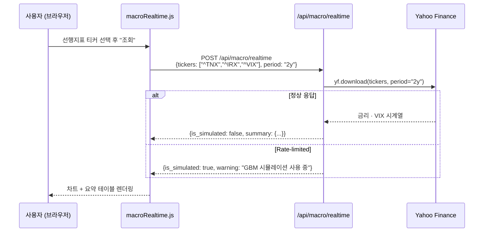

**경기 사이클 국면별 추천 티커 조합**

| 분석 목적 | tickers | period |
|---|---|---|
| 선행지표 모니터링 | `["^TNX", "^IRX", "^VIX", "^GSPC"]` | `"2y"` |
| 동행지표 확인 | `["^GSPC", "^KS11", "CL=F"]` | `"1y"` |
| 후행지표 추적 | `["^TNX", "GC=F", "KRW=X"]` | `"3y"` |
| QE/QT 영향 분석 | `["^GSPC", "GC=F", "^TNX", "DX-Y.NYB"]` | `"5y"` |

### 거시경제현황 2 (시뮬레이션) — `/api/macro/simulation`

GBM 4단계 경기 사이클 시뮬레이션으로 섹터 로테이션 전략을 연습합니다.

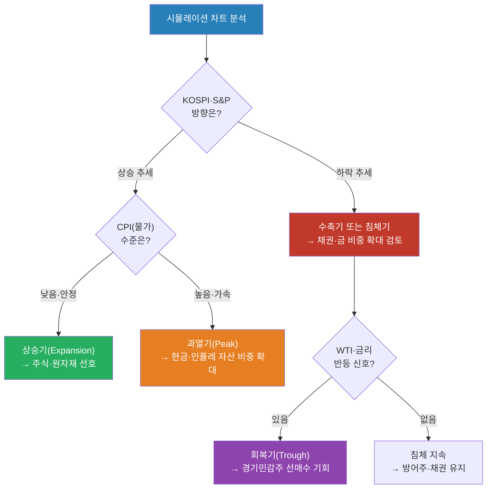

---

## 해보기 활동

1. yfinance 기본 대시보드에서 `S&P500`, `KOSPI`, `US10Y`, `WTI`, `Gold`, `DollarIndex`, `USDKRW`, `VIX`를 수집하고 `macro_dashboard.png`를 생성하세요.
2. FRED에서 `T10Y2Y`, `M2SL`, `CPIAUCSL`, `UNRATE`, `INDPRO`, `PAYEMS`를 수집해 `macro_fred_dashboard.csv`를 만드세요.
3. 경기국면 점수화 규칙을 최소 6개 만들고, 최근 12개월의 `macro_score`와 `cycle`을 표로 출력하세요.
4. 위험 경보 규칙을 최소 4개 만들고, 현재 경보를 `normal`, `warning`, `danger`로 분류하세요.
5. 현재 경기가 확장·정점·수축·저점 중 어느 국면에 가깝다고 생각하는지, 선행/동행/후행 지표를 각각 1개 이상 근거로 설명하세요.
6. `/api/macro/dashboard`를 만든다고 가정하고 요청 JSON, 응답 JSON, 필요한 서비스 파일 목록을 작성하세요.
7. 최종 결과를 `macro_dashboard_report.md`에 정리하고, 투자 관점에서 주식·채권·원자재·달러·현금 비중에 대한 결론을 작성하세요.

## 다음 시간 미리보기

➡️ [Day 045](30.md) 에서 계속됩니다 — Porter's 5 Forces, SWOT/PEST, 산업 수명주기, 산업별 분석 방법
