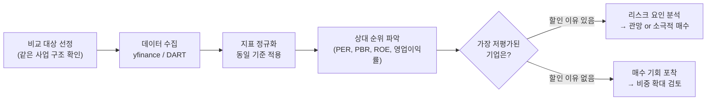
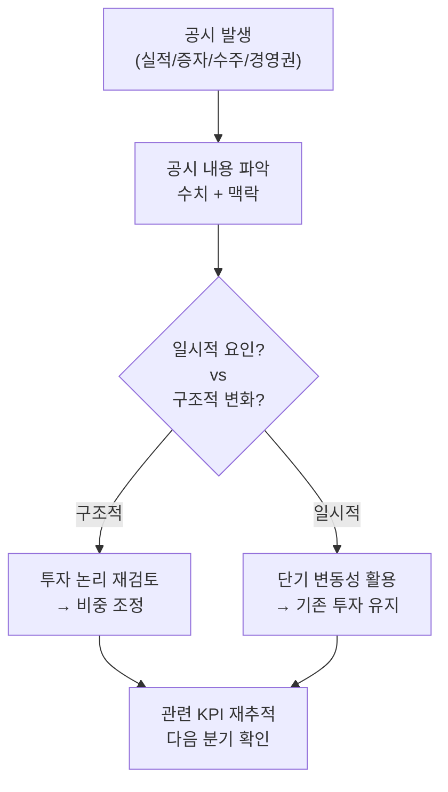
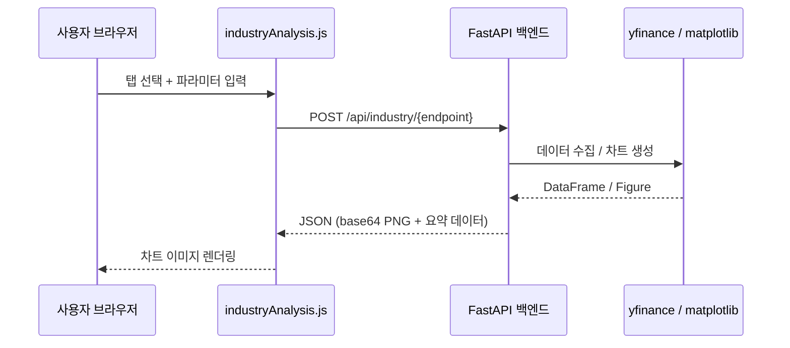
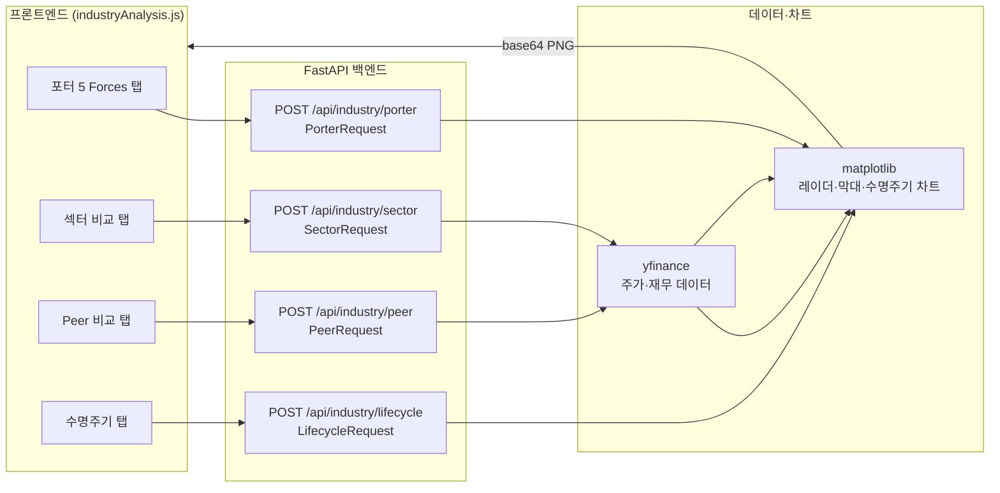

# Day 046 — 산업 분석 실습

> **모듈 7: 투자분석 기초 방법론** | 5/10일차 | 💹 | 학습시간: 8시간

---

> 📺 **YouTube 강의**: [🎬 산업 분석 실습 파이썬](https://www.youtube.com/results?search_query=산업분석+실습+파이썬+섹터+한국어)
>
> 📝 **한자 병기 및 어원 사전**: 이 문서에 등장하는 용어의 한자·어원·일제강점기 유래는 → [voca.md](voca.md)

## 오늘 배울 것 (아주 쉽게)

> 📺 [🎬 오늘 배울 것](https://www.youtube.com/results?search_query=오늘+배울+것+한국어)

- 산업별 핵심 지표(KPI) 정리
- 동종 업계 비교 분석 (Peer Comparison)
- 산업 뉴스·공시 데이터 활용
- 실습: 산업별 주요 종목 재무 비교

---

## 🗓 세부 일정 (1일 8시간)

> 📺 [🎬 세부 일정](https://www.youtube.com/results?search_query=세부+일정+한국어)

> **강의 5시간** (5개 단락 × 50분 + 도입·마무리 50분) + **실습 3시간** = 총 8시간

| 시간 | 구분 | 내용 | 형태 |
|------|------|------|------|
| 09:00 – 09:10 | 도입 | 오늘 학습 목표 확인 | 강의 |
| 09:10 – 09:30 | **1단락** 설명 20분 | 산업별 핵심 지표(KPI) 정리 | 강의 |
| 09:30 – 10:00 | 각자 정리 & 유튜브 30분 | 노트 정리 · 관련 영상 검색 | 자율 |
| 10:00 – 10:20 | **2단락** 설명 20분 | 동종 업계 비교 분석(Peer Comparison) 방법론 | 강의 |
| 10:20 – 10:50 | 각자 정리 & 유튜브 30분 | 노트 정리 · 관련 영상 검색 | 자율 |
| 10:50 – 11:00 | ☕ 휴식 | — | — |
| 11:00 – 11:20 | **3단락** 설명 20분 | 산업 뉴스·공시 데이터 활용 | 강의 |
| 11:20 – 11:50 | 각자 정리 & 유튜브 30분 | 노트 정리 · 관련 영상 검색 | 자율 |
| 11:50 – 12:10 | **4단락** 설명 20분 | 다차원 Peer 비교 및 점수화 설계 | 강의 |
| 12:10 – 12:40 | 각자 정리 & 유튜브 30분 | 노트 정리 · 관련 영상 검색 | 자율 |
| 12:40 – 13:00 | **5단락** 설명 20분 | 산업별 KPI 입체 시각화 방법 | 강의 |
| 13:00 – 13:30 | 각자 정리 & 유튜브 30분 | 노트 정리 · 관련 영상 검색 | 자율 |
| 13:30 – 14:00 | 강의 마무리 | Q&A · 핵심 복습 | 강의 |
| 14:00 – 15:00 | 💻 **실습 1부** 60분 | 다차원 지표 수집 및 표준 비교 데이터 생성 | 실습 |
| 15:00 – 15:10 | ☕ 휴식 | — | — |
| 15:10 – 16:00 | 💻 **실습 2부** 50분 | Peer 점수화 · 히트맵 · 산점도 시각화 구현 | 실습 |
| 16:00 – 16:10 | ☕ 휴식 | — | — |
| 16:10 – 17:00 | 💻 **실습 발표 & 리뷰** 50분 | 코드 리뷰 · 발표 · 피드백 | 실습 |

> 강의 5시간: 도입 10분 + 단락 5개×50분 + 마무리 30분 = **300분**  
> 실습 3시간: 1부 60분 + 휴식 10분 + 2부 50분 + 휴식 10분 + 발표·리뷰 50분 = **180분**

---

## 🔗 참고 사이트 & 데이터 원천

> 📺 [🎬 참고 사이트 데이터 원천](https://www.youtube.com/results?search_query=참고+사이트+데이터+원천+한국어)

> 이 문서(산업 분석 실습 — KPI·Peer Comparison·공시 데이터)의 실습에 필요한 공식 데이터 출처와 참고 사이트입니다. ⚿ 는 API 키 또는 승인이 필요한 항목입니다.

### 📊 국내 공식 데이터

| 기관 | URL | API 키 | 제공 데이터 |
|------|-----|--------|-------------|
| DART(전자공시시스템) | <https://opendart.fss.or.kr> | ⚿ 필요 | 사업보고서, 재무제표, 임원·대주주 현황 |
| KRX 한국거래소 | <https://www.krx.co.kr> | 불필요(웹 조회) | 업종 분류, 시가총액, 거래량 통계 |
| KRX Data Marketplace | <https://openapi.krx.co.kr> | ⚿ 필요 | 업종·종목별 시장 통계 API |
| KIND(상장공시시스템) | <https://kind.krx.co.kr> | 불필요(웹 조회) | 상장 기업 공시·재무 요약 |
| 금융투자협회(KOFIA) | <https://www.kofia.or.kr> | 불필요(웹 조회) | 자본시장 통계·업종별 현황 |
| 금융감독원(FSS) DART | <https://www.fss.or.kr> | 불필요(웹 조회) | 공시·감독 통계 정보 |

### 🌍 해외 공식 데이터

| 기관 | URL | API 키 | 제공 데이터 |
|------|-----|--------|-------------|
| SEC EDGAR Company Facts | <https://data.sec.gov/api/xbrl/companyfacts> | 불필요 | 미국 기업 XBRL 재무 데이터 |
| yfinance (PyPI) | <https://pypi.org/project/yfinance> | 불필요 | 주가·재무·배당 데이터 (야후 파이낸스) |

### 📈 리서치·뉴스·포탈 참고

| 분류 | 사이트 | URL | 활용 용도 |
|------|--------|-----|-----------|
| 리서치 플랫폼 | FnGuide | <https://www.fnguide.com> | 산업 리포트·종목 컨센서스·KPI |
| 리서치 플랫폼 | 에프앤가이드 데이터 | <https://comp.fnguide.com> | 재무·멀티플·Peer 데이터 |
| 차트 플랫폼 | TradingView | <https://www.tradingview.com> | 업종별 비교 차트 |
| 차트 플랫폼 | Investing.com | <https://www.investing.com> | 섹터 ETF·종목 비교 |
| 금융 포탈 | 네이버 금융 | <https://finance.naver.com> | 업종별 등락·종목 현황 |
| 금융 포탈 | 다음 금융 | <https://finance.daum.net> | 업종·테마 현황 |
| 금융 미디어 | 머니투데이 방송(MTN) | <https://mtn.co.kr> | 산업·종목 분석 뉴스 |
| 금융 미디어 | 연합인포맥스 | <https://news.einfomax.co.kr> | 업종·기업 속보 |
| 증권사 리서치 | 미래에셋증권 리서치 | <https://securities.miraeasset.com> | 업종·종목 리포트 |
| 증권사 리서치 | 삼성증권 리서치 | <https://www.samsungpop.com> | Peer Comparison 리포트 |

---

### 1. 산업별 핵심 지표(KPI) 정리

> 📖 **Wikipedia**: [핵심 성과 지표](https://ko.wikipedia.org/wiki/핵심_성과_지표)

**개념**

KPI(Key Performance Indicator)는 산업마다 다릅니다. 어떤 숫자를 먼저 봐야 하는지 알아야 분석이 깊어집니다.

> 📺 [🎬 산업별 핵심 KPI 선정법](https://www.youtube.com/results?search_query=산업별+KPI+핵심지표+선정+한국어+주식분석)

| 산업 | 핵심 KPI | 의미 |
|------|----------|------|
| 반도체 | ASP(평균판매단가), 가동률 | 가격 사이클과 공급 여력 |
| 유통·커머스 | 점포당 매출, 객단가, GMV | 운영 효율성 |
| 플랫폼·SaaS | MAU(월활성사용자), ARR, 이탈률 | 성장성과 유지율 |
| 금융·은행 | NIM(순이자마진), ROE, 대손충당금 | 수익성과 건전성 |
| 정유·화학 | 크랙마진, 정제마진, 스프레드 | 제품가-원가 차이 |
| 바이오 | 임상단계, R&D/매출 비율 | 파이프라인 가치 |

- 업종별로 가장 의미 있는 2~3개 지표를 고르는 기준을 익히는 것이 핵심입니다.
- 숫자를 많이 보는 것이 아니라 **의미 있는 숫자를 선택**하는 능력이 산업 분석의 핵심입니다.

### 2. 동종 업계 비교 분석 (Peer Comparison)

> 📖 **Wikipedia**: [벤치마킹](https://ko.wikipedia.org/wiki/벤치마킹) · [기업 가치 평가](https://ko.wikipedia.org/wiki/기업_가치_평가)

**개념**

한 회사를 혼자 보지 않고 비슷한 구조의 경쟁사와 나란히 놓고 상대 평가합니다.

> 📺 [🎬 Peer Comparison 동종업체 비교 분석](https://www.youtube.com/results?search_query=피어비교+동종업체+비교분석+주식+한국어)

비교 항목 예시:

| 지표 | 왜 비교하나 |
|------|------------|
| 매출 성장률 | 같은 시장에서 누가 빠르게 크는가 |
| 영업이익률 | 같은 매출로 누가 더 많이 남기는가 |
| PER/PBR | 시장이 각 기업을 어떻게 다르게 평가하는가 |
| 부채비율 | 재무 건전성 차이 |
| ROE | 자본 효율성 |

- 비교 대상의 **사업 구조가 실제로 비슷한지** 먼저 확인해야 멀티플 차이를 제대로 해석할 수 있습니다.
- "절대 점수"보다 **비교 위치**를 파악하는 연습이 중요합니다.

**Peer Comparison 분석 흐름**



### 3. 산업 뉴스·공시 데이터 활용

> 📖 **Wikipedia**: [공시](https://ko.wikipedia.org/wiki/공시_(자본시장))

**개념**

재무 숫자만으로는 "왜 숫자가 바뀌었는지" 알 수 없습니다. 뉴스와 공시를 병행해야 원인을 파악할 수 있습니다.

> 📺 [🎬 DART 공시 뉴스 활용 주식분석](https://www.youtube.com/results?search_query=DART+공시+뉴스+주식분석+한국어)

**공시 종류와 투자 관련도**

| 공시 유형 | 내용 | 투자 관련 포인트 |
|-----------|------|-----------------|
| 실적 발표 | 분기·연간 재무결과 | 컨센서스 대비 서프라이즈 여부 |
| 유상증자 | 신규 주식 발행 | 단기 희석 부담 vs 장기 투자 재원 |
| 자사주 매입 | 회사가 자기 주식 구매 | 주주환원 신호, 저평가 자신감 |
| 대규모 수주 | 신규 계약 체결 | 미래 매출 가시성 확보 |
| 경영권 변경 | 대주주 지분 변동 | 기업 방향성 변화 |

- 실적이 좋아졌다면 "무슨 사건이 있었는지", 실적이 나빠졌다면 "일시적 요인인지 구조적 문제인지"를 함께 적는 습관이 분석 품질을 높입니다.

**공시 → 투자 판단 연결 흐름**



### 4. 실습: 산업별 주요 종목 재무 비교 고도화

```python
import yfinance as yf
import pandas as pd

# 반도체 섹터 Peer Comparison
peers = {
    "삼성전자":  "005930.KS",
    "SK하이닉스": "000660.KS",
    "엔비디아":  "NVDA",
    "인텔":      "INTC",
}

rows = []
for name, ticker in peers.items():
    try:
        info = yf.Ticker(ticker).info
        rows.append({
            "기업":       name,
            "시가총액(억)": round(info.get("marketCap", 0) / 1e8, 0),
            "PER":        round(info.get("trailingPE", float("nan")), 1),
            "PBR":        round(info.get("priceToBook", float("nan")), 2),
            "영업이익률(%)": round(info.get("operatingMargins", 0) * 100, 1),
            "ROE(%)":     round(info.get("returnOnEquity", 0) * 100, 1),
        })
    except Exception as e:
        print(f"{name} 데이터 오류: {e}")

df = pd.DataFrame(rows).set_index("기업")
print(df.to_string())
```

#### 4-1. 고도화 목표: 단순 재무 4종에서 다차원 Peer 비교로 확장

기존 실습은 `PER`, `PBR`, `ROE`, `영업이익률`을 막대 차트로 비교하는 수준입니다. 고도화 실습에서는 같은 기업을 **성장성·수익성·안정성·효율성·밸류에이션·모멘텀·리스크·산업 KPI** 관점으로 나누어 봅니다.

| 분석 축 | 대표 지표 | 핵심 질문 |
|---|---|---|
| 성장성 | 매출 성장률, EPS 성장률, 영업이익 성장률 | 누가 더 빠르게 크는가? |
| 수익성 | 매출총이익률, 영업이익률, 순이익률, ROE, ROA | 같은 매출로 누가 더 많이 남기는가? |
| 안정성 | 부채비율, 유동비율, 순차입금 | 침체기에도 버틸 수 있는가? |
| 효율성 | 자산회전율, 재고회전율, 운전자본 회전 | 자산을 얼마나 효율적으로 쓰는가? |
| 밸류에이션 | PER, PBR, PSR, EV/EBITDA | 성장과 이익 대비 비싼가 싼가? |
| 모멘텀 | 1개월/3개월/1년 수익률, 52주 고점 대비 낙폭 | 시장이 지금 선호하는가? |
| 리스크 | 변동성, 최대낙폭(MDD), 베타 | 가격 위험이 큰가? |
| 산업 KPI | HBM 비중, NIM, ARR, 수주잔고, R&D/매출 | 업종의 진짜 경쟁력이 있는가? |

최종 산출물:

```text
peer_raw_metrics.csv
peer_comparison_dataset.csv
peer_score_table.csv
peer_comparison_dashboard.png
peer_comparison_report.md
```

---

#### 4-2. 비교 대상과 원천 식별자 정리

```python
PEERS = {
    "Samsung Electronics": {"ticker": "005930.KS", "country": "KR", "group": "Memory/Foundry"},
    "SK Hynix": {"ticker": "000660.KS", "country": "KR", "group": "Memory"},
    "NVIDIA": {"ticker": "NVDA", "country": "US", "group": "AI GPU"},
    "Intel": {"ticker": "INTC", "country": "US", "group": "CPU/Foundry"},
    "TSMC ADR": {"ticker": "TSM", "country": "TW/US ADR", "group": "Foundry"},
}
```

비교 대상은 “같은 산업”이라는 이름만으로 묶지 말고, 실제 사업 구조가 얼마나 비슷한지 먼저 기록합니다. 예를 들어 NVIDIA와 SK하이닉스는 모두 반도체지만 매출 구조와 마진 구조가 크게 다르므로, 멀티플 차이를 그대로 저평가/고평가로 해석하면 위험합니다.

---

#### 4-3. 다차원 지표 수집 코드

```python
import math
import yfinance as yf
import pandas as pd

def safe_float(value):
    try:
        if value is None or (isinstance(value, float) and math.isnan(value)):
            return None
        return float(value)
    except Exception:
        return None

def fetch_peer_metrics(peers):
    rows = []
    for company, meta in peers.items():
        ticker = meta["ticker"]
        try:
            t = yf.Ticker(ticker)
            info = t.info
            hist = t.history(period="1y", auto_adjust=True)
            close = hist["Close"].dropna()

            return_1y = (close.iloc[-1] / close.iloc[0] - 1) if len(close) > 1 else None
            volatility_1y = close.pct_change().std() * (252 ** 0.5) if len(close) > 30 else None
            mdd_1y = (close / close.cummax() - 1).min() if len(close) > 30 else None

            rows.append({
                "company": company,
                "ticker": ticker,
                "country": meta["country"],
                "group": meta["group"],
                "market_cap": safe_float(info.get("marketCap")),
                "revenue": safe_float(info.get("totalRevenue")),
                "revenue_growth": safe_float(info.get("revenueGrowth")),
                "gross_margin": safe_float(info.get("grossMargins")),
                "operating_margin": safe_float(info.get("operatingMargins")),
                "net_margin": safe_float(info.get("profitMargins")),
                "roe": safe_float(info.get("returnOnEquity")),
                "roa": safe_float(info.get("returnOnAssets")),
                "debt_to_equity": safe_float(info.get("debtToEquity")),
                "current_ratio": safe_float(info.get("currentRatio")),
                "trailing_pe": safe_float(info.get("trailingPE")),
                "forward_pe": safe_float(info.get("forwardPE")),
                "price_to_book": safe_float(info.get("priceToBook")),
                "price_to_sales": safe_float(info.get("priceToSalesTrailing12Months")),
                "ev_to_ebitda": safe_float(info.get("enterpriseToEbitda")),
                "return_1y": safe_float(return_1y),
                "volatility_1y": safe_float(volatility_1y),
                "mdd_1y": safe_float(mdd_1y),
            })
        except Exception as e:
            print(f"{company} error: {e}")
    return pd.DataFrame(rows)

peer_raw = fetch_peer_metrics(PEERS)
peer_raw.to_csv("peer_raw_metrics.csv", index=False, encoding="utf-8-sig")
```

`yfinance.info`는 결측이 있을 수 있으므로, 실제 보고서에서는 DART/SEC/사업보고서 원문으로 중요한 수치를 재확인합니다.

---

#### 4-4. 표준 비교 데이터 만들기

```python
ratio_columns = [
    "revenue_growth", "gross_margin", "operating_margin",
    "net_margin", "roe", "roa", "return_1y",
    "volatility_1y", "mdd_1y",
]

peer = peer_raw.copy()
for col in ratio_columns:
    if col in peer.columns:
        peer[col] = peer[col] * 100

display_columns = [
    "company", "group", "market_cap", "revenue",
    "revenue_growth", "operating_margin", "roe",
    "debt_to_equity", "trailing_pe", "price_to_book",
    "return_1y", "volatility_1y", "mdd_1y",
]

peer_dataset = peer[[c for c in display_columns if c in peer.columns]]
peer_dataset.to_csv("peer_comparison_dataset.csv", index=False, encoding="utf-8-sig")
print(peer_dataset)
```

---

#### 4-5. Peer 점수화

낮을수록 좋은 지표(`부채비율`, `PER`, `변동성`)는 점수 방향을 뒤집습니다.

```python
higher_is_better = [
    "revenue_growth", "gross_margin", "operating_margin",
    "net_margin", "roe", "roa", "current_ratio", "return_1y",
]

lower_is_better = [
    "debt_to_equity", "trailing_pe", "forward_pe",
    "price_to_book", "price_to_sales", "ev_to_ebitda",
    "volatility_1y",
]

def percentile_score(series, higher=True):
    numeric = pd.to_numeric(series, errors="coerce")
    score = numeric.rank(pct=True) * 100
    return score if higher else 100 - score

score_df = peer[["company", "group"]].copy()
for col in higher_is_better:
    if col in peer.columns:
        score_df[f"{col}_score"] = percentile_score(peer[col], True)
for col in lower_is_better:
    if col in peer.columns:
        score_df[f"{col}_score"] = percentile_score(peer[col], False)

score_groups = {
    "growth_score": ["revenue_growth_score"],
    "profitability_score": ["gross_margin_score", "operating_margin_score", "net_margin_score", "roe_score", "roa_score"],
    "stability_score": ["debt_to_equity_score", "current_ratio_score"],
    "valuation_score": ["trailing_pe_score", "forward_pe_score", "price_to_book_score", "price_to_sales_score", "ev_to_ebitda_score"],
    "momentum_score": ["return_1y_score"],
    "risk_score": ["volatility_1y_score"],
}

for group_name, cols in score_groups.items():
    valid_cols = [c for c in cols if c in score_df.columns]
    score_df[group_name] = score_df[valid_cols].mean(axis=1) if valid_cols else None

score_df["total_score"] = score_df[
    ["growth_score", "profitability_score", "stability_score", "valuation_score", "momentum_score", "risk_score"]
].mean(axis=1)

score_df.sort_values("total_score", ascending=False).to_csv("peer_score_table.csv", index=False, encoding="utf-8-sig")
```

---

#### 4-6. 입체적 시각화: 히트맵, 산점도, 종합 점수

```python
import matplotlib.pyplot as plt
import seaborn as sns

metric_cols = [
    "revenue_growth", "operating_margin", "roe",
    "debt_to_equity", "trailing_pe", "price_to_book",
    "return_1y", "volatility_1y",
]
heatmap_data = peer.set_index("company")[[c for c in metric_cols if c in peer.columns]]

fig, axes = plt.subplots(2, 2, figsize=(15, 10))
fig.suptitle("Advanced Peer Comparison Dashboard", fontsize=16, fontweight="bold")

sns.heatmap(heatmap_data, annot=True, fmt=".1f", cmap="RdYlGn", center=0, ax=axes[0, 0])
axes[0, 0].set_title("Metric Heatmap")

sns.scatterplot(data=peer, x="trailing_pe", y="revenue_growth", size="market_cap", hue="company", sizes=(80, 800), ax=axes[0, 1])
axes[0, 1].set_title("Valuation vs Growth")
axes[0, 1].grid(True, alpha=0.3)

sns.scatterplot(data=peer, x="roe", y="price_to_book", size="market_cap", hue="company", sizes=(80, 800), ax=axes[1, 0])
axes[1, 0].set_title("ROE vs PBR")
axes[1, 0].grid(True, alpha=0.3)

ranked = score_df.sort_values("total_score")
axes[1, 1].barh(ranked["company"], ranked["total_score"], color="steelblue")
axes[1, 1].set_title("Composite Peer Score")
axes[1, 1].set_xlim(0, 100)
axes[1, 1].grid(True, axis="x", alpha=0.3)

plt.tight_layout()
plt.savefig("peer_comparison_dashboard.png", dpi=150, bbox_inches="tight")
plt.show()
```

---

#### 4-7. 산업별 KPI 추가

재무제표만으로는 산업의 핵심 경쟁력을 놓칠 수 있습니다. 업종별 KPI를 직접 입력하거나 공시에서 추출해 추가합니다.

| 산업 | KPI 예시 | 비교 포인트 |
|---|---|---|
| 반도체 | HBM 매출 비중, Capex, 가동률, ASP | 사이클과 기술 우위 |
| 2차전지 | 수주잔고, 배터리 출하량, kWh당 원가 | 규모의 경제와 원가 |
| SaaS | ARR, NRR, CAC Payback, Churn | 반복매출 품질 |
| 은행 | NIM, 연체율, CET1, 대손비용률 | 수익성과 건전성 |
| 바이오 | 파이프라인 단계, 임상 성공률, R&D/매출 | 기술 옵션 가치 |

```python
industry_kpi = pd.DataFrame([
    {"company": "Samsung Electronics", "hbm_score": 70, "capex_score": 90, "tech_score": 75},
    {"company": "SK Hynix", "hbm_score": 95, "capex_score": 85, "tech_score": 90},
    {"company": "NVIDIA", "hbm_score": 100, "capex_score": 60, "tech_score": 98},
    {"company": "Intel", "hbm_score": 30, "capex_score": 95, "tech_score": 55},
    {"company": "TSMC ADR", "hbm_score": 80, "capex_score": 100, "tech_score": 95},
])

score_with_kpi = score_df.merge(industry_kpi, on="company", how="left")
score_with_kpi["industry_kpi_score"] = score_with_kpi[["hbm_score", "capex_score", "tech_score"]].mean(axis=1)
score_with_kpi["final_score"] = score_with_kpi[["total_score", "industry_kpi_score"]].mean(axis=1)
print(score_with_kpi.sort_values("final_score", ascending=False))
```

---

#### 4-8. 고도화 웹앱/API 설계

기존 `/api/industry/peer`는 4개 지표 막대 차트 중심입니다. 고도화 버전은 지표 그룹, 점수화, 차트 타입, 산업 KPI를 선택할 수 있게 설계합니다.

| 엔드포인트 | 메서드 | 역할 |
|---|---|---|
| `/api/industry/peer-advanced` | `POST` | 다차원 Peer 비교 데이터와 차트 반환 |
| `/api/industry/peer-scores` | `POST` | 성장·수익·안정·밸류·모멘텀 점수 계산 |
| `/api/industry/peer-kpi` | `POST` | 산업별 KPI 입력/저장/점수화 |
| `/api/industry/peer-report` | `POST` | Markdown/PDF용 분석 요약 생성 |

**요청 예시**

```json
{
  "industry": "Semiconductor",
  "peers": {
    "Samsung Electronics": "005930.KS",
    "SK Hynix": "000660.KS",
    "NVIDIA": "NVDA",
    "Intel": "INTC",
    "TSMC ADR": "TSM"
  },
  "metric_groups": ["growth", "profitability", "stability", "valuation", "momentum", "risk"],
  "chart_types": ["heatmap", "scatter_growth_value", "roe_pbr", "score_bar"],
  "include_industry_kpi": true,
  "period": "1y"
}
```

**응답 예시**

```json
{
  "industry": "Semiconductor",
  "top_peer": "NVIDIA",
  "undervalued_candidates": ["SK Hynix"],
  "risk_flags": [
    "Intel은 수익성과 모멘텀 점수가 낮아 turnaround 여부 확인 필요",
    "국가와 회계 기준이 섞여 있어 환율 및 회계기준 차이 조정 필요"
  ],
  "charts": {
    "dashboard": "<base64 PNG>",
    "heatmap": "<base64 PNG>",
    "scatter": "<base64 PNG>"
  },
  "table": [
    {"company": "NVIDIA", "growth_score": 95, "profitability_score": 90, "valuation_score": 35, "total_score": 78}
  ]
}
```

**화면 탭 구성**

```text
1. Overview: 종합 점수, 상위/하위 기업, 위험 플래그
2. Metrics: 재무 지표 테이블, 결측 표시, 단위 표시
3. Valuation: PER/PBR/PSR/EV/EBITDA 비교
4. Quality: ROE/ROA/마진/현금흐름 비교
5. Risk: 부채비율/변동성/MDD 비교
6. Industry KPI: 업종 특화 KPI 입력 및 점수화
7. Report: Markdown/PDF 리포트 생성
```

---

#### 4-9. 리포트 템플릿

```markdown
# 산업별 Peer Comparison 리포트

## 1. 비교 대상

> 📺 [🎬 비교 대상](https://www.youtube.com/results?search_query=비교+대상+한국어)

- 산업:
- 기업:
- 기간:
- 데이터 출처:

## 2. 종합 결론

> 📺 [🎬 종합 결론](https://www.youtube.com/results?search_query=종합+결론+한국어)

- 가장 균형 잡힌 기업:
- 성장성 1위:
- 수익성 1위:
- 밸류에이션 매력 후보:
- 주요 리스크:

## 3. 지표별 분석

> 📺 [🎬 지표별 분석](https://www.youtube.com/results?search_query=지표별+분석+한국어)

- 성장성:
- 수익성:
- 안정성:
- 효율성:
- 밸류에이션:
- 모멘텀/리스크:

## 4. 산업 KPI 분석

> 📺 [🎬 산업 KPI 분석](https://www.youtube.com/results?search_query=산업+KPI+분석+한국어)

- 핵심 KPI:
- KPI 기준 우위 기업:
- 재무 지표와 KPI의 차이:

## 5. 투자 판단

> 📺 [🎬 투자 판단](https://www.youtube.com/results?search_query=투자+판단+한국어)

- 관심 기업:
- 관망 기업:
- 추가 확인 데이터:
- 데이터 한계:
```

---

#### 4-10. 실습 체크리스트

- [ ] 비교 기업 4~6개 선정
- [ ] `peer_raw_metrics.csv` 생성
- [ ] `peer_comparison_dataset.csv` 생성
- [ ] `peer_score_table.csv` 생성
- [ ] `peer_comparison_dashboard.png` 생성
- [ ] 산업별 KPI 3개 이상 추가
- [ ] `/api/industry/peer-advanced` 요청/응답 설계
- [ ] `peer_comparison_report.md` 작성

---

## 웹앱 실습 연계

> 📺 [🎬 웹앱 실습 연계](https://www.youtube.com/results?search_query=웹앱+실습+연계+한국어)

Python Quant Lab 웹앱의 **산업 분석** 메뉴는 현재 4개의 탭으로 구성됩니다. 이번 실습에서는 기존 탭을 유지하되, Peer Comparison 탭을 `peer-advanced` 방식으로 확장하는 방향을 설계합니다.

### API 전체 흐름



---

### 탭 1 — 포터 5 Forces 분석

```
POST /api/industry/porter
Content-Type: application/json
```

**요청 예시**

```json
{
  "industry": "2차전지",
  "scores": {
    "경쟁강도":      7.0,
    "신규진입 위협": 4.0,
    "대체재 위협":   3.0,
    "구매자 교섭력": 6.0,
    "공급자 교섭력": 8.0
  }
}
```

- scores 값 범위: 0(위협 없음) ~ 10(위협 극대)
- 5개 키 모두 필수 입력

**응답**

```json
{
  "chart": "<base64 PNG 문자열>",
  "summary": {
    "경쟁강도": 7.0,
    "신규진입 위협": 4.0,
    "대체재 위협": 3.0,
    "구매자 교섭력": 6.0,
    "공급자 교섭력": 8.0
  }
}
```

반환된 차트는 5개 축의 레이더(거미줄) 차트로, 산업 매력도를 한눈에 파악할 수 있습니다.

---

### 탭 2 — 섹터 비교

```
POST /api/industry/sector
Content-Type: application/json
```

**요청 예시**

```json
{
  "tickers": ["SOXX", "XLE", "XLF", "XLV", "XLK", "XLI"],
  "period": "1y"
}
```

| 티커 | 섹터 |
|------|------|
| SOXX | 반도체 |
| XLE  | 에너지 |
| XLF  | 금융 |
| XLV  | 헬스케어 |
| XLK  | IT |
| XLI  | 산업재 |

- tickers를 생략하면 위 6개 ETF가 기본값으로 사용됩니다.
- period 예시: `"1y"`, `"6mo"`, `"3mo"`, `"ytd"`

**응답**

```json
{
  "chart": "<base64 PNG 문자열>",
  "performance": {
    "SOXX": 32.5,
    "XLK":  28.1,
    "XLV":  12.3,
    "XLF":   9.8,
    "XLE":  -3.2,
    "XLI":   7.6
  }
}
```

---

### 탭 3 — Peer Comparison

```
POST /api/industry/peer
Content-Type: application/json
```

**요청 예시**

```json
{
  "tickers": {
    "삼성전자":  "005930.KS",
    "SK하이닉스": "000660.KS",
    "엔비디아":  "NVDA",
    "TSMC":     "TSM"
  }
}
```

- 키: 화면에 표시될 회사 이름 (한글 가능)
- 값: Yahoo Finance 티커 (한국 주식은 `.KS` 또는 `.KQ` 접미사)

**응답**

```json
{
  "chart": "<base64 PNG 문자열>",
  "data": [
    { "기업": "삼성전자", "PER": 13.2, "PBR": 1.1, "ROE": 8.5, "영업이익률": 12.3 },
    { "기업": "SK하이닉스", "PER": 18.7, "PBR": 1.9, "ROE": 14.2, "영업이익률": 22.1 }
  ]
}
```

차트는 PER, PBR, ROE, 영업이익률 4개 지표를 나란히 비교하는 막대 차트입니다.

---

### 탭 4 — 수명주기 분석

```
POST /api/industry/lifecycle
Content-Type: application/json
```

**요청 예시**

```json
{
  "stage": "성장기",
  "industry": "AI 반도체"
}
```

- stage: `"도입기"` | `"성장기"` | `"성숙기"` | `"쇠퇴기"` 중 하나

**응답**

```json
{
  "chart": "<base64 PNG 문자열>",
  "strategy": "성장기 산업은 높은 PER을 감수하더라도 시장 점유율 확대 기업에 집중. 진입 경쟁이 심화되므로 해자(moat) 보유 여부 확인 필수."
}
```

수명주기 곡선 위에 현재 단계 위치가 강조 표시되고, 해당 단계의 투자 전략이 텍스트로 함께 제공됩니다.

---

### 프론트엔드 연동 구조



---

## 해보기 활동

> 📺 [🎬 해보기 활동](https://www.youtube.com/results?search_query=해보기+활동+한국어)

1. 관심 있는 산업 1개를 고르고 비교 기업 4~6개를 선정하세요. 비교 대상의 사업 구조가 어떻게 비슷하고 어떻게 다른지 먼저 적으세요.
2. 성장성, 수익성, 안정성, 밸류에이션, 모멘텀, 리스크 지표를 각각 2개 이상 골라 `peer_comparison_dataset.csv`를 만드세요.
3. 점수화 규칙을 직접 정하고 `peer_score_table.csv`를 생성한 뒤, 종합 점수 1위 기업과 그 이유를 설명하세요.
4. PER vs 매출 성장률, ROE vs PBR 산점도를 그리고 “비싸지만 좋은 기업”과 “싸지만 이유가 있는 기업”을 구분해보세요.
5. 선택 산업의 업종 KPI를 3개 이상 추가하고, 재무 지표만 봤을 때와 결론이 달라지는지 비교하세요.
6. 기존 `/api/industry/peer`보다 확장된 `/api/industry/peer-advanced`의 요청 JSON, 응답 JSON, 화면 탭 구성을 설계하세요.
7. 최종 결과를 `peer_comparison_report.md` 템플릿에 맞춰 정리하세요.

---

# 한국 주식 시장 섹터 구분

## 주요 분류 기준
한국 주식 시장에서는 국제 표준 **GICS**를 기반으로 하되, 국내 실정에 맞춘 **WICS**(FnGuide 제공) 기준을 가장 널리 사용합니다.  
증권사 HTS, 네이버 금융 등에서 주로 확인할 수 있는 체계입니다.

## 대분류 섹터 (WICS/GICS 기준)

| 대분류 (Sector)       | 주요 포함 업종 예시                          | 특징 |
|-----------------------|---------------------------------------------|------|
| **에너지**            | 석유·가스, 에너지 장비·서비스               | 원자재 가격에 민감 |
| **소재 (Materials)**  | 화학, 철강, 비철금속, 종이·목재            | 경기 민감 |
| **산업재**            | 기계, 건설, 운송, 자본재                    | 경기 민감 |
| **경기소비재**        | 자동차, 의류, 유통, 소비자 서비스           | 경기 민감 (임의소비) |
| **필수소비재**        | 식품, 음료, 담배, 가정용품                  | 경기 방어적 |
| **건강관리 (헬스케어)** | 제약, 의료기기, 바이오                      | 성장주 성격 강함 |
| **금융**              | 은행, 보험, 증권, 다각화 금융               | 금리·경기 영향 |
| **IT (정보기술)**     | 반도체, 디스플레이, 소프트웨어, 하드웨어   | 한국 시장 대표 섹터 |
| **통신서비스**        | 이동통신, 통신 장비                         | 안정적 현금 흐름 |
| **유틸리티**          | 전기·가스, 수도 등                           | 규제 산업, 방어적 |

> ※ GICS 기준으로는 **부동산** 섹터가 별도로 존재하나, WICS에서는 금융이나 기타로 분류되는 경우가 많습니다.

## 기타 분류 방식
- **한국거래소(KRX) 산업지수**: 코스피·코스닥별 업종 분류 (전기전자, 화학, 의약품 등)
- **통계청 KSIC**: 경제 활동 기준 산업 분류
- **테마 섹터**: 2차전지, 반도체, 바이오, 방산, 로봇 등 투자자 중심 세부 그룹

## 참고 사항
- 섹터별 성과는 경기 사이클, 금리 환경, 글로벌 수요 등에 따라 크게 변동됩니다.
- 실시간 섹터 현황은 증권사 HTS나 네이버 금융의 업종/섹터 메뉴에서 확인 가능합니다.

특정 섹터에 대한 세부 정보가 필요하시면 추가로 말씀해 주십시오.
