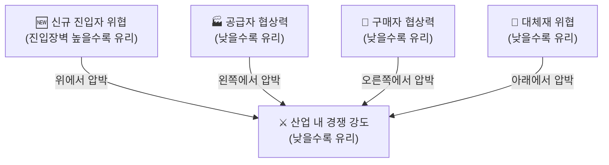
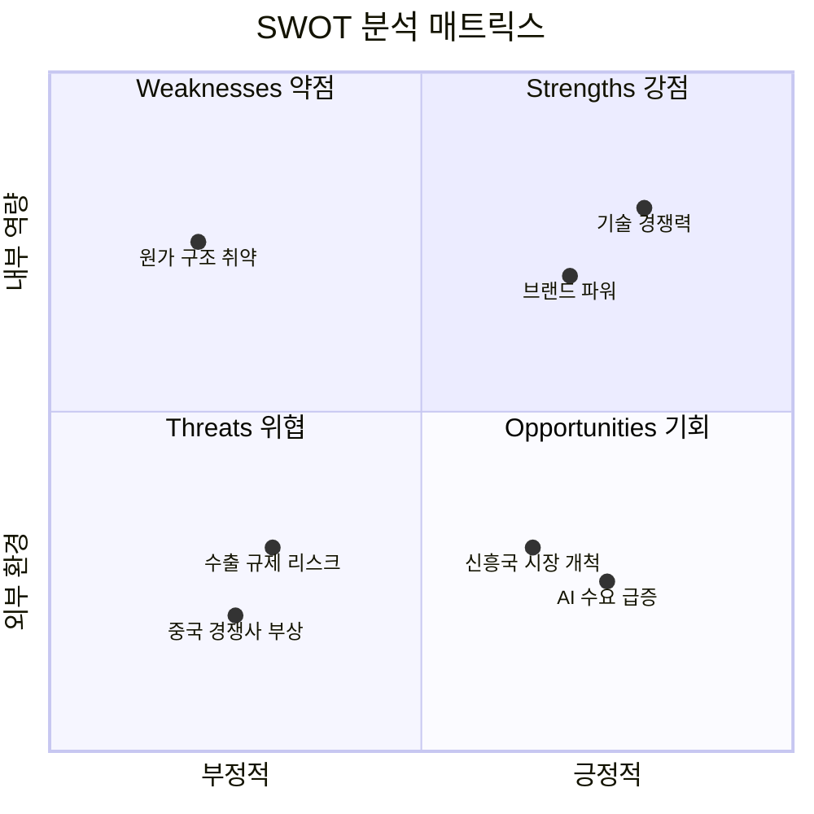
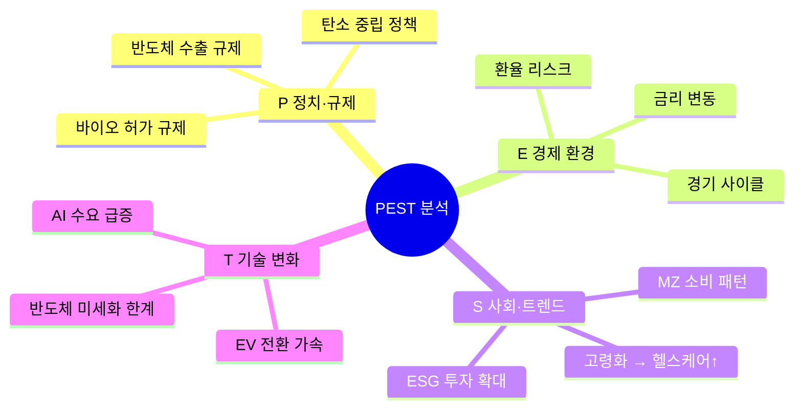
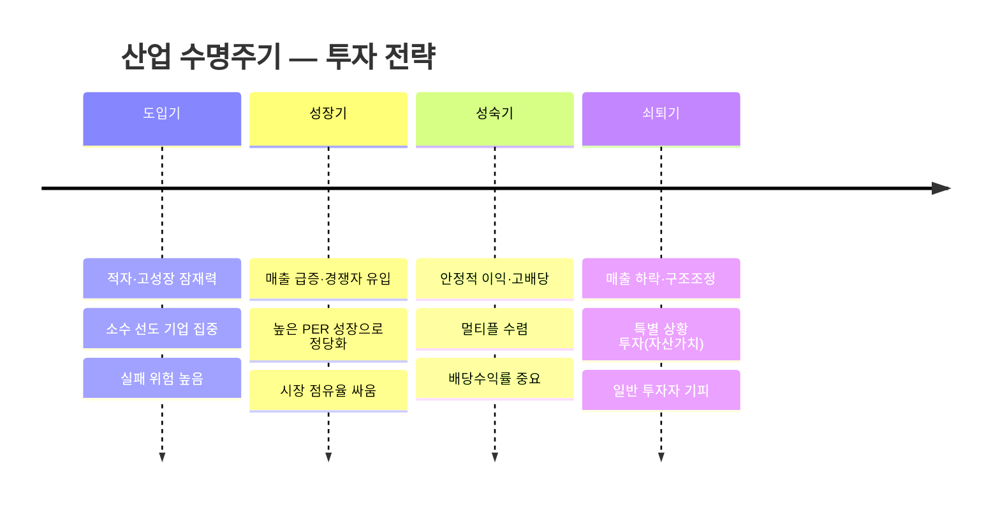

# Day 045 — 산업 분석

> **모듈 7: 투자분석 기초 방법론** | 4/10일차 | 💹 | 학습시간: 8시간

---

> 📺 **YouTube 강의**: [🎬 산업 분석 섹터 주식 투자](https://www.youtube.com/results?search_query=산업분석+섹터분석+주식투자+한국어+강의)
>
> 📝 **한자 병기 및 어원 사전**: 이 문서에 등장하는 용어의 한자·어원·일제강점기 유래는 → [voca.md](voca.md)

## 오늘 배울 것

- 산업 경쟁력 분석 개념 (Porter's 5 Forces)
- 산업 분석 모형: SWOT, PEST
- 산업 수명주기(Industry Life Cycle)
- 주요 산업별 분석 방법 (반도체, 2차전지, 바이오 등)
- 실습: 특정 산업 분석 리포트 작성

---

## 🗓 세부 일정 (1일 8시간)

> **강의 5시간** (5개 단락 × 50분 + 도입·마무리 50분) + **실습 3시간** = 총 8시간

| 시간 | 구분 | 내용 | 형태 |
|------|------|------|------|
| 09:00 – 09:10 | 도입 | 오늘 학습 목표 확인 | 강의 |
| 09:10 – 09:30 | **1단락** 설명 20분 | 산업 경쟁력 분석 개념 (Porter's 5 Forces) | 강의 |
| 09:30 – 10:00 | 각자 정리 & 유튜브 30분 | 노트 정리 · 관련 영상 검색 | 자율 |
| 10:00 – 10:20 | **2단락** 설명 20분 | 산업 분석 모형: SWOT, PEST | 강의 |
| 10:20 – 10:50 | 각자 정리 & 유튜브 30분 | 노트 정리 · 관련 영상 검색 | 자율 |
| 10:50 – 11:00 | ☕ 휴식 | — | — |
| 11:00 – 11:20 | **3단락** 설명 20분 | 산업 수명주기(Industry Life Cycle) | 강의 |
| 11:20 – 11:50 | 각자 정리 & 유튜브 30분 | 노트 정리 · 관련 영상 검색 | 자율 |
| 11:50 – 12:10 | **4단락** 설명 20분 | 주요 산업별 핵심 분석 지표 (반도체·2차전지·바이오 등) | 강의 |
| 12:10 – 12:40 | 각자 정리 & 유튜브 30분 | 노트 정리 · 관련 영상 검색 | 자율 |
| 12:40 – 13:00 | **5단락** 설명 20분 | 산업 분석 리포트 구성 방법 | 강의 |
| 13:00 – 13:30 | 각자 정리 & 유튜브 30분 | 노트 정리 · 관련 영상 검색 | 자율 |
| 13:30 – 14:00 | 강의 마무리 | Q&A · 핵심 복습 | 강의 |
| 14:00 – 15:00 | 💻 **실습 1부** 60분 | 산업별 주가·ETF 데이터 수집 및 DART 재무 데이터 수집 | 실습 |
| 15:00 – 15:10 | ☕ 휴식 | — | — |
| 15:10 – 16:00 | 💻 **실습 2부** 50분 | 산업 대시보드 생성 및 PDF 리포트 구성 | 실습 |
| 16:00 – 16:10 | ☕ 휴식 | — | — |
| 16:10 – 17:00 | 💻 **실습 발표 & 리뷰** 50분 | 코드 리뷰 · 발표 · 피드백 | 실습 |

> 강의 5시간: 도입 10분 + 단락 5개×50분 + 마무리 30분 = **300분**  
> 실습 3시간: 1부 60분 + 휴식 10분 + 2부 50분 + 휴식 10분 + 발표·리뷰 50분 = **180분**

---

## 🔗 참고 사이트 & 데이터 원천

> 이 문서(산업 분석 — Porter's 5 Forces·SWOT·PEST·수명주기)의 실습에 필요한 공식 데이터 출처와 참고 사이트입니다. ⚿ 는 API 키 또는 승인이 필요한 항목입니다.

### 📊 국내 공식 데이터

| 기관 | URL | API 키 | 제공 데이터 |
|------|-----|--------|-------------|
| DART(전자공시시스템) | <https://opendart.fss.or.kr> | ⚿ 필요 | 기업 공시, 사업보고서, 재무제표 |
| KRX 한국거래소 | <https://www.krx.co.kr> | 불필요(웹 조회) | 업종 분류, 섹터별 지수, 상장 기업 목록 |
| KRX Data Marketplace | <https://openapi.krx.co.kr> | ⚿ 필요 | 시장 통계·지수·업종 데이터 API |
| 금융투자협회(KOFIA) | <https://www.kofia.or.kr> | 불필요(웹 조회) | 업종별 자본시장 통계 |
| 한국산업연구원(KIET) | <https://www.kiet.re.kr> | 불필요(웹 조회) | 산업 동향·전망 보고서 |
| 한국무역협회(KITA) | <https://www.kita.net> | 불필요(웹 조회) | 수출입 통계, 산업별 무역 현황 |
| 중소벤처기업부 | <https://www.mss.go.kr> | 불필요(웹 조회) | 창업·벤처 산업 현황 |

### 🌍 해외 공식 데이터

| 기관 | URL | API 키 | 제공 데이터 |
|------|-----|--------|-------------|
| SEC EDGAR | <https://www.sec.gov/developer> | 불필요 | 미국 기업 공시·재무 데이터 |
| SIC 산업 분류 (EDGAR) | <https://www.sec.gov/info/edgar/siccodes.htm> | 불필요 | 미국 표준산업분류(SIC) 코드 |
| Bloomberg Industry | <https://www.bloomberg.com/markets/sectors> | 불필요(웹 조회) | 글로벌 섹터·산업 동향 |

### 📈 차트·리서치·뉴스 참고

| 분류 | 사이트 | URL | 활용 용도 |
|------|--------|-----|-----------|
| 차트 플랫폼 | TradingView | <https://www.tradingview.com> | 섹터 ETF·업종 비교 차트 |
| 금융 포탈 | 네이버 금융 | <https://finance.naver.com> | 국내 업종별 지수·등락 현황 |
| 금융 포탈 | 다음 금융 | <https://finance.daum.net> | 섹터·테마 현황 |
| 리서치 플랫폼 | FnGuide | <https://www.fnguide.com> | 산업 리포트·컨센서스 |
| 금융 미디어 | 머니투데이 방송(MTN) | <https://mtn.co.kr> | 산업·섹터 분석 뉴스 |
| 금융 미디어 | 이데일리 | <https://www.edaily.co.kr> | 산업 동향·기업 뉴스 |
| 금융 감독 | 금융감독원(FSS) | <https://www.fss.or.kr> | 업종별 금융 감독 통계 |
| 금융 정책 | 금융위원회 | <https://www.fsc.go.kr> | 자본시장 정책 동향 |

---

### 1. 산업 경쟁력 분석 개념 (Porter's 5 Forces)

> 📖 **Wikipedia**: [포터의 다섯 가지 경쟁 요인](https://ko.wikipedia.org/wiki/포터의_다섯_가지_경쟁_요인) · [마이클 포터](https://ko.wikipedia.org/wiki/마이클_포터)

Porter's 5 Forces는 마이클 포터(Harvard)가 개발한 산업 경쟁강도 분석 도구입니다. 기업이 속한 산업의 **구조적 매력도**를 5가지 힘으로 평가합니다.

> 📺 [🎬 포터의 5가지 힘 산업분석](https://www.youtube.com/results?search_query=포터+5가지힘+산업경쟁력+분석+한국어)

**5가지 경쟁 압력**



| 힘 | 설명 | 높을수록 산업 매력도 |
|----|------|---------------------|
| **신규 진입자 위협** | 새 경쟁자가 얼마나 쉽게 들어올 수 있는가 | 낮을수록 좋음 (높은 진입장벽) |
| **공급자 협상력** | 원재료·부품 공급자가 가격을 결정하는 힘 | 낮을수록 좋음 |
| **구매자 협상력** | 고객이 가격 인하를 요구할 수 있는 힘 | 낮을수록 좋음 |
| **대체재 위협** | 다른 방법으로 같은 수요를 충족시킬 수 있는 정도 | 낮을수록 좋음 |
| **기존 경쟁자 간 경쟁** | 현재 같은 산업 내 경쟁 강도 | 낮을수록 좋음 |

**적용 예시: 반도체 산업**

| 힘 | 수준 | 이유 |
|----|------|------|
| 신규 진입자 | 낮음 (진입장벽 높음) | 수십조 원의 팹 투자, 기술 장벽 |
| 공급자 협상력 | 중간~높음 | 희귀 소재·장비 독점 (ASML 등) |
| 구매자 협상력 | 중간 | 범용 메모리는 가격 경쟁, HBM은 고객 협상력 낮음 |
| 대체재 위협 | 낮음 | 반도체를 대체할 기술 없음 |
| 경쟁 강도 | 높음 | 삼성·SK하이닉스·마이크론 등 치열한 경쟁 |

> 🔗 **Python 소스 연계**
>
> 웹앱의 **포터 5 Forces 분석** 탭에서 위 5가지 항목을 직접 점수로 입력하고 레이더 차트로 시각화할 수 있습니다.
>
> ```
> POST /api/industry/porter
> {
>   "industry": "반도체",
>   "scores": {
>     "경쟁강도":      8.0,
>     "신규진입 위협": 2.0,
>     "대체재 위협":   1.5,
>     "구매자 교섭력": 5.0,
>     "공급자 교섭력": 6.5
>   }
> }
> ```
>
> scores의 각 값은 0(위협 없음) ~ 10(위협 극대) 척도입니다. 반환값은 레이더 차트 PNG(base64)와 점수 요약입니다.

---

### 2. 산업 분석 모형: SWOT, PEST

> 📖 **Wikipedia**: [SWOT 분석](https://ko.wikipedia.org/wiki/SWOT_분석) · [PEST 분석](https://ko.wikipedia.org/wiki/PEST_분석)

**SWOT 분석**

기업·산업의 내부 역량(S·W)과 외부 환경(O·T)을 매트릭스로 정리합니다.



> 📺 [🎬 SWOT 분석 기업 산업 적용법](https://www.youtube.com/results?search_query=SWOT+분석+기업+산업+투자+한국어)

**PEST 분석**

거시환경을 4가지 관점에서 체계적으로 파악합니다.



| 요소 | 내용 | 투자 관련 예시 |
|------|------|----------------|
| **P (Political)** | 정치·규제 환경 | 반도체 수출규제, 바이오 허가 규제 |
| **E (Economic)** | 경제 환경 | 금리, 환율, 경기 사이클 |
| **S (Social)** | 사회·인구 트렌드 | 고령화(헬스케어↑), MZ 소비 패턴 |
| **T (Technological)** | 기술 변화 | AI 수요 급증, EV 전환 |

> 📺 [🎬 PEST 분석 거시환경 산업분석](https://www.youtube.com/results?search_query=PEST+분석+거시환경+산업분석+한국어)

---

### 3. 산업 수명주기(Industry Life Cycle)

> 📖 **Wikipedia**: [제품 수명 주기](https://ko.wikipedia.org/wiki/제품_수명_주기) · [산업](https://ko.wikipedia.org/wiki/산업)

모든 산업은 탄생부터 쇠퇴까지 전형적인 성장 곡선을 따릅니다.



> 📺 [🎬 산업 수명주기 투자 전략](https://www.youtube.com/results?search_query=산업수명주기+투자+성장주+가치주+한국어)

**투자 관점에서의 수명주기**

| 단계 | 특징 | 투자 시 주의점 |
|------|------|----------------|
| **도입기** | 적자, 높은 성장 잠재력 | 실패 위험 높음, 소수 선도 기업에 집중 |
| **성장기** | 매출 급증, 경쟁자 유입 | PER 높지만 성장으로 정당화 가능 |
| **성숙기** | 안정적 이익, 고배당 | 멀티플 수렴, 배당수익률 중요 |
| **쇠퇴기** | 매출 하락, 구조조정 | 특별 상황 투자(자산 가치) 외 기피 |

> 🔗 **Python 소스 연계**
>
> 웹앱의 **수명주기 분석** 탭에서 산업과 단계를 선택하면 수명주기 차트와 해당 단계의 투자 전략 가이드를 자동으로 제공합니다.
>
> ```
> POST /api/industry/lifecycle
> {
>   "stage": "성장기",      // "도입기" | "성장기" | "성숙기" | "쇠퇴기"
>   "industry": "AI 반도체"
> }
> ```
>
> 반환값: 수명주기 위치 차트 + 해당 단계의 투자 전략 텍스트

---

### 4. 주요 산업별 핵심 분석 지표

> 📖 **Wikipedia**: [반도체](https://ko.wikipedia.org/wiki/반도체) · [리튬 이온 배터리](https://ko.wikipedia.org/wiki/리튬_이온_배터리) · [바이오의약품](https://ko.wikipedia.org/wiki/바이오의약품)

산업마다 먼저 봐야 하는 숫자가 다릅니다.

**반도체**

| 지표 | 설명 |
|------|------|
| ASP (평균판매가격) | 메모리 가격 사이클 파악 |
| 가동률(Utilization Rate) | 공장 가동 효율 |
| DRAM 현물가 vs 계약가 | 수요·공급 밸런스 선행 |
| Capex(설비투자) | 차세대 투자 방향 |

> 📺 [🎬 반도체 산업 분석 투자 지표](https://www.youtube.com/results?search_query=반도체+산업분석+메모리+투자+한국어)

**2차전지(배터리)**

| 지표 | 설명 |
|------|------|
| 배터리 팩 가격($/kWh) | 원가 경쟁력 지표 |
| 에너지 밀도(Wh/kg) | 기술 우위 |
| 리튬·코발트 원자재 가격 | 원가 변동 선행 |
| EV 침투율 | 수요 성장 모멘텀 |

> 📺 [🎬 2차전지 배터리 산업 분석 투자](https://www.youtube.com/results?search_query=2차전지+배터리+산업분석+리튬+투자+한국어)

**바이오·헬스케어**

| 지표 | 설명 |
|------|------|
| 임상 파이프라인 단계 | 승인 가능성과 가치 |
| FDA/MFDS 허가 | 규제 리스크 |
| 특허 만료일 | 제네릭 경쟁 진입 시점 |
| R&D 비용/매출 비율 | 연구 집중도 |

> 📺 [🎬 바이오 제약 산업 분석 임상 투자](https://www.youtube.com/results?search_query=바이오+제약+산업분석+임상단계+투자+한국어)

> 🔗 **Python 소스 연계**
>
> 웹앱의 **섹터 비교** 탭은 ETF 티커를 기반으로 산업별 성과를 한눈에 비교합니다.
>
> ```
> POST /api/industry/sector
> {
>   "tickers": ["SOXX", "XLE", "XLF", "XLV", "XLK", "XLI"],
>   "period": "1y"
> }
> // SOXX=반도체, XLE=에너지, XLF=금융, XLV=헬스케어, XLK=IT, XLI=산업재
> ```
>
> 내부적으로 yfinance를 사용하며 반환값은 섹터별 누적 수익률 비교 차트입니다.

---

### 5. 실습: 산업 분석 리포트 작성 및 대시보드 고도화

이번 실습의 목표는 단순히 차트 1개를 그리는 것이 아니라, **공식 데이터 탐색 → API 수집 → 표준 데이터셋 생성 → 웹 대시보드 → PDF 리포트 출력**까지 이어지는 산업 분석 파이프라인을 설계하는 것입니다.

---

#### 5-1. 실습 목표

최종 산출물은 다음과 같습니다.

| 산출물 | 파일/화면 | 설명 |
|---|---|---|
| 산업 데이터 카탈로그 | `industry_sources.md` | 공식 데이터 출처, 가입/키 발급, 사용 지표 정리 |
| 가격 데이터 | `industry_prices.csv` | 대표 기업/ETF의 가격, 수익률, 변동성 |
| 재무 데이터 | `industry_financials.csv` | 매출, 영업이익, 순이익, 자산, 부채 등 |
| 표준 분석 데이터 | `industry_dataset.csv` | 기업·산업·지표를 표준 컬럼으로 통합 |
| 대시보드 이미지 | `industry_dashboard.png` | 수익률, 밸류에이션, 성장성, 5 Forces 요약 |
| 웹 API 설계 | `/api/industry/dashboard` | 산업별 데이터, 차트, 점수 반환 |
| PDF 리포트 | `industry_report.pdf` | 산업 분석 결론과 투자 유의사항 |

**분석 질문 예시**

1. 선택한 산업은 도입기, 성장기, 성숙기, 쇠퇴기 중 어디에 가까운가?
2. Porter's 5 Forces 관점에서 산업 매력도는 높은가?
3. 같은 산업 내 기업들의 매출 성장률, 이익률, 주가 수익률은 어떻게 다른가?
4. 산업 ETF와 대표 종목 중 어느 쪽의 위험 대비 성과가 좋은가?
5. PDF 리포트 한 장으로 요약한다면 어떤 결론을 제시할 수 있는가?

---

#### 5-2. 공식 데이터 탐색 및 가입

산업 분석은 데이터 출처가 섞이기 쉽습니다. 먼저 어떤 데이터가 공식 원천인지, 어떤 데이터가 보조 원천인지 구분합니다.

| 출처 | 데이터 | 인증 | 실습 활용 |
|---|---|---|---|
| [OpenDART](https://opendart.fss.or.kr/) | 국내 상장사 공시, 사업보고서, 재무제표 | API Key 필요 | 삼성전자, SK하이닉스 등 국내 기업 재무 |
| [SEC EDGAR](https://www.sec.gov/edgar/sec-api-documentation) | 미국 기업 공시, submissions, XBRL company facts | Key 불필요, User-Agent 필요 | NVIDIA, Intel, TSMC ADR 등 글로벌 기업 재무 |
| [KRX Data Marketplace](https://openapi.krx.co.kr/) | 한국 거래소 시세, 지수, 섹터, 종목 데이터 | 회원가입, 인증키/활용신청 | 국내 섹터·주식 데이터 보강 |
| [KOSIS OpenAPI](https://kosis.kr/openapi/devGuide/devGuide_0201List.do) | 산업생산, 출하, 재고, 고용 등 통계 | API Key 필요 | 산업 경기 지표 |
| [한국은행 ECOS](https://ecos.bok.or.kr/) | 금리, 환율, GDP, 산업 관련 거시지표 | API Key 필요 | 산업 PEST의 경제 환경 |
| `yfinance` | 주가, ETF, 일부 환율·원자재 | Key 불필요 | 빠른 실습과 대시보드 프로토타입 |

`.env`에는 아래처럼 키를 저장합니다.

```bash
DART_API_KEY=발급받은_DART_KEY
KOSIS_API_KEY=발급받은_KOSIS_KEY
BOK_API_KEY=발급받은_ECOS_KEY
FRED_API_KEY=발급받은_FRED_KEY
```

추가 패키지:

```bash
pip install requests yfinance pandas matplotlib seaborn reportlab
```

---

#### 5-3. 분석 대상 산업과 기업 정의

처음에는 반도체 산업으로 실습합니다. 이후 2차전지, 바이오, 금융, 에너지로 바꿔도 같은 구조를 재사용할 수 있습니다.

```python
INDUSTRY = {
    "industry_name": "Semiconductor",
    "korean_name": "반도체",
    "etfs": {
        "SOXX": "iShares Semiconductor ETF",
        "SMH": "VanEck Semiconductor ETF",
    },
    "companies": {
        "Samsung Electronics": {"ticker": "005930.KS", "country": "KR", "dart_code": "00126380"},
        "SK Hynix": {"ticker": "000660.KS", "country": "KR", "dart_code": "00164779"},
        "NVIDIA": {"ticker": "NVDA", "country": "US", "cik": "0001045810"},
        "Intel": {"ticker": "INTC", "country": "US", "cik": "0000050863"},
        "TSMC ADR": {"ticker": "TSM", "country": "TW/US ADR", "cik": "0001046179"},
    },
}
```

**주의:** DART의 `corp_code`와 SEC의 CIK는 기업을 정확히 식별하는 키입니다. 실제 프로젝트에서는 티커만 저장하지 말고 원천 식별자를 반드시 함께 저장합니다.

---

#### 5-4. 표준 데이터셋 스키마

여러 원천을 하나로 합치려면 표준 컬럼이 필요합니다.

| 컬럼 | 예시 | 설명 |
|---|---|---|
| `date` | `2024-12-31` | 기준일 |
| `industry` | `Semiconductor` | 산업명 |
| `company` | `NVIDIA` | 기업명 |
| `ticker` | `NVDA` | 시장 티커 |
| `country` | `US` | 국가 |
| `source` | `DART`, `SEC`, `YFINANCE` | 데이터 출처 |
| `metric` | `revenue`, `operating_income`, `price_return_1y` | 지표명 |
| `value` | `12345.0` | 값 |
| `unit` | `KRW`, `USD`, `%` | 단위 |
| `period` | `FY2024`, `2024Q4`, `1Y` | 기간 |

---

#### 5-5. 1단계: 주가·ETF 데이터 수집

```python
import yfinance as yf
import pandas as pd
import matplotlib.pyplot as plt

tickers = {
    "Samsung Electronics": "005930.KS",
    "SK Hynix": "000660.KS",
    "NVIDIA": "NVDA",
    "Intel": "INTC",
    "TSMC ADR": "TSM",
    "SOXX ETF": "SOXX",
}

def fetch_prices(tickers, period="1y"):
    prices = {}
    for name, ticker in tickers.items():
        data = yf.download(ticker, period=period, auto_adjust=True, progress=False)
        if data.empty:
            print(f"skip: {name} ({ticker})")
            continue
        prices[name] = data["Close"]
    return pd.DataFrame(prices).dropna(how="all")

prices = fetch_prices(tickers, period="1y")
returns = (prices / prices.iloc[0] - 1) * 100
prices.to_csv("industry_prices.csv", encoding="utf-8-sig")

plt.figure(figsize=(12, 6))
for col in returns.columns:
    plt.plot(returns.index, returns[col], label=col, linewidth=1.4)

plt.axhline(0, color="black", linewidth=0.7, linestyle="--")
plt.title("Semiconductor Industry: 1Y Cumulative Return")
plt.ylabel("Return (%)")
plt.grid(True, alpha=0.3)
plt.legend()
plt.tight_layout()
plt.savefig("industry_price_return.png", dpi=150, bbox_inches="tight")
plt.show()
```

---

#### 5-6. 2단계: OpenDART 재무 데이터 수집

DART는 국내 기업의 사업보고서와 주요 재무계정을 가져오는 데 사용합니다.

```python
import os
import requests
import pandas as pd

DART_API_KEY = os.getenv("DART_API_KEY")

def fetch_dart_financials(corp_code, bsns_year="2024", reprt_code="11011"):
    url = "https://opendart.fss.or.kr/api/fnlttSinglAcntAll.json"
    params = {
        "crtfc_key": DART_API_KEY,
        "corp_code": corp_code,
        "bsns_year": bsns_year,
        "reprt_code": reprt_code,  # 11011: 사업보고서
        "fs_div": "CFS",           # 연결재무제표
    }
    data = requests.get(url, params=params, timeout=20).json()
    rows = data.get("list", [])
    if not rows:
        return pd.DataFrame()
    df = pd.DataFrame(rows)
    keep = ["corp_code", "bsns_year", "account_nm", "thstrm_amount", "currency"]
    return df[[c for c in keep if c in df.columns]]

dart_companies = {
    "Samsung Electronics": "00126380",
    "SK Hynix": "00164779",
}

dart_frames = []
for company, corp_code in dart_companies.items():
    df = fetch_dart_financials(corp_code, bsns_year="2024")
    if not df.empty:
        df["company"] = company
        dart_frames.append(df)

dart_financials = pd.concat(dart_frames, ignore_index=True) if dart_frames else pd.DataFrame()
dart_financials.to_csv("industry_dart_financials.csv", index=False, encoding="utf-8-sig")
```

---

#### 5-7. 3단계: SEC EDGAR company facts 수집

SEC의 `companyfacts` API는 CIK 기준으로 XBRL 재무 항목을 JSON으로 제공합니다. 요청 시 User-Agent를 명확히 넣는 것이 좋습니다.

```python
import requests
import pandas as pd

SEC_HEADERS = {
    "User-Agent": "python-quant-learning contact@example.com"
}

def fetch_sec_company_facts(cik):
    cik10 = str(cik).zfill(10)
    url = f"https://data.sec.gov/api/xbrl/companyfacts/CIK{cik10}.json"
    return requests.get(url, headers=SEC_HEADERS, timeout=20).json()

def extract_us_gaap_metric(facts_json, tag, unit="USD"):
    facts = facts_json.get("facts", {}).get("us-gaap", {}).get(tag, {})
    rows = facts.get("units", {}).get(unit, [])
    df = pd.DataFrame(rows)
    if df.empty:
        return pd.DataFrame()
    return df[["fy", "fp", "form", "filed", "end", "val"]].sort_values("end")

sec_companies = {
    "NVIDIA": "0001045810",
    "Intel": "0000050863",
}

sec_rows = []
for company, cik in sec_companies.items():
    facts = fetch_sec_company_facts(cik)
    revenue = extract_us_gaap_metric(facts, "Revenues")
    if not revenue.empty:
        revenue["company"] = company
        revenue["metric"] = "revenue"
        sec_rows.append(revenue)

sec_financials = pd.concat(sec_rows, ignore_index=True) if sec_rows else pd.DataFrame()
sec_financials.to_csv("industry_sec_financials.csv", index=False, encoding="utf-8-sig")
```

---

#### 5-8. 4단계: 표준 데이터셋 생성

```python
standard_rows = []

# 가격 데이터 표준화
for company in prices.columns:
    latest_price = prices[company].dropna().iloc[-1]
    return_1y = returns[company].dropna().iloc[-1]
    standard_rows.append({
        "date": prices[company].dropna().index[-1].date(),
        "industry": "Semiconductor",
        "company": company,
        "ticker": tickers.get(company),
        "country": None,
        "source": "YFINANCE",
        "metric": "latest_price",
        "value": float(latest_price),
        "unit": "price",
        "period": "latest",
    })
    standard_rows.append({
        "date": returns[company].dropna().index[-1].date(),
        "industry": "Semiconductor",
        "company": company,
        "ticker": tickers.get(company),
        "country": None,
        "source": "YFINANCE",
        "metric": "price_return_1y",
        "value": float(return_1y),
        "unit": "%",
        "period": "1Y",
    })

industry_dataset = pd.DataFrame(standard_rows)
industry_dataset.to_csv("industry_dataset.csv", index=False, encoding="utf-8-sig")
print(industry_dataset.head())
```

---

#### 5-9. 5단계: 산업 대시보드 생성

```python
import matplotlib.pyplot as plt
import seaborn as sns

summary = industry_dataset.pivot_table(
    index="company",
    columns="metric",
    values="value",
    aggfunc="last",
)

fig, axes = plt.subplots(2, 2, figsize=(14, 9))
fig.suptitle("Semiconductor Industry Dashboard", fontsize=16, fontweight="bold")

returns.iloc[:, :].plot(ax=axes[0, 0], linewidth=1.2)
axes[0, 0].set_title("1Y Cumulative Return")
axes[0, 0].axhline(0, color="black", linewidth=0.7, linestyle="--")
axes[0, 0].grid(True, alpha=0.3)

if "price_return_1y" in summary.columns:
    summary["price_return_1y"].sort_values().plot(
        kind="barh",
        ax=axes[0, 1],
        color="steelblue",
    )
axes[0, 1].set_title("1Y Return Ranking")
axes[0, 1].grid(True, axis="x", alpha=0.3)

porter_scores = pd.Series({
    "Rivalry": 8.0,
    "New Entrants": 2.0,
    "Substitutes": 1.5,
    "Buyer Power": 5.0,
    "Supplier Power": 6.5,
})
porter_scores.plot(kind="bar", ax=axes[1, 0], color="darkorange")
axes[1, 0].set_title("Porter's 5 Forces Threat Score")
axes[1, 0].set_ylim(0, 10)
axes[1, 0].grid(True, axis="y", alpha=0.3)

swot_counts = pd.Series({"Strength": 3, "Weakness": 2, "Opportunity": 3, "Threat": 3})
swot_counts.plot(kind="bar", ax=axes[1, 1], color=["seagreen", "crimson", "royalblue", "gray"])
axes[1, 1].set_title("SWOT Item Count")
axes[1, 1].grid(True, axis="y", alpha=0.3)

plt.tight_layout()
plt.savefig("industry_dashboard.png", dpi=150, bbox_inches="tight")
plt.show()
```

---

#### 5-10. 웹 대시보드/API 설계

현재 repo의 산업 분석 API를 다음처럼 고도화할 수 있습니다.

| 엔드포인트 | 메서드 | 역할 |
|---|---|---|
| `/api/industry/sources` | `GET` | DART, SEC, KRX, KOSIS 등 사용 가능 데이터 출처 반환 |
| `/api/industry/companies` | `GET` | 산업별 대표 기업/ETF 목록 반환 |
| `/api/industry/dashboard` | `POST` | 가격·재무·SWOT·5 Forces·수명주기 대시보드 반환 |
| `/api/industry/financials` | `POST` | DART/SEC 재무 데이터 수집 및 표준화 |
| `/api/industry/report.pdf` | `POST` | 산업 분석 PDF 리포트 생성 |

**요청 예시**

```python
import requests

payload = {
    "industry": "Semiconductor",
    "period": "1y",
    "companies": ["005930.KS", "000660.KS", "NVDA", "INTC", "TSM"],
    "etfs": ["SOXX"],
    "include_financials": True,
    "include_porter": True,
    "include_swot": True,
}

response = requests.post("http://localhost:8000/api/industry/dashboard", json=payload)
print(response.json())
```

**응답 예시**

```python
{
    "industry": "Semiconductor",
    "as_of": "2024-12-31",
    "summary": {
        "best_performer": "NVIDIA",
        "worst_performer": "Intel",
        "life_cycle": "Growth",
        "industry_attractiveness": "Medium-High"
    },
    "charts": {
        "dashboard_png": "static/reports/industry_dashboard.png",
        "return_chart_png": "static/reports/industry_price_return.png"
    },
    "warnings": [
        "DART와 SEC의 회계 기준 및 통화가 다르므로 직접 비교 시 환율/회계 기준 조정이 필요합니다."
    ]
}
```

**권장 파일 구조**

```text
app
├── backend
│   ├── services
│   │   ├── industry_sources.py       # DART/SEC/KRX/KOSIS/yfinance 수집
│   │   ├── industry_normalizer.py    # 표준 스키마 변환
│   │   ├── industry_scoring.py       # 5 Forces, SWOT, 수명주기 점수화
│   │   ├── industry_visualizer.py    # 대시보드 차트 생성
│   │   └── industry_report.py        # PDF/Markdown 리포트 생성
│   └── main.py
└── frontend
    └── js
        └── views
            └── industryDashboard.js
```

---

#### 5-11. PDF 리포트 구성

PDF는 “차트를 많이 넣는 자료”가 아니라, 투자자가 바로 결론을 읽을 수 있는 문서로 구성합니다.

```text
표지
  - 산업명, 분석 기간, 작성일, 데이터 출처

1페이지: Executive Summary
  - 산업 수명주기
  - 산업 매력도
  - 핵심 수혜/위험 요인
  - 대표 기업 성과 요약

2페이지: 산업 구조 분석
  - Porter's 5 Forces
  - 진입장벽, 공급자, 구매자, 대체재, 경쟁 강도

3페이지: 기업·ETF 비교
  - 1년 누적 수익률
  - 변동성
  - 재무 성장성/수익성

4페이지: SWOT/PEST
  - 정책, 경제, 사회, 기술 요인
  - 강점, 약점, 기회, 위협

5페이지: 결론과 유의사항
  - 투자 아이디어
  - 리스크
  - 데이터 한계
```

간단한 PDF 출력은 `matplotlib.backends.backend_pdf.PdfPages`로 시작할 수 있습니다.

```python
from matplotlib.backends.backend_pdf import PdfPages

def build_industry_pdf(output_path="industry_report.pdf"):
    with PdfPages(output_path) as pdf:
        fig = plt.figure(figsize=(11, 8))
        plt.axis("off")
        plt.text(0.05, 0.9, "Semiconductor Industry Report", fontsize=22, weight="bold")
        plt.text(0.05, 0.82, "Data sources: yfinance, OpenDART, SEC EDGAR", fontsize=11)
        plt.text(0.05, 0.75, "Key question: Is the industry still in a growth phase?", fontsize=13)
        pdf.savefig(fig, bbox_inches="tight")
        plt.close(fig)

        dashboard = plt.imread("industry_dashboard.png")
        fig, ax = plt.subplots(figsize=(11, 8))
        ax.imshow(dashboard)
        ax.axis("off")
        pdf.savefig(fig, bbox_inches="tight")
        plt.close(fig)
    return output_path

build_industry_pdf()
```

---

#### 5-12. 리포트 템플릿

```markdown
# 산업 분석 리포트

## 1. 분석 대상
- 산업:
- 대표 기업:
- 대표 ETF:
- 분석 기간:
- 데이터 출처:

## 2. 산업 구조
- Porter's 5 Forces:
- 산업 매력도:
- 진입장벽:
- 공급망 리스크:

## 3. 수명주기 판단
- 현재 단계:
- 근거:
- 다음 단계로 이동할 신호:

## 4. 기업/ETF 비교
- 수익률:
- 변동성:
- 매출 성장:
- 이익률:
- 밸류에이션:

## 5. SWOT/PEST
- Strength:
- Weakness:
- Opportunity:
- Threat:
- P/E/S/T 요인:

## 6. 결론
- 투자 아이디어:
- 주요 리스크:
- 추가 확인 데이터:
```

---

#### 5-13. 실습 체크리스트

- [ ] `industry_sources.md`에 공식 데이터 출처와 키 발급 방법 정리
- [ ] `industry_prices.csv` 생성
- [ ] `industry_dart_financials.csv` 또는 `industry_sec_financials.csv` 생성
- [ ] `industry_dataset.csv` 표준 스키마 생성
- [ ] `industry_dashboard.png` 생성
- [ ] Porter's 5 Forces 점수표 작성
- [ ] SWOT/PEST 표 작성
- [ ] `/api/industry/dashboard` 요청/응답 설계
- [ ] `industry_report.pdf` 생성

---

## 해보기 활동

1. 관심 있는 산업 1개를 고르고, 공식 데이터 출처를 DART/SEC/KRX/KOSIS/ECOS/yfinance 중 최소 3개 이상으로 정리하세요.
2. 선택 산업의 대표 기업 5개와 대표 ETF 1개를 정하고 `industry_prices.csv`와 `industry_price_return.png`를 생성하세요.
3. 국내 기업은 OpenDART, 미국 기업은 SEC EDGAR에서 재무 데이터를 1개 이상 수집해 `industry_dataset.csv` 표준 스키마로 변환하세요.
4. Porter's 5 Forces 각 항목을 0~10점으로 평가하고, 점수의 근거를 한 문장씩 작성하세요.
5. SWOT/PEST 분석표를 작성하고, 각 항목을 대시보드나 PDF에 넣을 수 있는 짧은 문장으로 정리하세요.
6. `/api/industry/dashboard`와 `/api/industry/report.pdf`를 만든다고 가정하고 요청 JSON, 응답 JSON, 서비스 파일 구조를 설계하세요.
7. 최종 결과를 `industry_report.pdf` 목차에 맞춰 정리하고, 투자 결론과 데이터 한계를 함께 작성하세요.

## 다음 시간 미리보기

➡️ [Day 046](31.md) 에서 계속됩니다 — 산업별 KPI, Peer Comparison, Python으로 재무 비교 실습
