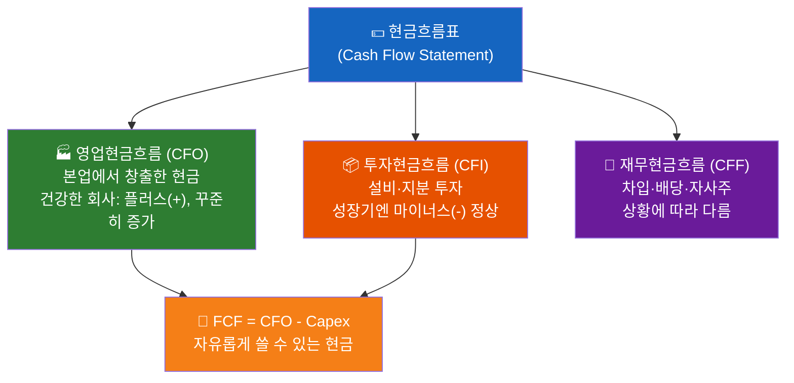
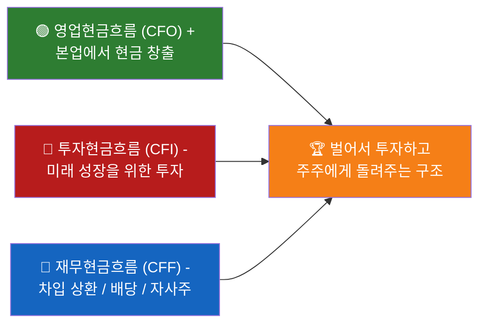
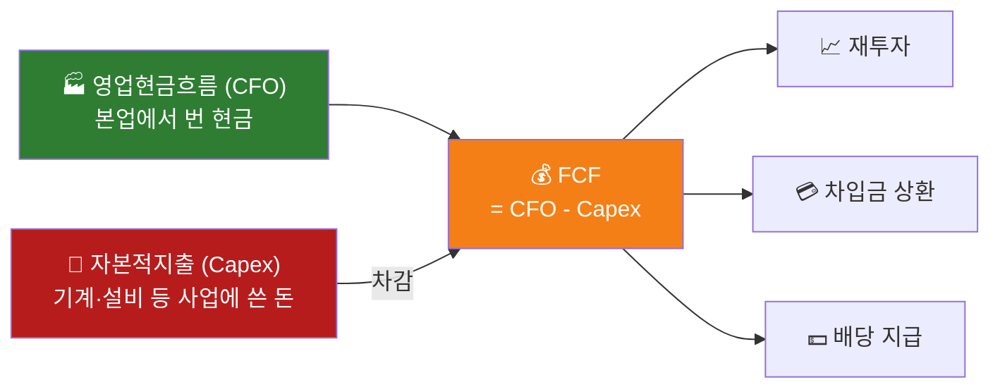
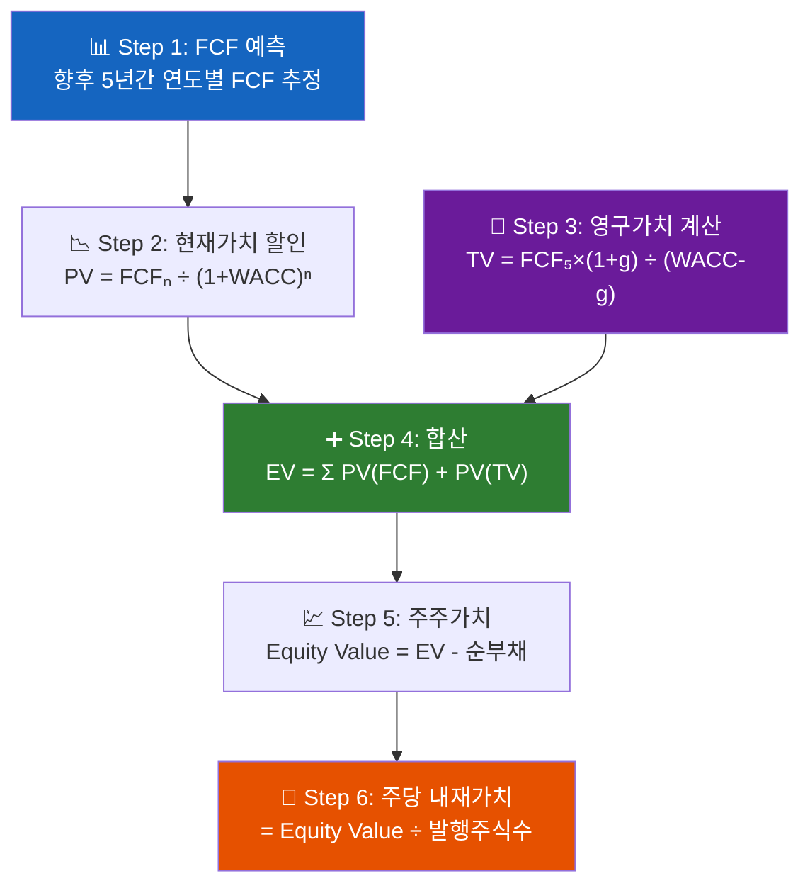
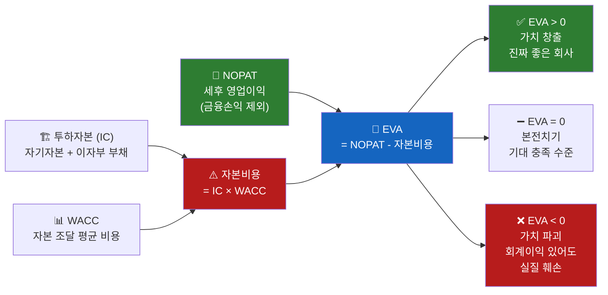
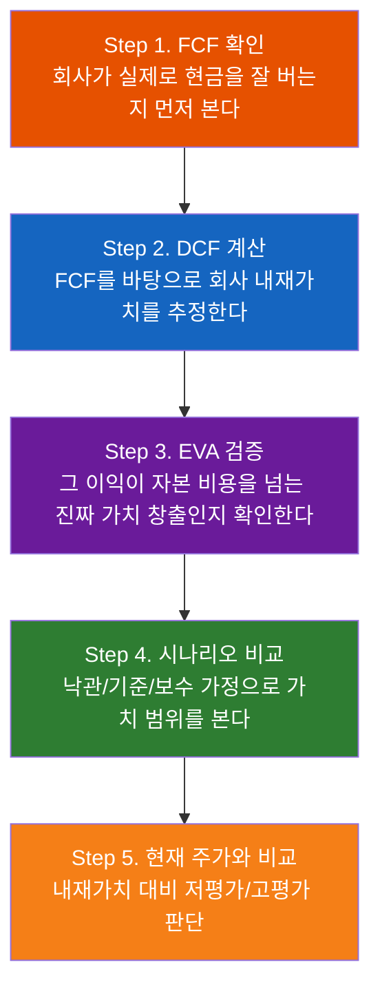
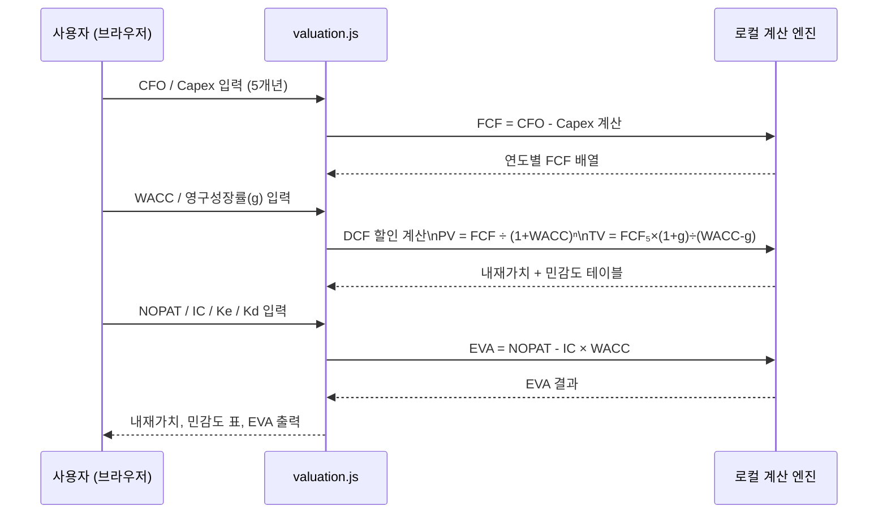
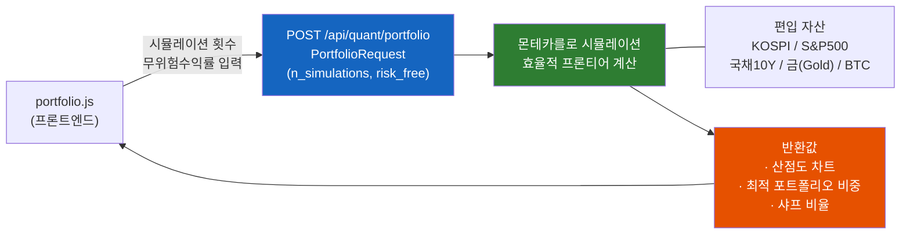
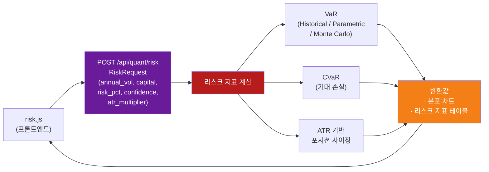

# Day 048 — 재무제표 분석 II (현금흐름표 & 기업가치)

> **모듈 7: 투자분석 기초 방법론** | 7/10일차 | 💹 | 학습시간: 8시간


---

> 📺 **YouTube 강의**: [🎬 재무제표 현금흐름표 기업가치](https://www.youtube.com/results?search_query=재무제표+현금흐름표+기업가치+파이썬+한국어)

## 오늘 배울 것 (아주 쉽게)

- 현금흐름표(Cash Flow Statement) 구조
- 영업·투자·재무 현금흐름 분석
- 기업가치 평가 개요
- 절대가치 평가: DCF, EVA, FCF 개념
- 실습: DCF 모델 구현

---


## 🗓 세부 일정 (1일 8시간)

> **강의 5시간** (5개 단락 × 50분 + 도입·마무리 50분) + **실습 3시간** = 총 8시간

| 시간 | 구분 | 내용 | 형태 |
|------|------|------|------|
| 09:00 – 09:10 | 도입 | 오늘 학습 목표 확인 | 강의 |
| 09:10 – 09:30 | **1단락** 설명 20분 | 현금흐름표(Cash Flow Statement) 구조 | 강의 |
| 09:30 – 10:00 | 각자 정리 & 유튜브 30분 | 노트 정리 · 관련 영상 검색 | 자율 |
| 10:00 – 10:20 | **2단락** 설명 20분 | 영업·투자·재무 현금흐름 분석 | 강의 |
| 10:20 – 10:50 | 각자 정리 & 유튜브 30분 | 노트 정리 · 관련 영상 검색 | 자율 |
| 10:50 – 11:00 | ☕ 휴식 | — | — |
| 11:00 – 11:20 | **3단락** 설명 20분 | 재무제표 3종 연결 분석 | 강의 |
| 11:20 – 11:50 | 각자 정리 & 유튜브 30분 | 노트 정리 · 관련 영상 검색 | 자율 |
| 11:50 – 12:10 | **4단락** 설명 20분 | 기업가치 평가 개요 | 강의 |
| 12:10 – 12:40 | 각자 정리 & 유튜브 30분 | 노트 정리 · 관련 영상 검색 | 자율 |
| 12:40 – 13:00 | **5단락** 설명 20분 | 절대가치 평가: DCF, EVA, FCF 개념 | 강의 |
| 13:00 – 13:30 | 각자 정리 & 유튜브 30분 | 노트 정리 · 관련 영상 검색 | 자율 |
| 13:30 – 14:00 | 강의 마무리 | Q&A · 핵심 복습 | 강의 |
| 14:00 – 15:00 | 💻 **실습 1부** 60분 | DCF 계산 엔진 구현 (기본 DCF · WACC · 영구성장률) | 실습 |
| 15:00 – 15:10 | ☕ 휴식 | — | — |
| 15:10 – 16:00 | 💻 **실습 2부** 50분 | 시나리오 분석 · 민감도 분석 · 몬테카를로 시뮬레이션 구현 | 실습 |
| 16:00 – 16:10 | ☕ 휴식 | — | — |
| 16:10 – 17:00 | 💻 **실습 발표 & 리뷰** 50분 | 코드 리뷰 · 발표 · 피드백 | 실습 |

> 강의 5시간: 도입 10분 + 단락 5개×50분 + 마무리 30분 = **300분**  
> 실습 3시간: 1부 60분 + 휴식 10분 + 2부 50분 + 휴식 10분 + 발표·리뷰 50분 = **180분**

---

## 🔗 참고 사이트 & 데이터 원천

> 이 문서(재무제표 분석 II — 현금흐름표·DCF·EVA·FCF)의 실습에 필요한 공식 데이터 출처와 참고 사이트입니다. ⚿ 는 API 키 또는 승인이 필요한 항목입니다.

### 📊 국내 공식 데이터

| 기관 | URL | API 키 | 제공 데이터 |
|------|-----|--------|-------------|
| DART(전자공시시스템) | <https://opendart.fss.or.kr> | ⚿ 필요 | 현금흐름표, 연결재무제표, 사업보고서 |
| 한국은행 ECOS | <https://ecos.bok.or.kr> | ⚿ 필요 | 국고채 수익률(무위험수익률·WACC 기준) |
| KIND(상장공시시스템) | <https://kind.krx.co.kr> | 불필요(웹 조회) | 기업 가치평가 참고 공시 |
| 금융감독원(FSS) | <https://www.fss.or.kr> | 불필요(웹 조회) | 감사보고서·재무 감독 자료 |
| 금융위원회 | <https://www.fsc.go.kr> | 불필요(웹 조회) | 회계기준·자본시장법 정보 |

### 🌍 해외 공식 데이터

| 기관 | URL | API 키 | 제공 데이터 |
|------|-----|--------|-------------|
| FRED (St. Louis Fed) | <https://fred.stlouisfed.org> | ⚿ 권장 | 미국 국채(무위험수익률), 시장 프리미엄 지표 |
| SEC EDGAR API | <https://data.sec.gov/api/xbrl/companyfacts> | 불필요 | 미국 기업 현금흐름표·FCF |
| yfinance (PyPI) | <https://pypi.org/project/yfinance> | 불필요 | 주가·재무제표·배당 데이터 |

### 📈 리서치·뉴스·포탈 참고

| 분류 | 사이트 | URL | 활용 용도 |
|------|--------|-----|-----------|
| 리서치 플랫폼 | FnGuide | <https://www.fnguide.com> | DCF·EVA 기반 목표주가 리포트 |
| 차트 플랫폼 | TradingView | <https://www.tradingview.com> | 기업 가치평가 지표 차트 |
| 금융 포탈 | 네이버 금융 | <https://finance.naver.com> | 기업별 현금흐름·배당 현황 |
| 금융 미디어 | 머니투데이 방송(MTN) | <https://mtn.co.kr> | 기업 실적·DCF 분석 뉴스 |
| 증권사 리서치 | 미래에셋증권 | <https://securities.miraeasset.com> | DCF·기업가치 평가 리포트 |
| 증권사 리서치 | NH투자증권 | <https://www.nhqv.com> | 기업가치·목표주가 리포트 |
| 연구기관 | 한국회계기준원 | <https://www.kasb.or.kr> | K-IFRS 회계기준 정보 |

---


### 1. 현금흐름표(Cash Flow Statement) 구조

> 📖 **Wikipedia**: [현금흐름표](https://ko.wikipedia.org/wiki/현금흐름표)

> 📺 [🎬 현금흐름표 구조 읽는 법](https://www.youtube.com/results?search_query=현금흐름표+구조+읽는법+재무제표+한국어)

현금흐름표는 **회계상 이익(발생주의)이 아니라 실제 현금의 흐름(현금주의)**을 보여줍니다.



| 구분 | 내용 | 건강한 회사의 패턴 |
|------|------|-------------------|
| **영업현금흐름(CFO)** | 본업에서 창출한 현금 | 플러스(+), 꾸준히 증가 |
| **투자현금흐름(CFI)** | 설비·지분 투자 | 성장기엔 마이너스(-) 정상 |
| **재무현금흐름(CFF)** | 차입·배당·자사주 | 상황에 따라 다름 |

- "이익은 의견이고, 현금은 사실이다(Earnings are an opinion; cash is a fact)"는 말이 있을 만큼, 손익보다 현금이 더 중요한 경우가 있습니다.

### 2. 영업·투자·재무 현금흐름 분석

> 📖 **Wikipedia**: [영업 현금 흐름](https://ko.wikipedia.org/wiki/영업_현금_흐름) · [잉여현금흐름](https://ko.wikipedia.org/wiki/잉여현금흐름)

> 📺 [🎬 영업투자재무 현금흐름 해석법](https://www.youtube.com/results?search_query=영업현금흐름+투자현금흐름+재무현금흐름+분석+한국어)

**현금흐름 패턴으로 기업 단계 파악하기**

| CFO | CFI | CFF | 기업 유형 |
|-----|-----|-----|-----------|
| + | - | - | 이상적인 성숙 기업 (벌어서 투자하고 배당) |
| + | - | + | 성장 기업 (벌지만 차입도 해서 투자) |
| - | - | + | 초기 성장 기업 (아직 적자, 외부 자금 의존) |
| + | + | - | 구조조정 중 (자산 매각으로 부채 상환) |

- 영업현금이 꾸준히 플러스인지, 투자지출이 미래 성장을 위한 것인지, 차입 증가가 위험 신호인지 함께 살펴보는 것이 핵심입니다.

**현금흐름표에서 꼭 확인할 6가지**

| 확인 항목 | 보는 방법 | 해석 포인트 |
|-----------|-----------|-------------|
| **영업현금흐름(CFO)** | 본업에서 현금이 들어오는지 | 장기적으로 플러스가 가장 중요 |
| **순이익 vs CFO** | CFO가 순이익보다 너무 낮지 않은지 | 이익의 질, 매출채권·재고 부담 확인 |
| **투자현금흐름(CFI)** | 설비투자·지분투자·자산매각 확인 | 성장 투자와 생존용 자산매각 구분 |
| **재무현금흐름(CFF)** | 차입·상환·배당·자사주 확인 | 외부 자금 의존도와 주주환원 확인 |
| **FCF** | CFO - Capex | 회사가 자유롭게 쓸 수 있는 현금 |
| **현금및현금성자산 증감** | 기초 현금과 기말 현금 비교 | 실제 현금 체력이 좋아졌는지 확인 |

**순이익과 영업현금흐름이 다르게 움직이는 이유**

| 항목 | CFO에 미치는 영향 | 해석 |
|------|-------------------|------|
| **매출채권 증가** | 감소(-) | 팔았지만 아직 현금을 못 받은 상태 |
| **재고자산 증가** | 감소(-) | 현금이 재고에 묶인 상태 |
| **매입채무 증가** | 증가(+) | 비용 지급을 뒤로 미룬 상태 |
| **감가상각비** | 증가(+) | 비용 처리됐지만 현금 유출은 없는 항목 |
| **법인세·이자 지급** | 감소(-) | 실제 현금 유출 |

**좋은 현금흐름의 예시**



**주의해야 할 현금흐름의 예시**

| 상황 | 가능한 해석 |
|------|-------------|
| 순이익 흑자, CFO 반복 적자 | 매출채권·재고 증가, 이익의 질 저하 |
| CFO 적자, CFF 플러스 | 본업 현금 부족을 차입·증자로 메우는 구조 |
| CFI 플러스가 반복 | 성장 투자보다 자산 매각으로 현금 확보 가능성 |
| CFO 플러스지만 FCF 적자 | 설비투자 부담이 크거나 성장 투자 단계 |
| 현금 감소와 단기차입 증가 동시 발생 | 유동성 압박 가능성 |

### 3. 재무제표 3종 연결 분석

> 📖 **Wikipedia**: [재무제표](https://ko.wikipedia.org/wiki/재무제표)

재무제표는 각각 따로 보는 것이 아니라, 아래 순서로 연결해서 읽어야 합니다.

| 순서 | 보는 표 | 핵심 질문 |
|------|---------|-----------|
| 1 | **손익계산서** | 회사가 돈을 벌고 있는가? 본업 이익률은 좋아지는가? |
| 2 | **대차대조표/재무상태표** | 그 성장이 부채를 늘려 만든 것인가, 자본을 쌓아 만든 것인가? |
| 3 | **현금흐름표** | 회계상 이익이 실제 현금으로 들어오고 있는가? |

**연결해서 보는 대표 사례**

| 관찰된 현상 | 추가로 확인할 표 | 해석 |
|-------------|------------------|------|
| 매출과 영업이익 증가 | 대차대조표의 매출채권·재고 | 현금 회수가 잘 되는 성장인지 확인 |
| 순이익 증가 | 현금흐름표의 CFO | 이익이 실제 현금으로 바뀌는지 확인 |
| 자산 증가 | 대차대조표의 부채·자본 | 차입 성장인지 이익 누적 성장인지 확인 |
| 투자현금흐름 대규모 마이너스 | 손익계산서의 향후 매출·이익 | 설비투자가 성과로 이어지는지 확인 |
| 재무현금흐름 플러스 | 대차대조표의 차입금 | 신규 투자용 차입인지 생존용 차입인지 구분 |

**한 문장 분석 템플릿**

```
이 회사는 손익계산서상 [매출/영업이익]이 [증가/감소]하고 있으며,
재무상태표상 [부채/현금/재고/매출채권]은 [안정/악화]되고,
현금흐름표상 영업현금흐름은 [플러스/마이너스]이므로
[건강한 성장/수익성 개선/유동성 주의/이익의 질 점검 필요]로 판단한다.
```

### 4. 기업가치 평가 개요

> 📖 **Wikipedia**: [기업가치](https://ko.wikipedia.org/wiki/기업가치) · [가중평균자본비용](https://ko.wikipedia.org/wiki/가중평균자본비용)

**쉽게 이해하기**
- 기업가치 평가는 "이 회사가 지금 시장에서 얼마 정도로 평가받아야 할까?"를 따져보는 과정입니다.
- 단순히 주가만 보는 것이 아니라, 회사가 앞으로 벌어들일 현금과 현재 재무 상태를 함께 고려합니다.

**장표에서 볼 포인트**
- 이 장표는 이후의 DCF, EVA, FCF 같은 방법들이 왜 필요한지 배경을 설명하는 역할을 합니다.
- 가치 평가는 정답 하나를 맞히는 일이 아니라, 가정이 바뀌면 결과도 달라진다는 점을 이해하는 것이 중요합니다.

**기업가치(EV)와 주주가치(Equity Value) 구분**

| 구분 | 뜻 | 왜 중요한가 |
|------|----|-------------|
| **기업가치(EV)** | 사업 전체를 인수한다고 보고 평가한 가치 | 부채 포함 기준이라 기업 자체 체력을 보기 좋음 |
| **주주가치(Equity Value)** | 기업가치에서 순부채를 반영한 뒤 주주 몫으로 남는 가치 | 실제 주가와 연결되는 가치 |

```text
기업가치(EV) = 주주가치 + 순부채
주주가치 = 기업가치(EV) - 순부채
```

- 현금이 많고 부채가 적은 회사는 같은 EV라도 주주가치가 더 크게 남을 수 있습니다.
- 반대로 영업이익은 좋아 보여도 순부채가 크면 주주 입장에서 체감 가치는 줄어들 수 있습니다.

**기업가치 분석 체크리스트**

1. **본업의 현금 창출력**: CFO와 FCF가 꾸준한가?
2. **재무 안전성**: 순부채, 이자 부담, 유동성은 감당 가능한가?
3. **성장 가정의 현실성**: 매출 성장률과 마진 개선 가정이 산업 평균과 맞는가?
4. **할인율의 적절성**: 금리, 사업 위험, 자본 구조가 반영됐는가?
5. **결과 해석 방식**: 단일 숫자보다 보수·기준·낙관 시나리오 범위로 보는가?

### 5. 절대가치 평가: DCF, EVA, FCF 개념

> 📖 **Wikipedia**: [현금 흐름 할인법](https://ko.wikipedia.org/wiki/현금_흐름_할인법) · [경제적 부가가치](https://ko.wikipedia.org/wiki/경제적_부가가치) · [잉여현금흐름](https://ko.wikipedia.org/wiki/잉여현금흐름)

> 📺 [🎬 DCF 할인현금흐름 기업가치 평가](https://www.youtube.com/results?search_query=DCF+할인현금흐름+기업가치평가+한국어)

> **절대가치 평가란?**
> 다른 회사와 비교하지 않고, 이 회사가 앞으로 벌어들일 현금을 직접 계산해서 "이 회사는 얼마짜리인가?"를 스스로 따져보는 방법입니다. 마치 가게를 살 때 "이 가게가 앞으로 매년 얼마를 벌 수 있을까?"를 따져보는 것과 같습니다.

---

#### 5-1. FCF (Free Cash Flow, 잉여현금흐름)

> **초등학생 비유**
> 용돈을 받아서(영업현금흐름) 연필, 공책을 산 뒤(설비투자) 남은 돈이 FCF입니다.
> 이 남은 돈으로 저축도 하고, 친구에게 빌린 돈도 갚고, 부모님께 용돈도 드릴 수 있습니다.
> 회사도 마찬가지입니다. FCF가 크고 꾸준할수록 "진짜 돈을 잘 버는 회사"입니다.



**FCF를 쉽게 이해하는 예시**

| 항목 | 금액 | 설명 |
|------|------|------|
| 영업현금흐름(CFO) | +200억 | 물건 팔고 서비스 제공해서 실제 들어온 현금 |
| 설비투자(Capex) | -50억 | 공장, 기계 등 사업에 다시 투자한 돈 |
| **FCF (남은 현금)** | **+150억** | **주주 배당, 차입금 상환, 재투자에 쓸 수 있는 진짜 여유 돈** |

**FCF가 중요한 이유**
- 회계 이익은 숫자를 '조정'할 여지가 있지만, FCF는 통장에 실제로 들어온 현금입니다.
- FCF가 꾸준히 플러스인 기업은 외부 자금 없이 스스로 성장할 수 있습니다.
- FCF를 주식 수로 나누면 **주당 FCF**를 구할 수 있어, 주가와 직접 비교할 수 있습니다.

> 📺 [🎬 FCF 잉여현금흐름 계산 설명](https://www.youtube.com/results?search_query=FCF+잉여현금흐름+계산+투자+한국어)

---

#### 5-2. DCF (Discounted Cash Flow, 할인현금흐름)

> **초등학생 비유**
> "1년 뒤에 받을 1만 원"과 "지금 당장 받는 1만 원" 중 어느 쪽이 더 좋나요?
> 당연히 **지금 받는 1만 원**입니다! 지금 받으면 은행에 넣어 이자도 받을 수 있으니까요.
> DCF는 이 원리를 이용해, 미래에 받을 현금을 **지금 기준의 가치**로 바꾸어 회사값을 계산합니다.



**DCF 계산 4단계**

```
1단계: 앞으로 몇 년간 FCF를 예측한다 (예: 5년)
2단계: 각 연도의 FCF를 "현재 가치"로 할인한다
3단계: 5년 이후 회사가 영원히 벌어들일 가치(영구가치)를 계산한다
4단계: 모두 더하고 부채를 빼면 주주 몫의 가치가 나온다
```

**수식으로 표현하면**

```
기업가치(EV) = FCF₁/(1+r)¹ + FCF₂/(1+r)² + ... + FCFₙ/(1+r)ⁿ + TV/(1+r)ⁿ

영구가치(Terminal Value, TV) = FCFₙ × (1+g) / (r - g)

여기서:
  r = WACC (할인율, 회사의 자본조달 평균 비용)
  g = 영구 성장률 (보통 경제성장률 수준, 2~3%)
```

**할인율(WACC)이란?**
- 회사가 사업을 위해 돈을 빌리거나(부채) 주식을 발행(자본)하는 데 드는 평균 비용입니다.
- 쉽게 말해 "이 회사의 돈 값(투자자 요구 수익률)"이라고 생각하면 됩니다.

```
WACC = 자기자본비율 × 자기자본비용 + 부채비율 × 부채비용 × (1 - 세율)
```

| WACC 요소 | 쉬운 설명 | 일반적 범위 |
|-----------|-----------|-------------|
| 자기자본비용 | 주주가 요구하는 수익률 | 8~15% |
| 부채비용 | 은행 대출 이자율 | 3~7% |
| **WACC (평균)** | **기업 전체의 자본 비용** | **6~12%** |

**DCF의 민감도 — 가정이 바뀌면 가치도 크게 달라집니다**

| 할인율(WACC) | 성장률(g) | 내재가치 예시 |
|-------------|----------|--------------|
| 7% | 3% | 높게 나옴 |
| 10% | 2% | 중간 |
| 13% | 1% | 낮게 나옴 |

> **핵심 교훈**: DCF는 "정확한 답"을 구하는 게 아닙니다. 가정을 바꿔가며 **가치의 범위(보수~낙관)**를 확인하는 도구입니다.

> 📺 [🎬 DCF 할인율 영구성장률 민감도](https://www.youtube.com/results?search_query=DCF+할인율+영구성장률+민감도분석+한국어)

---

#### 5-3. EVA (Economic Value Added, 경제적 부가가치)

> **초등학생 비유**
> 친구에게 돈을 빌려 장사를 했을 때, 장사로 번 돈이 이자보다 많아야 진짜 이익입니다.
> 장사 이익 10만원 - 이자 8만원 = 진짜 번 돈 2만원!
> EVA는 이처럼 **회사가 자본 비용(주주·채권자 몫)을 내고도 진짜로 가치를 만들었는지** 따져봅니다.



```
EVA = NOPAT - 투하자본 × WACC

여기서:
  NOPAT = 세후 영업이익 (금융손익 제외, 진짜 본업 이익)
  투하자본 = 사업에 실제로 투입된 자본 (자기자본 + 이자부 부채)
  WACC = 자본 조달 평균 비용 (주주와 채권자가 원하는 수익률)
```

**EVA 해석 방법**

| EVA 결과 | 의미 | 투자자 관점 |
|----------|------|-------------|
| **EVA > 0** | 자본 비용을 내고도 남는 가치 창출 | 진짜 좋은 회사 |
| **EVA = 0** | 딱 본전치기 | 투자자 기대 충족 수준 |
| **EVA < 0** | 자본 비용도 못 벌어내는 구조 | 회계이익이 있어도 실질 가치 훼손 |

**EVA 예시로 이해하기**

```
A회사:
  세후 영업이익(NOPAT)  = 500억원
  투하자본              = 4,000억원
  WACC                 = 10%
  자본비용              = 4,000억 × 10% = 400억원
  EVA                  = 500억 - 400억 = +100억원  ← 가치 창출!

B회사:
  세후 영업이익(NOPAT)  = 300억원
  투하자본              = 4,000억원
  WACC                 = 10%
  자본비용              = 4,000억 × 10% = 400억원
  EVA                  = 300억 - 400억 = -100억원  ← 회계이익은 있지만 가치 파괴
```

> **핵심 교훈**: 영업이익이 플러스라고 해서 다 좋은 회사가 아닙니다. 자본 비용을 넘어서야 진짜 가치를 만드는 회사입니다.

> 📺 [🎬 EVA 경제적부가가치 자본비용 설명](https://www.youtube.com/results?search_query=EVA+경제적부가가치+자본비용+WACC+한국어)

---

#### 5-4. 세 가지 방법 비교 정리

| 구분 | FCF | DCF | EVA |
|------|-----|-----|-----|
| **핵심 질문** | 이 회사가 실제로 얼마나 현금을 남기나? | 미래 현금을 지금 가치로 환산하면 회사가 얼마인가? | 자본 비용을 내고도 진짜 가치를 만드나? |
| **초등학생 비유** | 용돈에서 필수 지출 후 남은 돈 | 미래 용돈의 오늘 가치 | 빌린 돈 이자 내고도 이익이 남나? |
| **강점** | 이익 조작이 어려운 현금 기반 | 내재가치 직접 추정 가능 | 자본 효율성 평가 |
| **약점** | 미래 성장성을 직접 반영 못함 | 가정에 매우 민감 | 투하자본 산정이 복잡 |
| **활용 시점** | 현금 창출력 확인 시 | 성장주 가치 평가 시 | 자본 배분 효율성 점검 시 |

**절대가치 평가 실전 활용 순서**



### 6. 실습: Python으로 DCF 모델 구현

> 📺 [🎬 DCF 모델 파이썬 기업가치 계산](https://www.youtube.com/results?search_query=DCF모델+파이썬+기업가치+계산+한국어)

가정이 바뀌면 결과도 달라진다는 것을 직접 확인하는 것이 이 실습의 핵심입니다.

```python
import numpy as np

def dcf_valuation(
    fcf_base: float,       # 기준 FCF (억원)
    growth_rates: list,    # 연도별 성장률 리스트 (예: 5년)
    terminal_growth: float,# 영구 성장률
    wacc: float,           # 할인율 (WACC)
    net_debt: float,       # 순부채 (억원)
    shares: float,         # 발행주식수 (백만 주)
) -> dict:

    # 미래 FCF 계산
    fcfs = []
    fcf = fcf_base
    for g in growth_rates:
        fcf *= (1 + g)
        fcfs.append(fcf)

    # 현재가치(PV) 할인
    pv_fcfs = [fcf / (1 + wacc)**(i+1) for i, fcf in enumerate(fcfs)]

    # 영구가치(Terminal Value)
    terminal_fcf = fcfs[-1] * (1 + terminal_growth)
    terminal_value = terminal_fcf / (wacc - terminal_growth)
    pv_terminal = terminal_value / (1 + wacc)**len(fcfs)

    # 기업가치 = PV(FCF) + PV(Terminal Value) - 순부채
    enterprise_value = sum(pv_fcfs) + pv_terminal
    equity_value = enterprise_value - net_debt
    intrinsic_per_share = equity_value / shares * 100  # 원 단위

    return {
        "FCF 현재가치 합계(억)": round(sum(pv_fcfs), 0),
        "영구가치 현재가치(억)":  round(pv_terminal, 0),
        "기업가치(EV)(억)":      round(enterprise_value, 0),
        "주주가치(억)":          round(equity_value, 0),
        "내재가치(주당, 원)":    round(intrinsic_per_share, 0),
    }

# 시나리오 비교 (할인율 변화 민감도)
params = dict(
    fcf_base=5000,
    growth_rates=[0.12, 0.10, 0.08, 0.06, 0.05],
    terminal_growth=0.03,
    net_debt=8000,
    shares=600,  # 600백만 주
)

print("=== DCF 민감도 분석 (할인율 변화) ===")
for wacc in [0.07, 0.09, 0.11, 0.13]:
    result = dcf_valuation(**params, wacc=wacc)
    print(f"WACC {wacc*100:.0f}%: 내재가치 {result['내재가치(주당, 원)']:,.0f}원")
```

#### 6-1. 고도화 목표: DCF 웹앱 시뮬레이터

기존 실습은 Python 함수로 DCF를 한 번 계산하는 수준입니다. 고도화 실습에서는 사용자가 웹에서 가정을 바꾸고, 결과가 실시간으로 변하는 **DCF 기업가치 평가 시뮬레이터**를 설계합니다.

최종 산출물:

| 산출물 | 파일/화면 | 설명 |
|---|---|---|
| 기본 DCF 계산기 | `valuation.js` 또는 `/api/valuation/dcf` | FCF, WACC, 영구성장률 입력 후 내재가치 계산 |
| 시나리오 테이블 | `dcf_scenarios.csv` | 보수/기준/낙관 가정 비교 |
| 민감도 분석 | `dcf_sensitivity.csv` | WACC × 영구성장률 매트릭스 |
| 몬테카를로 결과 | `dcf_monte_carlo.csv` | 확률분포 기반 내재가치 범위 |
| 대시보드 이미지 | `dcf_dashboard.png` | FCF 예측, 가치 구성, 민감도 히트맵 |
| 리포트 | `dcf_valuation_report.md` | 가정, 결과, 리스크, 투자 판단 |

---

#### 6-2. 웹앱 입력값 설계

DCF는 가정이 전부입니다. 웹앱에서는 입력값을 명확한 그룹으로 나눕니다.

| 그룹 | 입력값 | 설명 |
|---|---|---|
| 회사 정보 | 회사명, 현재 주가, 발행주식수 | 주당 내재가치와 현재 주가 비교 |
| 현금흐름 | 기준 FCF, 예측 기간, 연도별 성장률 | 미래 FCF 예측 |
| 할인율 | WACC, 무위험수익률, 베타, 시장위험프리미엄 | 현재가치 할인 |
| 영구가치 | 영구성장률, Exit Multiple | Terminal Value 방식 선택 |
| 재무구조 | 현금, 이자부부채, 순부채 | EV에서 Equity Value 변환 |
| 시나리오 | Bear/Base/Bull 성장률·마진·WACC | 가치 범위 확인 |
| 리스크 | FCF 변동성, WACC 범위, 성장률 범위 | 몬테카를로 시뮬레이션 |

**권장 검증 규칙**

| 규칙 | 이유 |
|---|---|
| `WACC > terminal_growth` | 영구가치 공식이 성립하기 위한 필수 조건 |
| 영구성장률은 보통 장기 GDP 성장률보다 과도하게 높게 두지 않음 | 지나친 낙관 방지 |
| Terminal Value 비중이 80% 이상이면 경고 | 가치 대부분이 먼 미래 가정에 의존 |
| FCF가 반복 적자면 DCF보다 시나리오/옵션 가치 접근 필요 | 안정적 현금흐름 기업에 DCF가 더 적합 |

---

#### 6-3. DCF 계산 엔진 분리

프론트엔드 전용 계산도 가능하지만, 고도화 웹앱에서는 계산 엔진을 백엔드 서비스로 분리하는 것이 좋습니다.

```python
import numpy as np
import pandas as pd

def project_fcf(fcf_base, growth_rates):
    fcfs = []
    fcf = fcf_base
    for year, growth in enumerate(growth_rates, start=1):
        fcf = fcf * (1 + growth)
        fcfs.append({"year": year, "growth": growth, "fcf": fcf})
    return pd.DataFrame(fcfs)

def calculate_dcf(
    fcf_base,
    growth_rates,
    wacc,
    terminal_growth,
    net_debt,
    shares,
):
    if wacc <= terminal_growth:
        raise ValueError("WACC는 영구성장률보다 커야 합니다.")

    fcf_df = project_fcf(fcf_base, growth_rates)
    fcf_df["discount_factor"] = 1 / ((1 + wacc) ** fcf_df["year"])
    fcf_df["pv_fcf"] = fcf_df["fcf"] * fcf_df["discount_factor"]

    terminal_fcf = fcf_df["fcf"].iloc[-1] * (1 + terminal_growth)
    terminal_value = terminal_fcf / (wacc - terminal_growth)
    pv_terminal = terminal_value / ((1 + wacc) ** len(fcf_df))

    enterprise_value = fcf_df["pv_fcf"].sum() + pv_terminal
    equity_value = enterprise_value - net_debt
    intrinsic_per_share = equity_value / shares

    return {
        "fcf_table": fcf_df.to_dict(orient="records"),
        "pv_fcf_sum": float(fcf_df["pv_fcf"].sum()),
        "terminal_value": float(terminal_value),
        "pv_terminal": float(pv_terminal),
        "enterprise_value": float(enterprise_value),
        "equity_value": float(equity_value),
        "intrinsic_per_share": float(intrinsic_per_share),
        "terminal_value_weight": float(pv_terminal / enterprise_value),
    }
```

---

#### 6-4. 보수·기준·낙관 시나리오

```python
SCENARIOS = {
    "bear": {
        "growth_rates": [0.03, 0.03, 0.025, 0.02, 0.02],
        "wacc": 0.11,
        "terminal_growth": 0.015,
    },
    "base": {
        "growth_rates": [0.08, 0.07, 0.06, 0.05, 0.04],
        "wacc": 0.09,
        "terminal_growth": 0.025,
    },
    "bull": {
        "growth_rates": [0.14, 0.12, 0.10, 0.08, 0.06],
        "wacc": 0.075,
        "terminal_growth": 0.03,
    },
}

def run_scenarios(fcf_base, net_debt, shares):
    rows = []
    for name, scenario in SCENARIOS.items():
        result = calculate_dcf(
            fcf_base=fcf_base,
            growth_rates=scenario["growth_rates"],
            wacc=scenario["wacc"],
            terminal_growth=scenario["terminal_growth"],
            net_debt=net_debt,
            shares=shares,
        )
        rows.append({
            "scenario": name,
            "wacc": scenario["wacc"],
            "terminal_growth": scenario["terminal_growth"],
            "enterprise_value": result["enterprise_value"],
            "equity_value": result["equity_value"],
            "intrinsic_per_share": result["intrinsic_per_share"],
            "terminal_value_weight": result["terminal_value_weight"],
        })
    return pd.DataFrame(rows)

scenario_df = run_scenarios(fcf_base=5000, net_debt=8000, shares=600)
scenario_df.to_csv("dcf_scenarios.csv", index=False, encoding="utf-8-sig")
print(scenario_df)
```

---

#### 6-5. WACC × 영구성장률 민감도 분석

```python
def sensitivity_table(
    fcf_base,
    growth_rates,
    net_debt,
    shares,
    wacc_values,
    terminal_growth_values,
):
    table = pd.DataFrame(index=[f"{w:.1%}" for w in wacc_values])
    for g in terminal_growth_values:
        values = []
        for wacc in wacc_values:
            if wacc <= g:
                values.append(np.nan)
                continue
            result = calculate_dcf(fcf_base, growth_rates, wacc, g, net_debt, shares)
            values.append(result["intrinsic_per_share"])
        table[f"g={g:.1%}"] = values
    return table

sensitivity = sensitivity_table(
    fcf_base=5000,
    growth_rates=[0.08, 0.07, 0.06, 0.05, 0.04],
    net_debt=8000,
    shares=600,
    wacc_values=[0.075, 0.085, 0.095, 0.105, 0.115],
    terminal_growth_values=[0.01, 0.02, 0.025, 0.03, 0.035],
)
sensitivity.to_csv("dcf_sensitivity.csv", encoding="utf-8-sig")
print(sensitivity.round(0))
```

---

#### 6-6. 몬테카를로 DCF 시뮬레이션

DCF의 불확실성을 더 현실적으로 보려면 성장률과 WACC를 분포로 두고 여러 번 계산합니다.

```python
def monte_carlo_dcf(
    fcf_base,
    net_debt,
    shares,
    n_simulations=5000,
    seed=42,
):
    rng = np.random.default_rng(seed)
    rows = []
    for _ in range(n_simulations):
        first_year_growth = rng.normal(0.08, 0.04)
        fade = rng.uniform(0.65, 0.9)
        growth_rates = [max(-0.1, first_year_growth * (fade ** i)) for i in range(5)]
        wacc = np.clip(rng.normal(0.09, 0.015), 0.06, 0.14)
        terminal_growth = np.clip(rng.normal(0.025, 0.006), 0.005, 0.04)

        if wacc <= terminal_growth:
            continue

        result = calculate_dcf(fcf_base, growth_rates, wacc, terminal_growth, net_debt, shares)
        rows.append({
            "intrinsic_per_share": result["intrinsic_per_share"],
            "enterprise_value": result["enterprise_value"],
            "wacc": wacc,
            "terminal_growth": terminal_growth,
            "year1_growth": growth_rates[0],
            "terminal_value_weight": result["terminal_value_weight"],
        })
    return pd.DataFrame(rows)

mc_df = monte_carlo_dcf(fcf_base=5000, net_debt=8000, shares=600)
mc_df.to_csv("dcf_monte_carlo.csv", index=False, encoding="utf-8-sig")
print(mc_df["intrinsic_per_share"].describe(percentiles=[0.05, 0.25, 0.5, 0.75, 0.95]))
```

---

#### 6-7. DCF 대시보드 시각화

```python
import matplotlib.pyplot as plt
import seaborn as sns

base_result = calculate_dcf(
    fcf_base=5000,
    growth_rates=[0.08, 0.07, 0.06, 0.05, 0.04],
    wacc=0.09,
    terminal_growth=0.025,
    net_debt=8000,
    shares=600,
)
fcf_table = pd.DataFrame(base_result["fcf_table"])

fig, axes = plt.subplots(2, 2, figsize=(14, 9))
fig.suptitle("DCF Valuation Dashboard", fontsize=16, fontweight="bold")

axes[0, 0].bar(fcf_table["year"], fcf_table["fcf"], color="steelblue")
axes[0, 0].set_title("Projected FCF")
axes[0, 0].set_xlabel("Year")
axes[0, 0].grid(True, axis="y", alpha=0.3)

value_parts = pd.Series({
    "PV of FCF": base_result["pv_fcf_sum"],
    "PV of Terminal Value": base_result["pv_terminal"],
    "Net Debt": -8000,
})
value_parts.plot(kind="bar", ax=axes[0, 1], color=["seagreen", "darkorange", "crimson"])
axes[0, 1].set_title("Value Bridge")
axes[0, 1].grid(True, axis="y", alpha=0.3)

sns.heatmap(sensitivity, annot=True, fmt=".0f", cmap="RdYlGn", ax=axes[1, 0])
axes[1, 0].set_title("Sensitivity: WACC x Terminal Growth")

sns.histplot(mc_df["intrinsic_per_share"], bins=40, kde=True, ax=axes[1, 1], color="purple")
axes[1, 1].axvline(mc_df["intrinsic_per_share"].median(), color="black", linestyle="--")
axes[1, 1].set_title("Monte Carlo Intrinsic Value Distribution")

plt.tight_layout()
plt.savefig("dcf_dashboard.png", dpi=150, bbox_inches="tight")
plt.show()
```

---

#### 6-8. 웹앱/API 설계

현재 `valuation.js`는 프론트엔드에서 DCF/EVA를 계산합니다. 고도화 버전은 프론트 실시간 계산과 백엔드 시뮬레이션 API를 함께 둡니다.

| 엔드포인트 | 메서드 | 역할 |
|---|---|---|
| `/api/valuation/dcf` | `POST` | 단일 DCF 계산 |
| `/api/valuation/dcf/scenarios` | `POST` | 보수/기준/낙관 시나리오 비교 |
| `/api/valuation/dcf/sensitivity` | `POST` | WACC × 영구성장률 민감도 |
| `/api/valuation/dcf/monte-carlo` | `POST` | 확률분포 기반 시뮬레이션 |
| `/api/valuation/dcf/report` | `POST` | Markdown/PDF 리포트 생성 |

**요청 예시**

```json
{
  "company": "Example Corp",
  "current_price": 52000,
  "fcf_base": 5000,
  "growth_rates": [0.08, 0.07, 0.06, 0.05, 0.04],
  "wacc": 0.09,
  "terminal_growth": 0.025,
  "net_debt": 8000,
  "shares": 600,
  "currency": "KRW",
  "unit": "억원"
}
```

**응답 예시**

```json
{
  "company": "Example Corp",
  "enterprise_value": 102300,
  "equity_value": 94300,
  "intrinsic_per_share": 157167,
  "upside_pct": 2.02,
  "terminal_value_weight": 0.73,
  "warnings": [
    "Terminal Value 비중이 높습니다. WACC와 영구성장률 민감도를 반드시 확인하세요."
  ],
  "tables": {
    "fcf_projection": [],
    "sensitivity": []
  }
}
```

**프론트엔드 화면 구성**

```text
상단
  - 회사명, 현재 주가, 발행주식수
  - 통화/단위 선택

탭 1: FCF Builder
  - CFO, Capex 직접 입력
  - 또는 기준 FCF와 성장률 입력

탭 2: DCF Result
  - EV, Equity Value, 주당 내재가치
  - 현재 주가 대비 upside/downside
  - Terminal Value 비중 경고

탭 3: Scenario
  - Bear/Base/Bull 가정 비교
  - 시나리오별 내재가치 막대 차트

탭 4: Sensitivity
  - WACC x terminal growth 히트맵

탭 5: Monte Carlo
  - 내재가치 확률분포
  - 5/25/50/75/95 percentile

탭 6: Report
  - 가정 요약
  - 투자 판단 문장
  - Markdown/PDF 다운로드
```

---

#### 6-9. 리포트 템플릿

```markdown
# DCF 기업가치 평가 리포트

## 1. 분석 대상
- 회사명:
- 현재 주가:
- 발행주식수:
- 순부채:
- 기준 FCF:

## 2. 핵심 가정
- 예측 기간:
- 연도별 FCF 성장률:
- WACC:
- 영구성장률:
- Terminal Value 방식:

## 3. 평가 결과
- 기업가치(EV):
- 주주가치:
- 주당 내재가치:
- 현재가 대비 상승/하락 여력:
- Terminal Value 비중:

## 4. 시나리오 분석
- Bear:
- Base:
- Bull:

## 5. 민감도 분석
- 가치에 가장 큰 영향을 준 가정:
- WACC 변화 영향:
- 영구성장률 변화 영향:

## 6. 리스크와 한계
- DCF는 가정 기반 모델임
- FCF 예측 오류 가능성
- WACC와 영구성장률에 매우 민감
- 산업 사이클과 재무구조 변화 반영 필요
```

---

#### 6-10. 실습 체크리스트

- [ ] 기본 DCF 계산 함수 작성
- [ ] Bear/Base/Bull 시나리오 테이블 생성
- [ ] WACC × 영구성장률 민감도 테이블 생성
- [ ] 몬테카를로 DCF 시뮬레이션 실행
- [ ] `dcf_dashboard.png` 생성
- [ ] `/api/valuation/dcf` 요청/응답 설계
- [ ] `/api/valuation/dcf/monte-carlo` 요청/응답 설계
- [ ] `dcf_valuation_report.md` 작성

---

## 🔗 Python 소스 연계

이 문서에서 설명하는 DCF·EVA·FCF 개념들이 앱 코드의 어느 모듈과 연결되는지 확인하세요.

### 가치평가 워크플로우 — `valuation.js` (프론트엔드 전용 계산)



- **구현 방식**: 백엔드 API 없이 `valuation.js`에서 모든 계산 수행
- **FCF 계산기**: 사용자가 CFO / Capex를 5개년 직접 입력
- **DCF**: WACC + 영구성장률 입력 → 내재가치 + 민감도 테이블 자동 생성
- **EVA**: NOPAT, IC, Ke, Kd 입력 → `EVA = NOPAT - IC × WACC`

### 포트폴리오 최적화 — `/api/quant/portfolio`



- **연결 개념**: Day 048의 DCF 할인율(WACC) = 포트폴리오 무위험수익률(`risk_free`) 설정과 동일한 논리
- **효율적 프론티어**: 리스크 대비 기대수익 최대화 → DCF 가정의 합리성 검증에 활용 가능

### 리스크 관리 — `/api/quant/risk`



- **연결 개념**: FCF 변동성이 클수록 DCF 할인율을 높이는 판단 근거 = VaR / CVaR 분석과 동일한 위험 개념
- **ATR 기반 포지션 사이징**: EVA 분석에서 투하자본(IC) 규모 결정 시 참고 가능

---

## 해보기 활동

오늘은 "이익"이 아니라 "현금"과 "가치"에 집중해서 정리해보세요.

1. 관심 기업 1개를 골라 영업·투자·재무 현금흐름이 각각 플러스인지 마이너스인지 적어보세요.
2. 그 흐름이 왜 나왔는지 기업 상황과 연결해 한 줄씩 설명해보세요.
3. 매출 성장률, 영업이익률, 할인율을 각각 하나의 가정으로 정하고, 어떤 가정이 기업가치에 가장 큰 영향을 줄지 써보세요.
4. 순부채를 확인해 "기업가치와 주주가치 차이가 큰 기업인지" 한 줄로 적어보세요.
5. 마지막으로 "이 회사의 현금흐름은 건강한가?"를 한 문장으로 정리해보세요.


## 다음 시간 미리보기

➡️ [Day 049](34.md) 에서 계속됩니다.
