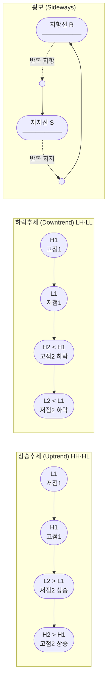
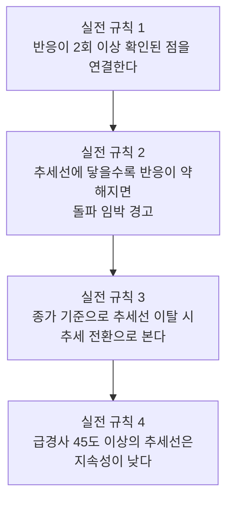
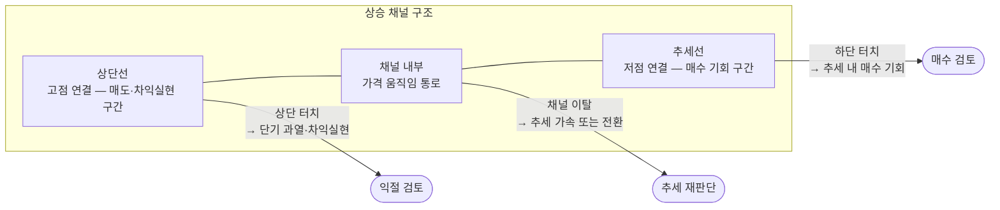
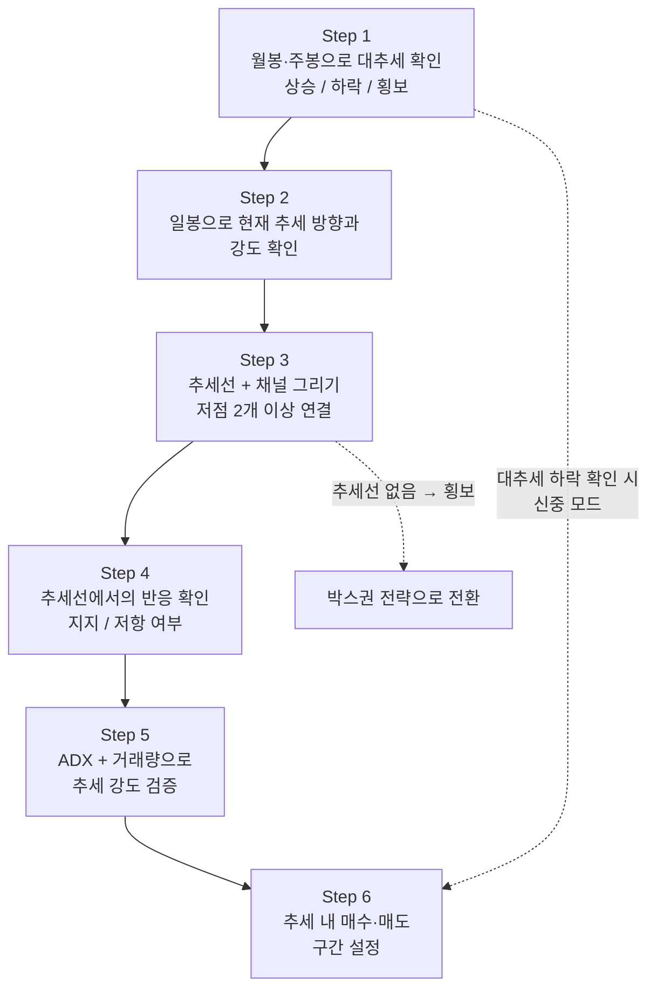
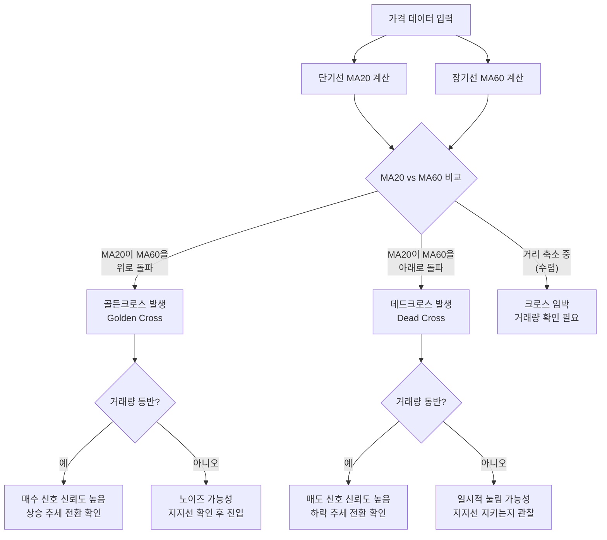
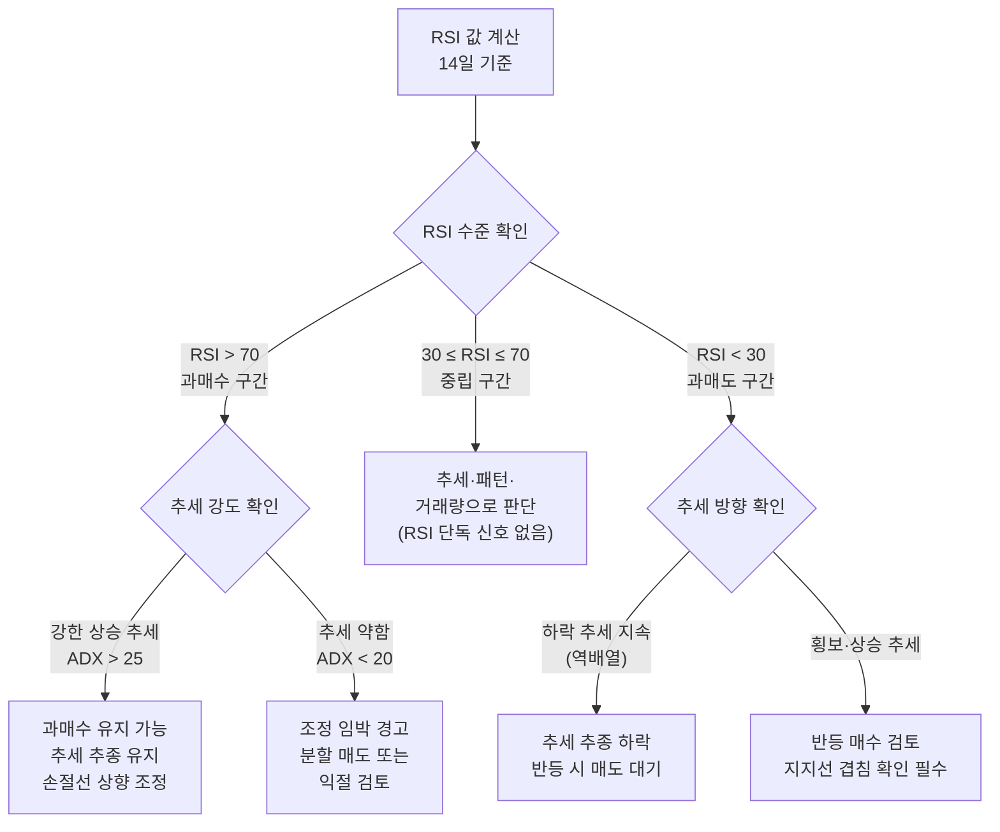
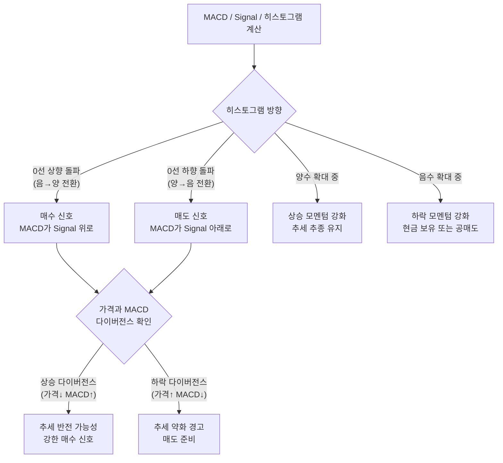
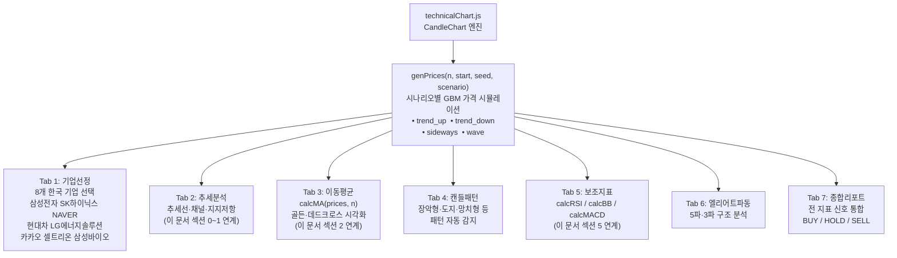
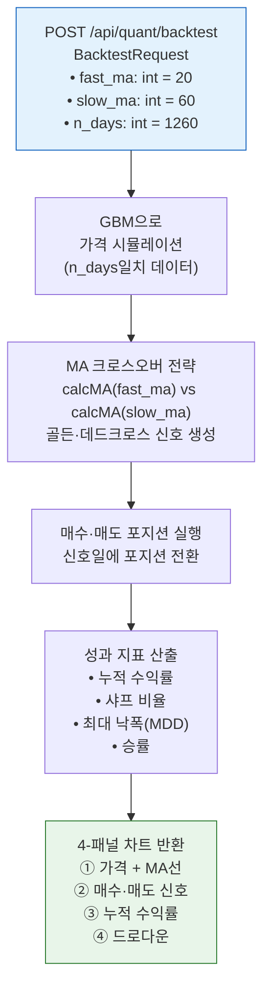
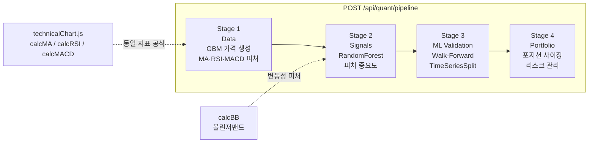

# Day 050 — 기술적 분석 I (추세 & 지표)

> **모듈 7: 투자분석 기초 방법론** | 9/10일차 | 💹 | 학습시간: 8시간

---

> 📺 **YouTube 강의**: [🎬 기술적 분석 추세 지표 이동평균](https://www.youtube.com/results?search_query=기술적분석+추세+이동평균+RSI+파이썬+한국어)
>
> 📝 **한자 병기 및 어원 사전**: 이 문서에 등장하는 용어의 한자·어원·일제강점기 유래는 → [voca.md](voca.md)

## 오늘 배울 것 (아주 쉽게)


- 지지선(Support)과 저항선(Resistance)
- 이동평균선(MA)과 골든크로스·데드크로스
- 갭(Gap) 반전 분석
- 되돌림 분석 (피보나치 되돌림)
- 보조지표: RSI, MACD, 볼린저밴드
- 실습: 기술적 지표 계산 및 시각화

---

## 🗓 세부 일정 (1일 8시간)


> **강의 5시간** (5개 단락 × 50분 + 도입·마무리 50분) + **실습 3시간** = 총 8시간

| 시간 | 구분 | 내용 | 형태 |
|------|------|------|------|
| 09:00 – 09:10 | 도입 | 오늘 학습 목표 확인 | 강의 |
| 09:10 – 09:30 | **1단락** 설명 20분 | 추세분석(Trend Analysis) & 지지선/저항선 | 강의 |
| 09:30 – 10:00 | 각자 정리 & 유튜브 30분 | 노트 정리 · 관련 영상 검색 | 자율 |
| 10:00 – 10:20 | **2단락** 설명 20분 | 이동평균선(MA)과 골든크로스·데드크로스 | 강의 |
| 10:20 – 10:50 | 각자 정리 & 유튜브 30분 | 노트 정리 · 관련 영상 검색 | 자율 |
| 10:50 – 11:00 | ☕ 휴식 | — | — |
| 11:00 – 11:20 | **3단락** 설명 20분 | 갭(Gap) 반전 분석 & 피보나치 되돌림 | 강의 |
| 11:20 – 11:50 | 각자 정리 & 유튜브 30분 | 노트 정리 · 관련 영상 검색 | 자율 |
| 11:50 – 12:10 | **4단락** 설명 20분 | 보조지표: RSI, MACD, 볼린저밴드 | 강의 |
| 12:10 – 12:40 | 각자 정리 & 유튜브 30분 | 노트 정리 · 관련 영상 검색 | 자율 |
| 12:40 – 13:00 | **5단락** 설명 20분 | 기술적 지표 시각화 설계 방법 | 강의 |
| 13:00 – 13:30 | 각자 정리 & 유튜브 30분 | 노트 정리 · 관련 영상 검색 | 자율 |
| 13:30 – 14:00 | 강의 마무리 | Q&A · 핵심 복습 | 강의 |
| 14:00 – 15:00 | 💻 **실습 1부** 60분 | 기술적 지표(이동평균·RSI·MACD·볼린저밴드) 계산 코드 작성 | 실습 |
| 15:00 – 15:10 | ☕ 휴식 | — | — |
| 15:10 – 16:00 | 💻 **실습 2부** 50분 | 멀티패널 차트 시각화 · 웹 페이지 출력 구현 | 실습 |
| 16:00 – 16:10 | ☕ 휴식 | — | — |
| 16:10 – 17:00 | 💻 **실습 발표 & 리뷰** 50분 | 코드 리뷰 · 발표 · 피드백 | 실습 |

> 강의 5시간: 도입 10분 + 단락 5개×50분 + 마무리 30분 = **300분**  
> 실습 3시간: 1부 60분 + 휴식 10분 + 2부 50분 + 휴식 10분 + 발표·리뷰 50분 = **180분**

---

## 🔗 참고 사이트 & 데이터 원천


> 이 문서(기술적 분석 I — 추세·이동평균·RSI·MACD·볼린저밴드)의 실습에 필요한 공식 데이터 출처와 참고 사이트입니다. ⚿ 는 API 키 또는 승인이 필요한 항목입니다.

### 📊 국내외 시장 데이터

| 기관/서비스 | URL | API 키 | 제공 데이터 |
|------------|-----|--------|-------------|
| yfinance (PyPI) | <https://pypi.org/project/yfinance> | 불필요 | 국내외 종목 OHLCV 시계열 |
| pykrx (PyPI) | <https://pypi.org/project/pykrx> | 불필요 | 국내 종목·ETF 주가 시계열 |
| pandas-ta (PyPI) | <https://pypi.org/project/pandas-ta> | 불필요 | 130+ 기술 지표 자동 계산 라이브러리 |
| mplfinance (PyPI) | <https://pypi.org/project/mplfinance> | 불필요 | 캔들 차트·기술 지표 시각화 |
| KRX Data Marketplace | <https://openapi.krx.co.kr> | ⚿ 필요 | 국내 공식 시장 데이터 API |

### 📈 차트·트레이딩 플랫폼 (학습·레퍼런스)

| 서비스 | URL | 활용 용도 |
|--------|-----|-----------|
| TradingView | <https://www.tradingview.com> | 이동평균·RSI·MACD·볼린저밴드 인터랙티브 차트 |
| TradingView Pine Script 문서 | <https://www.tradingview.com/pine-script-docs> | 지표 로직 레퍼런스 |
| Investing.com | <https://www.investing.com> | 기술 지표 분석·시그널 참고 |
| StockCharts | <https://stockcharts.com> | 기술 분석 지표 설명·차트 패턴 사전 |

### 🏦 국내 HTS/MTS & 증권사 (기술적 분석 실전 참고)

| 서비스 | URL | 활용 용도 |
|--------|-----|-----------|
| 키움증권 영웅문 | <https://www.kiwoom.com> | HTS 기술 지표 실전 설정법 |
| 미래에셋증권 m.Hero | <https://securities.miraeasset.com> | MTS 기술 지표 활용 |
| 네이버 금융 차트 | <https://finance.naver.com> | 국내 종목 캔들·이동평균 차트 |
| 다음 금융 차트 | <https://finance.daum.net> | 보조지표 포함 차트 조회 |

### 📰 금융 미디어 (시황·기술적 분석 뉴스)

| 서비스 | URL | 활용 용도 |
|--------|-----|-----------|
| 머니투데이 방송(MTN) | <https://mtn.co.kr> | 기술적 분석 시황 해설 방송 |
| 한국경제TV(WOW TV) | <https://www.wowtv.co.kr> | 차트 분석·매매 전략 방송 |
| 연합인포맥스 | <https://news.einfomax.co.kr> | 시장 기술 분석 속보 |

---

### 0. 추세분석 (Trend Analysis) — 가장 먼저 봐야 할 것

> 📖 **Wikipedia**: [기술적 분석](https://ko.wikipedia.org/wiki/기술적_분석_(금융)) · [추세선](https://ko.wikipedia.org/wiki/추세선_(금융))

> 📺 [🎬 추세분석 상승 하락 횡보 기술적 분석](https://www.youtube.com/results?search_query=추세분석+상승추세+하락추세+횡보+기술적분석+한국어)

**추세란 무엇인가?**

> "추세를 따라가라(Trend is your friend)" — 기술적 분석의 제1 원칙

추세는 가격이 **방향을 가지고 지속적으로 움직이는 흐름**입니다. 모든 기술적 분석은 추세 파악에서 시작합니다.

#### 추세의 세 가지 종류

| 추세 | 정의 | 특징 | 매매 관점 |
|------|------|------|-----------|
| **상승추세 (Uptrend)** | 고점과 저점이 연속해서 높아짐 (HH·HL) | 저점에서 매수 기회 발생 | 추세 방향으로 매수 |
| **하락추세 (Downtrend)** | 고점과 저점이 연속해서 낮아짐 (LH·LL) | 고점에서 매도 기회 발생 | 현금 보유 또는 공매도 |
| **횡보 (Sideways)** | 일정 범위 내에서 등락 반복 | 지지·저항 구간 매매 유효 | 박스권 상하단 역매매 |

**상승·하락·횡보 추세 구조**



#### 추세선 긋는 법 (실전)

**상승 추세선**: 연속된 **저점 2개 이상**을 이어 아래에서 위로 올라가는 선
**하락 추세선**: 연속된 **고점 2개 이상**을 이어 위에서 아래로 내려가는 선



#### 추세 채널 (Trend Channel)

추세선과 **평행한 선**을 그어 가격이 움직이는 통로(채널)를 표시합니다.



- 채널 **상단 터치**: 단기 과열, 차익실현 구간
- 채널 **하단 터치**: 추세 내 매수 기회
- 채널 **이탈**: 추세 가속 또는 추세 전환 신호

#### 추세 강도 판단

| 방법 | 기준 | 해석 |
|------|------|------|
| **ADX (평균방향성지수)** | ADX > 25 | 강한 추세 존재 |
| | ADX < 20 | 추세 없음 (횡보) |
| **거래량** | 추세 방향에서 거래량 증가 | 추세 신뢰도 상승 |
| | 추세 방향에서 거래량 감소 | 추세 약화 징후 |
| **이동평균 배열** | 단기 > 중기 > 장기 (정배열) | 상승 추세 강함 |
| | 단기 < 중기 < 장기 (역배열) | 하락 추세 강함 |

**실전 추세 분석 6단계 프로세스**



---

### 1. 지지선(Support)과 저항선(Resistance)

> 📖 **Wikipedia**: [기술적 분석](https://ko.wikipedia.org/wiki/기술적_분석_(금융))

> 📺 [🎬 지지선 저항선 기술적 분석](https://www.youtube.com/results?search_query=지지선+저항선+기술적분석+주식+한국어)

- **지지선**: 가격이 내려오다가 자주 멈추는 구간 — 매수 세력이 모이는 가격대
- **저항선**: 올라가다가 자주 막히는 구간 — 매도 세력이 모이는 가격대

많은 투자자가 비슷한 가격대를 중요하게 보기 때문에 차트에 반복 반응 구간이 생깁니다.

- **역할 전환**: 돌파된 저항선은 이후 지지선으로, 붕괴된 지지선은 이후 저항선으로 바뀌는 경우가 많습니다.
- 선을 정확히 한 가격으로 보기보다 **여러 번 반응한 가격대 범위**로 보는 것이 실전에 가깝습니다.

**실전 활용법**

| 상황 | 대응 |
|------|------|
| 가격이 지지선 접근 + 거래량 감소 | 지지 유지 가능성 → 매수 검토 |
| 가격이 지지선 이탈 + 거래량 급증 | 지지 붕괴 → 다음 지지선으로 목표 하향 |
| 가격이 저항선 돌파 + 거래량 급증 | 돌파 신뢰 → 매수 진입 또는 목표가 상향 |
| 저항선 돌파 후 눌림목 (이전 저항 = 새 지지) | 역할 전환 확인 → 추가 매수 기회 |

**삼성전자 예시 — 역할 전환**

```
저항선 70,000원 → 3차례 저항 후 돌파
돌파 후 70,000원이 지지선으로 역할 전환
다음 목표: 이전 고점 80,000원대
```

### 2. 이동평균선(MA)과 골든크로스·데드크로스

> 📖 **Wikipedia**: [이동 평균](https://ko.wikipedia.org/wiki/이동_평균) · [골든 크로스](https://ko.wikipedia.org/wiki/골든_크로스)

> 📺 [🎬 이동평균선 골든크로스 데드크로스](https://www.youtube.com/results?search_query=이동평균선+골든크로스+데드크로스+한국어)

| 이동평균선 | 기간 | 용도 |
|-----------|------|------|
| MA5 (단기) | 5일 | 단기 모멘텀 |
| MA20 (중기) | 20일 | 월간 추세 |
| MA60 (중장기) | 60일 | 분기 추세 |
| MA200 (장기) | 200일 | 장기 추세 기준선 |

---

# 📊 이동평균선과 추세 분석

## 이동평균선 구분
| 구분 | 대표 기간 | 특징 | 활용 |
|------|------------|------|------|
| 단기선 | 5일, 20일 | 주가 변동에 민감, 빠른 신호 발생 | 단타·스윙 매매 타이밍 포착 |
| 중기선 | 60일, 120일 | 한 달~분기 흐름 반영, 중심축 역할 | 스윙·중기 추세 매매 |
| 장기선 | 240일 | 6개월~1년 흐름 반영, 신뢰도 높음 | 대세 추세 판단, 기관·장기 투자자 활용 |

---

## 장기 이동평균선의 장점
- 추세 파악 용이성: 큰 방향성을 보여주므로 상승·하락장의 전환점 확인에 유용  
- 지지·저항 역할: 장기선 위는 강세장, 아래는 약세장으로 해석  
- 기관 투자자 기준: 장기 투자 전략의 핵심 지표  

---

## 골든크로스와 데드크로스


### 골든크로스 (Golden Cross)
- 단기선이 장기선을 **위로 돌파**
- 상승 추세 전환 신호 → 매수 시그널

### 데드크로스 (Dead Cross)
- 단기선이 장기선을 **아래로 돌파**
- 하락 추세 전환 신호 → 매도 시그널

---

## 결론
- 5일·20일선 → 단기 흐름 확인  
- 60일·120일선 → 중기 추세 파악  
- 240일선 → 장기 대세 방향성 판단  
- 장기선은 추세 파악에 가장 유용하며, 단기·중기선과 함께 조합해 보는 것이 효과적

---

## 참고
- 골든크로스: 상승 전환 신호  
- 데드크로스: 하락 전환 신호  
- MACD와 함께 보면 신뢰도 상승

---


**골든크로스·데드크로스 발생 시나리오**



- **골든크로스**: 단기선(MA20)이 장기선(MA60)을 위로 돌파 → 상승 추세 전환 신호
- **데드크로스**: 단기선이 장기선을 아래로 돌파 → 하락 추세 전환 신호
- 크로스 하나만 보지 않고 **거래량·지지저항**과 함께 봐야 신호 신뢰도가 높아집니다.

**이동평균선 정배열·역배열 실전 판단**

```
정배열(상승 강세):  MA5 > MA20 > MA60 > MA200
역배열(하락 약세):  MA5 < MA20 < MA60 < MA200
```

| 이동평균 활용 | 실전 포인트 |
|--------------|-------------|
| MA5·MA20 골든크로스 | 단기 매수 신호, 빠르지만 노이즈 많음 |
| MA20·MA60 골든크로스 | 중기 추세 전환 신호, 신뢰도 높음 |
| 가격이 MA200 위 → 아래 이탈 | 장기 하락 추세 전환 경고 |
| MA20이 지지선 역할 | 눌림목 매수 대기 구간 |

**실전 예시**: 코스피 2020년 코로나 저점 이후 MA20 > MA60 골든크로스 발생 → 이후 12개월 상승 추세 지속

### 3. 갭(Gap) 반전 분석

> 📖 **Wikipedia**: [갭 (금융)](https://ko.wikipedia.org/wiki/갭_(금융))

> 📺 [🎬 주식 갭 분석 갭상승 갭하락](https://www.youtube.com/results?search_query=주식+갭+갭상승+갭하락+분석+한국어)

갭은 전날 종가와 다음 날 시가 사이에 가격이 크게 비어 있는 구간입니다.

| 갭 종류 | 특징 | 의미 |
|---------|------|------|
| **보통 갭** | 작은 갭, 빠르게 메움 | 일시적 수급 불균형 |
| **돌파 갭(Breakaway)** | 박스권·저항선 돌파 후 발생 | 강한 추세 시작 신호 |
| **달아나는 갭(Runaway)** | 추세 중간에 발생 | 추세 지속 신호 |
| **소진 갭(Exhaustion)** | 추세 끝에서 마지막 힘 | 추세 마감 경고 |

- 갭이 나온 뒤 거래량이 붙는지, 다시 메워지는지 확인하면 일시 반응인지 추세 시작인지 구분됩니다.

**갭 상승 후 체크리스트**

```
갭 상승 후 체크리스트:
□ 거래량이 평균의 2배 이상인가?  → 강한 추세 시작 가능성
□ 다음 날 갭을 메우려는 시도가 있는가?  → 소진갭 가능성
□ 갭 발생 전 박스권 상단을 돌파했는가?  → 돌파 갭 (추세 시작)
□ 갭 발생 후 5일 내 갭을 완전히 메우는가?  → 보통 갭 (일시적)
```

**실전 예시**: 실적 서프라이즈 발표 후 상승 갭 → 거래량 동반 + 박스권 돌파 → 돌파 갭으로 판단 → 눌림목 매수 전략 유효

### 4. 되돌림 분석 (피보나치 되돌림)

> 📖 **Wikipedia**: [피보나치 수열](https://ko.wikipedia.org/wiki/피보나치_수열) · [피보나치 되돌림](https://ko.wikipedia.org/wiki/피보나치_되돌림)

> 📺 [🎬 피보나치 되돌림 기술적 분석](https://www.youtube.com/results?search_query=피보나치+되돌림+기술적분석+한국어+주식)

피보나치 수열에서 파생된 비율을 이용해 조정이 멈출 만한 구간을 가늠합니다.

**주요 피보나치 되돌림 레벨**

| 레벨 | 의미 |
|------|------|
| 23.6% | 약한 조정 후 지지 |
| 38.2% | 일반적 조정의 지지 |
| **50.0%** | 심리적 중간점 |
| **61.8%** | 황금비율 — 강력한 지지·저항 |
| 78.6% | 깊은 되돌림 |

- 피보나치 비율을 맹신하기보다 **지지선·저항선과 겹치는 구간**을 우선적으로 신뢰합니다.

**되돌림 실전 활용**

```
실전 예시:
주가가 50,000 → 80,000원으로 상승 후 조정 시작
피보나치 되돌림 적용:
  38.2% 되돌림 = 80,000 - (80,000-50,000)×0.382 = 68,540원 → 1차 지지
  61.8% 되돌림 = 80,000 - (80,000-50,000)×0.618 = 61,460원 → 강한 지지
68,540원 구간 + MA20 지지 겹침 → 높은 신뢰도의 매수 구간
```

| 되돌림 깊이 | 추세 강도 | 대응 |
|------------|----------|------|
| 23.6% 이하 | 매우 강한 상승 추세 | 추격 매수 가능 |
| 38.2% | 건강한 조정 | 눌림목 매수 적기 |
| 61.8% | 추세 확인 구간 | 신중한 매수 |
| 78.6% 초과 | 추세 약화 가능성 | 손절 후 관망 |

### 5. 보조지표: RSI, MACD, 볼린저밴드

> 📖 **Wikipedia**: [상대강도지수](https://ko.wikipedia.org/wiki/상대강도지수) · [MACD](https://ko.wikipedia.org/wiki/MACD) · [볼린저 밴드](https://ko.wikipedia.org/wiki/볼린저_밴드)

> 📺 [🎬 RSI MACD 볼린저밴드 사용법](https://www.youtube.com/results?search_query=RSI+MACD+볼린저밴드+기술적지표+한국어)

**RSI (Relative Strength Index, 상대강도지수)**

```
RSI = 100 - 100 / (1 + RS)
RS  = 14일 평균 상승폭 / 14일 평균 하락폭
```

> 📺 [🎬 RSI 지표 매매 전략](https://www.youtube.com/results?search_query=RSI+지표+매매전략+한국어+주식)

**RSI 신호 판단 흐름**



**MACD (Moving Average Convergence Divergence)**

```
MACD    = EMA12 - EMA26
Signal  = MACD의 9일 EMA
히스토그램 = MACD - Signal
```

> 📺 [🎬 MACD 지표 사용법 매매 전략](https://www.youtube.com/results?search_query=MACD+지표+사용법+매매전략+한국어)

**MACD 신호 판단 흐름**



**볼린저밴드 (Bollinger Bands)**

```
중심선    = MA20
상단밴드   = MA20 + 2σ (표준편차)
하단밴드   = MA20 - 2σ
```

> 📺 [🎬 볼린저밴드 설명 매매 전략](https://www.youtube.com/results?search_query=볼린저밴드+설명+매매전략+한국어+주식)

- 밴드 폭 좁아짐(수렴) → 변동성 축소, 곧 큰 움직임 예고
- 가격이 상단 터치 후 꺾임 → 과열 주의

지표 간 방향이 일치하는지 확인하는 습관이 신호 신뢰도를 높입니다.

### 6. 실습: Python으로 기술적 지표 계산 및 시각화

이번 실습의 목표는 단순히 지표 하나를 계산하는 것이 아니라, **데이터 수집 → 지표 계산 → 멀티패널 차트 → 웹 대시보드 → PDF 리포트 출력**까지 이어지는 작은 기술적 분석 서비스를 설계하는 것입니다.

**쉽게 이해하기**
- 실습의 목표는 지표 수식을 외우는 것이 아니라, 가격 데이터를 넣었을 때 차트에 어떤 모습으로 나타나는지 직접 확인하는 것입니다.
- 선 하나를 그리는 데서 끝나지 않고, 지표가 실제 매수·매도 판단에 어떻게 도움을 주는지 연결해 봐야 합니다.

**장표에서 볼 포인트**
- 이 장표는 기술적 분석 개념을 실제 데이터 시각화로 연결하는 역할을 합니다.
- 계산 결과가 맞는지 확인한 뒤, 특정 구간에서 지표가 왜 그렇게 움직였는지 가격 흐름과 함께 설명할 수 있어야 합니다.

---

#### 6-1. 데이터 수집 레퍼런스 및 라이브러리

기술적 지표를 계산하려면 먼저 OHLCV(시가·고가·저가·종가·거래량) 데이터가 필요합니다. 

1. OHLCV의 구성 요소
O (Open, 시가): 장이 시작될 때의 가격입니다.

H (High, 고가): 장 중 가장 높았던 가격입니다.

L (Low, 저가): 장 중 가장 낮았던 가격입니다.

C (Close, 종가): 장이 마감될 때의 가격입니다. (데이터 분석에서 가장 중요한 기준이 됩니다.)

V (Volume, 거래량): 해당 기간 동안 사고판 주식의 총 수량입니다. 가격의 움직임이 얼마나 "강력한지"를 뒷받침하는 지표입니다.

아래 표에서 출처를 확인하고 직접 수집해 봅니다.

| 구분 | 사이트/라이브러리 | 가입/인증 | 확인할 데이터 | 실습 포인트 |
|---|---|---|---|---|
| 국내 주가 (Python) | [pykrx](https://github.com/sharebook-kr/pykrx) | 불필요 | 코스피·코스닥 일별 OHLCV, 투자자별 매매, ETF | 별도 키 없이 한국거래소 데이터 수집 가능 |
| 국내/해외 주가 | [yfinance](https://github.com/ranaroussi/yfinance) | 불필요 | 삼성전자(005930.KS), 코스피(^KS11), S&P500(^GSPC), AAPL | API 키 없이 빠른 실습 시작 |
| 국내 공식 통계 | [한국거래소 KRX OpenAPI](https://openapi.krx.co.kr/) | 회원가입, 인증키 신청 | 주식·ETF·채권 OHLCV, 지수 | 공식 원천 데이터 |
| 국내 공식 주가 | [한국거래소 정보데이터시스템](https://data.krx.co.kr/) | 무료 조회 | 종목 시세, 업종, 시가총액 | CSV 직접 다운로드 가능 |
| 해외 주가 (전문) | [Alpha Vantage](https://www.alphavantage.co/) | API Key 필요 | 미국 주식·ETF·외환·암호화폐 OHLCV | 무료 키 발급, 분봉 데이터 포함 |
| 기술적 지표 라이브러리 | [pandas-ta](https://github.com/twopirllc/pandas-ta) | pip install | RSI·MACD·BB·ATR·ADX 등 130+ 지표 자동 계산 | df.ta.rsi() 한 줄로 지표 추가 |
| 시각화 (정적) | matplotlib / seaborn | pip install | 멀티패널 차트, 히트맵, 분포 | 보고서·PDF 출력에 적합 |
| 시각화 (인터랙티브) | [plotly](https://plotly.com/python/) | pip install | 캔들스틱, 줌·팬 지원, 웹 연동 | 웹 대시보드에 적합 |

**패키지 설치**

```bash
pip install pykrx yfinance pandas-ta plotly mplfinance reportlab pyarrow
```

**pykrx로 국내 주가 수집 예시**

```python
from pykrx import stock
import pandas as pd

# 삼성전자 일별 OHLCV (2022-01-01 ~ 2024-12-31)
df = stock.get_market_ohlcv("20220101", "20241231", "005930")
df.index = pd.to_datetime(df.index)
df.columns = ["open", "high", "low", "close", "volume"]
print(df.tail())
```

**yfinance 백업 예시 (API 키 불필요)**

```python
import yfinance as yf

# 삼성전자 (야후 파이낸스 티커)
df = yf.download("005930.KS", start="2022-01-01", end="2024-12-31", auto_adjust=True)
df.columns = [c.lower() for c in df.columns]
print(df[["open", "high", "low", "close", "volume"]].tail())
```

> 💡 **pykrx vs yfinance**: 공식 리포트에는 pykrx(KRX 원천)를 사용하고, 빠른 프로토타이핑에는 yfinance를 활용하세요.

---

#### 6-2. 시각화 기법 설계: 교육데이터플랫폼 가이드 적용

[교육데이터플랫폼 시각화가이드](https://www.edmgr.kr/intro/service_vslzguide)는 데이터 시각화를 시간, 공간, 분포, 관계, 비교, 인포그래픽으로 구분합니다. 기술적 분석 페이지에는 아래처럼 대응시킵니다.

| 시각화 유형 | 기술적 분석 적용 | 추천 차트 | 사용자 질문 |
|---|---|---|---|
| 시간 시각화 | 가격·이동평균·볼린저밴드의 변화 | 캔들스틱 + 라인, 영역 차트 | 이 종목은 어느 시점에 추세가 바뀌었는가? |
| 분포 시각화 | 일별 수익률 분포, RSI 레벨 분포 | 히스토그램, 박스플롯, KDE | 현재 RSI는 과거 분포상 어느 위치인가? |
| 관계 시각화 | 가격과 거래량, 종목 간 상관관계 | 산점도, 상관관계 히트맵, 버블 차트 | 거래량 급증과 가격 변동은 얼마나 연관되는가? |
| 비교 시각화 | MA5/MA20/MA60/MA200 배열, 복수 종목 비교 | 멀티라인, 히트맵, 플로팅 바 | 단기·중기·장기 이동평균이 정배열인가 역배열인가? |
| 공간 시각화 | 섹터별·업종별 기술적 강도 | 트리맵, 히트맵 | 어느 섹터가 지금 기술적으로 강한가? |
| 인포그래픽 | 종합 매매 신호 요약 카드 | KPI 카드, 신호등 뱃지, 주석 | 지금 이 종목을 매수해야 하는가? |

**기술적 분석 대시보드 화면 구성**

```text
상단 필터
  - 종목: 삼성전자 / SK하이닉스 / NAVER / 직접 입력
  - 기간: 3개월 / 6개월 / 1년 / 2년 / 사용자 지정
  - 이동평균: MA5 / MA20 / MA60 / MA200 (복수 선택)
  - 지표: RSI / MACD / 볼린저밴드 / ATR / ADX (복수 선택)

본문 (4패널 구성)
  Panel 1. 캔들스틱 + 이동평균선 + 볼린저밴드
    - 골든·데드크로스 마커 표시
    - 피보나치 되돌림 레벨 오버레이
  Panel 2. 거래량 바 차트 + 거래량 이동평균
    - 평균 대비 급증 구간 강조 (붉은색 바)
  Panel 3. RSI (14일)
    - 70/30 과매수·과매도 기준선
    - 다이버전스 발생 구간 주석
  Panel 4. MACD / Signal / 히스토그램
    - 0선 기준 양수/음수 색상 구분
    - 크로스 발생 마커

하단 요약
  - 현재가, 전일 대비 등락률
  - MA5/MA20/MA60 정배열 여부 신호등
  - RSI 레벨 (과매수 / 중립 / 과매도)
  - MACD 히스토그램 방향 (확대 / 축소)
  - 볼린저밴드 %B 위치

출력
  - PNG 다운로드
  - CSV 다운로드
  - PDF 리포트 생성
```

---

## 🔗 Python 소스 연계

> 📺 [🎬 Python 소스 연계](https://www.youtube.com/results?search_query=Python+소스+연계+한국어)

이 문서에서 학습한 기술적 분석 개념은 **`technicalChart.js`** 와 **`/api/quant/backtest`** 백엔드 API로 직접 구현되어 있습니다.

### technicalChart.js 구조

**7개 탭과 분석 기능 흐름**



### 지표 계산 함수 상세 예시

**`calcMA(prices, n)` — 단순이동평균**

```python
# technicalChart.js의 calcMA 함수 Python 등가 구현
def calcMA(prices: list[float], n: int) -> list[float | None]:
    """
    n일 단순이동평균(SMA) 계산.
    데이터가 부족한 초기 구간은 None 반환 (JS: null).
    """
    result = [None] * (n - 1)
    for i in range(n - 1, len(prices)):
        window = prices[i - n + 1 : i + 1]
        result.append(sum(window) / n)
    return result

# 예시
prices = [100, 102, 101, 105, 107, 110, 108, 112, 115, 113]
ma5  = calcMA(prices, 5)
ma20 = calcMA(prices, 20)
# ma5  → [None, None, None, None, 103.0, 105.0, 106.2, 108.4, 110.4, 111.6]
# ma20 → [None] * 19 + [값] (데이터 부족 시 대부분 None)

# 골든크로스 감지
def detect_crossover(fast_ma, slow_ma):
    signals = []
    for i in range(1, len(fast_ma)):
        if None in (fast_ma[i-1], fast_ma[i], slow_ma[i-1], slow_ma[i]):
            continue
        if fast_ma[i-1] <= slow_ma[i-1] and fast_ma[i] > slow_ma[i]:
            signals.append({"index": i, "type": "GOLDEN_CROSS"})
        elif fast_ma[i-1] >= slow_ma[i-1] and fast_ma[i] < slow_ma[i]:
            signals.append({"index": i, "type": "DEAD_CROSS"})
    return signals
```

**`calcRSI(prices, n=14)` — 상대강도지수**

```python
def calcRSI(prices: list[float], n: int = 14) -> list[float | None]:
    """
    RSI = 100 - 100 / (1 + RS)
    RS  = n일 평균 상승폭 / n일 평균 하락폭
    Wilder 스무딩 방식 사용.
    """
    result = [None] * n
    deltas = [prices[i] - prices[i-1] for i in range(1, len(prices))]

    gains = [max(d, 0) for d in deltas]
    losses = [abs(min(d, 0)) for d in deltas]

    avg_gain = sum(gains[:n]) / n
    avg_loss = sum(losses[:n]) / n

    for i in range(n, len(deltas)):
        avg_gain = (avg_gain * (n - 1) + gains[i]) / n  # Wilder 스무딩
        avg_loss = (avg_loss * (n - 1) + losses[i]) / n

        rs = avg_gain / avg_loss if avg_loss != 0 else float('inf')
        result.append(round(100 - 100 / (1 + rs), 2))

    return result

# 예시 출력
prices_ex = [44, 44.34, 44.09, 44.15, 43.61, 44.33, 44.83, 45.10,
             45.15, 43.61, 44.33, 44.83, 45.10, 45.15, 45.98]
rsi = calcRSI(prices_ex, n=14)
# 마지막 값 → 약 70 내외 (과매수 근접)
```

**`calcBB(prices, n=20, mult=2)` — 볼린저밴드**

```python
import math

def calcBB(prices: list[float], n: int = 20, mult: float = 2.0) -> dict:
    """
    중심선 = MA20
    상단밴드 = MA20 + mult × σ
    하단밴드 = MA20 - mult × σ
    """
    upper, middle, lower = [], [], []
    for i in range(len(prices)):
        if i < n - 1:
            upper.append(None); middle.append(None); lower.append(None)
            continue
        window = prices[i - n + 1 : i + 1]
        ma = sum(window) / n
        variance = sum((p - ma) ** 2 for p in window) / n
        std = math.sqrt(variance)
        upper.append(round(ma + mult * std, 4))
        middle.append(round(ma, 4))
        lower.append(round(ma - mult * std, 4))
    return {"upper": upper, "middle": middle, "lower": lower}

# %B 지표: 현재가가 밴드 내 어디에 위치하는지 (0~1, 1 초과 = 과열)
def calc_percent_b(price, upper, lower):
    if upper is None or lower is None or upper == lower:
        return None
    return round((price - lower) / (upper - lower), 4)
```

**`calcMACD(prices)` — MACD / Signal / 히스토그램**

```python
def calcEMA(prices: list[float], n: int) -> list[float | None]:
    """지수이동평균(EMA) 계산."""
    k = 2 / (n + 1)
    result = [None] * (n - 1)
    result.append(sum(prices[:n]) / n)  # 초기값: SMA
    for i in range(n, len(prices)):
        result.append(prices[i] * k + result[-1] * (1 - k))
    return result

def calcMACD(prices: list[float],
             fast: int = 12, slow: int = 26, signal: int = 9) -> dict:
    """
    MACD    = EMA12 - EMA26
    Signal  = MACD의 9일 EMA
    Histogram = MACD - Signal
    """
    ema_fast = calcEMA(prices, fast)
    ema_slow = calcEMA(prices, slow)

    macd_line = []
    for f, s in zip(ema_fast, ema_slow):
        if f is None or s is None:
            macd_line.append(None)
        else:
            macd_line.append(round(f - s, 4))

    # Signal: None 제거 후 EMA 계산, 원래 위치에 재배치
    valid_idx = [i for i, v in enumerate(macd_line) if v is not None]
    valid_macd = [macd_line[i] for i in valid_idx]
    signal_vals_raw = calcEMA(valid_macd, signal)

    signal_line = [None] * len(macd_line)
    for idx, val in zip(valid_idx, signal_vals_raw):
        signal_line[idx] = val

    histogram = []
    for m, s in zip(macd_line, signal_line):
        if m is None or s is None:
            histogram.append(None)
        else:
            histogram.append(round(m - s, 4))

    return {"macd": macd_line, "signal": signal_line, "histogram": histogram}
```

---

#### 6-3. matplotlib 멀티패널 차트 — 4패널 기술적 분석 표준 레이아웃

기술적 분석 차트의 표준은 **가격·거래량·모멘텀·추세** 4패널을 세로로 배치하는 것입니다. 각 패널이 서로 다른 시각 질문에 답합니다.

**4패널 구성 원칙**

| 패널 | 내용 | 시각 질문 |
|---|---|---|
| Panel 1 (캔들 + MA + BB) | 가격 흐름, 추세, 변동성 밴드 | 지금 추세는 어느 방향인가? 변동성이 넓어지고 있는가? |
| Panel 2 (거래량 바) | 거래량 막대 + 5일 이동평균 | 가격 움직임에 거래량이 동반되었는가? |
| Panel 3 (RSI) | RSI 14일, 70/30 기준선 | 과매수·과매도 구간인가? 다이버전스가 있는가? |
| Panel 4 (MACD) | MACD선, Signal선, 히스토그램 | 모멘텀 방향이 바뀌고 있는가? |

**matplotlib 4패널 완성 코드**

```python
import pandas as pd
import numpy as np
import matplotlib.pyplot as plt
import matplotlib.dates as mdates
import matplotlib.gridspec as gridspec
from matplotlib.patches import Patch

# ── 0. 데이터 준비 (pykrx 또는 yfinance) ──────────────────────────────────
try:
    from pykrx import stock
    df = stock.get_market_ohlcv("20230101", "20241231", "005930")
    df.index = pd.to_datetime(df.index)
    df.columns = ["open", "high", "low", "close", "volume"]
except Exception:
    import yfinance as yf
    df = yf.download("005930.KS", start="2023-01-01", end="2024-12-31",
                     auto_adjust=True)
    df.columns = [c.lower() for c in df.columns]
    df = df[["open", "high", "low", "close", "volume"]]

df = df.dropna()
prices = df["close"].tolist()

# ── 1. 지표 계산 ──────────────────────────────────────────────────────────
def sma(series, n):
    return series.rolling(n).mean()

def ema(series, n):
    return series.ewm(span=n, adjust=False).mean()

def rsi(series, n=14):
    delta = series.diff()
    gain = delta.clip(lower=0)
    loss = -delta.clip(upper=0)
    avg_gain = gain.ewm(com=n - 1, min_periods=n).mean()
    avg_loss = loss.ewm(com=n - 1, min_periods=n).mean()
    rs = avg_gain / avg_loss.replace(0, np.nan)
    return 100 - 100 / (1 + rs)

def bollinger(series, n=20, mult=2):
    ma = sma(series, n)
    std = series.rolling(n).std()
    return ma + mult * std, ma, ma - mult * std

def macd(series, fast=12, slow=26, signal=9):
    macd_line = ema(series, fast) - ema(series, slow)
    signal_line = ema(macd_line, signal)
    return macd_line, signal_line, macd_line - signal_line

close = df["close"]
ma5   = sma(close, 5)
ma20  = sma(close, 20)
ma60  = sma(close, 60)
bb_up, bb_mid, bb_lo = bollinger(close)
rsi14 = rsi(close)
macd_line, sig_line, hist = macd(close)

# 골든·데드크로스 인덱스 추출
gc = (ma20 > ma60) & (ma20.shift(1) <= ma60.shift(1))  # 골든크로스
dc = (ma20 < ma60) & (ma20.shift(1) >= ma60.shift(1))  # 데드크로스

# ── 2. 4패널 레이아웃 ─────────────────────────────────────────────────────
fig = plt.figure(figsize=(14, 12))
gs = gridspec.GridSpec(4, 1, height_ratios=[4, 1.2, 1.5, 1.5],
                       hspace=0.08)

ax1 = fig.add_subplot(gs[0])   # 캔들 + MA + BB
ax2 = fig.add_subplot(gs[1], sharex=ax1)  # 거래량
ax3 = fig.add_subplot(gs[2], sharex=ax1)  # RSI
ax4 = fig.add_subplot(gs[3], sharex=ax1)  # MACD

# ── Panel 1: 캔들스틱 + 이동평균 + 볼린저밴드 ─────────────────────────────
# 캔들 그리기 (matplotlib는 candlestick 내장이 없으므로 직접 그림)
for idx, row in df.iterrows():
    color = "#d32f2f" if row["close"] >= row["open"] else "#1565c0"
    ax1.plot([idx, idx], [row["low"], row["high"]], color=color, lw=0.8)
    ax1.bar(idx, abs(row["close"] - row["open"]),
            bottom=min(row["open"], row["close"]),
            color=color, width=0.6, alpha=0.85)

# 이동평균선
ax1.plot(df.index, ma5,  color="#ff9800", lw=1.0, label="MA5",  alpha=0.9)
ax1.plot(df.index, ma20, color="#4caf50", lw=1.2, label="MA20", alpha=0.9)
ax1.plot(df.index, ma60, color="#9c27b0", lw=1.4, label="MA60", alpha=0.9)

# 볼린저밴드 (영역 채우기)
ax1.fill_between(df.index, bb_up, bb_lo, alpha=0.08, color="steelblue",
                 label="볼린저밴드 ±2σ")
ax1.plot(df.index, bb_up, color="steelblue", lw=0.8, ls="--")
ax1.plot(df.index, bb_lo, color="steelblue", lw=0.8, ls="--")

# 골든·데드크로스 마커
ax1.scatter(df.index[gc], close[gc] * 0.97,
            marker="^", color="gold",    s=80, zorder=5, label="골든크로스")
ax1.scatter(df.index[dc], close[dc] * 1.03,
            marker="v", color="black",   s=80, zorder=5, label="데드크로스")

ax1.set_ylabel("가격 (원)", fontsize=10)
ax1.legend(loc="upper left", fontsize=8, ncol=3)
ax1.set_title("삼성전자(005930) 기술적 분석 차트", fontsize=13, fontweight="bold")
ax1.grid(True, alpha=0.2)
ax1.yaxis.set_major_formatter(plt.FuncFormatter(lambda x, _: f"{x:,.0f}"))

# ── Panel 2: 거래량 ────────────────────────────────────────────────────────
vol_ma5 = df["volume"].rolling(5).mean()
vol_colors = ["#d32f2f" if c >= o else "#1565c0"
              for c, o in zip(df["close"], df["open"])]
ax2.bar(df.index, df["volume"], color=vol_colors, alpha=0.7, width=0.6)
ax2.plot(df.index, vol_ma5, color="#ff9800", lw=1.2, label="거래량 MA5")
ax2.set_ylabel("거래량", fontsize=10)
ax2.yaxis.set_major_formatter(plt.FuncFormatter(lambda x, _: f"{x/1e6:.0f}M"))
ax2.grid(True, alpha=0.2)
ax2.legend(loc="upper right", fontsize=8)

# ── Panel 3: RSI ───────────────────────────────────────────────────────────
ax3.plot(df.index, rsi14, color="#e91e63", lw=1.2, label="RSI(14)")
ax3.axhline(70, color="#d32f2f", lw=0.8, ls="--", alpha=0.7)
ax3.axhline(30, color="#1565c0", lw=0.8, ls="--", alpha=0.7)
ax3.axhline(50, color="gray",    lw=0.6, ls=":",  alpha=0.5)
ax3.fill_between(df.index, rsi14, 70,
                 where=(rsi14 >= 70), alpha=0.15, color="#d32f2f",
                 label="과매수 구간")
ax3.fill_between(df.index, rsi14, 30,
                 where=(rsi14 <= 30), alpha=0.15, color="#1565c0",
                 label="과매도 구간")
ax3.set_ylim(0, 100)
ax3.set_ylabel("RSI", fontsize=10)
ax3.text(df.index[-1], 72, "과매수(70)", fontsize=7, color="#d32f2f", ha="right")
ax3.text(df.index[-1], 32, "과매도(30)", fontsize=7, color="#1565c0", ha="right")
ax3.grid(True, alpha=0.2)
ax3.legend(loc="upper left", fontsize=8)

# ── Panel 4: MACD ──────────────────────────────────────────────────────────
ax4.plot(df.index, macd_line, color="#1565c0", lw=1.2, label="MACD")
ax4.plot(df.index, sig_line,  color="#e91e63", lw=1.0, label="Signal")
ax4.axhline(0, color="gray", lw=0.6, ls="--", alpha=0.5)
hist_colors = ["#d32f2f" if v >= 0 else "#1565c0" for v in hist.fillna(0)]
ax4.bar(df.index, hist, color=hist_colors, alpha=0.5, width=0.6, label="히스토그램")
ax4.set_ylabel("MACD", fontsize=10)
ax4.grid(True, alpha=0.2)
ax4.legend(loc="upper left", fontsize=8)

# ── X축 날짜 포맷 ──────────────────────────────────────────────────────────
ax4.xaxis.set_major_formatter(mdates.DateFormatter("%Y-%m"))
ax4.xaxis.set_major_locator(mdates.MonthLocator(interval=3))
plt.setp(ax1.get_xticklabels(), visible=False)
plt.setp(ax2.get_xticklabels(), visible=False)
plt.setp(ax3.get_xticklabels(), visible=False)
plt.xticks(rotation=30, ha="right")

plt.tight_layout()
plt.savefig("technical_chart_4panel.png", dpi=150, bbox_inches="tight")
plt.show()
```

**차트에서 확인할 포인트**

| 패널 | 확인 항목 | 해석 방법 |
|---|---|---|
| Panel 1 | 골든·데드크로스 마커 | 금색 ▲ = 골든크로스(매수 신호), 검은 ▼ = 데드크로스(매도 신호) |
| Panel 1 | 볼린저밴드 폭 변화 | 밴드가 좁아지면 수렴(큰 움직임 예고), 넓어지면 발산(추세 진행) |
| Panel 2 | 거래량 급증 바 | 빨간 바(상승 동반) vs 파란 바(하락 동반) — 추세 신뢰도 확인 |
| Panel 3 | RSI 70/30 이탈 | 70 초과 후 다시 하향 돌파 = 매도 타이밍, 30 미달 후 상향 돌파 = 매수 타이밍 |
| Panel 4 | MACD 히스토그램 색상 | 빨간 막대가 증가 = 상승 모멘텀 강화, 파란 막대가 증가 = 하락 모멘텀 강화 |

---

#### 6-4. 웹 시각화 페이지와 PDF 리포트 출력

현재 `requirements.txt`에는 `fastapi`, `pandas`, `matplotlib`, `yfinance`가 있으므로, 먼저 이 스택으로 작게 구현하고 이후 `plotly`, `mplfinance`, `reportlab` 등을 추가합니다.

```bash
pip install plotly mplfinance reportlab pyarrow
```

**권장 파일 구조**

```text
app
├── backend
│   ├── main.py
│   └── services
│       ├── ta_data.py          # pykrx/yfinance OHLCV 수집
│       ├── ta_indicators.py    # MA/RSI/BB/MACD 계산
│       ├── ta_visualizer.py    # matplotlib/plotly 4패널 차트
│       └── ta_report.py        # PDF 리포트 생성
├── frontend
│   ├── index.html
│   └── js
│       └── views
│           └── technicalChart.js   ← 현재 구현 파일
└── data
    └── ohlcv
        ├── raw
        └── processed
```

**백엔드 API 설계**

| 엔드포인트 | 메서드 | 역할 |
|---|---|---|
| `/api/ta/ohlcv` | `GET` | 종목 OHLCV 조회 (ticker, start, end) |
| `/api/ta/indicators` | `GET` | MA·RSI·BB·MACD 계산 결과 반환 |
| `/api/ta/signals` | `GET` | 골든크로스·RSI 과매수·MACD 크로스 신호 목록 |
| `/api/ta/chart` | `POST` | 4패널 PNG 또는 HTML 차트 생성 |
| `/api/ta/report.pdf` | `POST` | PDF 리포트 생성 |

**FastAPI 라우터 예시**

```python
from fastapi import APIRouter, Query
from fastapi.responses import FileResponse

router = APIRouter(prefix="/api/ta", tags=["technical-analysis"])

@router.get("/indicators")
def get_indicators(
    ticker: str = Query("005930"),
    start:  str = Query("2023-01-01"),
    end:    str = Query("2024-12-31"),
):
    df = load_ohlcv(ticker, start, end)
    close = df["close"]
    return {
        "ticker": ticker,
        "ma":  {"ma5":  close.rolling(5).mean().dropna().to_dict(),
                "ma20": close.rolling(20).mean().dropna().to_dict(),
                "ma60": close.rolling(60).mean().dropna().to_dict()},
        "rsi": rsi(close).dropna().to_dict(),
        "bb":  {k: v.dropna().to_dict() for k, v in
                zip(["upper","mid","lower"], bollinger(close))},
        "macd": {k: v.dropna().to_dict() for k, v in
                 zip(["macd","signal","hist"], macd(close))},
    }

@router.post("/report.pdf")
def ta_report(payload: dict):
    pdf_path = build_ta_pdf_report(payload)
    return FileResponse(pdf_path, media_type="application/pdf",
                        filename="technical_analysis_report.pdf")
```

**PDF 리포트 구성**

```text
표지
  - 보고서 제목: 기술적 분석 리포트
  - 종목명/코드, 분석 기간, 생성일

1페이지: 핵심 요약 (인포그래픽)
  - 현재가, 전일 대비 등락률
  - MA 정배열/역배열 신호등
  - RSI 레벨 (과매수 / 중립 / 과매도)
  - MACD 방향 (매수 신호 / 매도 신호)
  - 볼린저밴드 %B 위치

2페이지: 4패널 기술적 차트 (시간 시각화)
  - 캔들 + MA + 볼린저밴드
  - 거래량
  - RSI
  - MACD

3페이지: 분포·관계 시각화
  - 일별 수익률 히스토그램 (분포 시각화)
  - 가격 vs 거래량 산점도 (관계 시각화)
  - RSI 레벨 분포 박스플롯

4페이지: 해석 및 유의사항
  - 데이터 출처 및 수집일
  - 지표 정의 및 파라미터
  - 기술적 분석의 한계
  - 투자 유의사항
```

**PDF 구현 예시 (matplotlib PdfPages)**

```python
from matplotlib.backends.backend_pdf import PdfPages
import matplotlib.pyplot as plt

def build_ta_pdf_report(payload: dict, output_path="technical_analysis_report.pdf"):
    ticker = payload.get("ticker", "005930")
    start  = payload.get("start",  "2023-01-01")
    end    = payload.get("end",    "2024-12-31")
    df     = load_ohlcv(ticker, start, end)

    with PdfPages(output_path) as pdf:
        # ── Page 1: 4패널 기술적 차트 ──────────────────────────────────────
        fig = draw_4panel_chart(df, ticker)
        pdf.savefig(fig, bbox_inches="tight")
        plt.close(fig)

        # ── Page 2: 분포·관계 시각화 ───────────────────────────────────────
        fig, axes = plt.subplots(1, 3, figsize=(15, 4))

        # 수익률 분포 히스토그램
        returns = df["close"].pct_change().dropna() * 100
        axes[0].hist(returns, bins=40, color="steelblue", edgecolor="white", alpha=0.8)
        axes[0].axvline(returns.mean(), color="red", ls="--", lw=1.2,
                        label=f"평균 {returns.mean():.2f}%")
        axes[0].set_title("일별 수익률 분포")
        axes[0].set_xlabel("수익률 (%)")
        axes[0].legend(fontsize=8)
        axes[0].grid(True, alpha=0.2)

        # 가격 vs 거래량 산점도
        axes[1].scatter(df["volume"] / 1e6, df["close"],
                        alpha=0.3, s=10, color="darkorange")
        axes[1].set_title("가격 vs 거래량 산점도")
        axes[1].set_xlabel("거래량 (백만주)")
        axes[1].set_ylabel("가격 (원)")
        axes[1].grid(True, alpha=0.2)

        # RSI 레벨 박스플롯
        rsi14 = rsi(df["close"]).dropna()
        axes[2].boxplot(rsi14, vert=True, patch_artist=True,
                        boxprops=dict(facecolor="#e91e63", alpha=0.5))
        axes[2].axhline(70, color="#d32f2f", ls="--", lw=0.8, label="과매수 70")
        axes[2].axhline(30, color="#1565c0", ls="--", lw=0.8, label="과매도 30")
        axes[2].set_title("RSI 분포")
        axes[2].set_ylabel("RSI")
        axes[2].legend(fontsize=8)
        axes[2].grid(True, alpha=0.2)

        fig.suptitle(f"{ticker} 분포·관계 시각화", fontsize=12, fontweight="bold")
        plt.tight_layout()
        pdf.savefig(fig, bbox_inches="tight")
        plt.close(fig)

        # ── Page 3: 메타데이터 페이지 ──────────────────────────────────────
        d = pdf.infodict()
        d["Title"]   = f"{ticker} Technical Analysis Report"
        d["Subject"] = f"{start} ~ {end}"

    return output_path
```

**PDF 구현 선택지**

| 방식 | 장점 | 단점 | 추천 상황 |
|---|---|---|---|
| `matplotlib PdfPages` | 의존성 적음, 현재 repo와 잘 맞음 | HTML 레이아웃 어려움 | 차트 중심 리포트 |
| `reportlab` | 표·문단·페이지 제어 강함 | 코드가 길어짐 | 정형 분석 리포트 |
| `weasyprint` | HTML/CSS를 PDF로 변환 | OS 패키지 의존성 가능 | 웹 화면과 PDF 디자인을 맞출 때 |
| `mplfinance` | 금융 캔들차트 특화 | 커스터마이징 제한 | 빠른 캔들 차트 출력 |

처음에는 `PdfPages`로 차트형 PDF를 만들고, 이후 HTML 템플릿 기반 PDF로 확장하는 순서가 좋습니다.

---

#### 6-5. 데이터 품질 및 해석 유의사항

- **거래 정지·서킷브레이커**: 일부 날짜에 OHLCV가 동일하거나 결측될 수 있습니다. `high == low`인 날은 거래 정지를 의심하고 제거하거나 별도 표시합니다.
- **수정 주가(Adjusted Close)**: 배당·분할·합병이 있으면 수정 전 가격으로 이동평균을 계산하면 왜곡됩니다. 항상 수정 주가 기준으로 지표를 계산하세요.
- **지표 파라미터 민감도**: RSI(14)와 RSI(9)는 같은 데이터에서 신호 발생 시점이 다릅니다. 파라미터를 바꿀 때는 백테스트로 성과를 확인하고, 리포트에 사용 파라미터를 명시합니다.
- **다이버전스 주관성**: 가격과 RSI·MACD의 다이버전스는 판단 기준이 명확하지 않아 사람마다 다르게 볼 수 있습니다. 코드로 자동 감지 시에는 탐지 조건을 주석으로 설명합니다.
- **보고서에 필수 포함**: 데이터 출처(pykrx/yfinance), 수집 기간, 수정 주가 여부, 지표 파라미터, 결측 처리 방법을 항상 명시합니다.

---

### `/api/quant/backtest` 와의 연계

**백테스트 API 데이터 흐름**



**백테스트 파라미터 실험 가이드**

```python
# backtest.js에서 API 호출하는 파라미터 예시
import requests

# 단기 시스템 (노이즈 많음, 매매 빈번)
short_system = {"fast_ma": 5,  "slow_ma": 20, "n_days": 500}

# 기본 시스템 (기본값)
default_system = {"fast_ma": 20, "slow_ma": 60, "n_days": 1260}

# 장기 시스템 (안정적, 매매 드뭄)
long_system   = {"fast_ma": 50, "slow_ma": 200, "n_days": 2520}

for system in [short_system, default_system, long_system]:
    resp = requests.post("http://localhost:8000/api/quant/backtest", json=system)
    metrics = resp.json().get("metrics", {})
    print(f"fast={system['fast_ma']}, slow={system['slow_ma']}: "
          f"수익률={metrics.get('total_return','?')}, "
          f"MDD={metrics.get('max_drawdown','?')}")
```

### `/api/quant/pipeline` 과의 연계



Stage 1에서 생성하는 피처는 `technicalChart.js`의 `calcMA`, `calcRSI`, `calcMACD`와 **동일한 수식**을 Python으로 구현한 것입니다. 프론트엔드 차트로 먼저 신호를 눈으로 확인하고, 백엔드 파이프라인으로 ML 검증까지 이어지는 흐름을 기억하세요.

---

## 해보기 활동

> 📺 [🎬 해보기 활동](https://www.youtube.com/results?search_query=해보기+활동+한국어)

오늘은 차트에서 "어디를 봐야 하는지"를 직접 표시해보세요.

1. [pykrx](https://github.com/sharebook-kr/pykrx) 또는 yfinance로 관심 종목 1개의 최근 1년 OHLCV를 수집하고, 가격·고가·저가·거래량이 모두 정상적으로 들어왔는지 확인하세요.
2. 위 멀티패널 차트 코드를 실행해 4패널 차트를 그리고, 골든크로스·데드크로스가 발생한 날짜와 당시 주가를 기록하세요.
3. 교육데이터플랫폼 시각화가이드 6가지 유형 중 **시간·분포·관계** 3가지를 골라 기술적 분석 차트로 각각 구현하세요. 예: 시간(MA 추이), 분포(일별 수익률 히스토그램), 관계(가격 vs 거래량 산점도).
4. RSI 과매수 구간(70 초과)에서 실제로 가격이 조정되었는지, 추세가 지속되었는지 차트에서 최소 2개 구간을 찾아 비교하세요.
5. MACD 히스토그램이 음수에서 양수로 전환되는 시점(매수 신호)과 실제 주가 반응을 비교해, "신호가 맞았던 경우"와 "맞지 않았던 경우"를 각각 1개씩 찾으세요.
6. 수정 주가와 수정 전 주가로 각각 MA20을 계산하고, 배당·분할이 있던 날짜 전후로 두 선이 어떻게 달라지는지 확인하세요.
7. 최종 산출물로 `technical_analysis_report.pdf` 목차를 만들고, 데이터 출처·수집일·지표 파라미터·수정 주가 여부·투자 유의사항을 포함하세요.


