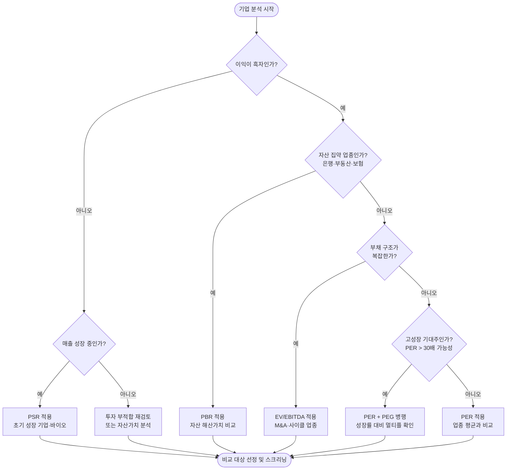
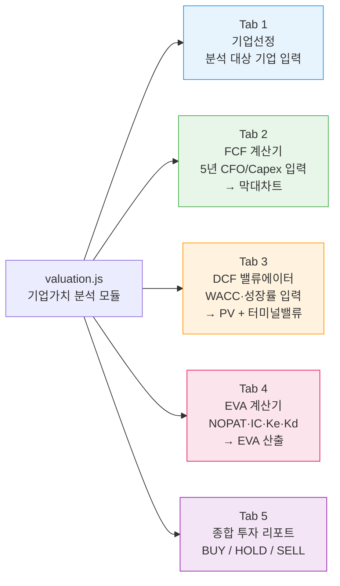
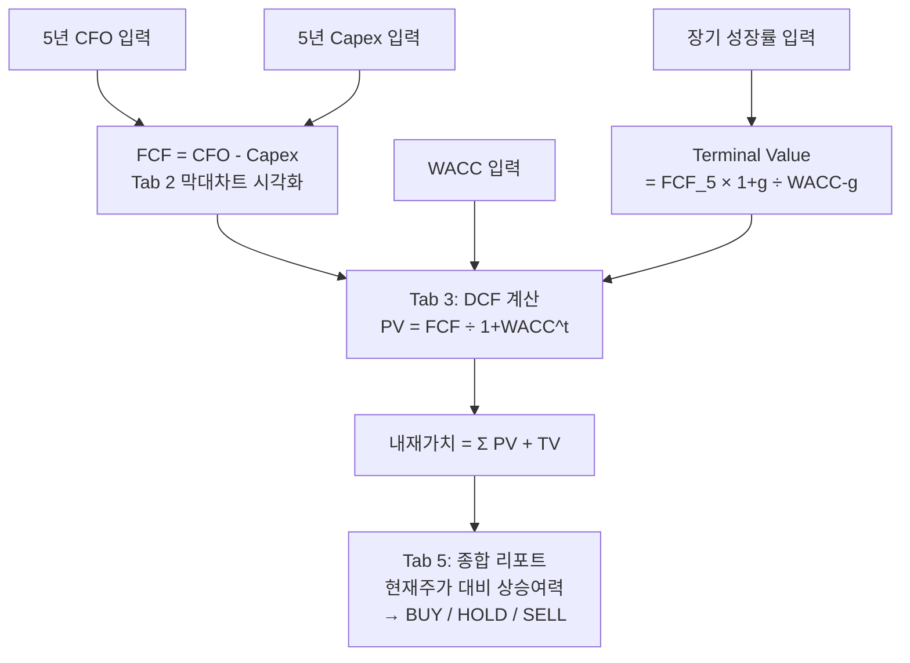

# Day 049 — 상대가치 평가 (밸류에이션 멀티플)

> **모듈 7: 투자분석 기초 방법론** | 8/10일차 | 💹 | 학습시간: 8시간


---

> 📺 **YouTube 강의**: [🎬 밸류에이션 멀티플 PER PBR](https://www.youtube.com/results?search_query=밸류에이션+멀티플+PER+PBR+주식+한국어)
>
> 📝 **한자 병기 및 어원 사전**: 이 문서에 등장하는 용어의 한자·어원·일제강점기 유래는 → [hanja.md](hanja.md)

## 오늘 배울 것 (아주 쉽게)

- PER (주가수익비율) 개념과 활용
- PBR, EV/EBITDA, PSR 멀티플
- 업종별 적정 멀티플 기준
- 실습: 국내 종목 멀티플 스크리닝 및 비교

---

## 🗓 세부 일정 (1일 8시간)

> **강의 5시간** (5개 단락 × 50분 + 도입·마무리 50분) + **실습 3시간** = 총 8시간

| 시간 | 구분 | 내용 | 형태 |
|------|------|------|------|
| 09:00 – 09:10 | 도입 | 오늘 학습 목표 확인 | 강의 |
| 09:10 – 09:30 | **1단락** 설명 20분 | 티커(Ticker) 개념 & PER(주가수익비율) 개요 | 강의 |
| 09:30 – 10:00 | 각자 정리 & 유튜브 30분 | 노트 정리 · 관련 영상 검색 | 자율 |
| 10:00 – 10:20 | **2단락** 설명 20분 | PBR, EV/EBITDA, PSR 멀티플 | 강의 |
| 10:20 – 10:50 | 각자 정리 & 유튜브 30분 | 노트 정리 · 관련 영상 검색 | 자율 |
| 10:50 – 11:00 | ☕ 휴식 | — | — |
| 11:00 – 11:20 | **3단락** 설명 20분 | 업종별 적정 멀티플 기준 | 강의 |
| 11:20 – 11:50 | 각자 정리 & 유튜브 30분 | 노트 정리 · 관련 영상 검색 | 자율 |
| 11:50 – 12:10 | **4단락** 설명 20분 | 멀티플 스크리닝 방법론 및 데이터 원천 | 강의 |
| 12:10 – 12:40 | 각자 정리 & 유튜브 30분 | 노트 정리 · 관련 영상 검색 | 자율 |
| 12:40 – 13:00 | **5단락** 설명 20분 | 시각화 및 데이터 품질 유의사항 | 강의 |
| 13:00 – 13:30 | 각자 정리 & 유튜브 30분 | 노트 정리 · 관련 영상 검색 | 자율 |
| 13:30 – 14:00 | 강의 마무리 | Q&A · 핵심 복습 | 강의 |
| 14:00 – 15:00 | 💻 **실습 1부** 60분 | yfinance로 국내 종목 멀티플 수집 및 표준 데이터셋 생성 | 실습 |
| 15:00 – 15:10 | ☕ 휴식 | — | — |
| 15:10 – 16:00 | 💻 **실습 2부** 50분 | 멀티플 스크리닝 필터 · 비교 차트 시각화 구현 | 실습 |
| 16:00 – 16:10 | ☕ 휴식 | — | — |
| 16:10 – 17:00 | 💻 **실습 발표 & 리뷰** 50분 | 코드 리뷰 · 발표 · 피드백 | 실습 |

> 강의 5시간: 도입 10분 + 단락 5개×50분 + 마무리 30분 = **300분**  
> 실습 3시간: 1부 60분 + 휴식 10분 + 2부 50분 + 휴식 10분 + 발표·리뷰 50분 = **180분**

---

## 🔗 참고 사이트 & 데이터 원천

> 이 문서(상대가치 평가 — PER·PBR·EV/EBITDA·PSR 멀티플)의 실습에 필요한 공식 데이터 출처와 참고 사이트입니다. ⚿ 는 API 키 또는 승인이 필요한 항목입니다.

### 📊 국내 공식 데이터

| 기관 | URL | API 키 | 제공 데이터 |
|------|-----|--------|-------------|
| DART(전자공시시스템) | <https://opendart.fss.or.kr> | ⚿ 필요 | EPS·BPS 산출용 재무제표, 주식수 공시 |
| KRX 한국거래소 | <https://www.krx.co.kr> | 불필요(웹 조회) | 업종별 PER·PBR 통계, 시가총액 |
| KRX Data Marketplace | <https://openapi.krx.co.kr> | ⚿ 필요 | 시장 통계·멀티플 API |
| KIND(상장공시시스템) | <https://kind.krx.co.kr> | 불필요(웹 조회) | 종목별 재무 요약·멀티플 참고 |
| 금융투자협회(KOFIA) | <https://www.kofia.or.kr> | 불필요(웹 조회) | 자본시장 밸류에이션 통계 |
| 금융감독원(FSS) | <https://www.fss.or.kr> | 불필요(웹 조회) | 금융회사 자산·수익 통계 |

### 🌍 해외 공식 데이터

| 기관 | URL | API 키 | 제공 데이터 |
|------|-----|--------|-------------|
| yfinance (PyPI) | <https://pypi.org/project/yfinance> | 불필요 | 국내외 종목 PER·PBR·EV/EBITDA |
| pykrx (PyPI) | <https://pypi.org/project/pykrx> | 불필요 | 국내 종목 시장 데이터·멀티플 |
| SEC EDGAR API | <https://data.sec.gov/api/xbrl/companyfacts> | 불필요 | 미국 기업 EPS·BPS 원시 데이터 |

### 📈 리서치·차트·포탈 참고

| 분류 | 사이트 | URL | 활용 용도 |
|------|--------|-----|-----------|
| 리서치 플랫폼 | FnGuide 데이터 | <https://comp.fnguide.com> | 종목별 PER·PBR·EV/EBITDA 현황 |
| 차트 플랫폼 | TradingView | <https://www.tradingview.com> | 멀티플 비교 차트·업종 필터 |
| 차트 플랫폼 | Investing.com | <https://www.investing.com> | 글로벌 종목 멀티플 비교 |
| 금융 포탈 | 네이버 금융 | <https://finance.naver.com> | 종목별 PER·PBR·ROE 요약 |
| 금융 포탈 | 다음 금융 | <https://finance.daum.net> | 종목 재무·밸류에이션 현황 |
| 금융 미디어 | 머니투데이 방송(MTN) | <https://mtn.co.kr> | 밸류에이션·주가 분석 뉴스 |
| 금융 미디어 | 연합인포맥스 | <https://news.einfomax.co.kr> | 종목·업종 멀티플 속보 |
| 증권사 리서치 | 삼성증권 | <https://www.samsungpop.com> | PER·PBR 기반 목표주가 리포트 |
| 증권사 리서치 | KB증권 | <https://www.kbsec.com> | 업종별 밸류에이션 분석 리포트 |

---

# 주식 투자 용어 해설: 티커(Ticker)

주식 시장에서 **티커(Ticker)**는 특정 종목을 빠르고 정확하게 식별하기 위해 부여된 **고유의 약자(심볼)**를 의미합니다.

## 1. 유래
과거에는 주식 시세를 종이 띠(**Ticker Tape**)에 인쇄하여 전달했습니다. 이때 회사 이름을 모두 기입하기에는 지면이 부족하고 시간이 오래 걸렸기 때문에, 짧은 알파벳 기호로 표시하던 습관에서 유래되었습니다.

---

## 2. 국가별 티커의 형태

국가마다 티커를 구성하는 방식에는 차이가 있습니다.

### 미국 (문자 중심)
영문 알파벳 대문자로 구성되며, 보통 회사 이름과 연관성이 높습니다.
* **AAPL**: 애플 (Apple)
* **TSLA**: 테슬라 (Tesla)
* **MSFT**: 마이크로소프트 (Microsoft)
* **O**: 리얼티 인컴 (Realty Income) - *단일 철자를 사용하는 경우도 있음*

### 한국 (숫자 중심)
한국에서는 '티커'라는 말 대신 주로 **'종목코드'**라고 부르며, 6자리의 숫자로 구성됩니다.
* **005930**: 삼성전자
* **035420**: NAVER
* **373220**: LG에너지솔루션

---

## 3. 티커 사용의 장점

1.  **정확성**: 이름이 유사한 기업 간의 혼동을 방지합니다. (예: Zoom Video Communications의 티커는 `ZM`)
2.  **신속성**: 긴 회사명 대신 짧은 코드를 입력하여 빠르게 검색 및 매매가 가능합니다.
3.  **범용성**: 전 세계 투자자와 시스템이 동일한 기호를 사용하므로 정보 전달이 명확합니다.

---

## 💡 참고사항
해외 주식 시장에서는 티커 대신 **'심볼(Symbol)'**이라는 용어를 혼용해서 사용하기도 합니다. HTS나 MTS에서 종목을 찾을 때 이 티커를 활용하면 가장 정확한 검색 결과를 얻을 수 있습니다.

### 1. PER (주가수익비율) 개념과 활용

> 📖 **Wikipedia**: [주가수익비율](https://ko.wikipedia.org/wiki/주가수익비율)

> 📺 [🎬 PER 주가수익비율 뜻 활용법](https://www.youtube.com/results?search_query=PER+주가수익비율+뜻+활용법+한국어)

**PER 계산 공식**

```
PER = 주가 / 주당순이익(EPS)
    = 시가총액 / 당기순이익
```

**Python 코드 예시**

```python
# PER / PBR 계산 예시
def calc_per(price: float, eps: float) -> float:
    """주가수익비율 계산. eps <= 0 이면 None 반환 (적자 기업)."""
    if eps <= 0:
        return None
    return round(price / eps, 2)

def calc_pbr(price: float, bps: float) -> float:
    """주가순자산비율 계산."""
    if bps <= 0:
        return None
    return round(price / bps, 2)

def calc_psr(market_cap: float, revenue: float) -> float:
    """주가매출비율 계산."""
    if revenue <= 0:
        return None
    return round(market_cap / revenue, 2)

# 삼성전자 예시 (가상 수치)
samsung = {"price": 75_000, "eps": 5_000, "bps": 50_000, "revenue": 300_000_000}
samsung_market_cap = samsung["price"] * 5_969_782_550  # 발행주식수

per = calc_per(samsung["price"], samsung["eps"])   # → 15.0
pbr = calc_pbr(samsung["price"], samsung["bps"])   # → 1.5
psr = calc_psr(samsung_market_cap, samsung["revenue"])

print(f"PER: {per}배  |  PBR: {pbr}배  |  PSR: {psr:.1f}배")
```

- PER 20배 = 지금 이익 수준이라면 20년이 지나야 투자금을 회수한다는 뜻
- 높은 PER: 시장이 미래 고성장을 기대 / 낮은 PER: 저평가이거나 성장 정체·위험 반영
- **적자 기업에는 PER 계산 불가**, 일회성 이익이 섞이면 왜곡될 수 있습니다.

**멀티플 레벨별 해석 (PER 기준)**

```mermaid
quadrantChart
    title PER 수준 vs 성장률 — 밸류에이션 포지셔닝
    x-axis 낮은 성장률 --> 높은 성장률
    y-axis 낮은 PER --> 높은 PER
    quadrant-1 고성장 프리미엄 (정당한 높은 PER)
    quadrant-2 버블 위험 (성장 없는 고PER)
    quadrant-3 가치주 구간 (저PER·저성장)
    quadrant-4 숨겨진 저평가 (고성장·저PER)
    플랫폼IT: [0.85, 0.80]
    바이오성장주: [0.90, 0.90]
    반도체: [0.70, 0.65]
    소비재: [0.45, 0.40]
    은행금융: [0.30, 0.25]
    전통제조: [0.20, 0.30]
    과열성장주: [0.30, 0.85]
    가치저평가: [0.75, 0.20]
```

### 2. PBR, EV/EBITDA, PSR 멀티플

> 📖 **Wikipedia**: [주가순자산비율](https://ko.wikipedia.org/wiki/주가순자산비율) · [기업가치](https://ko.wikipedia.org/wiki/기업가치) · [EBITDA](https://ko.wikipedia.org/wiki/EBITDA)

> 📺 [🎬 PBR EV EBITDA PSR 멀티플 비교](https://www.youtube.com/results?search_query=PBR+EV+EBITDA+PSR+멀티플+비교+한국어)

| 멀티플 | 공식 | 언제 유용한가 |
|--------|------|---------------|
| **PBR** | 주가 / 주당순자산(BPS) | 자산 중심 업종 (은행, 부동산), 해산 가치 비교 |
| **EV/EBITDA** | 기업가치 / EBITDA | 부채 구조 비교, 인수합병 가치 평가 |
| **PSR** | 시가총액 / 매출액 | 적자 성장 기업, 매출이 핵심인 초기 기업 |

- 이익이 불안정한 기업은 PER보다 **PSR이나 EV/EBITDA**가 더 유용할 수 있습니다.
- 어떤 멀티플이 맞는지는 기업 특성(성장 단계·자산 구조·이익 안정성)에 따라 달라집니다.

**EV/EBITDA를 조금 더 풀어서 보기**

```python
def calc_ev_ebitda(
    market_cap: float,
    total_debt: float,
    cash: float,
    ebitda: float
) -> float:
    """
    EV = 시가총액 + 순차입금(총차입금 - 현금성자산)
    EV/EBITDA = 사업 전체 가치 ÷ 감가상각 전 영업현금창출력
    """
    ev = market_cap + (total_debt - cash)
    if ebitda <= 0:
        return None
    return round(ev / ebitda, 2)

# 예시: A사(무차입) vs B사(고차입) — 시가총액 동일
ev_a = calc_ev_ebitda(market_cap=1_000_000, total_debt=50_000,  cash=200_000, ebitda=80_000)
ev_b = calc_ev_ebitda(market_cap=1_000_000, total_debt=500_000, cash=50_000,  ebitda=80_000)
# ev_a → 10.6배,  ev_b → 18.1배  ← 같은 시총이어도 EV/EBITDA 크게 다름
```

- **시가총액만 보면 놓치는 것**: 부채가 많은 회사와 무차입 회사는 같은 시가총액이어도 실제 인수 부담이 다릅니다.
- **EBITDA가 유용한 이유**: 감가상각, 이자, 세금 영향을 덜 받아 업종 내 비교가 쉬워집니다.
- **주의점**: 설비투자 부담이 큰 업종은 EBITDA가 실제 현금창출력보다 좋아 보일 수 있으니 Capex도 함께 봐야 합니다.

### 3. 업종별 적정 멀티플 기준

> 📖 **Wikipedia**: [기업 가치 평가](https://ko.wikipedia.org/wiki/기업_가치_평가)

> 📺 [🎬 업종별 적정 PER PBR 기준](https://www.youtube.com/results?search_query=업종별+적정+PER+PBR+기준+한국어+주식)

| 업종 | 주요 멀티플 | 대략적 범위 | 이유 |
|------|-------------|-------------|------|
| 은행·금융 | PBR | 0.5~1.5배 | 자산 가치 중심 |
| 반도체 | EV/EBITDA | 10~25배 | 사이클 평탄화 목적 |
| 플랫폼·IT | PER 또는 PSR | 20~50배+ | 고성장 프리미엄 |
| 소비재·유통 | PER | 10~20배 | 안정적 이익 |
| 바이오 | PSR | 적자라 PER 미사용 | 파이프라인 가치 |

- 멀티플이 낮다고 무조건 저평가가 아니라, **성장 둔화나 재무 위험이 반영된 결과**일 수도 있습니다.

**업종별 멀티플 선택 프로세스**



### 4. 실습: 국내 종목 멀티플 스크리닝 및 비교

**쉽게 이해하기**
- 스크리닝은 많은 종목 중에서 원하는 조건에 맞는 후보를 빠르게 추리는 과정입니다.
- 예를 들어 같은 업종 안에서 PER은 낮고 영업이익률은 높은 기업을 찾으면, "실적 대비 저평가 후보"를 골라볼 수 있습니다.

**장표에서 볼 포인트**
- 이 장표는 멀티플 개념을 실제 종목 선택 과정으로 연결하는 역할을 합니다.
- 조건을 너무 많이 걸면 좋은 기업을 놓칠 수 있으니, 먼저 2~3개의 핵심 기준으로 좁힌 뒤 추가로 검토하는 방식이 효율적입니다.

**기업가치 분석용 비교 체크리스트**

| 확인 항목 | 왜 필요한가 | 실무 해석 |
|-----------|-------------|-----------|
| **동일 업종·유사 비즈니스 모델** | 멀티플 비교의 출발점 | 은행과 플랫폼 기업을 같은 기준으로 비교하면 왜곡 |
| **성장률 차이** | 높은 성장 기업은 프리미엄 가능 | 멀티플이 높아도 성장으로 설명되는지 확인 |
| **부채 구조** | EV/EBITDA 해석에 직접 영향 | 차입 급증 기업은 EV가 빠르게 높아질 수 있음 |
| **일회성 이익/손실** | PER, EBITDA 왜곡 방지 | 자산 매각 이익이 포함됐는지 점검 |
| **현금흐름과 Capex** | 숫자의 질 확인 | EBITDA가 좋아도 FCF가 약하면 할인 필요 |

---

#### 4-1. 레퍼런스 사이트 찾기 및 데이터 원천 정리

국내 종목의 멀티플(PER·PBR·EV/EBITDA 등)은 여러 사이트에서 제공하는데, 정의와 기준이 조금씩 다릅니다. 아래 표로 원천별 특징을 먼저 정리하고, 수집할 사이트를 결정합니다.

| 구분 | 사이트 | 가입/인증 | 확인할 데이터 | 실습 포인트 |
|------|--------|-----------|---------------|-------------|
| 국내 증권 원천 | [KRX 정보데이터시스템](https://data.krx.co.kr/) | 무료 회원가입 | 업종별 PER/PBR/배당수익률 통계 | 코스피·코스닥 전 종목의 공식 멀티플 제공 |
| 국내 공시 원천 | [DART 전자공시시스템](https://dart.fss.or.kr/) | Open API 인증키 필요 | 사업보고서·분기보고서 재무수치 | EPS·BPS·EV 계산의 기초 데이터 |
| 국내 포털 | [NAVER Finance 종목 분석](https://finance.naver.com/) | 로그인 불필요 | 종목별 PER·PBR·ROE 요약 | 빠른 참고용, 스크린 기준 확인 |
| 전문 금융 데이터 | [FnGuide (Dataguide)](https://www.fnguide.com/) | 유료 구독 | 업종 평균 멀티플, 컨센서스 EPS | 기관·운용사 수준의 상세 멀티플 |
| Python 라이브러리 | [yfinance](https://pypi.org/project/yfinance/) | 별도 키 없음 | 상장 종목 PER·PBR·EV/EBITDA | KS 티커로 국내 종목 직접 조회 가능 |
| 거시 통계 보강 | [한국은행 ECOS](https://ecos.bok.or.kr/) | Open API 인증키 필요 | 기업 금융통계, 산업별 매출·이익 집계 | 업종별 평균 멀티플 보완 |

**가입 및 키 발급 체크리스트**

1. **KRX 정보데이터시스템**: `data.krx.co.kr` 접속 → 회원가입 → 주식 → 종목정보 → 업종별 PER/PBR 메뉴에서 CSV 다운로드 가능.
2. **DART OpenAPI**: `opendart.fss.or.kr` 접속 → 인증키 신청 → 발급 키를 `.env`의 `DART_API_KEY`에 저장.
3. **ECOS**: `ecos.bok.or.kr` 접속 → 회원가입/로그인 → Open API → 인증키 신청 → `.env`의 `BOK_API_KEY`에 저장.
4. **yfinance**: 별도 가입 없이 `pip install yfinance`로 설치 후 바로 사용 가능. KS(코스피)·KQ(코스닥) 티커 형식 사용.

**유사 정보 비교: 같은 종목의 PER이 사이트마다 다른 이유**

| 비교 항목 | NAVER Finance | yfinance | 확인 질문 |
|-----------|---------------|----------|-----------|
| EPS 기준 | 최근 12개월(TTM) | TTM 또는 Forward | 과거 실적 기준인가, 컨센서스 예상인가? |
| 주식 수 | 보통주 발행 주식 수 기준 | 가중평균 희석 주식 수 포함 가능 | 자사주·우선주 처리 방법은? |
| 통화 처리 | 원화 | 원화(한국 상장) | 외화 환산이 포함됐는가? |
| 업데이트 주기 | 실시간~당일 | 거래소 반영 지연 가능 | 수집 시점의 주가와 EPS 기준일이 맞는가? |

---

#### 4-2. yfinance로 국내 종목 멀티플 수집

`yfinance`는 별도 API Key 없이 바로 사용할 수 있어 실습 진입 장벽이 낮습니다. 한국 상장 종목은 코스피 `.KS`, 코스닥 `.KQ`를 티커에 붙입니다.

**추가 패키지 설치**

```bash
pip install yfinance pandas matplotlib seaborn
```

**국내 업종 대표 종목 티커 정의**

```python
# 업종별 대표 종목 (실습용 가상 구성)
SECTOR_PEERS = {
    "반도체": {
        "삼성전자":  "005930.KS",
        "SK하이닉스": "000660.KS",
        "DB하이텍":  "000990.KS",
    },
    "인터넷·플랫폼": {
        "NAVER":   "035420.KS",
        "카카오":   "035720.KS",
        "카카오페이": "377300.KS",
    },
    "은행": {
        "KB금융":  "105560.KS",
        "신한지주":  "055550.KS",
        "하나금융지주": "086790.KS",
    },
    "바이오": {
        "셀트리온":  "068270.KS",
        "삼성바이오로직스": "207940.KS",
        "한미약품":  "128940.KS",
    },
}
```

**멀티플 수집 함수**

```python
import math
import yfinance as yf
import pandas as pd


def safe_float(value, multiplier=1.0):
    """None·NaN 입력은 None을 반환하고, 유효한 숫자는 multiplier를 곱한 뒤 반올림하여 반환합니다."""
    try:
        if value is None or (isinstance(value, float) and math.isnan(value)):
            return None
        return round(float(value) * multiplier, 2)
    except Exception:
        return None


def fetch_multiples(sector_peers: dict) -> pd.DataFrame:
    """
    섹터별 종목 딕셔너리를 받아 PER·PBR·PSR·EV/EBITDA·ROE·영업이익률을 수집합니다.
    yfinance.info 필드는 결측이 있을 수 있으므로 safe_float 처리를 합니다.
    """
    rows = []
    for sector, companies in sector_peers.items():
        for name, ticker in companies.items():
            try:
                info = yf.Ticker(ticker).info
                rows.append({
                    "섹터":          sector,
                    "기업":          name,
                    "티커":          ticker,
                    "시가총액(억)":   safe_float(info.get("marketCap"), 1e-8),
                    "PER":           safe_float(info.get("trailingPE")),
                    "Forward PER":   safe_float(info.get("forwardPE")),
                    "PBR":           safe_float(info.get("priceToBook")),
                    "PSR":           safe_float(info.get("priceToSalesTrailing12Months")),
                    "EV/EBITDA":     safe_float(info.get("enterpriseToEbitda")),
                    "ROE(%)":        safe_float(info.get("returnOnEquity"), 100),
                    "영업이익률(%)":  safe_float(info.get("operatingMargins"), 100),
                    "매출성장률(%)":  safe_float(info.get("revenueGrowth"), 100),
                    "부채비율":       safe_float(info.get("debtToEquity")),
                })
            except Exception as exc:
                print(f"[skip] {name} ({ticker}): {exc}")
    return pd.DataFrame(rows)


df_all = fetch_multiples(SECTOR_PEERS)
df_all.to_csv("multiples_raw.csv", index=False, encoding="utf-8-sig")
print(df_all.to_string(index=False))
```

---

#### 4-3. 표준 데이터 스키마

출처가 달라도 아래 구조로 통일하면 스크리닝·시각화·보고서에서 재사용하기 쉽습니다.

| 컬럼 | 예시 | 설명 |
|------|------|------|
| `sector` | `반도체` | GICS 업종 또는 직접 분류 |
| `company` | `삼성전자` | 기업 이름 |
| `ticker` | `005930.KS` | yfinance 티커 |
| `market_cap` | `4200000` | 시가총액 (억 원) |
| `per` | `13.5` | 주가수익비율 (TTM) |
| `forward_per` | `11.2` | 선행 PER (컨센서스 기준) |
| `pbr` | `1.1` | 주가순자산비율 |
| `psr` | `1.8` | 주가매출비율 |
| `ev_ebitda` | `8.4` | EV/EBITDA |
| `roe_pct` | `8.5` | 자기자본이익률 (%) |
| `op_margin_pct` | `12.3` | 영업이익률 (%) |
| `revenue_growth_pct` | `5.1` | 매출 성장률 (%) |
| `debt_to_equity` | `42.0` | 부채비율 (D/E) |
| `source` | `yfinance` | 데이터 원천 |
| `fetch_date` | `2025-01-31` | 수집일 |

---

#### 4-4. 멀티플 스크리닝 필터 구현

조건 기반 필터로 후보 종목을 좁힙니다. 먼저 2~3개 핵심 조건으로 시작한 뒤, 추가 조건을 붙이는 방식이 실무적입니다.

```python
def screen_multiples(
    df: pd.DataFrame,
    sector: str | None = None,
    per_max: float | None = 20.0,
    pbr_max: float | None = 2.0,
    roe_min: float | None = 8.0,
    op_margin_min: float | None = 5.0,
    ev_ebitda_max: float | None = 15.0,
) -> pd.DataFrame:
    """
    멀티플 조건 기반 스크리닝 함수.
    조건을 None으로 전달하면 해당 필터는 건너뜁니다.
    """
    result = df.copy()

    if sector:
        result = result[result["섹터"] == sector]
    if per_max is not None:
        result = result[result["PER"].notna() & (result["PER"] <= per_max)]
    if pbr_max is not None:
        result = result[result["PBR"].notna() & (result["PBR"] <= pbr_max)]
    if roe_min is not None:
        result = result[result["ROE(%)"].notna() & (result["ROE(%)"] >= roe_min)]
    if op_margin_min is not None:
        result = result[result["영업이익률(%)"].notna() & (result["영업이익률(%)"] >= op_margin_min)]
    if ev_ebitda_max is not None:
        result = result[result["EV/EBITDA"].notna() & (result["EV/EBITDA"] <= ev_ebitda_max)]

    return result.sort_values("PER").reset_index(drop=True)


# 예시 1: 전체 섹터에서 저PER·고ROE 후보
candidates_value = screen_multiples(
    df_all,
    per_max=15.0,
    pbr_max=1.5,
    roe_min=10.0,
    op_margin_min=8.0,
    ev_ebitda_max=None,  # EV/EBITDA 필터 생략
)
print("=== 저PER·고ROE 후보 ===")
print(candidates_value[["기업", "섹터", "PER", "PBR", "ROE(%)", "영업이익률(%)"]].to_string(index=False))

# 예시 2: 은행 섹터 — PBR 중심 스크리닝 (적자 없는 경우 PER 의미 있음)
candidates_bank = screen_multiples(
    df_all,
    sector="은행",
    per_max=None,        # 은행은 PBR이 더 유의미
    pbr_max=0.8,
    roe_min=7.0,
    op_margin_min=None,
    ev_ebitda_max=None,
)
print("\n=== 은행 저PBR 후보 ===")
print(candidates_bank[["기업", "PBR", "ROE(%)"]].to_string(index=False))
```

**스크리닝 조건 선택 가이드**

| 스크리닝 목적 | 핵심 조건 | 참고 조건 |
|--------------|-----------|----------|
| 가치주 발굴 | PER ≤ 업종 평균, PBR ≤ 1.5 | ROE ≥ 8%, 부채비율 낮음 |
| 성장주 발굴 | 매출성장률 ≥ 15%, Forward PER 확인 | ROE 높음, PBR 프리미엄 허용 |
| 자산주 발굴 | PBR ≤ 0.7, 부채비율 낮음 | 배당수익률 확인 |
| M&A 대상 | EV/EBITDA ≤ 8, 순현금 기업 | FCF 양호 여부 함께 확인 |

---

#### 4-5. 시각화: 멀티플 비교 차트

수집한 데이터를 세 가지 방식으로 시각화합니다.

**① 섹터별 PER·PBR 막대 차트 비교**

```python
import matplotlib.pyplot as plt
import matplotlib.font_manager as fm

# 한글 폰트 설정 (macOS: AppleGothic, Windows: Malgun Gothic, Linux: NanumGothic)
plt.rcParams["font.family"] = "NanumGothic"
plt.rcParams["axes.unicode_minus"] = False

fig, axes = plt.subplots(1, 2, figsize=(14, 5))

for ax, metric in zip(axes, ["PER", "PBR"]):
    sector_mean = (
        df_all.dropna(subset=[metric])
        .groupby("섹터")[metric]
        .mean()
        .sort_values()
    )
    sector_mean.plot(kind="barh", ax=ax, color="steelblue", edgecolor="white")
    ax.set_title(f"섹터별 평균 {metric}", fontsize=13)
    ax.set_xlabel(f"{metric} (배)")
    median_val = sector_mean.median()
    ax.axvline(median_val, color="crimson", linestyle="--", linewidth=1.2,
               label=f"중앙값 {median_val:.1f}배")
    ax.legend(fontsize=9)
    ax.grid(axis="x", alpha=0.3)

plt.suptitle("국내 업종별 평균 밸류에이션 멀티플", fontsize=14, y=1.01)
plt.tight_layout()
plt.savefig("sector_multiples_bar.png", dpi=150, bbox_inches="tight")
plt.show()
```

**② ROE vs PBR 산점도 — "성장 대비 저평가" 식별**

```python
fig, ax = plt.subplots(figsize=(9, 6))

for sector, grp in df_all.dropna(subset=["ROE(%)", "PBR"]).groupby("섹터"):
    ax.scatter(grp["ROE(%)"], grp["PBR"], label=sector, s=100, alpha=0.8)
    for _, row in grp.iterrows():
        ax.annotate(row["기업"], (row["ROE(%)"], row["PBR"]),
                    textcoords="offset points", xytext=(5, 3), fontsize=8)

# PBR = ROE / 기대수익률 (이론 기준선, 기대수익률 10% 가정)
import numpy as np
roe_clean = df_all["ROE(%)"].dropna()
roe_range = np.linspace(roe_clean.min(), roe_clean.max(), 100)
ax.plot(roe_range, roe_range / 10, color="gray", linestyle="--",
        linewidth=1.2, label="이론선 (기대수익률 10%)")

ax.set_xlabel("ROE (%)")
ax.set_ylabel("PBR (배)")
ax.set_title("ROE vs PBR — 이론선 아래: 저평가 후보")
ax.legend(fontsize=8, loc="upper left")
ax.grid(alpha=0.3)
plt.tight_layout()
plt.savefig("roe_vs_pbr_scatter.png", dpi=150, bbox_inches="tight")
plt.show()
```

**③ 멀티플 히트맵 — 종목 간 지표 한눈에 비교**

```python
import seaborn as sns

heatmap_cols = ["PER", "PBR", "PSR", "EV/EBITDA", "ROE(%)", "영업이익률(%)"]
hm_data = (
    df_all.dropna(subset=heatmap_cols, how="all")
    .set_index("기업")[heatmap_cols]
)

# 표준화(Z-score)로 척도 통일
hm_norm = (hm_data - hm_data.mean()) / hm_data.std()

plt.figure(figsize=(10, max(4, len(hm_norm) * 0.55)))
sns.heatmap(
    hm_norm,
    annot=hm_data.round(1),
    fmt=".1f",
    cmap="RdYlGn_r",   # 낮을수록 녹색(저평가), 높을수록 빨간색
    linewidths=0.5,
    cbar_kws={"label": "Z-score (낮을수록 상대적 저평가)"},
)
plt.title("국내 종목 멀티플 비교 히트맵 (원본 수치 표기, 색상=Z-score)")
plt.tight_layout()
plt.savefig("multiples_heatmap.png", dpi=150, bbox_inches="tight")
plt.show()
```

**최종 산출물 목록**

```text
multiples_raw.csv          ← 수집된 원본 멀티플 데이터
sector_multiples_bar.png   ← 섹터별 PER/PBR 막대 차트
roe_vs_pbr_scatter.png     ← ROE vs PBR 산점도
multiples_heatmap.png      ← 종목 간 멀티플 히트맵
```

---

#### 4-6. 데이터 품질 및 해석 유의사항

- **yfinance TTM EPS는 부정확할 수 있습니다.** 특히 분기 실적이 최근 반영되지 않거나 일회성 손익이 섞인 경우 PER이 왜곡될 수 있으므로, 중요한 종목은 DART 공시 원문으로 EPS를 재확인합니다.
- **업종이 달라지면 비교 기준도 달라집니다.** PER이 5배인 은행주와 PER이 50배인 바이오주를 같은 기준으로 비교하면 의미 없는 순위가 나옵니다. 섹터 필터를 먼저 적용한 뒤 비교합니다.
- **PER 미산출(NaN) 기업은 적자이거나 EPS가 음수입니다.** 이 경우 PSR이나 EV/EBITDA로 대체해 평가합니다.
- **EV/EBITDA에서 고차입 기업은 EV가 과대계상될 수 있습니다.** 순차입금(총차입금 − 현금성자산)을 함께 보고, Capex가 큰 업종은 EBITDA가 실제 현금창출력을 과장할 수 있습니다.
- **수집일 기준 주가와 재무 기준일을 맞춰야 합니다.** 분기 실적 발표 전후로 PER이 크게 달라질 수 있으므로, 데이터에 `fetch_date`를 반드시 기록합니다.
- **보고서에는 원천·수집일·EPS 기준(TTM/Forward)·결측 처리 방법을 표시합니다.**

---

## 🔗 Python 소스 연계

이 문서에서 학습한 멀티플 개념은 **`valuation.js`** 프론트엔드 모듈로 직접 구현되어 있습니다.

**valuation.js 탭 구조**



**Tab 2 (FCF) ↔ Tab 3 (DCF) 연계 흐름**



**Tab 4 EVA 계산 핵심 공식**

```python
# valuation.js의 EVA 계산 로직 (Python 등가 표현)
def calc_eva(nopat: float, ic: float, ke: float, kd: float,
             debt_ratio: float, tax_rate: float) -> dict:
    """
    NOPAT  = 세후 영업이익
    IC     = 투하자본 (영업자산 - 영업부채)
    WACC   = Ke × E/(D+E) + Kd × (1-t) × D/(D+E)
    EVA    = NOPAT - WACC × IC
    """
    equity_ratio = 1 - debt_ratio
    wacc = ke * equity_ratio + kd * (1 - tax_rate) * debt_ratio
    cost_of_capital = wacc * ic
    eva = nopat - cost_of_capital
    return {
        "WACC": round(wacc * 100, 2),
        "자본비용": round(cost_of_capital, 0),
        "EVA": round(eva, 0),
        "평가": "가치창출" if eva > 0 else "가치훼손"
    }

# 예시 (가상 수치)
result = calc_eva(
    nopat=500_000,       # 5억 원
    ic=3_000_000,        # 30억 원
    ke=0.10,             # 자기자본비용 10%
    kd=0.04,             # 타인자본비용 4%
    debt_ratio=0.40,     # 부채비율 40%
    tax_rate=0.22        # 법인세율 22%
)
# → {'WACC': 7.05, '자본비용': 211500, 'EVA': 288500, '평가': '가치창출'}
```

**`/api/quant/pipeline` 과의 연계**

`valuation.js`는 순수 프론트엔드 계산 모듈이며, 백엔드 `/api/quant/pipeline` API의 **Stage 4 Portfolio Construction**과 개념적으로 연결됩니다. DCF/EVA로 내재가치를 산출한 뒤 포지션 사이징 로직으로 넘기는 흐름입니다.

```mermaid
flowchart LR
    V[valuation.js\n내재가치 산출] -- "BUY 신호 종목" --> P[/api/quant/pipeline\nStage 4: Portfolio\nConstruction]
    P -- "포지션 비중·리스크" --> D[최종 투자 결정]
```

---

## 해보기 활동

멀티플 비교는 "숫자 읽기"보다 "비교 이유 설명하기"가 더 중요합니다.

1. 같은 업종 기업 3개를 골라 PER, PBR, EV/EBITDA 중 확인 가능한 값들을 표로 정리해보세요.
2. 어떤 기업은 왜 PER보다 PBR이나 PSR이 더 적합한지 한 줄로 써보세요.
3. 업종 평균보다 높은 멀티플을 받는 기업 1개를 고르고, 시장이 왜 프리미엄을 주는지 추정해보세요.
4. EV/EBITDA가 낮아 보여도 실제로는 위험할 수 있는 이유를 순부채·Capex 관점에서 적어보세요.
5. 마지막으로 "지금 가장 먼저 추가 확인하고 싶은 기업"을 1개 고르고 이유를 적어보세요.


## 다음 시간 미리보기

➡️ [Day 050](35.md) 에서 계속됩니다.
