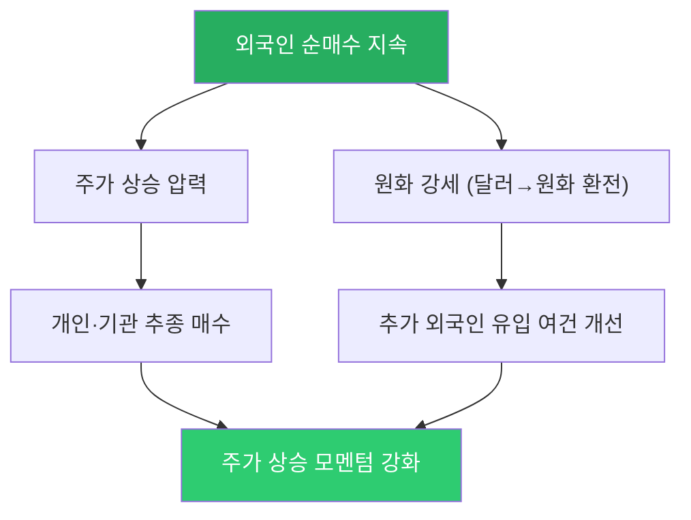
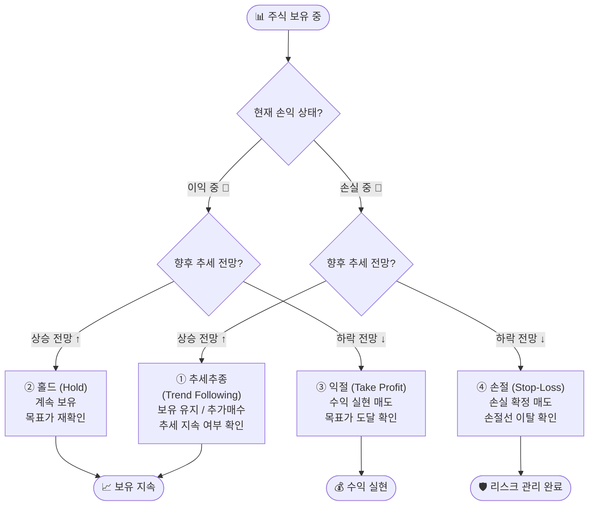

# 주식·배당·금융상품 기초 상식

> **관련 문서**: [42.md](42.md) — 금융규제·산업 구조 | [44.md](44.md) — 개인·법인·세무·회계 기초

> 📖 **Wikipedia**: [주식](https://ko.wikipedia.org/wiki/주식) · [배당](https://ko.wikipedia.org/wiki/배당금) · [상장지수 펀드](https://ko.wikipedia.org/wiki/상장지수_펀드)
>
> 📝 **한자 병기 및 어원 사전**: 이 문서에 등장하는 용어의 한자·어원·일제강점기 유래는 → [voca.md](voca.md)

---

## A. 주식거래 기초 상식

> 📺 [🎬 주식거래 기초 상식](https://www.youtube.com/results?search_query=주식거래+기초+상식+한국어)

### A.1 주식이란 무엇인가

**주식(株式, Share)**은 회사의 **소유권 조각**입니다.

```
삼성전자의 예
──────────────────────────────────────
삼성전자 전체 회사 = 1억 개의 주식 조각으로 나뉨

내가 주식 1개 보유
= 삼성전자의 1억 분의 1 지분 소유자
= 주주(株主)

주주의 권리:
  ① 의결권 — 주주총회에서 투표 (1주 1표)
  ② 배당권 — 이익을 나눠 받을 권리
  ③ 잔여재산 청구권 — 회사 청산 시 자산 분배 순위
```

> 💡 주식을 사면 그 회사의 **부분 소유자**가 됩니다. 회사가 성장하면 주가가 오르고, 이익이 나면 배당을 받습니다. 반대로 회사가 어려워지면 주가가 떨어지거나 배당이 없어질 수 있습니다.

---

### A.1-1 주주가 주장할 수 있는 3가지 핵심권리 🏆

> 🎒 **초급자도 이해하는 쉬운 설명**: 주식을 사면 회사의 주인이 되는 거예요! 주인이니까 당연히 권리가 있겠죠? 크게 **3가지**로 나눌 수 있어요.

#### 1️⃣ 경제적 권리 — "내 돈을 돌려받을 권리"

회사가 돈을 벌면, 주주도 그 이익을 나눠 받을 수 있어요.

**🍰 배당(配當, Dividend)**

- **쉬운 말**: 회사가 이익을 내면 주주에게 "감사합니다!" 하고 돈을 나눠주는 것이에요.
- 마치 부모님이 용돈을 올려주는 것처럼, 회사도 이익이 나면 주주에게 돈을 줘요.
- 예: 삼성전자가 1,000억 원 이익 → 주주들에게 300억 원을 나눠줌  
  내가 주식 100주를 갖고 있고, 회사 주식이 총 1억 주라면 → 나는 300억 × (100 ÷ 1억) = **300원** 수령!

```
내가 삼성전자 주식 100주 보유 (총 발행주식 1억 주)

배당 총액 300억 원이면:
  내 몫 = 300억 × (100주 ÷ 1억 주) = 300원 💰
```

**🗑️ 자사주 소각(自社株消却, Share Buyback & Cancellation)**

- **쉬운 말**: 회사가 자기 회사 주식을 직접 사서 없애버리는 것이에요.
- 피자 8조각이 있는데 회사가 2조각을 사서 버리면 → 남은 **6조각만** 남아요!  
  그러면 내가 가진 1조각의 가치가 ⅛에서 ⅙로 **올라가요** 🎉
- 주식 수가 줄어드니 내 주식 1주가 더 값어치 있어지는 효과예요.
- 배당처럼 현금을 직접 받는 게 아니어도, 보유 주식의 가치가 높아지는 방식으로 이익을 돌려줘요.

```
자사주 소각 전: 발행주식 1억 주 (내 보유: 100주 = 0.0001%)
자사주 소각 후: 발행주식 9,000만 주 (내 보유: 100주 = 0.000111...)
→ 같은 100주인데, 전체에서 내 비율이 더 커짐 = 주주 가치 ↑
```

> 💡 **핵심**: 회사가 번 돈을 직접 주거나(배당), 주식 수를 줄여 주가를 올리는 방법(자사주 소각)으로 경제적 이익을 주주에게 돌려줄 수 있어요.

---

#### 2️⃣ 경영적 권리 — "회사 운영에 참여할 권리"

주주는 그냥 돈만 받는 게 아니라, 회사의 중요한 결정에도 참여할 수 있어요.

**🗳️ 의결권(議決權, Voting Right)**

- **쉬운 말**: 주주총회에서 "찬성!" "반대!" 투표할 수 있는 권리예요.
- 학급회의에서 반장을 뽑거나 소풍 장소를 정할 때 손드는 것처럼, 주주도 회사의 중요한 사항을 직접 투표해요.
- **보통 주식 1주 = 투표 1표** (1주 1표 원칙)

**📝 주주제안권(株主提案權, Shareholder Proposal Right)**

- **쉬운 말**: 주주가 직접 회의 안건을 제안할 수 있는 권리예요.
- 학급회의 때 "소풍을 과천 대공원으로 가요!"라고 제안할 수 있듯이, 주주도 주주총회에 안건을 올릴 수 있어요.

```
주주제안 예시
──────────────────────────────────────────────────
✅ "배당금을 더 많이 주세요!"
✅ "대표이사를 교체해주세요!"
✅ "이사회 구성을 바꿔주세요!"
✅ "환경·사회 책임 경영을 강화해주세요!"
```

- **조건 (국내 기준)**:
  - 발행주식의 **1%** 이상 (코스피 대형사 0.5%) 을 **6개월 이상** 보유한 주주만 제안 가능
  - 제출 기한: 주주총회 **6주 전**까지 서면으로 제출

> 💡 **핵심**: 주주는 단순한 투자자가 아니라 회사의 공동 소유자예요! 회사가 어떻게 운영되어야 하는지 목소리를 낼 수 있어요.

---

#### 3️⃣ 정보의 권리 — "알 권리"

투자를 잘 하려면 회사에 대한 정보가 필요하겠죠? 주주는 회사에 대한 중요한 정보를 받을 권리가 있어요.

**📢 공시의무(公示義務, Disclosure Obligation)**

- **쉬운 말**: 회사는 중요한 일이 생기면 **반드시 공개적으로 알려야** 해요.
- 마치 선생님이 "이번 주 시험 있어요!"라고 미리 알려주는 것처럼, 회사도 주주와 투자자에게 중요한 정보를 공개해야 해요.
- 공시를 숨기거나 거짓으로 하면 금융감독원이 벌금·형사처벌을 내릴 수 있어요.
- 어디서 볼 수 있나요? → [전자공시시스템 DART](https://dart.fss.or.kr) 에서 누구나 무료로 확인 가능!

| 공시 종류 | 쉬운 설명 | 예시 |
|---------|---------|------|
| **정기공시** | 1년에 한 번·분기마다 회사의 성적표를 공개해요 | 사업보고서, 분기보고서 |
| **수시공시** | 중요한 일이 생기면 바로 알려요 | 대규모 투자 결정, 대표이사 교체 |
| **주요사항보고** | 회사에 큰 변화가 생길 때 알려요 | 합병, 자사주 소각, 유상증자 |

**📚 회계장부 열람권(閱覽權)**

- **쉬운 말**: "회사의 가계부를 보여달라"고 요청할 수 있는 권리예요.
- 발행주식의 **1% 이상** 보유한 소수주주는 법원을 통해 회사의 장부를 볼 수 있어요.

> 💡 **핵심**: 회사는 주주에게 중요한 정보를 숨기면 안 돼요! 금융감독원이 이를 감시하고, 거짓 공시를 하면 크게 벌을 받아요.

---

#### 📊 3가지 핵심권리 한눈에 보기

| 권리 종류 | 핵심 내용 | 쉬운 설명 | 관련 제도 |
|---------|---------|---------|---------|
| **① 경제적 권리** | 이익을 나눠받을 권리 | 회사가 번 돈을 내가 받는 권리 | 배당, 자사주 소각 |
| **② 경영적 권리** | 회사 운영에 참여할 권리 | 회사 결정에 내 의견을 낼 권리 | 의결권, 주주제안권 |
| **③ 정보의 권리** | 알 권리 | 회사의 중요한 정보를 받을 권리 | 공시의무, 회계장부 열람 |

> 🌟 **정리**: 주식을 산다는 것은 주가가 오르기만을 기다리는 게 아니에요. 회사의 진짜 주인이 되어서, **이익도 받고(경제적), 의견도 내고(경영적), 정보도 받을 수 있는(정보)** 3가지 권리를 가지는 거예요!

---

### A.2 주식 시장의 종류

| 시장 | 영문 | 상장 요건 | 특성 | 대표 기업 |
|------|------|---------|------|---------|
| **코스피(KOSPI)** | Korea Composite Stock Price Index | 자기자본 300억 이상, 높은 요건 | 대형 우량 기업, 안정성 | 삼성전자, 현대차, KB금융 |
| **코스닥(KOSDAQ)** | Korea Securities Dealers Automated Quotation | 낮은 요건, 성장성 중심 | 기술·바이오·중소기업 | 셀트리온, 에코프로, HLB |
| **코넥스(KONEX)** | Korea New Exchange | 가장 낮은 요건 | 초기 벤처기업 | 스타트업 단계 기업 |
| **K-OTC** | 비상장 장외 | 없음 (비상장) | 거래소 외 주식 거래 | 비상장 스타트업 구주 |

---

# KOSPI 지수와 포인트 의미

## 📊 코스피 포인트의 의미
- **기준 시점**: 1980년 1월 4일 당시 전체 시가총액을 100포인트로 설정.
- **포인트 값**: 현재 시가총액 ÷ 기준 시가총액 × 100 → 지수화된 숫자.
- **대표성**: 한국거래소(KRX)에 상장된 모든 보통주·우선주의 시가총액을 반영.
- **영향력**: 시가총액 가중방식이므로 삼성전자, SK하이닉스 같은 대형주가 지수에 큰 영향을 미침.

## 📈 역사적 흐름
- 1983년: 코스피 산출 시작, 기준 100포인트.
- 1997년 외환위기: 300포인트 아래로 급락.
- 2007년: 처음으로 2,000포인트 돌파.
- 2021년 7월: 사상 최고치 3,316포인트 기록.
- 2020년 코로나19: 1,439포인트까지 급락 후 회복.

## 🔍 코스피 포인트 해석 방법
- 상승: 한국 증시 전체 시가총액 증가 → 기업 가치 상승.
- 하락: 시가총액 감소 → 경기 불안, 외국인 자금 유출.
- 변동성 요인: 금리, 환율, 지정학적 리스크, 글로벌 경기 사이클.

---

# 코스피 vs 코스닥 비교

| 지수 | 코스피 | 코스닥 |
|------|--------|--------|
| 성격 | 대형·우량주 중심 | 중소·벤처·기술주 중심 |
| 상장 종목 수 | 약 800개 | 약 1,700개 |
| 시가총액 | 약 2,000조 원 | 약 400조 원 |
| 기준 시점 | 1980년 1월 4일 (100포인트) | 1996년 7월 1일 (1,000포인트) |
| 대표 종목 | 삼성전자, SK하이닉스 | 에코프로, 셀트리온 |
| 변동성 | 상대적으로 낮음 | 상대적으로 높음 |

---

# 코스피 지수 상승률 적용 예시

- 6000 → 7000포인트 = 약 16.7% 상승
- 주식 가격 10,000원 × (1 + 0.167) ≈ 11,670원
- 단, 개별 종목은 지수와 반드시 같은 비율로 움직이지 않음.

---

# 코스피 지수와 개별 주가의 관계

- **시가총액 가중방식**: 대형주가 지수에 큰 영향.
- **대형주 영향력**: 삼성전자, SK하이닉스가 지수 변동을 좌우.
- **개별 종목 변동성**: 기업 실적·산업 트렌드에 따라 지수와 무관하게 움직임.
- **투자자 심리**: 지수는 시장 분위기 반영, 개별 종목은 독자적 요인 반영.

| 구분 | 코스피 지수 | 개별 주가 |
|------|-------------|-----------|
| 계산 방식 | 전체 시가총액 가중 평균 | 기업 실적·수급·뉴스 |
| 영향 요인 | 대형주, 외국인 자금, 거시경제 | 산업 트렌드, 기업 펀더멘털 |
| 변동성 | 낮음 | 높음 |
| 투자 활용 | 시장 분위기·ETF 추종 | 종목 선택·테마 투자 |

---

# 현재 한국 대형주 Top 5 (2026년 기준)

| 종목 | 업종 | 시가총액 비중(대략) | 특징 |
|------|------|------------------|------|
| 삼성전자 | 반도체 | 약 25% | 한국 최대 기업, 글로벌 1위 |
| SK하이닉스 | 반도체 | 약 22% | D램·낸드플래시 강자 |
| 삼성바이오로직스 | 바이오 | 약 4~5% | 글로벌 위탁생산 선두 |
| 현대차 | 자동차 | 약 4% | 전기차·수소차 확대 |
| LG에너지솔루션 | 2차전지 | 약 3~4% | 전기차 배터리 세계 2위 |

- 삼성전자 + SK하이닉스 = 코스피 전체의 약 47%  
- 코스피 지수는 사실상 반도체 업황에 크게 좌우됨.

---

### A.2-1 IPO(기업공개)와 상장절차 — 쉬운 설명

> 📖 **Wikipedia**: [기업공개(IPO)](https://ko.wikipedia.org/wiki/기업공개) · [상장](https://ko.wikipedia.org/wiki/상장_(금융))

> 📺 [🎬 IPO 기업공개 상장절차 쉬운 설명](https://www.youtube.com/results?search_query=IPO+기업공개+상장절차+쉬운+설명+한국어)

#### IPO란 무엇인가?

**IPO(Initial Public Offering, 기업공개)**는 비상장 기업이 처음으로 주식을 일반 투자자에게 공개해서 팔고, 주식시장(거래소)에 올라가는 것입니다.

```
🍰 케이크 가게 비유

[비상장 단계]
김씨 가게 (혼자 소유)
  └── 직접 운영, 돈 필요하면 은행 대출

[IPO 상장 후]
김씨 가게 → 주식회사 → 주식시장 상장
  ├── 주식 100만 주 발행
  ├── 일반 투자자에게 팜 → 수백억 원 조달
  └── 투자자들은 주식시장에서 자유롭게 사고팔 수 있음
```

#### 왜 IPO를 하나?

| 이유 | 설명 |
|------|------|
| **자금 조달** | 은행 대출 없이 투자자로부터 대규모 자금 확보 |
| **기업 인지도 향상** | 상장만으로도 언론·기관투자자 관심 집중 |
| **창업자·초기투자자 회수** | 보유 지분을 시장에서 팔아 이익 실현 |
| **우수 인재 확보** | 스톡옵션 등 주식 기반 보상 제도 활용 가능 |

#### 상장절차 한눈에 보기

```
1단계: 상장 준비 (약 1~2년)
  ├── 외부감사 법인 선임 (회계장부 투명화)
  ├── 주간사 증권사 선정 (삼성증권, KB증권 등)
  └── 내부 지배구조·법무 정비

2단계: 금융위원회·한국거래소 심사 (약 3~6개월)
  ├── 상장예비심사 신청 → 거래소 심사
  ├── 증권신고서 제출 → 금융위 심사
  └── 심사 통과 시 공모 일정 확정

3단계: 공모 (일반 투자자 청약)
  ├── 기관 투자자 수요예측 (공모가 결정)
  ├── 일반 투자자 청약 (보통 2일, 증권사 앱)
  └── 배정 발표 (경쟁률에 따라 주식 배정)

4단계: 상장 & 거래 시작
  └── 거래소에서 일반 투자자 간 자유 거래 시작
```

**공모가 vs 시초가 vs 상한가**

| 용어 | 뜻 |
|------|-----|
| **공모가** | IPO 때 청약으로 주식 사는 가격 (사전에 결정) |
| **시초가** | 상장 첫날 거래가 시작될 때의 첫 번째 가격 |
| **따상** | 시초가가 공모가의 2배 + 당일 상한가(+30%) 달성 → 공모가 대비 약 2.6배 |

> ⚠️ **투자 주의**: IPO 직후 주가가 급등했다가 급락하는 경우도 많습니다.  
> 공모가가 비싸게 결정됐거나, 상장 직후 기존 주주(창업자·벤처캐피털)의 **보호예수** 해제 물량이 쏟아질 수 있습니다.

**발행시장 vs 유통시장**

| 구분 | 설명 | 예시 |
|------|------|------|
| **발행시장 (1차 시장)** | 기업이 새로운 주식을 처음 발행해서 파는 시장 | IPO 청약, 유상증자 |
| **유통시장 (2차 시장)** | 이미 발행된 주식을 투자자끼리 사고파는 시장 | 코스피·코스닥 일반 거래 |

### A.3 주식 거래 방법

#### HTS와 MTS — 온라인 투자 플랫폼

> 📖 **Wikipedia**: [홈트레이딩시스템](https://ko.wikipedia.org/wiki/홈트레이딩시스템)

**HTS(Home Trading System, 홈트레이딩시스템)**와 **MTS(Mobile Trading System, 모바일트레이딩시스템)**는 투자자가 증권사 창구에 직접 방문하지 않고 온라인으로 주식을 매매할 수 있도록 해주는 거래 플랫폼입니다.

| 구분 | HTS | MTS |
|------|-----|-----|
| **정의** | PC(데스크톱·노트북)에 설치해 사용하는 주식 거래 프로그램 | 스마트폰·태블릿에 설치하는 주식 거래 앱 |
| **화면** | 대형 화면, 다중 창 동시 표시 | 모바일 UI, 터치 최적화 |
| **기능** | 차트·호가창·복합 지표 등 전문 기능 풍부 | 핵심 거래 기능 집중, 알림 푸시 지원 |
| **장점** | 고급 기술 분석, 다화면 모니터링 | 언제 어디서나 즉시 거래 가능 |
| **단점** | PC 앞에 있어야 함 | 화면 크기 제한, 전문 기능 일부 미지원 |
| **대표 예시** | 키움증권 영웅문, 삼성증권 POP | 카카오페이증권, 토스증권, 미래에셋 m.Hero |

> 💡 **HTS·MTS 핵심 기능**: 실시간 주가 조회, 주문 입력(시장가·지정가 등), 잔고 확인, 거래 내역, 차트 분석 도구, 뉴스·공시 연동

```
주식 거래 흐름

투자자
  │ HTS(홈트레이딩)/MTS(모바일) 앱으로 주문
  ▼
증권사 (키움증권, 삼성증권 등)
  │ 투자중개업자로서 주문 전달
  ▼
한국거래소 (KRX) — 주문 매칭
  │
  ├── 매수 주문과 매도 주문이 가격·수량 일치 시 → 체결
  │
  └── T+2 결제: 체결 후 2 영업일 뒤 증권↔현금 교환
                 (KSD 한국예탁결제원이 처리)
```

**거래 시간 (한국 주식시장)**

| 시간 | 내용 |
|------|------|
| 08:00~09:00 | 시간외 단일가 (장 전) |
| **09:00~15:30** | **정규 장** |
| 15:20~15:30 | 동시호가 (종가 결정) |
| 15:30~16:00 | 시간외 단일가 (장 후) |
| 16:00~18:00 | 시간외 대량매매 |

**왜 주식은 일부 시간대만 거래하고, 코인은 24시간 거래될까?**

- **주식시장**은 거래소(KRX·NYSE 등) 중심의 중앙집중 시장으로, 정규 장 운영·호가 관리·시장감시·공시 반영·청산/결제 업무를 안정적으로 처리하기 위해 거래 시간을 정해 둡니다.
- **코인시장**은 블록체인 네트워크 자체가 24시간 작동하고, 거래소도 글로벌 서버 기반으로 주문을 상시 매칭하기 때문에 원칙적으로 연중무휴 거래가 가능합니다.
- 다만 코인도 거래소 점검 시간, 서버 장애, 급격한 유동성 저하 등으로 실제 체결 품질은 시간대별 차이가 날 수 있습니다.

### A.4 주문 종류

> 📖 **Wikipedia**: [주식 주문](https://ko.wikipedia.org/wiki/주문_(금융)) · [지정가주문](https://ko.wikipedia.org/wiki/지정가주문) · [시장가주문](https://ko.wikipedia.org/wiki/시장가주문)

| 주문 유형 | 내용 | 특징 |
|---------|------|------|
| **시장가 주문** | 현재 시장 가격으로 즉시 체결 | 빠른 체결, 가격 불확실 |
| **지정가 주문 (보통가)** | 내가 원하는 가격 지정 | 원하는 가격에만 체결, 미체결 가능 |
| **조건부 지정가** | 장중 지정가, 미체결 시 종가로 전환 | 국내 대표 기본 주문 방식 |
| **최유리 지정가** | 상대방 최우선 호가로 즉시 체결 | 시장가와 유사, 가격 확정 |
| **IOC** | 즉시 체결 가능한 수량만, 나머지 취소 | 일부 체결 허용 |
| **FOK** | 전량 즉시 체결 또는 전량 취소 | 분할 체결 거부 |

#### 핵심 주문 유형 상세

**① 시장가 주문 (Market Order)**

- 현재 호가에서 가장 유리한 가격으로 **즉시** 체결되는 주문
- 매수 시 → 현재 가장 낮은 매도 호가부터 순서대로 체결
- 매도 시 → 현재 가장 높은 매수 호가부터 순서대로 체결
- **장점**: 체결 속도 빠름, 물량 소화 확실
- **단점**: 체결 가격 예측 불가 (슬리피지 발생 가능), 거래량 적은 종목에서 불리
- **사용 시점**: 급등락 시 빠른 진입·탈출이 필요할 때, 거래량 충분한 대형주

**② 지정가 주문 (Limit Order) — 보통가**

- 투자자가 직접 매수·매도 **가격을 지정**하여 제출하는 주문
- HTS·MTS에서 주문 유형을 **"보통"** 으로 선택하면 이 방식이 적용됨
- 지정 가격 이하(매수) 또는 이상(매도)에서만 체결; 조건 미충족 시 당일 장 종료까지 대기
- **장점**: 원하는 가격에 정확히 체결, 불리한 체결 방지
- **단점**: 주가가 지정 가격에 도달하지 않으면 미체결로 종료
- **사용 시점**: 특정 가격에 진입·청산하고 싶을 때, 단기 변동성이 큰 종목

> 💡 **"보통가"란?** 국내 증권사 HTS·MTS의 주문 입력 화면에서 **주문 유형을 "보통"**으로 선택하면 정규 장 시간 동안 유효한 **지정가 주문**이 적용됩니다. "보통가" = "지정가 주문(정규장)"으로 이해하면 됩니다. 시장가·조건부지정가 등 특수 유형과 달리 가장 기본적인 주문 방식입니다.

**③ 시장가 vs 지정가 선택 가이드**

```
상황별 주문 유형 선택

빠른 체결이 우선?  ───────→  시장가 주문
       │
      아니오
       │
원하는 가격이 있다?  ────────→  지정가(보통가) 주문
       │
      아니오
       │
당일 체결은 원하지만 가격도 중요?  →  조건부지정가
```

### A.5 거래 비용

| 비용 유형 | 부과 주체 | 비율 | 비고 |
|---------|---------|------|------|
| **증권거래세** | 국가 | 코스피 0.18%, 코스닥 0.18% (2024년) | 매도 시에만 부과 |
| **수수료** | 증권사 | 0.0~0.5% (회사별 상이) | 매수·매도 각각 부과 |
| **농어촌특별세** | 국가 | 0.15% (코스피) | 증권거래세에 포함 |

```python
def trading_cost(price: float, quantity: int, is_sell: bool = True) -> dict:
    """주식 거래 비용 계산 (코스피 기준)"""
    amount = price * quantity
    commission = amount * 0.00015  # 수수료 0.015% (키움증권 기준 예시)
    transaction_tax = amount * 0.0018 if is_sell else 0  # 거래세 0.18% (매도만)
    total_cost = commission + transaction_tax

    return {
        "거래 금액": f"{amount:,.0f}원",
        "수수료": f"{commission:,.0f}원",
        "증권거래세": f"{transaction_tax:,.0f}원",
        "총 비용": f"{total_cost:,.0f}원",
        "비용 비율": f"{total_cost/amount*100:.4f}%",
    }

# 삼성전자 100주, 주가 80,000원에 매도 시
result = trading_cost(price=80_000, quantity=100, is_sell=True)
for k, v in result.items():
    print(f"  {k}: {v}")
```

### A.6 고객예탁금 (Customer Deposit)

> 📖 **Wikipedia**: [예탁금](https://ko.wikipedia.org/wiki/예탁금)

**고객예탁금**이란 투자자가 주식 매매를 위해 증권사 계좌에 **미리 넣어 둔 현금**을 말합니다. 주식을 살 때 쓰이는 '대기 자금'입니다.

```
투자자 현금 입금
     │
     ▼
증권사 고객 계좌 (예탁금 보관)
     │  (증권사 자체 자금과 분리 보관)
     ▼
한국증권금융(KSFC) — 별도 예치 (투자자 보호)
     │
     └── 증권사 파산 시에도 투자자 예탁금은 보호됨
```

| 구분 | 내용 |
|------|------|
| **정의** | 투자자가 주식 매매 목적으로 증권사 계좌에 예치한 현금 |
| **보호 방식** | 한국증권금융(KSFC)에 별도 예치 → 증권사 파산과 무관하게 보호 |
| **예금자보호법** | 증권사 예탁금 자체는 예금자보호법 대상 아님 (별도 제도로 보호) |
| **시장 의미** | 고객예탁금 총액 ↑ → 시장 매수 대기 자금 증가 → 상승 잠재력 |

**고객예탁금이 시장 지표로 쓰이는 이유**

고객예탁금은 **주식 시장에 투입될 준비가 된 자금**입니다. 전체 고객예탁금 규모를 모니터링하면 시장 심리와 수급 동향을 파악하는 데 도움이 됩니다.

```python
# 고객예탁금 변화에 따른 시장 해석 예시
deposit_trend = {
    "급증": "투자자 관심 ↑, 대기 매수 자금 증가 → 단기 매수 압력 가능",
    "감소": "투자자 자금 이탈, 주식 매도 후 출금 → 관망 심리 강화",
    "급감": "공포 심리로 자금 대규모 이탈 → 추가 하락 위험 신호",
}
for trend, meaning in deposit_trend.items():
    print(f"[{trend}] {meaning}")
```

> ⚠️ **주의**: 고객예탁금 증가가 반드시 주가 상승을 의미하지는 않습니다. 시장 참가자들이 관망할 때도 예탁금은 늘어날 수 있습니다. 다른 지표(외국인 수급, 기관 순매수 등)와 함께 종합 판단해야 합니다.

---

## B. 배당 상식

> 📺 [🎬 배당 상식](https://www.youtube.com/results?search_query=배당+상식+한국어)

### B.1 배당이란?

**배당(配當, Dividend)**은 회사가 이익의 일부를 주주에게 나눠주는 것입니다.

```
회사 이익 1,000억 원
    │
    ├── 회사 내부 유보 (재투자·미래 성장) 700억
    │
    └── 주주에게 배당 300억
            │
            ├── 주주 A (100만주 보유) → 30억 × (100만/1억) = 3억 원
            ├── 주주 B (10만주 보유)  → 3천만 원
            └── 주주 C (1만주 보유)   → 300만 원
```

### B.1-1 재투자(내부유보) — 쉬운 설명

> 📖 **Wikipedia**: [이익잉여금](https://ko.wikipedia.org/wiki/이익잉여금) · [재투자](https://ko.wikipedia.org/wiki/재투자)

**재투자(再投資, Reinvestment / 내부유보)**란 회사가 벌어들인 이익을 주주에게 전부 돌려주지 않고, **회사 안에 쌓아두거나 미래 성장을 위해 다시 쓰는 것**입니다.

```
🌱 씨앗 비유

사과나무에서 사과 100개 수확
  ├── 70개: 먹지 않고 씨앗으로 다시 심음 (재투자)
  └── 30개: 사람들에게 나눠줌 (배당)

→ 씨앗을 많이 심을수록 나중에 더 큰 나무, 더 많은 수확
→ 하지만 지금 당장 받을 것은 적음
```

**재투자의 두 가지 형태**

| 형태 | 설명 | 예시 |
|------|------|------|
| **설비·R&D 투자** | 공장 증설, 연구개발, 신사업 진출 | 반도체 공장 건설, AI 연구소 개설 |
| **이익잉여금 적립** | 이익을 배당하지 않고 회사 자본에 쌓아둠 | 대차대조표 자기자본 증가 |

**배당 vs 재투자 — 어느 쪽이 유리할까?**

| 상황 | 선호 방식 | 이유 |
|------|----------|------|
| 성장 초기 기업 (테슬라, 아마존 과거) | 재투자 | 투자 기회가 많아 회사가 더 잘 굴릴 수 있음 |
| 성숙 대형 기업 (삼성전자, SK텔레콤) | 배당 + 재투자 혼합 | 성장 여력 제한, 주주에게 돌려주는 게 효율적 |

> 💡 **복리(複利)의 힘**: 재투자로 이익이 이익을 낳는 구조가 만들어지면, 시간이 갈수록 기업가치가 기하급수적으로 커집니다. 워런 버핏이 코카콜라·아메리칸익스프레스를 수십 년 보유한 이유이기도 합니다.

**DRIP (배당 재투자 프로그램)**

일부 기업·증권사는 배당금으로 자동으로 같은 주식을 다시 사는 **DRIP(Dividend Reinvestment Plan)** 서비스를 제공합니다.  
→ 배당을 현금으로 받지 않고 주식으로 바꿔 복리 효과를 극대화하는 방법입니다.

### B.2 배당 관련 핵심 날짜

| 날짜 | 의미 | 주의사항 |
|------|------|---------|
| **배당기준일** | 이 날 주주명부에 있는 사람이 배당 받음 (보통 12월 31일) | 기준일 당일 보유 필요 |
| **배당락일** | 기준일 전날 (이 날 매수하면 배당 못 받음) | 통상 주가 하락 |
| **배당선언일** | 이사회가 배당 결정을 공식 발표하는 날 | |
| **배당지급일** | 실제 배당금이 입금되는 날 (보통 4월) | |

```
예시: 2024년 12월 결산 배당
─────────────────────────────────────────
12월 26일 (배당락일): 이 날까지 매수해야 배당 수령 가능
                      T+2 결제 → 28일에 주주 확정
12월 28일 (배당기준일): 주주명부 기준 확정
2025년 4월: 배당금 지급

⚠️ 12월 27일에 매수하면 29일 결제 → 배당 못 받음!
```

### B.3 배당 관련 지표

| 지표 | 계산식 | 의미 |
|------|--------|------|
| **주당배당금 (DPS)** | 총 배당금 ÷ 발행주식수 | 주식 1주당 받는 배당금 |
| **배당수익률** | DPS ÷ 현재 주가 × 100 | 주가 대비 배당 수익 비율 |
| **배당성향** | 배당총액 ÷ 당기순이익 × 100 | 이익 중 배당 비중 |
| **배당성장률** | 전년 DPS 대비 증가율 | 배당 증가 추세 |

```python
def dividend_analysis(stock_price: float, dps: float, net_income: int, shares: int) -> dict:
    dividend_yield = dps / stock_price * 100
    total_dividend = dps * shares
    payout_ratio = total_dividend / net_income * 100

    return {
        "주당배당금 (DPS)": f"{dps:,}원",
        "배당수익률": f"{dividend_yield:.2f}%",
        "배당성향": f"{payout_ratio:.1f}%",
        "총 배당금": f"{total_dividend:,}원",
    }

# 예시: 현재 주가 50,000원, DPS 2,000원, 순이익 5조, 발행주식 1억주
result = dividend_analysis(
    stock_price=50_000,
    dps=2_000,
    net_income=5_000_000_000_000,
    shares=100_000_000
)
for k, v in result.items():
    print(f"  {k}: {v}")
```

### B.4 배당 세금

| 구분 | 세율 | 비고 |
|------|------|------|
| **국내 주식 배당** | **15.4%** 원천징수 (소득세 14% + 지방소득세 1.4%) | 금융소득 2,000만원 초과 시 종합과세 |
| **미국 주식 배당** | **15%** 원천징수 (미국 세율) | 한미 조세조약 적용 |
| **ETF 분배금** | **15.4%** 원천징수 | 국내 상장 ETF 기준 |

> ⚠️ **금융소득 종합과세**: 이자+배당 합계가 연 2,000만 원 초과 시 다른 소득과 합산해 종합소득세 신고 의무 발생 (최고세율 45%)

### B.5 주주환원 — 쉬운 설명

> 📖 **Wikipedia**: [주주환원](https://ko.wikipedia.org/wiki/주주환원) · [자사주매입](https://ko.wikipedia.org/wiki/자사주_매입)

> 📺 [🎬 주주환원 배당 자사주 소각 쉬운 설명](https://www.youtube.com/results?search_query=주주환원+배당+자사주+소각+쉬운+설명+한국어)

**주주환원(株主還元, Shareholder Return)**이란 회사가 벌어들인 이익을 주주에게 돌려주는 모든 행위입니다.

```
🎁 주주환원 = 주주에게 이익을 돌려주는 방법

회사가 번 돈
  ├── 재투자 (미래 성장)
  └── 주주환원 (이익 돌려주기)
        ├── 1️⃣ 배당 (현금으로 지급)
        ├── 2️⃣ 자사주 매입 (주식시장에서 직접 구매)
        └── 3️⃣ 자사주 소각 (산 주식을 없애버림)
```

**주주환원의 세 가지 방법**

| 방법 | 설명 | 효과 |
|------|------|------|
| **배당 (Dividend)** | 이익의 일부를 현금으로 주주에게 지급 | 주주에게 즉시 현금 수익 |
| **자사주 매입 (Buyback)** | 회사가 시장에서 자기 회사 주식을 사들임 | 유통 주식 수 감소 → 주당 가치 상승 |
| **자사주 소각 (Cancellation)** | 매입한 자사주를 완전히 없애버림 | 영구적으로 주식 수 감소 → 주당 이익(EPS) 상승 |

**자사주 매입이 왜 주주에게 좋은가?**

```
예시: 순이익 100억, 주식 100만 주

[자사주 매입 전]
주당순이익(EPS) = 100억 ÷ 100만주 = 10,000원

[자사주 10만주 매입·소각 후]
유통 주식수 = 90만주
주당순이익(EPS) = 100억 ÷ 90만주 = 11,111원  ← 11% 상승!
```

→ 이익이 그대로여도 주당 가치가 올라가므로, 남은 주주에게 유리합니다.

**주주환원율(총주주환원율)**

```
주주환원율(%) = (배당총액 + 자사주 매입액) ÷ 당기순이익 × 100

예시: 순이익 1조원, 배당 3,000억, 자사주 매입 2,000억
      주주환원율 = (3,000억 + 2,000억) ÷ 1조 × 100 = 50%
```

> 💡 **한국 vs 해외 주주환원**: 미국 S&P500 기업의 평균 주주환원율은 70~90%에 달하지만, 한국 코스피 기업은 역사적으로 20~30% 수준이었습니다. 최근 '밸류업 프로그램' 등으로 한국 기업들의 주주환원이 늘어나는 추세입니다.

---

## C. 원금손실 가능성 — 초급자도 이해하는 쉬운 설명

> 📺 [🎬 원금손실 가능성 초급자도 이해하는](https://www.youtube.com/results?search_query=원금손실+가능성+초급자도+이해하는+쉬운+설명+한국어)

### C.1 은행 예금 vs 투자의 차이

**은행 예금**: 돈을 맡기면 약속한 이자를 주는 것. 원금은 무조건 돌려받음.

> 은행에 100만원을 맡기면 → 1년 후 103만원을 받을 수 있어요 (이자 3%)
> 은행이 망해도 5,000만원까지는 정부가 보호해줘요 (예금자보호법)

**투자**: 기업이나 자산에 돈을 넣어서 **함께 성공하거나 함께 위험을 나누는 것**.

> 피자 가게를 같이 차렸다고 생각해봐요.
> 장사가 잘 되면 → 돈을 더 많이 받아요
> 장사가 안 되면 → 넣은 돈을 잃을 수 있어요

### C.2 왜 원금손실이 생기는가?

```
[원금손실 예시 — 초급자 눈높이]

상황: 친구가 아이스크림 가게를 차린다고 해서
      내 용돈 10만원을 투자했어요.

경우 1 — 잘 됐을 때 (수익)
  가게가 대박!
  내 투자금 10만원 → 15만원으로 돌아옴 (+50% 수익)

경우 2 — 망했을 때 (원금손실)
  가게가 망함 😢
  내 투자금 10만원 → 3만원만 돌아옴 (-70% 손실)
  또는 0원이 될 수도 있음 (완전 손실)

핵심: 투자는 결과를 미리 알 수 없어요!
      더 벌 수도 있지만, 잃을 수도 있어요.
```

### C.3 다양한 투자 상품과 손실 가능성

| 상품 | 원금 보장? | 최대 손실 | 쉬운 설명 |
|------|---------|---------|---------|
| 은행 예금 | ✅ 보장 | 없음 (5천만원까지) | 은행에 돈 맡기기 |
| 공모펀드 | ❌ 비보장 | 펀드 규모만큼 | 여럿이 모아 함께 투자 |
| ETF | ❌ 비보장 | 최대 100% (0원) | 여러 종목을 묶어 실시간 거래 |
| 주식 | ❌ 비보장 | 최대 100% (0원) | 회사 주인이 되기 |
| 레버리지 ETF | ❌ 비보장 | 최대 100% (0원) | 변동폭이 큰 단기형 ETF |

---

## E. 금융상품 구분 — 한눈에 보기

> 📺 [🎬 금융상품 구분 한눈에 보기](https://www.youtube.com/results?search_query=금융상품+구분+한눈에+보기+한국어)

### E.1 수신성·보장성·투자성 구분

```
내 돈 1,000만원, 어디에 넣을까?
─────────────────────────────────────────────────────

① 안전하게 맡기고 싶어 → 수신성 상품 (은행)
   예금자보호 5천만원 | 이자율 낮음 | 원금 보장

② 만약에 대비하고 싶어 → 보장성 상품 (보험)
   병원비/사망 보장 | 원금 없음 | 보험료 납입

③ 더 많이 불리고 싶어 → 투자성 상품 (증권)
   원금손실 가능 | 수익 가능성 높음 | 내가 위험 부담
```

| 구분 | 수신성 (저축·예금) | 보장성 (보험) | 투자성 (투자) |
|------|-----------------|------------|-------------|
| 핵심 목적 | **원금 보존 + 이자** | **위험 보장** | **자산 증식** |
| 원금 | 보장 | 없음 (보험료 납입) | 비보장 |
| 예금자보호 | ✅ (5천만원) | ❌ | ❌ |
| 수익 | 확정 이자 | 없음 (보장 수령) | 변동 (손익 발생) |
| 근거 법률 | 은행법, 저축은행법 등 | 보험업법 | 자본시장법 |
| 예시 | 정기예금, CMA | 종신보험, 실손보험 | 주식, ETF, 펀드 |

### E.2 안전자산 vs 위험자산 스펙트럼

```
위험 낮음 ←──────────────────────────────→ 위험 높음
           예금   혼합펀드   ETF   개별주식   레버리지 ETF
            │       │       │      │          │
            │    손실 가능  시장 위험  큰 손실   변동성 매우 큼
         예금자
         보호
```

| 자산 종류 | 위험 등급 | 기대 수익 | 특성 |
|---------|---------|---------|------|
| 현금·예금 | 6등급 (최저) | 1~4% | 안정, 유동성 높음 |
| 혼합 펀드 | 3~4등급 | 4~8% | 주식+ETF 혼합 |
| 주식 ETF | 2등급 | 5~15% | 분산투자, 시장 위험 |
| 개별 주식 | 1~2등급 | 무한대~-100% | 기업 위험 집중 |
| 레버리지 | 1등급 | 무한대~-100%+ | 변동성 2배 |

### E.3 자본시장법 금융투자상품 분류

```
금융투자상품 (자본시장법)
─ 정의: "원본(원금) 손실 가능성"이 있는 상품
         + 투자자 보호를 위해 설명의무·적합성 원칙 적용

├── 증권 (Securities)   → 권리를 문서·전자등록 형태로 표시한 투자상품
└── 파생상품 (Derivatives) → 기초자산 가격 변동에 따라 손익이 결정되는 계약
```

| 큰 분류 | 세부 종류 | 대표 예시 | 투자자 체크포인트 |
|--------|---------|---------|----------------|
| **증권** | 지분증권 | 보통주, 우선주 | 의결권·배당권, 기업 리스크 |
| **증권** | 채무증권 | 국채, 회사채, 전단채 | 금리 변화·신용위험 |
| **증권** | 수익증권 | 공모펀드, ETF 수익증권 | 운용보수·추적오차 |
| **증권** | 투자계약증권 | 프로젝트/사업 수익참여형 구조 | 구조 이해·유동성 |
| **증권** | 파생결합증권 | ELS, DLS, ELB, DLB | 조기상환·녹인 조건 |
| **증권** | 증권예탁증권 | DR(해외주식 예탁증서) | 기초주식·환율 리스크 |
| **파생상품** | 장내/장외 파생 | 선물, 옵션, 스왑 | 레버리지·증거금·만기 |

### E.4 펀드상품(집합투자기구) 보완 정리

```
펀드 = 여러 투자자의 자금을 모아
      운용전문가(자산운용사)가 규약에 따라 운용하는 구조
```

| 구분 기준 | 유형 | 특징 | 적합한 투자자 |
|---------|------|------|--------------|
| **설정·환매 구조** | 개방형(Open-end) | 수시 설정/환매 가능 | 정기 적립·현금 유동성 중시 |
|  | 폐쇄형(Closed-end) | 만기 전 환매 제한(시장 매매 가능) | 장기·대체투자 성향 |
| **자산 비중** | 주식형/채권형/혼합형 | 편입 자산 비중에 따라 변동성 달라짐 | 위험성향별 선택 |
| **운용 방식** | 액티브/인덱스 | 시장 초과수익 추구 vs 지수 추종 | 보수·성과 기대 비교 |
| **상장 여부** | ETF(상장)/일반 공모펀드(비상장) | ETF는 장중 실시간 거래 가능 | 거래 편의성 중시 시 ETF |

| 펀드 비용 항목 | 의미 | 확인 위치 |
|--------------|------|---------|
| **총보수(TER)** | 운용·판매·수탁·사무관리 보수 합계 | 투자설명서, KOFIA 공시 |
| **판매수수료** | 가입 시 선취/후취로 부과 가능 | 가입 채널 안내서 |
| **환매수수료** | 단기 환매 시 페널티 | 펀드 규약 |

> 💡 펀드는 "수익률"만 보지 말고 **총보수 + 환매 조건 + 편입자산 구성**을 함께 비교해야 합니다.

### E.5 기타 금융투자상품 보완

| 상품군 | 한 줄 정의 | 장점 | 주의할 위험 |
|------|-----------|------|-----------|
| **ETN** | 증권사가 발행한 지수연동 채권형 상품 | 다양한 지수 접근 | 발행사 신용위험, 괴리율 |
| **리츠(REITs)** | 부동산 임대수익을 배당하는 상장/비상장 구조 | 배당 중심 현금흐름 | 공실·금리상승 리스크 |
| **ELS/DLS** | 기초자산 조건에 연동되는 구조화 상품 | 조건 충족 시 쿠폰 수익 | 녹인·만기손실 가능 |
| **RP(환매조건부채권)** | 일정 기간 후 재매입 약정된 단기 채권거래 | 단기 유동성 운용 | 만기/금리조건 확인 필요 |
| **MMF** | 초단기 우량채 중심 단기 금융펀드 | 현금성 운용, 변동성 낮음 | 원금 비보장, 시장 급변 영향 |

```python
# 금융상품 위험·수익 프로파일 비교
products = {
    "정기예금":       {"위험등급": 6, "원금보장": True,  "연기대수익": "2~4%",   "손실한도": "없음"},
    "혼합형 펀드":    {"위험등급": 3, "원금보장": False, "연기대수익": "4~8%",   "손실한도": "원금 일부"},
    "코스피200 ETF": {"위험등급": 2, "원금보장": False, "연기대수익": "5~15%",  "손실한도": "원금 전부"},
    "개별 주식":      {"위험등급": 2, "원금보장": False, "연기대수익": "무제한", "손실한도": "원금 전부"},
    "레버리지 ETF":   {"위험등급": 1, "원금보장": False, "연기대수익": "무제한", "손실한도": "원금 전부+"},
}

print(f"{'상품':16} | {'위험':4} | {'원금':4} | {'기대수익':10} | 손실 한도")
print("-" * 70)
for name, p in products.items():
    보장 = "✅" if p["원금보장"] else "❌"
    print(f"{name:16} | {p['위험등급']}등급 | {보장}  | {p['연기대수익']:10} | {p['손실한도']}")
```

---

## F. 투자 전 꼭 알아야 할 원칙

> 📺 [🎬 투자 전 꼭 알아야](https://www.youtube.com/results?search_query=투자+전+꼭+알아야+할+원칙+한국어)

### F.1 분산투자 (Don't Put All Eggs in One Basket)

```
전체 자산을 하나에 넣으면:
  삼성전자 100% 보유 → 삼성전자 반토막 → 전 재산 반토막

분산투자 시:
  삼성전자 20% + SK하이닉스 20% + 현대차 20% + 현금성 ETF 40%
  → 삼성전자 반토막이어도 전체 손실은 10%로 완화
```

### F.2 장기투자 (Time in the Market)

| 기간 | 코스피 연평균 수익률 | 변동성 |
|------|-----------------|------|
| 1년 | 매우 불규칙 (-50% ~ +80%) | 매우 높음 |
| 5년 | 5~10% | 보통 |
| 10년 | 6~8% | 낮음 |
| 20년 | 6~7% | 낮음 |

> 💡 단기 등락에 흔들리지 않고 장기 보유하면 **복리 효과**로 자산이 불어납니다.

### F.3 투자 전 체크리스트

- [ ] 이 상품의 **위험 등급**이 몇 등급인가?
- [ ] 원금 손실 가능성이 있는가? 있다면 **최대 얼마**까지 잃을 수 있나?
- [ ] **예금자보호** 대상인가?
- [ ] 중도 해지·환매가 자유로운가? 환매 수수료는?
- [ ] 총보수(수수료)는 연 몇 %인가?
- [ ] 투자 기간은 얼마나 되는가?
- [ ] 나의 **위험 감수 성향**과 맞는가?

---

## G. 해외 투자 보완 — 이론·시장·전략

> 📺 [🎬 해외 투자 기초](https://www.youtube.com/results?search_query=해외+투자+기초+국제+증권시장+한국어)

### G.1 해외 투자에 대한 이론적 접근

| 이론/프레임 | 핵심 질문 | 실무 적용 |
|------------|---------|---------|
| **국제분산투자(Markowitz)** | "국가를 나누면 변동성이 줄어드는가?" | 미국·유럽·신흥국 ETF 혼합 |
| **CAPM/글로벌 베타** | "시장위험 대비 기대수익은 적정한가?" | 국가 ETF의 베타·샤프 비교 |
| **환노출 vs 환헤지** | "수익의 원천이 자산인가, 환율인가?" | `(H)` ETF와 환노출 ETF 비교 |
| **거시 레짐 접근** | "금리·달러·유가 사이클 어디인가?" | 경기확장/침체 국면별 비중 조절 |
| **밸류에이션 상대가치** | "어느 시장이 상대적으로 저평가인가?" | PER/PBR, 금리 수준, 이익전망 동시 비교 |

```
핵심 요약
  해외 투자는 "종목 분석 + 국가 분석 + 통화 분석" 3가지를 함께 봐야 합니다.
```

### G.2 국제 증권시장 구조 한눈에 보기

| 권역 | 대표 시장/지수 | 특징 | 유의점 |
|------|---------------|------|------|
| **미국** | NYSE, NASDAQ / S&P500, NASDAQ100 | 유동성·정보 접근성 최고, 기술주 비중 큼 | 밸류에이션 과열 구간 주의 |
| **유럽** | LSE, Euronext / STOXX Europe 600 | 산업·배당주 비중 높음 | 경기둔화·정책 분산 이슈 |
| **일본** | TSE / TOPIX, Nikkei225 | 제조·수출 대형주, 엔화 민감 | 엔화 변동과 BOJ 정책 영향 |
| **중국/홍콩** | SSE, SZSE, HKEX / CSI300, HSI | 성장 섹터와 정책 모멘텀 혼재 | 규제·정책 리스크 큼 |
| **신흥국** | 인도/NSE, 브라질/B3 등 | 고성장 잠재력 | 환율·정치·유동성 리스크 |

### G.3 해외 증권투자전략 보완

| 전략 | 실행 방식 | 장점 | 리스크 관리 |
|------|---------|------|-----------|
| **코어-새틀라이트** | 코어(선진국 광범위 ETF) + 새틀라이트(섹터/테마) | 장기 안정 + 초과수익 기회 | 새틀라이트 비중 20~30% 제한 |
| **지역 분산 전략** | 미국 중심 + 유럽/일본/신흥국 분할 | 단일 국가 편중 완화 | 권역별 리밸런싱 주기 설정 |
| **환헤지 선택 전략** | 단기: 환헤지, 장기: 환노출 병행 | 환율 변동 완충 가능 | 헤지 비용·괴리율 점검 |
| **정기적립(DCA)** | 월별/분기별 동일 금액 매수 | 타이밍 리스크 완화 | 급등장 추격매수 자제 |
| **리스크 예산 전략** | 변동성·최대낙폭 기준으로 비중 배분 | 감당 가능한 손실 범위 관리 | VaR/MDD 한도 사전 설정 |

> 💡 해외투자는 "좋은 종목 찾기"보다 **통화·세금·거래시간·국가 리스크를 함께 관리**할 때 성과의 재현성이 높아집니다.

---

## H. 증권분석 보완 — 개념·가치평가·기업분석·주식투자

### H.1 증권분석의 개념 및 기본체계

| 분석 축 | 핵심 질문 | 대표 도구 |
|--------|---------|---------|
| **거시 분석(Top-down)** | 지금은 어떤 경기 국면인가? | 금리·물가·환율·유가·정책 |
| **산업 분석** | 어떤 산업이 상대적으로 유리한가? | 산업수명주기, 경쟁강도, 규제 |
| **기업 분석(Bottom-up)** | 어떤 기업이 더 좋은가? | 재무제표, 경쟁우위, 지배구조 |
| **가격/수급 분석** | 시장이 현재 어떻게 반응하는가? | 거래량, 추세, 기술적 지표 |

```
증권분석 기본체계
  거시 → 산업 → 기업(가치) → 가격/수급(타이밍)
```

### H.2 유가증권의 가치평가 (Valuation)

| 평가 방식 | 핵심 아이디어 | 자주 쓰는 지표 |
|---------|-------------|-------------|
| **절대가치평가** | 미래 현금흐름을 현재가치로 할인 | DCF, DDM |
| **상대가치평가** | 유사 기업과 비교해 저평가 여부 판단 | PER, PBR, EV/EBITDA |
| **자산가치평가** | 순자산 중심으로 가치 산정 | BPS, 청산가치, NAV |

| 지표 | 계산식(요약) | 해석 포인트 |
|------|------------|------------|
| **PER** | 주가 ÷ EPS | 낮을수록 저평가 가능, 성장성 함께 확인 |
| **PBR** | 주가 ÷ BPS | 1배 미만이면 자산가치 대비 저평가 가능 |
| **EV/EBITDA** | 기업가치 ÷ EBITDA | 자본구조 차이를 줄여 비교 가능 |

### H.3 기업분석 — 재무제표 분석 핵심

| 재무제표 | 무엇을 보는가 | 대표 항목 |
|---------|-------------|---------|
| **손익계산서** | 수익성 | 매출성장률, 영업이익률, 순이익률 |
| **재무상태표** | 안정성 | 부채비율, 유동비율, 순차입금 |
| **현금흐름표** | 현금창출력 | 영업현금흐름(OCF), 잉여현금흐름(FCF) |

| 분석 관점 | 체크 포인트 |
|---------|-----------|
| **성장성** | 매출·이익의 지속 성장 여부 |
| **수익성** | ROE, ROA, 영업이익률의 추세 |
| **안정성** | 부채비율, 이자보상배율, 단기유동성 |
| **현금흐름** | 이익 증가가 실제 현금 증가로 연결되는지 |

### H.4 주식투자 실행 프레임

| 단계 | 실행 항목 | 실패 방지 포인트 |
|------|---------|----------------|
| **종목 발굴** | 산업·테마·스크리닝으로 후보군 선정 | 유행만 보고 추격매수 금지 |
| **가치 점검** | 적정가치 대비 할인율 확인 | "좋은 회사"와 "좋은 가격" 구분 |
| **매수 계획** | 분할매수, 목표 비중 설정 | 1회 올인 금지 |
| **사후 관리** | 리밸런싱, 실적 점검, 손절/익절 규칙 | 감정 매매 금지 |

---

## I. 기술적 분석 보완 — 추세·패턴·캔들·지표·엘리어트

### I.1 기술적 분석 개요

```
기술적 분석(Technical Analysis)
  = "가격·거래량에는 시장 심리가 반영된다"는 전제 하에
    차트 패턴과 지표로 확률이 높은 구간을 찾는 방법
```

### I.2 추세 분석 (Trend Analysis)

| 구분 | 정의 | 실전 기준 |
|------|------|---------|
| **상승추세** | 고점·저점이 함께 높아짐 | 20일선 > 60일선, 저점 상향 |
| **하락추세** | 고점·저점이 함께 낮아짐 | 20일선 < 60일선, 고점 하향 |
| **횡보추세** | 박스권 내 등락 반복 | 지지·저항 사이 단기 매매 |

#### I.2-1 라운드넘버(Round Number) 개념

라운드넘버는 `10,000원`, `50,000원`, `100,000원`처럼 **사람이 기억하기 쉬운 '딱 떨어지는 가격'**을 말합니다.  
이 구간에는 주문이 몰리기 쉬워 **심리적 지지·저항선**처럼 작동합니다.

| 상황 | 자주 나타나는 반응 | 실전 해석 |
|------|-------------------|----------|
| 라운드넘버 아래에서 접근 | 매도 대기 물량 증가 | 저항 가능성, 거래량 동반 돌파 확인 필요 |
| 라운드넘버 위에서 하락 | 매수 대기 물량 유입 | 지지 가능성, 종가 이탈 여부 확인 |
| 강한 거래량 동반 돌파 | 손절·추격 매수 동시 유입 | 추세 가속 가능, 눌림 재진입 전략 검토 |

**활용 팁**

- 라운드넘버 단독으로 매매하지 말고, **추세선·이동평균·거래량**과 함께 확인합니다.
- 장중 순간 돌파보다 **종가 기준 안착 여부**를 우선 봅니다.
- 손절선은 라운드넘버 바로 위/아래가 아니라, 노이즈를 고려해 여유를 둡니다.

### I.3 패턴 분석 (Pattern Analysis)

| 패턴 | 의미 | 해석 |
|------|------|------|
| **헤드앤숄더** | 상승 후 추세 전환 가능성 | 넥라인 이탈 시 하락 경고 |
| **이중바닥(W)** | 하락 후 반등 시도 | 넥라인 돌파 시 반전 신호 |
| **삼각수렴** | 변동성 축소 후 방향성 대기 | 돌파 방향으로 추세 재개 가능 |
| **박스권** | 수급 균형 구간 | 상단 저항/하단 지지 활용 |

### I.4 캔들 차트 분석

| 캔들 | 신호 의미 | 실무 체크 |
|------|---------|---------|
| **양봉/음봉** | 매수·매도 우위 | 거래량 동반 여부 확인 |
| **망치형(Hammer)** | 하락 말 반등 가능성 | 지지선 근처 출현 시 신뢰도↑ |
| **유성형(Shooting Star)** | 상승 말 약세 전환 가능성 | 저항선·과열 구간과 함께 확인 |
| **장악형(Engulfing)** | 단기 추세 전환 시사 | 직전 추세와 함께 해석 필수 |

#### I.4-1 캔들 한 봉(OHLC) 아주 쉽게 읽기

- **시가(Open)**: 장 시작 가격  
- **고가(High)**: 그날 가장 높았던 가격  
- **저가(Low)**: 그날 가장 낮았던 가격  
- **종가(Close)**: 장 마감 가격

> 핵심: **종가가 시가보다 높으면 양봉**, 낮으면 음봉입니다.

| 상황 | 숫자 예시 | 해석 |
|------|-----------|------|
| **양봉** | 시가 10,000원 → 종가 10,500원 | 장 마감까지 매수세 우위 |
| **음봉** | 시가 10,000원 → 종가 9,700원 | 장 마감까지 매도세 우위 |
| **긴 윗꼬리 양봉** | 고가 10,800원, 종가 10,500원 | 중간에 크게 올랐지만 일부 차익실현 |
| **긴 아랫꼬리 음봉** | 저가 9,400원, 종가 9,700원 | 하락 중 저가 매수 유입으로 낙폭 축소 |

#### I.4-2 양봉/음봉 해석을 실패하지 않는 3단계

1. **봉 색만 보지 말고 위치를 먼저 본다**  
   - 같은 양봉이라도 **지지선 근처 양봉**과 **고점권 양봉**은 의미가 다릅니다.
2. **거래량을 같이 본다**  
   - 거래량이 평소보다 크게 늘어난 양봉은 신뢰도가 높아집니다.
3. **다음 봉 확인 후 판단한다**  
   - 첫 신호(망치, 장악형 등) 뒤에 확인봉이 나와야 속임수 가능성이 줄어듭니다.

#### I.4-3 초보자용 빠른 예시

- **예시 A (반등 가능성)**: 3일 연속 하락 후, 지지선에서 긴 아랫꼬리 양봉 + 거래량 증가 → 단기 반등 확률 상승  
- **예시 B (상승 둔화)**: 강한 상승 뒤 긴 윗꼬리 음봉 반복 → 고점 매도 압력 증가, 분할익절 검토  
- **예시 C (추세 전환 힌트)**: 음봉 다음 날 큰 양봉이 전일 몸통을 완전히 덮는 불리쉬 장악형 → 하락 추세 약화 신호

### I.5 지표 분석 (Indicator Analysis)

| 지표 | 핵심 해석 | 일반 기준 |
|------|---------|---------|
| **이동평균선(MA)** | 추세 방향·지지/저항 | 단기선/장기선 골든·데드크로스 |
| **RSI** | 과매수·과매도 진단 | 70 이상 과매수, 30 이하 과매도 |
| **MACD** | 추세 모멘텀 판단 | 시그널선 상향돌파 시 매수 우위 |
| **볼린저밴드** | 변동성 및 이탈 구간 파악 | 밴드 상단/하단 이탈 후 회귀 관찰 |
| **거래량** | 신호 신뢰도 검증 | 돌파 시 거래량 증가 여부 필수 |

#### I.5-1 MA(이동평균선) 한 줄 정의

- **MA(Moving Average)**: 최근 N일 종가 평균을 선으로 연결한 것  
- 많이 쓰는 조합: **5일(초단기), 20일(단기), 60일(중기), 120일(장기)**

| MA 조합 | 초보자 해석 |
|--------|-------------|
| 5일선이 20일선 위 | 단기 탄력 우세 |
| 20일선이 60일선 위 | 중기 상승 추세 가능성 |
| 주가가 20일선 아래 이탈 | 단기 약세 전환 경계 |

#### I.5-2 골든크로스 vs 데드크로스

- **골든크로스(Golden Cross)**: 단기 MA가 장기 MA를 **아래에서 위로** 돌파  
  - 보통 상승 전환 신호로 해석
- **데드크로스(Dead Cross)**: 단기 MA가 장기 MA를 **위에서 아래로** 이탈  
  - 보통 하락 전환 신호로 해석

| 구분 | 실제로 자주 보는 예시 | 대응 아이디어 |
|------|---------------------|--------------|
| **골든크로스** | 20일선이 60일선을 상향 돌파, 동시에 거래량 증가 | 분할매수 시작, 손절 기준은 직전 저점 |
| **데드크로스** | 20일선이 60일선을 하향 이탈, 반등 시도도 20일선 저항 | 비중 축소, 반등 매도 중심 대응 |
| **속임수 크로스** | 횡보장(박스권)에서 골든/데드가 짧게 반복 | 추세 확인 전에는 소액·짧게 대응 |

#### I.5-3 크로스 신호를 더 정확히 보는 법

1. **크로스 + 거래량 증가**가 같이 나오면 신뢰도 상승  
2. **크로스 + 지지/저항 돌파**가 동반되면 추세 지속 확률 상승  
3. **횡보장 크로스**는 노이즈가 많아 과신 금지  
4. MA는 **후행지표**라서, 항상 손절 기준(예: 직전 저점/고점)을 같이 설정

### I.6 엘리어트 파동이론 (Elliott Wave Theory)

```
기본 구조
  상승 5파(1-2-3-4-5) + 조정 3파(A-B-C)
```

| 포인트 | 내용 |
|-------|------|
| **핵심 전제** | 시장은 군중심리로 반복적인 파동을 만든다 |
| **실무 활용** | 현재가 상승/조정 어느 구간인지 시나리오화 |
| **주의점** | 주관적 해석 위험이 커서 단독 판단보다 보조지표와 병행 필요 |

> 💡 기술적 분석은 "정답 찾기"보다 **확률·시나리오·손절 규칙 관리**에 강점이 있습니다.

---

## J. 산업분석 보완 — 구조·연관·사이클·경쟁력·정책

### J.1 산업분석 개요

| 질문 | 왜 중요한가 | 대표 지표 |
|------|-----------|---------|
| 시장이 커지는가? | 매출 성장의 상한을 결정 | 시장규모, 침투율, CAGR |
| 누가 돈을 버는가? | 산업 내 수익 분배 확인 | 영업이익률, ROIC |
| 누가 이길 가능성이 큰가? | 종목 선택 정확도 향상 | 점유율, 진입장벽, 브랜드/기술 우위 |

### J.2 산업구조 변화 분석

| 변화 요인 | 관찰 포인트 | 투자 해석 |
|---------|-----------|---------|
| **기술 변화** | AI, 자동화, 플랫폼 전환 | 기존 강자 교체 가능성 |
| **수요 변화** | 인구구조, 소비 패턴, 규제 인식 | 성장 산업/사양 산업 구분 |
| **공급 변화** | CAPEX, 원재료, 공급망 재편 | 마진 확장/축소 가능성 |
| **규제 변화** | 환경·보안·금융 규제 강화/완화 | 비용 증가 또는 진입장벽 강화 |

### J.3 산업연관분석 (Input-Output Analysis)

```
산업연관분석 = 한 산업의 생산 변화가
              다른 산업에 얼마나 파급되는지 보는 방법
```

| 용어 | 의미 | 투자 포인트 |
|------|------|-----------|
| **전방연관효과** | 내 산업 산출물이 다른 산업의 투입재로 쓰이는 효과 | 중간재 산업의 수요 확대 판단 |
| **후방연관효과** | 내 산업이 다른 산업의 제품을 많이 사용하는 효과 | 원재료/장비 수요 수혜 산업 탐색 |
| **유발계수** | 최종수요 1 증가 시 총생산 유발 규모 | 정책·투자 지출의 파급력 정량화 |

### J.4 라이프사이클 분석 (Life Cycle Analysis)

| 단계 | 특징 | 투자전략 |
|------|------|--------|
| **도입기** | 시장 작고 불확실성 큼 | 소수 선도기업 선별, 변동성 감수 |
| **성장기** | 수요 급증, 점유율 경쟁 | 매출 고성장 기업 중심 |
| **성숙기** | 성장 둔화, 효율·점유율 경쟁 | 배당/현금흐름 우수 기업 선호 |
| **쇠퇴기** | 수요 감소, 구조조정 진행 | 턴어라운드·재편 수혜 여부 점검 |

### J.5 경기순환 분석 (Business Cycle Analysis)

| 국면 | 거시 특징 | 유리한 산업(일반론) |
|------|---------|------------------|
| **회복기** | 금리 낮고 수요 반등 | 경기민감주, 소비재, 산업재 |
| **확장기** | 고용·투자 증가 | IT, 소재, 금융 |
| **둔화기** | 금리 부담·이익 증가 둔화 | 방어주, 헬스케어, 필수소비재 |
| **침체기** | 수요 위축·실적 악화 | 현금흐름 안정 업종, 고배당 |

### J.6 산업경쟁력 분석

| 항목 | 체크 포인트 |
|------|-----------|
| **진입장벽** | 특허·규모의 경제·네트워크 효과 존재 여부 |
| **대체재 위협** | 기술 대체 가능성, 가격전환비용 |
| **구매자/공급자 교섭력** | 가격결정력과 마진 방어력 |
| **산업 내 경쟁강도** | 점유율 구조, 가격경쟁 수준 |

### J.7 산업정책 분석

| 정책 유형 | 기업에 미치는 경로 | 투자 시 확인사항 |
|---------|------------------|----------------|
| **보조금·세제지원** | CAPEX 확대, 수익성 개선 | 지원 지속성·조건 충족 여부 |
| **규제 강화** | 비용 증가, 진입 제한 | 대형사 vs 중소형사 영향 차이 |
| **무역·관세 정책** | 수출입 가격·점유율 변화 | 공급망·환율 영향 동시 점검 |
| **인프라 투자 정책** | 연관 산업 수요 확대 | 수주잔고·실행 속도 확인 |

> 💡 산업분석은 "좋은 회사 찾기" 이전에 **좋은 운동장(산업)인지**를 먼저 검증하는 과정입니다.

### J.8 순환매 (Sector Rotation)

> 📖 **Wikipedia**: [섹터 로테이션](https://ko.wikipedia.org/wiki/섹터_로테이션)

**순환매(循環買, Sector Rotation)**란 주식 시장에서 자금이 한 섹터(업종)에서 다른 섹터로 이동하는 현상을 말합니다. 경기 사이클, 금리, 정책 변화 등에 따라 유망 섹터가 바뀌면서 투자자들이 수익이 기대되는 섹터로 자금을 옮깁니다.

**경기 국면별 순환매 패턴 (일반론)**


| 경기 국면 | 주도 섹터 | 이유 |
|----------|---------|------|
| **침체 → 회복** | 금융, 경기민감 소비재 | 저금리·부양책 → 대출·소비 증가 기대 |
| **회복 → 확장** | IT, 산업재, 소재 | 설비투자·기업이익 빠르게 성장 |
| **확장 → 둔화** | 에너지, 원자재 | 공급 부족·수요 지속으로 원자재 가격 강세 |
| **둔화 → 침체** | 헬스케어, 유틸리티, 필수소비재 | 경기 방어적·안정적 현금흐름 선호 |

**순환매 포착 방법**

| 방법 | 내용 | 활용 도구 |
|------|------|---------|
| **상대강도(RS) 분석** | 특정 섹터 ETF가 전체 지수 대비 강세인지 | KODEX 섹터 ETF, TradingView |
| **자금 흐름 추적** | 섹터별 외국인·기관 순매수 동향 | KRX 투자자별 매매동향 |
| **경기 선행지수** | 경기선행지수가 꺾이면 방어 섹터로 전환 | 통계청 경기동행·선행지수 |
| **52주 신고가 업종** | 새 고가를 경신하는 업종에 자금 유입 중 | 한국거래소(KRX) 데이터 |

```python
# 섹터별 상대강도 비교 예시 (yfinance 활용)
import yfinance as yf
import pandas as pd

# 국내 섹터 ETF 티커 (예시)
sector_etfs = {
    "IT (반도체)":    "TIGER반도체.KS",   # 예시 (실제 티커 확인 필요)
    "금융":           "KODEX은행.KS",
    "헬스케어":       "KODEX헬스케어.KS",
    "에너지·화학":   "TIGER200에너지화학.KS",
}

# 최근 3개월 수익률 비교
end   = pd.Timestamp.today()
start = end - pd.DateOffset(months=3)

performance = {}
for name, ticker in sector_etfs.items():
    try:
        data = yf.download(ticker, start=start, end=end, auto_adjust=True)["Close"]
        ret  = (data.iloc[-1] / data.iloc[0] - 1) * 100
        performance[name] = f"{ret:.2f}%"
    except Exception:
        performance[name] = "데이터 없음"

print("=== 최근 3개월 섹터별 수익률 ===")
for sector, ret in sorted(performance.items(), key=lambda x: x[1], reverse=True):
    print(f"  {sector:20}: {ret}")
```

> 💡 **투자자 포인트**: 순환매는 단기 트레이딩에서 활용되지만, 경기 사이클이 예측보다 길게 또는 짧게 진행될 수 있어 과도한 섹터 교체는 거래비용과 실기 위험을 높입니다. 장기 투자자는 핵심 포트폴리오를 유지하면서 일부만 전술적으로 섹터 비중을 조정하는 것이 일반적입니다.

### J.9 외국인의 주가상승 신호

> 📖 **Wikipedia**: [외국인 투자자](https://ko.wikipedia.org/wiki/외국인_투자자)

한국 주식시장에서 **외국인 투자자(외인)**는 전체 코스피 시가총액의 약 30~35%를 보유하는 핵심 수급 주체입니다. 외국인의 매매 동향은 주가 방향에 강력한 영향을 미칩니다.

**외국인 순매수가 주가 상승 신호로 해석되는 이유**

| 이유 | 설명 |
|------|------|
| **대규모 자금** | 글로벌 기관·펀드의 자금 규모가 커 매수 자체가 주가를 밀어올림 |
| **장기 펀더멘털 중심** | 외국인은 주로 실적·밸류에이션 기반 투자 → 질적으로 우량한 기업 선별 |
| **심리적 효과** | 개인투자자·기관도 외국인 매수를 긍정 신호로 인식해 추종 매수 |
| **지수 편입 효과** | 글로벌 지수(MSCI 등) 리밸런싱 시 외국인 순매수 집중 → 주가 상승 |

**외국인 주가상승 신호 체크리스트**

```
✅ 외국인 주가상승 신호 판단 기준

1. 연속 순매수 확인
   └── 5일 이상 연속 순매수: 추세적 매수 신호
   └── 단발성 매수는 신뢰도 낮음

2. 외국인 보유비율 증가
   └── 보유비율 꾸준히 상승 → 비중 확대 의도
   └── 한국거래소(data.krx.co.kr)에서 확인 가능

3. 대형주 중심 매수
   └── 코스피200 핵심 종목 매수 → 지수 전체 상승 견인
   └── 개별 소형주보다 지수 상승 효과 큼

4. 환율 안정 또는 원화 강세 동반
   └── 외국인에게 환율도 수익률 결정 요소
   └── 원화 강세 → 달러 환산 수익률 증가 → 추가 유입 가능

5. 거래대금 동반 증가
   └── 순매수 + 거래대금 증가 = 확신있는 매수
   └── 순매수만 있고 거래대금 감소면 신뢰도 낮음
```

**외국인 순매수/순매도 시장 영향 흐름**



```python
# 외국인 순매수 모니터링 개념 코드 (KRX 데이터 활용)
import pandas as pd

# KRX 투자자별 매매동향 데이터 (data.krx.co.kr 다운로드 기준)
# 실제로는 KRX API 또는 CSV를 활용
sample_data = {
    "날짜": ["2024-01-02","2024-01-03","2024-01-04","2024-01-05","2024-01-08"],
    "외국인_순매수(억원)": [1200, 850, 1500, -300, 2100],
    "코스피_등락": [0.8, 0.3, 1.2, -0.5, 1.8],
}
df = pd.DataFrame(sample_data)

# 5일 연속 순매수 여부 확인
df["연속순매수"] = df["외국인_순매수(억원)"] > 0
streak = df["연속순매수"].rolling(5).sum()
print("5일 연속 순매수 구간:")
print(df[streak == 5][["날짜", "외국인_순매수(억원)", "코스피_등락"]])
```

| 외국인 동향 | 주가 해석 | 투자 대응 |
|------------|---------|---------|
| **5일 이상 연속 순매수** | 강한 상승 신호 | 비중 확대 검토 |
| **단기 대규모 순매수** | 이벤트성, 신뢰도 낮음 | 이유 확인 후 판단 |
| **연속 순매도** | 하락 압력 신호 | 손절 기준 재점검 |
| **보유비율 한도 접근** | 추가 매수 여력 제한 | 상승 속도 둔화 가능 |

> ⚠️ **주의**: 외국인 순매수가 항상 주가 상승으로 이어지지는 않습니다. 외국인이 선물 헤지 목적이나 인덱스 리밸런싱 목적으로 매수하는 경우도 있어, **순매수 지속성과 거래대금, 원화 환율 흐름을 함께 확인**해야 합니다.

### K.1 운용과정과 주식투자

| 운용 단계 | 핵심 활동 | 산출물 |
|---------|---------|------|
| **목표 설정** | 수익률 목표·손실 허용치·기간 설정 | 투자정책서(IPS) |
| **투자 유니버스 정의** | 국가·섹터·시가총액·유동성 기준 설정 | 종목 후보군 |
| **분석/선정** | 거시·산업·기업·밸류·기술 분석 결합 | 우선순위 종목 리스트 |
| **집행/체결** | 분할매수·호가전략·거래비용 관리 | 체결 리포트 |
| **모니터링/리밸런싱** | 성과·위험·제약조건 점검 | 월간 운용보고서 |

### K.2 자산배분 전략의 정의 및 준비사항

| 항목 | 내용 |
|------|------|
| **정의** | 자산배분은 주식·채권·현금·대체자산 비중을 정해 전체 위험/수익을 설계하는 과정 |
| **준비사항 1** | 투자 목적(은퇴/단기자금/절대수익) 명확화 |
| **준비사항 2** | 위험성향·유동성 필요·세금·규제 제약 파악 |
| **준비사항 3** | 벤치마크, 허용 오차밴드, 리밸런싱 룰 사전 정의 |

### K.3 전략적 자산배분 (Strategic Asset Allocation)

| 특징 | 내용 |
|------|------|
| **목적** | 장기 기대수익과 위험을 기준으로 기준 비중(Target Weight) 설정 |
| **방식** | 연 1~2회 점검 중심, 큰 틀 유지 |
| **예시** | 주식 60 / 채권 30 / 현금 10 |
| **장점** | 감정 매매 억제, 장기 일관성 확보 |

### K.4 전술적 자산배분 (Tactical Asset Allocation)

| 특징 | 내용 |
|------|------|
| **목적** | 경기·밸류·수급 변화에 맞춰 단기적으로 비중 조정 |
| **방식** | 목표 비중 대비 ±5~15% 범위 내 오버/언더웨이트 |
| **예시** | 침체 우려 시 주식 비중 60→50, 채권/현금 확대 |
| **주의점** | 타이밍 오류 위험, 사전 룰(진입·청산 조건) 필요 |

### K.5 보험자산배분 (Insured Asset Allocation)

| 항목 | 내용 |
|------|------|
| **핵심 아이디어** | 최소 보장 자산(바닥가치, Floor)을 지키면서 위험자산 비중을 조절 |
| **대표 기법** | CPPI(쿠션 × 승수), 보호풋 결합 전략 |
| **적합 투자자** | 원금·손실 한도를 엄격히 관리해야 하는 장기 투자자 |
| **주의사항** | 급락장 갭리스크, 거래비용, 재조정 빈도 관리 필요 |

### K.6 주식 포트폴리오 운용전략

| 전략 유형 | 핵심 로직 | 리스크 관리 |
|---------|---------|-----------|
| **가치(Value)** | 저PER·저PBR·고FCF 중심 | 가치 함정(실적 훼손) 필터링 |
| **성장(Growth)** | 고매출성장·고ROE 기업 중심 | 밸류 과열 구간 분할매수 |
| **배당/퀄리티** | 안정 배당·우량 재무구조 | 배당 지속가능성 점검 |
| **모멘텀** | 상대강도 상위 종목 추종 | 추세 이탈 손절 규칙 필수 |
| **바벨 전략** | 방어주 + 고성장주 양극 배치 | 한쪽 쏠림 비중 제한 |

### K.7 주식 포트폴리오 구성의 실제

| 실무 체크리스트 | 실행 예시 |
|---------------|---------|
| **종목 수 결정** | 15~30종목(개인), 30~60종목(기관형) |
| **비중 결정** | 균등가중, 시총가중, 리스크패리티 중 선택 |
| **섹터 한도** | 단일 섹터 25~35% 상한 설정 |
| **종목 한도** | 단일 종목 5~10% 상한 설정 |
| **리밸런싱 주기** | 월간 점검, 분기 정기 리밸런싱 |
| **성과평가** | 벤치마크 대비 초과수익(α), MDD, 샤프지수 추적 |

> 💡 좋은 포트폴리오는 "수익률이 높아 보이는 포트폴리오"가 아니라 **손실 구간에서도 유지 가능한 포트폴리오**입니다.

---

## L. 투자운용 결과분석 보완

### L.1 서론

투자운용 결과분석은 "**얼마 벌었는가**"만 보는 것이 아니라,  
"**어떤 위험을 감수해서 벌었는가**", "**벤치마크 대비 얼마나 잘했는가**",  
"**성과를 재현 가능한 방식으로 설명할 수 있는가**"를 함께 평가하는 과정입니다.

### L.2 성과평가 기초사항

| 항목 | 설명 | 예시 |
|------|------|------|
| **평가 기간** | 일/월/분기/연 단위 성과 측정 | 1년 누적수익률, 월별 성과 |
| **수익률 산식** | 단순수익률 vs 로그수익률 | 월간 단순수익률 2.1% |
| **현금흐름 처리** | 입출금 반영 방식(TWR, MWR) 구분 | 펀드평가는 TWR, 개인계좌는 MWR 참고 |
| **비용 반영** | 수수료·세금 차감 후 성과 확인 | 총보수 차감 후 순수익률 |

### L.3 기준지표(Benchmark)

| 목적 | 기준지표 예시 | 해석 |
|------|-------------|------|
| **초과성과 판단** | KOSPI200, S&P500, MSCI ACWI | 포트폴리오 수익률 - 벤치마크 수익률 = α |
| **전략 적합성 확인** | 배당전략 → 고배당지수, 성장전략 → 성장지수 | 전략 성격에 맞는 지표 선택 필요 |
| **운용역량 분리** | 시장효과(β)와 선택효과(α) 구분 | 단순 상승장 수익과 실력 구분 |

### L.4 위험조정 성과지표

| 지표 | 계산 개념 | 해석 기준(예시) |
|------|---------|---------------|
| **Sharpe Ratio** | (포트수익률-무위험수익률) ÷ 변동성 | 높을수록 우수 (1 이상 양호) |
| **Sortino Ratio** | (초과수익률) ÷ 하방변동성 | 하락위험 대비 성과 측정 |
| **Information Ratio** | 초과수익률 ÷ 추적오차(TE) | 벤치마크 대비 일관된 초과성과 |
| **Calmar Ratio** | 연환산수익률 ÷ 최대낙폭(MDD) | 낙폭 대비 회복력 판단 |

### L.5 성과특성 분석

| 분석 항목 | 질문 | 실무 해석 |
|---------|------|---------|
| **일관성** | 좋은 성과가 특정 달에만 집중됐나? | 월별 승률·분산 확인 |
| **드로우다운** | 최악 손실 구간이 감내 가능한가? | MDD와 회복기간 동시 확인 |
| **요인 노출** | 성과가 시장/섹터/스타일 중 무엇에서 왔나? | 팩터(가치·성장·모멘텀) 분해 |
| **회전율/비용** | 과도한 매매로 성과가 잠식되나? | 회전율↑면 비용·세금 영향 재점검 |

### L.6 성과발표 방법

| 발표 방식 | 핵심 구성 |
|---------|---------|
| **요약 1페이지** | 누적수익률, 벤치마크 대비, MDD, 샤프 |
| **월간 운용보고서** | 시장 코멘트, 포지션 변화, 성과분해 |
| **분기 리뷰** | 전략 유효성, 리밸런싱 근거, 리스크 점검 |
| **대시보드(웹)** | 실시간 수익률·낙폭·팩터 노출 시각화 |

### L.7 PDF 레포팅 예시 (Python)

```python
from reportlab.lib.pagesizes import A4
from reportlab.pdfgen import canvas

def make_performance_pdf(path="performance_report.pdf"):
    c = canvas.Canvas(path, pagesize=A4)
    w, h = A4
    y = h - 60

    c.setFont("Helvetica-Bold", 14)
    c.drawString(50, y, "투자운용 성과보고서 (예시)")
    y -= 30

    c.setFont("Helvetica", 11)
    rows = [
        "기간: 2026-01-01 ~ 2026-12-31",
        "포트폴리오 수익률: 12.4%",
        "벤치마크 수익률: 9.1%",
        "초과수익률(Alpha): +3.3%p",
        "변동성: 14.8%, MDD: -8.6%",
        "Sharpe: 0.78, Information Ratio: 0.42",
    ]
    for row in rows:
        c.drawString(50, y, f"- {row}")
        y -= 20

    c.drawString(50, y - 10, "요약: 위험 대비 성과는 양호하나 변동성 관리 추가 필요.")
    c.save()
```

### L.8 웹 화면 예시 (HTML + JS)

```html
<section>
  <h2>투자운용 성과 대시보드 (예시)</h2>
  <div class="kpi-row">
    <div>누적수익률: <b>12.4%</b></div>
    <div>벤치마크 대비: <b>+3.3%p</b></div>
    <div>최대낙폭(MDD): <b>-8.6%</b></div>
    <div>Sharpe: <b>0.78</b></div>
  </div>
  <canvas id="equityCurve"></canvas>
</section>
<script>
  // 예시: Chart.js/Plotly로 누적수익률·MDD·월별 초과성과 시각화
  // 1) equity curve line chart
  // 2) drawdown area chart
  // 3) monthly alpha bar chart
</script>
```

> 💡 발표 자료는 "수익률 자랑"보다 **벤치마크 비교 + 위험 설명 + 재현 가능한 근거**를 같이 제시해야 신뢰도가 높아집니다.

---

## M. 거시경제분석 보완

### M.1 경제모형과 경제정책 분석: IS-LM 모형

| 구성 | 의미 | 정책 해석 |
|------|------|---------|
| **IS 곡선** | 재화시장 균형(투자=저축) 조합 | 재정지출 확대 → IS 우측 이동 |
| **LM 곡선** | 화폐시장 균형(화폐수요=공급) 조합 | 통화공급 확대 → LM 우측 이동 |
| **교차점** | 균형 국민소득(Y)과 이자율(r) 결정 | 경기·금리의 동시 판단 프레임 |

| 정책 | IS-LM에서의 이동 | 시장 파급(일반론) |
|------|------------------|----------------|
| **확장 재정정책** | IS 우측 이동 | 성장↑, 금리↑ 압력 |
| **긴축 재정정책** | IS 좌측 이동 | 성장↓, 금리↓ 압력 |
| **확장 통화정책** | LM 우측 이동 | 금리↓, 위험자산 선호↑ 가능 |
| **긴축 통화정책** | LM 좌측 이동 | 금리↑, 밸류에이션 부담↑ |

### M.2 이자율의 결정과 기간구조

| 항목 | 설명 | 투자자 포인트 |
|------|------|--------------|
| **단기금리** | 중앙은행 정책금리 영향이 큼 | 정책회의 일정·포워드가이던스 확인 |
| **장기금리** | 기대 단기금리 + 기간프리미엄 반영 | 성장/물가 기대 변화에 민감 |
| **수익률곡선(기간구조)** | 만기별 금리 곡선(정상/평탄/역전) | 경기선행 신호로 활용 |

| 곡선 형태 | 해석(일반론) | 자산배분 힌트 |
|----------|------------|---------------|
| **정상곡선** | 성장 기대 양호 | 경기민감·주식 비중 확대 여지 |
| **평탄곡선** | 전환 국면 가능성 | 중립적 배분, 듀레이션 점검 |
| **역전곡선** | 경기둔화/침체 경고 신호 | 방어주·우량채 비중 점검 |

### M.3 이자율 변동요인 분석

| 요인 | 금리에 미치는 방향(일반론) | 체크 데이터 |
|------|--------------------------|------------|
| **기대인플레이션** | 기대물가↑ → 금리↑ | CPI, BEI |
| **성장률 전망** | 성장↑ → 실질금리↑ 경향 | GDP, PMI |
| **중앙은행 정책** | 긴축 시 단기금리↑ | 기준금리, 점도표 |
| **재정수지·국채발행** | 국채공급↑ 시 장기금리↑ 압력 | 국채입찰, 재정전망 |
| **글로벌 리스크오프** | 안전자산 선호 시 국채금리↓ 가능 | VIX, 신용스프레드 |

### M.4 경기변동과 경기예측

| 경기 국면 | 선행지표 특징 | 투자 시사점 |
|---------|--------------|-----------|
| **회복기** | 재고순환 개선, PMI 반등 | 경기민감 자산 비중 확대 검토 |
| **확장기** | 고용·소비·투자 동반 증가 | 성장주/사이클주 선별 |
| **둔화기** | 선행지수 하락, 이익추정치 조정 | 품질주·현금흐름 중심 |
| **침체기** | 실업률 상승, 신용스프레드 확대 | 방어자산·현금 비중 점검 |

```
경기예측 실무 팁
  단일 지표보다 "선행지표 + 동행지표 + 금융변수(금리/신용스프레드)"를 조합해 확률적으로 해석
```

---

## N. 분산투자기법 보완

### N.1 포트폴리오 관리의 기본체계

| 단계 | 내용 |
|------|------|
| **정책 수립** | 목표수익률·위험한도·제약조건(유동성/세금/규제) 정의 |
| **자산배분** | 전략적(SAA) 기준 비중과 전술적(TAA) 조정 범위 설정 |
| **종목 선정** | 팩터·밸류·퀄리티·모멘텀 등 기준 적용 |
| **리스크 관리** | VaR, MDD, 섹터/종목 한도, 손절 규칙 운영 |
| **성과평가** | 벤치마크 대비 α, IR, 드로우다운, 회전율 점검 |

### N.2 포트폴리오 관리 핵심

| 원칙 | 실무 적용 |
|------|---------|
| **상관관계 분산** | 서로 다른 자산/국가/섹터 조합 |
| **리밸런싱 규율** | 정기(월/분기) + 임계치(밴드 이탈) 병행 |
| **비용 통제** | 매매회전율·세금·수수료를 성과관리에 포함 |
| **스트레스 테스트** | 금리 급등·환율 급변·침체 시나리오 점검 |

### N.3 자본자산 가격결정모형 (CAPM)

| 식 | 의미 |
|----|------|
| **E(Ri)=Rf+βi(E(Rm)-Rf)** | 기대수익률 = 무위험수익률 + 시장위험보상 × 베타 |

| 변수 | 해석 포인트 |
|------|------------|
| **β(베타)** | 시장 대비 변동 민감도 (1보다 크면 공격적) |
| **시장위험프리미엄** | 위험자산 보상 수준 |
| **α(알파)** | CAPM 기대수익률 대비 초과성과 |

### N.4 단일지표 모형 (Single Index Model)

| 항목 | 내용 |
|------|------|
| **개념** | 개별 종목 수익률을 시장수익률 + 고유요인으로 분해 |
| **장점** | 공분산 추정 부담 감소, 실무 계산 단순화 |
| **활용** | 대규모 종목군 포트폴리오 최적화의 근사 모델 |

### N.5 차익거래 가격결정이론 (APT)

| 항목 | 내용 |
|------|------|
| **개념** | 수익률은 여러 체계적 요인(금리·물가·성장 등)의 선형 결합으로 설명 |
| **CAPM과 차이** | 단일 시장요인 대신 다요인 접근 |
| **실무 적용** | 팩터 모델(가치·모멘텀·퀄리티·저변동성) 기반 포트폴리오 |

### N.6 포트폴리오 투자전략과 투자성과 평가

| 전략 | 핵심 아이디어 | 평가 지표 |
|------|-------------|---------|
| **인덱스 추종** | 저비용으로 시장수익 확보 | 추적오차(TE), 비용률 |
| **액티브 알파 추구** | 종목선택/타이밍으로 초과성과 목표 | α, IR, 승률 |
| **팩터 투자** | 장기 검증된 요인에 규칙적 노출 | 팩터 기여도, 드로우다운 |
| **리스크 패리티** | 위험기여도를 균등화 | 변동성, 하방위험, 샤프 |

> 💡 분산투자는 "많이 사는 것"이 아니라 **상관관계·위험기여도·규율 있는 리밸런싱**으로 만드는 체계입니다.

---

## O. 증권경제 보완

### O.1 거시경제의 기초

| 핵심 변수 | 의미 | 금융시장 영향 |
|---------|------|-------------|
| **성장률(GDP)** | 경제의 총생산 증가율 | 이익 전망·주가 밸류에이션 |
| **물가(CPI)** | 구매력 변화 지표 | 금리·채권가격·실질수익률 |
| **고용/실업** | 경기 체력·가계소득 반영 | 소비주·정책 기대 변화 |
| **금리** | 자금의 가격 | 주식 할인율·채권수익률 |

### O.2 소비 이론 / 투자 이론

| 구분 | 핵심 아이디어 | 투자 시사점 |
|------|-------------|-----------|
| **소비 이론** | 가처분소득·기대소득·금리에 따라 소비 결정 | 소비 회복 국면에서 내수·리테일 주목 |
| **투자 이론** | 기대수익률과 자본비용(금리) 비교로 투자 결정 | 금리 하락 시 설비투자 민감 업종 수혜 가능 |

### O.3 IS-LM 모형

| 요소 | 의미 | 해석 |
|------|------|------|
| **IS** | 재화시장 균형곡선 | 재정정책 변화 반영 |
| **LM** | 화폐시장 균형곡선 | 통화정책 변화 반영 |
| **균형점** | 소득(Y), 이자율(r) 동시 결정 | 주식·채권 상대매력 판단 기준 |

### O.4 총수요·총공급 (AD-AS 모형)

| 충격 | AD-AS 변화 | 시장 해석 |
|------|-----------|---------|
| **수요 확대** | AD 우측 이동 | 성장↑, 물가↑ 압력 |
| **공급 충격(원가 상승)** | AS 좌측 이동 | 성장↓, 물가↑(스태그플레이션 위험) |
| **생산성 개선** | AS 우측 이동 | 성장↑, 물가 안정 가능 |

### O.5 화폐의 수요 / 공급

| 항목 | 설명 | 체크 포인트 |
|------|------|-----------|
| **화폐수요** | 거래·예비·투기 목적 보유 | 소득↑ 시 수요↑, 금리↑ 시 수요↓ 경향 |
| **화폐공급** | 중앙은행과 금융시스템이 공급 | 본원통화·M2 증가율, 정책 스탠스 확인 |

### O.6 이자율의 결정과 변화

| 결정 요인 | 금리 방향(일반론) |
|---------|-----------------|
| 기대인플레이션 상승 | 금리 상승 압력 |
| 성장 기대 상승 | 실질금리 상승 경향 |
| 통화긴축 강화 | 단기금리 상승 |
| 위험회피 심화 | 안전자산 금리 하락 가능 |

### O.7 실업과 인플레이션

| 개념 | 핵심 | 투자 시사점 |
|------|------|-----------|
| **필립스 곡선** | 단기적으로 실업률과 물가상승률의 상충관계 가능 | 과열 국면의 긴축 리스크 점검 |
| **NAIRU** | 물가 가속 없이 유지 가능한 실업률 | 고용지표 과열 여부 판단 기준 |

### O.8 환율의 결정과 변화

| 요인 | 환율 영향(원/달러 기준) | 관련 자산 |
|------|---------------------|---------|
| 금리차 확대(미국 우위) | 원화 약세(환율↑) 압력 | 수출주/수입원가 민감주 |
| 경상수지 개선 | 원화 강세(환율↓) 요인 | 내수·해외자산 환산손익 |
| 글로벌 위험회피 | 달러 강세 경향 | 신흥국 자산 변동성 확대 |

### O.9 국민소득 결정 모형

| 모형 | 식/개념 | 활용 |
|------|--------|-----|
| **케인즈 단순모형** | Y = C + I + G + NX | 재정승수·총수요 분석 |
| **개방경제 모형** | 순수출과 환율까지 포함 | 수출주/내수주 상대강도 해석 |

### O.10 경기변동 이론

| 이론 관점 | 설명 |
|---------|------|
| **수요측 요인** | 소비·투자·정책 변화가 경기순환 유발 |
| **공급측 요인** | 생산성·원자재·기술 변화가 순환 영향 |
| **금융순환 관점** | 신용 팽창/수축이 실물경기와 동행 |

### O.11 경제성장 이론

| 이론 | 핵심 요인 | 투자 연결 |
|------|---------|---------|
| **고전/신고전 성장** | 자본축적, 노동, 기술진보 | 장기 성장률과 할인율의 균형 |
| **내생적 성장** | R&D, 인적자본, 혁신 | 기술·교육·플랫폼 산업 프리미엄 |
| **생산성 중심 성장** | TFP 개선이 장기 성장을 좌우 | 자동화/AI 투자 수혜 산업 점검 |

> 💡 증권경제는 개별 종목 분석의 배경지식이 아니라, **시장 방향·섹터 순환·자산배분 결정을 좌우하는 상위 프레임**입니다.

---

## P. 기업금융 보완

### P.1 개요

기업금융(Corporate Finance)은 기업가치 극대화를 목표로  
투자결정(자본예산)·자금조달·배당정책을 통합 관리하는 분야입니다.

### P.2 현금흐름의 분석

| 구분 | 핵심 질문 | 지표 예시 |
|------|---------|---------|
| **영업현금흐름(OCF)** | 본업으로 현금이 꾸준히 들어오는가? | OCF/매출, OCF/순이익 |
| **투자현금흐름(ICF)** | 성장투자가 과도/부족한가? | CAPEX, 인수투자 규모 |
| **재무현금흐름(FCF)** | 차입·상환·배당 구조가 건전한가? | 순차입 변화, 배당지급 |
| **잉여현금흐름(FCF)** | 투자 후 주주에게 남는 현금이 충분한가? | FCF 수익률 |

### P.3 자본예산

| 기법 | 기준 | 해석 |
|------|------|------|
| **NPV** | 0보다 크면 채택 | 기업가치 증가 여부 직접 측정 |
| **IRR** | 자본비용(WACC)보다 크면 채택 | 프로젝트 수익성 직관적 비교 |
| **회수기간** | 짧을수록 유동성 유리 | 보조지표로 활용 권장 |

### P.4 재무구조 이론 Ⅰ (기초)

| 이론 | 핵심 내용 |
|------|---------|
| **MM 정리(무세)** | 자본구조가 기업가치에 중립적이라는 기준점 제시 |
| **MM 정리(법인세)** | 부채의 이자 절세효과로 기업가치 증가 가능 |
| **WACC 관점** | 최적 부채비율 구간에서 자본비용 최소화 가능 |

### P.5 재무구조 이론 Ⅱ (확장)

| 이론 | 핵심 아이디어 | 시사점 |
|------|-------------|------|
| **Trade-off** | 절세편익 vs 파산/대리인비용 균형 | 업종별 적정 레버리지 존재 |
| **Pecking Order** | 내부유보 → 부채 → 증자 순 선호 | 정보비대칭이 조달순서 결정 |
| **신호이론** | 조달방식이 경영진 신호로 해석 | 대규모 유상증자/자사주 정책 주목 |

### P.6 배당 이론

| 관점 | 내용 | 투자 포인트 |
|------|------|-----------|
| **배당무관론** | 완전시장에서는 배당정책 중립 | 현실 시장에서는 제약 많음 |
| **배당선호(버드인핸드)** | 확실한 배당 선호 | 고배당주 프리미엄 가능 |
| **세금효과 이론** | 자본이득 과세/배당과세 차이에 영향 | 세후수익 기준 비교 필요 |

### P.7 자금조달 방법과 재무분석

| 조달 수단 | 장점 | 유의점 |
|---------|------|------|
| **내부유보** | 이자부담 없음, 유연성 높음 | 성장기회 대비 자금 부족 가능 |
| **차입(채권·대출)** | 절세효과, 지분희석 없음 | 이자부담·재무위험 증가 |
| **유상증자** | 재무안정성 개선 | 기존주주 지분희석 |
| **전환사채/신주인수권부사채** | 초기 금리부담 완화 | 잠재적 희석·조건 복잡성 |

### P.7-1 유상증자 — 쉬운 설명

> 📖 **Wikipedia**: [유상증자](https://ko.wikipedia.org/wiki/유상증자)

> 📺 [🎬 유상증자 쉬운 설명 주가 영향](https://www.youtube.com/results?search_query=유상증자+쉬운+설명+주가영향+한국어)

#### 유상증자란?

**유상증자(有償增資)**는 회사가 새로운 주식을 추가로 발행해서 투자자에게 **돈을 받고** 파는 것입니다.  
쉽게 말하면 **"회사가 주식을 더 찍어서 자금을 조달하는 것"** 입니다.

```
🍕 피자 가게 비유

[기존]
피자 가게 지분: 총 100조각 (주주 10명이 각 10조각씩 보유)

[유상증자 후]
새로 50조각 발행 → 새로운 투자자에게 매각
총 150조각으로 늘어남

기존 주주 1인 보유 비율:
  전: 10/100 = 10%
  후: 10/150 ≈ 6.7%  ← 지분이 희석됨!
```

#### 유상증자의 3가지 방식

| 방식 | 대상 | 설명 | 특징 |
|------|------|------|------|
| **주주배정 증자** | 기존 주주 | 현재 주주에게 비율대로 새 주식 살 권리 부여 | 기존 주주 보호, 권리 포기 가능 |
| **일반공모 증자** | 불특정 일반인 | 공모 방식으로 시장에서 일반 투자자 모집 | 넓은 자금 조달, 주가 희석 우려 |
| **제3자배정 증자** | 특정 제3자 | 특정 기업·기관에게만 새 주식 배정 | 전략적 투자자 유치, 기존 주주 반발 가능 |

#### 유상증자가 주가에 미치는 영향

```
[부정적 영향 (일반적)]
주식 수 증가 → 주당 가치 희석 → 주가 하락 압력

예시: 주가 10,000원, 주식 100만주 → 시가총액 100억
      유상증자로 50만주 추가 (할인발행 8,000원에)
      → 새 시가총액: (100억 + 40억) = 140억
      → 새 주당 가치: 140억 ÷ 150만주 = 9,333원  ← 하락!

[예외: 긍정적 해석이 가능한 경우]
· 조달 자금을 고수익 사업에 투자 → 미래 이익 증가 기대
· 부채 상환용 → 재무 건전성 개선 신호
· 전략적 파트너 유치 → 사업 시너지 기대
```

**유상증자 공시 시 투자자 체크포인트**

| 확인 항목 | 왜 중요한가? |
|-----------|-------------|
| **자금 사용 목적** | 성장투자(긍정) vs 채무상환·운영자금(부정적 신호) |
| **발행 규모** | 기존 주식 대비 증자 비율이 클수록 희석 영향 큼 |
| **발행가 할인율** | 시장가 대비 크게 할인이면 주가 하락 압력 강함 |
| **방식** | 제3자배정은 희석 집중, 배정 대상이 누구인지 확인 |

> ⚠️ **무상증자와 혼동 주의**: 무상증자(無償增資)는 돈을 받지 않고 기존 주주에게 무료로 주식을 나눠주는 것으로, 총 자본은 변하지 않습니다. 주식 수만 늘어나므로 이론적으로 주가가 그 비율만큼 낮아집니다.

### P.7-2 액면분할 (Stock Split)

> 📖 **Wikipedia**: [주식분할](https://ko.wikipedia.org/wiki/주식분할)

**액면분할**이란 1주의 **액면가(額面價)**를 낮추고 그 비율만큼 주식 수를 늘리는 것입니다. 시가총액은 변하지 않고, 주당 가격만 낮아집니다.

```
[액면분할 예시: 1주 → 5주 (5:1 분할)]

분할 전                 분할 후
──────────────────────────────────────────────
주가:     500,000원     주가:     100,000원
주식 수:  1,000만주     주식 수:  5,000만주
시가총액: 5조 원   →   시가총액: 5조 원 (변동 없음)
액면가:   5,000원       액면가:   1,000원
```

**왜 액면분할을 하는가?**

| 목적 | 설명 |
|------|------|
| **유동성 제고** | 주당 가격이 낮아지면 소액 투자자도 매수 가능 → 거래량 증가 |
| **투자 접근성 향상** | 고가주(高價株)의 심리적 진입 장벽 완화 |
| **주주층 확대** | 더 많은 투자자가 주식을 보유할 수 있어 안정적 주주 기반 형성 |

**대표 사례**

| 기업 | 분할 비율 | 분할 전 주가 | 분할 후 주가 (이론) |
|------|----------|------------|-----------------|
| 삼성전자 (2018) | 50:1 | 약 2,600,000원 | 약 52,000원 |
| 애플 (2020) | 4:1 | 약 $500 | 약 $125 |

**액면분할 vs 무상증자 vs 유상증자 비교**

| 구분 | 주식 수 | 자본금 | 주가 | 시가총액 | 투자자 부담 |
|------|---------|--------|------|--------|-----------|
| **액면분할** | 증가 | 변동 없음 | 하락 | 변동 없음 | 없음 |
| **무상증자** | 증가 | 변동 없음 | 하락 | 변동 없음 | 없음 |
| **유상증자** | 증가 | 증가 | 희석 | 증가 | 새 주식 매입 비용 |

> 💡 **투자자 포인트**: 액면분할 발표 자체가 주가 상승 신호로 해석되기도 합니다. 고가주가 분할에 나선다는 것은 기업이 주가 수준에 자신감이 있다는 신호로 받아들여지기 때문입니다.

```python
def stock_split_simulation(price: float, shares: int, ratio: int) -> dict:
    """액면분할 시뮬레이션"""
    market_cap_before = price * shares
    new_price  = price  / ratio
    new_shares = shares * ratio
    market_cap_after = new_price * new_shares

    return {
        "분할 전 주가": f"{price:,.0f}원",
        "분할 전 주식수": f"{shares:,}주",
        "분할 전 시가총액": f"{market_cap_before/1e8:,.0f}억원",
        "─────": "─────────────────",
        "분할 비율": f"{ratio}:1",
        "분할 후 주가": f"{new_price:,.0f}원",
        "분할 후 주식수": f"{new_shares:,}주",
        "분할 후 시가총액": f"{market_cap_after/1e8:,.0f}억원 (동일)",
    }

result = stock_split_simulation(price=500_000, shares=10_000_000, ratio=5)
for k, v in result.items():
    print(f"  {k}: {v}")
```

| 단계 | 핵심 내용 | 체크 포인트 |
|------|---------|-----------|
| **전략 수립** | 시너지 가설(매출/비용/기술) 설정 | 과대시너지 가정 경계 |
| **실사(DD)** | 재무·법무·세무·사업 실사 | 우발부채·회계이슈 확인 |
| **가치평가** | DCF, 멀티플, 시나리오 분석 | 인수가격 적정성 |
| **통합(PMI)** | 조직·시스템·인력 통합 | PMI 실패가 성과 훼손 핵심 |

---

## Q. 포트폴리오 관리 보완

### Q.1 투자수익과 투자위험

| 항목 | 정의 | 대표 지표 |
|------|------|---------|
| **기대수익률** | 미래 평균 수익 기대치 | 평균수익률, 기하수익률 |
| **총위험** | 수익률 변동성 | 표준편차(σ), VaR |
| **하방위험** | 손실 측면 위험 | MDD, 하방편차 |

### Q.2 효율적 분산투자

| 개념 | 설명 |
|------|------|
| **효율적 프런티어** | 동일 위험 대비 최대수익(또는 동일 수익 대비 최소위험) 조합 |
| **상관관계 활용** | 상관 낮은 자산 결합으로 포트 변동성 축소 |
| **실무 적용** | 자산군·국가·섹터·스타일 다변화 |

### Q.3 단일지표 모형 / CAPM

| 모형 | 핵심 식/아이디어 | 활용 |
|------|-----------------|-----|
| **단일지표 모형** | Ri = αi + βiRm + εi | 공분산 추정 단순화 |
| **CAPM** | E(Ri)=Rf+βi(E(Rm)-Rf) | 기대수익률·자본비용 기준선 |

### Q.4 증권시장의 효율성

| 형태 | 의미 | 실무 해석 |
|------|------|---------|
| **약형 효율성** | 과거 가격정보 반영 | 단순 차트 패턴 초과수익 한계 |
| **준강형 효율성** | 공개정보 반영 | 공시 기반 알파 난이도↑ |
| **강형 효율성** | 비공개정보까지 반영(이론적) | 현실에서는 완전강형 성립 어려움 |

### Q.5 통합적 투자관리

| 축 | 통합 포인트 |
|----|------------|
| **전략** | 거시-산업-기업-수급 분석 연결 |
| **위험** | 사전한도(VaR/MDD) + 사후모니터링 결합 |
| **집행** | 거래비용·세금·유동성 반영 |
| **평가** | 벤치마크·위험조정지표·성과분해 일관 관리 |

---

## R. 주식 평가·분석 보완

### R.1 주식과 주식시장

| 주제 | 핵심 내용 |
|------|---------|
| **주식의 본질** | 기업 잔여현금흐름에 대한 청구권 |
| **시장 구조** | 발행시장(IPO/증자) + 유통시장(거래소/장외) |
| **가격 형성** | 펀더멘털 + 수급 + 심리 + 유동성 |

### R.2 경제·산업·기업분석

| 단계 | 질문 | 주요 도구 |
|------|------|---------|
| **경제 분석** | 경기/금리/물가/환율 국면은? | 선행지수, 금리곡선, PMI |
| **산업 분석** | 성장산업·경쟁강도·정책수혜는? | 산업수명주기, 5 Forces |
| **기업 분석** | 수익성·성장성·재무안정성은? | ROE, FCF, 부채비율, 이익추정 |

### R.3 주식가치평가모형

| 모형 | 핵심 아이디어 | 적합한 케이스 |
|------|-------------|-------------|
| **DDM** | 배당의 현재가치 합으로 주가 평가 | 배당 안정 대형주 |
| **FCFF/FCFE DCF** | 현금흐름 할인으로 내재가치 산정 | 성장주·가치주 전반 |
| **상대가치(멀티플)** | PER/PBR/EVEBITDA로 비교평가 | 동종업계 비교 용이 |
| **잔여이익모형(RIM)** | 장부가치 + 초과이익의 현재가치 | 금융주/자본집약 업종 활용 |

> 💡 주식 분석은 단일 지표가 아니라 **거시 → 산업 → 기업 → 가치평가 → 리스크관리**의 연결 프로세스로 접근할 때 정확도가 올라갑니다.

---

## 해보기 활동

> 📺 [🎬 해보기 활동](https://www.youtube.com/results?search_query=해보기+활동+한국어)

1. 본인이 가입한 금융상품(예금·펀드·보험·주식 등)을 위 분류표에서 찾아 위험 등급과 원금보장 여부를 확인해보세요.
2. 본인이 보유한 주식(또는 ETF)의 최근 1년 배당수익률과 배당성향을 증권사 HTS에서 확인해보세요.
3. 한국거래소(KRX) 홈페이지에서 코스피200 ETF의 거래량과 순자산 변화를 확인해보세요.
4. ETF 총보수와 증권사 매매수수료를 합쳐 연간 총비용을 계산해보세요.
5. 미국/유럽/일본/신흥국 ETF 4개를 골라 최근 3년 수익률·변동성·최대낙폭(MDD)을 비교해보세요.
6. 같은 지수의 환헤지형/환노출형 ETF를 골라 1년 수익률 차이를 환율 변동과 함께 해석해보세요.
7. 동일 업종 2개 기업을 골라 PER·PBR·ROE·OCF를 비교해 "좋은 회사 vs 비싼 회사"를 구분해보세요.
8. 관심 종목 1개의 일봉 차트에서 추세선, 지지·저항, RSI, MACD, 거래량을 함께 표시해 매수/매도 시나리오를 작성해보세요.
9. 본인 자금 조건으로 전략적 자산배분(SAA) 1안과 전술적 자산배분(TAA) 1안을 각각 작성하고 차이를 설명해보세요.
10. 보유 종목으로 섹터 비중·종목 비중 상한을 적용해 포트폴리오를 재구성하고 리밸런싱 전후 위험(변동성/MDD)을 비교해보세요.
11. 위 PDF 예시 코드를 실행해 본인 계좌 기준 성과보고서 초안을 만들어보세요.
12. 웹 대시보드 예시에 누적수익률·MDD·월별 초과수익 그래프를 직접 연결해보세요.
13. IS-LM 관점에서 "금리 인하 + 재정확대" 시나리오를 가정하고 주식/채권/현금 비중 변화를 작성해보세요.
14. CAPM과 APT를 각각 이용해 같은 종목의 기대수익률을 계산하고, 차이가 나는 이유를 정리해보세요.
15. AD-AS 관점에서 "유가 급등" 충격이 성장·물가·주식섹터에 미치는 경로를 시나리오로 작성해보세요.
16. 최근 6개월의 금리·실업·물가·환율 데이터를 연결해 현재 경기국면(회복/확장/둔화/침체)을 스스로 판정해보세요.
17. 임의 기업 1개를 선택해 OCF/FCF 추세와 부채비율을 함께 보고 적정 자금조달 방식(차입/증자)을 제안해보세요.
18. 주식 5종목으로 효율적 분산 포트폴리오를 구성하고 CAPM 기대수익률 대비 실제수익률(α)을 계산해보세요.
19. 동일 산업 내 2개 기업에 DCF와 PER 멀티플을 각각 적용해 목표주가 범위를 비교해보세요.

# 투자자 행동 4분면 — 홀드·손절·추세추종·익절

> **보충 자료: 주식 투자 의사결정 기초** | 📊 | 학습시간: 1시간

---

> 📺 **YouTube 강의**: [🎬 주식 손절 익절 홀드 추세추종 투자전략](https://www.youtube.com/results?search_query=주식+손절+익절+홀드+추세추종+투자전략+설명)
>
> 📝 **관련 문서**: [11.md](11.md) — 기술적 분석 II | [12.md](12.md) — 기술적 분석 I

## 이 문서에서 다루는 것

- **투자자의 4가지 핵심 행동** — 홀드(Hold), 손절(Stop-Loss), 추세추종(Trend Following), 익절(Take Profit)
- **사방(四方) 4분면 표** — 현재 손익 상태 × 향후 추세 전망으로 구분
- 각 행동의 개념, 실전 적용 기준, 심리적 함정

---

## 1. 핵심 개념 한눈에 보기

> 📺 [🎬 주식 투자 4가지 행동 핵심 개념](https://www.youtube.com/results?search_query=주식+투자+홀드+손절+익절+추세추종+개념+한국어)

주식을 보유한 투자자는 매 순간 **두 가지 질문**에 답해야 합니다.

1. **지금 내 계좌는 이익 중인가, 손실 중인가?** (현재 손익 상태)
2. **앞으로 주가는 오를 것인가, 내릴 것인가?** (향후 추세 전망)

이 두 축을 조합하면 **4가지 상황**이 만들어지고, 각 상황에서 합리적인 투자자가 취하는 행동이 달라집니다.

---

## 2. 사방(四方) 4분면 표 — 투자자 행동 매트릭스

> 📺 [🎬 투자 4분면 매트릭스](https://www.youtube.com/results?search_query=투자+4분면+매트릭스+손절+익절+홀드)

```
                    ┌─────────────────────────────────────────────────┐
                    │            향후 추세 전망: 상승 ↑              │
                    │                                                 │
      이익 중 📈    │   ② 홀드 (Hold)          ① 추세추종 📉        │  손실 중 📉
      (매수가 <      │   "수익을 더 키우자"       "흐름을 믿고 버티자" │  (매수가 >
       현재가)      │   ★ 보유 유지             ★ 보유 유지/추가매수  │   현재가)
                    ├─────────────────────────────────────────────────┤
      이익 중 📈    │   ③ 익절 (Take Profit)   ④ 손절 (Stop-Loss)   │  손실 중 📉
                    │   "이 정도면 충분해"       "더 잃기 전에 나가자" │
                    │   ★ 매도(수익 실현)        ★ 매도(손실 확정)    │
                    │                                                 │
                    │            향후 추세 전망: 하락 ↓              │
                    └─────────────────────────────────────────────────┘
```

### 정리 표

|  | **이익 중** (현재가 > 매수가) | **손실 중** (현재가 < 매수가) |
|:---:|:---:|:---:|
| **상승 전망** ↑ | ② **홀드** (계속 보유) | ① **추세추종** (보유 유지 / 추가 매수) |
| **하락 전망** ↓ | ③ **익절** (수익 실현 후 매도) | ④ **손절** (손실 확정 후 매도) |

> 💡 **핵심 원칙**: 수익이 나고 있을 때는 "전망"에 따라 홀드 vs 익절을 결정하고,  
> 손실이 나고 있을 때는 "전망"에 따라 추세추종 vs 손절을 결정합니다.

---

## 3. 4가지 행동 상세 설명

> 📺 [🎬 주식 투자 행동 상세 설명](https://www.youtube.com/results?search_query=주식+투자+행동+홀드+익절+손절+추세추종+상세+한국어)

---

### ① 추세추종 (Trend Following) — 손실 중 + 상승 전망

> 📺 [🎬 추세추종 전략](https://www.youtube.com/results?search_query=추세추종+전략+주식+한국어)

> 📖 **Wikipedia**: [추세추종](https://ko.wikipedia.org/wiki/추세_추종)

**상황**: 현재는 손실 중이지만, 장기 추세가 여전히 우상향이라고 판단될 때

| 항목 | 내용 |
|------|------|
| **행동** | 보유 유지 또는 추가 매수 (물타기와 구분 필요) |
| **논리** | "일시적 조정이며 추세는 살아있다" |
| **적용 조건** | 이동평균선(MA) 상향, 거래량 감소한 조정, 펀더멘털 훼손 없음 |
| **위험** | 추세가 꺾였는데도 착각하는 경우 → 손실 심화 |
| **실전 기준 예시** | MA20·MA60이 모두 우상향 + 현재가가 MA60 위에 있을 때 |

```
주가 흐름 예시:
  10,000원 매수 → 9,000원으로 하락 (현재 -10% 손실)
  BUT: MA20 우상향 + 거래량 감소 + 시장 전체는 건강
  → "일시 눌림목 조정" 판단 → 보유 유지 or 9,000원 추가 매수
```

> ⚠️ **주의**: 추세추종과 **무작정 물타기(평균단가 낮추기)**는 다릅니다.  
> 추세추종은 **추세가 살아있을 때**만 유효하며, 추세가 꺾인 경우 손절로 전환해야 합니다.

---

### ② 홀드 (Hold) — 이익 중 + 상승 전망

> 📺 [🎬 주식 홀드 전략](https://www.youtube.com/results?search_query=주식+홀드+보유+전략+한국어)

**상황**: 수익이 나고 있고, 앞으로도 계속 오를 것으로 전망될 때

| 항목 | 내용 |
|------|------|
| **행동** | 현재 포지션 그대로 유지 |
| **논리** | "수익을 더 키울 수 있다" |
| **적용 조건** | 목표가 미달, 추세 지속, 펀더멘털 개선 중 |
| **위험** | 탐욕으로 인해 적절한 익절 타이밍을 놓치는 경우 |
| **실전 기준 예시** | 목표주가까지 20% 여유 + 골든크로스 유지 + 실적 성장 중 |

```
주가 흐름 예시:
  10,000원 매수 → 12,000원 (현재 +20% 수익)
  목표가 15,000원 도달 전, MA 골든크로스 유지
  → "아직 덜 올랐다" 판단 → 홀드
```

> 💡 **홀드의 핵심**: 막연한 기대가 아닌 **구체적 근거(목표주가, 기술적 지표)**를 기반으로 해야 합니다.

---

### ③ 익절 (Take Profit) — 이익 중 + 하락 전망

> 📺 [🎬 주식 익절 전략](https://www.youtube.com/results?search_query=주식+익절+수익실현+전략+한국어)

**상황**: 수익이 나고 있으나, 앞으로 하락할 것으로 전망될 때

| 항목 | 내용 |
|------|------|
| **행동** | 보유 주식 매도 → 수익 실현 |
| **논리** | "지금 이익을 확정 짓자" |
| **적용 조건** | 목표가 도달, 데드크로스 출현, 거래량 급감, 실적 피크 신호 |
| **위험** | 너무 빨리 익절해서 추가 수익 놓침 (일명 "홀더 FOMO") |
| **실전 기준 예시** | 목표주가 도달 + MA60 데드크로스 + RSI 70 이상(과열) |

```
주가 흐름 예시:
  10,000원 매수 → 15,000원 (현재 +50% 수익)
  BUT: RSI 75 과열 + 거래량 급감 + 섹터 로테이션 신호
  → "상승 동력 소진" 판단 → 익절 매도
```

> 💡 **익절의 핵심**: 미리 설정한 **목표가(Target Price)**에 도달하면 기계적으로 실행.  
> "더 오를 것 같다"는 감정보다 **사전 계획**을 우선합니다.

---

### ④ 손절 (Stop-Loss) — 손실 중 + 하락 전망

> 📺 [🎬 주식 손절 전략](https://www.youtube.com/results?search_query=주식+손절+스톱로스+전략+한국어)

> 📖 **Wikipedia**: [손절매](https://ko.wikipedia.org/wiki/손절매)

**상황**: 이미 손실 중이며, 앞으로도 더 하락할 것으로 전망될 때

| 항목 | 내용 |
|------|------|
| **행동** | 보유 주식 매도 → 손실 확정 |
| **논리** | "더 잃기 전에 탈출하자" |
| **적용 조건** | 손절선 이탈, 데드크로스, 펀더멘털 훼손(적자 전환, 회계 부정 등) |
| **위험** | 심리적 저항으로 손절을 미루다 손실 더 심화 ("본전 심리") |
| **실전 기준 예시** | 매수가 대비 -8~10% 이탈 + MA60 이탈 + 거래량 급증 |

```
주가 흐름 예시:
  10,000원 매수 → 8,500원 (현재 -15% 손실)
  + 데드크로스 발생 + 기업 실적 하향
  → "추세 반전" 판단 → 8,500원에 손절 매도
  (8,000원, 7,000원으로 더 빠지기 전에 손실 확정)
```

> ⚠️ **손절의 핵심**: 손절은 **실패가 아니라 리스크 관리**입니다.  
> 1억 원을 투자해 50% 손실(-5,000만 원)이 나면, 원금 회복에 +100% 수익이 필요합니다.  
> 반면 10% 손절(-1,000만 원)이면 +11% 수익으로 회복 가능합니다.

---

## 4. 손실·수익률 회복 비대칭성

> 📺 [🎬 주식 손실 회복 비대칭성](https://www.youtube.com/results?search_query=주식+손실+회복+비대칭성+복리+한국어)

손절이 중요한 이유를 수치로 이해합니다.

| 손실률 | 원금 회복에 필요한 수익률 |
|:------:|:------------------------:|
| -5%   | +5.3%                    |
| -10%  | +11.1%                   |
| -20%  | +25.0%                   |
| -30%  | +42.9%                   |
| -50%  | +100.0%                  |
| -70%  | +233.3%                  |
| -90%  | +900.0%                  |

> 💡 **손실이 클수록 회복이 기하급수적으로 어려워집니다.**  
> 작은 손절이 큰 손실보다 훨씬 빠른 회복을 가능하게 합니다.

---

## 5. 실전 의사결정 흐름도

> 📺 [🎬 주식 투자 의사결정 흐름도](https://www.youtube.com/results?search_query=주식+투자+의사결정+프로세스+한국어)



---

## 6. 추세 전망 판단 기준

> 📺 [🎬 주식 추세 판단 기준](https://www.youtube.com/results?search_query=주식+추세+판단+이동평균+RSI+MACD+한국어)

"향후 추세가 상승인지 하락인지"를 판단하는 기술적 기준입니다.

| 지표 | 상승 전망 신호 | 하락 전망 신호 |
|------|:--------------:|:--------------:|
| **이동평균선(MA)** | 골든크로스(MA20 > MA60 상향 돌파) | 데드크로스(MA20 < MA60 하향 이탈) |
| **RSI** | 30~50 구간 반등 (과매도 탈출) | 70 이상 → 하락 전환 (과매수) |
| **MACD** | MACD선 > 시그널선 상향 돌파 | MACD선 < 시그널선 하향 이탈 |
| **거래량** | 상승 시 거래량 증가 | 하락 시 거래량 급증 (공황 매도) |
| **지지/저항** | 지지선 유지 + 저항선 돌파 | 지지선 붕괴 |
| **펀더멘털** | 실적 개선, 목표주가 상향 | 실적 하향, 회계 이슈, 섹터 약화 |

---

## 7. 투자자가 빠지기 쉬운 심리적 함정

> 📺 [🎬 투자 심리 함정](https://www.youtube.com/results?search_query=투자+심리+함정+손실+회피+편향+한국어)

> 📖 **Wikipedia**: [행동경제학](https://ko.wikipedia.org/wiki/행동경제학) · [손실 회피](https://ko.wikipedia.org/wiki/손실_회피)

| 함정 | 설명 | 올바른 대응 |
|------|------|-------------|
| **본전 심리** | "본전만 되면 팔겠다"며 손절을 미룸 | 미리 손절선을 설정하고 기계적 실행 |
| **이익 조기 실현** | 수익이 조금 나면 급하게 익절 → 큰 수익 포기 | 목표가까지 홀드 계획을 사전에 수립 |
| **손실 회피 편향** | 손실이 확정되는 것이 두려워 손절 못 함 | 손절은 손실 확정이 아닌 자본 보호임을 인식 |
| **확증 편향** | 내가 사면 오를 것이라는 믿음 | 반대 시나리오도 항상 검토 |
| **군중 심리** | 남들이 사니까 사고, 남들이 파니까 팜 | 자신의 매수 근거와 손절선을 명확히 설정 |
| **포모(FOMO) 투자** | "나만 기회를 놓칠까 봐" 불안해서 충분한 분석 없이 뒤늦게 추격 매수 | 매수 전 체크리스트(근거·목표가·손절선) 완성 전에는 진입 금지 |
| **무작정 물타기** | 손실 중에 평균단가를 낮추려 추가 매수 | 추세 확인 후 추세추종과 구분하여 실행 |

### 포모(FOMO) 투자란?

**포모(FOMO, Fear Of Missing Out) 투자**란  
남들이 투자로 수익을 내는 모습을 보며 **"나만 기회를 놓치는 것 같다"**는 불안감 때문에,
충분한 분석 없이 뒤늦게 시장에 뛰어드는 심리를 말합니다.

즉, **투자 기회를 놓칠까 두려워 충동적으로 매수하는 상황**을 가리키는 표현입니다.

#### FOMO가 자주 나타나는 상황

- 급등 뉴스·SNS 인증 글을 보고 "지금 안 사면 끝"이라고 느낄 때
- 원래 관심 없던 자산을 단기간 급등 후 뒤늦게 매수할 때
- 매수 근거보다 "다들 산다"는 분위기에 의존할 때

#### 왜 위험한가?

1. **고점 추격 위험**: 이미 많이 오른 가격에서 진입해 변동성에 크게 노출됩니다.
2. **손절 기준 부재**: 감정 매수라 손절선·목표가가 불명확해 대응이 늦어집니다.
3. **반복 매매 중독**: 짧은 성공/실패 경험이 과도한 재진입으로 이어지기 쉽습니다.

#### FOMO 투자 예방 체크리스트

- 매수 전에 "왜 이 자산을 사는가?"를 한 문장으로 설명할 수 있는가
- 목표가·손절가·보유 기간이 사전에 숫자로 정해져 있는가
- 지금 매수 이유가 **분석 결과**인지, **놓칠까 두려운 감정**인지 구분했는가
- 10~30분 재검토 후에도 같은 판단을 유지하는가

---

## 8. 투자자 행동 체크리스트

> 📺 [🎬 투자 체크리스트](https://www.youtube.com/results?search_query=주식+투자+체크리스트+매수+매도+한국어)

주식을 매수하기 전 미리 아래 항목을 결정합니다.

```
✅ 매수 전 설정 항목
┌────────────────────────────────────┬────────────────────────────┐
│ 항목                               │ 나의 기준                  │
├────────────────────────────────────┼────────────────────────────┤
│ 매수 근거 (왜 사는가?)             │ 예) 실적 개선 + 골든크로스 │
│ 목표주가 (익절 기준)               │ 예) 매수가 대비 +20%       │
│ 손절선 (손절 기준)                 │ 예) 매수가 대비 -8%        │
│ 투자 기간                          │ 예) 3개월 단기 스윙        │
│ 추세 지속 판단 기준                │ 예) MA60 이탈 시 재검토    │
└────────────────────────────────────┴────────────────────────────┘
```

---

## 9. 요약 정리

> 📺 [🎬 투자 전략 요약 정리](https://www.youtube.com/results?search_query=주식+투자+전략+요약+정리+한국어)

| 행동 | 현재 상태 | 전망 | 핵심 한마디 |
|------|:---------:|:----:|-------------|
| **① 추세추종** | 손실 중 | 상승 ↑ | "일시 조정, 추세는 살아있다 → 보유/추가매수" |
| **② 홀드** | 이익 중 | 상승 ↑ | "아직 목표가에 못 미쳤다 → 계속 보유" |
| **③ 익절** | 이익 중 | 하락 ↓ | "지금이 팔 때다 → 수익 실현" |
| **④ 손절** | 손실 중 | 하락 ↓ | "더 잃기 전에 나가자 → 손실 확정" |

> 🎯 **투자의 핵심**: 감정이 아닌 **사전에 설정한 기준**으로 행동합니다.  
> 수익이 나고 있어도 하락이 예상되면 익절, 손실이 나도 추세가 살아있으면 추세추종.  
> 자신의 판단 기준을 명확히 세우고 **일관성** 있게 실행하는 것이 장기 투자 성공의 열쇠입니다.

---

## 해보기 활동

> 📺 [🎬 해보기 활동](https://www.youtube.com/results?search_query=해보기+활동+한국어)

1. 관심 종목 하나를 골라 현재 매수가 대비 손익 상태와 이동평균선 방향을 확인한 후, 위 4분면 표 중 어디에 해당하는지 분류해보세요.
2. 가상으로 1,000만 원을 특정 종목에 투자한다고 가정하고, 목표주가(익절가)와 손절선을 미리 설정해보세요.
3. 과거에 손절하지 못해서 손실이 커진 경험이 있다면, 그 당시 어떤 심리적 함정(본전 심리, 확증 편향 등)이 작동했는지 분석해보세요.
4. 손실률 회복 비대칭 표를 보고, -30% 손실을 만회하려면 얼마의 수익률이 필요한지 직접 계산해 확인해보세요.
