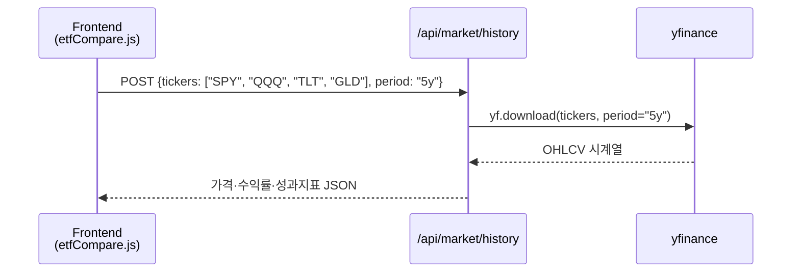

# 모듈 8 도입 — 금융상품의 구분 (자본시장법 기준)

> **모듈 8: 퀀트를 위한 금융 필수 지식** | 도입 | 🏦

> 이 모듈에서 배울 주식, ETF, 펀드는 모두 자본시장법상 **금융투자상품**에 해당합니다.  
> 상품을 배우기 전에 법적 분류 체계를 먼저 확인하면, 각 상품의 규제·위험·운용 방식을 맥락 있게 이해할 수 있습니다.  
> 자세한 내용은 [42.md — 금융 규제·산업 구조 기초](42.md)를 참고하세요.
>
> 📝 **한자 병기 및 어원 사전**: 이 문서에 등장하는 용어의 한자·어원·일제강점기 유래는 → [voca.md](voca.md)

### 금융상품 분류 한눈에 보기

| 대분류 | 소분류 | 원본 손실 | 이 모듈 연관 |
|--------|--------|-----------|--------------|
| **금융투자상품** | 지분증권 (주식) | 가능 | Day 052 |
| **금융투자상품** | 수익증권 (ETF·펀드) | 가능 | Day 052 |
| **비금융투자상품** | 예금·보험 | 원본 보장 | 참고용 |

> 금융회사의 종류, 자본시장법, 위탁·수탁·신탁, 수신·여신의 개념 → [42.md](42.md) 참조

---

# 투자자산운용사(2과목) 문항 구성 한눈에 보기

> 과목: **투자운용 및 전략 Ⅱ(2) 및 투자분석**  
> 총 문항 수: **30문항**  
> 과락 기준: **12문항 미만 정답 시 과락**

## 세부과목별 문항 수 + 초등학생도 이해되는 예시

| 세부과목 | 문항 수 | 아주 쉬운 예시 |
|---|---:|---|
| 대안투자운용/투자전략 | 5 | 주식·ETF만 보지 않고 금, 부동산처럼 다른 종류 자산도 함께 담아보는 전략 |
| 해외증권투자운용/투자전략 | 5 | 한국 가게에서만 장보지 않고 해외 가게 물건도 함께 사듯, 해외 주식도 같이 담아보는 전략 |
| 투자분석기법 | 12 | 시험 전에 문제집을 풀며 "어떤 문제를 자주 틀리는지" 확인하듯, 투자 전에 숫자와 흐름을 먼저 분석 |
| 리스크관리 | 8 | 비 오는 날 우산을 챙기듯, 손해가 커지지 않게 미리 안전장치를 준비하는 것 |
| 한국금융투자협회규정 | 3 | 학교 규칙(예: 복도에서 뛰지 않기)처럼, 투자업무에서도 꼭 지켜야 하는 약속을 배우는 영역 |
| 주식투자운용/투자전략 | 6 | 용돈을 한 번에 다 쓰지 않고 계획표를 짜서 쓰듯, 주식을 언제·얼마나 살지 계획하는 방법 |
| 투자운용결과분석 | 4 | 시험 보고 나서 오답노트를 만들듯, 투자 후에도 무엇이 잘됐는지/아쉬웠는지 다시 점검하는 것 |
| 거시경제 | 4 | 날씨를 보고 옷을 고르듯, 금리·물가·환율 같은 큰 경제 날씨를 보고 투자 방향을 정하는 것 |
| 분산투자기법 | 5 | 색연필을 한 색만 사지 않고 여러 색을 사는 것처럼, 자산을 나눠 담아 한 가지 자산의 위험을 줄이는 방법 |

> 참고: 위 표는 학습자가 빠르게 범위를 잡을 수 있도록 정리한 요약표입니다.

---

## 금융투자분석사 관점 추가 학습 범위

| 세부과목 | 문항 수 | 아주 쉬운 예시 |
|---|---:|---|
| 주식평가/분석, 재무제표론 | 10 | 가게 성적표(매출·비용)를 보고 "이 가게가 돈을 잘 버는지" 판단하듯 기업 재무상태를 읽는 공부 |
| 기업가치평가/분석 | 10 | 중고 자전거 값을 정할 때 상태·연식·인기 등을 보고 가격을 정하듯, 회사의 적정가치를 계산하는 공부 |
| 회사법 | - | 학교 반 규칙처럼, 회사가 어떻게 만들어지고 운영되는지 지켜야 할 법 규칙을 배우는 내용 |

> 참고: 회사법 문항 수는 현재 사용자 입력 기준에 숫자가 없어 `-`로 표기했습니다.

---

## 1과목(증권분석기초) 문항 구성 한눈에 보기

> 과목: **증권분석기초**  
> 총 문항 수: **25문항**  
> 과락 기준: **10문항 미만 정답 시 과락**

| 세부과목 | 문항 수 | 아주 쉬운 예시 |
|---|---:|---|
| 계량분석 | 5 | 운동회 기록을 숫자로 비교하듯, 투자 데이터도 숫자·공식으로 비교해 보는 공부 |
| 증권경제 | 10 | 날씨(경제)가 바뀌면 옷차림(주가)도 달라지듯, 금리·물가·경기와 증권시장 관계를 배우는 내용 |
| 기업금융/포트폴리오 관리 | 10 | 용돈을 저금/간식/학용품으로 나눠 쓰는 계획처럼, 회사 돈 관리와 투자 바구니 관리 방법을 배우는 내용 |

---

# Day 052 — 주식 및 ETF 상품 이해

> **모듈 8: 퀀트를 위한 금융 필수 지식** | 1/5일차 | 🏦 | 학습시간: 8시간

---

> 📺 **YouTube 강의**: [🎬 주식 ETF 상품 투자 이해](https://www.youtube.com/results?search_query=주식+ETF+상품+투자+한국어+설명+강의)

## 오늘 배울 것

> 📺 [🎬 오늘 배울 것](https://www.youtube.com/results?search_query=오늘+배울+것+한국어)

- 주식 시장 구조: 코스피, 코스닥, 나스닥
- 주식 기본 개념: EPS, 배당, 시가총액, 유동주식
- ETF(상장지수펀드)의 구조와 종류
- ETF 운용 전략: 패시브, 액티브, 팩터 ETF
- 실습: ETF 성과 비교 분석

---

## 🗓 세부 일정 (1일 8시간)

> 📺 [🎬 세부 일정](https://www.youtube.com/results?search_query=세부+일정+한국어)

> **강의 5시간** (5개 단락 × 50분 + 도입·마무리 50분) + **실습 3시간** = 총 8시간

| 시간 | 구분 | 내용 | 형태 |
|------|------|------|------|
| 09:00 – 09:10 | 도입 | 오늘 학습 목표 확인 | 강의 |
| 09:10 – 09:30 | **1단락** 설명 20분 | 주식 시장 구조 | 강의 |
| 09:30 – 10:00 | 각자 정리 & 유튜브 30분 | 코스피·코스닥·나스닥 비교 영상 검색 | 자율 |
| 10:00 – 10:20 | **2단락** 설명 20분 | EPS, 배당, 시가총액 | 강의 |
| 10:20 – 10:50 | 각자 정리 & 유튜브 30분 | 기업 재무지표 노트 정리 | 자율 |
| 10:50 – 11:00 | ☕ 휴식 | — | — |
| 11:00 – 11:20 | **3단락** 설명 20분 | ETF 구조와 종류 | 강의 |
| 11:20 – 11:50 | 각자 정리 & 유튜브 30분 | ETF 상품 설명서 읽기 | 자율 |
| 11:50 – 12:10 | **4단락** 설명 20분 | ETF 운용 전략 | 강의 |
| 12:10 – 12:40 | 각자 정리 & 유튜브 30분 | 패시브·액티브·팩터 ETF 사례 정리 | 자율 |
| 12:40 – 13:00 | **5단락** 설명 20분 | ETF 성과 비교 방법 | 강의 |
| 13:00 – 13:30 | 각자 정리 & 유튜브 30분 | 성과 지표 복습 | 자율 |
| 13:30 – 14:00 | 강의 마무리 | Q&A · 핵심 복습 | 강의 |
| 14:00 – 15:00 | 💻 **실습 1부** 60분 | ETF 가격 데이터 수집 및 수익률 계산 | 실습 |
| 15:00 – 15:10 | ☕ 휴식 | — | — |
| 15:10 – 16:00 | 💻 **실습 2부** 50분 | 누적수익률·변동성·MDD 비교 | 실습 |
| 16:00 – 16:10 | ☕ 휴식 | — | — |
| 16:10 – 17:00 | 💻 **실습 발표 & 리뷰** 50분 | ETF 비교 결과 발표 · 피드백 | 실습 |

> 강의 5시간: 도입 10분 + 단락 5개×50분 + 마무리 30분 = **300분**  
> 실습 3시간: 1부 60분 + 휴식 10분 + 2부 50분 + 휴식 10분 + 발표·리뷰 50분 = **180분**

---

## 🔗 참고 사이트 & 데이터 원천

> 📺 [🎬 참고 사이트 데이터 원천](https://www.youtube.com/results?search_query=참고+사이트+데이터+원천+한국어)

> 이 문서(주식·ETF 상품 이해)의 실습에 필요한 공식 데이터 출처와 참고 사이트입니다. ⚿ 는 API 키 또는 승인이 필요한 항목입니다.

### 📊 국내 공식 데이터

| 기관 | URL | API 키 | 제공 데이터 |
|------|-----|--------|-------------|
| KRX 정보데이터시스템 | <https://data.krx.co.kr> | 불필요(웹 조회) | 주식·ETF 가격, 거래량, 상장 정보 |
| KRX Data Marketplace | <https://openapi.krx.co.kr> | ⚿ 필요 | 주식·ETF 시계열, 지수, 증권상품 |
| 금융감독원 DART | <https://opendart.fss.or.kr> | ⚿ 필요 | 사업보고서, 재무제표, 배당 |
| 네이버 금융 | <https://finance.naver.com> | 불필요 | 국내 주식·ETF 가격 참고 |
| 한국거래소 ETF | <https://etf.krx.co.kr> | 불필요 | ETF 구성종목, 순자산, 수익률 |

### 🌍 해외 공식 데이터

| 기관 | URL | API 키 | 제공 데이터 |
|------|-----|--------|-------------|
| SEC EDGAR | <https://www.sec.gov/edgar> | 불필요 | 미국 상장기업 공시 |
| Nasdaq Data Link | <https://data.nasdaq.com> | ⚿ 권장 | 미국 주식·ETF·경제 데이터 |
| ETF.com | <https://www.etf.com> | 불필요 | ETF 분류, 운용보수, 구성 |
| iShares | <https://www.ishares.com> | 불필요 | iShares ETF 구성종목·팩트시트 |
| State Street SPDR | <https://www.ssga.com> | 불필요 | SPDR ETF 상품 정보 |
| Vanguard | <https://investor.vanguard.com> | 불필요 | Vanguard ETF 상품 정보 |

### 📈 차트 & 뉴스 참고

| 분류 | 사이트 | URL | 활용 용도 |
|------|--------|-----|-----------|
| 차트 플랫폼 | TradingView | <https://www.tradingview.com> | 주식·ETF 가격 차트 |
| 시장 데이터 | Yahoo Finance | <https://finance.yahoo.com> | ETF 가격, 배당, 간단한 성과 비교 |
| 국내 금융 포탈 | 네이버 금융 | <https://finance.naver.com> | 국내 ETF 조회 |
| 금융 미디어 | 한국경제 | <https://www.hankyung.com> | ETF·증시 뉴스 |
| 금융 미디어 | 이데일리 | <https://www.edaily.co.kr> | ETF·시장 기사 |

---

---

## 🧒 주식이란? — 초등학생도 이해하는 설명

> 📺 [🎬 주식이란 초등학생도 이해하는 설명](https://www.youtube.com/results?search_query=주식이란+초등학생도+이해하는+설명+한국어)

> **한 줄 요약**: 회사의 아주 작은 주인이 되는 것

### 피자 한 판 비유

삼성전자라는 회사가 피자 한 판이라고 상상해보세요.  
이 피자를 **1억 조각**으로 잘라서 사람들에게 나눠 판다고 합시다.  
그 조각 하나가 바로 **주식 1주**입니다.

```
삼성전자 (피자 한 판)
├── 주식 1주  ← 당신이 살 수 있는 아주 작은 조각
├── 주식 1주
├── 주식 1주  (× 약 60억 주)
└── ...
```

| 상황 | 무슨 일이 일어나나요? |
|------|----------------------|
| 회사가 돈을 많이 벌면 | 피자 조각(주식)이 더 비싸집니다 → 주가 상승 |
| 회사가 손해를 보면 | 피자 조각 값이 내려갑니다 → 주가 하락 |
| 이익을 나눠줄 때 | 가지고 있는 조각 수만큼 돈을 받습니다 → 배당 |

> 💡 주식을 산다 = 회사의 주인(주주)이 된다 = 회사가 잘 되면 같이 이익, 못 되면 같이 손해

---

### 1. 주식 시장 구조 (코스피, 코스닥, 나스닥)

> 📖 **Wikipedia**: [주식시장](https://ko.wikipedia.org/wiki/주식시장) · [코스피](https://ko.wikipedia.org/wiki/코스피) · [코스닥](https://ko.wikipedia.org/wiki/코스닥) · [나스닥](https://ko.wikipedia.org/wiki/나스닥)

**핵심 개념**

주식 시장은 기업이 자본을 조달하고 투자자가 기업의 소유권 일부를 사고파는 장소입니다. 퀀트 분석에서는 시장별 특성이 다르기 때문에, 같은 전략이라도 어느 시장에 적용하는지 먼저 구분해야 합니다.

| 시장 | 주요 특징 | 퀀트 분석 포인트 |
|------|-----------|------------------|
| 코스피 | 대형·우량 기업 중심 | 시가총액, 외국인 수급, 경기 민감도 |
| 코스닥 | 성장주·중소형주 중심 | 변동성, 거래대금, 테마 민감도 |
| 나스닥 | 기술주·성장주 비중 높음 | 금리 민감도, 성장률, 밸류에이션 |

> 📺 [🎬 코스피 코스닥 나스닥 차이](https://www.youtube.com/results?search_query=코스피+코스닥+나스닥+차이+한국어)

```python
markets = {
    "KOSPI": {"return": 0.08, "volatility": 0.18},
    "KOSDAQ": {"return": 0.12, "volatility": 0.30},
    "NASDAQ": {"return": 0.15, "volatility": 0.25},
}

for market, stats in markets.items():
    score = stats["return"] / stats["volatility"]
    print(f"{market}: 단순 위험대비수익 {score:.2f}")
```

---

#### 1-A. 코스피(KOSPI)란?

> 📖 **Wikipedia**: [코스피](https://ko.wikipedia.org/wiki/코스피)

**KOSPI(Korea Composite Stock Price Index)**는 한국거래소(KRX)가 운영하는 **유가증권시장(Main Board)**의 종합주가지수입니다. 1956년 대한증권거래소 출범과 함께 시작된 국내 최초의 공식 주식시장으로, 상장 요건이 엄격하여 재무 안정성이 검증된 대형·우량 기업들이 주로 상장되어 있습니다.

| 항목 | 내용 |
|------|------|
| 운영 기관 | 한국거래소(KRX) — 유가증권시장본부 |
| 지수 기준일 | 1980년 1월 4일 = 100 |
| 주요 구성 | 삼성전자, SK하이닉스, LG에너지솔루션 등 대형 블루칩 |
| 시가총액 | 약 1,700~2,100조 원 수준(2024년 기준) |
| 상장 종목 수 | 약 800개 내외 |
| 대표 지수 | KOSPI 200 (시가총액 상위 200종목) |
| 증권거래세 | 0.03% (+ 농어촌특별세 0.15%) |

> 💡 코스피 200은 선물·옵션·ETF의 기초자산으로 활발하게 활용됩니다.

---

#### 1-B. 코스닥(KOSDAQ)이란?

> 📖 **Wikipedia**: [코스닥](https://ko.wikipedia.org/wiki/코스닥)

**KOSDAQ(Korea Securities Dealers Automated Quotations)**은 한국거래소(KRX)가 운영하는 **코스닥시장**의 주가지수입니다. 중소·벤처·기술 성장 기업을 위한 시장으로, 이름에서 알 수 있듯이 미국 나스닥(NASDAQ)을 모델로 삼아 설계되었습니다.

| 항목 | 내용 |
|------|------|
| 운영 기관 | 한국거래소(KRX) — 코스닥시장본부 |
| 지수 기준일 | 1996년 7월 1일 = 1,000 |
| 주요 구성 | IT·바이오·게임·엔터테인먼트·중소제조 기업 |
| 시가총액 | 약 350~450조 원 수준(2024년 기준) |
| 상장 종목 수 | 약 1,700개 내외 |
| 대표 지수 | 코스닥 150 (시가총액 상위 150종목) |
| 증권거래세 | 0.18% |

> 💡 코스닥은 상장 요건이 코스피보다 완화되어 있어, 설립 초기 혹은 적자 상태인 기술 기업도 미래 성장성을 인정받으면 상장할 수 있습니다.

---

#### 1-C. 코스닥의 역사

> 📺 [🎬 코스닥 역사 설명](https://www.youtube.com/results?search_query=코스닥+역사+설립+배경+한국어)

```
1996 ─ 코스닥 설립 (7월 1일)
          미국 나스닥을 모델로, 장외 거래 제도화
          증권업협회(KSDA) 주도로 운영
1997 ─ 외환위기 (IMF)
          코스닥 지수 급락, 기술 기업 구조조정
1999 ─ IT 버블 호황
          벤처 붐·인터넷 기업 폭발적 증가 → 지수 2,800 돌파(역대 최고)
2000 ─ IT 버블 붕괴 (닷컴 버블)
          지수 급락, 다수 벤처 기업 상폐
2005 ─ 코스닥위원회 → 코스닥증권시장(주) 독립법인 전환
2005 ─ 한국증권선물거래소(KRX) 통합
          코스닥도 KRX 산하로 편입, 통합 거래 인프라 공유
2013 ─ 코스닥 활성화 정책
          상장 요건 완화, 기술특례상장 제도 도입
2016 ─ 코스닥 스케일업 펀드·정책 지속 확대
2018 ─ 정부 코스닥 활성화 방안 발표
          공매도 제한 강화, 기관 투자자 코스닥 편입 확대
2020 ─ 코로나19 팬데믹 충격 후 반등
          바이오·게임·언택트 주도로 급등
2023 ─ 현재
          이차전지·AI·바이오 테마 중심 시장 형성
```

| 연도 | 주요 사건 | 코스닥 영향 |
|------|-----------|------------|
| 1996 | 코스닥 개설 | 벤처 자금 조달 창구 마련 |
| 1999~2000 | IT 버블 급등·붕괴 | 지수 고점 2,800 → 300대로 폭락 |
| 2005 | KRX 통합 | 시장 신뢰도 및 거래 인프라 향상 |
| 2013 | 기술특례상장 도입 | 바이오·IT 혁신 기업 상장 확대 |
| 2020 | 팬데믹 반등 | 바이오·언택트 테마 폭발적 성장 |
| 2023~ | 이차전지·AI 부각 | 고성장 테마 집중 → 변동성 확대 |

---

#### 1-D. 코스피 vs 코스닥 — 상세 비교

> 📺 [🎬 코스피 코스닥 차이 비교](https://www.youtube.com/results?search_query=코스피+코스닥+차이+비교+한국어)

두 시장은 같은 KRX 내에서 운영되지만 **상장 기업의 성격, 요건, 투자자 행동, 리스크 프로파일**이 크게 다릅니다.

##### 1) 설립 목적

| 항목 | 코스피 | 코스닥 |
|------|--------|--------|
| 목적 | 안정적·성숙한 기업의 자본 조달 | 중소·벤처·기술 성장기업의 자금 조달 |
| 모델 | 뉴욕증권거래소(NYSE) | 미국 나스닥(NASDAQ) |
| 운영 시작 | 1956년 (유가증권시장) | 1996년 |

##### 2) 상장 요건 비교

| 요건 항목 | 코스피 | 코스닥 |
|-----------|--------|--------|
| 자기자본 | 300억 원 이상 | 30억 원 이상 (일반) |
| 매출액 | 1,000억 원 이상 (기준에 따라 다름) | 100억 원 이상 (일부 기준 완화) |
| 이익 요건 | 최근 3년 중 2년 이상 흑자 | 흑자 요건 완화, 기술특례는 적자도 가능 |
| 주식 분산 | 25% 이상 | 20% 이상 |
| 기술특례상장 | 제한적 | 바이오·IT 등 기술평가 통과 시 가능 |

> 💡 **기술특례상장**: 매출·이익 요건을 충족하지 못하더라도 전문 기관의 기술 평가(기술력·성장 잠재성)에서 일정 등급 이상을 받으면 코스닥에 상장 가능한 제도. 바이오·AI 스타트업이 주로 활용합니다.

##### 3) 시장 특성 비교

| 특성 | 코스피 | 코스닥 |
|------|--------|--------|
| 상장 기업 규모 | 대형주 중심 (시총 1조 원 이상 다수) | 중소형주 중심 (시총 수백억~수천억 원) |
| 대표 업종 | 반도체·자동차·금융·화학·에너지 | IT·바이오·게임·엔터테인먼트·2차전지 |
| 외국인 비중 | 높음 (시총의 약 30~35%) | 낮음 (시총의 약 10~15%) |
| 일반 거래대금 | 크고 안정적 | 상대적으로 작고 변동 폭 큼 |
| 주가 변동성 | 낮음 (연 변동성 약 15~20%) | 높음 (연 변동성 약 25~35%) |
| 테마·이슈 민감도 | 낮음 (펀더멘털 중심) | 높음 (테마·뉴스 단기 급등락 잦음) |
| 증권거래세 | 0.03% + 농특세 0.15% | 0.18% |

##### 4) 투자자 성향 차이

| 투자자 유형 | 코스피 선호 이유 | 코스닥 선호 이유 |
|------------|----------------|----------------|
| 기관 투자자 | 안정적 수급, KOSPI200 벤치마크 | 고성장 테마 편입으로 알파 추구 |
| 외국인 투자자 | 글로벌 지수 편입 종목 집중 | 특정 섹터(바이오 등) 직접 투자 |
| 개인 투자자 | 삼성전자 등 우량주 장기 보유 | 단기 테마·모멘텀 트레이딩 |

##### 5) 퀀트 분석 관점 비교

```python
# 코스피 vs 코스닥 대표 특성 비교 (개념 예시)
market_profile = {
    "KOSPI": {
        "avg_market_cap_억원": 15_000,   # 대형주 중심
        "annual_volatility": 0.18,        # 상대적으로 낮은 변동성
        "foreign_ownership_pct": 0.33,    # 높은 외국인 비중
        "key_sector": "반도체·자동차·금융",
        "tax_rate": 0.0003 + 0.0015,      # 매도 시 0.18%
    },
    "KOSDAQ": {
        "avg_market_cap_억원": 1_200,     # 중소형주 중심
        "annual_volatility": 0.30,        # 높은 변동성
        "foreign_ownership_pct": 0.12,    # 낮은 외국인 비중
        "key_sector": "바이오·IT·게임",
        "tax_rate": 0.0018,               # 매도 시 0.18%
    },
}

for mkt, info in market_profile.items():
    print(f"[{mkt}]")
    for k, v in info.items():
        print(f"  {k}: {v}")
    print()
```

##### 6) 초등학생도 이해하는 비유

| 비유 | 코스피 | 코스닥 |
|------|--------|--------|
| 학교 비유 | **고등학교 졸업생 취업 시장** — 이미 실력이 검증된 어른들이 큰 회사에 취직 | **신입생 입시 시장** — 아직 실력을 증명 중인 학생들이 가능성을 보고 선발 |
| 식당 비유 | **오래된 맛집 체인** — 안정적이고 믿을 수 있지만 대박 가능성은 낮음 | **새로 생긴 인기 식당** — 리스크는 크지만 대박 날 수도 있음 |

> ⚠️ **투자 유의사항**: 코스닥은 변동성이 높고 테마에 민감하므로, 단기 급등락에 휩쓸리지 않도록 기업의 펀더멘털(실적·기술력·재무구조)을 먼저 확인하는 것이 중요합니다.

---

#### 1-E. 코스닥 주요 섹터 및 대표 기업 유형

| 섹터 | 특징 | 투자 포인트 |
|------|------|------------|
| IT·소프트웨어 | 국내 SaaS·플랫폼·보안 기업 | 매출 성장률, ARR, 영업이익 전환 시점 |
| 바이오·헬스케어 | 신약 개발·CRO·의료기기 | 임상 단계, 파이프라인 수, 기술이전 실적 |
| 게임·엔터테인먼트 | 모바일·PC 게임, K-팝 레이블 | 신작 출시 일정, 글로벌 매출 비중 |
| 이차전지·소재 | 배터리 셀·소재·부품 | 수주 잔고, 고객사 다변화, 원재료 가격 |
| 반도체 장비·부품 | 팹리스, 테스트 장비, 소재 | 삼성·SK하이닉스 의존도, 글로벌 수주 |

> 📺 [🎬 코스닥 대표 섹터 투자](https://www.youtube.com/results?search_query=코스닥+섹터+바이오+IT+게임+투자+한국어)

---

### 2. 주식 기본 개념 (주당순이익, 배당 등)

> 📖 **Wikipedia**: [주당순이익](https://ko.wikipedia.org/wiki/주당순이익) · [배당](https://ko.wikipedia.org/wiki/배당) · [시가총액](https://ko.wikipedia.org/wiki/시가총액)

**핵심 개념**

주식 1주의 가치는 기업 전체 가치와 주식 수를 함께 보아야 해석할 수 있습니다.

| 지표 | 계산식 | 해석 |
|------|--------|------|
| EPS | 순이익 ÷ 발행주식수 | 1주가 벌어들인 이익 |
| PER | 주가 ÷ EPS | 이익 대비 주가 수준 |
| 배당수익률 | 주당배당금 ÷ 주가 | 현금 배당 매력 |
| 시가총액 | 주가 × 발행주식수 | 시장이 평가한 기업 전체 가치 |

> 📺 [🎬 EPS PER 배당수익률 설명](https://www.youtube.com/results?search_query=EPS+PER+배당수익률+주식+한국어)

```python
price = 50000
net_income = 1_200_000_000_000
shares = 100_000_000
dividend_per_share = 1500

eps = net_income / shares
per = price / eps
dividend_yield = dividend_per_share / price

print(f"EPS: {eps:,.0f}원")
print(f"PER: {per:.1f}배")
print(f"배당수익률: {dividend_yield:.2%}")
```

#### 순자산(자본), BPS, PBR

주식에서 말하는 **순자산(순자본, Equity)**은 회사의 자산에서 부채를 뺀 값입니다.

| 지표 | 계산식 | 의미 |
|------|--------|------|
| **순자산(자본)** | `자산 - 부채` | 주주에게 귀속되는 장부상 가치 |
| **BPS** (주당순자산) | `순자산 ÷ 발행주식수` | 주식 1주당 장부가치 |
| **PBR** | `주가 ÷ BPS` | 시장가격이 장부가치의 몇 배인지 |

> 💡 PBR이 1배보다 낮으면 장부가치 대비 저평가로 해석되기도 하지만, 업황·수익성 악화가 반영된 결과일 수도 있어 단독 판단은 위험합니다.

#### 주식 거래 기본 — 매수호가·매도호가

| 용어 | 뜻 | 실전 해석 |
|------|----|----------|
| **매수호가(Bid)** | 사려는 사람이 제시한 가격 | 높을수록 즉시 체결 가능성↑ |
| **매도호가(Ask)** | 팔려는 사람이 제시한 가격 | 낮을수록 즉시 체결 가능성↑ |
| **호가 스프레드** | `최우선 매도호가 - 최우선 매수호가` | 좁을수록 거래비용·슬리피지 부담↓ |
| **체결 원리** | 매수호가가 매도호가 이상이면 체결 | 주문 가격을 공격적으로 넣을수록 체결 속도↑ |

```python
# 호가 예시
best_bid = 50_000   # 최우선 매수호가
best_ask = 50_050   # 최우선 매도호가
spread = best_ask - best_bid
spread_pct = spread / best_bid * 100

print(f"호가 스프레드: {spread}원 ({spread_pct:.3f}%)")
```

---

---

## 🧒 펀드란? — 초등학생도 이해하는 설명

> 📺 [🎬 펀드란 초등학생도 이해하는 설명](https://www.youtube.com/results?search_query=펀드란+초등학생도+이해하는+설명+한국어)

> **한 줄 요약**: 여럿이 돈을 모아 전문가에게 대신 투자하게 맡기는 것

### 학급 공동 간식 비유

반 친구 30명이 각자 1만 원씩 모아서 **반장(전문 펀드매니저)**에게 맡겼습니다.  
반장은 그 30만 원으로 여러 과자(주식, ETF 등)를 골라 사 두고,  
나중에 이익이 나면 낸 돈 비율대로 돌려줍니다.

```
투자자 A (1만원) ─┐
투자자 B (1만원) ─┤  → 펀드매니저 → 주식·ETF·리츠 등에 분산 투자
투자자 C (1만원) ─┘
```

| 항목 | 설명 |
|------|------|
| 장점 | 혼자서는 사기 어려운 여러 자산을 한 번에 분산 투자 |
| 단점 | 운용 보수(수수료)가 있고, 원금 손실 가능성도 있음 |
| 전문가 | 펀드매니저가 대신 골라줌 — 하지만 성과는 보장 안 됨 |

> 💡 펀드는 **집합투자**라고도 부릅니다. 여러 사람의 돈을 모아(집합) 함께 투자(투자)한다는 뜻이에요.

### 펀드 클래스 — A, C, Ae, Ce 뒤에 붙는 알파벳의 뜻

> 📖 **Wikipedia**: [수익증권](https://ko.wikipedia.org/wiki/수익증권) | 근거 규정: 금융투자협회 펀드 클래스 분류 기준

펀드 이름 뒤에 붙는 알파벳은 **판매 채널**과 **수수료 부과 방식**을 나타냅니다.  
같은 펀드라도 클래스에 따라 투자자가 내는 비용이 다릅니다.

| 클래스 | 수수료 구조 | 특징 | 유리한 경우 |
|--------|-----------|------|-------------|
| **A** | 선취수수료 O + 연간 보수 낮음 | 가입 시 수수료를 미리 냄 | 장기 보유 (2년 이상) |
| **C** | 선취수수료 X + 연간 보수 높음 | 가입 시 수수료 없음, 대신 매년 보수 높음 | 단기 보유 (1년 미만) |
| **Ae** | A클래스 온라인 전용 | 판매사 직접 방문 없이 인터넷·앱으로만 가입, 수수료 할인 | 온라인 가입 + 장기 |
| **Ce** | C클래스 온라인 전용 | C클래스를 온라인에서 가입, 보수 일부 할인 | 온라인 가입 + 단기 |
| **S** | 펀드슈퍼마켓 전용 | 금융투자협회 펀드슈퍼마켓에서만 판매, 낮은 보수 | 비용 절약 + 다양한 펀드 비교 |
| **I** | 기관투자자 전용 | 대규모 투자(수억원 이상), 매우 낮은 보수 | 기관·법인 투자자 |
| **P** (또는 **P2**) | 연금저축 전용 | 연금저축계좌에서만 매수 가능, 세제혜택 연계 | 노후 대비 연금저축 |
| **W** | 랩(Wrap) 전용 | 증권사 랩어카운트에서 자동 편입 | 자산관리 서비스 이용 고객 |

**비용 계산 예시** — 1,000만원을 2년간 투자했을 때

```python
investment = 10_000_000  # 1,000만원

# A클래스: 선취수수료 1% + 연간 보수 0.8%
class_A_cost = investment * 0.01 + investment * 0.008 * 2
# C클래스: 선취수수료 0% + 연간 보수 1.5%
class_C_cost = investment * 0.00 + investment * 0.015 * 2
# Ae클래스: 선취수수료 0.5% + 연간 보수 0.6%
class_Ae_cost = investment * 0.005 + investment * 0.006 * 2

print(f"A클래스  총비용: {class_A_cost:,.0f}원")   # 선취+보수
print(f"C클래스  총비용: {class_C_cost:,.0f}원")   # 보수만
print(f"Ae클래스 총비용: {class_Ae_cost:,.0f}원")  # 온라인 할인
```

> 💡 **클래스 선택 기준**: 2년 이상 장기라면 A(Ae), 1년 미만 단기라면 C(Ce)가 일반적으로 유리합니다.  
> 동일한 펀드라도 클래스별 ISIN 코드가 다르므로, 가입 전 클래스명과 보수를 반드시 확인하세요.

---

## 🧒 ETF란? — 초등학생도 이해하는 설명

> 📺 [🎬 ETF란 초등학생도 이해하는 설명](https://www.youtube.com/results?search_query=ETF란+초등학생도+이해하는+설명+한국어)

> **한 줄 요약**: 주식처럼 실시간으로 사고팔 수 있는 펀드

### 과일 바구니 비유

사과(삼성), 바나나(SK하이닉스), 딸기(현대차) … 를  
**하나하나 사는 대신**, 과일 바구니 자체를 통째로 사는 것이 ETF입니다.

```
KODEX 200 ETF 한 주를 사면
  → 코스피 상위 200개 회사를 아주 조금씩 전부 소유하게 됩니다.
```

| 비교 | 일반 펀드 | ETF |
|------|-----------|-----|
| 어디서 사나요? | 은행·증권사 창구 / 앱 가입 | 주식처럼 거래소에서 실시간 매매 |
| 가격 확인 | 하루 한 번 (장 마감 후) | 실시간 (장이 열린 동안 계속 변함) |
| 수수료 | 상대적으로 높음 | 상대적으로 낮음 |
| 대표 예시 | 국내 주식형 펀드 | KODEX 200, TIGER 미국S&P500 |

> 💡 ETF = **E**xchange(거래소) **T**raded(거래되는) **F**und(펀드)  
> "거래소에서 거래할 수 있는 펀드"를 짧게 줄인 이름입니다.

---

### 2-1. 일반펀드 vs ETF — 차이 보완 정리

| 항목 | 일반펀드(공모펀드) | ETF | 실전 체크포인트 |
|---|---|---|---|
| 매매 방식 | 가입/환매 신청 | 주식처럼 주문(지정가·시장가) | 단기 대응은 ETF가 유리 |
| 체결 시점 | 기준가로 일괄 처리 | 주문 즉시 체결 가능 | 장중 변동 대응 가능 여부 확인 |
| 운용 공개 | 보유 종목 공시 주기 상대적으로 김 | 구성종목·지수 정보가 비교적 투명 | 전략 이해 난이도 차이 |
| 비용 구조 | 판매보수·운용보수·환매수수료 가능 | 총보수(TER) + 매매수수료/스프레드 | 총비용(보수+거래비용) 함께 비교 |
| 최소 투자 단위 | 금액 기준(만원 단위) | 1주 단위 가능 | 소액 분할매수는 ETF가 편리 |
| 자동적립 | 금융사 자동이체 중심 | 증권사 자동매수/정기매수 설정 | 투자 습관에 맞는 채널 선택 |

#### 일반펀드가 유리한 경우
- 퇴직연금/연금저축 등 계좌에서 장기 자동적립을 주로 할 때
- 운용사의 액티브 판단(종목선택)을 그대로 맡기고 싶을 때

#### ETF가 유리한 경우
- 장중 가격을 보며 분할매수·분할매도를 하고 싶을 때
- 지수 추종 + 낮은 비용 + 높은 투명성을 우선할 때

#### 비교용 최소 체크리스트
1. 총보수(TER)와 최근 1년 추적오차
2. 일평균 거래대금(유동성)과 스프레드
3. 분배금 정책(분배/재투자)과 과세 구조

---
#### Net vs Gross — 꼭 구분해야 할 두 단어

- **Gross(그로스)**: 비용·세금 등을 빼기 전 수치(총액)
- **Net(넷)**: 비용·세금 등을 뺀 뒤 실제 남는 수치(순액)

| 항목 | Gross | Net |
|---|---|---|
| 의미 | 총수익/총자산 기준 | 비용 차감 후 실제 수익/자산 |
| ETF 비교 시 | 지수 자체 상승률 확인용 | 투자자가 체감하는 성과 확인용 |
| 실무 해석 | 전략 성능의 원자료 | 실제 계좌 성과에 더 가까움 |

> 💡 같은 기간이라도 **Gross 수익률 > Net 수익률**이 일반적입니다.

---

### 3. ETF(상장지수펀드) 개요 및 종류

> 📖 **Wikipedia**: [상장지수 펀드](https://ko.wikipedia.org/wiki/상장지수_펀드) · [인덱스 펀드](https://ko.wikipedia.org/wiki/인덱스_펀드) · [순자산가치](https://ko.wikipedia.org/wiki/순자산가치)

**ETF란 무엇인가**

ETF는 펀드처럼 여러 자산을 담고 있지만 주식처럼 거래소에서 실시간 매매할 수 있는 상품입니다. 퀀트 실습에서는 개별 종목보다 데이터가 안정적이고, 섹터·국가·팩터를 쉽게 비교할 수 있어 자주 사용합니다.

> 📺 [🎬 ETF란 무엇인가](https://www.youtube.com/results?search_query=ETF란+무엇인가+상장지수펀드+한국어)

#### 3-1. NAV(순자산가치)와 괴리율

ETF를 이해하려면 **NAV**를 먼저 알아야 합니다.

| 개념 | 정의 | 계산식 |
|------|------|--------|
| **NAV** (Net Asset Value, 순자산가치) | ETF가 보유한 자산에서 부채를 뺀 실제 가치를 주식 수로 나눈 것 | `NAV = (총자산 - 부채) ÷ 발행주식수` |
| **iNAV** (Intraday NAV) | 장중 실시간으로 추정한 NAV. ETF 호가창 옆에 표시됨 | 기초자산 실시간 가격 반영 |
| **괴리율** | ETF 시장가격이 NAV에서 얼마나 벗어났는지 | `(시장가격 - NAV) ÷ NAV × 100` |
| **추적오차** (Tracking Error) | ETF 수익률과 추종 지수 수익률의 차이 | `std(ETF 수익률 - 지수 수익률)` |

```python
# NAV·괴리율·추적오차 계산 예시
total_assets = 10_050_000_000  # 100.5억원 (편입 자산 시가)
liabilities   = 50_000_000     # 5,000만원 (운용 비용 등)
shares_out    = 1_000_000      # 발행 주식 수

nav = (total_assets - liabilities) / shares_out  # 주당 NAV
market_price = 10_100           # 현재 시장가격

gap = (market_price - nav) / nav * 100
print(f"NAV: {nav:,.0f}원")
print(f"시장가: {market_price:,}원")
print(f"괴리율: {gap:+.2f}%")   # 양수=프리미엄, 음수=디스카운트
```

> 💡 괴리율이 크면 NAV보다 비싸게(또는 싸게) 사게 됩니다. **±1% 이내**의 괴리율이 정상 범위입니다.  
> 유동성이 낮은 ETF(거래량 적음)는 괴리율이 커질 수 있어 주의가 필요합니다.

#### 3-1A. ETF 시장의 LP(유동성공급자) 역할

ETF에서는 **LP(Liquidity Provider)**가 호가를 지속적으로 제시해 매수·매도 체결을 돕습니다.  
즉, 이 문맥의 LP는 VC 문맥의 Limited Partner(유한책임조합원)와 다른 의미입니다.

| 구분 | 역할 | 투자자에게 중요한 이유 |
|------|------|-------------------------|
| **LP (유동성공급자)** | 양방향 호가(매수/매도)를 제시해 스프레드 완화 | 원하는 시점에 더 안정적으로 체결 가능 |
| **AP (지정참가회사)** | ETF 설정·환매를 통해 시장가격과 NAV 괴리를 축소 | 괴리율이 과도하게 벌어지는 것을 완화 |

> 💡 거래량이 적은 ETF라도 LP/AP가 정상적으로 기능하면 체결 품질과 가격 괴리 리스크를 줄일 수 있습니다.

#### 3-1B. ETF 선택 조건 — 수익률·괴리율·추적오차·펀드보수

ETF를 고를 때는 단순히 수익률 1개만 보지 말고, 아래 4가지를 함께 봐야 합니다.

| 항목 | 무엇을 보는가 | 일반 해석 |
|------|---------------|-----------|
| **수익률** | 3개월·1년·3년 성과가 일관적인가 | 높을수록 유리하지만 단기 급등은 지속성 점검 필요 |
| **괴리율** | 시장가격이 NAV에서 얼마나 벗어나는가 | 절대값이 작을수록 체결 가격 리스크가 낮음 |
| **추적오차** | ETF 수익률이 지수를 얼마나 잘 따라가는가 | 낮을수록 지수 추종 품질이 좋음 |
| **펀드보수(TER/총보수)** | 연간 보수가 얼마나 차감되는가 | 장기일수록 낮은 보수가 복리에 유리 |

#### 거래 수수료 vs 펀드보수(TER) — 이름이 비슷하지만 다른 비용

| 구분 | 언제 발생 | 누구에게 내는가 | ETF 선택 시 해석 |
|------|----------|------------------|------------------|
| **주식거래 수수료** | 매수/매도 주문 체결 시마다 | 증권사(브로커) | 매매가 잦을수록 비용 부담 증가 |
| **펀드보수(TER/총보수)** | ETF를 보유하는 기간 동안 매일/연간 누적 | 운용사·신탁·사무관리 등 | 장기 보유일수록 누적 차이가 커짐 |

> 💡 거래 수수료는 **거래할 때 한 번씩** 내는 비용이고, 펀드보수는 **보유하는 동안 계속** 반영되는 비용입니다.  
> 따라서 단기 매매자는 수수료·스프레드를, 장기 투자자는 TER·추적오차를 더 민감하게 봐야 합니다.

**실전 체크 순서 (간단 버전)**

1. 같은 지수를 추종하는 ETF끼리 후보를 2~3개 고른다.
2. 최근 1년 수익률만이 아니라 3년 추세도 함께 본다.
3. 괴리율 절대값이 큰 ETF는 우선순위를 낮춘다.
4. 추적오차가 작은 ETF를 우선 고려한다.
5. 조건이 비슷하면 총보수가 더 낮은 ETF를 선택한다.

```python
# ETF 2개 비교를 위한 단순 점수 예시 (학습용)
etf_a = {"name": "ETF_A", "return_pct": 12.4, "gap_pct": 0.15, "te_pct": 0.28, "ter_pct": 0.07}
etf_b = {"name": "ETF_B", "return_pct": 11.8, "gap_pct": 0.45, "te_pct": 0.62, "ter_pct": 0.20}

def score(x):
    # 높을수록 좋은 항목: 수익률
    ret_score = x["return_pct"]
    # 낮을수록 좋은 항목: 괴리율/추적오차/보수
    cost_score = 100 - (x["gap_pct"] * 20 + x["te_pct"] * 20 + x["ter_pct"] * 10)
    return ret_score * 0.6 + cost_score * 0.4

print(etf_a["name"], round(score(etf_a), 2))
print(etf_b["name"], round(score(etf_b), 2))
```

> ⚠️ 위 점수식은 학습용입니다. 실제 투자에서는 거래량, 상장폐지 위험, 분배금 정책, 과세 구조까지 함께 확인해야 합니다.

#### 3-2. ETF 종류 — 5가지 기준으로 분류

#### 섹터(Sector) = 업종(Industry Group)

ETF 문맥에서 **섹터는 업종**을 뜻합니다.
즉, 반도체·헬스케어·금융처럼 같은 산업군 기업들을 묶어 부르는 말입니다.

#### 한국 ETF 브랜드 / 미국 ETF 브랜드

| 구분 | 대표 브랜드 |
|---|---|
| 한국 | KODEX, TIGER, KINDEX, KOSEF, KBSTAR, SOL, HANARO, ACE, RISE |
| 미국 | iShares, Vanguard, SPDR, Invesco, Schwab, WisdomTree, VanEck, Global X |

#### ETF 이름의 숫자 의미 (200, 500)

- **200**: 보통 200개 종목으로 구성된 대표 지수(예: KOSPI 200) 추종을 의미
- **500**: 보통 500개 대형주 지수(예: S&P 500) 추종을 의미
- 숫자는 대개 **추종 지수의 구성 종목 수/지수명**을 반영한 표기입니다.

**① 추종 자산 유형별**

| 분류 | 대표 국내 ETF | 대표 해외 ETF | 특징 |
|------|--------------|--------------|------|
| 주식형 — 시장지수 | KODEX 200, TIGER 코스닥150 | SPY(S&P500), QQQ(나스닥100) | 시장 전체 베타 노출 |
| 주식형 — 섹터 | KODEX 반도체, TIGER 2차전지 | XLK(기술), XLV(헬스케어) | 특정 산업 집중 투자 |
| 주식형 — 테마 | TIGER 글로벌AI&로보틱스 | ARKK(혁신기업), BOTZ(로봇) | 메가트렌드 집중 |
| 부동산형(리츠) | TIGER 부동산인프라고배당 | VNQ(미국리츠), REET(글로벌리츠) | 임대수익+시세차익 |
| 멀티에셋 | TIGER 올웨더 | AOM, AOR | 자산배분 원스톱 |

**② 운용 방식별**

| 방식 | 설명 | 비용(TER) | 예시 |
|------|------|----------|------|
| 패시브 (지수 추종) | 특정 지수를 그대로 복제 | 낮음 (0.05~0.3%) | KODEX 200, SPY |
| 액티브 | 펀드매니저가 지수 초과수익 추구 | 높음 (0.5~1.0%) | TIGER 액티브배당 |
| 스마트베타/팩터 | 가치·모멘텀 등 특정 요인 집중 | 중간 (0.2~0.5%) | VLUE(가치), MTUM(모멘텀) |

**③ 레버리지·인버스 여부**

| 유형 | 일일 수익률 | 장기 보유 시 | 용도 |
|------|-----------|------------|------|
| 일반 (1×) | 지수와 동일 | 적합 | 장기 적립 |
| 레버리지 (2×) | 지수의 2배 | 복리 손실 위험 | 단기 방향성 거래 |
| 인버스 (−1×) | 지수의 반대 | 장기 보유 비권고 | 하락장 헤지 |
| 곱버스 (−2×) | 지수의 −2배 | 매우 위험 | 단기 매매만 |

> ⚠️ 레버리지·인버스 ETF는 **일일 수익률** 기준으로 운용됩니다. 횡보장이 지속되면 복리 손실로 원금이 줄어드는 **변동성 끌림(Volatility Drag)** 현상이 발생합니다.

**④ 실물 복제 vs 합성 복제**

| 방식 | 방법 | 장점 | 단점 |
|------|------|------|------|
| 실물 복제 | 기초자산(주식 등)을 직접 보유 | 투명성 높음, 상대방 위험 없음 | 일부 자산은 직접 보유 어려움 |
| 합성 복제 | 스왑 계약으로 지수 수익률 교환 | 접근 어려운 자산도 추종 가능 | 스왑 상대방 부도 위험 존재 |

**⑤ 환헤지(H) 여부**

| 구분 | 의미 | 예시 |
|------|------|------|
| 환헤지 `(H)` | 원/달러 환율 변동 위험을 제거 | TIGER 미국S&P500**TR(H)** |
| 환노출 (없음) | 환율 변동이 수익률에 그대로 반영 | TIGER 미국S&P500 |

> 💡 달러 강세 국면에서는 환노출이 유리하고, 달러 약세 국면에서는 환헤지가 유리합니다.  
> 어느 쪽이 맞는지 알 수 없으므로 **두 ETF를 반반 섞는** 방법도 있습니다.

```python
# 환헤지 여부에 따른 수익률 차이 시뮬레이션
import numpy as np

np.random.seed(42)
usd_index_return  = 0.10   # S&P500 달러 기준 10% 상승
krw_usd_change    = 0.05   # 원/달러 5% 상승 (원화 약세 = 달러 강세)

hedged_return   = usd_index_return                          # 환헤지: 환율 영향 제거
unhedged_return = (1 + usd_index_return) * (1 + krw_usd_change) - 1  # 환노출: 환율 반영

print(f"환헤지  수익률: {hedged_return:.1%}")    # 10.0%
print(f"환노출  수익률: {unhedged_return:.1%}")  # 15.5% (달러 강세 덕분)
```

---

### 4. ETF 운용 전략 (패시브, 액티브, 팩터 ETF)

> 📖 **Wikipedia**: [패시브 운용](https://ko.wikipedia.org/wiki/인덱스_펀드) · [액티브 운용](https://ko.wikipedia.org/wiki/투자신탁)

**전략별 차이**

| 전략 | 목표 | 장점 | 주의점 |
|------|------|------|--------|
| 패시브 ETF | 지수 추종 | 낮은 비용, 높은 투명성 | 시장 하락을 그대로 반영 |
| 액티브 ETF | 지수 초과수익 추구 | 운용자 판단 반영 | 높은 보수, 운용 성과 불확실 |
| 팩터 ETF | 특정 요인 노출 | 가치·모멘텀 등 규칙 기반 | 팩터 부진 구간 존재 |
| 레버리지/인버스 | 단기 방향성 거래 | 큰 수익 가능 | 장기 보유 시 복리 손실 위험 |

> 📺 [🎬 패시브 액티브 팩터 ETF 차이](https://www.youtube.com/results?search_query=패시브+액티브+팩터+ETF+차이+한국어)

---

### 5. 실습: ETF 성과 비교 분석

이번 실습의 목표는 ETF 가격 데이터를 수집해 **수익률, 누적수익률, 변동성, MDD**를 비교하는 것입니다.

```python
import yfinance as yf
import pandas as pd

tickers = ["SPY", "QQQ", "TLT", "GLD"]
prices = yf.download(tickers, start="2020-01-01", auto_adjust=True)["Close"]
returns = prices.pct_change().dropna()

cumulative = (1 + returns).cumprod()
total_return = cumulative.iloc[-1] - 1
volatility = returns.std() * (252 ** 0.5)
drawdown = cumulative / cumulative.cummax() - 1
mdd = drawdown.min()

summary = pd.DataFrame({
    "total_return": total_return,
    "volatility": volatility,
    "mdd": mdd,
}).sort_values("total_return", ascending=False)

print(summary.round(4))
```

#### 🔗 Python 소스 연계

웹앱에서는 ETF 티커를 `/api/macro/realtime` 또는 별도 시장 데이터 API에 전달해 같은 성과 비교 화면을 만들 수 있습니다.



---

## 6. 한국인을 위한 해외 주식 투자 완전 가이드

> 📺 [🎬 해외주식 투자 방법 총정리](https://www.youtube.com/results?search_query=한국인+해외주식+투자+방법+총정리)

### 6-0. 왜 해외 투자인가? — 분산 효과 한눈에 보기

| 항목 | 국내(코스피·코스닥)만 | 해외 포함 분산 포트폴리오 |
|------|----------------------|--------------------------|
| 시장 노출 | 한국 경제·원화에 집중 | 미국·일본·중국 등 전 세계 성장 공유 |
| 환율 리스크 | 없음(원화 고정) | 달러·엔·위안 변동 반영 |
| 섹터 다양성 | IT·바이오 편중 | 에너지·헬스케어·소비재 등 폭넓음 |
| 규제 리스크 | 국내 규제 집중 | 국가별 분산으로 완화 |
| 평균 연환산 변동성 | 약 22~26% | 약 12~18% (자산 간 상관관계 낮을 때) |

> 💡 국내 주식과 미국 주식의 상관계수는 단기적으로 0.5~0.7 수준이나, **장기(10년)** 로는 0.3 이하로 낮아지는 경향이 있어 진정한 분산 효과가 발생합니다.

---

### 6-1. 해외 투자 방법 — 3가지 루트

```
┌────────────────────────────────────────────────────────────────┐
│  한국 투자자                                                      │
│                                                                  │
│  ① 국내 증권사 해외주식 계좌  ──→  미국·일본·중국·유럽 거래소 직접 접근│
│                                                                  │
│  ② 국내 ETF (상장지수펀드)   ──→  코스피/코스닥에 상장된          │
│                                   해외지수 ETF 매수               │
│                                                                  │
│  ③ 국내 펀드 (해외주식형)    ──→  운용사가 대신 해외 자산 운용     │
└────────────────────────────────────────────────────────────────┘
```

| 루트 | 장점 | 단점 | 적합 대상 |
|------|------|------|----------|
| ① 직접 매수 (해외주식 계좌) | 원하는 종목 직접 선택, 배당 달러 수령 | 환전 필요, 거래 시간 달라짐 | 특정 종목·섹터 집중 원하는 투자자 |
| ② 국내 상장 ETF | 원화 거래, 세금 단순(배당소득세) | 환헤지 여부 주의, 괴리율 발생 가능 | 소액·간편 투자 입문자 |
| ③ 해외주식형 펀드 | 전문 운용, 환헤지 옵션 다양 | 보수 높음, 환매 T+3 이상 | 장기 적립, 직접 관리 부담 낮추고 싶을 때 |

---

### 6-2. 미국 주식 투자

#### 6-2-A. 거래소 & 대표 지수

| 거래소 | 특징 | 대표 지수 | 주요 종목 예시 |
|--------|------|----------|--------------|
| NYSE (뉴욕증권거래소) | 전통 대형주 중심 | S&P 500, DJIA | 버크셔해서웨이, JP모건 |
| NASDAQ | 기술·성장주 중심 | 나스닥 100 | 애플, 엔비디아, 메타 |
| NYSE Arca | ETF·리츠 특화 | — | SPY, QQQ 상장 시장 |

#### 6-2-B. 거래 시간

| 구분 | 한국 시간 (표준시) | 한국 시간 (서머타임, 3월~11월) |
|------|------------------|-------------------------------|
| 프리마켓 (pre-market) | 17:00 ~ 22:30 | 16:00 ~ 21:30 |
| **정규 거래** | **22:30 ~ 05:00** | **21:30 ~ 04:00** |
| 애프터마켓 | 05:00 ~ 09:30 | 04:00 ~ 08:30 |

> ⚠️ 한국 증권사 앱을 통한 주문은 대부분 **정규 거래 시간** 기준이며, 일부 증권사만 프리/애프터마켓을 지원합니다.

#### 6-2-C. 계좌 개설 절차

```
1. 국내 증권사 앱 접속 (키움·미래에셋·삼성·NH·한국투자 등)
   └─ 해외주식 서비스 신청 (비대면 가능)
2. 외화 계좌 개설 (USD 결제용 달러 예수금 계좌)
3. 원화 → 달러 환전 (현찰 환전 또는 환전 예약)
4. 해외주식 주문 창에서 종목 검색 (NYSE·NASDAQ 구분 확인)
5. 매수 후 결제: 미국은 T+1 (2024년 5월부터 T+2→T+1 단축)
```

#### 6-2-D. 환전·환율 상세 가이드

**① 환전 방법**

| 방법 | 설명 | 특징 |
|------|------|------|
| 즉시 환전 | 주문 시 자동으로 원화 → 달러 전환 | 편리하나 스프레드 높음 |
| 환전 예약 | 원하는 환율 구간 설정 후 자동 환전 | 유리한 환율 기회 포착 가능 |
| 달러 보유 전략 | 미리 달러를 매수해 외화 예수금에 보관 | 환율이 낮을 때 매수해 두는 방식 |
| 소액 분할 환전 | 매월 일정 금액씩 나눠서 환전 | 환율 평균 단가 낮추기 (DCA) |

**② 환전 수수료 (스프레드)**

증권사·은행마다 다르지만 일반적으로:
- 은행 창구: 기준환율 ± 1.5~2.0%
- 인터넷·앱 우대 환율: 기준환율 ± 0.3~0.5%
- 증권사 MTS 환전: 기준환율 ± 0.1~0.5% (이벤트 시 0원 가능)

> 💡 **환전 꿀팁**: 장기 적립식이라면 **매월 정해진 날 분할 환전** → 환율 리스크 분산  
> 목돈 투자 시에는 **환율 차트 추세** 확인 후 원화 강세(달러 약세) 구간에 집중 환전

**③ 원/달러 환율이 수익률에 미치는 영향**

```python
# 미국 주식 원화 환산 실질 수익률 계산 예시
usd_stock_return = 0.10     # 달러 기준 미국 주식 10% 상승
krw_per_usd_start = 1300    # 투자 당시 환율: 1달러 = 1300원
krw_per_usd_end   = 1400    # 회수 당시 환율: 1달러 = 1400원

exchange_rate_change = krw_per_usd_end / krw_per_usd_start - 1  # +7.7%

# 원화 환산 수익률
krw_total_return = (1 + usd_stock_return) * (1 + exchange_rate_change) - 1

print(f"달러 수익률: {usd_stock_return:.1%}")          # 10.0%
print(f"환율 변동률: {exchange_rate_change:.1%}")      # +7.7% (원화 약세)
print(f"원화 실질 수익률: {krw_total_return:.1%}")     # 18.5% (환차익 추가)
```

> ⚠️ 반대로 원화 강세(달러 약세) 시에는 달러 수익이 원화 환산 시 줄어들 수 있습니다.

---

### 6-3. 일본 주식 투자

#### 6-3-A. 일본 시장 개요

| 항목 | 내용 |
|------|------|
| 주요 거래소 | TSE (도쿄증권거래소): 프라임·스탠다드·그로스 시장으로 구분 |
| 대표 지수 | 닛케이 225(Nikkei 225), TOPIX |
| 통화 | 일본 엔(JPY) — 원/엔 환율 영향 |
| 거래 시간(한국 시각) | 오전장 09:00~11:30 / 오후장 12:30~15:30 (서머타임 없음) |
| 결제 | T+2 |
| 단위주 (단元株) | 100주 단위 거래 기본 — 소수점 거래 불가, 최소 투자금 높은 경우 多 |

#### 6-3-B. 일본 투자 방법

**국내 증권사 직접 매수 가능 여부**

| 증권사 | 일본 주식 직접 매수 지원 |
|--------|------------------------|
| 미래에셋증권 | ✅ 지원 |
| 키움증권 | ✅ 지원 |
| 삼성증권 | ✅ 지원 |
| NH투자증권 | ✅ 지원 |
| 한국투자증권 | ✅ 지원 |

> 대부분의 국내 대형 증권사는 일본·미국·중국·홍콩·유럽 등 **12~20개 해외 시장** 직접 거래를 지원합니다.

**ETF를 통한 일본 투자**

| 상품 유형 | 상품 예시 | 특징 |
|----------|---------|------|
| 국내 ETF | KODEX 일본TOPIX100, TIGER 일본니케이225 | 원화로 쉽게 매수, 환헤지 여부 확인 |
| 미국 ETF | EWJ (iShares MSCI Japan), DXJ (WisdomTree Japan Hedged) | 달러 결제, 추가 환율 레이어 |

**일본 투자 시 유의사항**

- **엔화 약세 리스크**: 2024년 일본 엔은 역대급 약세(달러당 155엔 초과). 엔화 강세로 돌아서면 환차익이 발생하지만, 약세 지속 시 원화 환산 손실
- **단元株(단위주) 제도**: 종목마다 최소 거래 단위(100주)가 있어 초기 투자금이 수십만~수백만 원 이상 필요할 수 있음
- **거래 세금**: 일본은 **매도 차익 20.315%** (소득세 15.315% + 지방세 5%)를 부과하지만, 한국 투자자는 **한-일 조세조약**에 따라 일본 현지 원천징수 제외 → 한국에서 양도소득세 신고

---

### 6-4. 중국 주식 투자

#### 6-4-A. 중국 시장 구조 (3가지 주식 클래스)

| 주식 종류 | 상장지 | 통화 | 외국인 접근성 | 특징 |
|-----------|--------|------|--------------|------|
| **A주** (A-share) | 상하이(SSE)·선전(SZSE) | 위안(CNY) | 제한적 (QFII·후강퉁·선강퉁 경유) | 중국 내국인·외국기관 위주 |
| **B주** (B-share) | 상하이(USD), 선전(HKD) | USD/HKD | 외국인 직접 거래 가능 | 거래량 매우 적음 |
| **H주** (H-share) | 홍콩(HKEX) | HKD | 비교적 자유로움 | 중국 본토 기업 홍콩 상장 |
| **ADR/CDR** | NYSE·NASDAQ | USD | 매우 자유로움 | 알리바바(BABA), 바이두(BIDU) 등 |

#### 6-4-B. 한국 투자자의 중국 주식 투자 루트

**루트 1: 후강퉁·선강퉁 (滬港通·深港通)**

```
한국 증권사 → 홍콩 HKEX 경유 → 상하이·선전 A주 직접 매수
  • 국내 증권사에서 '후강퉁 주문' 또는 '선강퉁 주문'으로 신청
  • 일일 투자 한도: 스탁커넥트 총 한도 520억 위안(남향)/130억 위안(북향) 소진 여부 확인
  • 결제: T+1 (중국 거래일 기준)
```

**루트 2: 홍콩 H주 직접 매수**

```
한국 증권사 → 홍콩거래소(HKEX) → H주(홍콩달러 결제)
  • 삼성전자처럼 중국 기업이 홍콩에 상장한 H주 매수
  • 예: 공상은행(1398.HK), 텐센트(0700.HK)
```

**루트 3: 미국 ADR/NYSE 상장 중국주**

```
일반 미국 주식 계좌 → NYSE·NASDAQ → 미국 상장 중국기업
  • 알리바바(BABA), 바이두(BIDU), JD닷컴(JD), 핀둬둬(PDD)
  • 달러 결제, 미국 시간 거래 — 가장 접근 용이
  • 단, 회계 투명성·상장 폐지 리스크(HFCAA) 주의
```

**루트 4: 국내 ETF**

| ETF | 추종 지수 | 통화 |
|-----|----------|------|
| TIGER 차이나CSI300 | CSI 300 (본토 대형 300종목) | 원화 |
| KODEX 차이나H | HSCEI (홍콩 H주 지수) | 원화 |
| TIGER 차이나항셍테크 | 항셍테크 (텐센트·알리바바 등 30종목) | 원화 |

#### 6-4-C. 중국 투자 시 유의사항

- **규제 리스크**: 중국 정부의 플랫폼·교육·게임 산업 규제 돌발 사태 (2021년 디디·알리바바 사례)
- **회계 투명성**: 변동이익실체(VIE) 구조로 인해 외국인 투자자는 회사 직접 소유 아닌 **계약 기반** 권리 보유
- **HFCAA 리스크**: 미국 상장 중국기업 감사 자료 미제출 시 상장 폐지 가능 (2022년 해소 협약, 지속 모니터링 필요)
- **위안화·홍콩달러 환율**: 본토 A주는 CNY, 홍콩은 HKD 별도 환전
- **거래 시간**: 상하이/선전 09:15~11:30 / 13:00~15:00 (한국 시각 동일, 1시간 차이 없음)

---

### 6-5. 국가별 세금 완전 정리

#### 한국 거주자 기준 해외 투자 세금 3종

| 세금 종류 | 대상 | 세율 | 신고 방법 |
|----------|------|------|----------|
| **양도소득세** | 해외주식 매도 차익 | 22% (지방소득세 포함, 기본공제 250만원) | 매년 5월 종합소득세 신고 |
| **배당소득세** | 해외 배당금 수령 | 14% 원천징수 (금융소득 2000만원 초과 시 종합과세) | 자동 원천징수 + 금소세 초과 시 종합과세 |
| **현지 원천징수** | 일부 국가 자체 과세 | 국가별 상이 (미국 배당 15%, 일본 면제 등) | 외국납부세액공제로 이중과세 방지 |

```
📌 양도소득세 계산 예시
매도금액:   10,000,000원 (1,000만원)
취득금액:    7,500,000원 (750만원, 취득 시 환율 환산)
양도 차익:   2,500,000원
기본공제:    2,500,000원 (연 250만원 공제)
과세표준:            0원  ← 250만원 이하이면 세금 없음

📌 차익이 500만원인 경우:
과세표준: 5,000,000 - 2,500,000 = 2,500,000원
세액: 2,500,000 × 22% = 550,000원
```

> ⚠️ **같은 해 여러 해외 주식 거래의 손익을 합산**합니다. 손실 종목과 이익 종목의 손익통산이 가능합니다.

#### 국가별 현지 원천징수 요약

| 국가 | 배당 현지 원천징수율 | 한국과 조세조약 | 실질 부담 |
|------|-------------------|----------------|----------|
| 미국 | 15% | ✅ 있음 | 15% → 외국납부세액공제 적용 |
| 일본 | 15.315% (일반) | ✅ 있음 | 조약 면제 또는 공제 |
| 중국(본토) | 10% | ✅ 있음 | 공제 적용 |
| 홍콩 | 0% | ✅ 있음 | 없음 |

---

### 6-6. 해외 투자 실전 체크리스트

#### ✅ 투자 전 준비 체크리스트

```
[ ] 1. 해외주식 거래 가능한 증권사 계좌 개설 완료
[ ] 2. 외화 예수금 계좌(달러·엔·위안 등) 신청 완료
[ ] 3. 해외주식 서비스 신청 (증권사 앱 내 별도 신청 필요한 경우)
[ ] 4. 투자할 국가의 거래 시간 파악 (미국·일본·중국 각 상이)
[ ] 5. 환전 방법 결정: 즉시 환전 vs 예약 환전 vs 분할 환전
[ ] 6. 목표 환율 설정 (기준환율 모니터링)
[ ] 7. 투자 자금의 환헤지 여부 결정 (ETF 이용 시 H 옵션 확인)
```

#### ✅ 종목·상품 선택 체크리스트

```
[ ] 8.  투자 대상 국가·거래소 확정 (미국 NYSE/NASDAQ, 일본 TSE, 중국 SSE/SZSE/HKEX)
[ ] 9.  개별 주식 vs ETF 결정 (ETF = 분산, 개별주 = 집중)
[ ] 10. ETF 선택 시: TER(총보수), 괴리율, 추적오차, 환헤지 여부 확인
[ ] 11. 중국 투자 시: A주/H주/ADR 중 접근 루트 결정
[ ] 12. 단위주 제도 확인 (일본은 최소 100주 단위)
[ ] 13. 해당 국가의 규제·정치 리스크 파악 (특히 중국)
```

#### ✅ 거래 시 체크리스트

```
[ ] 14. 외화 예수금 잔액 충분한지 확인 (결제일 T+1 또는 T+2 기준)
[ ] 15. 지정가 주문 활용 (시장가는 스프레드 넓어질 수 있음)
[ ] 16. 수수료 확인 (해외주식 수수료 0.1~0.25% 수준)
[ ] 17. 환율 영향 확인 후 주문 (강세/약세 국면 인지)
```

#### ✅ 세금·신고 체크리스트

```
[ ] 18. 연간 해외주식 매도 차익 합계 계산 (250만원 공제 기준)
[ ] 19. 매년 5월 양도소득세 신고 (홈택스 전자신고 가능)
[ ] 20. 배당금 수령 시 원천징수 내역 증권사 자료 수집
[ ] 21. 금융소득(이자+배당) 연 2000만원 초과 여부 확인 → 종합과세
[ ] 22. 외국납부세액공제 적용으로 이중과세 방지
[ ] 23. 해외금융계좌 신고: 잔액 합계 5억원 초과 시 매년 6월 신고 의무 (국세청)
```

#### ✅ 리스크 관리 체크리스트

```
[ ] 24. 환율 분산: 원화·달러·엔·위안 비중 관리
[ ] 25. 포트폴리오 내 해외 비중 목표 설정 (예: 50% 이하)
[ ] 26. 손절 기준 설정 (-10~-15%에서 재검토)
[ ] 27. 배당재투자 vs 현금보유 전략 수립
[ ] 28. 환율 급변동 시 행동 매뉴얼 (예: 5% 이상 급변 시 비중 재조정)
```

---

### 6-7. 국가별 투자 비교 요약표

| 항목 | 🇺🇸 미국 | 🇯🇵 일본 | 🇨🇳 중국 |
|------|--------|--------|--------|
| 대표 거래소 | NYSE, NASDAQ | TSE (도쿄) | SSE, SZSE, HKEX |
| 대표 지수 | S&P 500, 나스닥100 | 닛케이225, TOPIX | CSI 300, HSCEI, 항셍테크 |
| 거래 통화 | USD (달러) | JPY (엔) | CNY/HKD/USD |
| 한국 거래 시간 | 22:30~05:00 (서머타임 21:30~04:00) | 09:00~15:30 | 09:15~15:00 |
| 결제일 | T+1 | T+2 | T+1 |
| 외국인 접근성 | ★★★★★ | ★★★★☆ | ★★★☆☆ |
| 최소 투자금 | 1주 단위 (소수점 가능) | 100주 단위 (소수점 불가) | A주 100주, H주 100~1000주 |
| 배당 현지 원천세 | 15% | 15.315% (조약 우선) | 10% (본토) / 0% (홍콩) |
| 양도세(한국) | 22% (250만원 공제) | 22% (250만원 공제) | 22% (250만원 공제) |
| 주요 리스크 | 금리·달러 변동 | 엔저 장기화, 단위주 | 규제·VIE·상장폐지 |
| 국내 ETF 경유 | TIGER 미국S&P500, QQQ | KODEX 일본TOPIX100 | TIGER 차이나CSI300 |

---

### 6-8. 초보자 추천 단계별 로드맵

```
1단계 (0~3개월): 국내 ETF로 간접 해외 투자 시작
   └─ TIGER 미국S&P500 + TIGER 나스닥100 → 원화, 세금 단순
   
2단계 (3~6개월): 미국 주식 직접 계좌 개설 + 분할 환전 연습
   └─ SPY, QQQ 등 미국 ETF 직접 매수 체험
   
3단계 (6개월~1년): 개별 미국 주식 소수점 매수 + 배당주 경험
   └─ 애플, 마이크로소프트 등 소수점 주문
   
4단계 (1년 이상): 일본·중국·신흥국 ETF 포함한 글로벌 포트폴리오 구성
   └─ 국가·통화·섹터 분산 완성
```

> 📌 **핵심 원칙**: 환전도 투자의 일부입니다. 주가 수익률 못지않게 환율 관리가 장기 수익의 핵심입니다.

---

## 해보기 활동

> 📺 [🎬 해보기 활동](https://www.youtube.com/results?search_query=해보기+활동+한국어)

1. 국내 ETF 3개와 해외 ETF 3개를 골라 운용보수, 거래대금, 추종지수를 비교해보세요.
2. `SPY`, `QQQ`, `TLT`, `GLD`의 누적수익률과 MDD를 계산해 어떤 자산이 방어 역할을 했는지 확인해보세요.
3. 레버리지 ETF와 일반 ETF의 1년 성과를 비교하고, 변동성이 커질 때 차이가 어떻게 벌어지는지 설명해보세요.

## 다음 시간 미리보기

> 📺 [🎬 다음 시간 미리보기](https://www.youtube.com/results?search_query=다음+시간+미리보기+한국어)

➡️ [Day 054](14.md) 에서 계속됩니다 — ETF 심화(일반펀드 vs ETF 비교)

---

---

> Day 053 내용은 이번 커리큘럼 범위에서 제외했습니다.
