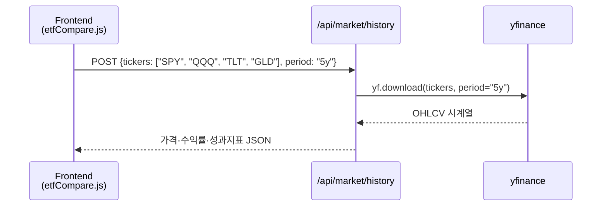
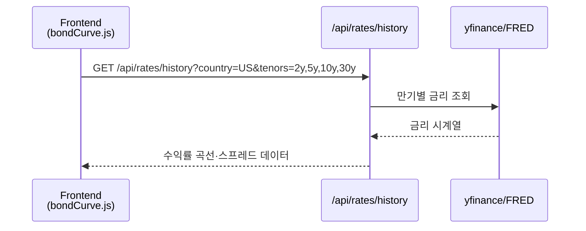

# 모듈 8 도입 — 금융상품의 구분 (자본시장법 기준)

> **모듈 8: 퀀트를 위한 금융 필수 지식** | 도입 | 🏦

> 이 모듈에서 배울 주식, ETF, 채권, 파생상품은 모두 자본시장법상 **금융투자상품**에 해당합니다.  
> 상품을 배우기 전에 법적 분류 체계를 먼저 확인하면, 각 상품의 규제·위험·운용 방식을 맥락 있게 이해할 수 있습니다.  
> 자세한 내용은 [42.md — 금융 규제·산업 구조 기초](42.md)를 참고하세요.
>
> 📝 **한자 병기 및 어원 사전**: 이 문서에 등장하는 용어의 한자·어원·일제강점기 유래는 → [voca.md](voca.md)

### 금융상품 분류 한눈에 보기

| 대분류 | 소분류 | 원본 손실 | 이 모듈 연관 |
|--------|--------|-----------|--------------|
| **금융투자상품** | 지분증권 (주식) | 가능 | Day 052 |
| **금융투자상품** | 수익증권 (ETF·펀드) | 가능 | Day 052 |
| **금융투자상품** | 채무증권 (국채·회사채) | 가능 | Day 053 |
| **금융투자상품** | 파생상품 (선물·옵션·스왑) | 가능 | Day 054 |
| **비금융투자상품** | 예금·보험 | 원본 보장 | 참고용 |

> 금융회사의 종류, 자본시장법, 위탁·수탁·신탁, 수신·여신의 개념 → [42.md](42.md) 참조

---

# Day 052 — 주식 및 ETF 상품 이해

> **모듈 8: 퀀트를 위한 금융 필수 지식** | 1/5일차 | 🏦 | 학습시간: 8시간

---

> 📺 **YouTube 강의**: [🎬 주식 ETF 상품 투자 이해](https://www.youtube.com/results?search_query=주식+ETF+상품+투자+한국어+설명+강의)

## 오늘 배울 것

> 📺 [🎬 오늘 배울 것](https://www.youtube.com/results?search_query=오늘+배울+것+한국어)

- 주식 시장 구조: 코스피, 코스닥, 나스닥
- 주식 기본 개념: EPS, 배당, 시가총액, 유동주식
- ETF(상장지수펀드)의 구조와 종류
- ETF 운용 전략: 패시브, 액티브, 팩터 ETF
- 실습: ETF 성과 비교 분석

---

## 🗓 세부 일정 (1일 8시간)

> 📺 [🎬 세부 일정](https://www.youtube.com/results?search_query=세부+일정+한국어)

> **강의 5시간** (5개 단락 × 50분 + 도입·마무리 50분) + **실습 3시간** = 총 8시간

| 시간 | 구분 | 내용 | 형태 |
|------|------|------|------|
| 09:00 – 09:10 | 도입 | 오늘 학습 목표 확인 | 강의 |
| 09:10 – 09:30 | **1단락** 설명 20분 | 주식 시장 구조 | 강의 |
| 09:30 – 10:00 | 각자 정리 & 유튜브 30분 | 코스피·코스닥·나스닥 비교 영상 검색 | 자율 |
| 10:00 – 10:20 | **2단락** 설명 20분 | EPS, 배당, 시가총액 | 강의 |
| 10:20 – 10:50 | 각자 정리 & 유튜브 30분 | 기업 재무지표 노트 정리 | 자율 |
| 10:50 – 11:00 | ☕ 휴식 | — | — |
| 11:00 – 11:20 | **3단락** 설명 20분 | ETF 구조와 종류 | 강의 |
| 11:20 – 11:50 | 각자 정리 & 유튜브 30분 | ETF 상품 설명서 읽기 | 자율 |
| 11:50 – 12:10 | **4단락** 설명 20분 | ETF 운용 전략 | 강의 |
| 12:10 – 12:40 | 각자 정리 & 유튜브 30분 | 패시브·액티브·팩터 ETF 사례 정리 | 자율 |
| 12:40 – 13:00 | **5단락** 설명 20분 | ETF 성과 비교 방법 | 강의 |
| 13:00 – 13:30 | 각자 정리 & 유튜브 30분 | 성과 지표 복습 | 자율 |
| 13:30 – 14:00 | 강의 마무리 | Q&A · 핵심 복습 | 강의 |
| 14:00 – 15:00 | 💻 **실습 1부** 60분 | ETF 가격 데이터 수집 및 수익률 계산 | 실습 |
| 15:00 – 15:10 | ☕ 휴식 | — | — |
| 15:10 – 16:00 | 💻 **실습 2부** 50분 | 누적수익률·변동성·MDD 비교 | 실습 |
| 16:00 – 16:10 | ☕ 휴식 | — | — |
| 16:10 – 17:00 | 💻 **실습 발표 & 리뷰** 50분 | ETF 비교 결과 발표 · 피드백 | 실습 |

> 강의 5시간: 도입 10분 + 단락 5개×50분 + 마무리 30분 = **300분**  
> 실습 3시간: 1부 60분 + 휴식 10분 + 2부 50분 + 휴식 10분 + 발표·리뷰 50분 = **180분**

---

## 🔗 참고 사이트 & 데이터 원천

> 📺 [🎬 참고 사이트 데이터 원천](https://www.youtube.com/results?search_query=참고+사이트+데이터+원천+한국어)

> 이 문서(주식·ETF 상품 이해)의 실습에 필요한 공식 데이터 출처와 참고 사이트입니다. ⚿ 는 API 키 또는 승인이 필요한 항목입니다.

### 📊 국내 공식 데이터

| 기관 | URL | API 키 | 제공 데이터 |
|------|-----|--------|-------------|
| KRX 정보데이터시스템 | <https://data.krx.co.kr> | 불필요(웹 조회) | 주식·ETF 가격, 거래량, 상장 정보 |
| KRX Data Marketplace | <https://openapi.krx.co.kr> | ⚿ 필요 | 주식·ETF 시계열, 지수, 증권상품 |
| 금융감독원 DART | <https://opendart.fss.or.kr> | ⚿ 필요 | 사업보고서, 재무제표, 배당 |
| 네이버 금융 | <https://finance.naver.com> | 불필요 | 국내 주식·ETF 가격 참고 |
| 한국거래소 ETF | <https://etf.krx.co.kr> | 불필요 | ETF 구성종목, 순자산, 수익률 |

### 🌍 해외 공식 데이터

| 기관 | URL | API 키 | 제공 데이터 |
|------|-----|--------|-------------|
| SEC EDGAR | <https://www.sec.gov/edgar> | 불필요 | 미국 상장기업 공시 |
| Nasdaq Data Link | <https://data.nasdaq.com> | ⚿ 권장 | 미국 주식·ETF·경제 데이터 |
| ETF.com | <https://www.etf.com> | 불필요 | ETF 분류, 운용보수, 구성 |
| iShares | <https://www.ishares.com> | 불필요 | iShares ETF 구성종목·팩트시트 |
| State Street SPDR | <https://www.ssga.com> | 불필요 | SPDR ETF 상품 정보 |
| Vanguard | <https://investor.vanguard.com> | 불필요 | Vanguard ETF 상품 정보 |

### 📈 차트 & 뉴스 참고

| 분류 | 사이트 | URL | 활용 용도 |
|------|--------|-----|-----------|
| 차트 플랫폼 | TradingView | <https://www.tradingview.com> | 주식·ETF 가격 차트 |
| 시장 데이터 | Yahoo Finance | <https://finance.yahoo.com> | ETF 가격, 배당, 간단한 성과 비교 |
| 국내 금융 포탈 | 네이버 금융 | <https://finance.naver.com> | 국내 ETF 조회 |
| 금융 미디어 | 한국경제 | <https://www.hankyung.com> | ETF·증시 뉴스 |
| 금융 미디어 | 이데일리 | <https://www.edaily.co.kr> | ETF·시장 기사 |

---

---

## 🧒 주식이란? — 초등학생도 이해하는 설명

> 📺 [🎬 주식이란 초등학생도 이해하는 설명](https://www.youtube.com/results?search_query=주식이란+초등학생도+이해하는+설명+한국어)

> **한 줄 요약**: 회사의 아주 작은 주인이 되는 것

### 피자 한 판 비유

삼성전자라는 회사가 피자 한 판이라고 상상해보세요.  
이 피자를 **1억 조각**으로 잘라서 사람들에게 나눠 판다고 합시다.  
그 조각 하나가 바로 **주식 1주**입니다.

```
삼성전자 (피자 한 판)
├── 주식 1주  ← 당신이 살 수 있는 아주 작은 조각
├── 주식 1주
├── 주식 1주  (× 약 60억 주)
└── ...
```

| 상황 | 무슨 일이 일어나나요? |
|------|----------------------|
| 회사가 돈을 많이 벌면 | 피자 조각(주식)이 더 비싸집니다 → 주가 상승 |
| 회사가 손해를 보면 | 피자 조각 값이 내려갑니다 → 주가 하락 |
| 이익을 나눠줄 때 | 가지고 있는 조각 수만큼 돈을 받습니다 → 배당 |

> 💡 주식을 산다 = 회사의 주인(주주)이 된다 = 회사가 잘 되면 같이 이익, 못 되면 같이 손해

---

### 1. 주식 시장 구조 (코스피, 코스닥, 나스닥)

> 📖 **Wikipedia**: [주식시장](https://ko.wikipedia.org/wiki/주식시장) · [코스피](https://ko.wikipedia.org/wiki/코스피) · [코스닥](https://ko.wikipedia.org/wiki/코스닥) · [나스닥](https://ko.wikipedia.org/wiki/나스닥)

**핵심 개념**

주식 시장은 기업이 자본을 조달하고 투자자가 기업의 소유권 일부를 사고파는 장소입니다. 퀀트 분석에서는 시장별 특성이 다르기 때문에, 같은 전략이라도 어느 시장에 적용하는지 먼저 구분해야 합니다.

| 시장 | 주요 특징 | 퀀트 분석 포인트 |
|------|-----------|------------------|
| 코스피 | 대형·우량 기업 중심 | 시가총액, 외국인 수급, 경기 민감도 |
| 코스닥 | 성장주·중소형주 중심 | 변동성, 거래대금, 테마 민감도 |
| 나스닥 | 기술주·성장주 비중 높음 | 금리 민감도, 성장률, 밸류에이션 |

> 📺 [🎬 코스피 코스닥 나스닥 차이](https://www.youtube.com/results?search_query=코스피+코스닥+나스닥+차이+한국어)

```python
markets = {
    "KOSPI": {"return": 0.08, "volatility": 0.18},
    "KOSDAQ": {"return": 0.12, "volatility": 0.30},
    "NASDAQ": {"return": 0.15, "volatility": 0.25},
}

for market, stats in markets.items():
    score = stats["return"] / stats["volatility"]
    print(f"{market}: 단순 위험대비수익 {score:.2f}")
```

---

### 2. 주식 기본 개념 (주당순이익, 배당 등)

> 📖 **Wikipedia**: [주당순이익](https://ko.wikipedia.org/wiki/주당순이익) · [배당](https://ko.wikipedia.org/wiki/배당) · [시가총액](https://ko.wikipedia.org/wiki/시가총액)

**핵심 개념**

주식 1주의 가치는 기업 전체 가치와 주식 수를 함께 보아야 해석할 수 있습니다.

| 지표 | 계산식 | 해석 |
|------|--------|------|
| EPS | 순이익 ÷ 발행주식수 | 1주가 벌어들인 이익 |
| PER | 주가 ÷ EPS | 이익 대비 주가 수준 |
| 배당수익률 | 주당배당금 ÷ 주가 | 현금 배당 매력 |
| 시가총액 | 주가 × 발행주식수 | 시장이 평가한 기업 전체 가치 |

> 📺 [🎬 EPS PER 배당수익률 설명](https://www.youtube.com/results?search_query=EPS+PER+배당수익률+주식+한국어)

```python
price = 50000
net_income = 1_200_000_000_000
shares = 100_000_000
dividend_per_share = 1500

eps = net_income / shares
per = price / eps
dividend_yield = dividend_per_share / price

print(f"EPS: {eps:,.0f}원")
print(f"PER: {per:.1f}배")
print(f"배당수익률: {dividend_yield:.2%}")
```

---

---

## 🧒 펀드란? — 초등학생도 이해하는 설명

> 📺 [🎬 펀드란 초등학생도 이해하는 설명](https://www.youtube.com/results?search_query=펀드란+초등학생도+이해하는+설명+한국어)

> **한 줄 요약**: 여럿이 돈을 모아 전문가에게 대신 투자하게 맡기는 것

### 학급 공동 간식 비유

반 친구 30명이 각자 1만 원씩 모아서 **반장(전문 펀드매니저)**에게 맡겼습니다.  
반장은 그 30만 원으로 여러 과자(주식, 채권 등)를 골라 사 두고,  
나중에 이익이 나면 낸 돈 비율대로 돌려줍니다.

```
투자자 A (1만원) ─┐
투자자 B (1만원) ─┤  → 펀드매니저 → 주식·채권·부동산 등에 분산 투자
투자자 C (1만원) ─┘
```

| 항목 | 설명 |
|------|------|
| 장점 | 혼자서는 사기 어려운 여러 자산을 한 번에 분산 투자 |
| 단점 | 운용 보수(수수료)가 있고, 원금 손실 가능성도 있음 |
| 전문가 | 펀드매니저가 대신 골라줌 — 하지만 성과는 보장 안 됨 |

> 💡 펀드는 **집합투자**라고도 부릅니다. 여러 사람의 돈을 모아(집합) 함께 투자(투자)한다는 뜻이에요.

### 펀드 클래스 — A, C, Ae, Ce 뒤에 붙는 알파벳의 뜻

> 📖 **Wikipedia**: [수익증권](https://ko.wikipedia.org/wiki/수익증권) | 근거 규정: 금융투자협회 펀드 클래스 분류 기준

펀드 이름 뒤에 붙는 알파벳은 **판매 채널**과 **수수료 부과 방식**을 나타냅니다.  
같은 펀드라도 클래스에 따라 투자자가 내는 비용이 다릅니다.

| 클래스 | 수수료 구조 | 특징 | 유리한 경우 |
|--------|-----------|------|-------------|
| **A** | 선취수수료 O + 연간 보수 낮음 | 가입 시 수수료를 미리 냄 | 장기 보유 (2년 이상) |
| **C** | 선취수수료 X + 연간 보수 높음 | 가입 시 수수료 없음, 대신 매년 보수 높음 | 단기 보유 (1년 미만) |
| **Ae** | A클래스 온라인 전용 | 판매사 직접 방문 없이 인터넷·앱으로만 가입, 수수료 할인 | 온라인 가입 + 장기 |
| **Ce** | C클래스 온라인 전용 | C클래스를 온라인에서 가입, 보수 일부 할인 | 온라인 가입 + 단기 |
| **S** | 펀드슈퍼마켓 전용 | 금융투자협회 펀드슈퍼마켓에서만 판매, 낮은 보수 | 비용 절약 + 다양한 펀드 비교 |
| **I** | 기관투자자 전용 | 대규모 투자(수억원 이상), 매우 낮은 보수 | 기관·법인 투자자 |
| **P** (또는 **P2**) | 연금저축 전용 | 연금저축계좌에서만 매수 가능, 세제혜택 연계 | 노후 대비 연금저축 |
| **W** | 랩(Wrap) 전용 | 증권사 랩어카운트에서 자동 편입 | 자산관리 서비스 이용 고객 |

**비용 계산 예시** — 1,000만원을 2년간 투자했을 때

```python
investment = 10_000_000  # 1,000만원

# A클래스: 선취수수료 1% + 연간 보수 0.8%
class_A_cost = investment * 0.01 + investment * 0.008 * 2
# C클래스: 선취수수료 0% + 연간 보수 1.5%
class_C_cost = investment * 0.00 + investment * 0.015 * 2
# Ae클래스: 선취수수료 0.5% + 연간 보수 0.6%
class_Ae_cost = investment * 0.005 + investment * 0.006 * 2

print(f"A클래스  총비용: {class_A_cost:,.0f}원")   # 선취+보수
print(f"C클래스  총비용: {class_C_cost:,.0f}원")   # 보수만
print(f"Ae클래스 총비용: {class_Ae_cost:,.0f}원")  # 온라인 할인
```

> 💡 **클래스 선택 기준**: 2년 이상 장기라면 A(Ae), 1년 미만 단기라면 C(Ce)가 일반적으로 유리합니다.  
> 동일한 펀드라도 클래스별 ISIN 코드가 다르므로, 가입 전 클래스명과 보수를 반드시 확인하세요.

---

## 🧒 ETF란? — 초등학생도 이해하는 설명

> 📺 [🎬 ETF란 초등학생도 이해하는 설명](https://www.youtube.com/results?search_query=ETF란+초등학생도+이해하는+설명+한국어)

> **한 줄 요약**: 주식처럼 실시간으로 사고팔 수 있는 펀드

### 과일 바구니 비유

사과(삼성), 바나나(SK하이닉스), 딸기(현대차) … 를  
**하나하나 사는 대신**, 과일 바구니 자체를 통째로 사는 것이 ETF입니다.

```
KODEX 200 ETF 한 주를 사면
  → 코스피 상위 200개 회사를 아주 조금씩 전부 소유하게 됩니다.
```

| 비교 | 일반 펀드 | ETF |
|------|-----------|-----|
| 어디서 사나요? | 은행·증권사 창구 / 앱 가입 | 주식처럼 거래소에서 실시간 매매 |
| 가격 확인 | 하루 한 번 (장 마감 후) | 실시간 (장이 열린 동안 계속 변함) |
| 수수료 | 상대적으로 높음 | 상대적으로 낮음 |
| 대표 예시 | 국내 주식형 펀드 | KODEX 200, TIGER 미국S&P500 |

> 💡 ETF = **E**xchange(거래소) **T**raded(거래되는) **F**und(펀드)  
> "거래소에서 거래할 수 있는 펀드"를 짧게 줄인 이름입니다.

---

### 3. ETF(상장지수펀드) 개요 및 종류

> 📖 **Wikipedia**: [상장지수 펀드](https://ko.wikipedia.org/wiki/상장지수_펀드) · [인덱스 펀드](https://ko.wikipedia.org/wiki/인덱스_펀드) · [순자산가치](https://ko.wikipedia.org/wiki/순자산가치)

**ETF란 무엇인가**

ETF는 펀드처럼 여러 자산을 담고 있지만 주식처럼 거래소에서 실시간 매매할 수 있는 상품입니다. 퀀트 실습에서는 개별 종목보다 데이터가 안정적이고, 섹터·국가·팩터를 쉽게 비교할 수 있어 자주 사용합니다.

> 📺 [🎬 ETF란 무엇인가](https://www.youtube.com/results?search_query=ETF란+무엇인가+상장지수펀드+한국어)

#### 3-1. NAV(순자산가치)와 괴리율

ETF를 이해하려면 **NAV**를 먼저 알아야 합니다.

| 개념 | 정의 | 계산식 |
|------|------|--------|
| **NAV** (Net Asset Value, 순자산가치) | ETF가 보유한 자산에서 부채를 뺀 실제 가치를 주식 수로 나눈 것 | `NAV = (총자산 - 부채) ÷ 발행주식수` |
| **iNAV** (Intraday NAV) | 장중 실시간으로 추정한 NAV. ETF 호가창 옆에 표시됨 | 기초자산 실시간 가격 반영 |
| **괴리율** | ETF 시장가격이 NAV에서 얼마나 벗어났는지 | `(시장가격 - NAV) ÷ NAV × 100` |
| **추적오차** (Tracking Error) | ETF 수익률과 추종 지수 수익률의 차이 | `std(ETF 수익률 - 지수 수익률)` |

```python
# NAV·괴리율·추적오차 계산 예시
total_assets = 10_050_000_000  # 100.5억원 (편입 자산 시가)
liabilities   = 50_000_000     # 5,000만원 (운용 비용 등)
shares_out    = 1_000_000      # 발행 주식 수

nav = (total_assets - liabilities) / shares_out  # 주당 NAV
market_price = 10_100           # 현재 시장가격

gap = (market_price - nav) / nav * 100
print(f"NAV: {nav:,.0f}원")
print(f"시장가: {market_price:,}원")
print(f"괴리율: {gap:+.2f}%")   # 양수=프리미엄, 음수=디스카운트
```

> 💡 괴리율이 크면 NAV보다 비싸게(또는 싸게) 사게 됩니다. **±1% 이내**의 괴리율이 정상 범위입니다.  
> 유동성이 낮은 ETF(거래량 적음)는 괴리율이 커질 수 있어 주의가 필요합니다.

#### 3-2. ETF 종류 — 5가지 기준으로 분류

**① 추종 자산 유형별**

| 분류 | 대표 국내 ETF | 대표 해외 ETF | 특징 |
|------|--------------|--------------|------|
| 주식형 — 시장지수 | KODEX 200, TIGER 코스닥150 | SPY(S&P500), QQQ(나스닥100) | 시장 전체 베타 노출 |
| 주식형 — 섹터 | KODEX 반도체, TIGER 2차전지 | XLK(기술), XLV(헬스케어) | 특정 산업 집중 투자 |
| 주식형 — 테마 | TIGER 글로벌AI&로보틱스 | ARKK(혁신기업), BOTZ(로봇) | 메가트렌드 집중 |
| 채권형 | KODEX 국고채10년, TIGER 단기채권 | TLT(장기국채), AGG(종합채권) | 금리 민감도 관리 |
| 원자재형 | KODEX 골드선물(H), TIGER 원유선물 | GLD(금), SLV(은), USO(원유) | 인플레이션 헤지 |
| 통화형 | KODEX 달러선물 | UUP(달러인덱스) | 환율 방향성 베팅 |
| 부동산형(리츠) | TIGER 부동산인프라고배당 | VNQ(미국리츠), REET(글로벌리츠) | 임대수익+시세차익 |
| 멀티에셋 | TIGER 올웨더 | AOM, AOR | 자산배분 원스톱 |

**② 운용 방식별**

| 방식 | 설명 | 비용(TER) | 예시 |
|------|------|----------|------|
| 패시브 (지수 추종) | 특정 지수를 그대로 복제 | 낮음 (0.05~0.3%) | KODEX 200, SPY |
| 액티브 | 펀드매니저가 지수 초과수익 추구 | 높음 (0.5~1.0%) | TIGER 액티브배당 |
| 스마트베타/팩터 | 가치·모멘텀 등 특정 요인 집중 | 중간 (0.2~0.5%) | VLUE(가치), MTUM(모멘텀) |

**③ 레버리지·인버스 여부**

| 유형 | 일일 수익률 | 장기 보유 시 | 용도 |
|------|-----------|------------|------|
| 일반 (1×) | 지수와 동일 | 적합 | 장기 적립 |
| 레버리지 (2×) | 지수의 2배 | 복리 손실 위험 | 단기 방향성 거래 |
| 인버스 (−1×) | 지수의 반대 | 장기 보유 비권고 | 하락장 헤지 |
| 곱버스 (−2×) | 지수의 −2배 | 매우 위험 | 단기 매매만 |

> ⚠️ 레버리지·인버스 ETF는 **일일 수익률** 기준으로 운용됩니다. 횡보장이 지속되면 복리 손실로 원금이 줄어드는 **변동성 끌림(Volatility Drag)** 현상이 발생합니다.

**④ 실물 복제 vs 합성 복제**

| 방식 | 방법 | 장점 | 단점 |
|------|------|------|------|
| 실물 복제 | 기초자산(주식 등)을 직접 보유 | 투명성 높음, 상대방 위험 없음 | 일부 자산은 직접 보유 어려움 |
| 합성 복제 | 스왑 계약으로 지수 수익률 교환 | 접근 어려운 자산도 추종 가능 | 스왑 상대방 부도 위험 존재 |

**⑤ 환헤지(H) 여부**

| 구분 | 의미 | 예시 |
|------|------|------|
| 환헤지 `(H)` | 원/달러 환율 변동 위험을 제거 | TIGER 미국S&P500**TR(H)** |
| 환노출 (없음) | 환율 변동이 수익률에 그대로 반영 | TIGER 미국S&P500 |

> 💡 달러 강세 국면에서는 환노출이 유리하고, 달러 약세 국면에서는 환헤지가 유리합니다.  
> 어느 쪽이 맞는지 알 수 없으므로 **두 ETF를 반반 섞는** 방법도 있습니다.

```python
# 환헤지 여부에 따른 수익률 차이 시뮬레이션
import numpy as np

np.random.seed(42)
usd_index_return  = 0.10   # S&P500 달러 기준 10% 상승
krw_usd_change    = 0.05   # 원/달러 5% 상승 (원화 약세 = 달러 강세)

hedged_return   = usd_index_return                          # 환헤지: 환율 영향 제거
unhedged_return = (1 + usd_index_return) * (1 + krw_usd_change) - 1  # 환노출: 환율 반영

print(f"환헤지  수익률: {hedged_return:.1%}")    # 10.0%
print(f"환노출  수익률: {unhedged_return:.1%}")  # 15.5% (달러 강세 덕분)
```

---

### 4. ETF 운용 전략 (패시브, 액티브, 팩터 ETF)

> 📖 **Wikipedia**: [패시브 운용](https://ko.wikipedia.org/wiki/인덱스_펀드) · [액티브 운용](https://ko.wikipedia.org/wiki/투자신탁)

**전략별 차이**

| 전략 | 목표 | 장점 | 주의점 |
|------|------|------|--------|
| 패시브 ETF | 지수 추종 | 낮은 비용, 높은 투명성 | 시장 하락을 그대로 반영 |
| 액티브 ETF | 지수 초과수익 추구 | 운용자 판단 반영 | 높은 보수, 운용 성과 불확실 |
| 팩터 ETF | 특정 요인 노출 | 가치·모멘텀 등 규칙 기반 | 팩터 부진 구간 존재 |
| 레버리지/인버스 | 단기 방향성 거래 | 큰 수익 가능 | 장기 보유 시 복리 손실 위험 |

> 📺 [🎬 패시브 액티브 팩터 ETF 차이](https://www.youtube.com/results?search_query=패시브+액티브+팩터+ETF+차이+한국어)

---

### 5. 실습: ETF 성과 비교 분석

이번 실습의 목표는 ETF 가격 데이터를 수집해 **수익률, 누적수익률, 변동성, MDD**를 비교하는 것입니다.

```python
import yfinance as yf
import pandas as pd

tickers = ["SPY", "QQQ", "TLT", "GLD"]
prices = yf.download(tickers, start="2020-01-01", auto_adjust=True)["Close"]
returns = prices.pct_change().dropna()

cumulative = (1 + returns).cumprod()
total_return = cumulative.iloc[-1] - 1
volatility = returns.std() * (252 ** 0.5)
drawdown = cumulative / cumulative.cummax() - 1
mdd = drawdown.min()

summary = pd.DataFrame({
    "total_return": total_return,
    "volatility": volatility,
    "mdd": mdd,
}).sort_values("total_return", ascending=False)

print(summary.round(4))
```

#### 🔗 Python 소스 연계

웹앱에서는 ETF 티커를 `/api/macro/realtime` 또는 별도 시장 데이터 API에 전달해 같은 성과 비교 화면을 만들 수 있습니다.



---

## 해보기 활동

> 📺 [🎬 해보기 활동](https://www.youtube.com/results?search_query=해보기+활동+한국어)

1. 국내 ETF 3개와 해외 ETF 3개를 골라 운용보수, 거래대금, 추종지수를 비교해보세요.
2. `SPY`, `QQQ`, `TLT`, `GLD`의 누적수익률과 MDD를 계산해 어떤 자산이 방어 역할을 했는지 확인해보세요.
3. 레버리지 ETF와 일반 ETF의 1년 성과를 비교하고, 변동성이 커질 때 차이가 어떻게 벌어지는지 설명해보세요.

## 다음 시간 미리보기

> 📺 [🎬 다음 시간 미리보기](https://www.youtube.com/results?search_query=다음+시간+미리보기+한국어)

➡️ [Day 053](37.md#day-053--채권-상품-이해) 에서 계속됩니다 — 채권 상품 이해

---

# Day 053 — 채권 상품 이해

> **모듈 8: 퀀트를 위한 금융 필수 지식** | 2/5일차 | 🏦 | 학습시간: 8시간

---

> 📺 **YouTube 강의**: [🎬 채권 투자 국채 회사채](https://www.youtube.com/results?search_query=채권+투자+국채+회사채+한국어+설명)

## 오늘 배울 것

> 📺 [🎬 오늘 배울 것](https://www.youtube.com/results?search_query=오늘+배울+것+한국어)

- 채권(Bond)의 기본 구조: 발행자, 만기, 쿠폰
- 채권 가격과 금리의 역관계
- 듀레이션(Duration)과 볼록성(Convexity)
- 채권 종류: 국채, 회사채, 하이일드채
- 실습: 채권 수익률 곡선(Yield Curve) 분석

---

## 🗓 세부 일정 (1일 8시간)

> 📺 [🎬 세부 일정](https://www.youtube.com/results?search_query=세부+일정+한국어)

> **강의 5시간** (5개 단락 × 50분 + 도입·마무리 50분) + **실습 3시간** = 총 8시간

| 시간 | 구분 | 내용 | 형태 |
|------|------|------|------|
| 09:00 – 09:10 | 도입 | 오늘 학습 목표 확인 | 강의 |
| 09:10 – 09:30 | **1단락** 설명 20분 | 채권의 발행자·만기·쿠폰 | 강의 |
| 09:30 – 10:00 | 각자 정리 & 유튜브 30분 | 국채·회사채 기초 영상 검색 | 자율 |
| 10:00 – 10:20 | **2단락** 설명 20분 | 채권 가격과 금리의 역관계 | 강의 |
| 10:20 – 10:50 | 각자 정리 & 유튜브 30분 | 금리 변화별 채권 가격 예제 정리 | 자율 |
| 10:50 – 11:00 | ☕ 휴식 | — | — |
| 11:00 – 11:20 | **3단락** 설명 20분 | 듀레이션과 볼록성 | 강의 |
| 11:20 – 11:50 | 각자 정리 & 유튜브 30분 | 듀레이션 계산식 복습 | 자율 |
| 11:50 – 12:10 | **4단락** 설명 20분 | 채권 종류와 신용위험 | 강의 |
| 12:10 – 12:40 | 각자 정리 & 유튜브 30분 | 국채·회사채·하이일드 비교 | 자율 |
| 12:40 – 13:00 | **5단락** 설명 20분 | 수익률 곡선 분석 | 강의 |
| 13:00 – 13:30 | 각자 정리 & 유튜브 30분 | 장단기금리차 사례 정리 | 자율 |
| 13:30 – 14:00 | 강의 마무리 | Q&A · 핵심 복습 | 강의 |
| 14:00 – 15:00 | 💻 **실습 1부** 60분 | 만기별 국채금리 데이터 수집 | 실습 |
| 15:00 – 15:10 | ☕ 휴식 | — | — |
| 15:10 – 16:00 | 💻 **실습 2부** 50분 | 수익률 곡선과 스프레드 시각화 | 실습 |
| 16:00 – 16:10 | ☕ 휴식 | — | — |
| 16:10 – 17:00 | 💻 **실습 발표 & 리뷰** 50분 | 경기 신호 해석 발표 | 실습 |

> 강의 5시간: 도입 10분 + 단락 5개×50분 + 마무리 30분 = **300분**  
> 실습 3시간: 1부 60분 + 휴식 10분 + 2부 50분 + 휴식 10분 + 발표·리뷰 50분 = **180분**

---

## 🔗 참고 사이트 & 데이터 원천

> 📺 [🎬 참고 사이트 데이터 원천](https://www.youtube.com/results?search_query=참고+사이트+데이터+원천+한국어)

> 이 문서(채권 상품 이해)의 실습에 필요한 공식 데이터 출처와 참고 사이트입니다. ⚿ 는 API 키 또는 승인이 필요한 항목입니다.

| 기관 | URL | API 키 | 제공 데이터 |
|------|-----|--------|-------------|
| 한국은행 ECOS | <https://ecos.bok.or.kr> | ⚿ 필요 | 기준금리, 국고채, 회사채, CD금리 |
| 금융투자협회 채권정보센터 | <https://www.kofiabond.or.kr> | 불필요(웹 조회) | 채권 수익률, 발행·거래 정보 |
| KOFIA OpenAPI | <https://openapi.kofia.or.kr> | ⚿ 승인 필요 | 채권 시장금리 |
| FRED | <https://fred.stlouisfed.org> | ⚿ 권장 | 미국 국채 2년·10년·30년, 스프레드 |
| U.S. Treasury | <https://home.treasury.gov> | 불필요 | 미국 국채 수익률 |
| FINRA Market Data | <https://www.finra.org/finra-data> | 불필요(일부 제한) | 미국 회사채 거래 정보 |

---

---

## 🧒 채권이란? — 초등학생도 이해하는 설명

> 📺 [🎬 채권이란 초등학생도 이해하는 설명](https://www.youtube.com/results?search_query=채권이란+초등학생도+이해하는+설명+한국어)

> **한 줄 요약**: 나라나 회사에게 돈을 빌려주고 받는 약속 쪽지

### 약속 쪽지 비유

친구가 "나한테 1만 원 빌려줘. 1년 뒤에 이자 500원 더 얹어서 1만 500원 갚을게."  
라고 쓴 **쪽지를 건네주었다면**, 그 쪽지가 바로 채권입니다.

```
채권 한 장의 구조
┌─────────────────────────────────────────┐
│  발행자: 대한민국 정부                   │  ← 돈을 빌리는 쪽
│  금액: 10,000원 (액면가)                │
│  이자: 매년 3% = 300원 (쿠폰)          │  ← 정기적으로 받는 이자
│  기간: 3년 후 원금 상환 (만기)          │  ← 돌려받는 날짜
└─────────────────────────────────────────┘
```

| 비교 | 주식 | 채권 |
|------|------|------|
| 관계 | 회사의 주인(주주) | 회사·나라에 돈을 빌려준 채권자 |
| 돌려받는 금액 | 모름 (주가에 따라 다름) | 미리 정해짐 (원금 + 이자) |
| 위험도 | 상대적으로 높음 | 상대적으로 낮음 |
| 이익 방법 | 주가 상승 + 배당 | 이자 수익 + 시세 차익 |

> 💡 돈이 급할 때 채권을 팔 수도 있어요. 단, 파는 시점의 금리에 따라 살 때보다 비쌀 수도, 쌀 수도 있습니다.

### 주식·채권·펀드·ETF 한눈에 비교

| 상품 | 비유 | 원금 손실? | 주인 vs 채권자 | 사는 곳 |
|------|------|-----------|----------------|---------|
| 주식 | 피자 한 조각 | 가능 | 회사의 주인 | 거래소 (실시간) |
| 채권 | 약속 쪽지 | 작음 (부도 아니면 보통 안전) | 돈 빌려준 채권자 | 거래소·장외 |
| 펀드 | 학급 공동 간식 | 가능 | 간접 투자자 | 은행·증권사 창구 |
| ETF | 과일 바구니 | 가능 | 간접 투자자 | 거래소 (실시간) |

---

### 1. 채권(Bond) 개요 (발행자, 만기, 쿠폰)

> 📖 **Wikipedia**: [채권](https://ko.wikipedia.org/wiki/채권_(금융)) · [국채](https://ko.wikipedia.org/wiki/국채)

채권은 돈을 빌린 발행자가 정해진 이자를 지급하고 만기에 원금을 상환하겠다고 약속한 증권입니다.

| 요소 | 의미 |
|------|------|
| 발행자 | 정부, 공기업, 금융회사, 일반기업 |
| 만기 | 원금을 돌려받는 시점 |
| 쿠폰 | 정기적으로 지급되는 이자 |
| 액면가 | 만기 상환 기준 금액 |
| 신용등급 | 발행자의 상환 능력 평가 |

> 📺 [🎬 채권 발행자 만기 쿠폰 설명](https://www.youtube.com/results?search_query=채권+발행자+만기+쿠폰+설명+한국어)

---

### 2. 채권 가격과 금리의 역관계

> 📖 **Wikipedia**: [채권 가격](https://ko.wikipedia.org/wiki/채권_(금융)) · [이자율](https://ko.wikipedia.org/wiki/이자율)

시장금리가 오르면 기존 채권의 고정 쿠폰 매력이 낮아져 가격이 하락합니다. 반대로 시장금리가 내려가면 기존 채권 가격은 상승합니다.

```python
def bond_price(face_value, coupon_rate, market_rate, years):
    coupon = face_value * coupon_rate
    coupons = sum(coupon / (1 + market_rate) ** t for t in range(1, years + 1))
    principal = face_value / (1 + market_rate) ** years
    return coupons + principal

for rate in [0.03, 0.04, 0.05]:
    price = bond_price(1000, 0.04, rate, 5)
    print(f"시장금리 {rate:.0%}: 채권가격 {price:.2f}")
```

---

### 3. 듀레이션(Duration)과 볼록성(Convexity)

> 📖 **Wikipedia**: [듀레이션](https://ko.wikipedia.org/wiki/듀레이션_(금융))

듀레이션은 금리 변화에 대한 채권 가격 민감도입니다. 듀레이션이 길수록 금리가 조금만 움직여도 가격 변동이 커집니다.

| 개념 | 의미 | 투자 해석 |
|------|------|-----------|
| 맥컬리 듀레이션 | 현금흐름 회수기간의 가중평균 | 자금 회수 기간 |
| 수정 듀레이션 | 금리 1%p 변화 시 가격 변화율 | 금리 민감도 |
| 볼록성 | 금리 변화와 가격 변화의 곡률 | 큰 금리 변화 보정 |

> 📺 [🎬 듀레이션 볼록성 채권](https://www.youtube.com/results?search_query=듀레이션+볼록성+채권+한국어)

---

### 4. 채권 종류 (국채, 회사채, 하이일드채)

> 📖 **Wikipedia**: [회사채](https://ko.wikipedia.org/wiki/회사채) · [하이일드 채권](https://ko.wikipedia.org/wiki/고수익채권)

| 종류 | 위험 | 수익률 | 특징 |
|------|------|--------|------|
| 국채 | 낮음 | 낮음 | 정부 발행, 기준금리와 경기 전망 반영 |
| 지방채·공사채 | 낮음~중간 | 낮음~중간 | 공공기관·지자체 발행 |
| 투자등급 회사채 | 중간 | 중간 | 기업 신용위험 반영 |
| 하이일드채 | 높음 | 높음 | 경기 둔화기에 스프레드 확대 가능 |

---

### 5. 실습: 채권 수익률 곡선(Yield Curve) 분석

수익률 곡선은 만기별 금리를 연결한 선입니다. 보통 장기금리가 단기금리보다 높지만, 경기침체 우려가 커지면 장단기금리차가 축소되거나 역전될 수 있습니다.

```python
import yfinance as yf
import pandas as pd

tickers = {"2Y": "^IRX", "5Y": "^FVX", "10Y": "^TNX", "30Y": "^TYX"}
data = yf.download(list(tickers.values()), period="1y", auto_adjust=True)["Close"]
data = data.rename(columns={v: k for k, v in tickers.items()})

latest_curve = data.dropna().iloc[-1]
spread_10y_2y = latest_curve["10Y"] - latest_curve["2Y"]

print(latest_curve)
print(f"10Y-2Y 스프레드: {spread_10y_2y:.2f}%p")
```

#### 🔗 Python 소스 연계



---

## 해보기 활동

> 📺 [🎬 해보기 활동](https://www.youtube.com/results?search_query=해보기+활동+한국어)

1. 미국 2년물과 10년물 금리 차이를 계산하고 최근 1년 동안 역전 구간이 있었는지 확인해보세요.
2. 같은 쿠폰의 3년 만기 채권과 10년 만기 채권 중 금리 변화에 더 민감한 채권을 코드로 비교해보세요.
3. 국채 ETF(`IEF`, `TLT`)와 주식 ETF(`SPY`)의 하락 구간을 비교해 채권의 방어 효과를 점검해보세요.

## 다음 시간 미리보기

> 📺 [🎬 다음 시간 미리보기](https://www.youtube.com/results?search_query=다음+시간+미리보기+한국어)

➡️ [Day 054](38.md) 에서 계속됩니다 — 파생상품 이해
