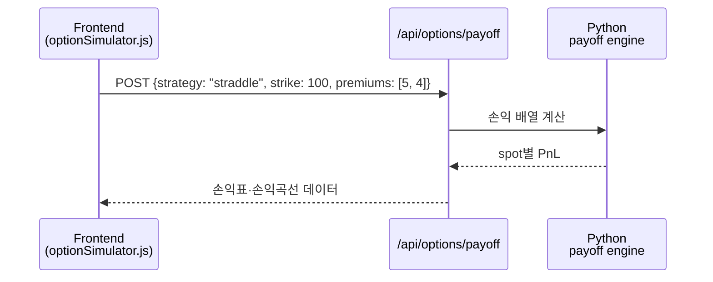

# Day 054 — 파생상품 이해

> **모듈 8: 퀀트를 위한 금융 필수 지식** | 3/5일차 | 🏦 | 학습시간: 8시간

---

> 📺 **YouTube 강의**: [🎬 파생상품 선물 옵션 이해](https://www.youtube.com/results?search_query=파생상품+선물+옵션+한국어+설명+강의)
>
> 📝 **한자 병기 및 어원 사전**: 이 문서에 등장하는 용어의 한자·어원·일제강점기 유래는 → [hanja.md](hanja.md)

## 오늘 배울 것

- 선물(Futures) 개요 및 헤징 전략
- 옵션(Option): 콜옵션, 풋옵션, 프리미엄
- 옵션 손익 구조 분석
- 스왑(Swap) 개요
- 실습: 옵션 손익 시뮬레이션 구현

---

## 🗓 세부 일정 (1일 8시간)

> **강의 5시간** (5개 단락 × 50분 + 도입·마무리 50분) + **실습 3시간** = 총 8시간

| 시간 | 구분 | 내용 | 형태 |
|------|------|------|------|
| 09:00 – 09:10 | 도입 | 오늘 학습 목표 확인 | 강의 |
| 09:10 – 09:30 | **1단락** 설명 20분 | 선물의 구조와 헤징 | 강의 |
| 09:30 – 10:00 | 각자 정리 & 유튜브 30분 | 선물거래 기초 영상 검색 | 자율 |
| 10:00 – 10:20 | **2단락** 설명 20분 | 콜옵션·풋옵션·프리미엄 | 강의 |
| 10:20 – 10:50 | 각자 정리 & 유튜브 30분 | 옵션 용어 정리 | 자율 |
| 10:50 – 11:00 | ☕ 휴식 | — | — |
| 11:00 – 11:20 | **3단락** 설명 20분 | 옵션 손익 구조 | 강의 |
| 11:20 – 11:50 | 각자 정리 & 유튜브 30분 | 만기 손익표 작성 | 자율 |
| 11:50 – 12:10 | **4단락** 설명 20분 | 스왑의 개념과 활용 | 강의 |
| 12:10 – 12:40 | 각자 정리 & 유튜브 30분 | 금리스왑·통화스왑 사례 검색 | 자율 |
| 12:40 – 13:00 | **5단락** 설명 20분 | 옵션 시뮬레이션 설계 | 강의 |
| 13:00 – 13:30 | 각자 정리 & 유튜브 30분 | Python 손익함수 설계 | 자율 |
| 13:30 – 14:00 | 강의 마무리 | Q&A · 핵심 복습 | 강의 |
| 14:00 – 15:00 | 💻 **실습 1부** 60분 | 콜·풋 옵션 만기 손익 계산 | 실습 |
| 15:00 – 15:10 | ☕ 휴식 | — | — |
| 15:10 – 16:00 | 💻 **실습 2부** 50분 | 손익곡선 시각화와 민감도 비교 | 실습 |
| 16:00 – 16:10 | ☕ 휴식 | — | — |
| 16:10 – 17:00 | 💻 **실습 발표 & 리뷰** 50분 | 전략별 손익 구조 발표 | 실습 |

> 강의 5시간: 도입 10분 + 단락 5개×50분 + 마무리 30분 = **300분**  
> 실습 3시간: 1부 60분 + 휴식 10분 + 2부 50분 + 휴식 10분 + 발표·리뷰 50분 = **180분**

---

## 🔗 참고 사이트 & 데이터 원천

> 이 문서(파생상품 이해)의 실습에 필요한 공식 데이터 출처와 참고 사이트입니다. ⚿ 는 API 키 또는 승인이 필요한 항목입니다.

### 📊 국내 공식 데이터

| 기관 | URL | API 키 | 제공 데이터 |
|------|-----|--------|-------------|
| KRX 정보데이터시스템 | <https://data.krx.co.kr> | 불필요(웹 조회) | 선물·옵션 가격, 거래량, 미결제약정 |
| KRX Data Marketplace | <https://openapi.krx.co.kr> | ⚿ 필요 | 파생상품 시계열 Open API |
| 금융투자협회 | <https://www.kofia.or.kr> | 불필요(일부) | 장외파생·채권·시장 통계 |
| 한국은행 ECOS | <https://ecos.bok.or.kr> | ⚿ 필요 | 금리스왑 관련 금리 지표 |

### 🌍 해외 공식 데이터

| 기관 | URL | API 키 | 제공 데이터 |
|------|-----|--------|-------------|
| CME Group | <https://www.cmegroup.com> | 불필요(웹 조회) | 선물·옵션 상품 명세, 가격 |
| CBOE | <https://www.cboe.com> | 불필요 | 옵션 지수, VIX 관련 데이터 |
| OCC | <https://www.theocc.com> | 불필요 | 미국 옵션 청산·교육 자료 |
| FRED | <https://fred.stlouisfed.org> | ⚿ 권장 | 금리·변동성 보조 지표 |
| Yahoo Finance | <https://finance.yahoo.com> | 불필요 | 옵션 체인 참고, 기초자산 가격 |

---

### 1. 선물(Futures) 개요 및 헤징 전략

> 📖 **Wikipedia**: [선물계약](https://ko.wikipedia.org/wiki/선물계약) · [헤지](https://ko.wikipedia.org/wiki/헤지)

선물은 미래의 특정 시점에 정해진 가격으로 기초자산을 사고팔기로 약속하는 계약입니다. 투자자는 방향성 매매뿐 아니라 보유 자산의 가격 변동 위험을 줄이는 헤징에도 선물을 사용합니다.

| 구분 | 롱 포지션 | 숏 포지션 |
|------|-----------|-----------|
| 기대 방향 | 가격 상승 | 가격 하락 |
| 손익 | 가격이 오르면 이익 | 가격이 내리면 이익 |
| 활용 | 원자재 매입 예정자, 지수 상승 베팅 | 보유 주식 헤지, 생산자 가격 고정 |

> 📺 [🎬 선물거래 헤징 설명](https://www.youtube.com/results?search_query=선물거래+헤징+설명+한국어)

```python
def futures_pnl(entry_price, final_price, contract_size, position="long"):
    direction = 1 if position == "long" else -1
    return direction * (final_price - entry_price) * contract_size

print(futures_pnl(100, 108, 50, "long"))
print(futures_pnl(100, 108, 50, "short"))
```

---

### 2. 옵션(Option): 콜옵션, 풋옵션, 프리미엄

> 📖 **Wikipedia**: [옵션](https://ko.wikipedia.org/wiki/옵션_(금융)) · [콜 옵션](https://ko.wikipedia.org/wiki/콜_옵션) · [풋 옵션](https://ko.wikipedia.org/wiki/풋_옵션)

옵션은 특정 가격에 기초자산을 살 권리 또는 팔 권리입니다. 권리이기 때문에 매수자는 프리미엄을 지불하고, 매도자는 프리미엄을 받는 대신 의무를 집니다.

| 옵션 | 권리 | 이익이 커지는 방향 | 최대 손실(매수자) |
|------|------|-------------------|------------------|
| 콜옵션 | 살 권리 | 기초자산 상승 | 지불한 프리미엄 |
| 풋옵션 | 팔 권리 | 기초자산 하락 | 지불한 프리미엄 |

> 📺 [🎬 콜옵션 풋옵션 프리미엄](https://www.youtube.com/results?search_query=콜옵션+풋옵션+프리미엄+한국어)

---

### 3. 옵션 손익 구조 분석

옵션의 만기 손익은 행사가격, 만기 기초자산 가격, 프리미엄으로 계산합니다.

```python
import numpy as np
import pandas as pd

def call_payoff(spot, strike, premium):
    return np.maximum(spot - strike, 0) - premium

def put_payoff(spot, strike, premium):
    return np.maximum(strike - spot, 0) - premium

spots = np.arange(70, 131, 10)
df = pd.DataFrame({
    "spot": spots,
    "call_pnl": call_payoff(spots, strike=100, premium=5),
    "put_pnl": put_payoff(spots, strike=100, premium=4),
})

print(df)
```

**손익 구조 요약**

| 전략 | 시장 전망 | 손익 특징 |
|------|-----------|-----------|
| 콜 매수 | 상승 | 손실 제한, 이익 무제한 |
| 풋 매수 | 하락 | 손실 제한, 하락 방어 |
| 콜 매도 | 횡보·하락 | 프리미엄 수취, 상승 위험 큼 |
| 풋 매도 | 횡보·상승 | 프리미엄 수취, 하락 위험 큼 |

---

### 4. 스왑(Swap) 개요

> 📖 **Wikipedia**: [스왑](https://ko.wikipedia.org/wiki/스왑_(금융)) · [금리 스왑](https://ko.wikipedia.org/wiki/금리_스왑)

스왑은 두 당사자가 미래 현금흐름을 서로 교환하는 계약입니다. 대표적으로 고정금리와 변동금리를 바꾸는 금리스왑, 서로 다른 통화의 원리금을 교환하는 통화스왑이 있습니다.

| 종류 | 교환 대상 | 활용 예시 |
|------|-----------|-----------|
| 금리스왑 | 고정금리 ↔ 변동금리 | 금리 상승·하락 위험 관리 |
| 통화스왑 | 서로 다른 통화의 원리금 | 외화 조달·환위험 관리 |
| 총수익스왑 | 자산 수익률 ↔ 약정 금리 | 레버리지·익스포저 이전 |

> 📺 [🎬 금리스왑 통화스왑 이해](https://www.youtube.com/results?search_query=금리스왑+통화스왑+이해+한국어)

---

### 5. 실습: 옵션 손익 시뮬레이션 Python 구현

이번 실습은 옵션 전략을 함수화하고, 만기 기초자산 가격 범위별 손익표와 손익곡선을 만드는 것입니다.

```python
import numpy as np
import matplotlib.pyplot as plt

spots = np.linspace(50, 150, 101)
strike = 100
call_premium = 5
put_premium = 4

long_call = np.maximum(spots - strike, 0) - call_premium
long_put = np.maximum(strike - spots, 0) - put_premium
straddle = long_call + long_put

plt.figure(figsize=(10, 5))
plt.plot(spots, long_call, label="Long Call")
plt.plot(spots, long_put, label="Long Put")
plt.plot(spots, straddle, label="Long Straddle")
plt.axhline(0, color="black", linewidth=0.8)
plt.axvline(strike, color="gray", linestyle="--", linewidth=0.8)
plt.legend()
plt.title("Option Payoff at Expiration")
plt.xlabel("Underlying Price")
plt.ylabel("Profit / Loss")
plt.grid(alpha=0.3)
plt.show()
```

#### 🔗 Python 소스 연계



| API 파라미터 | 예시 | 설명 |
|---|---|---|
| `strategy` | `"long_call"`, `"long_put"`, `"straddle"` | 옵션 전략 |
| `strike` | `100` | 행사가격 |
| `premium` | `5` | 옵션 프리미엄 |
| `spot_min`, `spot_max` | `50`, `150` | 시뮬레이션 가격 범위 |

---

## 해보기 활동

1. 행사가격 100, 프리미엄 5인 콜옵션의 손익분기점을 계산해보세요.
2. 같은 행사가격의 콜과 풋을 동시에 매수하는 스트래들 전략의 손익곡선을 그려보세요.
3. 보유 주식 100주를 보호하기 위해 풋옵션을 매수하는 보호적 풋 전략을 설명해보세요.
4. 옵션 매수자와 매도자의 손익 비대칭성을 표로 정리해보세요.

## 다음 시간 미리보기

➡️ [Day 055](39.md) 에서 계속됩니다 — 포트폴리오 이론 및 성과 분석
