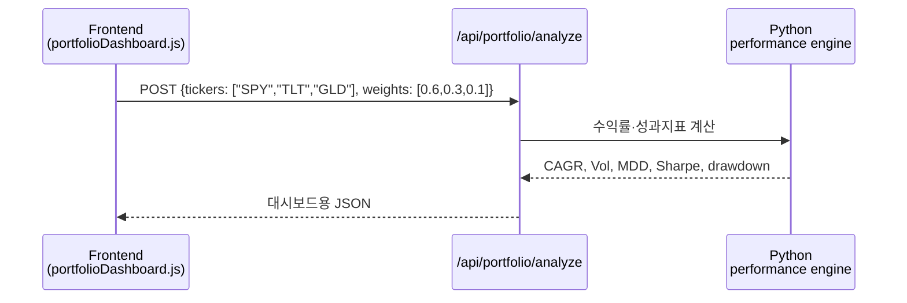

# Day 055 — 포트폴리오 이론 및 성과 분석

> **모듈 8: 퀀트를 위한 금융 필수 지식** | 4/5일차 | 🏦 | 학습시간: 8시간

---

> 📺 **YouTube 강의**: [🎬 포트폴리오 이론 성과 분석 마코위츠](https://www.youtube.com/results?search_query=포트폴리오+이론+성과분석+마코위츠+한국어)
>
> 📝 **한자 병기 및 어원 사전**: 이 문서에 등장하는 용어의 한자·어원·일제강점기 유래는 → [voca.md](voca.md)

## 오늘 배울 것

- 현대 포트폴리오 이론(MPT) 개요
- 효율적 투자선(Efficient Frontier)
- 성과 지표: CAGR, 변동성, MDD
- 위험 조정 지표: 샤프 비율, 소르티노 비율
- 실습: 포트폴리오 성과 분석 대시보드

---

## 🗓 세부 일정 (1일 8시간)

> **강의 5시간** (5개 단락 × 50분 + 도입·마무리 50분) + **실습 3시간** = 총 8시간

| 시간 | 구분 | 내용 | 형태 |
|------|------|------|------|
| 09:00 – 09:10 | 도입 | 오늘 학습 목표 확인 | 강의 |
| 09:10 – 09:30 | **1단락** 설명 20분 | 현대 포트폴리오 이론 | 강의 |
| 09:30 – 10:00 | 각자 정리 & 유튜브 30분 | 분산투자 사례 검색 | 자율 |
| 10:00 – 10:20 | **2단락** 설명 20분 | 효율적 투자선 | 강의 |
| 10:20 – 10:50 | 각자 정리 & 유튜브 30분 | 위험·수익 그래프 정리 | 자율 |
| 10:50 – 11:00 | ☕ 휴식 | — | — |
| 11:00 – 11:20 | **3단락** 설명 20분 | CAGR, 변동성, MDD | 강의 |
| 11:20 – 11:50 | 각자 정리 & 유튜브 30분 | 성과 지표 계산식 복습 | 자율 |
| 11:50 – 12:10 | **4단락** 설명 20분 | 샤프·소르티노 비율 | 강의 |
| 12:10 – 12:40 | 각자 정리 & 유튜브 30분 | 위험 조정 성과 사례 정리 | 자율 |
| 12:40 – 13:00 | **5단락** 설명 20분 | 성과 분석 대시보드 설계 | 강의 |
| 13:00 – 13:30 | 각자 정리 & 유튜브 30분 | 대시보드 지표 목록 작성 | 자율 |
| 13:30 – 14:00 | 강의 마무리 | Q&A · 핵심 복습 | 강의 |
| 14:00 – 15:00 | 💻 **실습 1부** 60분 | 자산별 수익률·공분산 계산 | 실습 |
| 15:00 – 15:10 | ☕ 휴식 | — | — |
| 15:10 – 16:00 | 💻 **실습 2부** 50분 | 성과 지표·위험 지표 시각화 | 실습 |
| 16:00 – 16:10 | ☕ 휴식 | — | — |
| 16:10 – 17:00 | 💻 **실습 발표 & 리뷰** 50분 | 포트폴리오 비교 결과 발표 | 실습 |

> 강의 5시간: 도입 10분 + 단락 5개×50분 + 마무리 30분 = **300분**  
> 실습 3시간: 1부 60분 + 휴식 10분 + 2부 50분 + 휴식 10분 + 발표·리뷰 50분 = **180분**

---

## 🔗 참고 사이트 & 데이터 원천

> 이 문서(포트폴리오 이론 및 성과 분석)의 실습에 필요한 데이터 출처와 참고 사이트입니다. ⚿ 는 API 키 또는 승인이 필요한 항목입니다.

| 기관/사이트 | URL | API 키 | 제공 데이터 |
|-------------|-----|--------|-------------|
| Yahoo Finance | <https://finance.yahoo.com> | 불필요 | ETF·주식 가격, 배당 참고 |
| FRED | <https://fred.stlouisfed.org> | ⚿ 권장 | 무위험수익률, 금리, 경기 지표 |
| KRX 정보데이터시스템 | <https://data.krx.co.kr> | 불필요(웹 조회) | 국내 주식·ETF 가격 |
| KRX Data Marketplace | <https://openapi.krx.co.kr> | ⚿ 필요 | 국내 시장 시계열 |
| Portfolio Visualizer | <https://www.portfoliovisualizer.com> | 불필요 | 포트폴리오 백테스트 참고 |
| MSCI Index Factsheets | <https://www.msci.com> | 불필요 | 지수 성과·구성 참고 |
| S&P Dow Jones Indices | <https://www.spglobal.com/spdji> | 불필요 | 지수 방법론·성과 |

---

### 1. 현대 포트폴리오 이론(MPT) 개요

> 📖 **Wikipedia**: [현대 포트폴리오 이론](https://ko.wikipedia.org/wiki/현대_포트폴리오_이론) · [분산 투자](https://ko.wikipedia.org/wiki/분산투자)

현대 포트폴리오 이론은 개별 자산을 따로 보는 것이 아니라, 자산을 함께 보유했을 때 전체 포트폴리오의 기대수익과 위험이 어떻게 달라지는지 분석합니다.

**핵심 아이디어**

- 자산의 수익률뿐 아니라 서로의 상관관계가 중요합니다.
- 상관관계가 낮은 자산을 섞으면 포트폴리오 변동성이 낮아질 수 있습니다.
- 좋은 포트폴리오는 같은 위험에서 더 높은 수익, 같은 수익에서 더 낮은 위험을 목표로 합니다.

> 📺 [🎬 현대 포트폴리오 이론 분산투자](https://www.youtube.com/results?search_query=현대+포트폴리오+이론+분산투자+한국어)

```python
weights = {"stock": 0.6, "bond": 0.4}
expected_returns = {"stock": 0.10, "bond": 0.04}

portfolio_return = sum(weights[a] * expected_returns[a] for a in weights)
print(f"포트폴리오 기대수익률: {portfolio_return:.2%}")
```

---

### 2. 효율적 투자선(Efficient Frontier)

> 📖 **Wikipedia**: [효율적 투자선](https://ko.wikipedia.org/wiki/효율적_프론티어)

효율적 투자선은 가능한 포트폴리오 중에서 위험 대비 수익이 가장 좋은 조합들의 집합입니다. 퀀트 실습에서는 여러 무작위 비중을 생성해 위험과 수익을 계산하고, 그중 우수한 조합을 찾는 방식으로 감을 잡습니다.

```python
import numpy as np

returns = np.array([0.10, 0.04])
cov = np.array([
    [0.20 ** 2, 0.20 * 0.08 * 0.2],
    [0.20 * 0.08 * 0.2, 0.08 ** 2],
])

for stock_weight in [0.0, 0.25, 0.5, 0.75, 1.0]:
    w = np.array([stock_weight, 1 - stock_weight])
    port_return = w @ returns
    port_vol = (w.T @ cov @ w) ** 0.5
    print(f"주식 {stock_weight:.0%}: 수익 {port_return:.2%}, 변동성 {port_vol:.2%}")
```

---

### 3. 성과 지표: CAGR, 변동성, MDD

> 📖 **Wikipedia**: [연평균 성장률](https://ko.wikipedia.org/wiki/연평균_성장률) · [변동성](https://ko.wikipedia.org/wiki/변동성_(금융))

| 지표 | 의미 | 해석 |
|------|------|------|
| CAGR | 연평균 복리 수익률 | 장기 성장 속도 |
| 변동성 | 수익률의 표준편차 | 흔들림의 크기 |
| MDD | 고점 대비 최대 하락률 | 투자자가 견뎌야 할 손실 폭 |
| 승률 | 수익이 난 기간의 비율 | 전략 안정성 보조 지표 |

```python
import pandas as pd

prices = pd.Series([100, 105, 98, 112, 120, 108, 130])
returns = prices.pct_change().dropna()
cumulative = prices / prices.iloc[0]

years = len(returns) / 252
cagr = cumulative.iloc[-1] ** (1 / years) - 1 if years > 0 else 0
vol = returns.std() * (252 ** 0.5)
mdd = (cumulative / cumulative.cummax() - 1).min()

print(f"CAGR: {cagr:.2%}")
print(f"변동성: {vol:.2%}")
print(f"MDD: {mdd:.2%}")
```

---

### 4. 위험 조정 지표: 샤프 비율, 소르티노 비율

> 📖 **Wikipedia**: [샤프 비율](https://ko.wikipedia.org/wiki/샤프_비율)

수익률만 높아도 위험이 지나치게 크면 좋은 전략이라고 보기 어렵습니다. 위험 조정 지표는 수익을 얻기 위해 감수한 변동성을 함께 평가합니다.

| 지표 | 계산 아이디어 | 특징 |
|------|---------------|------|
| 샤프 비율 | 초과수익률 ÷ 전체 변동성 | 가장 널리 쓰이는 위험 조정 지표 |
| 소르티노 비율 | 초과수익률 ÷ 하방 변동성 | 손실 방향 변동성만 반영 |
| 칼마 비율 | CAGR ÷ \|MDD\| | 최대 낙폭 대비 성과 |

```python
import numpy as np

daily_returns = np.array([0.01, -0.02, 0.015, 0.005, -0.004, 0.012])
risk_free_daily = 0.03 / 252
excess = daily_returns - risk_free_daily

sharpe = excess.mean() / daily_returns.std() * (252 ** 0.5)
downside = daily_returns[daily_returns < 0].std()
sortino = excess.mean() / downside * (252 ** 0.5)

print(f"Sharpe: {sharpe:.2f}")
print(f"Sortino: {sortino:.2f}")
```

---

### 5. 실습: 포트폴리오 성과 분석 대시보드

이번 실습의 목표는 여러 ETF의 가격 데이터를 가져와 포트폴리오 성과표를 만들고, 누적수익률·드로다운·월별 수익률을 시각화하는 것입니다.

```python
import yfinance as yf
import pandas as pd

tickers = ["SPY", "TLT", "GLD", "DBC"]
weights = pd.Series({"SPY": 0.5, "TLT": 0.3, "GLD": 0.15, "DBC": 0.05})

prices = yf.download(tickers, start="2018-01-01", auto_adjust=True)["Close"]
returns = prices.pct_change().dropna()
portfolio_returns = returns @ weights

cumulative = (1 + portfolio_returns).cumprod()
drawdown = cumulative / cumulative.cummax() - 1

summary = {
    "total_return": cumulative.iloc[-1] - 1,
    "annual_return": portfolio_returns.mean() * 252,
    "annual_vol": portfolio_returns.std() * (252 ** 0.5),
    "mdd": drawdown.min(),
}

print({k: f"{v:.2%}" for k, v in summary.items()})
```

#### 🔗 Python 소스 연계



| 화면 요소 | 표시 데이터 |
|---|---|
| KPI 카드 | CAGR, 변동성, MDD, 샤프 비율 |
| 누적 성과 차트 | 포트폴리오 vs 벤치마크 |
| 드로다운 차트 | 고점 대비 하락률 |
| 비중 차트 | 자산별 투자 비중 |
| 월별 히트맵 | 월간 수익률 분포 |

---

## 해보기 활동

1. `SPY`, `TLT`, `GLD`를 60/30/10으로 섞은 포트폴리오와 `SPY` 100%를 비교해보세요.
2. CAGR은 낮지만 MDD가 훨씬 낮은 포트폴리오가 있다면 어떤 투자자에게 적합한지 설명해보세요.
3. 샤프 비율과 소르티노 비율이 서로 다르게 나오는 이유를 하락 변동성 관점에서 정리해보세요.
4. 월별 수익률 히트맵을 만들고 손실이 집중된 시기를 찾아보세요.

## 다음 시간 미리보기

➡️ [Day 056](40.md) 에서 계속됩니다 — 자산배분 모델
