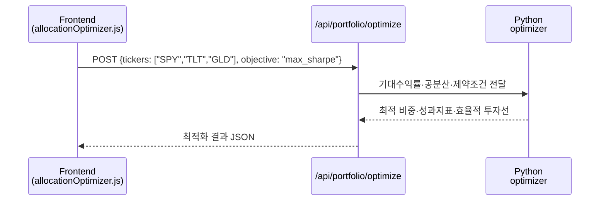

# Day 056 — 자산배분 모델

> **모듈 8: 퀀트를 위한 금융 필수 지식** | 5/5일차 | 🏦 | 학습시간: 8시간

---

> 📺 **YouTube 강의**: [🎬 자산배분 모델 포트폴리오 전략](https://www.youtube.com/results?search_query=자산배분+모델+포트폴리오+전략+한국어+강의)


---

# 자산배분 모델의 중요성 (The Importance of Asset Allocation)

자산배분(Asset Allocation)은 단순히 수익을 내는 기술이 아니라, 투자의 지속 가능성을 결정짓는 **전략적 설계도**입니다. 노벨 경제학상 수상자 해리 마코위츠(Harry Markowitz)는 자산배분을 두고 **"금융 시장에서 유일한 공짜 점심(The only free lunch in investing)"**이라고 표현했습니다.

---

### 1. 위험 분산 (Risk Management)
**"모든 달걀을 한 바구니에 담지 마라"**
자산배분의 가장 큰 목적은 상관관계가 낮은 자산들에 분산 투자하여 전체 포트폴리오의 변동성을 줄이는 것입니다.

* **비체계적 위험 제거:** 개별 종목이나 산업의 악재가 전체 자산에 미치는 영향을 최소화합니다.
* **자산 간 상보성:** 주식 시장이 위축될 때 안전 자산(채권, 금 등)이 가격을 방어해주는 원리를 활용합니다.

### 2. 수익률의 결정적 요인
학계의 연구에 따르면, 포트폴리오의 장기 성과에 영향을 미치는 요인 중 **자산배분이 차지하는 비중은 90% 이상**입니다.

* **전략적 중요도:** 종목 선정(Stock Selection)이나 매매 타이밍(Market Timing)보다 **어떤 자산군에 얼마를 배분하느냐**가 내 투자 계좌의 미래를 결정합니다.
* **효율적 투자:** 감정에 휘둘리는 매매가 아닌, 통계와 전략에 기반한 안정적인 수익 구조를 만듭니다.

### 3. 복리 효과의 보호 (MDD 관리)
투자의 성패는 수익을 내는 것보다 **'잃지 않는 것'**에 있습니다. 자산배분은 **최대 낙폭(MDD, Maximum Drawdown)**을 관리하는 데 핵심적인 역할을 합니다.

* **회복의 수학:** 50%를 잃으면 다시 100%를 벌어야 본전입니다. 손실 폭을 줄이는 것은 복리 수익을 극대화하는 가장 빠른 길입니다.
* **안정적 우상향:** 급격한 하락을 피함으로써 장기적으로 자산이 꾸준히 우상향할 수 있는 환경을 조성합니다.

### 4. 심리적 방어 기제 (투자의 지속성)
대부분의 투자자가 실패하는 이유는 시장의 공포를 견디지 못하고 중도에 하차하기 때문입니다.

* **패닉 셀 방지:** 포트폴리오의 변동성이 낮으면 하락장에서도 냉정함을 유지할 수 있습니다.
* **장기 투자 가능:** 본인의 위험 감수 능력에 맞게 설계된 자산배분 모델은 투자자가 시장에서 끝까지 살아남아 수익을 향유하게 해줍니다.

---

### [대표적인 자산배분 모델 예시]
1.  **60/40 전략:** 주식 60%, 채권 40%를 보유하는 가장 전통적인 모델
2.  **올웨더 포트폴리오(All Weather):** 경제 상황(성장, 물가)에 관계없이 수익을 내도록 설계된 모델
3.  **영구 포트폴리오(Permanent):** 주식, 채권, 현금, 금을 25%씩 동일하게 배분하는 모델

---
*자산배분은 예측할 수 없는 미래를 대비하는 가장 강력한 무기입니다.*


## 오늘 배울 것

- 평균분산 최적화(Mean-Variance Optimization)
- 블랙-리터만(Black-Litterman) 모델 개요
- Risk-Parity 모델 개요
- 자산배분 사례 분석: 60/40, All Weather 등
- 실습: 평균분산 자산배분 구현

---

## 🗓 세부 일정 (1일 8시간)

> **강의 5시간** (5개 단락 × 50분 + 도입·마무리 50분) + **실습 3시간** = 총 8시간

| 시간 | 구분 | 내용 | 형태 |
|------|------|------|------|
| 09:00 – 09:10 | 도입 | 오늘 학습 목표 확인 | 강의 |
| 09:10 – 09:30 | **1단락** 설명 20분 | 평균분산 최적화 | 강의 |
| 09:30 – 10:00 | 각자 정리 & 유튜브 30분 | 마코위츠 최적화 영상 검색 | 자율 |
| 10:00 – 10:20 | **2단락** 설명 20분 | 블랙-리터만 모델 | 강의 |
| 10:20 – 10:50 | 각자 정리 & 유튜브 30분 | 시장균형수익률·투자자 전망 정리 | 자율 |
| 10:50 – 11:00 | ☕ 휴식 | — | — |
| 11:00 – 11:20 | **3단락** 설명 20분 | Risk-Parity 모델 | 강의 |
| 11:20 – 11:50 | 각자 정리 & 유튜브 30분 | 위험기여도 개념 복습 | 자율 |
| 11:50 – 12:10 | **4단락** 설명 20분 | 60/40, All Weather 사례 | 강의 |
| 12:10 – 12:40 | 각자 정리 & 유튜브 30분 | 대표 자산배분 전략 비교 | 자율 |
| 12:40 – 13:00 | **5단락** 설명 20분 | 평균분산 구현 절차 | 강의 |
| 13:00 – 13:30 | 각자 정리 & 유튜브 30분 | 제약조건과 리밸런싱 기준 정리 | 자율 |
| 13:30 – 14:00 | 강의 마무리 | Q&A · 핵심 복습 | 강의 |
| 14:00 – 15:00 | 💻 **실습 1부** 60분 | 기대수익률·공분산 행렬 계산 | 실습 |
| 15:00 – 15:10 | ☕ 휴식 | — | — |
| 15:10 – 16:00 | 💻 **실습 2부** 50분 | 최적 비중 계산 및 백테스트 | 실습 |
| 16:00 – 16:10 | ☕ 휴식 | — | — |
| 16:10 – 17:00 | 💻 **실습 발표 & 리뷰** 50분 | 전략별 장단점 발표 | 실습 |

> 강의 5시간: 도입 10분 + 단락 5개×50분 + 마무리 30분 = **300분**  
> 실습 3시간: 1부 60분 + 휴식 10분 + 2부 50분 + 휴식 10분 + 발표·리뷰 50분 = **180분**

---

## 🔗 참고 사이트 & 데이터 원천

> 이 문서(자산배분 모델)의 실습에 필요한 데이터 출처와 참고 사이트입니다. ⚿ 는 API 키 또는 승인이 필요한 항목입니다.

| 기관/사이트 | URL | API 키 | 제공 데이터 |
|-------------|-----|--------|-------------|
| Yahoo Finance | <https://finance.yahoo.com> | 불필요 | ETF 가격, 배당 참고 |
| FRED | <https://fred.stlouisfed.org> | ⚿ 권장 | 무위험수익률, 금리, 물가 |
| KRX 정보데이터시스템 | <https://data.krx.co.kr> | 불필요(웹 조회) | 국내 ETF·지수 가격 |
| Portfolio Visualizer | <https://www.portfoliovisualizer.com> | 불필요 | 자산배분 백테스트 참고 |
| MSCI | <https://www.msci.com> | 불필요 | 글로벌 지수 방법론 |
| S&P Dow Jones Indices | <https://www.spglobal.com/spdji> | 불필요 | 지수 구성·성과 |
| pyportfolioopt | <https://pyportfolioopt.readthedocs.io> | 불필요 | Python 포트폴리오 최적화 라이브러리 |

---

### 1. 평균분산 최적화(Mean-Variance Optimization)

> 📖 **Wikipedia**: [현대 포트폴리오 이론](https://ko.wikipedia.org/wiki/현대_포트폴리오_이론) · [평균-분산 분석](https://en.wikipedia.org/wiki/Modern_portfolio_theory)

평균분산 최적화는 기대수익률과 공분산 행렬을 이용해 목표에 맞는 자산 비중을 찾는 방법입니다. 보통 변동성을 최소화하거나, 샤프 비율을 최대화하는 방식으로 사용합니다.

**최적화 흐름**

```text
가격 데이터 수집
  ↓
일별 수익률 계산
  ↓
기대수익률 벡터와 공분산 행렬 추정
  ↓
목표함수 선택: 최소분산 또는 최대샤프
  ↓
비중 제약 적용: long-only, 최대 비중, 최소 비중
  ↓
최적 비중 산출 및 백테스트
```

> 📺 [🎬 평균분산 최적화 포트폴리오](https://www.youtube.com/results?search_query=평균분산+최적화+포트폴리오+한국어)

```python
import numpy as np

expected_returns = np.array([0.10, 0.04, 0.07])
weights = np.array([0.5, 0.3, 0.2])

portfolio_return = weights @ expected_returns
print(f"기대수익률: {portfolio_return:.2%}")
```

---

### 2. 블랙-리터만(Black-Litterman) 모델 개요

> 📖 **Wikipedia**: [Black-Litterman model](https://en.wikipedia.org/wiki/Black%E2%80%93Litterman_model)

블랙-리터만 모델은 시장이 암시하는 균형수익률에 투자자의 전망을 섞어 기대수익률을 추정하는 방법입니다. 평균분산 최적화가 입력값에 민감하다는 문제를 완화하기 위해 사용됩니다.

| 입력 | 의미 |
|------|------|
| 시장 포트폴리오 비중 | 현재 시장이 반영한 균형 상태 |
| 공분산 행렬 | 자산 간 위험 구조 |
| 투자자 전망(View) | 특정 자산 또는 상대성과에 대한 판단 |
| 전망 신뢰도 | 투자자 의견을 얼마나 강하게 반영할지 |

> 📺 [🎬 블랙 리터만 모델 설명](https://www.youtube.com/results?search_query=블랙+리터만+모델+포트폴리오+한국어)

```python
import pandas as pd

market_implied = pd.Series({"SPY": 0.07, "TLT": 0.03, "GLD": 0.04})
views = pd.Series({"SPY": 0.01, "TLT": -0.005, "GLD": 0.005})
confidence = 0.5

adjusted_returns = market_implied + confidence * views
print(adjusted_returns)
```

---

### 3. Risk-Parity 모델 개요

> 📖 **Wikipedia**: [Risk parity](https://en.wikipedia.org/wiki/Risk_parity)

Risk-Parity는 자본 비중이 아니라 위험 기여도를 비슷하게 맞추는 자산배분 방식입니다. 변동성이 낮은 자산에는 더 큰 비중을, 변동성이 높은 자산에는 더 작은 비중을 주는 경향이 있습니다.

**단순 역변동성 비중 예시**

```python
import pandas as pd

volatility = pd.Series({"SPY": 0.18, "TLT": 0.12, "GLD": 0.15, "DBC": 0.22})
inverse_vol = 1 / volatility
weights = inverse_vol / inverse_vol.sum()

print(weights.round(3))
```

| 방식 | 기준 | 특징 |
|------|------|------|
| 동일가중 | 자본 비중 동일 | 단순하지만 위험 기여도 불균형 |
| 역변동성 | 낮은 변동성에 높은 비중 | 구현 쉬움 |
| Risk-Parity | 위험 기여도 동일화 | 공분산까지 반영 |

---

### 4. 자산배분 사례 분석 (60/40, All Weather 등)

> 📖 **Wikipedia**: [자산 배분](https://ko.wikipedia.org/wiki/자산_배분)

| 전략 | 기본 구성 | 핵심 아이디어 |
|------|-----------|---------------|
| 60/40 | 주식 60%, 채권 40% | 성장과 안정의 균형 |
| All Weather | 주식, 장기채, 중기채, 원자재, 금 | 경제 국면별 분산 |
| Permanent Portfolio | 주식, 장기채, 현금, 금 각 25% | 단순한 장기 분산 |
| 글로벌 멀티에셋 | 국가·자산군 분산 | 특정 국가 리스크 완화 |

> 📺 [🎬 6040 포트폴리오 올웨더 자산배분](https://www.youtube.com/results?search_query=60+40+포트폴리오+올웨더+자산배분+한국어)

```python
portfolios = {
    "60/40": {"SPY": 0.60, "TLT": 0.40},
    "All Weather Simple": {"SPY": 0.30, "TLT": 0.40, "IEF": 0.15, "GLD": 0.075, "DBC": 0.075},
    "Permanent": {"SPY": 0.25, "TLT": 0.25, "BIL": 0.25, "GLD": 0.25},
}

for name, weights in portfolios.items():
    print(name, sum(weights.values()))
```

---

### 5. 실습: Python으로 평균분산 자산배분 구현

이번 실습의 목표는 ETF 데이터를 수집하고, 무작위 포트폴리오를 생성해 샤프 비율이 높은 비중을 찾는 것입니다.

```python
import numpy as np
import pandas as pd
import yfinance as yf

tickers = ["SPY", "TLT", "GLD", "DBC"]
prices = yf.download(tickers, start="2018-01-01", auto_adjust=True)["Close"]
returns = prices.pct_change().dropna()

mu = returns.mean() * 252
cov = returns.cov() * 252
risk_free = 0.03

records = []
for _ in range(5000):
    w = np.random.random(len(tickers))
    w = w / w.sum()
    port_return = w @ mu
    port_vol = (w.T @ cov @ w) ** 0.5
    sharpe = (port_return - risk_free) / port_vol
    records.append([*w, port_return, port_vol, sharpe])

cols = [f"w_{t}" for t in tickers] + ["return", "volatility", "sharpe"]
result = pd.DataFrame(records, columns=cols)
best = result.sort_values("sharpe", ascending=False).iloc[0]

print(best.round(4))
```

#### 🔗 Python 소스 연계



| API 파라미터 | 예시 | 설명 |
|---|---|---|
| `tickers` | `["SPY", "TLT", "GLD"]` | 최적화 대상 |
| `objective` | `"min_vol"`, `"max_sharpe"` | 최적화 목표 |
| `risk_free` | `0.03` | 샤프 비율 계산용 무위험수익률 |
| `max_weight` | `0.6` | 단일 자산 최대 비중 |
| `rebalance` | `"M"`, `"Q"` | 리밸런싱 주기 |

---

## 해보기 활동

1. `SPY`, `TLT`, `GLD`, `DBC`로 최대 샤프 포트폴리오를 만들고 60/40 전략과 비교해보세요.
2. 무위험수익률을 0%, 3%, 5%로 바꾸면 최적 비중이 어떻게 달라지는지 확인해보세요.
3. 단일 자산 최대 비중을 50%로 제한했을 때와 제한하지 않았을 때 결과를 비교해보세요.
4. 역변동성 포트폴리오와 평균분산 최적화 포트폴리오의 장단점을 표로 정리해보세요.
5. 최적화 결과가 과거 데이터에 지나치게 맞춰질 수 있는 이유를 설명해보세요.

## 모듈 8 마무리

모듈 8(퀀트를 위한 금융 필수 지식) 전 5일차를 완료했습니다.

| 학습 주제 | 핵심 도구 | 참고 파일 |
|-----------|-----------|-----------|
| 주식·ETF | EPS, 배당, ETF 성과 비교 | Day 052 |
| 채권 | 금리, 듀레이션, 수익률 곡선 | Day 053 |
| 파생상품 | 선물, 옵션, 스왑 | Day 054 |
| 포트폴리오 분석 | CAGR, MDD, 샤프 비율 | Day 055 |
| 자산배분 | 평균분산, 블랙-리터만, Risk-Parity | Day 056 |

## 다음 시간 미리보기

➡️ 다음 모듈에서는 퀀트 전략 설계와 백테스트 구현으로 이어집니다.
