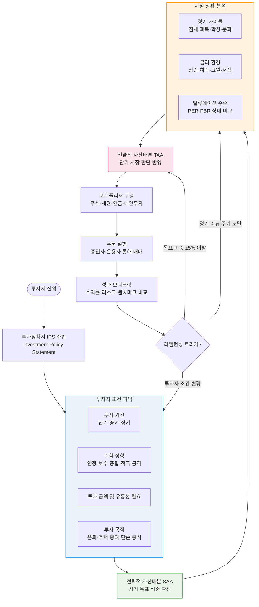
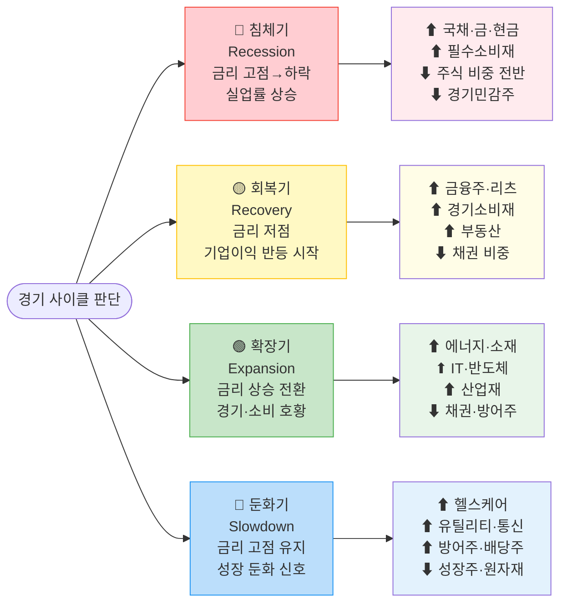
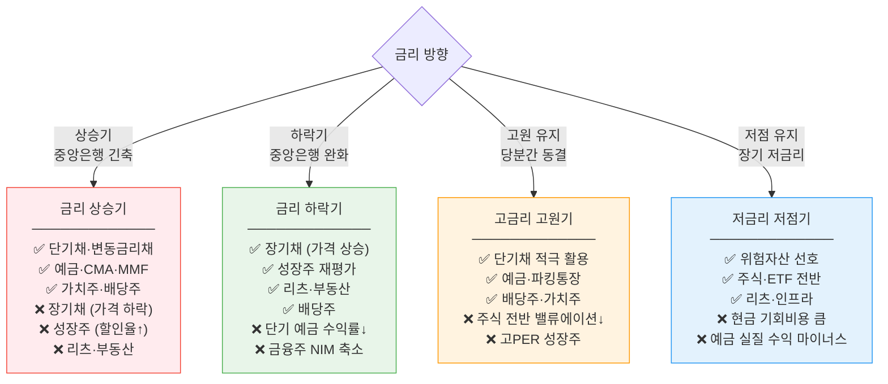
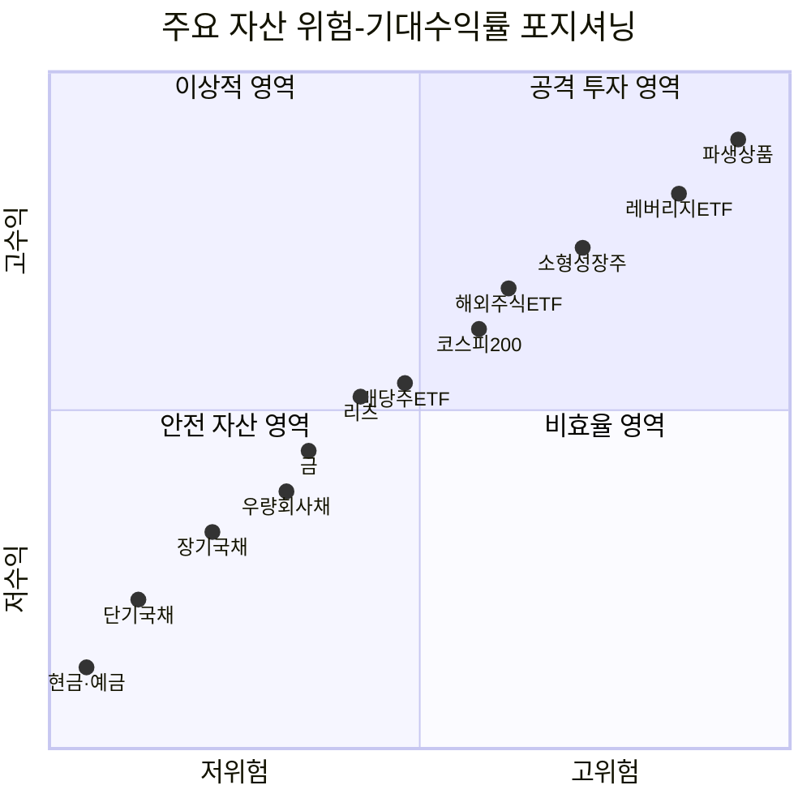

# 금융 규제·산업 구조 기초 — 한국 금융회사 분류와 자본시장법

> **모듈 8 보충: 퀀트를 위한 금융 필수 지식** | 🏦 | 학습시간: 4시간

---

> 📺 **YouTube 강의**: [🎬 한국 금융회사 종류 자본시장법](https://www.youtube.com/results?search_query=한국+금융회사+종류+자본시장법+금융투자업+설명+강의)

## 이 문서에서 다루는 것

- **금융상품의 개론** — 개념·기능·3대 분류 체계
- **예금 및 신탁상품** — 수신상품의 종류와 특징
- **보장성 금융상품** — 보험의 종류와 예금자보호 차이
- **투자성 금융상품** — 자본시장법상 금융투자상품 체계
- 금융회사의 종류 (은행·금융투자·보험·저축은행·여신전문 등)
- 금융투자회사(자본시장법상 금융투자업자) 6가지 업무
- 자본시장법 핵심 구조와 포괄주의 금융투자상품 정의
- 위탁·수탁·신탁의 개념과 차이
- 수신·여신의 정의와 은행 수익 구조
- 금융상품의 구분 (금융투자상품 vs 비금융투자상품)
- **정보 비대칭성·역선택·도덕적 해이** — 금융 규제의 이론적 배경

---

## 🔗 참고 법령 & 공식 사이트

| 법령/기관 | URL | 내용 |
|-----------|-----|------|
| 국가법령정보센터 — 자본시장법 | <https://www.law.go.kr/lsSc.do?query=자본시장과+금융투자업에+관한+법률> | 전문 조문 |
| 금융감독원 | <https://www.fss.or.kr> | 금융회사 인가·검사·공시 |
| 금융위원회 | <https://www.fsc.go.kr> | 금융정책 및 법령 해설 |
| 한국금융투자협회 | <https://www.kofia.or.kr> | 금융투자업자 등록 현황 |
| 금융소비자정보포털 파인 | <https://fine.fss.or.kr> | 금융회사 유형별 설명 |

---

## 1. 금융회사의 종류

> 📖 **Wikipedia**: [금융회사](https://ko.wikipedia.org/wiki/금융회사) · [은행](https://ko.wikipedia.org/wiki/은행) · [보험회사](https://ko.wikipedia.org/wiki/보험회사)

한국의 금융회사는 **근거 법률**에 따라 크게 다섯 계열로 나뉩니다. 퀀트 분석가는 자신이 다루는 데이터(주식, 채권, 파생상품, 예금금리 등)가 어떤 금융회사 유형에서 나오는지 알아야 규제 맥락을 이해할 수 있습니다.

| 대분류 | 근거 법률 | 주요 업무 | 대표 기관 |
|--------|-----------|-----------|-----------|
| 은행 | 은행법 | 수신(예금), 여신(대출), 외환 | KB국민, 신한, 하나, 우리, NH농협, 카카오뱅크 |
| 금융투자업자 | 자본시장법 | 증권 매매, 자산운용, 신탁, 자문 | 미래에셋증권, 삼성자산운용, 키움증권 |
| 보험회사 | 보험업법 | 보험료 수취, 보험금 지급, 자산운용 | 삼성생명, 메리츠화재 |
| 저축은행 | 상호저축은행법 | 서민 대상 수신·여신 | SBI저축은행, OK저축은행 |
| 여신전문금융회사 | 여신전문금융업법 | 신용카드, 할부금융, 리스 | 삼성카드, 현대캐피탈 |
| 금융지주회사 | 금융지주회사법 | 자회사(은행·증권·보험 등) 지배·관리 | KB금융지주, 신한금융지주 |

> 📺 [🎬 은행 증권 보험 여신전문 금융회사 차이](https://www.youtube.com/results?search_query=은행+증권사+보험회사+저축은행+차이+한국어)

### 은행의 세부 분류

| 유형 | 특징 | 예시 |
|------|------|------|
| 시중은행 | 전국 영업망, 일반 상업은행 | KB국민, 신한, 하나, 우리 |
| 지방은행 | 특정 지역 기반 | 부산은행, 대구은행, 광주은행 |
| 인터넷전문은행 | 비대면 전용 | 카카오뱅크, 케이뱅크, 토스뱅크 |
| 특수은행 | 정책 목적 운영 | 한국산업은행, IBK기업은행, 수출입은행 |

---

### 비은행금융회사의 종류

> 📖 **Wikipedia**: [비은행금융기관](https://ko.wikipedia.org/wiki/비은행금융기관) · [저축은행](https://ko.wikipedia.org/wiki/저축은행) · [신용협동조합](https://ko.wikipedia.org/wiki/신용협동조합)  
> 참고: 금융감독원 <https://www.fss.or.kr> → 금융회사 → 비은행

**비은행금융회사(非銀行金融會社)**는 은행법에 따른 인가를 받지 않으면서 금융 서비스를 제공하는 모든 금융회사를 말합니다. 규모·기능·규제 수준이 서로 달라, 전체 그림을 **5개 그룹**으로 나누어 이해하는 것이 가장 효율적입니다.

```
비은행금융회사
├── ① 비은행예금취급기관   ← 예금을 받을 수 있는 비은행기관
├── ② 금융투자업자         ← 자본시장법 적용 (증권·펀드·파생)
├── ③ 보험회사             ← 보험업법 적용
├── ④ 여신전문금융회사     ← 대출·카드·리스 전문
└── ⑤ 기타 금융회사       ← 대부업, P2P, 핀테크, 정책금융기관 등
```

#### ① 비은행예금취급기관

은행이 아니지만 예금(수신)을 받을 수 있는 기관입니다. 예금자보호법의 보호를 받지 못하는 경우도 있으니 주의가 필요합니다.

| 기관 | 근거 법률 | 주요 특징 | 예금자보호 | 대표 기관 |
|------|-----------|-----------|-----------|-----------|
| **저축은행** | 상호저축은행법 | 서민·지역 밀착 수신·여신, 은행보다 금리 높음 | O (1인 5천만원) | SBI저축은행, OK저축은행 |
| **신용협동조합** (신협) | 신용협동조합법 | 조합원 상호 부조, 조합원만 이용 가능 | O (1인 5천만원, 예금보험공사 아닌 신협자체기금) | 전국 900여 개 신협 |
| **새마을금고** | 새마을금고법 | 지역 주민 상호 금융, 행정안전부 감독 | O (1인 5천만원, 새마을금고중앙회기금) | 전국 1,200여 개 새마을금고 |
| **농협·수협·산림조합 단위조합** | 농업협동조합법 등 | 농어업인 조합원 대상 상호 금융 | O (농협중앙회 자체 기금) | 지역 농협 단위조합 |
| **우체국** | 우체국예금·보험에관한법률 | 전국 우체국 창구, 정부가 원금 전액 보장 | O (전액 — 정부 보장) | 우체국예금 |

> 💡 저축은행·신협·새마을금고는 예금자보호법 적용 기관이 아니라, **각 기관의 자체 기금 또는 별도 법률**로 보호됩니다. 은행과 동일하게 1인 5천만원 한도이지만 보호 주체가 다릅니다.

#### ② 금융투자업자 (자본시장법)

자본시장법에 따라 6대 업무 중 하나 이상을 인가·등록받은 회사입니다. *(섹션 2에서 상세 설명)*

| 회사 유형 | 인가 업무 | 대표 기관 |
|-----------|-----------|-----------|
| **종합금융투자사업자** (대형 증권사) | 투자매매·중개·집합투자·자문·일임·신탁 전부 또는 다수 | 미래에셋증권, 한국투자증권, NH투자증권 |
| **증권회사** | 투자매매업 + 투자중개업 | 키움증권, 삼성증권 |
| **자산운용사** | 집합투자업 (펀드 운용) | 삼성자산운용, 미래에셋자산운용, KB자산운용 |
| **투자자문·일임사** | 투자자문업 / 투자일임업 | 쿼터백자산운용, 파운트 |
| **선물회사** | 파생상품 투자매매·중개 | 대신선물, NH선물 |
| **온라인소액투자중개업자** (크라우드펀딩) | 소액 투자중개업 | 와디즈, 오픈트레이드 |

#### ③ 보험회사 (보험업법)

*(섹션 11에서 상세 설명)*

| 유형 | 근거 법률 | 주요 상품 | 대표 기관 |
|------|-----------|-----------|-----------|
| **생명보험회사** | 보험업법 | 종신보험, 연금보험, CI보험 | 삼성생명, 한화생명, 교보생명 |
| **손해보험회사** | 보험업법 | 자동차보험, 화재보험, 실손보험 | 삼성화재, DB손해보험, 현대해상 |
| **재보험회사** | 보험업법 | 보험회사의 위험 재분산 | 코리안리재보험 |
| **공제기관** | 각 공제 근거 법률 | 공무원공제, 군인공제, 교원공제 | 공무원연금공단, 군인공제회 |

#### ④ 여신전문금융회사 (여신전문금융업법)

예금(수신)은 받지 않고, **여신(대출·신용공여) 기능**에 특화된 회사입니다.

| 업종 | 주요 업무 | 근거 조항 | 대표 기관 |
|------|-----------|-----------|-----------|
| **신용카드업** | 신용카드 발급·결제·단기 카드론 | 여전법 제2조 | 삼성카드, 현대카드, KB국민카드 |
| **할부금융업** | 자동차·가전·내구재 할부 대출 | 여전법 제2조 | 현대캐피탈, KB캐피탈 |
| **시설대여업 (리스)** | 설비·차량·부동산 리스 | 여전법 제2조 | JB우리캐피탈, 하나캐피탈 |
| **신기술사업금융업** | 기술 기업 투자·융자 | 여전법 제2조 | 한국기술금융, IBK캐피탈 |

> 💡 여신전문금융회사는 수신이 없으므로 **예금자보호 대상이 아닙니다.** 자금은 자체 채권 발행(여전채)이나 차입으로 조달합니다.

#### ⑤ 기타 금융회사

| 유형 | 근거 법률 | 주요 특징 | 대표 기관 |
|------|-----------|-----------|-----------|
| **대부업자** | 대부업법 | 단기 소액 대출, 최고 금리 규제(연 20%) | 산와머니, 웰컴론 |
| **온라인투자연계금융업자 (P2P)** | 온라인투자연계금융업법 | 차입자-투자자 직접 연결, 원금 비보호 | 피플펀드, 8퍼센트 |
| **전자금융업자** | 전자금융거래법 | 간편결제·송금 서비스, 금융 중개 | 카카오페이, 네이버페이, 토스 |
| **벤처캐피탈 (창투사)** | 중소기업창업지원법 | 스타트업 지분 투자, 조합 결성 | 한국투자파트너스, SV인베스트먼트 |
| **사모펀드 (PEF)** | 자본시장법 | 비공개 대규모 투자, 기업 경영 참여 | MBK파트너스, IMM PE |
| **증권금융회사** | 자본시장법 | 증권 담보 대출, 결제 자금 공급 | 한국증권금융(KSFC) |
| **신용보증기관** | 신용보증기금법 등 | 중소기업 신용보증, 보증서 발급 | 신용보증기금, 기술보증기금 |
| **정책금융기관** | 각 설립 법률 | 정부 정책 목적 금융 지원 | 한국주택금융공사, 한국자산관리공사(KAMCO), 한국투자공사(KIC) |

### 금융회사 전체 지도 — 한눈에 보기

```
한국 금융회사
│
├── 은행 (Bank) ──────────────── 은행법
│   ├── 시중·지방은행
│   ├── 인터넷전문은행
│   └── 특수(국책)은행
│
└── 비은행금융회사 (NBFC)
    │
    ├── ① 비은행예금취급기관 ─── 각 설립 근거법
    │   ├── 저축은행
    │   ├── 신협 · 새마을금고
    │   ├── 농협·수협 단위조합
    │   └── 우체국
    │
    ├── ② 금융투자업자 ─────── 자본시장법
    │   ├── 증권회사 (투자매매·중개)
    │   ├── 자산운용사 (집합투자)
    │   ├── 투자자문·일임사
    │   └── 선물회사
    │
    ├── ③ 보험회사 ──────────── 보험업법
    │   ├── 생명보험
    │   ├── 손해보험
    │   └── 재보험 · 공제
    │
    ├── ④ 여신전문금융회사 ───── 여신전문금융업법
    │   ├── 신용카드사
    │   ├── 할부금융사
    │   └── 리스사 · 신기술금융
    │
    └── ⑤ 기타
        ├── 대부업자
        ├── P2P (온투업)
        ├── 전자금융업자 (핀테크)
        ├── 벤처캐피탈 · PEF
        └── 정책금융기관
```

```python
# 비은행금융회사 전체 분류 요약
non_bank_financial = {
    "비은행예금취급기관": {
        "예시": ["저축은행", "신협", "새마을금고", "농협단위조합", "우체국"],
        "예금수취": True,
        "예금자보호": "O (자체기금 또는 정부보장)",
    },
    "금융투자업자": {
        "예시": ["증권사", "자산운용사", "투자자문사", "선물회사"],
        "예금수취": False,
        "주요규제": "자본시장법",
    },
    "보험회사": {
        "예시": ["생명보험사", "손해보험사", "재보험사"],
        "예금수취": False,
        "주요규제": "보험업법",
    },
    "여신전문금융회사": {
        "예시": ["신용카드사", "할부금융사", "리스사"],
        "예금수취": False,
        "주요규제": "여신전문금융업법",
    },
    "기타": {
        "예시": ["대부업자", "P2P(온투업)", "전자금융업자", "벤처캐피탈", "정책금융기관"],
        "예금수취": False,
        "주요규제": "각 개별법",
    },
}

for group, info in non_bank_financial.items():
    print(f"\n[{group}]")
    print(f"  예시: {', '.join(info['예시'][:3])} ...")
    print(f"  예금수취 가능: {info['예금수취']}")
```

```python
financial_companies = {
    "은행": {
        "근거법": "은행법",
        "핵심업무": ["수신(예금)", "여신(대출)", "내외국환"],
        "주요기관": ["KB국민은행", "신한은행", "카카오뱅크"],
    },
    "금융투자업자": {
        "근거법": "자본시장법",
        "핵심업무": ["투자매매", "투자중개", "집합투자", "자문·일임", "신탁"],
        "주요기관": ["미래에셋증권", "삼성자산운용", "키움증권"],
    },
    "보험회사": {
        "근거법": "보험업법",
        "핵심업무": ["생명보험", "손해보험", "자산운용"],
        "주요기관": ["삼성생명", "DB손해보험"],
    },
    "저축은행": {
        "근거법": "상호저축은행법",
        "핵심업무": ["서민 수신·여신"],
        "주요기관": ["SBI저축은행", "OK저축은행"],
    },
    "여신전문금융회사": {
        "근거법": "여신전문금융업법",
        "핵심업무": ["신용카드", "할부금융", "시설대여(리스)"],
        "주요기관": ["삼성카드", "현대캐피탈"],
    },
}

for company_type, info in financial_companies.items():
    print(f"[{company_type}] 근거법: {info['근거법']}")
    print(f"  핵심업무: {', '.join(info['핵심업무'])}")
```

---

### 수신전문 vs 여신전문 — 핵심 구분

> 📖 **Wikipedia**: [수신](https://ko.wikipedia.org/wiki/수신_(금융)) · [여신](https://ko.wikipedia.org/wiki/여신)

금융회사를 가장 쉽게 이해하는 첫 번째 기준은 **"돈을 받는가, 돈을 내주는가"** 입니다.

```
돈의 흐름으로 보는 금융회사

  고객 → [수신: 예금] → 금융회사 → [여신: 대출] → 다른 고객
                         ↑
               예대마진(여신금리 - 수신금리)으로 이익
```

| 구분 | 의미 | 쉬운 비유 | 대표 회사 |
|------|------|----------|-----------|
| **수신(受信)** | 금융회사가 고객에게 돈을 **받는** 것 (예금) | 금고에 돈을 맡기는 것 | 은행, 저축은행, 신협 |
| **여신(與信)** | 금융회사가 고객에게 돈을 **주는** 것 (대출) | 금고에서 돈을 꺼내 빌려주는 것 | 은행, 카드사, 캐피탈 |

---

#### ① 수신전문 금융회사

**수신(예금 받기)에 특화**되어 있으며, 여신(대출)도 함께 취급합니다. 수신이 있으므로 **예금자보호** 대상입니다.

| 금융회사 | 수신 상품 | 여신 여부 | 예금자보호 | 특징 |
|----------|-----------|-----------|-----------|------|
| **시중은행** | 요구불·정기예금·적금·MMDA | O | O (5천만원) | 수신+여신+외환 종합 |
| **저축은행** | 정기예금·적금 (금리 높음) | O | O (5천만원) | 서민 대상, 고금리 예금 |
| **신용협동조합** | 조합원 예탁금·적금 | O (조합원 한정) | O (신협기금) | 조합원만 이용 |
| **새마을금고** | 예탁금·적금 | O (지역 주민) | O (새마을금고기금) | 지역 밀착형 |
| **우체국** | 예금·적금 | X (대출 없음) | O (정부 전액) | 전국 우체국 창구 |

> 💡 우체국은 **수신만** 하고 대출은 하지 않습니다. 모은 돈을 정부 채권 등 안전 자산에 운용합니다. 그래서 정부가 전액 보장합니다.

---

#### ② 여신전문 금융회사

**수신(예금)을 받지 않고** 여신(대출·신용공여)에만 특화된 회사입니다. 예금이 없으므로 **예금자보호 대상이 아닙니다.** 돈은 자체 채권(여전채) 발행이나 금융권 차입으로 조달합니다.

```
[여신전문금융회사 자금 조달 구조]

  채권시장 / 은행 차입
        │
        ▼
  여신전문금융회사 (수신 없음)
        │
        ▼
  소비자에게 신용카드·할부·리스 제공
```

| 업종 | 주요 상품 | 쉬운 설명 | 대표 회사 |
|------|-----------|----------|-----------|
| **신용카드업** | 신용카드, 카드론, 할부 | "지금 사고 나중에 갚는 카드" | 삼성카드, 현대카드, KB국민카드 |
| **할부금융업** | 자동차·가전 할부 대출 | "60개월 나눠 갚는 자동차 구매" | 현대캐피탈, KB캐피탈, 롯데캐피탈 |
| **시설대여업(리스)** | 금융리스, 운용리스 | "내 것처럼 쓰지만 회사 소유" | JB우리캐피탈, 하나캐피탈 |
| **신기술사업금융업** | 기술기업 대출·투자 | "유망 스타트업에 돈 빌려주거나 투자" | IBK캐피탈, 한국기술금융 |

> 💡 카드사·캐피탈은 **자체 채권(여전채)**을 발행해 자금을 조달합니다. 예금자보호가 없으므로 카드사에 예금을 맡기는 개념이 아닙니다.

#### 신용카드 결제 흐름

```
소비자 → [카드 사용] → 가맹점
     ↑                    │
     │      카드사         │ 대금 청구
     └──── [결제 대행] ────┘
           ↑
     [카드론·리볼빙으로 단기 여신]
```

| 서비스 | 의미 |
|--------|------|
| **일시불** | 다음달에 전액 상환 (이자 없음) |
| **할부** | 여러 달로 나눠 상환 (3개월 미만 무이자 가능) |
| **리볼빙** | 최소 금액만 납부하고 잔액 이월 (연 이자율 15~20%) |
| **카드론** | 카드 한도 내 단기 대출 (연 이자율 10~20%) |

---

#### ③ 수신·여신 모두 하는 회사 vs 여신만 하는 회사 비교

| 구분 | 수신 | 여신 | 예금자보호 | 자금 조달 방법 |
|------|------|------|-----------|---------------|
| **은행** | O | O | O (5천만원) | 예금 + 채권 발행 + 중앙은행 |
| **저축은행** | O | O | O (5천만원) | 예금 + 채권 |
| **신협·새마을금고** | O | O | O (자체기금) | 조합원 예탁금 |
| **신용카드사** | X | O (카드론) | X | 카드채(여전채) 발행 |
| **캐피탈사** | X | O (할부·리스) | X | 여전채 발행 + 차입 |
| **대부업자** | X | O | X | 자기자본 + 차입 |

---

### 증권회사(증권전문회사) 상세

> 📖 **Wikipedia**: [증권회사](https://ko.wikipedia.org/wiki/증권회사) · [브로커리지](https://ko.wikipedia.org/wiki/브로커) · [투자은행](https://ko.wikipedia.org/wiki/투자은행)

**증권회사**는 자본시장법에 따라 **투자매매업 + 투자중개업**을 인가받은 금융투자업자입니다. 고객이 주식·채권·펀드를 사고팔 수 있도록 도와주는 **금융 중개 플랫폼**입니다.

#### ① 증권회사가 하는 일 — 6가지 핵심 업무

| 업무 | 쉬운 설명 | 수익원 |
|------|----------|--------|
| **브로커리지** (위탁매매) | HTS·MTS에서 주문받아 거래소에 대신 주문 | 거래 수수료 |
| **딜링** (자기매매) | 회사 자기 돈으로 주식·채권·파생 직접 매매 | 매매 차익 |
| **인수** (Underwriting) | 기업이 주식·채권 발행 시 물량 인수해 배분 | 인수 수수료 |
| **자산관리** (WM) | 고객 자산을 맞춤 설계로 운용 (랩어카운트 등) | 일임·자문 보수 |
| **IB** (투자은행) | 기업 M&A·IPO·구조화금융 자문 | 자문 수수료 |
| **리서치** | 기업·산업·거시 분석 보고서 발간 | 간접 수익 (고객 유치) |

#### ② 증권사 규모별 분류

| 구분 | 자기자본 기준 | 특징 | 대표 회사 |
|------|-------------|------|-----------|
| **종합금융투자사업자** (대형) | 3조원 이상 | 6대 업무 + 기업 신용공여·발행어음 | 미래에셋, 한국투자, NH, KB, 삼성, 신한, 하나, 메리츠 |
| **중형 증권사** | 5,000억~3조원 | 브로커리지·IB 병행 | 대신증권, 교보증권, 유안타증권 |
| **리테일 특화** (온라인) | 다양 | 수수료 최저, 개인 투자자 집중 | 키움증권, 토스증권, 카카오페이증권 |
| **IB 특화** | 다양 | 기업금융·채권 강점 | 유진투자증권, 신영증권 |

#### ③ 증권사 계좌의 종류

| 계좌 종류 | 용도 | 특징 |
|-----------|------|------|
| **위탁계좌** | 주식·ETF·채권 매매 | 가장 기본 계좌 |
| **ISA** (개인종합자산관리) | 예금·펀드·ETF 통합 관리 | 비과세·분리과세 혜택 |
| **IRP** (개인형 퇴직연금) | 퇴직금·추가 납입 운용 | 세액공제 연 900만원 |
| **연금저축계좌** | 장기 노후 자금 운용 | 세액공제 연 600만원 |
| **Wrap Account** | 일임 운용 (증권사가 대신 운용) | 운용 보수 지급 |
| **CMA** | 하루짜리 단기 투자 (RP·MMF) | 입출금 자유 + 이자 |

#### ④ HTS·MTS와 주문 유형

```
투자자 (HTS/MTS)
    │
    ▼
증권사 주문 시스템
    │
    ▼
한국거래소 (KRX) — 매수·매도 호가 매칭
    │
    ▼
체결 → 결제 (T+2: 거래일로부터 2영업일 후)
```

| 주문 유형 | 설명 | 언제 사용 |
|-----------|------|----------|
| **시장가** | 현재 시장 가격으로 즉시 체결 | 빠른 매매가 필요할 때 |
| **지정가** | 내가 원하는 가격을 지정해 체결 대기 | 특정 가격에 사고 싶을 때 |
| **조건부지정가** | 지정가로 대기, 종료 전 미체결 시 시장가 전환 | 당일 체결을 원하지만 가격도 신경 쓸 때 |
| **최유리지정가** | 상대방 최우선 호가로 즉시 지정 | 시장가보다 약간 유리하게 체결 |

#### ⑤ 증권사 예탁금 보호

> 증권사는 예금자보호법 적용을 받지 않지만, **투자자 예탁금 별도 예치** 제도로 투자자 보호합니다.

| 보호 제도 | 내용 |
|-----------|------|
| **예탁금 분리 예치** | 고객 현금은 한국증권금융(KSFC)에 별도 예치 → 증권사 파산 시에도 보호 |
| **증권 명의** | 고객 주식은 한국예탁결제원(KSD)에 예탁 → 증권사와 무관하게 보호 |
| **예금자보호법** | 증권사의 **예금성 상품**(CMA-RP 일부 등)은 최대 5천만원 보호 |

```python
# 증권회사 업무별 수익 구조 요약 (Python 데이터 구조)
brokerage_business = {
    "브로커리지 (위탁매매)": {
        "설명": "고객 주문을 거래소에 대신 체결",
        "수익": "거래 수수료 (주식 0.01~0.5%)",
        "퀀트_연관": "체결 데이터, 호가 분석, 최선집행 알고리즘",
    },
    "딜링 (자기매매)": {
        "설명": "자기 계좌로 직접 트레이딩",
        "수익": "매매 차익, 스프레드",
        "퀀트_연관": "프랍 트레이딩, 시장조성(MM), 차익거래",
    },
    "IB (기업금융)": {
        "설명": "IPO·유상증자·M&A 자문 및 인수",
        "수익": "인수 수수료 (발행액의 1~5%)",
        "퀀트_연관": "기업가치평가(DCF, 비교기업), IPO 공모가 산정",
    },
    "자산관리 (WM)": {
        "설명": "고객 자산 맞춤 운용",
        "수익": "일임·자문 보수 (연 0.5~1.5%)",
        "퀀트_연관": "포트폴리오 최적화, 리스크 관리, 로보어드바이저",
    },
    "리서치": {
        "설명": "기업·산업 분석 보고서",
        "수익": "간접 수익 (고객 유치·유지)",
        "퀀트_연관": "팩터 분석, 어닝 서프라이즈 예측, 텍스트 마이닝",
    },
}

for biz, info in brokerage_business.items():
    print(f"\n[{biz}]")
    print(f"  설명: {info['설명']}")
    print(f"  수익: {info['수익']}")
    print(f"  퀀트 연관: {info['퀀트_연관']}")
```

---

### 핀테크(FinTech)와 전자금융업자

> 📖 **Wikipedia**: [핀테크](https://ko.wikipedia.org/wiki/핀테크) · [전자금융거래법](https://ko.wikipedia.org/wiki/전자금융거래법) · [간편결제](https://ko.wikipedia.org/wiki/간편결제)

#### ① 핀테크(FinTech)란?

**Finance(금융) + Technology(기술)**의 합성어. IT 기술을 활용해 금융 서비스를 혁신하는 산업 전반을 가리킵니다.

```
전통 금융                핀테크
─────────────────────────────────────────
은행 창구 방문         →  앱 하나로 계좌 개설·이체
공인인증서·보안카드   →  생체인증·간편 비밀번호
종이 서류 대출 심사   →  AI 신용평가·즉시 승인
증권사 전화 주문      →  MTS 자동매매·로보어드바이저
보험 설계사 대면 가입 →  인슈어테크 앱 온라인 가입
```

핀테크는 서비스 영역에 따라 구분됩니다:

| 분야 | 핵심 기술 | 예시 서비스 |
|------|----------|-----------|
| **결제·송금** | 간편결제, QR코드, NFC | 카카오페이, 네이버페이, 토스, 삼성페이 |
| **대출·신용** | AI 신용평가, 대안신용데이터 | 토스뱅크 신용대출, 크레파스 신용분석 |
| **투자·자산관리** | 로보어드바이저, 자동투자 | 카카오페이증권, 파운트, 핀트 |
| **보험(인슈어테크)** | 디지털 보험, 간편 가입 | 카카오손해보험, 캐롯손해보험, 한화생명 온라인 |
| **블록체인·가상자산** | 분산원장, 스마트 계약 | 업비트, 빗썸, 코인원 |
| **데이터·신용관리** | 마이데이터, 신용점수 조회 | 뱅크샐러드, 네이버 내 자산, 토스 신용점수 |
| **B2B 금융인프라** | 오픈뱅킹, 코어뱅킹 SaaS | 핀다, 뱅크웨어글로벌 |

---

#### ② 전자금융업자 — 법적 분류

**전자금융거래법**에 따라 금융위원회에 허가·등록·신고한 회사입니다. 은행·증권·보험과는 별도의 규제 체계를 따릅니다.

| 업종 | 진입 방식 | 핵심 업무 | 대표 회사 |
|------|-----------|---------|-----------|
| **전자화폐 발행업자** | 금융위 허가 | 선불 전자화폐 발행·관리 | (현재 실질적 사례 드묾) |
| **전자자금이체업자** | 금융위 허가 | 계좌 간 자금 이체 서비스 | 토스(비바리퍼블리카) |
| **직불전자지급수단 발행·관리업자** | 금융위 등록 | 직불카드형 전자결제 | 체크페이 관련 서비스 |
| **선불전자지급수단 발행·관리업자** | 금융위 등록 | 포인트·마일리지·충전금 발행 | 카카오페이 충전금, 네이버페이 포인트 |
| **전자지급결제대행업자 (PG)** | 금융위 등록 | 가맹점·소비자 간 결제 중개 | KG이니시스, 나이스페이, 토스페이먼츠 |
| **결제대금예치업자 (에스크로)** | 금융위 등록 | 거래 안전을 위한 결제대금 보관 | 에스크로 전문 회사 |

---

#### ③ 간편결제·간편송금의 원리

**간편결제**는 카드 번호·공인인증서 없이 앱이나 QR코드로 즉시 결제하는 서비스입니다.

```
[신용카드 결제 흐름 — 전통 방식]
소비자 → 카드 단말기 → VAN사 → 카드사 → 가맹점 정산
                         (Value Added Network)

[간편결제 흐름 — 핀테크 방식]
소비자(앱) → PG사(결제대행) → 카드사/은행 → 가맹점
   ↑
카드 정보·계좌 1회 등록 후
QR코드·생체인증만으로 결제
```

| 결제 방식 | 원리 | 예시 |
|-----------|------|------|
| **앱카드** | 카드 정보를 앱에 저장, 결제 시 앱 인증 | 삼성카드 앱, 현대카드 앱 |
| **간편결제** | 최초 카드 등록 후 PIN·생체인증만으로 결제 | 카카오페이, 네이버페이 |
| **QR결제** | QR코드 스캔으로 계좌 또는 포인트 결제 | 제로페이, 카카오페이 QR |
| **NFC결제** | 폰을 단말기에 터치하면 자동 결제 | 삼성페이, 애플페이 |
| **계좌이체 결제** | 은행 계좌에서 직접 출금 | 토스 계좌결제, 뱅크페이 |

---

#### ④ 오픈뱅킹과 마이데이터

핀테크의 핵심 인프라 두 가지입니다.

**오픈뱅킹 (Open Banking)**

| 항목 | 내용 |
|------|------|
| 시행 | 2019년 10월 (한국) |
| 의미 | 은행 API를 표준화해 핀테크 앱에서 **모든 은행 계좌**를 통합 조회·이체 가능 |
| 수수료 | 건당 40원 (기존 수백 원 → 대폭 인하) |
| 효과 | 토스·카카오뱅크 등이 타행 계좌를 직접 제어 가능 |
| 운영 | 금융결제원 (KFTC) |

```
오픈뱅킹 구조

  토스 앱 (핀테크)
      │ API 호출
      ▼
  오픈뱅킹 플랫폼 (금융결제원)
      │ 표준 API
      ├──→ KB국민은행 계좌 잔액 조회
      ├──→ 신한은행 이체
      └──→ 하나은행 거래내역 조회
```

**마이데이터 (MyData) — 본인신용정보관리업**

| 항목 | 내용 |
|------|------|
| 시행 | 2022년 1월 (신용정보법 개정) |
| 의미 | 흩어진 내 금융·의료·공공 데이터를 **본인 동의** 하에 한 곳에 모아 관리 |
| 핵심 권리 | **정보 이동권** — 내 데이터를 내가 원하는 곳으로 옮길 수 있음 |
| 허가 기관 | 금융위원회 (마이데이터 사업자 허가) |
| 대표 서비스 | 뱅크샐러드, 토스, 네이버 내 자산, 카카오페이 |

```
마이데이터 구조

  소비자 (동의)
      │
      ▼
  마이데이터 사업자 (뱅크샐러드 등)
      │ 표준 API
      ├──→ 은행 (예금·대출 잔액)
      ├──→ 카드사 (결제 내역·한도)
      ├──→ 증권사 (보유 주식·펀드)
      ├──→ 보험사 (가입 보험 내역)
      └──→ 국민연금·건강보험 (납부 이력)
```

---

#### ⑤ 인터넷전문은행 vs 핀테크 앱 차이

비슷해 보이지만 규제 체계가 전혀 다릅니다.

| 구분 | 인터넷전문은행 | 핀테크 앱 (전자금융업자) |
|------|--------------|------------------------|
| 근거 법률 | **은행법** + 인터넷전문은행법 | **전자금융거래법** |
| 인가·허가 | 금융위 **인가** | 금융위 허가·등록·신고 |
| 예금 수신 | **가능** (예금자보호 O) | **불가** |
| 대출 | **가능** | 불가 (단, 대출 비교·중개는 가능) |
| 예금자보호 | O (1인 5천만원) | X |
| 자본 요건 | 250억원 이상 | 수억~수십억원 |
| 대표 사례 | 카카오뱅크, 케이뱅크, 토스뱅크 | 카카오페이, 네이버페이, 토스(이체) |

> 💡 토스는 **토스(전자금융업자)**와 **토스뱅크(인터넷전문은행)**가 별개 법인입니다. 토스 앱에서 이체는 전자금융업으로, 예금·대출은 토스뱅크(은행)로 처리됩니다.

---

#### ⑥ PG사 (Payment Gateway, 전자지급결제대행)

온라인 쇼핑몰과 카드사·은행 사이에서 **결제를 중개**하는 회사입니다.

```
[온라인 쇼핑 결제 흐름]

소비자
  │ 카드 번호 입력 or 간편결제
  ▼
쇼핑몰 (가맹점)
  │ 결제 요청
  ▼
PG사 (KG이니시스, 나이스페이, 토스페이먼츠)
  │ 승인 요청
  ▼
카드사 / 은행
  │ 승인
  ▼
PG사 → 쇼핑몰 정산 (보통 T+2~7일)
```

| 항목 | 내용 |
|------|------|
| 수익 | 결제 금액의 **0.1~0.5%** 수수료 |
| 역할 | 여러 카드사·은행을 한 번에 연동, 보안 처리, 정산 대행 |
| 대표 PG사 | KG이니시스, 나이스페이먼츠, 토스페이먼츠, 카카오페이, NHN페이코 |
| VAN vs PG | VAN은 오프라인 카드 단말기 네트워크, PG는 온라인 결제 중개 |

---

#### ⑦ 가상자산사업자 (VASP)

블록체인 기반 **암호화폐 거래소·지갑·중개** 서비스를 운영하는 회사입니다.

| 항목 | 내용 |
|------|------|
| 근거 법률 | 특정금융정보법(특금법) 제7조 |
| 진입 요건 | **금융정보분석원(FIU) 신고** + ISMS 인증 + 실명계좌(은행 연계) |
| 주요 규제 | AML(자금세탁방지), KYC(고객 신원 확인), 트래블룰 |
| 예금자보호 | **X** (가상자산은 보호 대상 아님) |
| 대표 회사 | 업비트(두나무), 빗썸, 코인원, 코빗 |

> ⚠️ 가상자산은 **자본시장법상 금융투자상품이 아니며** 예금자보호도 없습니다. 거래소 해킹·파산 시 손실을 보호받을 방법이 없으므로 주의가 필요합니다.

---

#### ⑧ 핀테크 생태계 전체 지도

```
핀테크 생태계
│
├── 결제·송금 인프라
│   ├── PG사 (온라인 결제 중개): KG이니시스, 토스페이먼츠
│   ├── VAN사 (오프라인 단말): 한국정보통신, NICE정보통신
│   ├── 간편결제 앱: 카카오페이, 네이버페이, 삼성페이
│   └── 오픈뱅킹 플랫폼: 금융결제원(KFTC)
│
├── 금융 플랫폼 (슈퍼앱)
│   ├── 토스: 송금·대출·투자·보험·신용점수
│   ├── 카카오페이: 결제·보험·투자·청구서
│   └── 네이버페이: 쇼핑결제·마이데이터·보험
│
├── 대출·신용 핀테크
│   ├── 대출 비교: 핀다, 뱅크샐러드
│   ├── 개인간대출(P2P): 피플펀드, 8퍼센트
│   └── AI 신용평가: 크레파스, 코리아크레딧뷰로(KCB)
│
├── 투자·자산관리
│   ├── 로보어드바이저: 파운트, 핀트, 쿼터백
│   ├── 소액투자: 토스증권, 카카오페이증권
│   └── 크라우드펀딩: 와디즈, 오픈트레이드
│
├── 보험 핀테크 (인슈어테크)
│   ├── 디지털 보험사: 캐롯손해보험, 카카오손해보험
│   └── 보험 비교·추천: 보험다모아, 굿리치
│
└── 데이터·인프라
    ├── 마이데이터: 뱅크샐러드, 토스, 네이버 내 자산
    ├── 가상자산: 업비트, 빗썸, 코인원
    └── RegTech(규제기술): AML·KYC 자동화 솔루션
```

---

#### ⑩ 주요 간편결제·전자금융 앱 상세 비교

국내에서 실제로 사용되는 대표 간편결제 및 전자금융 앱을 모회사·법적 지위·핵심 기능 기준으로 정리합니다.

| 서비스 | 운영사 (모회사) | 법적 근거 | 핵심 기능 | 특이사항 |
|--------|---------------|-----------|-----------|----------|
| **카카오페이** | 카카오페이㈜ (카카오) | 전자금융거래법 (전자자금이체업·선불전자지급수단 발행업) | 결제·송금·보험·투자·청구서·마이데이터 | 카카오톡 연동 슈퍼앱; 코스피 상장 |
| **네이버페이** | 네이버파이낸셜㈜ (네이버) | 전자금융거래법 (PG·선불업) | 쇼핑 결제·포인트·보험·마이데이터·투자 | 네이버쇼핑·스마트스토어 기본 결제 |
| **토스** | 비바리퍼블리카㈜ (독립) | 전자금융거래법 (전자자금이체업) | 송금·대출·투자·보험·신용점수 | 토스뱅크(은행)·토스페이먼츠(PG)는 별개 법인 |
| **쿠팡페이** | 쿠팡페이㈜ (쿠팡) | 전자금융거래법 (PG·선불업) | 쿠팡·쿠팡이츠 결제, 후불결제(BNPL), 캐시적립 | 쿠팡 생태계 내 원클릭 결제 최적화 |
| **삼성페이** | 삼성전자㈜ | 전자금융거래법 (전자지급결제대행) | NFC·MST 오프라인 결제, 삼성카드 연동 | MST(마그네틱 보안전송)로 구형 단말도 사용 가능 |
| **애플페이** | Apple Inc. (미국) | 전자금융거래법 (전자지급결제대행) | NFC 기반 오프라인 결제 | 2023년 3월 한국 출시; 현대카드 단독 제휴 시작 |
| **페이코(PAYCO)** | NHN페이코㈜ (NHN) | 전자금융거래법 (선불업·PG) | 결제·포인트 통합·공공기관 납부 | 대학교 학비·공공요금 납부 강점 |
| **SSG페이** | SSG닷컴㈜ (신세계그룹) | 전자금융거래법 (PG) | 이마트·신세계백화점·SSG닷컴 통합 결제 | 신세계포인트·이마트 멤버십 연동 |
| **L페이** | 롯데멤버스㈜ (롯데그룹) | 전자금융거래법 (PG) | 롯데마트·롯데ON·롯데백화점 결제 | L포인트 즉시 사용·적립 |
| **제로페이** | 한국간편결제진흥원 (정부) | 전자금융거래법 (PG) | 소상공인 QR 결제, 수수료 0% | 서울시 정책 사업; 지역사랑상품권 연동 |

**쿠팡페이 구조 (예시 — 이커머스 계열 핀테크 전형)**

```
쿠팡 앱 (쇼핑)
    │ 결제 요청
    ▼
쿠팡페이 (전자금융업자 — PG·선불전자지급수단 발행)
    │
    ├── 신용카드 결제 → 카드사 → VAN → 승인
    ├── 계좌 이체   → 오픈뱅킹 플랫폼 → 은행
    ├── 쿠팡캐시    → 선불 충전금 (자사 발행)
    └── BNPL(후불) → 쿠팡페이 자체 신용공여

    ← 수수료 절감: 자체 PG 보유로 외부 PG사 수수료 지불 불필요
```

> 💡 **이커머스 회사가 자체 페이를 만드는 이유**: 외부 PG사에 지불하던 수수료(결제액의 0.1~0.5%)를 내재화하고, 결제 데이터를 직접 확보해 신용평가·마케팅에 활용하기 위해서입니다. 쿠팡페이·SSG페이·L페이 모두 같은 이유입니다.

---

#### ⑨ Python: 핀테크 업종 분류 구조

```python
from dataclasses import dataclass, field
from typing import List

@dataclass
class FintechCompany:
    name: str
    category: str
    legal_basis: str       # 근거 법령
    regulator: str         # 감독 기관
    core_service: str
    deposit_taking: bool   # 수신 가능 여부
    investor_protection: str
    examples: List[str] = field(default_factory=list)

FINTECHS = [
    FintechCompany(
        name="전자자금이체업자",
        category="전자금융업",
        legal_basis="전자금융거래법",
        regulator="금융위원회",
        core_service="계좌 간 자금 이체",
        deposit_taking=False,
        investor_protection="없음",
        examples=["토스(비바리퍼블리카)"],
    ),
    FintechCompany(
        name="선불전자지급수단 발행·관리업",
        category="전자금융업",
        legal_basis="전자금융거래법",
        regulator="금융위원회",
        core_service="충전금·포인트 발행",
        deposit_taking=False,
        investor_protection="없음 (충전금 별도 예치 의무)",
        examples=["카카오페이 충전금", "네이버페이 포인트"],
    ),
    FintechCompany(
        name="전자지급결제대행업 (PG)",
        category="전자금융업",
        legal_basis="전자금융거래법",
        regulator="금융위원회",
        core_service="온라인 결제 중개·정산",
        deposit_taking=False,
        investor_protection="없음",
        examples=["KG이니시스", "나이스페이먼츠", "토스페이먼츠"],
    ),
    FintechCompany(
        name="인터넷전문은행",
        category="은행",
        legal_basis="은행법 + 인터넷전문은행법",
        regulator="금융위원회·금융감독원",
        core_service="비대면 예금·대출·이체",
        deposit_taking=True,
        investor_protection="예금자보호법 (5천만원)",
        examples=["카카오뱅크", "케이뱅크", "토스뱅크"],
    ),
    FintechCompany(
        name="마이데이터 사업자",
        category="데이터업",
        legal_basis="신용정보법",
        regulator="금융위원회",
        core_service="본인 금융데이터 통합 조회·분석",
        deposit_taking=False,
        investor_protection="없음",
        examples=["뱅크샐러드", "토스", "네이버페이"],
    ),
    FintechCompany(
        name="가상자산사업자 (VASP)",
        category="가상자산",
        legal_basis="특정금융정보법",
        regulator="금융정보분석원(FIU)",
        core_service="암호화폐 거래·보관·중개",
        deposit_taking=False,
        investor_protection="없음 (자본시장법 적용 외)",
        examples=["업비트", "빗썸", "코인원"],
    ),
]

print(f"{'회사 유형':24} | {'수신':4} | {'투자자보호':20} | 예시")
print("-" * 80)
for f in FINTECHS:
    ex = f.examples[0] if f.examples else "-"
    deposit = "O" if f.deposit_taking else "X"
    print(f"{f.name:24} | {deposit:4} | {f.investor_protection:20} | {ex}")
```

**실행 결과:**
```
회사 유형                | 수신 | 투자자보호             | 예시
--------------------------------------------------------------------------------
전자자금이체업자         | X    | 없음                 | 토스(비바리퍼블리카)
선불전자지급수단 발행·관리업 | X | 없음 (충전금 별도 예치 의무) | 카카오페이 충전금
전자지급결제대행업 (PG)  | X    | 없음                 | KG이니시스
인터넷전문은행           | O    | 예금자보호법 (5천만원) | 카카오뱅크
마이데이터 사업자        | X    | 없음                 | 뱅크샐러드
가상자산사업자 (VASP)    | X    | 없음 (자본시장법 적용 외) | 업비트
```

---

## 1-VC. 벤처캐피탈(VC)과 사모펀드(PEF) — 스타트업·비상장 투자 생태계

> 📖 **Wikipedia**: [벤처캐피탈](https://ko.wikipedia.org/wiki/벤처캐피탈) · [사모펀드](https://ko.wikipedia.org/wiki/사모펀드) · [엔젤투자](https://ko.wikipedia.org/wiki/엔젤투자자)

벤처캐피탈(VC)은 **고성장 가능성이 있는 스타트업에 지분을 투자**하고, 기업 가치가 올랐을 때 IPO나 매각(Exit)을 통해 수익을 내는 투자 회사입니다. 은행 대출과 달리 **담보 없이 지분을 받고** 돈을 넣는다는 점이 핵심입니다.

---

### 1-VC.1 VC vs PEF — 무엇이 다른가?

| 구분 | 벤처캐피탈 (VC) | 사모펀드 (PEF) |
|------|---------------|--------------|
| 투자 대상 | **초기~성장기 스타트업** (비상장) | **성숙 기업, 상장사 경영권 인수** |
| 투자 단계 | Seed ~ Series C, Pre-IPO | 바이아웃(경영권 취득), 메자닌 |
| 투자 규모 | 수억~수백억 원 | 수천억~수조 원 |
| 경영 참여 | 이사회 참여, 조언 위주 | **경영권 인수 후 구조조정** |
| 근거 법률 | **벤처투자법**, 중소기업창업지원법 | **자본시장법** (경영참여형 PEF) |
| 규제 기관 | 중소벤처기업부 (벤처투자법) | 금융위원회 (자본시장법) |
| 수익 메커니즘 | IPO / 구주 매각 (스타트업 성장 프리미엄) | 배당·이자 + 기업 가치 개선 후 매각 |
| 국내 대표 | 한국투자파트너스, SV인베스트먼트, 카카오벤처스 | MBK파트너스, 한앤컴퍼니, IMM PE |

---

### 1-VC.2 투자 단계별 구조 — 스타트업의 성장 사다리

```
창업 아이디어                              상장(IPO) / M&A
    │                                           │
    ▼                                           ▼
Pre-Seed → Seed → Series A → Series B → Series C → Pre-IPO
  │          │       │          │          │           │
창업자·     엔젤·   VC 소규모  VC 성장   VC 대형    PE·기관
가족·       초기VC  투자       투자       투자       투자자
FFF
(친구·가족·
바보)
```

| 단계 | 투자 규모 | 주요 투자자 | 회사 상태 | 목적 |
|------|----------|-----------|---------|------|
| **Pre-Seed** | 1억~5억 원 | 창업자·FFF·엔젤 | 아이디어/MVP 수준 | 초기 제품 개발 |
| **Seed** | 5억~30억 원 | 초기 VC, 액셀러레이터 | PMF(제품-시장 적합성) 탐색 | 팀 구성, 시장 검증 |
| **Series A** | 30억~150억 원 | VC (주요 투자) | 매출 발생, 성장 모델 확인 | 영업·마케팅 확대 |
| **Series B** | 150억~500억 원 | VC + CVC (대기업 VC) | 빠른 성장, 시장 점유율 확보 | 사업 규모 확장 |
| **Series C+** | 500억 원 이상 | 대형 VC + PE | 업계 선도, 해외 진출 준비 | 글로벌 확장 또는 IPO 준비 |
| **Pre-IPO** | 규모 제한 없음 | PE, 기관 투자자 | IPO 직전 | 상장 전 지분 선점 |
| **IPO** | 공모 | 일반 투자자 | 주식시장 상장 | 창업자·VC Exit |

> 💡 **PMF (Product-Market Fit)**: 만든 제품이 시장 수요에 딱 맞아떨어지는 상태. "고객이 없어서 못 팔 지경"이면 PMF를 찾은 것. Seed 투자 판단의 핵심 기준.

---

### 1-VC.3 VC 조합 구조 — LP와 GP

벤처캐피탈은 직접 돈을 쓰는 게 아니라 **투자 조합(Fund)을 결성**해서 운용합니다.

```
투자 조합 구조

┌──────────────────────────────────────────────────────┐
│                    벤처투자조합 (Fund)                  │
│                                                      │
│  LP (유한책임조합원)              GP (무한책임조합원)     │
│  ─────────────────               ─────────────────   │
│  • 국민연금, 산업은행             • 벤처캐피탈 운용사     │
│  • 대기업 (삼성, 현대 등)         • 실제 투자 결정       │
│  • 한국벤처투자 (KVIC)           • 포트폴리오 관리       │
│  • 고액 자산가                   • LP에게 보고 의무      │
│                                                      │
│  자금 출자 ──────────────────────→ 운용                │
│  수익 분배 ←────────────────────── 투자 수익           │
└──────────────────────────────────────────────────────┘
```

| 역할 | 영문 | 책임 범위 | 역할 |
|------|------|---------|------|
| **GP** (General Partner) | 무한책임조합원 | **무한 책임** | 투자 결정·운용·포트폴리오 관리 |
| **LP** (Limited Partner) | 유한책임조합원 | **출자액까지만** | 자금 제공, 운용에 직접 관여 X |

---

### 1-VC.4 VC 수익 구조 — "2 and 20" 법칙

VC 운용사(GP)는 두 가지 방식으로 수익을 얻습니다.

| 수익 유형 | 영문 | 비율 (관행) | 계산 방식 |
|----------|------|-----------|---------|
| **운용 보수** | Management Fee | 약 **2% / 연** | 약정 총액 기준 매년 수취 |
| **성과 보수** | Carried Interest | 약 **20%** | Hurdle Rate(최저 수익률) 초과분의 20% |

```python
def vc_economics(fund_size_bn: float, hurdle_rate: float, actual_return: float) -> dict:
    """
    fund_size_bn: 펀드 규모 (억 원)
    hurdle_rate: 최저 수익률 (예: 0.08 = 8%)
    actual_return: 실제 수익 배수 (예: 2.5 = 2.5배)
    """
    management_fee_annual = fund_size_bn * 0.02           # 연간 운용 보수
    total_return = fund_size_bn * actual_return            # 총 회수금
    hurdle_profit = fund_size_bn * (1 + hurdle_rate)       # 허들 기준 최소 회수
    carry_base = total_return - hurdle_profit               # 성과 보수 기준 초과분
    carried_interest = carry_base * 0.20 if carry_base > 0 else 0
    lp_profit = total_return - fund_size_bn - carried_interest

    return {
        "펀드 규모 (억)":   fund_size_bn,
        "총 회수금 (억)":   total_return,
        "연간 운용 보수":   f"{management_fee_annual:.1f}억",
        "성과 보수 (Carry)": f"{carried_interest:.1f}억",
        "LP 순수익 (억)":   f"{lp_profit:.1f}억",
    }

result = vc_economics(fund_size_bn=1000, hurdle_rate=0.08, actual_return=2.5)
for k, v in result.items():
    print(f"  {k}: {v}")
```

```
  펀드 규모 (억): 1000
  총 회수금 (억): 2500
  연간 운용 보수: 20.0억
  성과 보수 (Carry): 278.4억  ← GP 몫
  LP 순수익 (억): 1221.6억    ← LP 몫
```

---

### 1-VC.5 국내 주요 VC 및 정부 지원 체계

**주요 독립계 VC**

| VC | 특성 | 대표 투자 포트폴리오 |
|----|------|-------------------|
| 한국투자파트너스 | 한국투자금융지주 계열, 국내 1위 규모 | 카카오, 크래프톤 초기 투자 |
| SV인베스트먼트 | 독립계 성장형 VC | 마켓컬리, 컬리 초기 투자 |
| 소프트뱅크벤처스 | 소프트뱅크 계열 아시아 VC | 쿠팡, 야놀자 |
| 알토스벤처스 | 미국계, 실리콘밸리 연결 | 토스, 컬리, 마켓컬리 |
| 스톤브릿지캐피탈 | 중견 독립계 | 다양한 B2B 스타트업 |
| IMM인베스트먼트 | 성장기-Pre-IPO 특화 | 마켓컬리 시리즈 |

**대기업 계열 CVC (Corporate VC)**

| CVC | 모회사 | 특성 |
|-----|--------|------|
| 카카오벤처스 | 카카오 | 초기 스타트업, 카카오 생태계 시너지 |
| 삼성벤처투자 | 삼성 | 삼성 기술 연계 스타트업 |
| LG테크놀로지벤처스 | LG | 딥테크, 하드웨어 중심 |
| 현대자동차 ZER01NE | 현대차 | 모빌리티 스타트업 특화 |

**정부 벤처투자 지원 체계**

```
중소벤처기업부
    │
    ├── 한국벤처투자(KVIC) ← 모태펀드 운용
    │       │ 출자
    │       ▼
    │   민간 VC 벤처투자조합 (자펀드)
    │       │
    │       └── 스타트업 투자
    │
    └── 창업진흥원
            │ 지원
            └── 액셀러레이터 프로그램
                 (팁스TIPS, 창업패키지 등)
```

> 💡 **모태펀드(Fund of Funds)**: 정부(KVIC)가 민간 VC 조합에 출자자(LP)로 참여하는 방식. 민간 자금을 레버리지하여 스타트업 투자 생태계를 키우는 정책 수단.

---

### 1-VC.6 VC Exit 방법

VC가 투자 회수하는 방법은 크게 4가지입니다.

| Exit 방식 | 내용 | 특성 |
|-----------|------|------|
| **IPO (기업공개)** | 스타트업이 주식시장에 상장 | 가장 선호되는 방식; 보호예수 기간(6개월~1년) 존재 |
| **M&A (인수합병)** | 다른 기업이 스타트업을 인수 | 빠른 Exit; 전략적 투자자(Strategic Buyer) 프리미엄 가능 |
| **구주 매각 (Secondary)** | 보유 지분을 다른 펀드·투자자에게 매각 | IPO 전 유동성 확보 목적 |
| **상환전환우선주 (RCPS) 상환** | 투자 조건상 원금+이자 상환 청구 | 회사가 성장 실패 시 원금 회수 최후 수단 |

> ⚠️ **상환전환우선주(RCPS, Redeemable Convertible Preferred Stock)**: 국내 VC 투자 시 주로 사용되는 투자 구조. 회사가 잘 되면 보통주로 전환(Convertible)해 수익을 키우고, 안 되면 원금 상환(Redeemable)을 요구할 수 있습니다.

---

### 1-VC.7 VC vs 은행 대출 — 스타트업 자금 조달 비교

| 구분 | 벤처캐피탈 투자 | 은행 대출 |
|------|--------------|---------|
| 자금 성격 | **지분 투자** (Equity) | **부채** (Debt) |
| 담보 | **불필요** | 담보·보증 필요 |
| 상환 의무 | 없음 (Exit까지 대기) | 매월 원금+이자 상환 |
| 경영 간섭 | 이사회 참여, 조언 | 없음 (단, 재무 조건 위반 시 기한이익 상실) |
| 리스크 부담 | VC가 실패 위험 분담 | 창업자·보증인이 전액 부담 |
| 적합 상황 | 적자 성장 단계, 담보 없는 초기 | 매출 발생 후, 운전자금 필요 시 |

---

## 2. 금융투자회사(금융투자업자)의 설명

> 📖 **Wikipedia**: [금융투자업](https://ko.wikipedia.org/wiki/금융투자업) · [증권회사](https://ko.wikipedia.org/wiki/증권회사) · [자산운용사](https://ko.wikipedia.org/wiki/자산운용사)

**금융투자업자**는 자본시장법 제6조에 따라 다음 여섯 가지 업무 중 하나 이상을 **인가 또는 등록** 받아 영위하는 회사입니다.

### 2.1 6가지 금융투자업무 개요

| 업무 유형 | 자본시장법 | 진입 방식 | 정의 | 대표 회사 형태 | 퀀트 연관성 |
|-----------|-----------|-----------|------|----------------|-------------|
| **투자매매업** | 제6조 제1항 | **금융위 인가** | 금융투자상품을 **자기 계산**으로 매도·매수 | 증권회사(자기매매 부문) | Market Making, 프랍 트레이딩 |
| **투자중개업** | 제6조 제2항 | **금융위 인가** | 투자자의 주문을 받아 **위탁 매매** 중개 | 증권회사(브로커리지) | 주문 데이터, 체결 패턴 분석 |
| **집합투자업** | 제6조 제3항 | **금융위 인가** | 2인 이상 투자자 자금을 모아 **펀드** 형태로 운용 | 자산운용사 | 팩터 투자, 벤치마크 추종 |
| **투자자문업** | 제6조 제4항 | **금융위 등록** | 금융투자상품 투자에 관한 **자문** 제공 | 투자자문사 | 알파 전략 설계·제안 |
| **투자일임업** | 제6조 제5항 | **금융위 등록** | 투자 판단을 **위임** 받아 일임 운용 | 자산운용사, 투자일임사 | 퀀트 알고리즘 자동 운용 |
| **신탁업** | 제6조 제6항 | **금융위 인가** | 재산을 **신탁** 받아 관리·운용 | 신탁회사(은행 겸영 포함) | 특정금전신탁 활용 |

> **인가 vs 등록**: 인가는 더 엄격한 심사(자본·인력·시설 요건)를 거치며, 등록은 요건 충족 신고로 가능합니다.  
> 투자자문업·투자일임업은 비교적 소규모 회사도 진입할 수 있어 **로보어드바이저 스타트업**이 많습니다.

---

### 2.2 업무별 상세 설명

#### ① 투자매매업 (Dealing)

**자기 계산(proprietary)** 으로 금융투자상품을 사고파는 업무입니다. 위험과 이익이 모두 자신에게 귀속됩니다.

| 항목 | 내용 |
|------|------|
| 핵심 특징 | 회사 자기 돈으로 직접 포지션 보유 |
| 주요 활동 | 시장조성(Market Making), 자기매매(Proprietary Trading), 인수합병(Underwriting) |
| 수익원 | 매매 스프레드, 자기매매 수익 |
| 위험 | 시장 위험 직접 부담 |
| 대표 회사 | 미래에셋증권, 한국투자증권, KB증권 (증권사 자기매매 부문) |

> 투자매매업자가 **인수(Underwriting)** 를 하면 공모주를 직접 사들여 일반 투자자에게 배분합니다. 이 때 미팔린 주식은 회사 손실로 귀결됩니다.

#### ② 투자중개업 (Brokerage)

투자자를 **대리**하여 주문을 거래소에 전달하는 업무입니다. 자기 계산이 아니므로 시장 위험은 투자자가 부담합니다.

| 항목 | 내용 |
|------|------|
| 핵심 특징 | 투자자 주문을 수수료(Commission) 받고 대리 체결 |
| 주요 활동 | 주식·채권·선물·옵션 위탁 매매, HTS/MTS 플랫폼 운영 |
| 수익원 | 거래 수수료 |
| 퀀트 활용 | 체결 데이터(틱·분봉), 주문 유형(지정가·시장가·조건부), 슬리피지 분석 |
| 대표 회사 | 키움증권(국내 1위 리테일), NH투자증권, 삼성증권 |

> 키움증권은 투자중개업 특화 전략으로 **수수료 최저 경쟁**을 주도하여 리테일 점유율 1위를 유지하고 있습니다.

#### ③ 집합투자업 (Fund Management)

불특정 다수 투자자의 자금을 **펀드(집합투자기구)** 형태로 모아 운용하는 업무입니다.

| 항목 | 내용 |
|------|------|
| 핵심 특징 | 투자자 자금 수탁 후 운용, 수익은 지분 비율대로 배분 |
| 취급 상품 | 주식형·채권형·혼합형·MMF·ETF·리츠(REITs) |
| 수익원 | 운용보수(Management Fee), 성과보수(Performance Fee) |
| 의무 | 투자 설명서 제공, 운용 결과 정기 보고 |
| 대표 회사 | 삼성자산운용, 미래에셋자산운용, KB자산운용 |

> ETF도 집합투자기구(펀드)의 일종입니다. 자산운용사가 ETF를 설정·운용하고, 투자자는 거래소에서 ETF 지분(수익증권)을 사고팝니다.

#### ④ 투자자문업 (Investment Advisory)

투자 판단에 필요한 **조언·정보**를 제공하지만, 실제 매매는 투자자가 직접 결정합니다.

| 항목 | 내용 |
|------|------|
| 핵심 특징 | 자문만 제공, 투자자가 최종 결정 |
| 진입 장벽 | 등록제 (인가보다 완화) |
| 수익원 | 자문 수수료(Advisory Fee) |
| 로보어드바이저 | AI·알고리즘이 자문 역할, 금융위 테스트베드 등록 필요 |
| 대표 회사 | 쿼터백(로보어드바이저), 에셋플러스자산운용 투자자문 부문 |

> 투자자문업자는 투자자의 재산을 **직접 관리하지 않으므로** 투자일임업보다 규제가 완화되어 있습니다.

#### ⑤ 투자일임업 (Discretionary Investment Management)

투자자로부터 **포괄적 운용 권한을 위임** 받아 투자자 계좌를 직접 운용하는 업무입니다.

| 항목 | 내용 |
|------|------|
| 핵심 특징 | 투자자 계좌를 회사가 직접 운용 (위임 계약) |
| 자문과 차이 | 자문은 '조언만', 일임은 '대신 매매'까지 |
| 수익원 | 일임 보수 (운용액 비율 또는 성과보수) |
| 퀀트 활용 | 퀀트 알고리즘 기반 자동매매 시스템 구현 |
| 대표 회사 | 삼성증권·미래에셋증권의 Wrap Account, 로보어드바이저 일임 서비스 |

> 퀀트 관점에서 투자일임업은 **알고리즘을 실제 고객 계좌에 적용**하는 가장 직접적인 업무입니다. 회사는 투자자 이익에 반하는 매매를 해서는 안 됩니다(선관주의 의무).

#### ⑥ 신탁업 (Trust Business)

투자자(위탁자)가 재산을 신탁회사(수탁자)에 **이전**하면, 수탁자는 계약대로 관리·운용·처분합니다.

| 항목 | 내용 |
|------|------|
| 핵심 특징 | 재산 소유권이 법적으로 수탁자에게 이전 |
| 취급 재산 | 금전, 유가증권, 부동산, 채권 등 |
| 종류 | 금전신탁, 재산신탁, 유언대용신탁, 특정금전신탁 |
| 수익원 | 신탁보수 |
| 겸영 허용 | 은행·증권사도 신탁업 겸영 가능 (별도 인가) |
| 대표 회사 | 한국투자신탁운용, 우리은행 신탁부, 국민은행 신탁부 |

> **특정금전신탁(금전신탁)** 은 투자자가 운용 방법을 지정하면 수탁자가 그대로 집행하는 구조로, 퀀트 전략의 실행 수단으로 활용됩니다.

---

#### ⑦ 투자일임 vs 신탁 — 핵심 차이 비교

두 업무 모두 **투자자가 금융회사에 운용을 맡기는 것**처럼 보이지만, 법적 구조와 재산 이전 여부에서 근본적으로 다릅니다.

| 구분 | 투자일임업 (Discretionary Investment) | 신탁업 (Trust) |
|------|---------------------------------------|--------------|
| 핵심 계약 | **위임(委任) 계약** | **신탁(信託) 계약** |
| 재산 소유권 | **투자자 보유** (소유권 이전 없음) | **수탁자에게 법적 이전** |
| 투자자 계좌 | 투자자 명의 계좌를 회사가 대리 운용 | 신탁 계좌가 별도 개설 |
| 운용 지시권 | 회사가 재량껏 매매 | 위탁자 지시 또는 수탁자 재량 (계약에 따라) |
| 재산 범위 | **금전(현금·증권)** 중심 | **금전 + 부동산 + 저작권 등** 다양 |
| 인가 유형 | **금융위 등록** (진입 완화) | **금융위 인가** (높은 요건) |
| 최저 자본 | 15억 원 | 100억 원 이상 |
| 활용 사례 | Wrap Account, 로보어드바이저 | 유언대용신탁, 특정금전신탁, 부동산 신탁 |
| 도산 시 보호 | 투자자 계좌 재산 ≠ 회사 자산 (분리 명시) | 신탁 재산 ≠ 수탁자 고유 자산 (신탁법 보호) |

```
[투자일임 구조]
투자자 (갑)
  │ "내 계좌를 운용해 줘" (위임 계약)
  │ 소유권: 갑 그대로
  ▼
투자일임사 (을)
  │ 갑의 계좌에서 주식 매매
  │ 갑의 이름으로 거래
  ▼
시장 (거래소)

[신탁 구조]
위탁자 (갑)
  │ "내 재산을 신탁해줘" (신탁 계약)
  │ 소유권: 수탁자(을)에게 법적 이전
  ▼
수탁자 (을, 신탁회사)
  │ 신탁 목적에 따라 운용·관리·처분
  │ 수익은 수익자(갑 또는 제3자)에게 귀속
  ▼
수익자 (갑 또는 지정된 제3자)
```

**실제 활용 사례 비교**

| 사례 | 어떤 계약? | 왜? |
|------|---------|-----|
| 로보어드바이저가 내 계좌를 자동 운용 | **투자일임** | 내 계좌에서 알고리즘이 매매 대리 |
| 증권사 Wrap Account (일임형) | **투자일임** | PB가 고객 계좌 종합 관리 |
| 퇴직연금 IRP 운용 위탁 | **신탁** (또는 일임) | 퇴직금을 은행·증권사에 신탁 |
| 부동산 개발 자금 관리 | **신탁** | 분양대금을 신탁사에 맡겨 사업 완료 전 안전 보관 |
| 유언대용신탁 | **신탁** | "내가 죽으면 자녀에게 재산을 줘" 계약 |
| 특정금전신탁 | **신탁** (금전) | "이 돈을 국채에만 투자해줘"처럼 운용 지시 지정 |

> 💡 **한 줄 요약**:
> - 투자일임 = "내 계좌 열쇠를 빌려줄게, 대신 나 대신 운용해"
> - 신탁 = "내 재산을 통째로 넘길게, 계약한 목적대로 써"

---

### 2.3 인가·등록 요건 비교

| 업무 | 진입 방식 | 최저 자기자본 (예시) | 주요 심사 요건 |
|------|-----------|----------------------|----------------|
| 투자매매업 | **금융위 인가** | 50억~500억 원 (상품별 차등) | 인력, 물적 설비, 이해충돌 방지 체계 |
| 투자중개업 | **금융위 인가** | 30억~100억 원 | 전산 시스템, 내부통제 |
| 집합투자업 | **금융위 인가** | 80억 원 이상 | 운용 전문인력, 리스크 관리 |
| 신탁업 | **금융위 인가** | 100억 원 이상 | 신탁 재산 분리·관리 체계 |
| 투자자문업 | **금융위 등록** | 5억 원 이상 | 전문인력 1인 이상 |
| 투자일임업 | **금융위 등록** | 15억 원 이상 | 전문인력, 이해충돌 방지 |

---

### 2.4 종합금융투자사업자 (Prime Broker)

자본시장법 제77조의2에 따라 **자기자본 3조 원 이상** 증권회사에 부여하는 특별 지위입니다.

| 추가 허용 업무 | 설명 |
|----------------|------|
| 기업 신용공여 | 기업에 대출·보증 가능 (은행 기능 일부 허용) |
| 헤지펀드 서비스 | 프라임브로커로서 헤지펀드에 대출·증권 대여 |
| 단기 금융업 | CP(기업어음) 발행·매매 |
| 발행어음 | 자체 어음 발행으로 자금 조달 |

> 현재 종합금융투자사업자: **미래에셋증권, 한국투자증권, NH투자증권, KB증권, 삼성증권, 신한투자증권, 하나증권, 메리츠증권** (8개사, 2024년 기준)

---

### 2.5 업무별 투자자 보호 의무

자본시장법은 금융투자업자에게 투자자 보호를 위한 세 가지 핵심 의무를 부과합니다.

| 의무 | 적용 대상 | 내용 |
|------|-----------|------|
| **적합성 원칙** | 투자권유 시 전 업무 | 투자자 투자 목적·재산 상황·경험에 맞는 상품만 권유 |
| **설명의무** | 투자권유 시 전 업무 | 금융투자상품의 내용·위험·비용을 이해할 수 있도록 설명 |
| **선관주의 의무** | 집합투자·투자일임·신탁 | 투자자의 이익을 위해 선량한 관리자로서 주의 의무 이행 |

> 추가로 **손실보전 금지** 원칙이 있어, 금융투자업자는 투자 손실을 사전 약속하거나 사후 보전해줄 수 없습니다.  
> (예외: 운용 실수로 인한 손해배상은 가능)

---

### 2.6 증권회사의 주요 업무 흐름

```mermaid
graph LR
    A[투자자] -- "매수·매도 주문 (위탁)" --> B[증권회사<br/>(투자중개업)]
    B -- "자기매매 (투자매매업)" --> C[거래소/장외]
    B -- "주문 중개" --> C
    D[자산운용사<br/>(집합투자업)] -- "펀드 설정·운용" --> C
    E[투자자문사<br/>(투자자문업)] -- "자문 제공" --> A
    F[투자일임사<br/>(투자일임업)] -- "일임 운용" --> B
    G[신탁회사<br/>(신탁업)] -- "신탁 재산 운용" --> C
```

---

### 2.7 Python: 금융투자업 6가지 구조 정리

```python
from dataclasses import dataclass, field
from typing import List

@dataclass
class FinancialInvestmentBusiness:
    name: str
    law_ref: str          # 자본시장법 조문
    entry_type: str       # 인가 or 등록
    min_capital: str      # 최저 자기자본
    description: str
    key_duty: str         # 핵심 의무
    examples: List[str] = field(default_factory=list)

BUSINESSES = [
    FinancialInvestmentBusiness(
        name="투자매매업",
        law_ref="제6조 제1항",
        entry_type="금융위 인가",
        min_capital="50억~500억 원",
        description="금융투자상품을 자기 계산으로 매도·매수",
        key_duty="자기 포지션 리스크 관리",
        examples=["미래에셋증권(자기매매)", "한국투자증권(인수)"],
    ),
    FinancialInvestmentBusiness(
        name="투자중개업",
        law_ref="제6조 제2항",
        entry_type="금융위 인가",
        min_capital="30억~100억 원",
        description="투자자 주문을 받아 위탁 매매 중개",
        key_duty="최선 집행 의무(Best Execution)",
        examples=["키움증권", "NH투자증권"],
    ),
    FinancialInvestmentBusiness(
        name="집합투자업",
        law_ref="제6조 제3항",
        entry_type="금융위 인가",
        min_capital="80억 원",
        description="2인 이상 투자자 자금을 모아 펀드로 운용",
        key_duty="선관주의 의무 + 운용 결과 보고",
        examples=["삼성자산운용", "미래에셋자산운용"],
    ),
    FinancialInvestmentBusiness(
        name="투자자문업",
        law_ref="제6조 제4항",
        entry_type="금융위 등록",
        min_capital="5억 원",
        description="금융투자상품 투자에 관한 자문 제공",
        key_duty="이해충돌 방지, 정보 제공 정확성",
        examples=["쿼터백(로보어드바이저)", "에셋플러스 자문부문"],
    ),
    FinancialInvestmentBusiness(
        name="투자일임업",
        law_ref="제6조 제5항",
        entry_type="금융위 등록",
        min_capital="15억 원",
        description="투자 판단을 위임 받아 일임 운용",
        key_duty="선관주의 의무 + 손실보전 금지",
        examples=["삼성증권 Wrap", "로보어드바이저 일임 서비스"],
    ),
    FinancialInvestmentBusiness(
        name="신탁업",
        law_ref="제6조 제6항",
        entry_type="금융위 인가",
        min_capital="100억 원",
        description="재산을 신탁 받아 관리·운용·처분",
        key_duty="신탁 재산 분리·충실 의무",
        examples=["한국투자신탁운용", "우리은행 신탁부"],
    ),
]

print(f"{'업무':12} | {'진입':10} | {'최저자본':12} | {'주요 예시'}")
print("-" * 70)
for b in BUSINESSES:
    ex = ", ".join(b.examples[:1])
    print(f"{b.name:12} | {b.entry_type:10} | {b.min_capital:12} | {ex}")

# 인가 vs 등록 구분
print("\n[인가 필요 업무]")
for b in BUSINESSES:
    if "인가" in b.entry_type:
        print(f"  - {b.name} ({b.law_ref})")

print("\n[등록으로 가능한 업무]")
for b in BUSINESSES:
    if "등록" in b.entry_type:
        print(f"  - {b.name} ({b.law_ref}) → 비교적 낮은 진입장벽")
```

**실행 결과 예시:**
```
업무           | 진입       | 최저자본      | 주요 예시
----------------------------------------------------------------------
투자매매업     | 금융위 인가 | 50억~500억 원 | 미래에셋증권(자기매매)
투자중개업     | 금융위 인가 | 30억~100억 원 | 키움증권
집합투자업     | 금융위 인가 | 80억 원       | 삼성자산운용
투자자문업     | 금융위 등록 | 5억 원        | 쿼터백(로보어드바이저)
투자일임업     | 금융위 등록 | 15억 원       | 삼성증권 Wrap
신탁업         | 금융위 인가 | 100억 원      | 한국투자신탁운용

[인가 필요 업무]
  - 투자매매업 (제6조 제1항)
  - 투자중개업 (제6조 제2항)
  - 집합투자업 (제6조 제3항)
  - 신탁업 (제6조 제6항)

[등록으로 가능한 업무]
  - 투자자문업 (제6조 제4항) → 비교적 낮은 진입장벽
  - 투자일임업 (제6조 제5항) → 비교적 낮은 진입장벽
```

---

## 2-A. 자산운용회사(집합투자업자) 상세

> 📖 **Wikipedia**: [자산운용사](https://ko.wikipedia.org/wiki/자산운용사) · [집합투자기구](https://ko.wikipedia.org/wiki/집합투자기구) · [ETF](https://ko.wikipedia.org/wiki/상장지수펀드)

**자산운용회사**는 자본시장법 제6조 제3항에 따라 금융위원회의 **인가**를 받아 집합투자업을 영위하는 회사입니다. 투자자의 자금을 모아 펀드·ETF를 설정하고 운용하는 것이 핵심 업무입니다.

---

### 2-A.1 자산운용회사의 역할과 구조

```
[집합투자기구(펀드/ETF) 구조]

  투자자 A  투자자 B  투자자 C  …
      │         │         │
      └────────┬─────────┘
               ▼ 자금 모집
     ┌─────────────────────┐
     │  집합투자기구 (펀드)  │  ← 법적으로 독립된 재산
     │  (수익증권 발행)      │
     └─────────┬───────────┘
               │ 운용 지시
               ▼
     ┌─────────────────────┐
     │  자산운용회사         │  ← 집합투자업자
     │  (펀드 매니저·퀀트팀) │
     └─────────┬───────────┘
               │ 매매 주문
               ▼
     거래소 / 채권시장 / 파생시장
               │
               ▼
     수탁회사(은행) — 펀드 재산 보관·감시
               │
     일반사무관리회사 — 기준가격 계산·공시
```

| 참여 기관 | 역할 |
|-----------|------|
| **자산운용회사** | 펀드 설정·운용 지시, 투자 전략 결정 |
| **수탁회사** (은행) | 펀드 재산 보관, 운용 지시 감시 |
| **판매회사** (증권사·은행) | 투자자에게 펀드 판매 |
| **일반사무관리회사** | 기준가격(NAV) 산정·공시, 투자자 명부 관리 |
| **지정참가회사** (ETF만) | ETF 설정·환매 시 실물 바스켓 교환 |

---

### 2-A.1-B 삼성증권 vs 삼성자산운용 — 왜 다른 회사인가?

같은 삼성그룹 계열이지만 **완전히 별개의 법인**이며 하는 일도 다릅니다. 이 구분은 모든 금융그룹(KB·신한·미래에셋 등)에도 동일하게 적용됩니다.

#### 핵심 차이

| 구분 | 삼성증권 | 삼성자산운용 |
|------|---------|------------|
| **인가 업무** | 투자매매업 + 투자중개업 | 집합투자업 |
| **하는 일** | 주식·채권 사고팔기, 고객 주문 체결, IB | 펀드·ETF 설정·운용 |
| **고객과의 관계** | 고객 주문을 **대신 실행** (중개) | 고객 돈을 모아 **직접 운용** (운용) |
| **수익 방식** | 거래 수수료, 자기매매 수익 | 운용보수(펀드 순자산의 연 %) |
| **대표 상품** | 주식 계좌, Wrap 계좌, CMA | KODEX ETF, 삼성 공모펀드 |
| **모회사** | 삼성금융네트웍스 | 삼성금융네트웍스 |

```
[삼성 금융 계열사 구조 — 역할 분담]

삼성금융네트웍스 (지주)
  ├── 삼성생명 (보험) ─────────── 생명보험 판매·자산운용
  ├── 삼성화재 (보험) ─────────── 손해보험 판매·자산운용
  ├── 삼성증권 (증권) ─────────── 주식 중개·IB·WM
  ├── 삼성자산운용 (자산운용) ──── 펀드·ETF 설정·운용 (KODEX)
  └── 삼성카드 (카드) ─────────── 신용카드·할부금융
```

#### 왜 분리되어 있는가?

**1. 자본시장법의 기능별 규제**

자본시장법은 금융 업무를 기능(중개/운용/자문 등)으로 나누어 각각 별도 인가를 요구합니다. 한 회사가 모든 업무를 다 할 수도 있지만, 대형 금융그룹은 **전문성·이해충돌 방지** 차원에서 별도 법인으로 분리합니다.

**2. 이해충돌 방지 (Conflict of Interest)**

```
[이해충돌 예시 — 분리하지 않으면]

삼성증권이 삼성자산운용 기능을 동시에 보유한다면?

  상황: 삼성증권이 A 기업 주식 1,000억 보유
        → 주가 하락 위기

  유혹: 자체 펀드로 A 주식을 대량 매수해 주가 방어
        → 펀드 투자자 손해, 증권사만 이득

분리 시: 삼성자산운용은 독립적 운용 의무
         수탁은행이 운용 지시 감시
         → 투자자 보호
```

**3. 분업에 의한 전문화**

| 역할 | 전문 법인 | 전문성 |
|------|----------|--------|
| 운용 (알파 창출) | 자산운용사 | 포트폴리오 구성·리서치 |
| 판매 (채널) | 증권사·은행 | 고객 관리·영업망 |
| 보관 (안전) | 수탁은행 | 재산 분리·감시 |

> 💡 **퀀트 관점**: 자산운용사는 **Buy-Side** (시장에서 자산을 사는 쪽), 증권사는 **Sell-Side** (자산을 팔거나 중개하는 쪽)입니다. 같은 그룹이라도 역할이 구분되며, 운용사의 퀀트팀은 독립적인 알파 전략을 개발합니다.

---

### 2-A.2 국내 주요 자산운용회사 홈페이지

| 운용사 | 홈페이지 | 브랜드명 | 특징 |
|--------|---------|---------|------|
| **삼성자산운용** | <https://www.samsungfund.com> | KODEX | 국내 ETF 최대 운용사, KODEX 브랜드 |
| **미래에셋자산운용** | <https://investments.miraeasset.com> | TIGER | 글로벌 ETF 라인업 강점 |
| **KB자산운용** | <https://www.kbam.co.kr> | KBSTAR | KB금융그룹 계열 |
| **한국투자신탁운용** | <https://www.kitfund.com> | ACE | 채권형·레버리지 ETF 강점 |
| **신한자산운용** | <https://www.shinhansec.com/siw/main.do> | SOL | 신한금융그룹 계열 |
| **NH-아문디자산운용** | <https://www.nhamundi.com> | HANARO | NH농협·아문디(프랑스) 합작 |
| **키움투자자산운용** | <https://www.kiwoomam.com> | RISE (구 KOSEF) | 키움증권 계열 |
| **한화자산운용** | <https://www.hanwhafund.co.kr> | ARIRANG | 배당·인컴 ETF 강점 |
| **타임폴리오자산운용** | <https://www.timefolio.co.kr> | TIMEFOLIO | 액티브 ETF 특화 |
| **트러스톤자산운용** | <https://www.trustonam.co.kr> | — | 액티브·가치투자 펀드 |

---

### 2-A.3 ETF 상품 구성 보는 방법 — 운용사별 홈페이지

각 운용사 홈페이지에서 ETF 상품 목록·구성 종목·비중을 확인하는 경로입니다.

---

#### ① 삼성자산운용 — KODEX ETF

**홈페이지**: <https://www.kodex.com>

| 단계 | 경로 |
|------|------|
| 1 | 상단 메뉴 **"ETF"** 또는 **"KODEX"** 클릭 |
| 2 | **"ETF 전체 목록"** — 자산군·테마별 필터링 |
| 3 | 개별 ETF 클릭 → **"포트폴리오"** 탭 |
| 4 | **구성 종목·비중·NAV·괴리율·추적오차** 확인 |

주요 확인 정보:
- **포트폴리오**: 편입 종목명, 비중(%), 주식 수
- **시장 정보**: 순자산(NAV), 상장주식수, 시가총액
- **성과**: 수익률 비교 (ETF vs 벤치마크)
- **보수**: 총보수(연 %)

---

#### ② 미래에셋자산운용 — TIGER ETF

**홈페이지**: <https://www.tigeretf.com>

| 단계 | 경로 |
|------|------|
| 1 | 상단 **"ETF 찾기"** 클릭 |
| 2 | 테마(국내주식·해외주식·채권·원자재 등)로 필터 |
| 3 | ETF 선택 → **"포트폴리오 구성"** 탭 |
| 4 | 구성 종목 엑셀 다운로드 가능 |

---

#### ③ KB자산운용 — KBSTAR ETF

**홈페이지**: <https://www.kbam.co.kr/etf>

| 단계 | 경로 |
|------|------|
| 1 | 상단 **"ETF"** → **"KBSTAR ETF"** |
| 2 | 유형(주식형·채권형·혼합형·파생형)별 목록 |
| 3 | ETF 클릭 → **"구성종목"** 탭 |
| 4 | PDF 투자설명서 다운로드 가능 |

---

#### ④ 한국투자신탁운용 — ACE ETF

**홈페이지**: <https://www.aceetf.co.kr>

| 단계 | 경로 |
|------|------|
| 1 | 상단 **"ACE ETF"** → **"ETF 목록"** |
| 2 | 자산군·테마 필터 |
| 3 | ETF 선택 → **"포트폴리오"** 탭 |
| 4 | 실시간 NAV·iNAV 확인 가능 |

---

#### ⑤ KRX 정보데이터시스템 — 전 운용사 통합 조회

**홈페이지**: <https://data.krx.co.kr>

KRX에서 모든 운용사의 ETF를 한 번에 조회할 수 있습니다.

| 단계 | 경로 |
|------|------|
| 1 | 상단 **"기본통계"** → **"지수"** → **"ETF"** |
| 2 | **"ETF 전종목"** 클릭 |
| 3 | 종목코드·명칭·기초지수·운용사·순자산 일괄 조회 |
| 4 | **"구성종목"** → 특정 ETF 선택 후 편입 종목 확인 |

> 💡 **KRX 활용 팁**: `ETF 전종목 시세` 페이지에서 NAV, 괴리율, 거래량을 한눈에 비교할 수 있습니다. CSV 다운로드도 지원합니다.

---

#### ⑥ 네이버·증권정보사이트에서 ETF 구성 확인

운용사 홈페이지 외에도 포털에서 빠르게 확인할 수 있습니다.

| 사이트 | ETF 구성 확인 경로 |
|--------|------------------|
| **네이버 증권** | 검색창에 ETF명 입력 → **"구성종목"** 탭 |
| **한국거래소 ETF 홈** | <https://etf.krx.co.kr> → ETF 선택 → 포트폴리오 |
| **인포맥스** | 종목 페이지 → **"펀드구성"** |
| **에프앤가이드** | <https://www.fnguide.com> → ETF/펀드 검색 |

---

### 2-A.4 ETF 상품 구성의 핵심 지표 해설

ETF 홈페이지에서 확인해야 할 주요 항목입니다.

| 항목 | 영어 | 의미 | 확인 이유 |
|------|------|------|----------|
| **기초지수** | Underlying Index | ETF가 추종하는 벤치마크 지수 | "무엇을 따라가는가" 파악 |
| **순자산(NAV)** | Net Asset Value | 편입 자산 합계 − 비용. 1좌당 순자산가치 | ETF의 실질 가치 |
| **시장가격** | Market Price | 거래소에서 실제 매매되는 가격 | NAV와 괴리 확인 |
| **괴리율** | Premium/Discount | (시장가격 − NAV) / NAV × 100(%) | 너무 크면 고평가/저평가 신호 |
| **추적오차** | Tracking Error | ETF 수익률과 기초지수 수익률의 차이 | 낮을수록 지수 추종 정확 |
| **총보수** | Total Expense Ratio (TER) | 연간 운용·판매·수탁 보수 합계 | 비용 절감 핵심 지표 |
| **구성 종목** | Portfolio Holdings | 편입 종목명·비중·주식 수 | 분산·집중도 확인 |
| **상장주식수** | Shares Outstanding | 발행된 ETF 좌수 | 유동성·규모 파악 |
| **일평균거래량** | Average Daily Volume | 하루 평균 거래 수량 | 매매 용이성 |
| **설정일** | Inception Date | ETF 최초 상장일 | 운용 역사 파악 |

---

### 2-A.5 Python: ETF 구성 종목 조회 (yfinance + KRX 활용)

```python
import yfinance as yf
import pandas as pd

# ─── 방법 1: yfinance로 해외 ETF 구성 종목 조회 ───
# 국내 ETF는 yfinance 지원이 제한적 → 해외 ETF 예시

def get_etf_info(ticker: str) -> None:
    """해외 ETF 기본 정보 조회 (yfinance)"""
    etf = yf.Ticker(ticker)
    info = etf.info

    print(f"\n{'='*50}")
    print(f"ETF: {ticker} — {info.get('longName', 'N/A')}")
    print(f"{'='*50}")
    print(f"  기초지수     : {info.get('category', 'N/A')}")
    print(f"  총자산(AUM)  : ${info.get('totalAssets', 0)/1e9:.2f}B")
    print(f"  총보수(TER)  : {info.get('annualReportExpenseRatio', 'N/A')}")
    print(f"  52주 최고    : {info.get('fiftyTwoWeekHigh', 'N/A')}")
    print(f"  52주 최저    : {info.get('fiftyTwoWeekLow', 'N/A')}")
    print(f"  배당수익률   : {info.get('yield', 'N/A')}")

# 대표 해외 ETF 조회
for ticker in ['SPY', 'QQQ', 'GLD', 'TLT']:
    get_etf_info(ticker)
```

```python
# ─── 방법 2: KRX 데이터포털 CSV 활용 ───
# KRX data.krx.co.kr에서 다운로드한 ETF 전종목 CSV 분석 예시

import pandas as pd
import io, requests

def load_krx_etf_list() -> pd.DataFrame:
    """
    KRX ETF 전종목 데이터 로드
    실제 사용 시: data.krx.co.kr → 기본통계 → ETF → ETF 전종목시세 → CSV 다운로드
    여기서는 구조 예시 DataFrame을 반환
    """
    sample_data = """종목코드,종목명,기초지수명,운용사,순자산(억),총보수(%),상장주식수(천좌)
069500,KODEX 200,코스피200,삼성자산운용,45000,0.15,180000
360750,TIGER 미국S&P500,S&P500,미래에셋자산운용,32000,0.07,95000
148020,KBSTAR 200,코스피200,KB자산운용,8500,0.017,35000
278540,KODEX 200선물인버스2X,코스피200선물,삼성자산운용,12000,0.64,60000
411060,ACE 미국나스닥100,나스닥100,한국투자신탁운용,18000,0.07,70000
305720,KODEX 2차전지산업,2차전지 테마,삼성자산운용,22000,0.45,80000"""

    df = pd.read_csv(io.StringIO(sample_data))
    return df

df = load_krx_etf_list()
print("=== KRX ETF 전종목 (샘플) ===")
print(df.to_string(index=False))

# 운용사별 ETF 수 및 순자산 집계
print("\n=== 운용사별 집계 ===")
summary = df.groupby('운용사').agg(
    ETF수=('종목코드', 'count'),
    총순자산=('순자산(억)', 'sum')
).sort_values('총순자산', ascending=False)
print(summary)

# 총보수 기준 필터링 (0.1% 이하 저비용 ETF)
low_cost = df[df['총보수(%)'] <= 0.10]
print(f"\n=== 총보수 0.10% 이하 ETF ===")
print(low_cost[['종목명', '운용사', '총보수(%)']].to_string(index=False))
```

```python
# ─── 방법 3: 개별 ETF 구성 종목 분석 ───
# 운용사 홈페이지에서 다운로드한 구성종목 CSV 분석 예시

portfolio_data = """종목명,종목코드,비중(%),평가금액(억)
삼성전자,005930,27.5,12375
SK하이닉스,000660,8.2,3690
LG에너지솔루션,373220,5.1,2295
삼성바이오로직스,207940,3.8,1710
현대차,005380,3.5,1575
NAVER,035420,2.9,1305
카카오,035720,2.1,945
셀트리온,068270,1.9,855
KB금융,105560,1.8,810
신한지주,055550,1.7,765"""

import pandas as pd, io
df_port = pd.read_csv(io.StringIO(portfolio_data))

print("=== KODEX 200 구성종목 상위 10 (예시) ===")
print(df_port.to_string(index=False))

# 상위 5종목 집중도
top5_weight = df_port.head(5)['비중(%)'].sum()
print(f"\n상위 5종목 비중 합계: {top5_weight:.1f}%")
print(f"나머지 종목 비중: {100 - top5_weight:.1f}%")

# 간단한 포트폴리오 분산도 — 허핀달 지수(HHI)
weights = df_port['비중(%)'] / 100
hhi = (weights ** 2).sum()
print(f"허핀달 집중도 지수(HHI): {hhi:.4f}  (0=완전분산, 1=단일종목)")
```

---

### 2-A.6 ETF 브랜드별 주요 상품 비교

국내 운용사별 대표 ETF를 자산군으로 비교합니다.

| 자산군 | KODEX (삼성) | TIGER (미래에셋) | KBSTAR (KB) | ACE (한국투자) | SOL (신한) |
|--------|-------------|----------------|-------------|--------------|-----------|
| **국내 주식 (코스피200)** | KODEX 200 (069500) | TIGER 200 (102110) | KBSTAR 200 (148020) | ACE KRX300 (292150) | SOL 200 (357870) |
| **미국 S&P500** | KODEX 미국S&P500TR (379800) | TIGER 미국S&P500 (360750) | KBSTAR 미국S&P500 (360200) | ACE 미국S&P500 (360750) | SOL 미국S&P500 (448290) |
| **미국 나스닥100** | KODEX 미국나스닥100TR (379810) | TIGER 미국나스닥100 (133690) | KBSTAR 미국나스닥100 (304660) | ACE 미국나스닥100 (411060) | SOL 미국나스닥100 (448300) |
| **국내 채권** | KODEX 국고채3년 (114260) | TIGER 국채3년 (114260) | KBSTAR 국고채3년 (152380) | ACE 국고채3년 (114820) | — |
| **리츠(부동산)** | KODEX 한국부동산리츠인프라 (432720) | TIGER 부동산인프라리츠 (329200) | — | ACE 한국부동산리츠인프라 (432720) | — |
| **금(Gold)** | KODEX 골드선물(H) (132030) | TIGER 골드선물(H) (319640) | — | ACE KRX금현물 (411060) | — |

> 💡 동일 기초지수를 추종하는 ETF는 여러 운용사에서 경쟁적으로 출시합니다. 이때 **총보수(TER)** 와 **유동성(거래량)** 이 선택 기준이 됩니다.

---

### 2-A.7 자산운용회사 규모 현황 (2024년 기준)

| 순위 | 운용사 | ETF 브랜드 | ETF 순자산(조원) | 시장 점유율 |
|------|--------|-----------|---------------|------------|
| 1 | 삼성자산운용 | KODEX | 약 65조 | 약 40% |
| 2 | 미래에셋자산운용 | TIGER | 약 55조 | 약 34% |
| 3 | KB자산운용 | KBSTAR | 약 12조 | 약 7% |
| 4 | 한국투자신탁운용 | ACE | 약 11조 | 약 7% |
| 5 | 신한자산운용 | SOL | 약 5조 | 약 3% |
| 6 | NH-아문디자산운용 | HANARO | 약 4조 | 약 2.5% |
| 7 | 키움투자자산운용 | RISE | 약 3조 | 약 2% |
| 기타 | 한화·타임폴리오 등 | ARIRANG 등 | 나머지 | 약 4.5% |

> 삼성(KODEX)·미래에셋(TIGER)의 **2강 구도**가 뚜렷하며, 두 회사가 전체 시장의 약 74%를 차지합니다.

---

### 2-A.8 자산운용 의사결정 Flow — 투자자 조건 × 시장 상황

> 자산운용은 **투자자 조건(정적)**과 **시장 상황(동적)**을 함께 반영해 포트폴리오를 구성하고 유지하는 반복 프로세스입니다.

---

#### ① 전체 자산운용 프로세스



---

#### ② 투자자 조건 → 자산배분 결정 트리

```mermaid
flowchart TD
    INV([투자자]) --> T{투자 기간}

    T -->|단기\n1년 미만| ST{위험 성향?}
    T -->|중기\n3~7년| MT{위험 성향?}
    T -->|장기\n10년 이상| LT{위험 성향?}

    ST -->|안정·보수형| S1["현금 50% / 단기채 40% / 주식 10%<br/>원금 보전 최우선"]
    ST -->|중립형|     S2["현금 30% / 채권 40% / 주식 30%<br/>단기 변동성 수용"]
    ST -->|공격형|     S3["현금 10% / 채권 30% / 주식 60%<br/>단기 손실 감내 가능"]

    MT -->|안정·보수형| M1["채권 50% / 주식 30% / 현금 20%<br/>배당·이자 수익 중심"]
    MT -->|중립형|     M2["주식 50% / 채권 40% / 현금 10%<br/>성장+안정 균형"]
    MT -->|공격형|     M3["주식 70% / 채권 20% / 대안 10%<br/>성장 자산 비중 확대"]

    LT -->|안정·보수형| L1["주식 50% / 채권 40% / 대안 10%<br/>복리·인플레이션 방어"]
    LT -->|중립형|     L2["주식 70% / 채권 20% / 대안 10%<br/>장기 성장 중심"]
    LT -->|공격형|     L3["주식 90% / 채권 5% / 대안 5%<br/>최대 성장 추구"]

    style S1 fill:#e3f2fd
    style S2 fill:#e8f5e9
    style S3 fill:#fff3e0
    style M1 fill:#e3f2fd
    style M2 fill:#e8f5e9
    style M3 fill:#fff3e0
    style L1 fill:#e3f2fd
    style L2 fill:#e8f5e9
    style L3 fill:#fce4ec
```

---

#### ③ 시장 상황(경기 사이클) → 섹터·자산배분 전략



---

#### ④ 금리 환경 → 자산 선호 변화



---

#### ⑤ 주요 자산 위험-수익률 포지셔닝



---

#### ⑥ 투자자 조건 × 시장 국면 — 통합 매트릭스

| | 침체기 | 회복기 | 확장기 | 둔화기 |
|---|---|---|---|---|
| **단기·안정형** | 국채·현금 80%+ | 단기채 유지, 금융주 소폭 편입 | 채권 유지, 섣불리 주식 확대 자제 | 단기채·MMF로 방어 |
| **중기·중립형** | 국채·금 비중 ↑, 주식 ↓ | 경기소비재·금융 편입 시작 | 에너지·IT 비중 확대 | 헬스케어·유틸리티로 교체 |
| **장기·공격형** | 침체 저점 매수 기회 탐색 | 주식 비중 적극 확대 | 성장 섹터 풀 투자 | 방어주로 일부 교체, 이익 실현 |

> 💡 **핵심 원칙**:
> - **SAA(전략적 자산배분)** 은 투자자 조건에 따라 결정되며 자주 바꾸지 않습니다.
> - **TAA(전술적 자산배분)** 는 시장 국면에 따라 ±10~15%p 범위에서 조정합니다.
> - 리밸런싱은 시장 타이밍이 아니라 **목표 비중 이탈**을 기준으로 기계적으로 실행합니다.

---

## 3. 자본시장법

> 📖 **Wikipedia**: [자본시장과 금융투자업에 관한 법률](https://ko.wikipedia.org/wiki/자본시장과_금융투자업에_관한_법률)

### 3.1 법률 개요

**자본시장과 금융투자업에 관한 법률** (이하 자본시장법)은 2007년 제정, **2009년 2월 시행**된 법률로, 이전에 분산되어 있던 6개 자본시장 관련 법률을 하나로 통합했습니다.

| 통합 이전 법률 | 주요 규율 대상 |
|----------------|----------------|
| 증권거래법 | 유가증권 발행·거래 |
| 선물거래법 | 선물·옵션 거래 |
| 간접투자자산운용업법 | 펀드 운용 |
| 신탁업법 | 신탁업 |
| 종합금융회사에관한법률 | 종합금융회사 |
| 한국증권선물거래소법 | 거래소 |

### 3.2 핵심 특징: 기능별 규제와 포괄주의

자본시장법의 핵심은 **두 가지 혁신**입니다.

| 항목 | 내용 |
|------|------|
| **기능별 규제** | 동일한 경제적 기능에는 동일한 규제 적용 (은행·증권·보험 경계 완화) |
| **포괄주의** | 새로운 금융상품도 법적 정의에 해당하면 자동 규율 (열거주의 폐지) |
| **투자자 보호** | 적합성·적정성 원칙, 설명의무, 이해충돌 방지 |
| **공시 강화** | 내부자거래 규제, 불공정거래 행위 금지 |

> 📺 [🎬 자본시장법 핵심 내용 설명](https://www.youtube.com/results?search_query=자본시장법+핵심+내용+설명+한국어)

### 3.3 자본시장법상 금융투자상품 정의

자본시장법 제3조는 금융투자상품을 다음과 같이 정의합니다.

```
금융투자상품 = 이익을 얻거나 손실을 회피할 목적으로 현재·장래 금전 등을
               지급하기로 약정하고, 그 투자원본을 초과하는 손실이
               발생할 가능성이 있는 것
```

즉 **원본 손실 가능성**이 금융투자상품의 핵심 기준입니다. 예금·보험은 원본이 보장되므로 금융투자상품에 해당하지 않습니다.

```python
def is_financial_investment_product(principal_loss_possible: bool) -> str:
    """자본시장법상 금융투자상품 해당 여부 판단 (단순화)"""
    if principal_loss_possible:
        return "금융투자상품 해당 → 자본시장법 적용"
    else:
        return "비금융투자상품 → 은행법·보험업법 등 적용"

examples = [
    ("주식", True),
    ("회사채", True),
    ("선물계약", True),
    ("콜옵션", True),
    ("은행 정기예금", False),
    ("생명보험", False),
]
for name, loss_possible in examples:
    print(f"{name}: {is_financial_investment_product(loss_possible)}")
```

---

## 4. 위탁과 수탁

> 📖 **Wikipedia**: [위탁매매](https://ko.wikipedia.org/wiki/위탁매매)

### 4.1 위탁 (委託, Entrustment)

**위탁**은 투자자(위탁자)가 증권회사(수탁자)에게 금융투자상품의 매매를 맡기는 행위입니다.

| 용어 | 의미 | 예시 |
|------|------|------|
| 위탁자 (委託者) | 업무를 맡기는 주체 | 주식을 사고팔기 위해 증권사에 주문을 넣는 투자자 |
| 위탁매매 (委託賣買) | 위탁자의 주문으로 진행되는 매매 | HTS·MTS를 통한 주식 매수·매도 주문 |
| 위탁수수료 | 위탁 서비스 대가 | 거래대금의 0.015%~0.3% (증권사마다 상이) |

### 4.2 수탁 (受託, Acceptance of Entrustment)

**수탁**은 위탁을 받는 것입니다. 증권회사가 투자자의 주문을 받아 대신 매매를 실행하는 업무를 **수탁업무** 또는 **투자중개업**이라 합니다.

| 구분 | 설명 |
|------|------|
| 수탁자 (受託者) | 위탁을 받는 주체 (증권회사, 신탁회사 등) |
| 수탁 한도 | 일부 상품(수익증권 등)은 판매 회사별 수탁 한도 존재 |
| 수탁 거부 | 증권사는 미성년자 계좌 개설, 불법 자금 의심 시 수탁 거부 가능 |

```python
# 위탁매매 수수료 계산 예시
def calc_commission(trade_amount: float, commission_rate: float = 0.00015) -> float:
    """위탁매매 수수료 계산 (기본 0.015%)"""
    return trade_amount * commission_rate

trade = 10_000_000  # 1,000만원 거래
commission = calc_commission(trade)
print(f"거래금액: {trade:,}원")
print(f"위탁수수료 (0.015%): {commission:,.0f}원")
```

> 📺 [🎬 주식 위탁매매 수수료 설명](https://www.youtube.com/results?search_query=주식+위탁매매+수수료+증권사+한국어)

---

## 5. 신탁 (信託, Trust)

> 📖 **Wikipedia**: [신탁](https://ko.wikipedia.org/wiki/신탁)

**신탁**은 **위탁자**가 **수탁자**에게 특정 재산을 이전하고, 수탁자는 **수익자**를 위해 그 재산을 관리·처분·운용하는 법률관계입니다.

```
위탁자 → (재산 이전) → 수탁자 → (관리·운용) → 수익자
```

| 역할 | 설명 |
|------|------|
| 위탁자 | 신탁을 설정하는 재산 소유자 |
| 수탁자 | 신탁재산을 관리·운용하는 자 (신탁업 인가 필요) |
| 수익자 | 신탁 이익을 받는 자 (위탁자와 동일인이 될 수도 있음) |

### 신탁의 종류

| 분류 | 종류 | 설명 |
|------|------|------|
| 재산 유형 | 금전신탁 | 금전을 신탁 |
| 재산 유형 | 부동산신탁 | 부동산을 신탁 (담보·관리·처분·개발) |
| 운용 방법 | 특정금전신탁 | 투자자가 운용 방법을 지정 |
| 운용 방법 | 불특정금전신탁 | 수탁자가 재량으로 운용 (집합운용) |
| 목적 | 유언대용신탁 | 사망 시 재산 배분 계획 |
| 목적 | 퇴직연금신탁 | 퇴직급여 적립·운용 |

> 📺 [🎬 신탁 종류 특정금전신탁 설명](https://www.youtube.com/results?search_query=신탁+종류+특정금전신탁+불특정금전신탁+한국어)

### 위탁·수탁·신탁 비교

| 구분 | 위탁 | 수탁 | 신탁 |
|------|------|------|------|
| 관계 | 위탁자가 맡기는 행위 | 수탁자가 맡는 행위 | 위탁자-수탁자-수익자 3자 법률관계 |
| 재산 이전 | 이전 없음 (주문만 위임) | 이전 없음 | 재산이 법적으로 수탁자에게 이전 |
| 근거 | 자본시장법 투자중개업 | 동일 | 신탁법, 자본시장법 신탁업 |
| 예시 | HTS 주식 주문 | 증권사가 주문 실행 | 특정금전신탁, 부동산신탁 |

---

## 6. 수신과 여신

> 📖 **Wikipedia**: [예금](https://ko.wikipedia.org/wiki/예금) · [대출](https://ko.wikipedia.org/wiki/대출)

### 6.1 수신 (受信, Deposit-Taking)

**수신(受信)**은 금융회사가 고객으로부터 자금을 받는 행위입니다. 주로 은행의 핵심 기능으로, 예금(預金)이 대표적입니다.

| 수신 상품 | 특징 |
|-----------|------|
| 요구불예금 (수시입출금, 보통예금) | 언제든지 입출금 가능, 금리 낮음 |
| 정기예금 | 일정 기간 예치, 중도해지 시 이자 감소 |
| 정기적금 | 매월 일정액 납입, 만기 지급 |
| CD (양도성예금증서) | 만기 전 양도 가능, 기관투자자 거래 |

**예금자보호**: 예금자보호법에 따라 1금융권에서 1인당 **5,000만원까지** 원리금 보호 (예금보험공사)

### 6.2 여신 (與信, Lending/Credit)

**여신(與信)**은 금융회사가 고객에게 자금을 내어주는 행위입니다. 대출(貸出)이 대표적이며, 지급보증·외국환도 포함됩니다.

| 여신 종류 | 설명 |
|-----------|------|
| 담보대출 | 부동산·유가증권 담보 |
| 신용대출 | 담보 없이 신용도 기반 |
| 기업대출 | 운전자금, 시설자금 |
| 어음할인 | 만기 전 어음을 할인하여 매입 |
| 지급보증 | 채무 이행을 보증 |

### 6.3 수신-여신 스프레드와 은행 수익

은행은 수신금리(예금에 지급하는 이자)보다 여신금리(대출로 받는 이자)를 높게 유지해 **예대마진(NIM: Net Interest Margin)**을 수익으로 취합니다.

```python
# 예대마진 계산 예시
def calc_nim(loan_rate: float, deposit_rate: float, loan_amount: float) -> dict:
    """예대마진(NIM) 계산"""
    interest_income = loan_amount * loan_rate        # 이자수익 (여신)
    interest_expense = loan_amount * deposit_rate    # 이자비용 (수신)
    nim = loan_rate - deposit_rate
    net_income = interest_income - interest_expense
    return {
        "여신금리": f"{loan_rate:.2%}",
        "수신금리": f"{deposit_rate:.2%}",
        "NIM": f"{nim:.2%}",
        "연간 순이자이익": f"{net_income:,.0f}원",
    }

result = calc_nim(loan_rate=0.05, deposit_rate=0.03, loan_amount=1_000_000_000)
for k, v in result.items():
    print(f"{k}: {v}")
```

> 📺 [🎬 은행 수신 여신 예대마진 설명](https://www.youtube.com/results?search_query=은행+수신+여신+예대마진+NIM+한국어)

---

## 7. 금융상품의 구분

> 📖 **Wikipedia**: [금융상품](https://ko.wikipedia.org/wiki/금융상품) · [파생상품](https://ko.wikipedia.org/wiki/파생상품)

자본시장법은 금융상품을 **원본 손실 가능성**을 기준으로 구분합니다.

### 7.1 전체 구조

```
금융상품
├── 금융투자상품 (원본 손실 가능)
│   ├── 증권 (Securities)
│   │   ├── 채무증권 (국채, 회사채)
│   │   ├── 지분증권 (주식, 출자지분)
│   │   ├── 수익증권 (펀드 수익증권)
│   │   ├── 투자계약증권
│   │   ├── 파생결합증권 (ELS, DLS, ELB)
│   │   └── 증권예탁증권 (DR)
│   └── 파생상품 (Derivatives)
│       ├── 선도 (Forward)
│       ├── 선물 (Futures)
│       ├── 옵션 (Options)
│       └── 스왑 (Swap)
└── 비금융투자상품 (원본 보장 또는 손실 없음)
    ├── 예금 (은행법)
    └── 보험 (보험업법)
```

### 7.2 증권의 세부 분류

| 증권 종류 | 정의 | 대표 예시 |
|-----------|------|-----------|
| 채무증권 | 확정 이자와 원금 상환 의무 있는 증권 | 국채, 지방채, 회사채, CD |
| 지분증권 | 주주 지위를 나타내는 증권 | 보통주, 우선주 |
| 수익증권 | 집합투자재산에 대한 수익권 | 펀드 수익증권, ETF |
| 투자계약증권 | 공동사업 투자 후 이익 분배 약정 증권 | 일부 P2P, 크라우드펀딩 |
| 파생결합증권 | 기초자산 가격에 연계된 권리 | ELS, DLS, ELB, ETN |
| 증권예탁증권 | 외국 증권을 국내에 예탁한 증권 | DR (Depositary Receipt) |

### 7.3 파생상품의 세부 분류

| 파생상품 | 특징 | 거래 장소 |
|----------|------|-----------|
| 선물 (Futures) | 표준화 계약, 증거금 제도 | 거래소 (코스콤, CME 등) |
| 옵션 (Options) | 매수자의 권리, 매도자의 의무 | 거래소 |
| 선도 (Forward) | 비표준화, 당사자 간 맞춤 계약 | 장외 (OTC) |
| 스왑 (Swap) | 미래 현금흐름을 교환 | 장외 (OTC) |

```python
financial_products = {
    "금융투자상품": {
        "증권": {
            "채무증권": ["국채", "지방채", "회사채", "CD"],
            "지분증권": ["보통주", "우선주", "출자지분"],
            "수익증권": ["공모펀드", "ETF", "REITs"],
            "파생결합증권": ["ELS", "DLS", "ELB", "ETN"],
        },
        "파생상품": {
            "거래소거래": ["코스피200선물", "코스피200옵션", "달러선물"],
            "장외거래(OTC)": ["금리스왑", "통화선도", "CDS"],
        },
    },
    "비금융투자상품": {
        "예금": ["보통예금", "정기예금", "정기적금"],
        "보험": ["생명보험", "손해보험"],
    },
}

def classify_product(name: str, is_investment: bool, product_type: str) -> None:
    category = "금융투자상품" if is_investment else "비금융투자상품"
    print(f"{name}: {category} ({product_type})")

examples = [
    ("삼성전자 주식", True, "지분증권"),
    ("국고채 3년", True, "채무증권"),
    ("코스피200 선물", True, "파생상품"),
    ("KODEX200 ETF", True, "수익증권"),
    ("KB국민은행 정기예금", False, "예금"),
    ("삼성생명 종신보험", False, "보험"),
]
for args in examples:
    classify_product(*args)
```

> 📺 [🎬 금융상품 구분 증권 파생상품 예금 차이](https://www.youtube.com/results?search_query=금융상품+구분+증권+파생상품+예금+자본시장법+한국어)

---

### 7.4 상품 속성에 따른 세부 분류

금융상품은 원본 손실 여부 외에도 **상품의 속성(현금흐름 구조·기초자산·위험 성격)**으로 더 세밀하게 분류됩니다.

#### ① 확정형 vs 변동형

| 구분 | 의미 | 예시 |
|------|------|------|
| **확정형 (Fixed)** | 만기·이자·원금이 계약 시 고정 | 정기예금, 국채, 회사채, 정액보험 |
| **변동형 (Variable)** | 수익률이 시장·운용 성과에 따라 달라짐 | 주식, 공모펀드, 변액보험, ETF |

#### ② 원금 보장 여부

| 구분 | 원금 보장 | 예시 |
|------|----------|------|
| **원금 보장형** | 만기 원금 100% 반환 보장 | 정기예금, ELB(원금보장형 ELS), 국채 |
| **원금 부분 보장형** | 일정 비율까지만 보장 | 원금부분보장 ELS |
| **원금 비보장형** | 투자 결과에 따라 원금 손실 가능 | 주식, 일반 ELS·DLS, 펀드 |

#### ③ 투자 목적에 따른 분류

| 목적 | 상품 유형 | 예시 |
|------|----------|------|
| **안전 자산** | 현금·단기금융 | MMF, CMA, 단기채 |
| **소득 자산** | 이자·배당 수익 목적 | 채권, 배당주, 리츠(REITs) |
| **성장 자산** | 자본 이득(Capital Gain) 목적 | 주식, 성장주 ETF, 벤처 |
| **실물 자산** | 인플레이션 헤지 | 금, 원자재, 부동산 |
| **위험 헤지** | 위험 축소·보험 목적 | 파생상품(옵션·선물), 인버스 ETF |

#### ④ 투자성 금융상품 — 위험 등급 분류

금융소비자보호법에 따라 금융상품은 **6단계 위험 등급**으로 표시됩니다.

| 등급 | 명칭 | 설명 | 예시 |
|------|------|------|------|
| 1등급 | 매우 높은 위험 | 원금의 20% 초과 손실 가능 | 레버리지 ETF, 파생상품 |
| 2등급 | 높은 위험 | 원금의 20% 이내 손실 | 일반 주식형 펀드, 주식 ETF |
| 3등급 | 다소 높은 위험 | 원금의 10% 이내 손실 | 혼합형 펀드(주식 60% 이하) |
| 4등급 | 보통 위험 | 원금의 일부 손실 가능 | 채권혼합형 펀드 |
| 5등급 | 낮은 위험 | 원금 손실 가능성 매우 낮음 | 국채·우량 회사채 펀드 |
| 6등급 | 매우 낮은 위험 | 원금 손실 가능성 거의 없음 | MMF, 단기국채 ETF |

> 💡 금융회사는 투자자의 **위험 성향**과 상품 위험 등급을 매칭하는 **적합성 원칙**을 반드시 준수해야 합니다. 위험 감수도가 낮은 투자자에게 1등급 상품 권유 → 불완전판매.

#### ⑤ 기초자산에 따른 파생상품·구조화상품 분류

| 기초자산 | 파생상품 | 구조화상품 |
|---------|---------|----------|
| **주식** | 주식 선물·옵션 | ELS (주가연계증권) |
| **금리** | 금리 선물·스왑(IRS) | 금리 구조화채권 |
| **환율** | 통화 선물·옵션 | 통화 옵션 내재 상품 |
| **원자재** | 금·원유·농산물 선물 | DLS (파생결합증권) |
| **신용** | CDS (신용부도스왑) | CLO (대출채권담보부증권) |

#### ⑥ 상장 여부에 따른 분류

| 구분 | 거래 장소 | 특징 | 예시 |
|------|----------|------|------|
| **상장 상품** | 거래소(KRX) | 실시간 매매, 가격 투명 | 주식, ETF, ETN, 선물·옵션 |
| **비상장 공모 상품** | 판매회사 창구 | 기준가격(NAV) 매매, 환매 수수료 | 공모펀드(일반 펀드) |
| **비상장 사모 상품** | 제한된 채널 | 49인 이하 소수 투자자 | 헤지펀드, 사모펀드(PEF) |
| **장외(OTC) 상품** | 기관 간 협의 | 맞춤형, 유동성 낮음 | 선도(Forward), 스왑 |

```python
# 금융상품 속성 분류 시스템
from dataclasses import dataclass
from typing import Literal

@dataclass
class FinancialProductProfile:
    name: str
    principal_protection: Literal["보장", "부분보장", "비보장"]
    return_type: Literal["확정", "변동"]
    risk_grade: int          # 1(최고위험) ~ 6(최저위험)
    listing: Literal["상장", "비상장공모", "비상장사모", "장외"]
    investment_purpose: str  # 안전/소득/성장/헤지

products = [
    FinancialProductProfile("국채 3년",         "보장",    "확정", 5, "상장",    "소득"),
    FinancialProductProfile("삼성전자 주식",     "비보장",  "변동", 2, "상장",    "성장"),
    FinancialProductProfile("KODEX 200 ETF",     "비보장",  "변동", 2, "상장",    "성장"),
    FinancialProductProfile("코스피200 콜옵션",  "비보장",  "변동", 1, "상장",    "헤지"),
    FinancialProductProfile("정기예금",          "보장",    "확정", 6, "비상장공모","안전"),
    FinancialProductProfile("ELS (원금비보장)",  "비보장",  "변동", 2, "비상장공모","소득"),
    FinancialProductProfile("금리스왑(IRS)",     "비보장",  "변동", 1, "장외",    "헤지"),
    FinancialProductProfile("MMF",              "비보장",  "변동", 6, "비상장공모","안전"),
]

print(f"{'상품명':20} | {'원금':6} | {'수익':4} | {'위험':4} | {'상장':8} | {'목적'}")
print("-" * 72)
for p in products:
    print(f"{p.name:20} | {p.principal_protection:6} | {p.return_type:4} | "
          f"{p.risk_grade}등급 | {p.listing:8} | {p.investment_purpose}")
```

**실행 결과:**
```
상품명               | 원금   | 수익 | 위험 | 상장     | 목적
------------------------------------------------------------------------
국채 3년             | 보장   | 확정 | 5등급 | 상장     | 소득
삼성전자 주식        | 비보장 | 변동 | 2등급 | 상장     | 성장
KODEX 200 ETF        | 비보장 | 변동 | 2등급 | 상장     | 성장
코스피200 콜옵션     | 비보장 | 변동 | 1등급 | 상장     | 헤지
정기예금             | 보장   | 확정 | 6등급 | 비상장공모 | 안전
ELS (원금비보장)     | 비보장 | 변동 | 2등급 | 비상장공모 | 소득
금리스왑(IRS)        | 비보장 | 변동 | 1등급 | 장외     | 헤지
MMF                  | 비보장 | 변동 | 6등급 | 비상장공모 | 안전
```

---

### 7.5 금융보조기관의 종류와 역할

금융보조기관은 금융 거래를 **직접 중개하지 않고** 금융 시스템이 원활히 작동하도록 **인프라·감독·지원** 역할을 하는 기관입니다.

| 기관 | 홈페이지 | 역할 |
|------|---------|------|
| **한국거래소 (KRX)** | <https://www.krx.co.kr> | 주식·채권·파생상품 거래소 운영, 상장 심사, 시장 감시 |
| **한국예탁결제원 (KSD)** | <https://www.ksd.or.kr> | 유가증권 중앙 보관·결제, 투자자 증권 실질 보호 |
| **한국증권금융 (KSFC)** | <https://www.ksfc.co.kr> | 투자자 예탁금 별도 예치, 증권사 결제자금 공급, 대주 서비스 |
| **금융결제원 (KFTC)** | <https://www.kftc.or.kr> | 은행 간 자금 이체 청산, 오픈뱅킹 플랫폼 운영 |
| **코스콤 (KOSCOM)** | <https://www.koscom.co.kr> | 증권 정보시스템(HTS·MTS 인프라), 시세 데이터 제공 |
| **신용보증기금 (KODIT)** | <https://www.kodit.co.kr> | 중소기업 신용보증서 발급 (담보 부족 기업 지원) |
| **기술보증기금 (KIBO)** | <https://www.kibo.or.kr> | 기술력 있는 기업에 보증 제공 |
| **한국자산관리공사 (KAMCO)** | <https://www.kamco.or.kr> | 부실채권 매입·정리, 공공자산 관리 |
| **주택금융공사 (HF)** | <https://www.hf.go.kr> | 주택담보대출 유동화(MBS), 보금자리론·디딤돌대출 |
| **금융감독원 (FSS)** | <https://www.fss.or.kr> | 금융회사 감독·검사, 민원 처리 |
| **금융위원회 (FSC)** | <https://www.fsc.go.kr> | 금융 정책·법령 입안, 인가·등록 주체 |
| **한국은행 (BOK)** | <https://www.bok.or.kr> | 통화·신용 정책, 기준금리 결정, 최종 대부자 |
| **예금보험공사 (KDIC)** | <https://www.kdic.or.kr> | 금융회사 예금자보호, 부실 금융회사 정리 |
| **금융정보분석원 (FIU)** | <https://www.kofiu.go.kr> | 자금세탁방지(AML), 의심거래 분석 |
| **에프앤가이드 (FnGuide)** | <https://www.fnguide.com> | 금융 데이터 제공, ETF·펀드 정보 분석 플랫폼 |
| **코리아크레딧뷰로 (KCB)** | <https://www.allcredit.co.kr> | 개인 신용평가·신용점수 산출 |
| **한국신용정보원 (KCIS)** | <https://www.kcredit.or.kr> | 금융권 공통 신용정보 집중 관리 |

#### 금융보조기관 역할별 분류

```
금융보조기관
│
├── 시장 인프라 (거래·결제·보관)
│   ├── 한국거래소(KRX)  — 거래 플랫폼
│   ├── 한국예탁결제원(KSD) — 증권 보관·결제
│   ├── 한국증권금융(KSFC) — 예탁금 보호·대주
│   ├── 금융결제원(KFTC) — 은행 간 결제·오픈뱅킹
│   └── 코스콤(KOSCOM)   — IT 인프라·시세 데이터
│
├── 감독·규제
│   ├── 금융위원회(FSC)  — 정책·인가
│   ├── 금융감독원(FSS)  — 검사·감독
│   └── 금융정보분석원(FIU) — AML·자금세탁
│
├── 투자자 보호
│   ├── 예금보험공사(KDIC) — 예금자 보호
│   └── 한국거래소 시장감시위원회 — 불공정거래 감시
│
├── 신용·보증 지원
│   ├── 신용보증기금(KODIT)
│   ├── 기술보증기금(KIBO)
│   └── 한국자산관리공사(KAMCO)
│
├── 정책금융
│   ├── 주택금융공사(HF) — MBS·보금자리론
│   └── 한국은행(BOK)    — 통화정책·최종 대부자
│
└── 데이터·신용평가
    ├── 에프앤가이드(FnGuide) — 금융 데이터
    ├── 코리아크레딧뷰로(KCB) — 개인 신용점수
    └── 한국신용정보원(KCIS)  — 신용정보 집중
```

> 💡 **퀀트 분석에서 활용**: KRX 데이터포털(`data.krx.co.kr`)과 코스콤(`koscom.co.kr`) API는 주가·ETF·지수 데이터의 공식 소스입니다. FnGuide는 재무데이터·컨센서스 제공의 유료 플랫폼입니다.

---

## 8. 금융 규제 체계 요약

| 규제 체계 | 정책 기관 | 감독 기관 | 자율규제 |
|-----------|-----------|-----------|----------|
| 은행·금융투자·보험 전반 | 금융위원회 | 금융감독원 | 각 협회 |
| 금융투자업 | 금융위원회 | 금융감독원 | 한국금융투자협회 |
| 거래소 | 금융위원회 | 금융감독원 | 한국거래소(KRX) |
| 예금보험 | 예금보험공사 | — | — |

```mermaid
graph TD
    A[금융위원회<br/>(정책·법령)] --> B[금융감독원<br/>(검사·감독)]
    B --> C[은행]
    B --> D[금융투자업자]
    B --> E[보험회사]
    B --> F[저축은행]
    D --> G[한국거래소<br/>(KRX)]
    D --> H[한국금융투자협회<br/>(KOFIA)]
```

---

---

## 9. 금융상품의 개론

> 📖 **Wikipedia**: [금융상품](https://ko.wikipedia.org/wiki/금융상품)

**금융상품(Financial Product)**이란 금융거래에서 매매·투자·위탁·보험의 대상이 되는 **계약적 권리·의무 관계**를 말합니다.

### 금융상품의 3가지 핵심 기능

| 기능 | 설명 | 예시 |
|------|------|------|
| 가치 저장 | 현재 자금을 미래로 이전 | 정기예금, 채권 |
| 위험 이전 | 한 쪽의 위험을 다른 쪽으로 넘김 | 보험, 파생상품 |
| 자본 조달 | 자금 수요자에게 자금 연결 | 주식 발행, 회사채 발행 |

### 금융상품의 3대 분류 체계

```
금융상품
├── 수신·저축 상품  ← 돈을 맡기거나 빌려주는 상품 (은행법·상호저축은행법)
│   ├── 예금 상품
│   └── 신탁 상품
│
├── 보장성 상품  ← 위험 발생 시 보험금을 받는 상품 (보험업법)
│   ├── 생명보험
│   ├── 손해보험
│   └── 제3보험 (상해·질병·간병)
│
└── 투자성 상품  ← 원금 손실 가능, 수익을 기대하는 상품 (자본시장법)
    ├── 증권 (주식, 채권, ETF, 펀드)
    └── 파생상품 (선물, 옵션, 스왑)
```

| 구분 기준 | 수신·저축 | 보장성 | 투자성 |
|-----------|----------|--------|--------|
| 원금 손실 가능? | 없음 | 없음(보험료 제외) | 있음 |
| 근거 법률 | 은행법 등 | 보험업법 | 자본시장법 |
| 감독·보호 | 예금자보호법 | 보험계약자보호 | 투자자보호 규정 |

---

## 10. 예금 및 신탁상품

> 📖 **Wikipedia**: [예금](https://ko.wikipedia.org/wiki/예금) · [신탁](https://ko.wikipedia.org/wiki/신탁)

### 10.1 예금 상품의 종류

**예금(Deposit)**은 금융회사에 돈을 맡기고 원리금 상환을 약속받는 계약입니다.

| 대분류 | 소분류 | 특징 | 금리 | 예시 |
|--------|--------|------|------|------|
| 요구불예금 | 보통예금 | 언제든 입출금 가능 | 매우 낮음 | 시중은행 보통예금 |
| 요구불예금 | 당좌예금 | 수표·어음 결제용, 법인 주로 사용 | 없음 | 기업 운영자금 |
| 요구불예금 | MMDA | 수시 입출금 + 잔액별 차등 금리 | 낮음~중간 | 은행 고금리 입출금통장 |
| 저축성예금 | 정기예금 | 만기까지 맡기면 약정 금리 지급 | 중간~높음 | 12개월 정기예금 |
| 저축성예금 | 정기적금 | 매월 일정액 납입, 만기 지급 | 중간~높음 | 청년 우대 적금 |
| 저축성예금 | 자유적금 | 납입 금액·시기 자유로운 적금 | 중간 | 일반 자유 적금 |
| 양도성예금증서 | CD | 만기 전 타인에게 양도 가능 | 시장금리 연동 | 91일 CD금리 |

**예금자보호 범위** (예금자보호법 기준)

| 보호 여부 | 대상 | 한도 |
|-----------|------|------|
| 보호 O | 은행·저축은행·증권사·보험사(예금성) 예금 | 1인당 **5,000만원** (원리금 합산) |
| 보호 X | 실적배당형 상품(펀드, ETF), 외화예금 일부, 법인예금 일부 | 한도 없음(보호 안 됨) |

```python
# 예금자보호 계산 예시
PROTECTION_LIMIT = 50_000_000  # 5,000만원

deposits = {
    "KB국민은행 정기예금": 30_000_000,
    "KB국민은행 적금":     15_000_000,
    "KB국민은행 보통예금":  8_000_000,
}

total = sum(deposits.values())
protected = min(total, PROTECTION_LIMIT)
unprotected = max(0, total - PROTECTION_LIMIT)

print(f"총 예금: {total:,}원")
print(f"보호금액: {protected:,}원")
print(f"비보호금액: {unprotected:,}원")
# → 총 53,000,000원 중 50,000,000원 보호, 3,000,000원 미보호
```

### 10.2 신탁 상품의 종류

신탁상품은 자본시장법상 신탁업으로 운용됩니다. 예금과 달리 **원금 보장이 없는 경우**가 많습니다.

| 신탁 종류 | 설명 | 운용 방법 | 원금 보장 |
|-----------|------|-----------|-----------|
| **특정금전신탁** | 투자자가 운용 방법을 직접 지정 (예: "삼성전자 주식만 매입") | 투자자 지시에 따라 | 없음 |
| **불특정금전신탁** | 수탁자가 재량으로 여러 고객 자금을 합산 운용 | 수탁자 재량 | 없음 |
| **연금신탁** | 연금 형태로 지급받는 신탁 | 안정적 채권 위주 | 없음 |
| **퇴직신탁** | 퇴직금을 신탁으로 운용 | 채권형 위주 | 없음 |
| **부동산신탁** | 부동산을 신탁, 개발·관리·처분 | 부동산 직접 운용 | 없음 |
| **담보신탁** | 부동산을 담보로 신탁, 대출 활용 | 대출 담보 | 없음 |

---

## 11. 보장성 금융상품 (보험)

> 📖 **Wikipedia**: [보험](https://ko.wikipedia.org/wiki/보험) · [생명보험](https://ko.wikipedia.org/wiki/생명보험) · [손해보험](https://ko.wikipedia.org/wiki/손해보험) · [실손의료보험](https://ko.wikipedia.org/wiki/실손의료보험)

**보장성 상품**은 예상치 못한 위험(사망, 질병, 사고, 재해)이 발생했을 때 보험금을 받는 상품입니다. 원금 손실은 없지만, 납입 보험료는 돌려받지 못할 수 있습니다.

---

### 11.1 정액보상 vs 실손보상 — 보험의 핵심 구분

보험금을 지급하는 방식은 크게 **정액보상**과 **실손보상** 두 가지로 나뉩니다. 이 구분이 어떤 보험에 가입할지 결정하는 핵심입니다.

#### ① 정액보상 (定額補償, Fixed Benefit)

> "약속한 금액을 그냥 줍니다."

**실제 손해액과 무관하게** 계약 시 정해진 금액을 지급합니다.

| 항목 | 내용 |
|------|------|
| 지급 기준 | 보험사고 발생 여부 (실제 비용 관계 없음) |
| 지급 방식 | 계약 시 약정한 고정 금액 |
| 중복 가입 | **가능** — 여러 보험사에서 각각 정액 수령 가능 |
| 대표 상품 | 종신보험, 암 진단비, 뇌졸중 진단비, CI(치명적 질환)보험, 일당 보험 |
| 활용 예시 | 암 진단 즉시 3,000만원 수령 → 치료비·생활비·간병비 자유롭게 사용 |

> 💡 **정액보상의 장점**: 실제 치료비보다 많이 받을 수 있음. 중복 가입 시 여러 보험사에서 각각 수령 가능.  
> 💡 **정액보상의 단점**: 보험사고가 없으면 보험료 전액 소멸. 치료비가 많을 때는 부족할 수 있음.

---

#### ② 실손보상 (實損補償, Indemnity / Actual Loss Compensation)

> "실제로 쓴 돈만큼 돌려줍니다."

**실제 발생한 손해액을 기준**으로 지급합니다. 이익을 남기지 않는 것이 원칙(이득금지 원칙).

| 항목 | 내용 |
|------|------|
| 지급 기준 | 실제 발생한 손해액 (영수증·청구서 확인) |
| 지급 방식 | 실제 손해액 − 자기부담금(공제액) |
| 중복 가입 | **제한** — 합산 지급 (이득금지 원칙 적용) |
| 대표 상품 | 실손의료보험, 자동차보험(수리비), 화재보험(건물 손해) |
| 활용 예시 | 입원비 100만원 발생 → 자기부담금 10~20% 제외 후 80~90만원 보상 |

> 💡 **실손보상의 장점**: 실제 손해를 정확히 보전. 여러 보험사에 중복 가입해도 합산 보상만 받으므로 낭비가 없음.  
> 💡 **실손보상의 단점**: 과잉 의료 이용 유인 → 보험료 인상 문제. 자기부담금·비급여 항목 제외로 전액 보상이 아님.

---

#### ③ 정액 + 실손 혼합 구조

실제 보험 상품은 정액과 실손을 혼합한 경우가 많습니다.

| 보험 상품 | 정액 부분 | 실손 부분 |
|-----------|-----------|-----------|
| 종합 건강보험 | 암 진단비 3,000만원 (정액) | 입원 의료비 (실손) |
| 자동차보험 | 대인 사망 위자료 (정액) | 차량 수리비 (실손) |
| 상해보험 | 사망·후유장애 보험금 (정액) | 의료비 (실손) |

---

### 11.2 실손의료보험 상세

실손의료보험은 **가장 대표적인 실손형 보험**으로, 건강보험 급여 항목의 본인부담금과 비급여 항목의 의료비를 보상합니다.

#### 세대별 실손의료보험 변천

| 세대 | 도입 시기 | 자기부담금 | 비급여 보장 | 갱신 주기 | 특징 |
|------|-----------|-----------|------------|-----------|------|
| **1세대** | ~2009년 | 없음 (100% 보상) | 포함 | 없음 | 거의 전액 보상, 현재 판매 중단 |
| **2세대** | 2009~2017년 | 10~20% | 포함 | 3년 | 자기부담금 도입 |
| **3세대** | 2017~2021년 | 급여 10~20%, 비급여 20% | 포함 | 1년 | 비급여 자기부담금 인상 |
| **4세대** | 2021년~ | 급여 20%, 비급여 30% | **분리** (특약) | 1년 | 비급여 별도 특약, 손해율에 따라 보험료 차등 |

> 💡 **4세대 실손**: 비급여 의료 이용이 많으면 이듬해 보험료 할증, 적으면 할인됩니다.

#### 실손보험 급여 vs 비급여 보상 구조

```
[실제 의료비 100만원]
  ├── 건강보험 급여 80만원
  │     ├── 건강보험공단 부담 (70만원) → 실손보험 해당 없음
  │     └── 본인 부담금 (10만원) → 실손보험에서 80%(8만원) 보상
  └── 비급여 20만원
        └── 실손보험에서 70%(14만원) 보상 (4세대 기준, 자기부담 30%)
```

---

### 11.3 보험의 분류 — 생명보험 / 손해보험 / 제3보험

| 대분류 | 소분류 | 보상 방식 | 보장 내용 | 대표 상품 |
|--------|--------|-----------|-----------|-----------|
| **생명보험** | 사망보험 (종신) | **정액** | 사망 시 보험금 지급 | 종신보험 |
| **생명보험** | 생존보험 (연금) | **정액** | 생존 시 연금 지급 | 연금보험 |
| **생명보험** | 생사혼합 (양로) | **정액** | 사망+생존 모두 보장 | 양로보험 |
| **손해보험** | 화재보험 | **실손** | 화재·폭발 손해 보상 | 주택화재보험 |
| **손해보험** | 자동차보험 | **실손+정액** | 교통사고 손해 보상 | 자동차보험 |
| **손해보험** | 배상책임보험 | **실손** | 타인에 대한 손해 보상 | 일반배상책임 |
| **손해보험** | 해상보험 | **실손** | 선박·화물 손해 보상 | 적하보험 |
| **제3보험** | 상해보험 | **정액+실손** | 불의의 사고로 인한 부상 | 상해종합보험 |
| **제3보험** | 질병보험 | **정액** (진단비) / **실손** (치료비) | 질병 진단·치료 | 암보험, CI보험 |
| **제3보험** | 간병보험 | **정액** | 장기요양·치매 | 간병보험 |
| **제3보험** | 실손의료보험 | **실손** | 입원·통원 의료비 | 실손의료보험 |

> 💡 **제3보험**은 생명보험사와 손해보험사 모두 취급할 수 있는 중간 영역입니다.  
> 생명보험은 주로 정액, 손해보험은 주로 실손, 제3보험은 혼합이 많습니다.

---

### 11.4 이득금지 원칙 (Principle of Indemnity)

실손보상의 핵심 원칙으로, **보험으로 이익을 얻을 수 없다**는 규정입니다.

| 항목 | 내용 |
|------|------|
| 원칙 | 보험금은 실제 손해액을 초과할 수 없음 |
| 목적 | 보험 사기 방지, 도덕적 해이 억제 |
| 적용 | 손해보험(실손) 전반 |
| 미적용 | 정액보험 (이득금지 원칙 해당 없음) |

**중복 보험(Double Insurance)**: 같은 위험에 여러 보험을 가입했을 때

| 보상 방식 | 중복 보험 처리 |
|-----------|---------------|
| **실손** | 각 보험사가 비례 배분 (합산 지급액 ≤ 실제 손해액) |
| **정액** | 각 보험사가 **독립적으로 각자 지급** (중복 수령 가능) |

```python
# 이득금지 원칙 적용 예시

actual_loss = 1_000_000  # 실제 손해 100만원

# 실손보험 2개 가입 (각각 한도 100만원)
policy_A_limit = 1_000_000
policy_B_limit = 1_000_000

# 합산 지급액 = min(실제손해, 각 보험 한도 합산 비례)
# 비례배분: A가 50%, B가 50%
indemnity_A = actual_loss * (policy_A_limit / (policy_A_limit + policy_B_limit))
indemnity_B = actual_loss * (policy_B_limit / (policy_A_limit + policy_B_limit))
print(f"실손 합산: A={indemnity_A:,.0f}원, B={indemnity_B:,.0f}원, 합계={indemnity_A+indemnity_B:,.0f}원")
# → 실손 합산: A=500,000원, B=500,000원, 합계=1,000,000원

# 정액보험 2개 가입 (각 3,000만원 암 진단비)
fixed_A = 30_000_000
fixed_B = 30_000_000
total_fixed = fixed_A + fixed_B
print(f"정액 합산: A={fixed_A:,}원 + B={fixed_B:,}원 = {total_fixed:,}원 (이득금지 원칙 미적용)")
# → 정액 합산: 60,000,000원 (실제 치료비와 무관)
```

---

### 11.5 보험료 산출 구조

보험료(Premium)는 순보험료와 부가보험료로 구성됩니다.

```
보험료 = 순보험료 + 부가보험료
         │               │
         ▼               ▼
    (보험금 재원)   (사업비·이익)
    ├── 위험보험료   ├── 사업비(모집비, 운영비)
    └── 저축보험료   └── 이익(안전할증)
         (저축성만)
```

| 항목 | 정의 | 비고 |
|------|------|------|
| **위험보험료** | 보험사고 발생 시 지급할 보험금의 재원 | 순수 위험 부담 비용 |
| **저축보험료** | 만기 환급금 적립 재원 | 저축성 보험에만 해당 |
| **부가보험료** | 보험사 사업비(모집, 유지, 손해 조사) + 이익 | 소비자가 직접 느끼는 비용 |

> 💡 **해약환급금**이 납입 보험료보다 적은 이유: 초기 사업비(모집 수수료 등)가 먼저 차감되기 때문입니다. 가입 초기 해지 시 손해가 큰 이유입니다.

---

### 11.6 주요 보험 상품별 보상 구조 정리

#### 자동차보험

자동차보험은 **의무보험(대인Ⅰ·대물)**과 **임의보험**으로 구성됩니다.

| 담보 | 보상 방식 | 내용 |
|------|-----------|------|
| 대인Ⅰ (의무) | **정액 + 실손** | 상대방 부상·사망 보상. 사망은 최대 1.5억 정액 |
| 대인Ⅱ (임의) | **실손** | 대인Ⅰ 초과 손해 보상 |
| 대물 (의무/임의) | **실손** | 상대방 차량·재물 수리비 |
| 자기신체사고 | **정액** | 탑승자 부상·사망 보상 |
| 자기차량손해 | **실손** | 내 차 수리비 보상 |
| 무보험차상해 | **정액** | 무보험 상대방 사고 시 보상 |

> 💡 자동차보험은 **할인·할증(No-Claim Discount)** 제도로 사고 이력이 없으면 보험료 할인, 사고가 많으면 할증됩니다.

#### 종신보험 vs 정기보험

| 구분 | 종신보험 | 정기보험 |
|------|---------|---------|
| 보장 기간 | **평생** | 특정 기간 (10·20·30년) |
| 보상 방식 | **정액** | **정액** |
| 보험료 | 높음 (저축 기능 포함) | 낮음 (순수 보장) |
| 해약환급금 | 있음 (적립 기능) | 거의 없음 |
| 적합 대상 | 상속 설계, 장기 사망 보장 | 자녀 양육기 등 특정 기간 집중 보장 |

#### 암보험

| 보장 유형 | 보상 방식 | 내용 |
|-----------|-----------|------|
| 암 진단비 | **정액** | 암 진단 즉시 약정 금액 일시 지급 |
| 암 입원비 | **정액** (일당) | 입원 1일당 일정 금액 |
| 암 수술비 | **정액** | 수술 1회당 약정 금액 |
| 항암 치료비 | **실손** 또는 **정액** | 방사선·항암 치료 비용 |

> 💡 **소액암·유사암**: 갑상선암·경계성 종양 등은 일반암보다 보험금이 적습니다. 가입 시 약관의 암 분류 기준 반드시 확인 필요.

---

### 11.7 저축성 보험 vs 보장성 보험

| 구분 | 보장성 보험 | 저축성 보험 |
|------|-----------|-----------|
| 주목적 | 위험 보장 | 자산 축적 |
| 보험료 납입 | 비용 (소멸 가능) | 일부 적립 |
| 만기 환급 | 대부분 없음 또는 소액 | 납입 원금 이상 환급 가능 |
| 세제혜택 | 보험료 **세액공제** (연 100만원 한도) | 이자소득 **비과세** (10년 이상 유지 시) |
| 보상 방식 | 주로 정액 | 적립금 지급 (저축 개념) |
| 예시 | 암보험, 실손보험, 종신보험 | 연금보험, 저축보험, 변액연금 |

---

### 11.8 예금자보호와 보험계약자보호의 차이

| 항목 | 예금자보호 | 보험계약자보호 |
|------|-----------|--------------|
| 보호 주체 | **예금보험공사** | 생명보험협회 · 손해보험협회 보호기금 |
| 보호 한도 | 1인당 **5,000만원** (원리금 합산) | 해약환급금·만기보험금 기준 **5,000만원** |
| 적용 대상 | 은행·증권사·저축은행 예금 | 생명·손해보험 계약 |
| 근거 법률 | 예금자보호법 | 보험업법 제176조 |
| 비보호 항목 | 은행 발행채권, 양도성예금증서(CD) | 보증보험, 재보험 |

---

### 11.9 Python: 보험 보상 방식 시뮬레이션

```python
from dataclasses import dataclass
from typing import Literal

@dataclass
class InsuranceClaim:
    name: str
    benefit_type: Literal["정액", "실손", "혼합"]
    actual_loss: int       # 실제 발생 손해 (원)
    fixed_amount: int      # 정액 약정금 (정액 시)
    deductible_rate: float # 자기부담률 (실손 시, 0~1)

    def calculate_payout(self) -> dict:
        if self.benefit_type == "정액":
            payout = self.fixed_amount
            note = "실제 손해와 무관하게 약정금 지급"
        elif self.benefit_type == "실손":
            payout = int(self.actual_loss * (1 - self.deductible_rate))
            note = f"실제 손해의 {(1-self.deductible_rate)*100:.0f}% 보상"
        else:  # 혼합
            fixed_part = self.fixed_amount
            indemnity_part = int(self.actual_loss * (1 - self.deductible_rate))
            payout = fixed_part + indemnity_part
            note = "정액(진단비) + 실손(치료비) 합산"
        return {"지급액": payout, "비고": note}

cases = [
    InsuranceClaim("암 진단비 (정액)",    "정액", 5_000_000,  30_000_000, 0.0),
    InsuranceClaim("실손의료보험 (실손)", "실손", 1_000_000,           0, 0.2),
    InsuranceClaim("자동차 자기차량 (실손)","실손",3_000_000,          0, 0.2),
    InsuranceClaim("종합 암보험 (혼합)",  "혼합", 5_000_000,  20_000_000, 0.3),
]

print(f"{'상품':25} | {'방식':4} | {'실손해':>10} | {'지급액':>12} | 비고")
print("-" * 85)
for c in cases:
    result = c.calculate_payout()
    print(f"{c.name:25} | {c.benefit_type:4} | {c.actual_loss:>10,} | "
          f"{result['지급액']:>12,} | {result['비고']}")
```

**실행 결과:**
```
상품                      | 방식 |     실손해 |       지급액 | 비고
-------------------------------------------------------------------------------------
암 진단비 (정액)          | 정액 |  5,000,000 |   30,000,000 | 실제 손해와 무관하게 약정금 지급
실손의료보험 (실손)       | 실손 |  1,000,000 |      800,000 | 실제 손해의 80% 보상
자동차 자기차량 (실손)    | 실손 |  3,000,000 |    2,400,000 | 실제 손해의 80% 보상
종합 암보험 (혼합)        | 혼합 |  5,000,000 |   23,500,000 | 정액(진단비) + 실손(치료비) 합산
```

### 11.10 사회보험 · 국영보험 · 4대보험

> 📖 **Wikipedia**: [사회보험](https://ko.wikipedia.org/wiki/사회보험) · [국민건강보험](https://ko.wikipedia.org/wiki/국민건강보험) · [국민연금](https://ko.wikipedia.org/wiki/국민연금) · [고용보험](https://ko.wikipedia.org/wiki/고용보험) · [산업재해보상보험](https://ko.wikipedia.org/wiki/산업재해보상보험)

---

#### ① 민영보험 vs 사회보험(국영보험) 비교

보험은 운영 주체에 따라 **민영보험**과 **사회보험(국영보험)** 으로 크게 나뉩니다.

| 구분 | 민영보험 | 사회보험 (국영보험) |
|------|---------|-------------------|
| 운영 주체 | 민간 보험회사 | 국가·공공기관 |
| 가입 방식 | **임의 가입** (계약 자유) | **의무 가입** (법률 강제) |
| 보험료 결정 | 위험률·나이·성별 등 개인 조건 반영 | 소득 비례 (능력에 따라 납부) |
| 급여 결정 | 계약 내용(보험금 약정액) | 법률 규정 (소득 비례 또는 정액) |
| 목적 | 개인 위험 관리, 이익 추구 | 사회 연대·소득 재분배·최저 생활 보장 |
| 적용 법령 | 보험업법 | 국민건강보험법, 국민연금법, 고용보험법, 산재보험법 |
| 감독 기관 | 금융위원회 · 금융감독원 | 보건복지부, 고용노동부, 근로복지공단 |
| 예시 | 삼성생명 종신보험, DB손보 실손보험 | 국민건강보험, 국민연금, 고용보험, 산재보험 |

> 💡 사회보험은 **역선택 문제를 법적 의무 가입으로 해결**합니다. 모든 사람이 가입하므로 건강한 사람도 강제 참여 → 보험 풀(Pool)이 유지됩니다.

---

#### ② 4대 사회보험 개요

한국의 4대 사회보험은 **국민건강보험·국민연금·고용보험·산업재해보상보험**입니다.

| 보험 | 근거 법률 | 운영 기관 | 목적 | 의무 가입 대상 |
|------|-----------|-----------|------|----------------|
| **국민건강보험** | 국민건강보험법 | 국민건강보험공단 | 질병·부상 의료비 보장 | 전 국민 (직장·지역 가입자) |
| **국민연금** | 국민연금법 | 국민연금공단 | 노령·장애·사망 시 소득 보장 | 18~60세 국내 거주자 |
| **고용보험** | 고용보험법 | 고용노동부 · 근로복지공단 | 실업급여 · 고용안정 · 직업능력개발 | 근로자 (일부 자영업자 임의 가입) |
| **산업재해보상보험** | 산업재해보상보험법 | 근로복지공단 | 업무상 재해(부상·질병·사망) 보상 | 1인 이상 사업장 근로자 |

---

#### ③ 국민건강보험 (National Health Insurance)

전 국민이 의무 가입하는 **실손 기반 사회보험**입니다. 보험료를 소득에 비례해 납부하고, 의료비 발생 시 공단이 일부를 부담합니다.

| 항목 | 직장 가입자 | 지역 가입자 |
|------|------------|------------|
| 가입 대상 | 사업장 근로자 + 사용자 | 자영업자, 농어민, 비취업자 |
| 보험료 산정 | **보수월액 × 7.09%** (2024년) | 소득·재산·자동차 점수 기반 |
| 납부 방식 | 근로자 50% + 사용자 50% 분담 | 본인 전액 납부 |
| 급여 방식 | **실손** (요양급여: 공단 부담 + 본인 부담) | 동일 |

**건강보험 본인부담률 구조:**

```
[병원 방문 1회 의료비 총액]
  ├── 건강보험 급여
  │     ├── 공단 부담 (약 70%) ← 건강보험료에서 지급
  │     └── 본인 부담 (약 10~30%) ← 병원에서 직접 납부
  └── 비급여
        └── 전액 본인 부담 (실손보험으로 일부 환급 가능)
```

| 의료기관 종류 | 본인부담률 (외래 기준) |
|--------------|----------------------|
| 의원 (1차) | 30% |
| 병원 (2차) | 40% |
| 종합병원 (3차) | 50~60% |
| 상급종합병원 | 60% |

> 💡 **본인부담상한제**: 연간 본인부담금이 소득 구간별 상한액을 초과하면 공단이 초과액을 환급합니다. (소득 하위 10%: 87만원, 상위 10%: 598만원, 2023년 기준)

---

#### ④ 국민연금 (National Pension)

노령·장애·사망 시 **정액+소득비례** 방식으로 연금을 지급하는 공적 연금입니다.

| 항목 | 내용 |
|------|------|
| 보험료율 | 기준소득월액의 **9%** (근로자 4.5% + 사용자 4.5%) |
| 가입 기간 | 최소 **10년 이상** 납부 시 노령연금 수급 자격 |
| 수급 개시 | 출생 연도별 차등 (현재 만 63세, 2033년부터 만 65세) |
| 급여 종류 | 노령연금 · 장애연금 · 유족연금 |
| 수익비 | 저소득층 유리 (납입보험료 대비 수령연금 비율) |

**연금 급여액 산식 (단순화):**

```
월 연금액 = A값 × (1 + 0.5 × n/40) + B값 × (1 + 0.5 × n/40)

A값 = 전체 가입자 평균 소득 (소득 재분배 요소)
B값 = 본인 평균 소득 (소득 비례 요소)
n   = 가입 기간 (개월 수)
```

> 💡 **국민연금 3층 구조**: ① 국민연금(공적 의무) → ② 퇴직연금(기업 의무) → ③ 개인연금(개인 임의). 세 층을 모두 활용하면 노후 소득 안정성이 높아집니다.

---

#### ⑤ 고용보험 (Employment Insurance)

실직 근로자의 **생활 안정**과 재취업 지원, 사업주의 **고용 유지** 지원을 담당합니다.

| 급여 종류 | 내용 | 지급 조건 |
|-----------|------|-----------|
| **실업급여** (구직급여) | 이직 전 평균임금의 60%, 최대 270일 | 비자발적 이직 + 180일 이상 가입 |
| **출산전후휴가 급여** | 통상임금의 100% (최대 90일) | 출산 전후 휴가 기간 |
| **육아휴직 급여** | 통상임금의 80% (상한 월 150만원, 2024년 기준) | 8세 이하 자녀 |
| **고용유지지원금** | 휴업·휴직 시 사업주에게 인건비 일부 지원 | 경영 위기 기업 |

**보험료율:**

| 구분 | 근로자 부담 | 사업주 부담 |
|------|-----------|-----------|
| 실업급여 | 0.9% | 0.9% |
| 고용안정·직능개발 | 없음 | 0.25~0.85% (규모별) |

---

#### ⑥ 산업재해보상보험 (산재보험)

업무 중 발생한 **부상·질병·사망**에 대해 근로자와 그 가족을 보호하는 보험입니다. **보험료 전액 사업주 부담**이 특징입니다.

| 급여 종류 | 보상 방식 | 내용 |
|-----------|-----------|------|
| **요양급여** | **실손** | 업무상 부상·질병 치료비 전액 |
| **휴업급여** | **정액** (소득 비례) | 요양 기간 중 평균임금의 70% |
| **장해급여** | **정액** (등급별) | 치료 후 잔존 장해에 대한 보상 (1~14급) |
| **유족급여** | **정액** | 업무상 사망 시 유족에게 지급 |
| **간병급여** | **정액** | 치료 후 간병이 필요한 경우 |

| 항목 | 내용 |
|------|------|
| 보험료 부담 | **사업주 전액** (근로자 부담 없음) |
| 요율 결정 | 업종별 재해율에 따라 차등 (0.6%~18.5%) |
| 운영 기관 | 근로복지공단 |
| 적용 제외 | 농가(5인 미만), 가사 근로자(일부) |

---

#### ⑦ 4대 보험료 납부 구조 요약

```python
# 4대 사회보험 보험료 계산 (2024년 기준 예시)

monthly_salary = 3_000_000  # 월급 300만원

rates = {
    "국민건강보험": {"total": 0.0709, "worker": 0.5, "employer": 0.5},
    "장기요양보험": {"total": 0.0709 * 0.1295, "worker": 0.5, "employer": 0.5},  # 건강보험료의 12.95%
    "국민연금":     {"total": 0.09,   "worker": 0.5, "employer": 0.5},
    "고용보험":     {"total": 0.018,  "worker": 0.9/1.8, "employer": 0.9/1.8},
    # 산재보험: 사업주 전액 (업종별 상이, 여기서는 제외)
}

print(f"월급 {monthly_salary:,}원 기준 4대보험 보험료")
print(f"{'항목':16} | {'전체 보험료':>12} | {'근로자 부담':>12} | {'사용자 부담':>12}")
print("-" * 62)

total_worker = 0
for name, r in rates.items():
    total_fee = int(monthly_salary * r["total"])
    worker = int(total_fee * r["worker"])
    employer = total_fee - worker
    total_worker += worker
    print(f"{name:16} | {total_fee:>12,} | {worker:>12,} | {employer:>12,}")

print(f"\n근로자 월 실수령 감소액: {total_worker:,}원")
print(f"(세전 {monthly_salary:,}원 - 보험료 {total_worker:,}원 - 소득세·지방세 별도)")
```

**실행 결과 예시 (월급 300만원):**
```
월급 3,000,000원 기준 4대보험 보험료
항목             |   전체 보험료 |   근로자 부담 |   사용자 부담
--------------------------------------------------------------
국민건강보험     |      212,700  |      106,350  |      106,350
장기요양보험     |       27,544  |       13,772  |       13,772
국민연금         |      270,000  |      135,000  |      135,000
고용보험         |       54,000  |       27,000  |       27,000

근로자 월 실수령 감소액: 282,122원
(세전 3,000,000원 - 보험료 282,122원 - 소득세·지방세 별도)
```

---

#### ⑧ 기타 국영·공영 보험

4대 보험 외에도 국가가 운영하거나 보장하는 보험·기금이 있습니다.

| 제도 | 운영 주체 | 내용 | 특징 |
|------|-----------|------|------|
| **노인장기요양보험** | 국민건강보험공단 | 치매·중증 노인의 요양 서비스 비용 지원 | 건강보험료의 12.95% 추가 납부 |
| **예금보험** | 예금보험공사 | 금융회사 파산 시 예금자 보호 (1인 5천만원) | 은행·보험·증권 등 납부 |
| **수출보험** | 한국무역보험공사 | 수출 대금 미회수 위험 보장 | 민간 보험이 기피하는 국가 위험 커버 |
| **농업재해보험** | 농업정책보험금융원 | 태풍·홍수·우박 등 자연재해로 인한 농작물 피해 | 정부 보험료 일부 지원 |
| **어선원·어선보험** | 수협중앙회 | 어선원의 업무상 재해·어선 사고 | 어업 특수성 반영 |
| **우체국보험** | 과학기술정보통신부 | 우체국에서 판매하는 생명·연금보험 | **정부가 지급 전액 보장** |

> 💡 **우체국보험**은 예금보험공사 적용을 받지 않지만 정부(국가)가 직접 지급을 보증하므로 사실상 가장 안전합니다.

---

#### ⑨ 민영보험과 사회보험의 역할 분담

```
[개인 위험 관리 구조]

  사회보험 (최저 보장선)          민영보험 (추가 보장)
  ──────────────────────────      ──────────────────────────
  국민건강보험 → 급여 의료비       실손의료보험 → 본인부담금·비급여
  국민연금     → 기초 노후소득     개인연금 · 퇴직연금 → 추가 노후
  고용보험     → 실업급여          소득보상보험 → 장기 소득 손실
  산재보험     → 업무상 재해       상해보험 → 일상 사고

  └→ 의무 가입, 소득 재분배       └→ 임의 가입, 개인 맞춤 설계
```

> 💡 **퀀트 분석 시사점**: 4대 보험료는 기업의 **인건비(Labor Cost)** 에 직접 영향을 줍니다. 사업주 부담 보험료(약 월급의 10~15%)는 손익계산서 판관비·제조원가에 반영됩니다. 인력 집약 산업일수록 보험료 부담이 재무지표에 크게 작용합니다.

---

## 12. 투자성 금융상품

> 📖 **Wikipedia**: [금융투자상품](https://ko.wikipedia.org/wiki/금융투자상품)

자본시장법은 **원본 손실 가능성**을 기준으로 투자성 금융상품을 정의합니다. (섹션 3.3과 섹션 7에서 상세히 다룸)

### 투자성 상품의 투자자 보호 제도

| 제도 | 내용 |
|------|------|
| **적합성 원칙** | 투자자의 성향·재산·투자 목적에 맞지 않는 상품을 권유 금지 |
| **적정성 원칙** | 파생상품 등 고위험 상품은 투자자가 스스로 선택해도 위험성 고지 의무 |
| **설명의무** | 상품 구조, 위험, 수수료를 충분히 설명하고 투자자 서명 받아야 함 |
| **이해충돌 방지** | 판매사가 수수료 때문에 투자자에게 불리한 상품 권유 금지 |
| **투자자 분류** | 일반투자자 vs 전문투자자로 구분, 규제 수준 차등 |

### 투자자 성향 분류 (금융소비자보호법)

| 등급 | 성향 | 적합 상품 예시 |
|------|------|--------------|
| 1등급 | 안정형 | 원금보장형(예금, 국채) |
| 2등급 | 안정추구형 | 채권형 펀드, 혼합형 펀드 |
| 3등급 | 위험중립형 | 주식형 펀드, ETF |
| 4등급 | 적극투자형 | 주식, 레버리지 ETF |
| 5등급 | 공격투자형 | 파생상품, 파생결합증권 |

---

## 13. 정보 비대칭성·역선택·도덕적 해이

> 📖 **Wikipedia**: [정보 비대칭](https://ko.wikipedia.org/wiki/정보의_비대칭) · [역선택](https://ko.wikipedia.org/wiki/역선택) · [도덕적 해이](https://ko.wikipedia.org/wiki/도덕적_해이)

금융 규제의 많은 부분은 **정보 비대칭**으로 발생하는 시장 실패를 막기 위해 존재합니다.

### 13.1 정보 비대칭성 (Information Asymmetry)

**정보 비대칭**이란 거래 당사자 사이에 보유한 정보가 **불균등하게 분포**된 상태입니다.

| 방향 | 상황 | 금융 사례 |
|------|------|-----------|
| 판매자 > 구매자 | 파는 쪽이 더 많이 앎 | 중고차 딜러가 차량 결함을 숨기고 판매 |
| 금융회사 > 투자자 | 발행사·운용사가 더 많이 앎 | 증권사가 손실 가능성을 축소해 설명 |
| 차입자 > 대출자 | 빌리는 쪽이 자신의 상환 능력을 더 잘 앎 | 부실 기업이 재무 상태를 숨기고 대출 |

```
정보 비대칭
     │
     ├── 거래 이전 → 역선택 (Adverse Selection)
     │
     └── 거래 이후 → 도덕적 해이 (Moral Hazard)
```

### 13.2 역선택 (Adverse Selection)

**역선택**은 정보 비대칭으로 인해 거래가 이루어지기 **전(ex ante)**, "나쁜 위험"이 먼저 선택되어 시장의 평균 품질이 저하되는 현상입니다.

**레몬 시장 이론** (George Akerlof, 1970)

> 중고차 시장에서 파는 사람은 차의 품질을 알지만 사는 사람은 모릅니다.  
> 사는 사람은 평균 가격만 지불하려 하고, 좋은 차(복숭아)는 그 가격에 안 팔고 나쁜 차(레몬)만 남게 됩니다.  
> 결국 시장에는 불량품(레몬)만 남게 됩니다.

| 분야 | 역선택 사례 | 대응 방법 |
|------|-----------|-----------|
| 보험 | 건강이 나쁜 사람이 보험에 더 많이 가입 → 보험료 손실 | 건강검진·병력 조회, 단체보험 의무화 |
| 은행 대출 | 부실 기업이 높은 금리도 감수하고 대출 신청 → 역으로 위험한 차입자만 남음 | 신용평가, 담보·보증 요구 |
| 증권 발행 | 나쁜 기업이 좋은 기업인 척 주식 발행 | 공시 의무화, 감사인 제도 |

```python
# 역선택 예시: 보험 시장 레몬 모델 (단순화)
import numpy as np

np.random.seed(0)
n = 1000
# 실제 건강 점수 (높을수록 건강)
health = np.random.normal(70, 15, n)

# 건강한 사람은 가입 안 함, 아픈 사람이 더 많이 가입
# 가입 확률 = 건강 점수에 반비례
enrollment_prob = 1 / (1 + np.exp((health - 70) / 10))
enrolled = np.random.binomial(1, enrollment_prob)

avg_health_enrolled = health[enrolled == 1].mean()
avg_health_all      = health.mean()

print(f"전체 평균 건강 점수: {avg_health_all:.1f}")
print(f"보험 가입자 평균 건강 점수: {avg_health_enrolled:.1f}")
# → 가입자의 건강 점수가 낮다 = 역선택 발생
```

### 13.3 도덕적 해이 (Moral Hazard)

**도덕적 해이**는 거래가 이루어진 **후(ex post)**, 한쪽이 상대방이 관찰할 수 없는 상황을 이용해 위험한 행동을 늘리는 현상입니다.

| 분야 | 도덕적 해이 사례 | 대응 방법 |
|------|----------------|-----------|
| 보험 | 자동차보험 가입 후 더 부주의하게 운전 | 자기부담금(공동보험), 무사고 할인 |
| 은행 | 예금자보호로 인해 은행이 더 위험한 대출 실행 | BIS 자기자본비율 규제, 정기 검사 |
| 공적 구제 | "대마불사(Too Big to Fail)" — 대형 금융회사가 망해도 정부가 구해줄 거라 믿고 과도한 위험 감수 | 시스템적으로 중요한 금융기관(SIFI) 추가 자본 적립 의무 |
| 대리인 문제 | 경영자(대리인)가 주주(위탁자) 이익보다 자신의 이익(고액 연봉·단기 성과)을 추구 | 스톡옵션, 성과연동 보수, 이사회 감시 |

### 13.4 대리인 문제 (Principal-Agent Problem)

대리인 문제는 도덕적 해이의 특수한 형태로, 금융에서 매우 중요합니다.

```
위탁자(Principal)          대리인(Agent)
────────────────────       ────────────────────
주주          →            경영자
채권자(은행)  →            차입 기업
투자자        →            펀드매니저
보험계약자    →            보험회사
```

| 관계 | 위탁자의 이익 | 대리인의 유인 | 문제 |
|------|------------|------------|------|
| 주주-경영자 | 장기 주가 상승 | 단기 실적·고액 연봉 | 무리한 단기 투자, M&A |
| 투자자-펀드매니저 | 장기 성과 | 수수료 수입, 단기 성과 | 회전매매(churning), 과도한 분산 |
| 예금자-은행 | 원금 보존 | 수익 극대화 | 고위험 대출 |

> 💡 정보 비대칭 → 역선택(거래 전) + 도덕적 해이(거래 후) → 규제·공시 의무·감독으로 대응  
> 이것이 금융 규제의 존재 이유입니다.

---

## 해보기 활동

1. 본인이 주로 사용하는 금융회사(증권사, 은행 등)가 어떤 근거 법률 아래에서 어떤 금융투자 업무를 인가받았는지 금융감독원 금융회사 공시시스템에서 확인해보세요.
2. 자신이 보유한 금융상품(예금, 주식, 펀드, ETF, 보험 등)을 수신성·보장성·투자성 기준으로 나누고, 예금자보호 여부를 함께 정리해보세요.
3. 은행의 최근 NIM(순이자마진) 데이터를 금융감독원 DART 공시에서 찾아 예대마진 변화가 주가에 어떤 영향을 주었는지 분석해보세요.
4. 역선택과 도덕적 해이가 실제로 발생한 금융 사례(2008년 서브프라임 위기, 2011년 저축은행 사태 등)를 조사하고, 어떤 규제가 도입되었는지 설명해보세요.

---


# 모듈 8 재정리 — 퀀트를 위한 금융 필수 지식 5일 커리큘럼

> 대상 파일: `37.md` ~ `40.md`  
> 범위: 금융상품 이해 + 자산배분방법론  
> 목적: 기존 문서에 핵심 주제가 골고루 들어 있는지 점검하고, 5일짜리 커리큘럼으로 다시 정리

---

## 1. 기존 문서 구성 진단

현재 `37.md` ~ `40.md`는 파일 수로는 4개이지만, 실제 학습 일차로는 **Day 052 ~ Day 056의 5일 과정**을 담고 있습니다.

| 파일 | 포함된 Day | 주제 | 진단 |
|------|------------|------|------|
| `37.md` | Day 052 | 주식 및 ETF 상품 이해 | 주식·ETF 개요, 기본 지표, ETF 유형, ETF 운용 전략, 성과 비교 실습 포함 |
| `37.md` | Day 053 | 채권 상품 이해 | 채권 개요, 금리와 가격, 듀레이션, 채권 종류, 수익률 곡선 실습 포함 |
| `38.md` | Day 054 | 파생상품 이해 | 선물, 옵션, 스왑, 옵션 손익 구조, 옵션 시뮬레이션 포함 |
| `39.md` | Day 055 | 포트폴리오 이론 및 성과 분석 | MPT, 효율적 투자선, CAGR, 변동성, MDD, 샤프·소르티노 포함 |
| `40.md` | Day 056 | 자산배분 모델 | 평균분산, 블랙-리터만, Risk-Parity, 60/40·All Weather 사례 포함 |

**종합 판단**

- 요청한 핵심 내용은 전반적으로 **골고루 포함**되어 있습니다.
- 금융상품 이해는 `주식/ETF → 채권 → 파생상품` 순서로 자연스럽게 구성되어 있습니다.
- 자산배분방법론은 `포트폴리오 이론/성과분석 → 자산배분 모델/사례분석`으로 이어져 학습 흐름이 좋습니다.
- 다만 `37.md`에 Day 052와 Day 053이 함께 들어 있어, 파일 단위 관리보다는 **일차 단위 커리큘럼 표**가 별도로 필요합니다.

---

## 2. 요청 범위별 포함 여부 분석

| 요청 범위 | 포함 위치 | 포함 수준 | 보완 의견 |
|-----------|-----------|-----------|-----------|
| 주식/ETF 개요 | `37.md` Day 052 | 충분 | 주식시장 구조, EPS, 배당, ETF 종류가 포함됨 |
| 주식/ETF 운용 전략 | `37.md` Day 052 | 충분 | 패시브, 액티브, 팩터, 레버리지/인버스 ETF 포함 |
| 채권 개요 | `37.md` Day 053 | 충분 | 발행자, 만기, 쿠폰, 액면가, 신용등급 포함 |
| 채권 운용 전략 | `37.md` Day 053 | 보통 | 듀레이션과 수익률 곡선은 포함됨. 운용 전략 관점은 바벨·불릿·래더 전략을 추가하면 더 좋음 |
| 파생상품 개요 | `38.md` Day 054 | 충분 | 선물, 옵션, 스왑 기본 구조 포함 |
| 파생상품 운용 전략 | `38.md` Day 054 | 보통 | 헤징, 옵션 전략은 포함됨. 스프레드·보호적 풋·커버드콜을 더 강조하면 좋음 |
| 포트폴리오 이론 개요 | `39.md` Day 055 | 충분 | MPT와 효율적 투자선 포함 |
| 성과분석 | `39.md` Day 055 | 충분 | CAGR, 변동성, MDD 포함 |
| 리스크 지표 | `39.md` Day 055 | 충분 | 샤프, 소르티노, 칼마 비율 포함 |
| 평균분산 모델 | `40.md` Day 056 | 충분 | 기대수익률, 공분산, 최대 샤프 실습 포함 |
| 블랙-리터만 모델 | `40.md` Day 056 | 보통 | 개요와 입력값은 포함됨. 실제 수식보다 직관 중심 |
| Risk-Parity 모델 | `40.md` Day 056 | 충분 | 위험기여도와 역변동성 예시 포함 |
| 사례 분석 | `40.md` Day 056 | 충분 | 60/40, All Weather, Permanent Portfolio 포함 |

---

## 3. 5일짜리 커리큘럼 재정리

### Day 052 — 주식 및 ETF 상품 이해

**학습 목표**

- 주식과 ETF의 구조를 이해한다.
- 개별 주식과 ETF를 퀀트 분석 대상으로 다룰 때 필요한 기본 지표를 익힌다.
- ETF 운용 전략별 차이를 비교한다.

**핵심 내용**

| 구분 | 내용 |
|------|------|
| 주식시장 구조 | 코스피, 코스닥, 나스닥의 차이 |
| 주식 기본 지표 | EPS, PER, 배당수익률, 시가총액 |
| ETF 개요 | 지수 추종, 거래소 상장, 분산투자 효과 |
| ETF 종류 | 시장대표, 섹터, 채권, 원자재, 팩터 ETF |
| 운용 전략 | 패시브, 액티브, 팩터, 레버리지/인버스 |

**실습**

- `SPY`, `QQQ`, `TLT`, `GLD` 가격 데이터 수집
- 누적수익률, 변동성, MDD 비교
- ETF별 투자 성격 요약표 작성

**산출물**

- ETF 성과 비교표
- ETF 누적수익률 차트
- ETF별 운용 전략 요약

---

### Day 053 — 채권 상품 이해

**학습 목표**

- 채권의 발행 구조와 가격 결정 원리를 이해한다.
- 금리 변화가 채권 가격에 미치는 영향을 계산한다.
- 채권 운용에서 듀레이션과 수익률 곡선의 의미를 해석한다.

**핵심 내용**

| 구분 | 내용 |
|------|------|
| 채권 개요 | 발행자, 만기, 쿠폰, 액면가, 신용등급 |
| 금리와 가격 | 시장금리 상승 시 채권가격 하락 |
| 리스크 지표 | 듀레이션, 볼록성, 신용스프레드 |
| 채권 종류 | 국채, 공사채, 투자등급 회사채, 하이일드채 |
| 운용 전략 | 래더, 바벨, 불릿, 듀레이션 조절 |

**실습**

- 만기별 국채금리 데이터 수집
- 2년·10년 금리 스프레드 계산
- 채권 가격과 시장금리 변화 시뮬레이션

**산출물**

- 수익률 곡선 차트
- 장단기금리차 분석표
- 금리 변화별 채권 가격 민감도 표

---

### Day 054 — 파생상품 이해

**학습 목표**

- 선물, 옵션, 스왑의 기본 구조를 이해한다.
- 파생상품이 투기뿐 아니라 헤징과 위험관리에도 쓰인다는 점을 이해한다.
- 옵션 손익 구조를 직접 계산하고 시각화한다.

**핵심 내용**

| 구분 | 내용 |
|------|------|
| 선물 | 표준화 계약, 롱/숏 포지션, 헤징 |
| 옵션 | 콜옵션, 풋옵션, 행사가격, 프리미엄 |
| 옵션 전략 | 콜 매수, 풋 매수, 보호적 풋, 커버드콜, 스트래들 |
| 스왑 | 금리스왑, 통화스왑, 총수익스왑 |
| 운용 전략 | 방향성 거래, 변동성 거래, 포트폴리오 헤지 |

**실습**

- 콜옵션·풋옵션 만기 손익 계산
- 스트래들 전략 손익곡선 작성
- 선물 롱·숏 포지션 손익 비교

**산출물**

- 옵션 손익표
- 옵션 손익곡선
- 헤징 전략별 장단점 정리

---

### Day 055 — 포트폴리오 이론 및 성과 분석

**학습 목표**

- 포트폴리오를 단일 자산이 아니라 자산 조합으로 분석한다.
- 수익률과 위험을 함께 평가하는 성과분석 체계를 익힌다.
- 리스크 지표를 통해 전략의 품질을 비교한다.

**핵심 내용**

| 구분 | 내용 |
|------|------|
| 포트폴리오 이론 | 현대 포트폴리오 이론, 분산투자 |
| 효율적 투자선 | 같은 위험에서 높은 수익, 같은 수익에서 낮은 위험 |
| 성과 지표 | 누적수익률, CAGR, 변동성, MDD |
| 리스크 지표 | 샤프 비율, 소르티노 비율, 칼마 비율 |
| 대시보드 설계 | KPI, 누적성과, 드로다운, 월별 수익률 |

**실습**

- `SPY`, `TLT`, `GLD`, `DBC` 포트폴리오 구성
- CAGR, 변동성, MDD, 샤프 비율 계산
- 벤치마크 대비 성과 비교

**산출물**

- 포트폴리오 성과 요약표
- 누적수익률 차트
- 드로다운 차트

---

### Day 056 — 자산배분 모델 및 사례 분석

**학습 목표**

- 대표적인 자산배분 모델의 목적과 차이를 이해한다.
- 평균분산, 블랙-리터만, Risk-Parity 모델의 입력값과 결과를 비교한다.
- 실제 자산배분 사례를 분석하고 퀀트 전략으로 확장한다.

**핵심 내용**

| 구분 | 내용 |
|------|------|
| 평균분산 최적화 | 기대수익률, 공분산, 최소분산, 최대샤프 |
| 블랙-리터만 | 시장균형수익률, 투자자 전망, 신뢰도 |
| Risk-Parity | 자본 비중이 아닌 위험기여도 균등화 |
| 사례 분석 | 60/40, All Weather, Permanent Portfolio |
| 실전 이슈 | 추정오차, 과최적화, 리밸런싱, 거래비용 |

**실습**

- 무작위 포트폴리오 생성
- 최대 샤프 포트폴리오 탐색
- 60/40, 역변동성, 평균분산 최적화 결과 비교

**산출물**

- 최적 비중표
- 효율적 투자선 산점도
- 자산배분 전략 비교 리포트

---

## 4. 최종 5일 운영안

| 일차 | 주제 | 이론 비중 | 실습 비중 | 핵심 산출물 |
|------|------|-----------|-----------|-------------|
| Day 052 | 주식/ETF 상품 이해 | 60% | 40% | ETF 성과 비교표 |
| Day 053 | 채권 상품 이해 | 60% | 40% | 수익률 곡선 분석 |
| Day 054 | 파생상품 이해 | 55% | 45% | 옵션 손익 시뮬레이션 |
| Day 055 | 포트폴리오 이론 및 성과 분석 | 50% | 50% | 포트폴리오 성과 대시보드 |
| Day 056 | 자산배분 모델 및 사례 분석 | 50% | 50% | 자산배분 최적화 리포트 |

---

## 5. 보완 권장 사항

기존 `37.md` ~ `40.md`의 내용은 전체적으로 충분하지만, 아래 항목을 추가하면 요청 범위와 더 정확히 맞아집니다.

| 보완 위치 | 추가하면 좋은 내용 | 이유 |
|-----------|-------------------|------|
| Day 053 채권 | 래더, 바벨, 불릿 전략 | 채권 “운용 전략” 표현을 더 명확히 보강 |
| Day 054 파생상품 | 보호적 풋, 커버드콜, 스프레드 전략 | 파생상품 “운용 전략”의 실전성을 강화 |
| Day 055 포트폴리오 | 벤치마크 대비 초과수익, 추적오차 | 성과분석을 운용 평가 관점으로 확장 |
| Day 056 자산배분 | 추정오차, 과최적화, 리밸런싱 비용 | 모델을 실전 포트폴리오에 적용할 때의 한계 보완 |

---

## 6. 결론

`37.md` ~ `40.md`는 요청한 **퀀트를 위한 금융 필수 지식**의 핵심 범위를 대부분 포함하고 있습니다. 가장 큰 특징은 `37.md`가 두 개의 수업(Day 052, Day 053)을 함께 담고 있다는 점입니다.

따라서 학습 운영은 파일 번호가 아니라 아래 5일 구조로 관리하는 것이 가장 자연스럽습니다.

```text
Day 052: 주식/ETF 상품 이해
Day 053: 채권 상품 이해
Day 054: 파생상품 이해
Day 055: 포트폴리오 이론 및 성과 분석
Day 056: 자산배분 모델 및 사례 분석
```

이 5일 과정을 마치면 수강자는 금융상품의 구조를 이해하고, 각 상품을 포트폴리오에 편입해 성과와 리스크를 분석한 뒤, 자산배분 모델로 최적 비중을 설계하는 흐름까지 학습하게 됩니다.

---

## 7. 웹앱 반영 현황 점검

문서 커리큘럼을 웹앱 기능과 대조하면, 기존 웹앱은 **포트폴리오 최적화**와 **리스크 분석**은 잘 갖추고 있었지만, 주식/ETF·채권·파생상품을 모듈 8 흐름으로 묶어 보여주는 전용 화면은 부족했습니다.

| 커리큘럼 축 | 기존 웹앱 반영 | 보완 후 반영 |
|-------------|----------------|--------------|
| 주식/ETF 상품 이해 | 일부 반영: 매크로/산업 화면의 ETF 데이터 활용 | `금융상품·자산배분` 화면에서 누적 성과와 ETF 성격을 통합 표시 |
| 채권 상품 이해 | 일부 반영: 금리·수익률 곡선 개념이 매크로 화면에 분산 | 채권 수익률 곡선과 금리 민감도 관점을 전용 화면에 포함 |
| 파생상품 이해 | 거의 미반영 | 옵션 손익 구조(콜, 풋, 스트래들)를 전용 화면에 포함 |
| 포트폴리오 이론 | 반영: `포트폴리오 최적화` 메뉴 존재 | 5일 커리큘럼 점검 화면과 기존 최적화 화면을 연결 |
| 리스크 지표 | 반영: `리스크 분석 (VaR)` 메뉴 존재 | CAGR, 변동성, MDD, Sharpe, Sortino 비교를 통합 화면에 추가 |
| 자산배분 모델 | 부분 반영: 평균분산, Risk-Parity 중심 | 평균분산, 블랙-리터만, Risk-Parity, 60/40 사례를 함께 비교 |

---

## 8. 웹앱 보완 내역

아래 기능을 추가해 5일 커리큘럼이 웹앱에서도 한눈에 보이도록 보완했습니다.

| 구분 | 파일 | 내용 |
|------|------|------|
| 백엔드 API | `app/backend/main.py` | `/api/quant/financial-knowledge` 추가 |
| 프론트 API 연결 | `app/frontend/js/api.js` | `api.financialKnowledge()` 추가 |
| 새 화면 | `app/frontend/js/views/financialKnowledge.js` | 금융상품·자산배분 통합 점검 화면 추가 |
| 라우팅 | `app/frontend/js/app.js` | `financial-knowledge` 라우트 추가 |
| 사이드바 | `app/frontend/index.html` | `금융 필수 지식` 메뉴 추가 |
| 홈 화면 | `app/frontend/js/views/home.js` | `퀀트를 위한 금융 필수 지식` 그룹 추가 |
| 기존 화면 보정 | `app/frontend/js/views/portfolio.js` | 포트폴리오 API 파라미터명을 백엔드와 일치 |

새 화면의 역할은 다음과 같습니다.

1. `37.md` ~ `40.md`가 Day 052 ~ Day 056의 내용을 골고루 담고 있는지 표로 점검합니다.
2. 주식/ETF, 채권, 파생상품, 포트폴리오 이론, 자산배분 모델을 하나의 차트 대시보드로 보여줍니다.
3. 평균분산, 블랙-리터만, Risk-Parity, 60/40 사례의 비중과 성과 지표를 비교합니다.
4. 기존 `포트폴리오 최적화`, `리스크 분석` 화면으로 이어지는 학습 흐름을 제공합니다.

---

## 9. 웹앱 실행 및 확인

FastAPI 서버 실행:

```bash
python3 -m uvicorn app.backend.main:app --host 0.0.0.0 --port 8000
```

확인 URL:

```text
http://127.0.0.1:8000/
```

확인한 API:

```text
GET  /api/health
POST /api/quant/financial-knowledge
POST /api/quant/portfolio
```

현재 웹앱 메뉴에서 `금융 필수 지식 → 금융상품·자산배분`을 선택하면, 이 5일 커리큘럼의 문서 반영 상태와 웹앱 실습 기능을 함께 확인할 수 있습니다.
