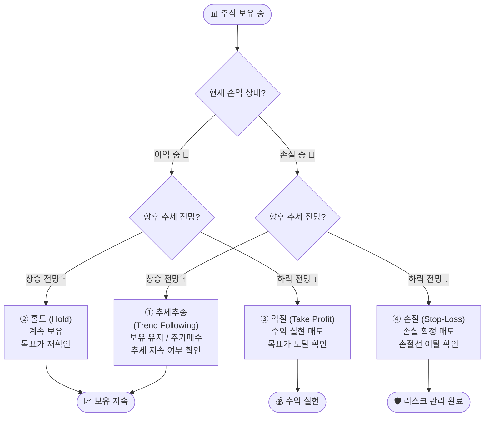

# 투자자 행동 4분면 — 홀드·손절·추세추종·익절

> **보충 자료: 주식 투자 의사결정 기초** | 📊 | 학습시간: 1시간

---

> 📺 **YouTube 강의**: [🎬 주식 손절 익절 홀드 추세추종 투자전략](https://www.youtube.com/results?search_query=주식+손절+익절+홀드+추세추종+투자전략+설명)
>
> 📝 **관련 문서**: [11.md](11.md) — 기술적 분석 II | [12.md](12.md) — 기술적 분석 I

## 이 문서에서 다루는 것

- **투자자의 4가지 핵심 행동** — 홀드(Hold), 손절(Stop-Loss), 추세추종(Trend Following), 익절(Take Profit)
- **사방(四方) 4분면 표** — 현재 손익 상태 × 향후 추세 전망으로 구분
- 각 행동의 개념, 실전 적용 기준, 심리적 함정

---

## 1. 핵심 개념 한눈에 보기

> 📺 [🎬 주식 투자 4가지 행동 핵심 개념](https://www.youtube.com/results?search_query=주식+투자+홀드+손절+익절+추세추종+개념+한국어)

주식을 보유한 투자자는 매 순간 **두 가지 질문**에 답해야 합니다.

1. **지금 내 계좌는 이익 중인가, 손실 중인가?** (현재 손익 상태)
2. **앞으로 주가는 오를 것인가, 내릴 것인가?** (향후 추세 전망)

이 두 축을 조합하면 **4가지 상황**이 만들어지고, 각 상황에서 합리적인 투자자가 취하는 행동이 달라집니다.

---

## 2. 사방(四方) 4분면 표 — 투자자 행동 매트릭스

> 📺 [🎬 투자 4분면 매트릭스](https://www.youtube.com/results?search_query=투자+4분면+매트릭스+손절+익절+홀드)

```
                    ┌─────────────────────────────────────────────────┐
                    │            향후 추세 전망: 상승 ↑              │
                    │                                                 │
      이익 중 📈    │   ② 홀드 (Hold)          ① 추세추종 📉        │  손실 중 📉
      (매수가 <      │   "수익을 더 키우자"       "흐름을 믿고 버티자" │  (매수가 >
       현재가)      │   ★ 보유 유지             ★ 보유 유지/추가매수  │   현재가)
                    ├─────────────────────────────────────────────────┤
      이익 중 📈    │   ③ 익절 (Take Profit)   ④ 손절 (Stop-Loss)   │  손실 중 📉
                    │   "이 정도면 충분해"       "더 잃기 전에 나가자" │
                    │   ★ 매도(수익 실현)        ★ 매도(손실 확정)    │
                    │                                                 │
                    │            향후 추세 전망: 하락 ↓              │
                    └─────────────────────────────────────────────────┘
```

### 정리 표

|  | **이익 중** (현재가 > 매수가) | **손실 중** (현재가 < 매수가) |
|:---:|:---:|:---:|
| **상승 전망** ↑ | ② **홀드** (계속 보유) | ① **추세추종** (보유 유지 / 추가 매수) |
| **하락 전망** ↓ | ③ **익절** (수익 실현 후 매도) | ④ **손절** (손실 확정 후 매도) |

> 💡 **핵심 원칙**: 수익이 나고 있을 때는 "전망"에 따라 홀드 vs 익절을 결정하고,  
> 손실이 나고 있을 때는 "전망"에 따라 추세추종 vs 손절을 결정합니다.

---

## 3. 4가지 행동 상세 설명

> 📺 [🎬 주식 투자 행동 상세 설명](https://www.youtube.com/results?search_query=주식+투자+행동+홀드+익절+손절+추세추종+상세+한국어)

---

### ① 추세추종 (Trend Following) — 손실 중 + 상승 전망

> 📺 [🎬 추세추종 전략](https://www.youtube.com/results?search_query=추세추종+전략+주식+한국어)

> 📖 **Wikipedia**: [추세추종](https://ko.wikipedia.org/wiki/추세_추종)

**상황**: 현재는 손실 중이지만, 장기 추세가 여전히 우상향이라고 판단될 때

| 항목 | 내용 |
|------|------|
| **행동** | 보유 유지 또는 추가 매수 (물타기와 구분 필요) |
| **논리** | "일시적 조정이며 추세는 살아있다" |
| **적용 조건** | 이동평균선(MA) 상향, 거래량 감소한 조정, 펀더멘털 훼손 없음 |
| **위험** | 추세가 꺾였는데도 착각하는 경우 → 손실 심화 |
| **실전 기준 예시** | MA20·MA60이 모두 우상향 + 현재가가 MA60 위에 있을 때 |

```
주가 흐름 예시:
  10,000원 매수 → 9,000원으로 하락 (현재 -10% 손실)
  BUT: MA20 우상향 + 거래량 감소 + 시장 전체는 건강
  → "일시 눌림목 조정" 판단 → 보유 유지 or 9,000원 추가 매수
```

> ⚠️ **주의**: 추세추종과 **무작정 물타기(평균단가 낮추기)**는 다릅니다.  
> 추세추종은 **추세가 살아있을 때**만 유효하며, 추세가 꺾인 경우 손절로 전환해야 합니다.

---

### ② 홀드 (Hold) — 이익 중 + 상승 전망

> 📺 [🎬 주식 홀드 전략](https://www.youtube.com/results?search_query=주식+홀드+보유+전략+한국어)

**상황**: 수익이 나고 있고, 앞으로도 계속 오를 것으로 전망될 때

| 항목 | 내용 |
|------|------|
| **행동** | 현재 포지션 그대로 유지 |
| **논리** | "수익을 더 키울 수 있다" |
| **적용 조건** | 목표가 미달, 추세 지속, 펀더멘털 개선 중 |
| **위험** | 탐욕으로 인해 적절한 익절 타이밍을 놓치는 경우 |
| **실전 기준 예시** | 목표주가까지 20% 여유 + 골든크로스 유지 + 실적 성장 중 |

```
주가 흐름 예시:
  10,000원 매수 → 12,000원 (현재 +20% 수익)
  목표가 15,000원 도달 전, MA 골든크로스 유지
  → "아직 덜 올랐다" 판단 → 홀드
```

> 💡 **홀드의 핵심**: 막연한 기대가 아닌 **구체적 근거(목표주가, 기술적 지표)**를 기반으로 해야 합니다.

---

### ③ 익절 (Take Profit) — 이익 중 + 하락 전망

> 📺 [🎬 주식 익절 전략](https://www.youtube.com/results?search_query=주식+익절+수익실현+전략+한국어)

**상황**: 수익이 나고 있으나, 앞으로 하락할 것으로 전망될 때

| 항목 | 내용 |
|------|------|
| **행동** | 보유 주식 매도 → 수익 실현 |
| **논리** | "지금 이익을 확정 짓자" |
| **적용 조건** | 목표가 도달, 데드크로스 출현, 거래량 급감, 실적 피크 신호 |
| **위험** | 너무 빨리 익절해서 추가 수익 놓침 (일명 "홀더 FOMO") |
| **실전 기준 예시** | 목표주가 도달 + MA60 데드크로스 + RSI 70 이상(과열) |

```
주가 흐름 예시:
  10,000원 매수 → 15,000원 (현재 +50% 수익)
  BUT: RSI 75 과열 + 거래량 급감 + 섹터 로테이션 신호
  → "상승 동력 소진" 판단 → 익절 매도
```

> 💡 **익절의 핵심**: 미리 설정한 **목표가(Target Price)**에 도달하면 기계적으로 실행.  
> "더 오를 것 같다"는 감정보다 **사전 계획**을 우선합니다.

---

### ④ 손절 (Stop-Loss) — 손실 중 + 하락 전망

> 📺 [🎬 주식 손절 전략](https://www.youtube.com/results?search_query=주식+손절+스톱로스+전략+한국어)

> 📖 **Wikipedia**: [손절매](https://ko.wikipedia.org/wiki/손절매)

**상황**: 이미 손실 중이며, 앞으로도 더 하락할 것으로 전망될 때

| 항목 | 내용 |
|------|------|
| **행동** | 보유 주식 매도 → 손실 확정 |
| **논리** | "더 잃기 전에 탈출하자" |
| **적용 조건** | 손절선 이탈, 데드크로스, 펀더멘털 훼손(적자 전환, 회계 부정 등) |
| **위험** | 심리적 저항으로 손절을 미루다 손실 더 심화 ("본전 심리") |
| **실전 기준 예시** | 매수가 대비 -8~10% 이탈 + MA60 이탈 + 거래량 급증 |

```
주가 흐름 예시:
  10,000원 매수 → 8,500원 (현재 -15% 손실)
  + 데드크로스 발생 + 기업 실적 하향
  → "추세 반전" 판단 → 8,500원에 손절 매도
  (8,000원, 7,000원으로 더 빠지기 전에 손실 확정)
```

> ⚠️ **손절의 핵심**: 손절은 **실패가 아니라 리스크 관리**입니다.  
> 1억 원을 투자해 50% 손실(-5,000만 원)이 나면, 원금 회복에 +100% 수익이 필요합니다.  
> 반면 10% 손절(-1,000만 원)이면 +11% 수익으로 회복 가능합니다.

---

## 4. 손실·수익률 회복 비대칭성

> 📺 [🎬 주식 손실 회복 비대칭성](https://www.youtube.com/results?search_query=주식+손실+회복+비대칭성+복리+한국어)

손절이 중요한 이유를 수치로 이해합니다.

| 손실률 | 원금 회복에 필요한 수익률 |
|:------:|:------------------------:|
| -5%   | +5.3%                    |
| -10%  | +11.1%                   |
| -20%  | +25.0%                   |
| -30%  | +42.9%                   |
| -50%  | +100.0%                  |
| -70%  | +233.3%                  |
| -90%  | +900.0%                  |

> 💡 **손실이 클수록 회복이 기하급수적으로 어려워집니다.**  
> 작은 손절이 큰 손실보다 훨씬 빠른 회복을 가능하게 합니다.

---

## 5. 실전 의사결정 흐름도

> 📺 [🎬 주식 투자 의사결정 흐름도](https://www.youtube.com/results?search_query=주식+투자+의사결정+프로세스+한국어)



---

## 6. 추세 전망 판단 기준

> 📺 [🎬 주식 추세 판단 기준](https://www.youtube.com/results?search_query=주식+추세+판단+이동평균+RSI+MACD+한국어)

"향후 추세가 상승인지 하락인지"를 판단하는 기술적 기준입니다.

| 지표 | 상승 전망 신호 | 하락 전망 신호 |
|------|:--------------:|:--------------:|
| **이동평균선(MA)** | 골든크로스(MA20 > MA60 상향 돌파) | 데드크로스(MA20 < MA60 하향 이탈) |
| **RSI** | 30~50 구간 반등 (과매도 탈출) | 70 이상 → 하락 전환 (과매수) |
| **MACD** | MACD선 > 시그널선 상향 돌파 | MACD선 < 시그널선 하향 이탈 |
| **거래량** | 상승 시 거래량 증가 | 하락 시 거래량 급증 (공황 매도) |
| **지지/저항** | 지지선 유지 + 저항선 돌파 | 지지선 붕괴 |
| **펀더멘털** | 실적 개선, 목표주가 상향 | 실적 하향, 회계 이슈, 섹터 약화 |

---

## 7. 투자자가 빠지기 쉬운 심리적 함정

> 📺 [🎬 투자 심리 함정](https://www.youtube.com/results?search_query=투자+심리+함정+손실+회피+편향+한국어)

> 📖 **Wikipedia**: [행동경제학](https://ko.wikipedia.org/wiki/행동경제학) · [손실 회피](https://ko.wikipedia.org/wiki/손실_회피)

| 함정 | 설명 | 올바른 대응 |
|------|------|-------------|
| **본전 심리** | "본전만 되면 팔겠다"며 손절을 미룸 | 미리 손절선을 설정하고 기계적 실행 |
| **이익 조기 실현** | 수익이 조금 나면 급하게 익절 → 큰 수익 포기 | 목표가까지 홀드 계획을 사전에 수립 |
| **손실 회피 편향** | 손실이 확정되는 것이 두려워 손절 못 함 | 손절은 손실 확정이 아닌 자본 보호임을 인식 |
| **확증 편향** | 내가 사면 오를 것이라는 믿음 | 반대 시나리오도 항상 검토 |
| **군중 심리** | 남들이 사니까 사고, 남들이 파니까 팜 | 자신의 매수 근거와 손절선을 명확히 설정 |
| **무작정 물타기** | 손실 중에 평균단가를 낮추려 추가 매수 | 추세 확인 후 추세추종과 구분하여 실행 |

---

## 8. 투자자 행동 체크리스트

> 📺 [🎬 투자 체크리스트](https://www.youtube.com/results?search_query=주식+투자+체크리스트+매수+매도+한국어)

주식을 매수하기 전 미리 아래 항목을 결정합니다.

```
✅ 매수 전 설정 항목
┌────────────────────────────────────┬────────────────────────────┐
│ 항목                               │ 나의 기준                  │
├────────────────────────────────────┼────────────────────────────┤
│ 매수 근거 (왜 사는가?)             │ 예) 실적 개선 + 골든크로스 │
│ 목표주가 (익절 기준)               │ 예) 매수가 대비 +20%       │
│ 손절선 (손절 기준)                 │ 예) 매수가 대비 -8%        │
│ 투자 기간                          │ 예) 3개월 단기 스윙        │
│ 추세 지속 판단 기준                │ 예) MA60 이탈 시 재검토    │
└────────────────────────────────────┴────────────────────────────┘
```

---

## 9. 요약 정리

> 📺 [🎬 투자 전략 요약 정리](https://www.youtube.com/results?search_query=주식+투자+전략+요약+정리+한국어)

| 행동 | 현재 상태 | 전망 | 핵심 한마디 |
|------|:---------:|:----:|-------------|
| **① 추세추종** | 손실 중 | 상승 ↑ | "일시 조정, 추세는 살아있다 → 보유/추가매수" |
| **② 홀드** | 이익 중 | 상승 ↑ | "아직 목표가에 못 미쳤다 → 계속 보유" |
| **③ 익절** | 이익 중 | 하락 ↓ | "지금이 팔 때다 → 수익 실현" |
| **④ 손절** | 손실 중 | 하락 ↓ | "더 잃기 전에 나가자 → 손실 확정" |

> 🎯 **투자의 핵심**: 감정이 아닌 **사전에 설정한 기준**으로 행동합니다.  
> 수익이 나고 있어도 하락이 예상되면 익절, 손실이 나도 추세가 살아있으면 추세추종.  
> 자신의 판단 기준을 명확히 세우고 **일관성** 있게 실행하는 것이 장기 투자 성공의 열쇠입니다.

---

## 해보기 활동

> 📺 [🎬 해보기 활동](https://www.youtube.com/results?search_query=해보기+활동+한국어)

1. 관심 종목 하나를 골라 현재 매수가 대비 손익 상태와 이동평균선 방향을 확인한 후, 위 4분면 표 중 어디에 해당하는지 분류해보세요.
2. 가상으로 1,000만 원을 특정 종목에 투자한다고 가정하고, 목표주가(익절가)와 손절선을 미리 설정해보세요.
3. 과거에 손절하지 못해서 손실이 커진 경험이 있다면, 그 당시 어떤 심리적 함정(본전 심리, 확증 편향 등)이 작동했는지 분석해보세요.
4. 손실률 회복 비대칭 표를 보고, -30% 손실을 만회하려면 얼마의 수익률이 필요한지 직접 계산해 확인해보세요.
