# Day 043 — 경제지표 분석 (물가, 유가 등)

> **모듈 7: 투자분석 기초 방법론** | 2/10일차 | 💹 | 학습시간: 8시간

---

> 📺 **YouTube 강의**: [🎬 경제지표 분석 물가 유가 환율](https://www.youtube.com/results?search_query=경제지표+분석+물가+유가+환율+한국어+투자)

## 오늘 배울 것

- 소비자물가지수(CPI)와 생산자물가지수(PPI)
- 유가(WTI, 브렌트유) 분석
- 환율과 주가의 관계
- 실업률, GDP 성장률 지표 해석
- 실습: 주요 경제지표 데이터 수집 및 상관관계 분석

---

### 1. 소비자물가지수(CPI)와 생산자물가지수(PPI)

**CPI (Consumer Price Index, 소비자물가지수)**

소비자가 실제로 구매하는 상품·서비스 바구니의 가격 변화를 측정하는 지표입니다.

- 기준: 특정 연도를 100으로 설정해 상대적 변화를 나타냄
- 발표: 한국 통계청 (월 1회), 미국 BLS (월 1회)
- **핵심 근원물가(Core CPI)**: 에너지·식품을 제외한 CPI → 변동성이 낮아 추세 파악에 유리

**CPI 수치별 중앙은행 반응**

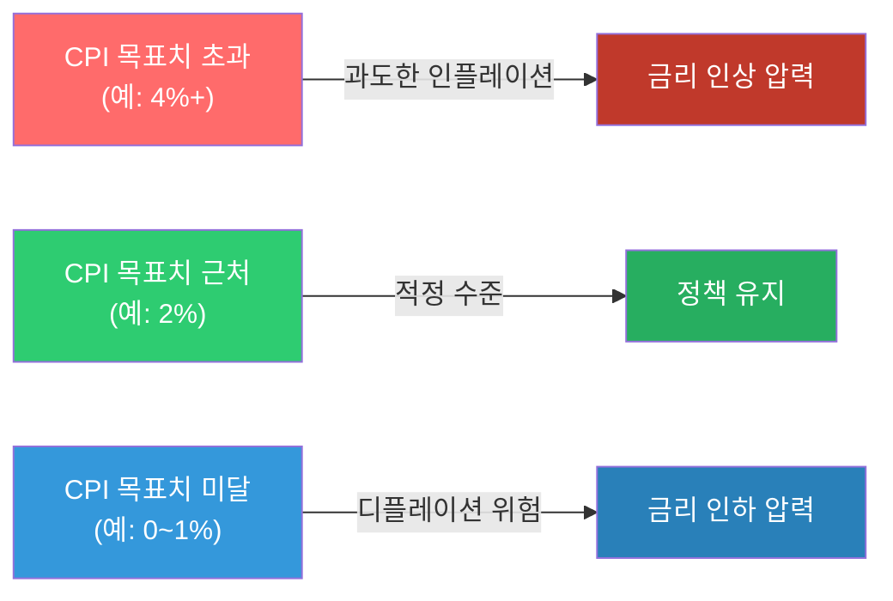

> 📺 [🎬 소비자물가지수 CPI 뜻 설명](https://www.youtube.com/results?search_query=소비자물가지수+CPI+인플레이션+한국어+설명)

**PPI (Producer Price Index, 생산자물가지수)**

기업이 생산·판매하는 상품의 가격 변화를 측정합니다. CPI보다 **선행성**이 있어 미래 물가를 예측하는 데 사용됩니다.

**PPI → CPI 파급 경로**


> 📺 [🎬 PPI 생산자물가지수 CPI 차이](https://www.youtube.com/results?search_query=PPI+생산자물가지수+CPI+차이+한국어)

```python
# CPI 변화율(인플레이션율) 계산 예시
cpi_monthly = [104.5, 105.2, 104.8, 106.3, 107.1, 108.0]

# 전월 대비 변화율 (MoM)
mom = [(cpi_monthly[i] - cpi_monthly[i-1]) / cpi_monthly[i-1] * 100
       for i in range(1, len(cpi_monthly))]

# 연율 환산 (MoM * 12)
annualized = [m * 12 for m in mom]

for i, (m, a) in enumerate(zip(mom, annualized)):
    print(f"{i+2}월: MoM {m:.2f}%  |  연율환산 {a:.1f}%")
```

#### 🔗 Python 소스 연계

이 섹션의 물가지표(CPI)는 웹앱의 **거시경제현황 1 (실시간)** 탭에서 직접 확인할 수 있습니다.

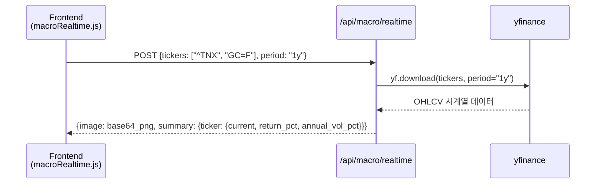

| API 파라미터 | 값 예시 | 설명 |
|---|---|---|
| `tickers` | `["^TNX"]` | 미국 10년물 국채금리 (금리 인상/인하 신호) |
| `period` | `"1y"`, `"6mo"`, `"3mo"` | 조회 기간 |

---

### 2. 유가(WTI, 브렌트유) 분석

**WTI vs 브렌트유**

| 구분 | WTI (West Texas Intermediate) | 브렌트유 (Brent Crude) |
|------|-------------------------------|------------------------|
| 원산지 | 미국 텍사스 | 북해 |
| 기준 시장 | NYMEX (뉴욕) | ICE (런던) |
| 특징 | 미국 기준 원유, 경질유 | 글로벌 기준 원유 (세계 원유 70%+ 기준) |
| 가격 차이 | 보통 WTI가 $1~3 저렴 | — |

> 📺 [🎬 WTI 브렌트유 차이 원유 투자](https://www.youtube.com/results?search_query=WTI+브렌트유+차이+원유가격+한국어)

**유가 상승 시 경제 파급 경로**

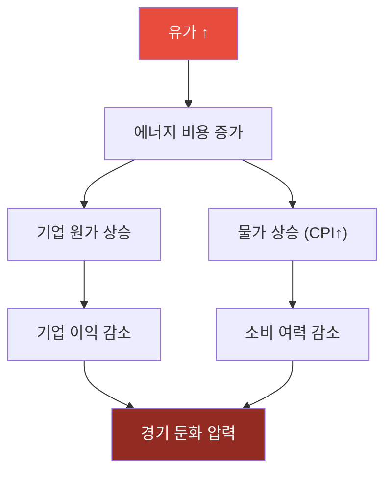

**유가 하락 시 경제 파급 경로**

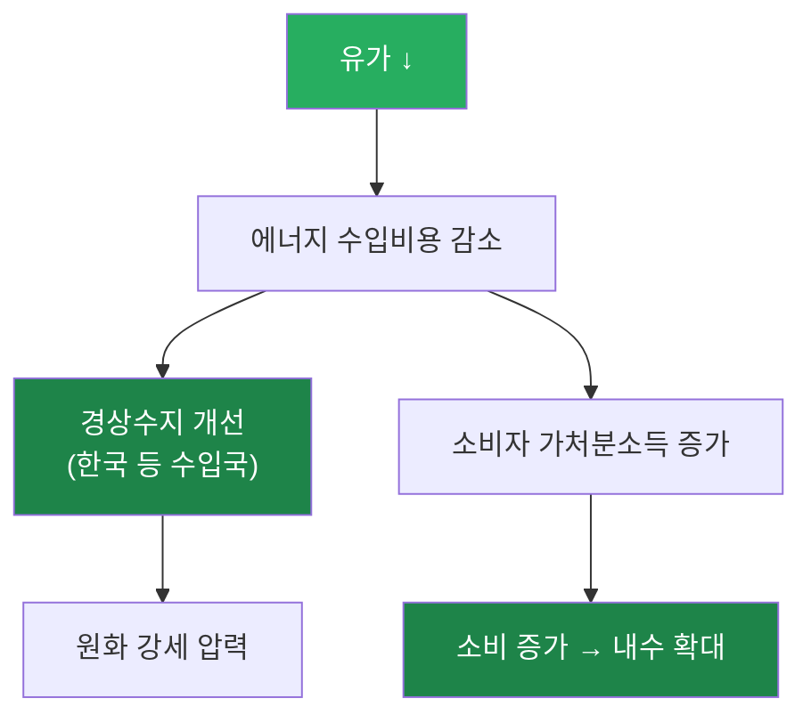

**산업별 유가 영향**

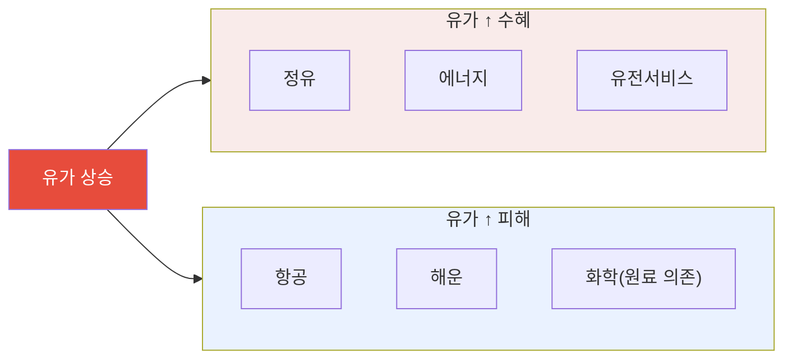

> 📺 [🎬 유가 상승 하락 주식시장 영향](https://www.youtube.com/results?search_query=유가+주식+영향+에너지+섹터+한국어)

```python
import yfinance as yf
import pandas as pd

# WTI 원유 선물 가격 (CL=F) 수집
oil = yf.download("CL=F", start="2022-01-01", end="2024-12-31", auto_adjust=True)["Close"]

# 20일 이동평균 추가
oil_ma20 = oil.rolling(20).mean()

print(f"최근 종가: ${oil.iloc[-1]:.2f}/배럴")
print(f"20일 이동평균: ${oil_ma20.iloc[-1]:.2f}/배럴")
print(f"52주 최고: ${oil[-252:].max():.2f}")
print(f"52주 최저: ${oil[-252:].min():.2f}")
```

#### 🔗 Python 소스 연계

웹앱 **거시경제현황 1 (실시간)** 에서 WTI 유가를 실시간으로 조회합니다.

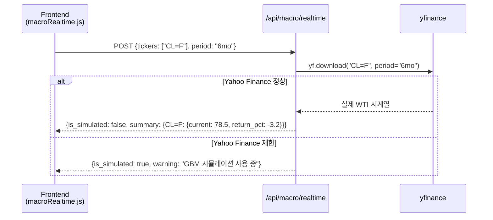

| API 파라미터 | 유가 조회용 값 |
|---|---|
| `tickers` | `["CL=F"]` (WTI 선물) |
| `period` | `"1y"` (연간 추세 파악 권장) |

---

### 3. 환율과 주가의 관계

**환율의 기본 개념**

환율은 두 통화의 교환 비율입니다. 원/달러 환율이 1,350원이라면, 달러 1개를 사려면 1,350원이 필요하다는 뜻입니다.

**원화 약세(환율 ↑) 파급 경로**

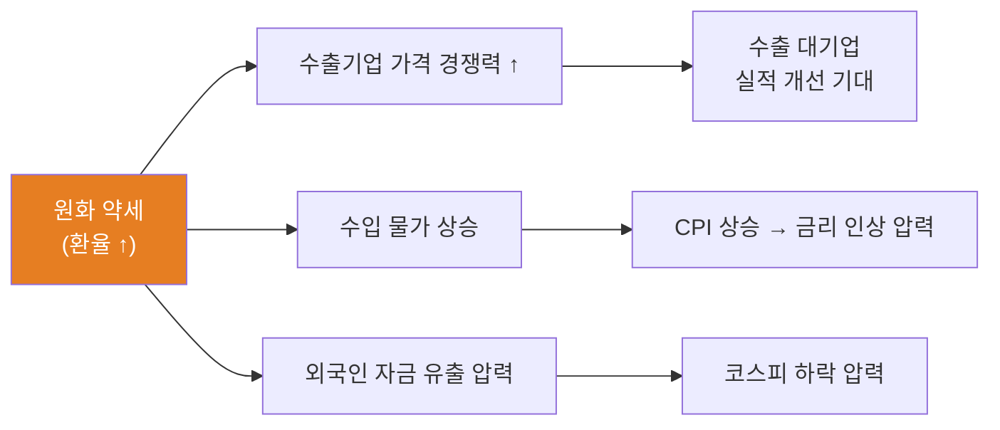

**원화 강세(환율 ↓) 파급 경로**

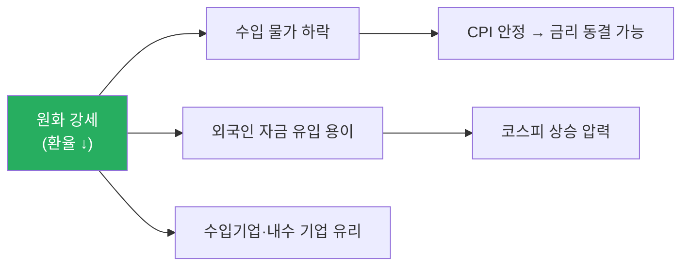

**코스피와 환율의 상호작용**

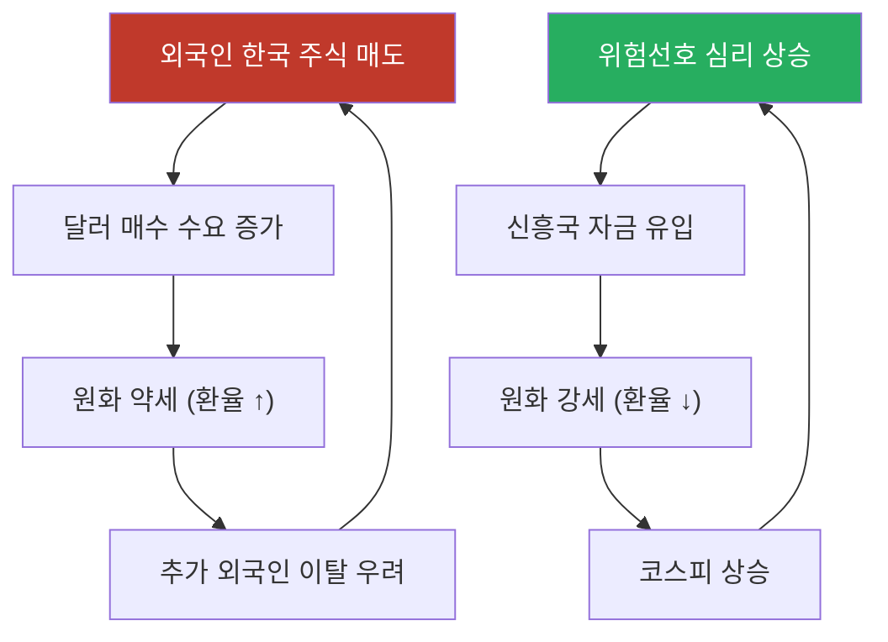

> 📺 [🎬 원달러 환율 주식 관계](https://www.youtube.com/results?search_query=원달러+환율+주식시장+관계+한국어)

> 📺 [🎬 외국인 투자자 환율 코스피 영향](https://www.youtube.com/results?search_query=외국인+투자자+코스피+환율+한국어)

```python
import yfinance as yf
import pandas as pd
import numpy as np

# 원달러 환율 (KRW=X) 및 코스피 ETF (EWY)
usdkrw = yf.download("KRW=X", start="2020-01-01", end="2024-12-31", auto_adjust=True)["Close"]
kospi  = yf.download("EWY",   start="2020-01-01", end="2024-12-31", auto_adjust=True)["Close"]

df = pd.DataFrame({"환율": usdkrw, "코스피ETF": kospi}).dropna()

correlation = df["환율"].corr(df["코스피ETF"])
print(f"원달러 환율 vs 코스피ETF 상관계수: {correlation:.3f}")
print("(음수: 환율 상승 시 코스피 하락 경향)")
```

#### 🔗 Python 소스 연계

환율(USD/KRW)과 코스피를 동시에 조회해 상관관계를 웹앱에서 시각화합니다.

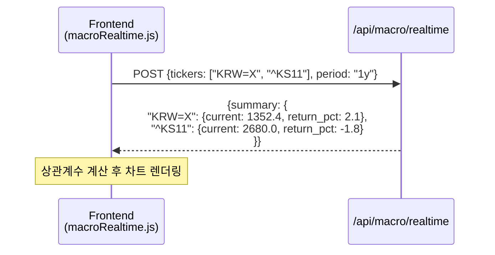

| 환율·주가 동시 조회 파라미터 | 설명 |
|---|---|
| `"KRW=X"` | 달러/원 환율 |
| `"^KS11"` | KOSPI 지수 |
| `"EWY"` | iShares MSCI Korea ETF (대안) |

---

### 4. 실업률, GDP 성장률 지표 해석

**GDP 성장률 (Gross Domestic Product Growth Rate)**

GDP는 일정 기간 국내에서 생산된 모든 재화·서비스의 시장 가치 합계입니다.

- **성장률 = (금기 GDP - 전기 GDP) / 전기 GDP × 100**
- 분기별 발표 (QoQ: 전분기 대비, YoY: 전년 동기 대비)

**GDP 성장률 구간별 신호**

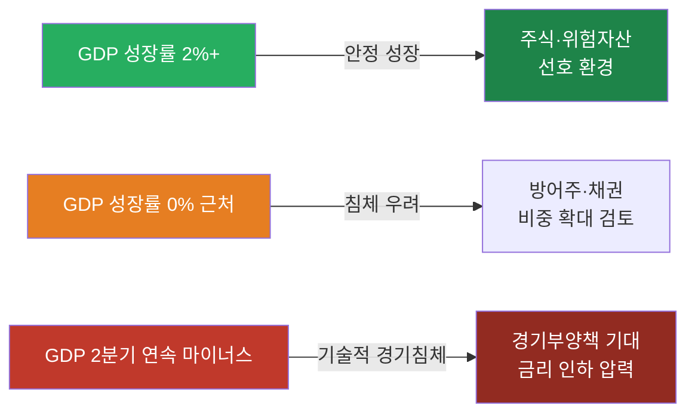

> 📺 [🎬 GDP 성장률 경기침체 투자](https://www.youtube.com/results?search_query=GDP+성장률+경기침체+주식투자+한국어)

**실업률 (Unemployment Rate)**

경제활동인구 중 일할 의사가 있으나 직업이 없는 사람의 비율입니다.

**실업률 신호와 시장 반응**

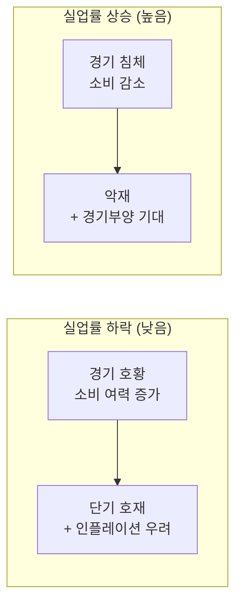

> 📺 [🎬 미국 실업률 비농업고용지수 주식](https://www.youtube.com/results?search_query=미국+실업률+비농업고용+주식시장+한국어)

**미국 고용지표 발표 순서**


| 지표 | 발표 시기 | 핵심 수치 |
|------|-----------|-----------|
| 비농업 고용(NFP) | 매월 첫째 금요일 | 전월 대비 증감 인원 |
| 실업률 | NFP 동시 발표 | % |
| ADP 민간 고용 | NFP 발표 2일 전 수요일 | 선행 지표 |

#### 🔗 Python 소스 연계

GDP·실업률은 yfinance로 직접 수집되지 않지만, 금리(채권 수익률)를 프록시 지표로 활용해 웹앱에서 조회할 수 있습니다.

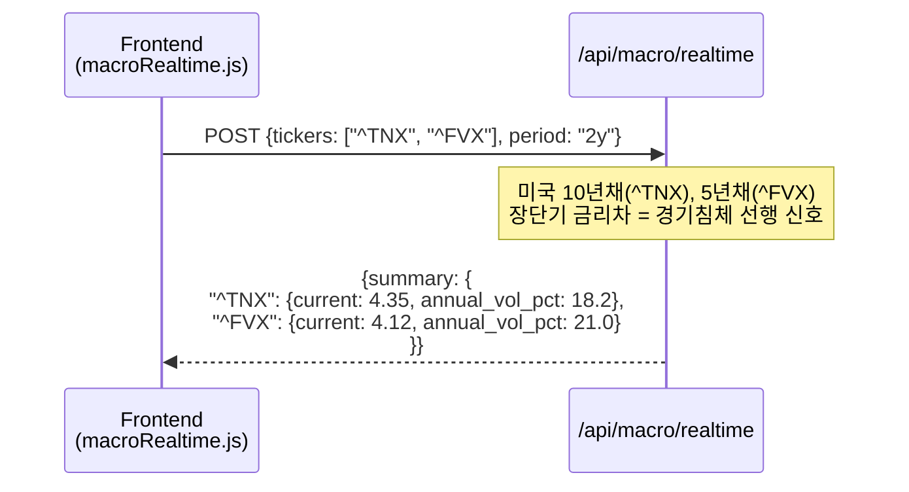

---

### 5. 실습: 주요 경제지표 상관관계 분석

```python
import yfinance as yf
import pandas as pd
import matplotlib.pyplot as plt
import seaborn as sns

tickers = {
    "WTI유가":   "CL=F",
    "달러인덱스": "DX-Y.NYB",
    "미국10년채": "^TNX",
    "S&P500":    "^GSPC",
    "금":        "GC=F",
}

prices = {}
for name, ticker in tickers.items():
    data = yf.download(ticker, start="2021-01-01", end="2024-12-31",
                       auto_adjust=True, progress=False)["Close"]
    prices[name] = data

df = pd.DataFrame(prices).dropna()
returns = df.pct_change().dropna()  # 일간 수익률 변환

# 상관계수 히트맵
plt.figure(figsize=(8, 6))
sns.heatmap(returns.corr(), annot=True, fmt=".2f",
            cmap="RdYlGn", center=0, vmin=-1, vmax=1)
plt.title("주요 경제지표 간 상관관계 (일간 수익률 기준)")
plt.tight_layout()
plt.savefig("macro_correlation.png", dpi=150, bbox_inches="tight")
plt.show()
```

#### 🔗 Python 소스 연계

위 실습 코드의 5개 티커를 그대로 웹앱 API에 전달해 동일한 데이터를 가져올 수 있습니다.

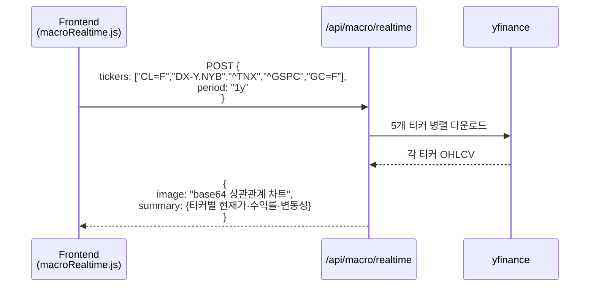

---

## 웹앱 실습 연계

Python Quant Lab 웹앱의 두 거시경제 탭을 활용해 이 챕터의 개념을 직접 확인해보세요.

### 거시경제현황 1 (실시간) — `/api/macro/realtime`

실제 Yahoo Finance 데이터를 받아 차트와 요약 통계를 반환합니다. Yahoo Finance가 제한되면 GBM 시뮬레이션으로 자동 대체됩니다.

**API 요청 구조**

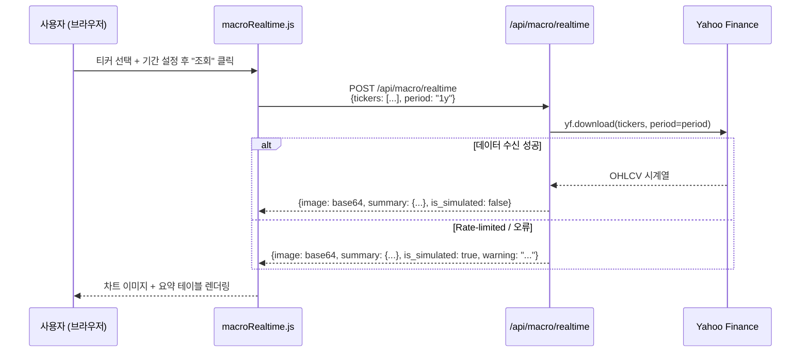

**주요 경제지표별 티커 조합 예시**

| 분석 목적 | tickers 파라미터 | period |
|---|---|---|
| 금리·물가 동향 | `["^TNX", "^FVX", "GC=F"]` | `"2y"` |
| 유가·달러 관계 | `["CL=F", "DX-Y.NYB"]` | `"1y"` |
| 한국 거시지표 | `["KRW=X", "^KS11", "^TNX"]` | `"1y"` |
| 전체 거시 대시보드 | `["^GSPC", "^KS11", "CL=F", "GC=F", "KRW=X", "^TNX"]` | `"1y"` |

**응답 데이터 구조**

```python
# /api/macro/realtime 응답 예시
response = {
    "image": "<base64 PNG 문자열>",        # 멀티 패널 차트
    "summary": {
        "^TNX":  {"current": 4.35, "return_pct": -2.1, "annual_vol_pct": 18.2},
        "CL=F":  {"current": 78.5, "return_pct":  3.4, "annual_vol_pct": 31.7},
        "GC=F":  {"current": 2310.0, "return_pct": 12.1, "annual_vol_pct": 14.5},
        "KRW=X": {"current": 1352.4, "return_pct":  2.8, "annual_vol_pct":  8.3},
        "^GSPC": {"current": 5200.0, "return_pct": 18.5, "annual_vol_pct": 15.0},
        "^KS11": {"current": 2680.0, "return_pct": -1.8, "annual_vol_pct": 17.6},
    },
    "period": "1y",
    "is_simulated": False,
    "warning": None
}
```

### 거시경제현황 2 (시뮬레이션) — `/api/macro/simulation`

GBM 기반 4단계 경기 사이클을 시뮬레이션해 학습용 데이터를 생성합니다. 실제 데이터가 없어도 경기 국면별 지표 움직임을 관찰할 수 있습니다.

```python
# /api/macro/simulation 요청 예시
import requests

response = requests.post("http://localhost:8000/api/macro/simulation", json={
    "n_days": 252,   # 시뮬레이션 기간 (영업일 기준, 252 = 1년)
    "seed": 42       # 재현 가능한 난수 시드
})

data = response.json()
# 반환: 기준금리, CPI, WTI, USD/KRW, KOSPI, S&P500 시계열
```

---

## 해보기 활동

1. 미국 CPI 발표일을 [Economic Calendar](https://www.youtube.com/results?search_query=미국+경제지표+발표+캘린더+일정+한국어)로 확인하고, 최근 발표치가 예상치보다 높았는지 낮았는지 적어보세요.
2. 위 실습 코드를 실행해서 WTI유가와 달러인덱스의 상관계수를 확인하고, 왜 그런 관계가 나타나는지 설명해보세요.
3. 유가·환율·금리 중 하나를 골라 최근 3개월 변화 방향이 주식시장에 어떤 영향을 줬는지 한 단락으로 정리해보세요.

## 다음 시간 미리보기

➡️ [Day 044](29.md) 에서 계속됩니다 — 경기 사이클, 선행/동행/후행 지표, 통화량(M1·M2) 분석 실습
