# Day 044 — 거시경제 상황 분석 실습

> **모듈 7: 투자분석 기초 방법론** | 3/10일차 | 💹 | 학습시간: 8시간

---

> 📺 **YouTube 강의**: [🎬 거시경제 상황 분석 실습](https://www.youtube.com/results?search_query=거시경제+분석+실습+경제지표+파이썬+한국어)

## 오늘 배울 것

- 경기 사이클(Expansion, Peak, Contraction, Trough) 이해
- 경기 선행/동행/후행 지표
- 통화량(M1, M2)과 유동성 분석
- 실습: 거시경제 대시보드 구성 및 현황 분석

---

### 1. 경기 사이클(Expansion, Peak, Contraction, Trough) 이해

경기는 끊임없이 순환합니다. 이 사이클을 이해하면 **지금이 어느 국면인지** 파악해 투자 전략을 조정할 수 있습니다.

**4단계 경기 사이클**

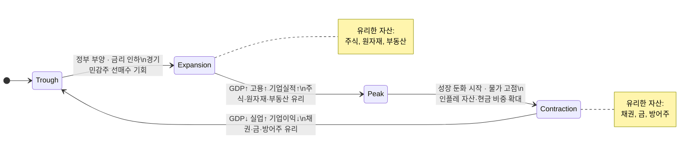

**국면별 투자 전략 요약**

| 국면 | 경제 특징 | 유리한 자산 |
|------|-----------|-------------|
| **Expansion(확장)** | GDP↑, 고용↑, 기업실적↑ | 주식, 원자재, 부동산 |
| **Peak(정점)** | 성장 둔화 시작, 물가 고점 | 인플레 자산, 현금 비중 확대 |
| **Contraction(수축)** | GDP↓, 실업↑, 기업이익↓ | 채권, 금, 방어주 |
| **Trough(저점)** | 침체 바닥, 정부 부양 시작 | 경기민감주 선매수 기회 |

> 📺 [🎬 경기 사이클 투자 전략](https://www.youtube.com/results?search_query=경기사이클+투자전략+확장+수축+한국어)

**경기 사이클별 섹터 로테이션**

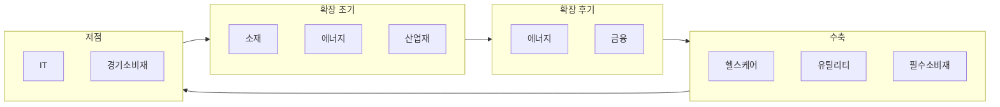

| 국면 | 유리한 섹터 | 불리한 섹터 |
|------|-------------|-------------|
| 확장 초기 | 소재, 에너지, 산업재 | 유틸리티, 필수소비재 |
| 확장 후기 | 에너지, 금융 | 기술, 소비재 |
| 수축 | 헬스케어, 유틸리티, 필수소비재 | 에너지, 소재, 금융 |
| 저점 | IT, 경기소비재 | 필수소비재 |

> 📺 [🎬 섹터 로테이션 경기 사이클](https://www.youtube.com/results?search_query=섹터로테이션+경기사이클+주식투자+한국어)

#### 🔗 Python 소스 연계

웹앱의 **거시경제현황 2 (시뮬레이션)** 탭은 GBM 기반 4단계 경기 사이클을 직접 시뮬레이션합니다. 각 국면은 `mu` 배수로 구현됩니다.

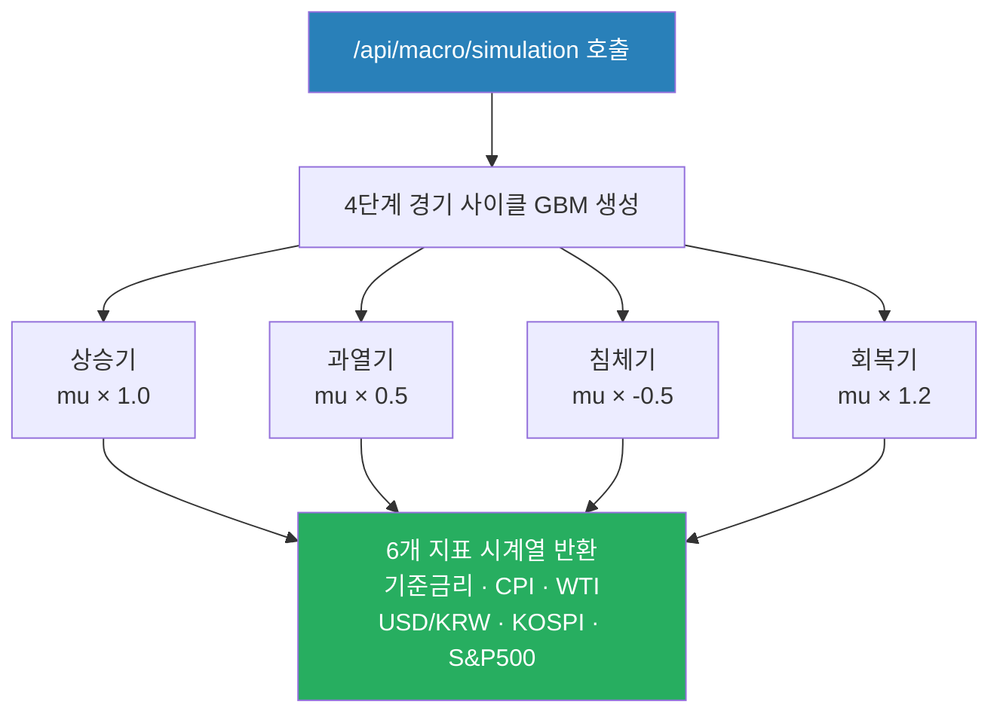

```python
# 웹앱 시뮬레이션 API 호출 예시
import requests

# 1년(252 영업일) 시뮬레이션
response = requests.post("http://localhost:8000/api/macro/simulation", json={
    "n_days": 252,
    "seed": 42       # 동일 seed → 재현 가능
})
data = response.json()
# data["image"] : 6개 지표 멀티 패널 차트 (base64 PNG)
```

---

### 2. 경기 선행/동행/후행 지표

경기지표는 **언제 경기를 반영하는지**에 따라 세 가지로 나뉩니다.

**3종 지표의 시간 관계**

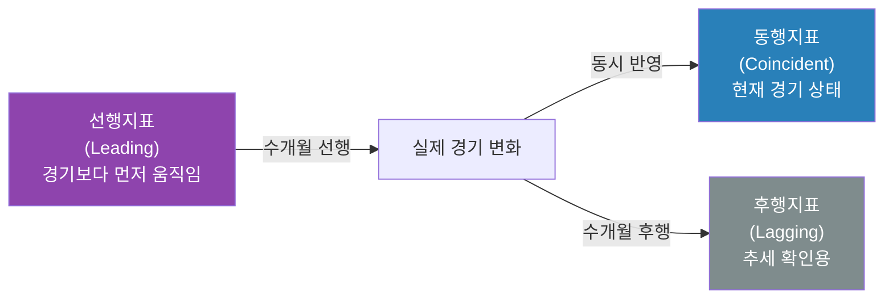

**선행지표 (Leading Indicators)**

경기보다 먼저 움직이는 지표 — 미래 경기를 예측하는 데 활용합니다.

| 지표 | 설명 |
|------|------|
| 주가지수 | 미래 기업 실적 기대를 반영 |
| 건축허가 건수 | 미래 건설투자 선행 |
| ISM 제조업 PMI | 기업 구매관리자 경기 전망 |
| 소비자 기대지수 | 향후 소비 의향 반영 |
| 장단기 금리 스프레드 | 역전 시 경기침체 신호 |

**장단기 금리 역전 → 경기침체 경로**

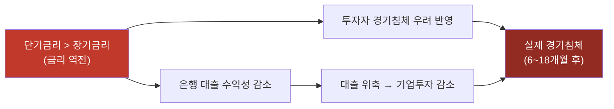

> 📺 [🎬 경기선행지수 PMI 금리스프레드 설명](https://www.youtube.com/results?search_query=경기선행지수+PMI+금리스프레드+경기예측+한국어)

**동행지표 (Coincident Indicators)**

현재 경기 상황을 나타내는 지표입니다.

| 지표 | 설명 |
|------|------|
| GDP | 현재 경제 규모 |
| 산업생산지수 | 실제 생산량 현황 |
| 취업자 수 | 노동시장 실제 상태 |
| 소매판매 | 실제 소비 상황 |

**후행지표 (Lagging Indicators)**

경기 변화 후 나중에 반영되는 지표 — 추세 확인용입니다.

| 지표 | 설명 |
|------|------|
| 실업률 | 해고 후 한참 지나서 반영 |
| 대출 잔액 | 경기 이후 금융 반응 |
| CPI | 물가는 경기 후행 |

> 📺 [🎬 경기 선행 동행 후행 지표 차이](https://www.youtube.com/results?search_query=경기+선행지표+동행지표+후행지표+투자+한국어)

#### 🔗 Python 소스 연계

장단기 금리 스프레드(경기침체 선행 신호)를 실시간으로 조회하는 방법입니다.

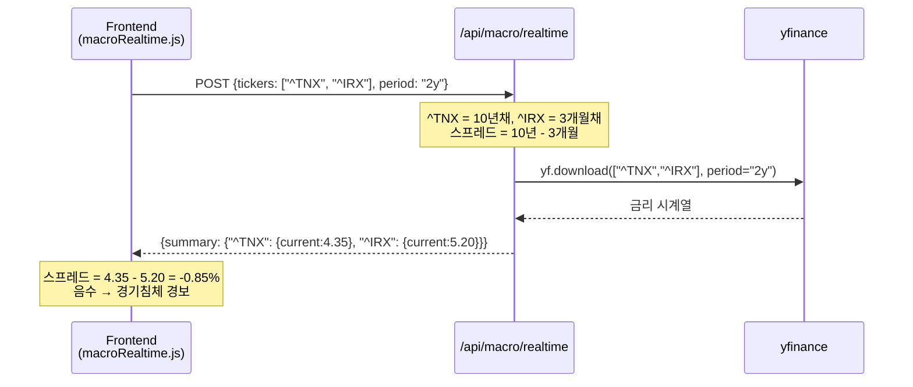

---

### 3. 통화량(M1, M2)과 유동성 분석

**통화량의 종류**

중앙은행은 얼마나 많은 돈이 경제에 돌아다니는지를 단계별로 측정합니다.

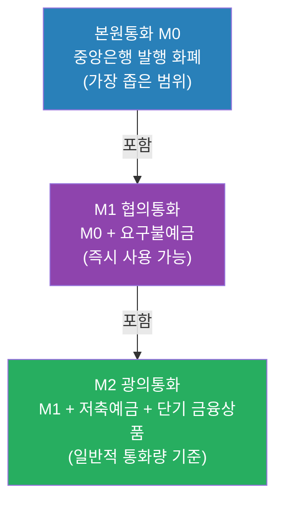

| 구분 | 포함 내용 | 특징 |
|------|-----------|------|
| **본원통화(M0)** | 중앙은행이 발행한 화폐 | 가장 좁은 범위 |
| **M1 (협의통화)** | 현금 + 요구불예금 | 즉시 사용 가능한 돈 |
| **M2 (광의통화)** | M1 + 저축예금 + 단기 금융상품 | 일반적인 통화량 기준 |

> 📺 [🎬 통화량 M1 M2 유동성 설명](https://www.youtube.com/results?search_query=통화량+M1+M2+유동성+중앙은행+한국어)

**양적완화(QE)와 양적긴축(QT) 파급 경로**

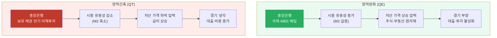

> 📺 [🎬 양적완화 양적긴축 차이 주식](https://www.youtube.com/results?search_query=양적완화+양적긴축+QE+QT+주식시장+한국어)

**M2 증가율과 자산 시장 관계**

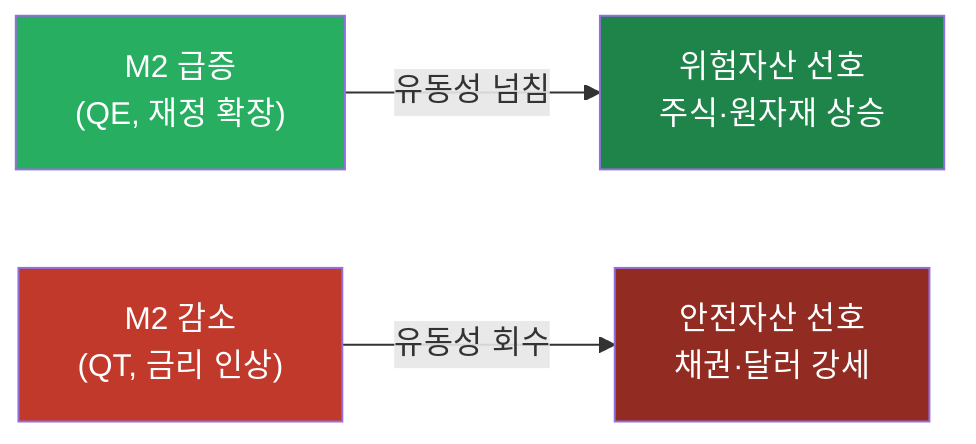

#### 🔗 Python 소스 연계

통화량 M2 데이터는 yfinance가 아닌 FRED(연방준비은행 경제 데이터)에서 제공됩니다. 웹앱 시뮬레이션은 M2 효과를 GBM의 드리프트 파라미터(mu)로 모델링합니다.

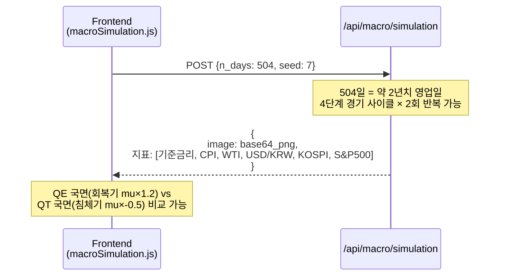

---

### 4. 실습: 거시경제 대시보드 구성 및 현황 분석

아래 코드는 주요 거시경제 지표를 한 화면에 모아 보는 대시보드입니다.

```python
import yfinance as yf
import pandas as pd
import matplotlib.pyplot as plt
import matplotlib.gridspec as gridspec

# 주요 지표 티커 정의
indicators = {
    "S&P500":      "^GSPC",
    "미국10년채":   "^TNX",
    "WTI유가":     "CL=F",
    "금":           "GC=F",
    "달러인덱스":   "DX-Y.NYB",
    "VIX(공포)":   "^VIX",
}

start, end = "2022-01-01", "2024-12-31"
data = {}
for name, ticker in indicators.items():
    d = yf.download(ticker, start=start, end=end,
                    auto_adjust=True, progress=False)["Close"]
    data[name] = d

fig = plt.figure(figsize=(16, 10))
fig.suptitle("거시경제 대시보드", fontsize=14, fontweight="bold")
gs = gridspec.GridSpec(3, 2, figure=fig, hspace=0.45, wspace=0.3)

colors = ["steelblue", "crimson", "darkorange", "gold", "green", "purple"]
for idx, (name, series) in enumerate(data.items()):
    ax = fig.add_subplot(gs[idx // 2, idx % 2])
    ax.plot(series.index, series.values, color=colors[idx], linewidth=1.2)
    ax.set_title(name, fontsize=10)
    ax.grid(True, alpha=0.3)
    ax.tick_params(axis="x", rotation=30, labelsize=7)

plt.savefig("macro_dashboard.png", dpi=150, bbox_inches="tight")
plt.show()

# 현재 수준 요약 출력
print("\n=== 주요 지표 현재 수준 ===")
for name, series in data.items():
    latest = series.dropna().iloc[-1]
    change_1m = (latest - series.dropna().iloc[-22]) / series.dropna().iloc[-22] * 100
    print(f"{name:<12}: {latest:>10.2f}  |  1개월 변화: {change_1m:+.1f}%")
```

#### 🔗 Python 소스 연계

위 대시보드의 6개 티커를 웹앱 실시간 API로 그대로 조회할 수 있습니다.

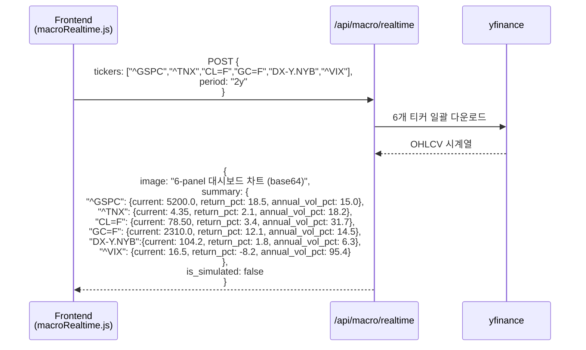

---

## 웹앱 실습 연계

이 챕터의 개념은 Python Quant Lab 웹앱의 두 거시경제 탭으로 직접 체험할 수 있습니다.

### 거시경제현황 1 (실시간) — `/api/macro/realtime`

실제 Yahoo Finance 데이터를 이용해 선행·동행·후행 지표를 한 번에 조회합니다.

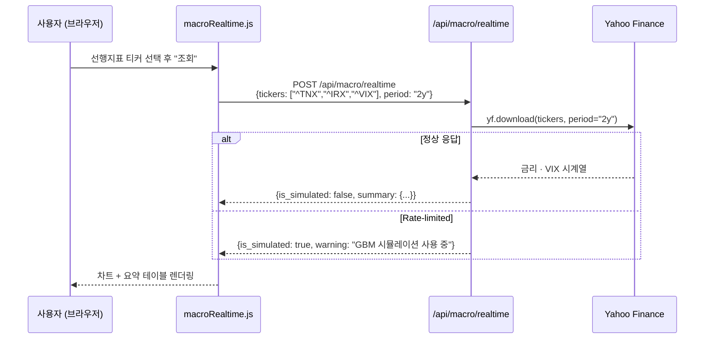

**경기 사이클 국면별 추천 티커 조합**

| 분석 목적 | tickers | period |
|---|---|---|
| 선행지표 모니터링 | `["^TNX", "^IRX", "^VIX", "^GSPC"]` | `"2y"` |
| 동행지표 확인 | `["^GSPC", "^KS11", "CL=F"]` | `"1y"` |
| 후행지표 추적 | `["^TNX", "GC=F", "KRW=X"]` | `"3y"` |
| QE/QT 영향 분석 | `["^GSPC", "GC=F", "^TNX", "DX-Y.NYB"]` | `"5y"` |

### 거시경제현황 2 (시뮬레이션) — `/api/macro/simulation`

GBM 4단계 경기 사이클 시뮬레이션으로 섹터 로테이션 전략을 연습합니다.

**시뮬레이션 내부 경기 사이클 구조**

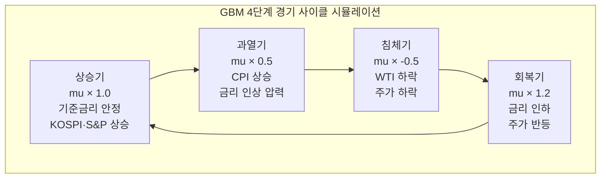

**시뮬레이션 API 파라미터 실습 예시**

```python
import requests

# 시나리오 1: 단기 경기 사이클 1회 (약 1년)
short_cycle = requests.post("http://localhost:8000/api/macro/simulation", json={
    "n_days": 252,
    "seed": 1
}).json()

# 시나리오 2: 장기 경기 사이클 관찰 (약 2년)
long_cycle = requests.post("http://localhost:8000/api/macro/simulation", json={
    "n_days": 504,
    "seed": 42
}).json()

# 시나리오 3: 다른 seed로 다양한 경기 경로 비교
scenarios = []
for seed in [10, 20, 30, 42, 99]:
    r = requests.post("http://localhost:8000/api/macro/simulation", json={
        "n_days": 252,
        "seed": seed
    }).json()
    scenarios.append(r)

print(f"시뮬레이션 완료: {len(scenarios)}개 시나리오")
print(f"반환 지표: 기준금리, CPI, WTI, USD/KRW, KOSPI, S&P500")
```

**경기 사이클 국면 확인 포인트**

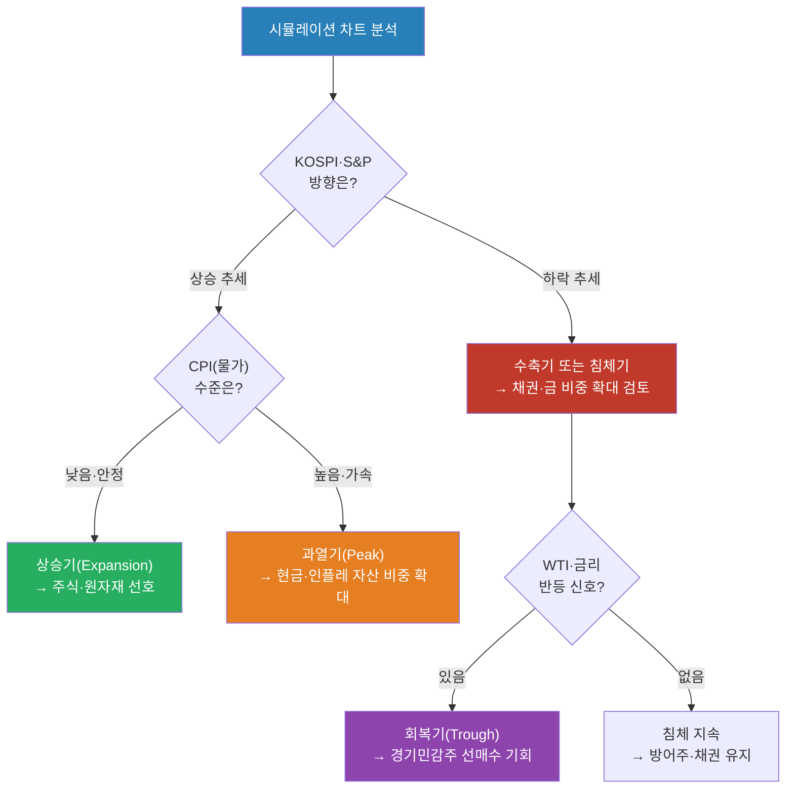

---

## 해보기 활동

1. 지금 경기가 확장·정점·수축·저점 중 어느 국면에 가깝다고 생각하는지, 그 이유를 주요 지표 2~3개를 근거로 설명해보세요.
2. 위 대시보드 코드를 실행해서 VIX(공포지수)가 급등한 구간을 찾고, 그 시기에 무슨 사건이 있었는지 조사해보세요.
3. 한국은행 경제통계시스템(ECOS)에서 M2 통화량 최근 2년 데이터를 내려받아 증가 속도가 어떻게 변했는지 확인해보세요.

## 다음 시간 미리보기

➡️ [Day 045](30.md) 에서 계속됩니다 — Porter's 5 Forces, SWOT/PEST, 산업 수명주기, 산업별 분석 방법
