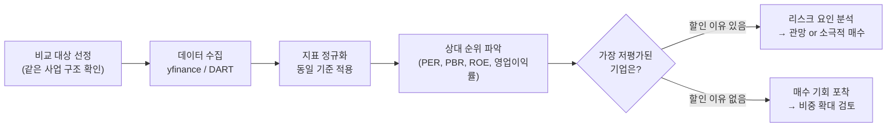
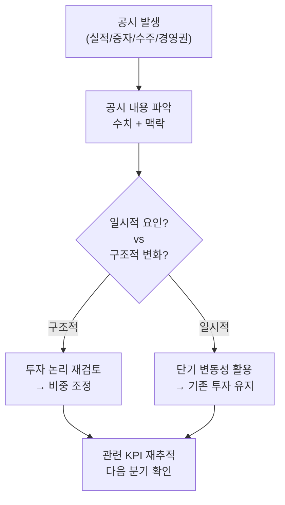
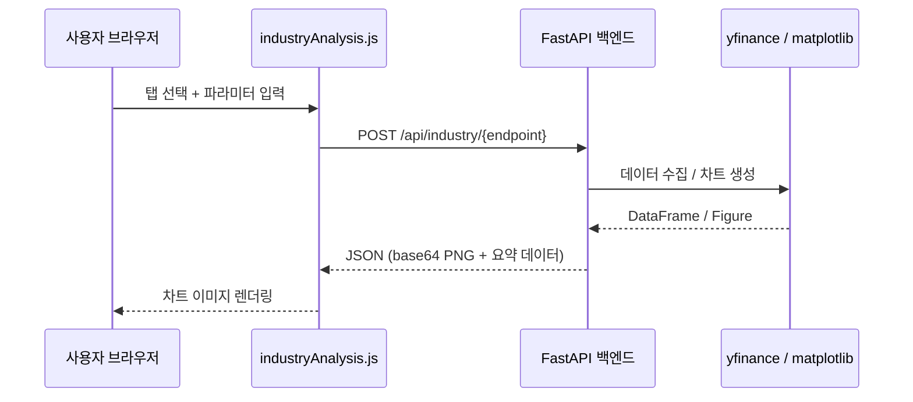
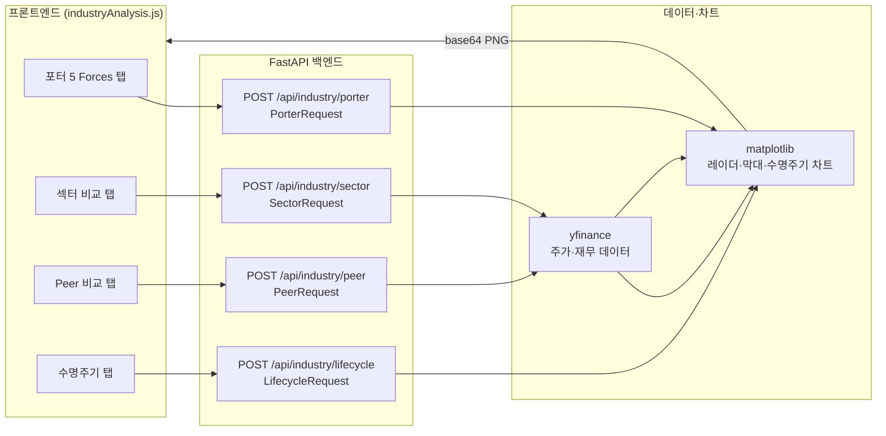

# Day 046 — 산업 분석 실습

> **모듈 7: 투자분석 기초 방법론** | 5/10일차 | 💹 | 학습시간: 8시간


---

> 📺 **YouTube 강의**: [🎬 산업 분석 실습 파이썬](https://www.youtube.com/results?search_query=산업분석+실습+파이썬+섹터+한국어)

## 오늘 배울 것 (아주 쉽게)

- 산업별 핵심 지표(KPI) 정리
- 동종 업계 비교 분석 (Peer Comparison)
- 산업 뉴스·공시 데이터 활용
- 실습: Python으로 산업별 주요 종목 재무 비교

---


### 1. 산업별 핵심 지표(KPI) 정리

**개념**

KPI(Key Performance Indicator)는 산업마다 다릅니다. 어떤 숫자를 먼저 봐야 하는지 알아야 분석이 깊어집니다.

> 📺 [🎬 산업별 핵심 KPI 선정법](https://www.youtube.com/results?search_query=산업별+KPI+핵심지표+선정+한국어+주식분석)

| 산업 | 핵심 KPI | 의미 |
|------|----------|------|
| 반도체 | ASP(평균판매단가), 가동률 | 가격 사이클과 공급 여력 |
| 유통·커머스 | 점포당 매출, 객단가, GMV | 운영 효율성 |
| 플랫폼·SaaS | MAU(월활성사용자), ARR, 이탈률 | 성장성과 유지율 |
| 금융·은행 | NIM(순이자마진), ROE, 대손충당금 | 수익성과 건전성 |
| 정유·화학 | 크랙마진, 정제마진, 스프레드 | 제품가-원가 차이 |
| 바이오 | 임상단계, R&D/매출 비율 | 파이프라인 가치 |

- 업종별로 가장 의미 있는 2~3개 지표를 고르는 기준을 익히는 것이 핵심입니다.
- 숫자를 많이 보는 것이 아니라 **의미 있는 숫자를 선택**하는 능력이 산업 분석의 핵심입니다.

### 2. 동종 업계 비교 분석 (Peer Comparison)

**개념**

한 회사를 혼자 보지 않고 비슷한 구조의 경쟁사와 나란히 놓고 상대 평가합니다.

> 📺 [🎬 Peer Comparison 동종업체 비교 분석](https://www.youtube.com/results?search_query=피어비교+동종업체+비교분석+주식+한국어)

비교 항목 예시:

| 지표 | 왜 비교하나 |
|------|------------|
| 매출 성장률 | 같은 시장에서 누가 빠르게 크는가 |
| 영업이익률 | 같은 매출로 누가 더 많이 남기는가 |
| PER/PBR | 시장이 각 기업을 어떻게 다르게 평가하는가 |
| 부채비율 | 재무 건전성 차이 |
| ROE | 자본 효율성 |

- 비교 대상의 **사업 구조가 실제로 비슷한지** 먼저 확인해야 멀티플 차이를 제대로 해석할 수 있습니다.
- "절대 점수"보다 **비교 위치**를 파악하는 연습이 중요합니다.

**Peer Comparison 분석 흐름**



### 3. 산업 뉴스·공시 데이터 활용

**개념**

재무 숫자만으로는 "왜 숫자가 바뀌었는지" 알 수 없습니다. 뉴스와 공시를 병행해야 원인을 파악할 수 있습니다.

> 📺 [🎬 DART 공시 뉴스 활용 주식분석](https://www.youtube.com/results?search_query=DART+공시+뉴스+주식분석+한국어)

**공시 종류와 투자 관련도**

| 공시 유형 | 내용 | 투자 관련 포인트 |
|-----------|------|-----------------|
| 실적 발표 | 분기·연간 재무결과 | 컨센서스 대비 서프라이즈 여부 |
| 유상증자 | 신규 주식 발행 | 단기 희석 부담 vs 장기 투자 재원 |
| 자사주 매입 | 회사가 자기 주식 구매 | 주주환원 신호, 저평가 자신감 |
| 대규모 수주 | 신규 계약 체결 | 미래 매출 가시성 확보 |
| 경영권 변경 | 대주주 지분 변동 | 기업 방향성 변화 |

- 실적이 좋아졌다면 "무슨 사건이 있었는지", 실적이 나빠졌다면 "일시적 요인인지 구조적 문제인지"를 함께 적는 습관이 분석 품질을 높입니다.

**공시 → 투자 판단 연결 흐름**



### 4. 실습: Python으로 산업별 주요 종목 재무 비교

```python
import yfinance as yf
import pandas as pd

# 반도체 섹터 Peer Comparison
peers = {
    "삼성전자":  "005930.KS",
    "SK하이닉스": "000660.KS",
    "엔비디아":  "NVDA",
    "인텔":      "INTC",
}

rows = []
for name, ticker in peers.items():
    try:
        info = yf.Ticker(ticker).info
        rows.append({
            "기업":       name,
            "시가총액(억)": round(info.get("marketCap", 0) / 1e8, 0),
            "PER":        round(info.get("trailingPE", float("nan")), 1),
            "PBR":        round(info.get("priceToBook", float("nan")), 2),
            "영업이익률(%)": round(info.get("operatingMargins", 0) * 100, 1),
            "ROE(%)":     round(info.get("returnOnEquity", 0) * 100, 1),
        })
    except Exception as e:
        print(f"{name} 데이터 오류: {e}")

df = pd.DataFrame(rows).set_index("기업")
print(df.to_string())
```

---

## 웹앱 실습 연계

Python Quant Lab 웹앱의 **산업 분석** 메뉴는 4개의 탭으로 구성됩니다. 각 탭이 어떤 API를 호출하고 어떤 결과를 보여주는지 아래에서 확인하세요.

### API 전체 흐름



---

### 탭 1 — 포터 5 Forces 분석

```
POST /api/industry/porter
Content-Type: application/json
```

**요청 예시**

```json
{
  "industry": "2차전지",
  "scores": {
    "경쟁강도":      7.0,
    "신규진입 위협": 4.0,
    "대체재 위협":   3.0,
    "구매자 교섭력": 6.0,
    "공급자 교섭력": 8.0
  }
}
```

- scores 값 범위: 0(위협 없음) ~ 10(위협 극대)
- 5개 키 모두 필수 입력

**응답**

```json
{
  "chart": "<base64 PNG 문자열>",
  "summary": {
    "경쟁강도": 7.0,
    "신규진입 위협": 4.0,
    "대체재 위협": 3.0,
    "구매자 교섭력": 6.0,
    "공급자 교섭력": 8.0
  }
}
```

반환된 차트는 5개 축의 레이더(거미줄) 차트로, 산업 매력도를 한눈에 파악할 수 있습니다.

---

### 탭 2 — 섹터 비교

```
POST /api/industry/sector
Content-Type: application/json
```

**요청 예시**

```json
{
  "tickers": ["SOXX", "XLE", "XLF", "XLV", "XLK", "XLI"],
  "period": "1y"
}
```

| 티커 | 섹터 |
|------|------|
| SOXX | 반도체 |
| XLE  | 에너지 |
| XLF  | 금융 |
| XLV  | 헬스케어 |
| XLK  | IT |
| XLI  | 산업재 |

- tickers를 생략하면 위 6개 ETF가 기본값으로 사용됩니다.
- period 예시: `"1y"`, `"6mo"`, `"3mo"`, `"ytd"`

**응답**

```json
{
  "chart": "<base64 PNG 문자열>",
  "performance": {
    "SOXX": 32.5,
    "XLK":  28.1,
    "XLV":  12.3,
    "XLF":   9.8,
    "XLE":  -3.2,
    "XLI":   7.6
  }
}
```

---

### 탭 3 — Peer Comparison

```
POST /api/industry/peer
Content-Type: application/json
```

**요청 예시**

```json
{
  "tickers": {
    "삼성전자":  "005930.KS",
    "SK하이닉스": "000660.KS",
    "엔비디아":  "NVDA",
    "TSMC":     "TSM"
  }
}
```

- 키: 화면에 표시될 회사 이름 (한글 가능)
- 값: Yahoo Finance 티커 (한국 주식은 `.KS` 또는 `.KQ` 접미사)

**응답**

```json
{
  "chart": "<base64 PNG 문자열>",
  "data": [
    { "기업": "삼성전자", "PER": 13.2, "PBR": 1.1, "ROE": 8.5, "영업이익률": 12.3 },
    { "기업": "SK하이닉스", "PER": 18.7, "PBR": 1.9, "ROE": 14.2, "영업이익률": 22.1 }
  ]
}
```

차트는 PER, PBR, ROE, 영업이익률 4개 지표를 나란히 비교하는 막대 차트입니다.

---

### 탭 4 — 수명주기 분석

```
POST /api/industry/lifecycle
Content-Type: application/json
```

**요청 예시**

```json
{
  "stage": "성장기",
  "industry": "AI 반도체"
}
```

- stage: `"도입기"` | `"성장기"` | `"성숙기"` | `"쇠퇴기"` 중 하나

**응답**

```json
{
  "chart": "<base64 PNG 문자열>",
  "strategy": "성장기 산업은 높은 PER을 감수하더라도 시장 점유율 확대 기업에 집중. 진입 경쟁이 심화되므로 해자(moat) 보유 여부 확인 필수."
}
```

수명주기 곡선 위에 현재 단계 위치가 강조 표시되고, 해당 단계의 투자 전략이 텍스트로 함께 제공됩니다.

---

### 프론트엔드 연동 구조



---

## 해보기 활동

오늘은 코드를 길게 쓰기보다, 아래 질문에 답하면서 산업 비교 표를 직접 만들어 보세요.

1. 관심 있는 산업 1개를 고르고, 그 산업에서 중요한 KPI 3개를 적어보세요.
2. 대표 기업 3개를 골라 매출 성장률, 영업이익률, 부채비율을 표로 정리해보세요.
3. 최근 뉴스나 공시 1건을 찾아서, 그 사건이 어떤 지표에 영향을 주는지 한 줄로 설명해보세요.
4. 마지막으로 "이 산업에서 가장 안정적으로 보이는 기업"과 그 이유를 한 문장으로 적어보세요.


## 다음 시간 미리보기

➡️ [Day 047](32.md) 에서 계속됩니다.
