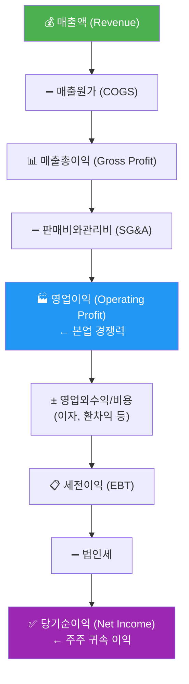
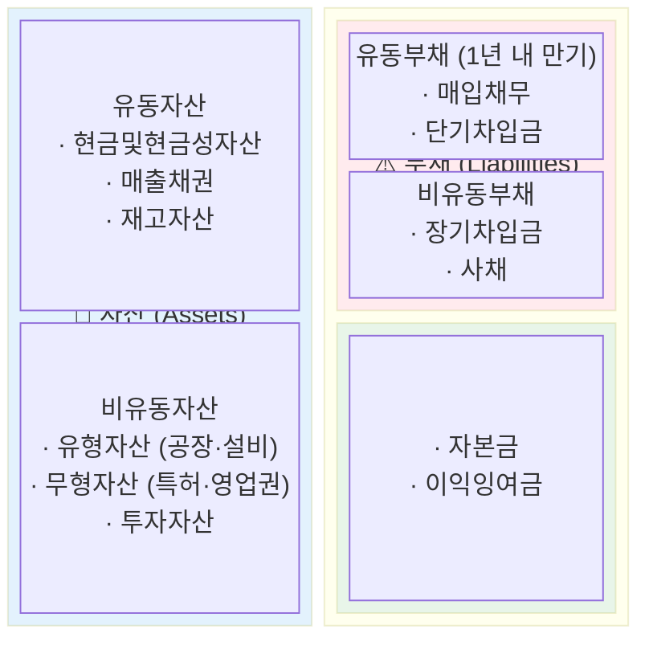
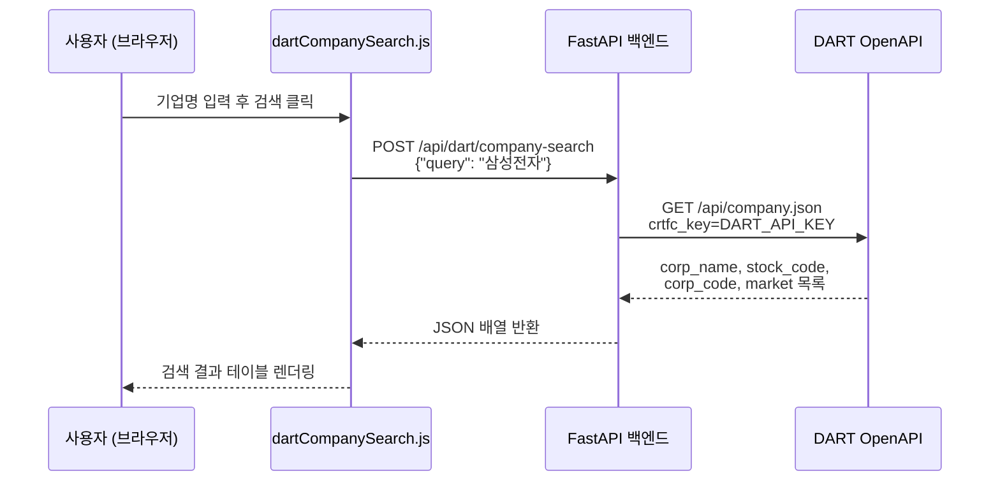
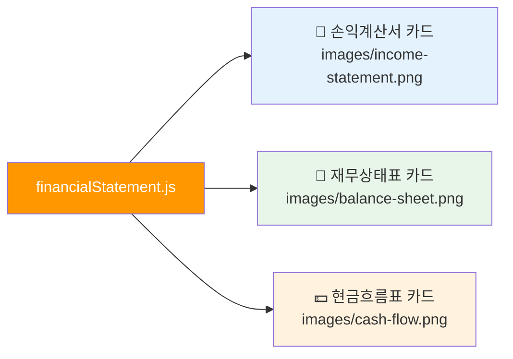

# Day 047 — 재무제표 분석 I (손익계산서 & 대차대조표)

> **모듈 7: 투자분석 기초 방법론** | 6/10일차 | 💹 | 학습시간: 8시간


---

> 📺 **YouTube 강의**: [🎬 재무제표 분석 손익계산서 대차대조표](https://www.youtube.com/results?search_query=재무제표+손익계산서+대차대조표+분석+한국어)

## 오늘 배울 것 (아주 쉽게)

- 손익계산서(Income Statement) 구조 이해
- 매출액, 영업이익, 순이익 분석
- 대차대조표(Balance Sheet) 구조 이해
- 자산·부채·자본 분석
- 실습: DART 공시 재무제표 데이터 수집 및 분석

---


### 1. 손익계산서(Income Statement) 구조 이해

손익계산서는 회사가 **일정 기간 동안** 얼마나 벌고, 얼마나 쓰고, 마지막에 얼마나 남겼는지를 보여주는 성적표입니다.

> 📺 [🎬 손익계산서 구조 읽는 법](https://www.youtube.com/results?search_query=손익계산서+구조+읽는법+재무제표+한국어)



- 숫자를 외우기보다, "돈이 들어오고 비용이 빠져서 이익이 남는다"는 구조를 이해하는 것이 핵심입니다.

### 2. 매출액, 영업이익, 순이익 분석

> 📺 [🎬 매출액 영업이익 순이익 차이](https://www.youtube.com/results?search_query=매출액+영업이익+순이익+차이+분석+한국어)

| 지표 | 공식 | 의미 |
|------|------|------|
| **영업이익률** | 영업이익 / 매출액 × 100 | 본업의 수익성 |
| **순이익률** | 순이익 / 매출액 × 100 | 최종 수익성 |
| **매출 성장률** | (금기-전기) / 전기 × 100 | 외형 성장 속도 |

- 매출이 늘어도 이익이 줄 수 있으므로, **성장**과 **수익성**을 항상 함께 봐야 합니다.
- 순이익이 영업이익보다 크면 일회성 자산 매각 등 비경상 이익이 있을 수 있어 주의가 필요합니다.

**손익계산서에서 꼭 확인할 5가지**

| 확인 항목 | 보는 방법 | 해석 포인트 |
|-----------|-----------|-------------|
| **매출액 추세** | 최근 3~5년 매출 성장률 | 시장이 커지는지, 점유율을 잃는지 확인 |
| **매출총이익률** | 매출총이익 / 매출액 | 원가 경쟁력, 가격 결정력 확인 |
| **판관비율** | 판매비와관리비 / 매출액 | 인건비·마케팅비·관리비 부담 확인 |
| **영업이익률** | 영업이익 / 매출액 | 본업의 수익성, 경쟁력 확인 |
| **순이익의 질** | 순이익 vs 영업이익 | 일회성 이익, 금융비용, 세금 영향 확인 |

**좋은 흐름의 예시**


**주의해야 할 흐름의 예시**

| 상황 | 가능한 해석 |
|------|-------------|
| 매출은 증가하지만 영업이익률 하락 | 가격 경쟁, 원가 상승, 마케팅비 증가 |
| 영업이익은 흑자인데 순이익 적자 | 이자비용, 외환손실, 일회성 손실 |
| 영업이익은 적자인데 순이익 흑자 | 자산 매각, 투자수익 등 비경상 이익 가능성 |
| 매출 정체인데 판관비 급증 | 고정비 부담 증가, 경영 효율성 저하 |

### 3. 대차대조표(Balance Sheet) 구조 이해

> 📺 [🎬 대차대조표 재무상태표 읽는 법](https://www.youtube.com/results?search_query=대차대조표+재무상태표+읽는법+한국어)

손익계산서가 **기간의 흐름**이라면, 대차대조표는 **특정 시점의 스냅샷**입니다.



> **핵심 항등식**: 자산(Assets) = 부채(Liabilities) + 자본(Equity)

- 자산이 크더라도 부채가 과도하면 위험할 수 있으므로 **규모보다 구성과 균형**을 봐야 합니다.

### 4. 자산·부채·자본 분석

> 📺 [🎬 자산 부채 자본 재무건전성 분석](https://www.youtube.com/results?search_query=자산+부채+자본+재무건전성+부채비율+한국어)

**주요 안전성 지표**

| 지표 | 공식 | 해석 기준 |
|------|------|-----------|
| **부채비율** | 부채 / 자본 × 100 | 100% 이하 안정, 200% 이상 주의 |
| **유동비율** | 유동자산 / 유동부채 × 100 | 150% 이상 양호 |
| **이자보상배율** | 영업이익 / 이자비용 | 1배 이하 위험 |

- 자산이 얼마나 효율적으로 쓰이는지 (ROA = 순이익 / 자산), 부채가 감당 가능한 수준인지, 자본이 꾸준히 늘어나는지를 함께 확인합니다.

**대차대조표에서 꼭 확인할 6가지**

| 확인 항목 | 질문 | 투자 관점 |
|-----------|------|-----------|
| **현금및현금성자산** | 당장 쓸 수 있는 현금이 충분한가? | 경기 둔화와 투자 기회에 버틸 여력 |
| **매출채권** | 매출보다 매출채권이 더 빨리 늘지는 않는가? | 팔았지만 아직 돈을 못 받은 매출 가능성 |
| **재고자산** | 재고가 매출보다 빠르게 쌓이지 않는가? | 수요 둔화, 가격 인하, 평가손실 위험 |
| **유형자산** | 설비투자가 매출 증가로 이어지는가? | 제조업·반도체·배터리에서 중요 |
| **단기차입금/유동부채** | 1년 안에 갚아야 할 부담이 큰가? | 유동성 위험, 차환 리스크 |
| **이익잉여금** | 벌어둔 이익이 자본에 누적되는가? | 장기 수익성과 재무 체력 |

**대차대조표 분석 순서**

1. 자산이 늘었는지 먼저 봅니다.
2. 자산 증가가 부채 증가 때문인지, 이익 누적 때문인지 나눠 봅니다.
3. 유동자산과 유동부채를 비교해 단기 지급능력을 봅니다.
4. 매출채권·재고자산이 매출보다 빠르게 늘면 이익의 질을 의심합니다.
5. 부채비율과 이자보상배율로 차입 부담을 확인합니다.

**손익계산서와 연결해서 읽기**

| 손익계산서 변화 | 대차대조표에서 확인할 것 |
|----------------|--------------------------|
| 매출 급증 | 매출채권도 같이 급증했는지 확인 |
| 원가율 상승 | 재고자산 평가손실이나 원재료 부담 확인 |
| 영업이익 개선 | 현금과 이익잉여금 증가로 이어졌는지 확인 |
| 이자비용 증가 | 차입금과 부채비율이 상승했는지 확인 |

### 5. 실습: DART 공시 재무제표 데이터 수집 및 분석

> 📺 [🎬 DART 공시 재무제표 파이썬 수집](https://www.youtube.com/results?search_query=DART+공시+재무제표+파이썬+수집+한국어)

DART(전자공시시스템)는 한국 상장기업의 공식 재무 데이터를 얻을 수 있는 가장 신뢰할 수 있는 원천입니다.

**yfinance로 손익계산서 분석 (글로벌 상장 주식)**

```python
import yfinance as yf
import pandas as pd

def income_statement_summary(ticker: str, name: str = ""):
    t = yf.Ticker(ticker)
    fs = t.financials  # 연간 손익계산서 (단위: 달러/원)
    if fs is None or fs.empty:
        print(f"{name or ticker}: 데이터 없음")
        return

    rows = ["Total Revenue", "Gross Profit", "Operating Income", "Net Income"]
    labels = {"Total Revenue": "매출액", "Gross Profit": "매출총이익",
              "Operating Income": "영업이익", "Net Income": "당기순이익"}

    subset = fs.loc[[r for r in rows if r in fs.index]]
    subset.index = [labels.get(i, i) for i in subset.index]
    subset.columns = [str(c.year) + "Y" for c in subset.columns]

    print(f"\n=== {name or ticker} 손익계산서 (단위: 억) ===")
    print((subset / 1e8).round(0).to_string())

    # 영업이익률 계산
    if "매출액" in subset.index and "영업이익" in subset.index:
        margin = subset.loc["영업이익"] / subset.loc["매출액"] * 100
        margin.index = [str(c.year) + "Y" for c in fs.columns]
        print("\n영업이익률(%):", margin.round(1).to_string())

income_statement_summary("005930.KS", "삼성전자")
```

**DART OpenAPI로 한국 상장기업 재무 데이터 수집**

```python
import requests
import pandas as pd
import os

DART_API_KEY = os.environ["DART_API_KEY"]  # .env 또는 환경변수에서 로드

def dart_company_search(query: str) -> list[dict]:
    """
    앱의 /api/dart/company-search 엔드포인트와 동일한 로직.
    corp_name, stock_code, corp_code, market 반환.
    """
    url = "https://opendart.fss.or.kr/api/company.json"
    params = {"crtfc_key": DART_API_KEY, "corp_name": query}
    resp = requests.get(url, params=params, timeout=10)
    data = resp.json()
    if data.get("status") != "000":
        return []
    return [
        {
            "corp_name":  c["corp_name"],
            "stock_code": c.get("stock_code", ""),
            "corp_code":  c["corp_code"],
            "market":     c.get("corp_cls", ""),
        }
        for c in data.get("results", [])
        if c.get("stock_code")  # 상장사만 필터
    ]

def dart_financial_statement(corp_code: str, year: str = "2023",
                              reprt_code: str = "11011") -> pd.DataFrame:
    """
    DART 단일회사 주요계정 조회 (reprt_code: 11011=사업보고서).
    손익계산서(IS), 재무상태표(BS) 주요 항목 반환.
    """
    url = "https://opendart.fss.or.kr/api/fnlttSinglAcntAll.json"
    params = {
        "crtfc_key": DART_API_KEY,
        "corp_code":  corp_code,
        "bsns_year":  year,
        "reprt_code": reprt_code,
        "fs_div":     "CFS",  # 연결재무제표
    }
    resp = requests.get(url, params=params, timeout=10)
    data = resp.json()
    if data.get("status") != "000":
        return pd.DataFrame()
    df = pd.DataFrame(data["list"])
    df["thstrm_amount"] = pd.to_numeric(
        df["thstrm_amount"].str.replace(",", ""), errors="coerce"
    )
    return df[["sj_nm", "account_nm", "thstrm_amount"]].rename(columns={
        "sj_nm":          "재무제표",
        "account_nm":     "계정명",
        "thstrm_amount":  "당기금액(원)",
    })

# --- 사용 예시 ---
companies = dart_company_search("삼성전자")
if companies:
    corp = companies[0]
    print(f"검색 결과: {corp['corp_name']} ({corp['stock_code']})")
    fs_df = dart_financial_statement(corp["corp_code"], year="2023")
    # 손익계산서만 필터
    is_df = fs_df[fs_df["재무제표"] == "손익계산서"]
    print(is_df.head(10).to_string(index=False))
```

- 실습에서는 숫자를 단순히 가져오는 데서 끝나지 않고, **최근 3~5년 변화 방향**을 읽는 것이 중요합니다.
- **연결 기준인지 별도 기준인지**, **연간인지 분기인지** 구분해야 숫자를 잘못 해석하지 않습니다.

---

## 🔗 Python 소스 연계

이 문서에서 설명하는 개념들이 앱 코드의 어느 부분과 연결되는지 확인하세요.

### DART 기업 검색 — `/api/dart/company-search`



- **환경변수**: `DART_API_KEY` 필수 (`.env` 또는 시스템 환경변수)
- **요청 스키마**: `DartCompanySearchRequest(query: str)`
- **반환 필드**: `corp_name`, `stock_code`, `corp_code`, `market`
- **프론트엔드 파일**: `dartCompanySearch.js`

### 재무제표 카드 뷰 — `financialStatement.js`



- **구현 방식**: 프론트엔드에서 로컬 이미지 3장을 카드 형태로 표시 (API 호출 없음)
- **이미지 경로**: `images/income-statement.png`, `images/balance-sheet.png`, `images/cash-flow.png`
- **학습 연결**: 이 문서의 1~4절 개념이 각 카드의 시각 자료와 대응됩니다.

---

## 해보기 활동

아래 활동을 순서대로 해보면 손익계산서와 대차대조표를 훨씬 자연스럽게 읽을 수 있어요.

1. 관심 기업 1개를 정하고, 최근 3개년 매출액·영업이익·순이익을 표로 정리해보세요.
2. 같은 기업의 자산총계·부채총계·자본총계를 함께 적고, 부채가 자산에서 어느 정도 비중인지 계산해보세요.
3. 매출은 늘었는데 순이익이 줄었는지, 또는 자산은 커졌는데 부채도 함께 늘었는지 변화 방향을 한 문장으로 설명해보세요.
4. 마지막으로 "이 회사의 실적"과 "이 회사의 재무 안정성"을 각각 한 줄씩 요약해보세요.


## 다음 시간 미리보기

➡️ [Day 048](33.md) 에서 계속됩니다.
