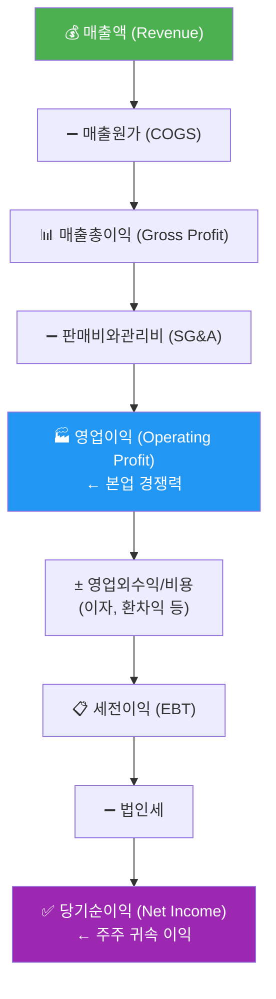
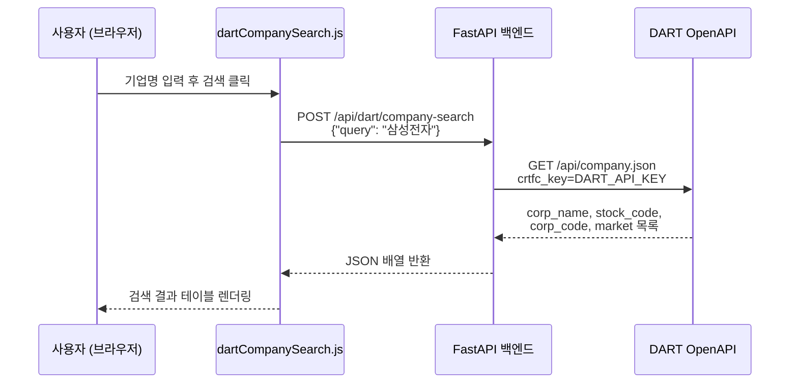
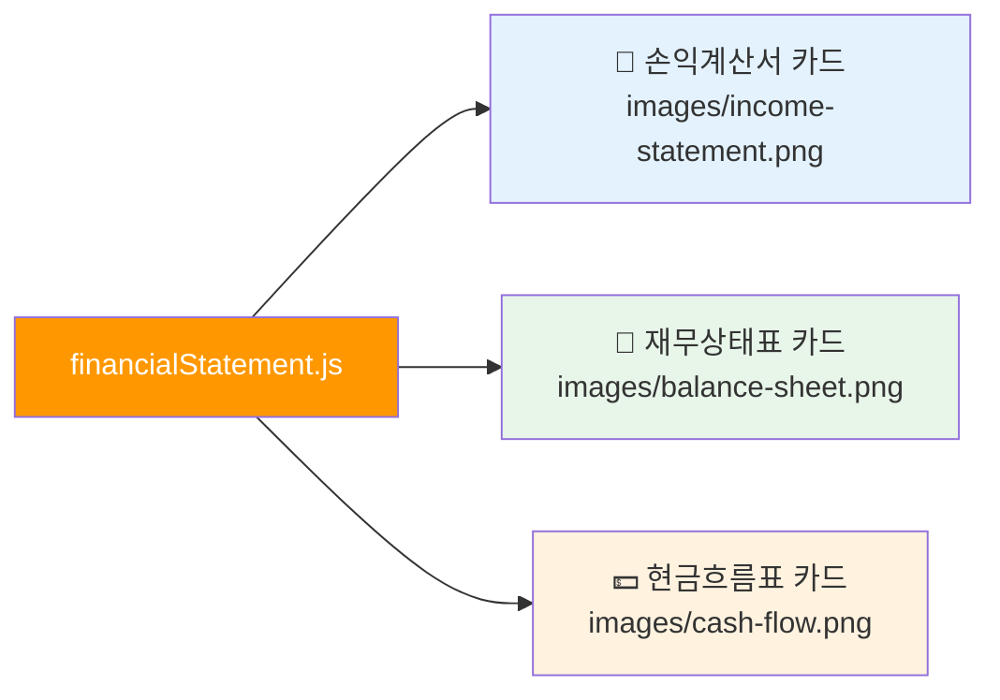

# Day 047 — 재무제표 분석 I (손익계산서 & 대차대조표)

> **모듈 7: 투자분석 기초 방법론** | 6/10일차 | 💹 | 학습시간: 8시간


---

> 📺 **YouTube 강의**: [🎬 재무제표 분석 손익계산서 대차대조표](https://www.youtube.com/results?search_query=재무제표+손익계산서+대차대조표+분석+한국어)

## 오늘 배울 것 (아주 쉽게)

- 손익계산서(Income Statement) 구조 이해
- 매출액, 영업이익, 순이익 분석
- 대차대조표(Balance Sheet) 구조 이해
- 자산·부채·자본 분석
- 실습: DART 공시 재무제표 데이터 수집 및 분석

---


## 🗓 세부 일정 (1일 8시간)

> **강의 5시간** (5개 단락 × 50분 + 도입·마무리 50분) + **실습 3시간** = 총 8시간

| 시간 | 구분 | 내용 | 형태 |
|------|------|------|------|
| 09:00 – 09:10 | 도입 | 오늘 학습 목표 확인 | 강의 |
| 09:10 – 09:30 | **1단락** 설명 20분 | 손익계산서(Income Statement) 구조 이해 | 강의 |
| 09:30 – 10:00 | 각자 정리 & 유튜브 30분 | 노트 정리 · 관련 영상 검색 | 자율 |
| 10:00 – 10:20 | **2단락** 설명 20분 | 매출액, 영업이익, 순이익 분석 | 강의 |
| 10:20 – 10:50 | 각자 정리 & 유튜브 30분 | 노트 정리 · 관련 영상 검색 | 자율 |
| 10:50 – 11:00 | ☕ 휴식 | — | — |
| 11:00 – 11:20 | **3단락** 설명 20분 | 대차대조표(Balance Sheet) 구조 이해 | 강의 |
| 11:20 – 11:50 | 각자 정리 & 유튜브 30분 | 노트 정리 · 관련 영상 검색 | 자율 |
| 11:50 – 12:10 | **4단락** 설명 20분 | 자산·부채·자본 분석 | 강의 |
| 12:10 – 12:40 | 각자 정리 & 유튜브 30분 | 노트 정리 · 관련 영상 검색 | 자율 |
| 12:40 – 13:00 | **5단락** 설명 20분 | DART 공시 재무제표 데이터 수집 방법 개요 | 강의 |
| 13:00 – 13:30 | 각자 정리 & 유튜브 30분 | 노트 정리 · 관련 영상 검색 | 자율 |
| 13:30 – 14:00 | 강의 마무리 | Q&A · 핵심 복습 | 강의 |
| 14:00 – 15:00 | 💻 **실습 1부** 60분 | DART API 수집 코드 작성 (기업 코드 캐시·재무제표 동적 수집) | 실습 |
| 15:00 – 15:10 | ☕ 휴식 | — | — |
| 15:10 – 16:00 | 💻 **실습 2부** 50분 | 재무비율 계산 · 웹 대시보드 · 문서 출력 구현 | 실습 |
| 16:00 – 16:10 | ☕ 휴식 | — | — |
| 16:10 – 17:00 | 💻 **실습 발표 & 리뷰** 50분 | 코드 리뷰 · 발표 · 피드백 | 실습 |

> 강의 5시간: 도입 10분 + 단락 5개×50분 + 마무리 30분 = **300분**  
> 실습 3시간: 1부 60분 + 휴식 10분 + 2부 50분 + 휴식 10분 + 발표·리뷰 50분 = **180분**

---


### 1. 손익계산서(Income Statement) 구조 이해

> 📖 **Wikipedia**: [손익계산서](https://ko.wikipedia.org/wiki/손익계산서)

손익계산서는 회사가 **일정 기간 동안** 얼마나 벌고, 얼마나 쓰고, 마지막에 얼마나 남겼는지를 보여주는 성적표입니다.

> 📺 [🎬 손익계산서 구조 읽는 법](https://www.youtube.com/results?search_query=손익계산서+구조+읽는법+재무제표+한국어)



- 숫자를 외우기보다, "돈이 들어오고 비용이 빠져서 이익이 남는다"는 구조를 이해하는 것이 핵심입니다.

### 2. 매출액, 영업이익, 순이익 분석

> 📖 **Wikipedia**: [영업이익](https://ko.wikipedia.org/wiki/영업이익) · [당기순이익](https://ko.wikipedia.org/wiki/당기순이익) · [매출총이익](https://ko.wikipedia.org/wiki/매출총이익)

> 📺 [🎬 매출액 영업이익 순이익 차이](https://www.youtube.com/results?search_query=매출액+영업이익+순이익+차이+분석+한국어)

| 지표 | 공식 | 의미 |
|------|------|------|
| **영업이익률** | 영업이익 / 매출액 × 100 | 본업의 수익성 |
| **순이익률** | 순이익 / 매출액 × 100 | 최종 수익성 |
| **매출 성장률** | (금기-전기) / 전기 × 100 | 외형 성장 속도 |

- 매출이 늘어도 이익이 줄 수 있으므로, **성장**과 **수익성**을 항상 함께 봐야 합니다.
- 순이익이 영업이익보다 크면 일회성 자산 매각 등 비경상 이익이 있을 수 있어 주의가 필요합니다.

**손익계산서에서 꼭 확인할 5가지**

| 확인 항목 | 보는 방법 | 해석 포인트 |
|-----------|-----------|-------------|
| **매출액 추세** | 최근 3~5년 매출 성장률 | 시장이 커지는지, 점유율을 잃는지 확인 |
| **매출총이익률** | 매출총이익 / 매출액 | 원가 경쟁력, 가격 결정력 확인 |
| **판관비율** | 판매비와관리비 / 매출액 | 인건비·마케팅비·관리비 부담 확인 |
| **영업이익률** | 영업이익 / 매출액 | 본업의 수익성, 경쟁력 확인 |
| **순이익의 질** | 순이익 vs 영업이익 | 일회성 이익, 금융비용, 세금 영향 확인 |

**좋은 흐름의 예시**


**주의해야 할 흐름의 예시**

| 상황 | 가능한 해석 |
|------|-------------|
| 매출은 증가하지만 영업이익률 하락 | 가격 경쟁, 원가 상승, 마케팅비 증가 |
| 영업이익은 흑자인데 순이익 적자 | 이자비용, 외환손실, 일회성 손실 |
| 영업이익은 적자인데 순이익 흑자 | 자산 매각, 투자수익 등 비경상 이익 가능성 |
| 매출 정체인데 판관비 급증 | 고정비 부담 증가, 경영 효율성 저하 |

### 3. 대차대조표(Balance Sheet) 구조 이해

> 📖 **Wikipedia**: [대차대조표](https://ko.wikipedia.org/wiki/대차대조표)

> 📺 [🎬 대차대조표 재무상태표 읽는 법](https://www.youtube.com/results?search_query=대차대조표+재무상태표+읽는법+한국어)

손익계산서가 **기간의 흐름**이라면, 대차대조표는 **특정 시점의 스냅샷**입니다.


> **핵심 항등식**: 자산(Assets) = 부채(Liabilities) + 자본(Equity)

- 자산이 크더라도 부채가 과도하면 위험할 수 있으므로 **규모보다 구성과 균형**을 봐야 합니다.

### 4. 자산·부채·자본 분석

> 📖 **Wikipedia**: [자기자본이익률](https://ko.wikipedia.org/wiki/자기자본이익률) · [부채비율](https://ko.wikipedia.org/wiki/부채비율) · [유동비율](https://ko.wikipedia.org/wiki/유동비율)

> 📺 [🎬 자산 부채 자본 재무건전성 분석](https://www.youtube.com/results?search_query=자산+부채+자본+재무건전성+부채비율+한국어)

**주요 안전성 지표**

| 지표 | 공식 | 해석 기준 |
|------|------|-----------|
| **부채비율** | 부채 / 자본 × 100 | 100% 이하 안정, 200% 이상 주의 |
| **유동비율** | 유동자산 / 유동부채 × 100 | 150% 이상 양호 |
| **이자보상배율** | 영업이익 / 이자비용 | 1배 이하 위험 |

- 자산이 얼마나 효율적으로 쓰이는지 (ROA = 순이익 / 자산), 부채가 감당 가능한 수준인지, 자본이 꾸준히 늘어나는지를 함께 확인합니다.

**대차대조표에서 꼭 확인할 6가지**

| 확인 항목 | 질문 | 투자 관점 |
|-----------|------|-----------|
| **현금및현금성자산** | 당장 쓸 수 있는 현금이 충분한가? | 경기 둔화와 투자 기회에 버틸 여력 |
| **매출채권** | 매출보다 매출채권이 더 빨리 늘지는 않는가? | 팔았지만 아직 돈을 못 받은 매출 가능성 |
| **재고자산** | 재고가 매출보다 빠르게 쌓이지 않는가? | 수요 둔화, 가격 인하, 평가손실 위험 |
| **유형자산** | 설비투자가 매출 증가로 이어지는가? | 제조업·반도체·배터리에서 중요 |
| **단기차입금/유동부채** | 1년 안에 갚아야 할 부담이 큰가? | 유동성 위험, 차환 리스크 |
| **이익잉여금** | 벌어둔 이익이 자본에 누적되는가? | 장기 수익성과 재무 체력 |

**대차대조표 분석 순서**

1. 자산이 늘었는지 먼저 봅니다.
2. 자산 증가가 부채 증가 때문인지, 이익 누적 때문인지 나눠 봅니다.
3. 유동자산과 유동부채를 비교해 단기 지급능력을 봅니다.
4. 매출채권·재고자산이 매출보다 빠르게 늘면 이익의 질을 의심합니다.
5. 부채비율과 이자보상배율로 차입 부담을 확인합니다.

**손익계산서와 연결해서 읽기**

| 손익계산서 변화 | 대차대조표에서 확인할 것 |
|----------------|--------------------------|
| 매출 급증 | 매출채권도 같이 급증했는지 확인 |
| 원가율 상승 | 재고자산 평가손실이나 원재료 부담 확인 |
| 영업이익 개선 | 현금과 이익잉여금 증가로 이어졌는지 확인 |
| 이자비용 증가 | 차입금과 부채비율이 상승했는지 확인 |

### 5. 실습: DART 공시 재무제표 데이터 수집 및 분석

> 📺 [🎬 DART 공시 재무제표 파이썬 수집](https://www.youtube.com/results?search_query=DART+공시+재무제표+파이썬+수집+한국어)

DART(전자공시시스템)는 한국 상장기업의 공식 재무 데이터를 얻을 수 있는 가장 신뢰할 수 있는 원천입니다.

**yfinance로 손익계산서 분석 (글로벌 상장 주식)**

```python
import yfinance as yf
import pandas as pd

def income_statement_summary(ticker: str, name: str = ""):
    t = yf.Ticker(ticker)
    fs = t.financials  # 연간 손익계산서 (단위: 달러/원)
    if fs is None or fs.empty:
        print(f"{name or ticker}: 데이터 없음")
        return

    rows = ["Total Revenue", "Gross Profit", "Operating Income", "Net Income"]
    labels = {"Total Revenue": "매출액", "Gross Profit": "매출총이익",
              "Operating Income": "영업이익", "Net Income": "당기순이익"}

    subset = fs.loc[[r for r in rows if r in fs.index]]
    subset.index = [labels.get(i, i) for i in subset.index]
    subset.columns = [str(c.year) + "Y" for c in subset.columns]

    print(f"\n=== {name or ticker} 손익계산서 (단위: 억) ===")
    print((subset / 1e8).round(0).to_string())

    # 영업이익률 계산
    if "매출액" in subset.index and "영업이익" in subset.index:
        margin = subset.loc["영업이익"] / subset.loc["매출액"] * 100
        margin.index = [str(c.year) + "Y" for c in fs.columns]
        print("\n영업이익률(%):", margin.round(1).to_string())

income_statement_summary("005930.KS", "삼성전자")
```

**DART OpenAPI로 한국 상장기업 재무 데이터 수집**

```python
import requests
import pandas as pd
import os

DART_API_KEY = os.environ["DART_API_KEY"]  # .env 또는 환경변수에서 로드

def dart_company_search(query: str) -> list[dict]:
    """
    앱의 /api/dart/company-search 엔드포인트와 동일한 로직.
    corp_name, stock_code, corp_code, market 반환.
    """
    url = "https://opendart.fss.or.kr/api/company.json"
    params = {"crtfc_key": DART_API_KEY, "corp_name": query}
    resp = requests.get(url, params=params, timeout=10)
    data = resp.json()
    if data.get("status") != "000":
        return []
    return [
        {
            "corp_name":  c["corp_name"],
            "stock_code": c.get("stock_code", ""),
            "corp_code":  c["corp_code"],
            "market":     c.get("corp_cls", ""),
        }
        for c in data.get("results", [])
        if c.get("stock_code")  # 상장사만 필터
    ]

def dart_financial_statement(corp_code: str, year: str = "2023",
                              reprt_code: str = "11011") -> pd.DataFrame:
    """
    DART 단일회사 주요계정 조회 (reprt_code: 11011=사업보고서).
    손익계산서(IS), 재무상태표(BS) 주요 항목 반환.
    """
    url = "https://opendart.fss.or.kr/api/fnlttSinglAcntAll.json"
    params = {
        "crtfc_key": DART_API_KEY,
        "corp_code":  corp_code,
        "bsns_year":  year,
        "reprt_code": reprt_code,
        "fs_div":     "CFS",  # 연결재무제표
    }
    resp = requests.get(url, params=params, timeout=10)
    data = resp.json()
    if data.get("status") != "000":
        return pd.DataFrame()
    df = pd.DataFrame(data["list"])
    df["thstrm_amount"] = pd.to_numeric(
        df["thstrm_amount"].str.replace(",", ""), errors="coerce"
    )
    return df[["sj_nm", "account_nm", "thstrm_amount"]].rename(columns={
        "sj_nm":          "재무제표",
        "account_nm":     "계정명",
        "thstrm_amount":  "당기금액(원)",
    })

# --- 사용 예시 ---
companies = dart_company_search("삼성전자")
if companies:
    corp = companies[0]
    print(f"검색 결과: {corp['corp_name']} ({corp['stock_code']})")
    fs_df = dart_financial_statement(corp["corp_code"], year="2023")
    # 손익계산서만 필터
    is_df = fs_df[fs_df["재무제표"] == "손익계산서"]
    print(is_df.head(10).to_string(index=False))
```

- 실습에서는 숫자를 단순히 가져오는 데서 끝나지 않고, **최근 3~5년 변화 방향**을 읽는 것이 중요합니다.
- **연결 기준인지 별도 기준인지**, **연간인지 분기인지** 구분해야 숫자를 잘못 해석하지 않습니다.

---

#### 5-1. 고도화 목표: 동적 DART 재무제표 분석 웹앱

이번 실습의 목표는 단순히 DART 재무제표를 한 번 조회하는 것이 아니라, **기업 검색 → 공시 선택 → 재무제표 수집 → 표준 계정 매핑 → 재무비율 분석 → 문서 양식 시뮬레이션 → 웹/PDF 리포트 출력**까지 이어지는 동적 웹앱을 설계하는 것입니다.

최종 산출물:

| 산출물 | 파일/화면 | 설명 |
|---|---|---|
| 기업 검색 데이터 | `dart_companies.csv` | DART 고유번호, 종목코드, 회사명 |
| 원천 재무제표 | `dart_financial_raw.csv` | DART API 응답 원본 정리 |
| 표준 재무제표 | `financial_statement_standard.csv` | 회사별 다른 계정명을 표준 계정으로 매핑 |
| 재무비율 데이터 | `financial_ratios.csv` | 수익성, 안정성, 성장성, 활동성 지표 |
| 웹 대시보드 | `/api/dart/financial-dashboard` | 동적 재무 분석 결과 반환 |
| 문서 시뮬레이터 | `/api/dart/document-simulate` | 손익계산서/재무상태표/요약보고서 양식 생성 |
| PDF 리포트 | `financial_report.pdf` | 회사별 분석 보고서 출력 |

---

#### 5-2. DART API 수집 흐름

OpenDART는 공시 원문과 주요 재무 계정, 대량 재무정보를 API 형태로 제공합니다. 실습에서는 아래 순서로 구현합니다.

```text
1. 인증키 준비
2. corpCode.xml 또는 기업 검색 API로 corp_code 확보
3. 공시 목록 조회
4. 단일회사 전체 재무제표 조회
5. 계정명 표준화
6. 손익계산서/재무상태표/현금흐름표 분리
7. 재무비율 계산
8. 웹 대시보드 및 PDF 문서 출력
```

**주요 DART 파라미터**

| 파라미터 | 예시 | 설명 |
|---|---|---|
| `crtfc_key` | `DART_API_KEY` | OpenDART 인증키 |
| `corp_code` | `00126380` | DART 기업 고유번호 |
| `bsns_year` | `2024` | 사업연도 |
| `reprt_code` | `11011` | 사업보고서 |
| `fs_div` | `CFS`, `OFS` | 연결/별도 재무제표 |

**보고서 코드**

| 코드 | 보고서 |
|---|---|
| `11013` | 1분기보고서 |
| `11012` | 반기보고서 |
| `11014` | 3분기보고서 |
| `11011` | 사업보고서 |

---

#### 5-3. 기업 고유번호 캐시 만들기

기업 검색을 매번 API로 처리하면 느립니다. 먼저 DART 고유번호 파일을 내려받아 캐시합니다.

```python
import os
import io
import zipfile
import requests
import pandas as pd
import xml.etree.ElementTree as ET

DART_API_KEY = os.getenv("DART_API_KEY")

def fetch_corp_codes():
    url = "https://opendart.fss.or.kr/api/corpCode.xml"
    res = requests.get(url, params={"crtfc_key": DART_API_KEY}, timeout=30)
    res.raise_for_status()

    with zipfile.ZipFile(io.BytesIO(res.content)) as zf:
        xml_name = zf.namelist()[0]
        xml_bytes = zf.read(xml_name)

    root = ET.fromstring(xml_bytes)
    rows = []
    for item in root.findall("list"):
        rows.append({
            "corp_code": item.findtext("corp_code"),
            "corp_name": item.findtext("corp_name"),
            "stock_code": item.findtext("stock_code"),
            "modify_date": item.findtext("modify_date"),
        })
    df = pd.DataFrame(rows)
    df = df[df["stock_code"].fillna("").str.len() == 6]
    df.to_csv("dart_companies.csv", index=False, encoding="utf-8-sig")
    return df

companies = fetch_corp_codes()
print(companies.head())
```

---

#### 5-4. 여러 연도·여러 보고서 동적 수집

기존 실습은 한 회사의 한 연도만 조회합니다. 웹앱에서는 사용자가 기간과 보고서 종류를 선택할 수 있어야 합니다.

```python
def fetch_financial_statement(corp_code, year, reprt_code="11011", fs_div="CFS"):
    url = "https://opendart.fss.or.kr/api/fnlttSinglAcntAll.json"
    params = {
        "crtfc_key": DART_API_KEY,
        "corp_code": corp_code,
        "bsns_year": str(year),
        "reprt_code": reprt_code,
        "fs_div": fs_div,
    }
    data = requests.get(url, params=params, timeout=20).json()
    rows = data.get("list", [])
    if not rows:
        return pd.DataFrame()

    df = pd.DataFrame(rows)
    amount_cols = ["thstrm_amount", "frmtrm_amount", "bfefrmtrm_amount"]
    for col in amount_cols:
        if col in df.columns:
            df[col] = pd.to_numeric(df[col].astype(str).str.replace(",", ""), errors="coerce")
    df["year"] = year
    df["reprt_code"] = reprt_code
    df["fs_div"] = fs_div
    return df

def fetch_multi_year_financials(corp_code, years, reprt_code="11011"):
    frames = []
    for year in years:
        df = fetch_financial_statement(corp_code, year, reprt_code=reprt_code, fs_div="CFS")
        if df.empty:
            df = fetch_financial_statement(corp_code, year, reprt_code=reprt_code, fs_div="OFS")
        if not df.empty:
            frames.append(df)
    return pd.concat(frames, ignore_index=True) if frames else pd.DataFrame()

fs_raw = fetch_multi_year_financials("00126380", years=[2021, 2022, 2023, 2024])
fs_raw.to_csv("dart_financial_raw.csv", index=False, encoding="utf-8-sig")
```

---

#### 5-5. 회사별 계정명 표준화

DART 재무제표는 회사와 업종에 따라 계정명이 다르게 나올 수 있습니다. 예를 들어 매출은 `매출액`, `수익(매출액)`, `영업수익` 등으로 표시될 수 있습니다. 웹앱은 표준 계정 매핑을 제공하고, 사용자가 직접 매핑을 수정할 수 있어야 합니다.

```python
ACCOUNT_ALIASES = {
    "revenue": ["매출액", "수익(매출액)", "영업수익", "매출", "Ⅰ.매출액", "I. 매출액"],
    "gross_profit": ["매출총이익", "매출총손익"],
    "operating_income": ["영업이익", "영업이익(손실)", "영업손익"],
    "net_income": ["당기순이익", "당기순이익(손실)", "분기순이익", "반기순이익"],
    "assets": ["자산총계", "자산 총계"],
    "liabilities": ["부채총계", "부채 총계"],
    "equity": ["자본총계", "자본 총계"],
    "current_assets": ["유동자산"],
    "current_liabilities": ["유동부채"],
    "cash": ["현금및현금성자산", "현금및현금성자산및단기금융상품"],
    "inventory": ["재고자산"],
    "receivables": ["매출채권", "매출채권 및 기타채권"],
}

def map_standard_account(account_name):
    clean = str(account_name).replace(" ", "")
    for standard, aliases in ACCOUNT_ALIASES.items():
        for alias in aliases:
            if clean == alias.replace(" ", ""):
                return standard
    return None

fs_raw["standard_account"] = fs_raw["account_nm"].apply(map_standard_account)
standard_fs = fs_raw[fs_raw["standard_account"].notna()].copy()
standard_fs.to_csv("financial_statement_standard.csv", index=False, encoding="utf-8-sig")
```

**웹앱 고도화 포인트**

| 기능 | 설명 |
|---|---|
| 자동 매핑 | 계정명 alias 사전으로 표준 계정 자동 분류 |
| 수동 매핑 | 사용자가 미분류 계정을 드래그해 표준 계정에 연결 |
| 매핑 저장 | 회사/업종별 매핑 규칙을 JSON으로 저장 |
| 경고 표시 | 매출, 영업이익, 자산총계 등 필수 계정 누락 시 경고 |

---

#### 5-6. 재무비율 자동 계산

```python
def pivot_standard_fs(df):
    pivot = df.pivot_table(
        index="year",
        columns="standard_account",
        values="thstrm_amount",
        aggfunc="first",
    ).sort_index()
    return pivot

wide = pivot_standard_fs(standard_fs)

ratios = pd.DataFrame(index=wide.index)
ratios["revenue_growth"] = wide.get("revenue").pct_change()
ratios["operating_margin"] = wide.get("operating_income") / wide.get("revenue")
ratios["net_margin"] = wide.get("net_income") / wide.get("revenue")
ratios["debt_ratio"] = wide.get("liabilities") / wide.get("equity")
ratios["current_ratio"] = wide.get("current_assets") / wide.get("current_liabilities")
ratios["asset_turnover"] = wide.get("revenue") / wide.get("assets")
ratios["roe"] = wide.get("net_income") / wide.get("equity")
ratios["roa"] = wide.get("net_income") / wide.get("assets")

ratios.to_csv("financial_ratios.csv", encoding="utf-8-sig")
print((ratios * 100).round(1))
```

**분석 축**

| 분석 축 | 지표 |
|---|---|
| 성장성 | 매출 성장률, 영업이익 성장률, 순이익 성장률 |
| 수익성 | 영업이익률, 순이익률, ROE, ROA |
| 안정성 | 부채비율, 유동비율, 차입금 의존도 |
| 활동성 | 자산회전율, 재고자산 회전율, 매출채권 회전율 |
| 이익의 질 | 영업이익 vs 순이익, 매출채권/재고 증가율 |

---

#### 5-7. 동적 재무제표 웹 대시보드 설계

기존 웹앱의 `financialStatement.js`는 손익계산서, 재무상태표, 현금흐름표 이미지를 카드로 보여주는 정적 화면입니다. 고도화 버전은 DART 데이터를 직접 조회하고 사용자가 분석 범위를 바꾸는 동적 화면으로 만듭니다.

```text
상단 검색
  - 기업명/종목코드 검색
  - 연결/별도 선택
  - 연간/분기 선택
  - 조회 연도 범위 선택

1행: 요약 KPI
  - 매출액
  - 영업이익
  - 순이익
  - 자산총계
  - 부채비율
  - ROE

2행: 재무제표 탭
  - 손익계산서
  - 재무상태표
  - 현금흐름표
  - 표준 계정 매핑

3행: 분석 차트
  - 5년 매출/영업이익 추이
  - 영업이익률/순이익률 추이
  - 자산/부채/자본 구성
  - ROE/ROA/부채비율

4행: 문서 시뮬레이터
  - 은행 제출용 재무요약서
  - 투자검토 메모
  - 이사회 보고서
  - 신용평가 요약표
  - PDF 다운로드
```

---

#### 5-8. API 설계

| 엔드포인트 | 메서드 | 역할 |
|---|---|---|
| `/api/dart/company-search` | `POST` | 기업명/종목코드로 corp_code 검색 |
| `/api/dart/disclosures` | `POST` | 회사별 공시 목록 조회 |
| `/api/dart/financials/raw` | `POST` | DART 원천 재무제표 조회 |
| `/api/dart/financials/standard` | `POST` | 표준 계정 매핑 후 재무제표 반환 |
| `/api/dart/financial-ratios` | `POST` | 재무비율 계산 |
| `/api/dart/financial-dashboard` | `POST` | KPI, 차트, 경고를 한 번에 반환 |
| `/api/dart/document-simulate` | `POST` | 회사별 재무 문서 양식 생성 |
| `/api/dart/report.pdf` | `POST` | PDF 리포트 출력 |

**요청 예시**

```json
{
  "corp_code": "00126380",
  "corp_name": "삼성전자",
  "years": [2021, 2022, 2023, 2024],
  "reprt_code": "11011",
  "fs_div": "CFS",
  "document_template": "investment_memo"
}
```

**응답 예시**

```json
{
  "company": "삼성전자",
  "period": "2021~2024",
  "kpis": {
    "revenue_cagr": 0.08,
    "operating_margin_latest": 0.14,
    "debt_ratio_latest": 0.28,
    "roe_latest": 0.11
  },
  "warnings": [
    "재고자산 증가율이 매출 증가율보다 높습니다.",
    "연결 기준 재무제표를 사용했습니다."
  ],
  "charts": {
    "income_trend": "<base64 PNG>",
    "balance_sheet_stack": "<base64 PNG>"
  },
  "document": "Markdown 또는 HTML 문서 본문"
}
```

---

#### 5-9. 회사별 재무 문서 양식 시뮬레이션

웹앱의 차별점은 같은 재무 데이터를 여러 문서 양식으로 바꿔볼 수 있다는 점입니다.

| 문서 양식 | 대상 사용자 | 포함 내용 |
|---|---|---|
| 투자검토 메모 | 투자자/애널리스트 | 성장성, 수익성, 리스크, 투자 포인트 |
| 은행 여신심사 요약 | 대출 심사자 | 부채비율, 유동비율, 이자보상, 담보 여력 |
| 이사회 보고서 | 경영진 | 실적 요약, 원가/판관비, 재무 안정성 |
| 신용평가 요약 | 신용분석가 | 현금흐름, 차입 부담, 재무 커버리지 |
| IR 원페이지 | 주주/투자자 | 핵심 KPI, 성장 스토리, 리스크 |

```python
DOCUMENT_TEMPLATES = {
    "investment_memo": """
# 투자검토 메모: {corp_name}

## 핵심 요약
- 최근 매출 성장률:
- 영업이익률:
- ROE:
- 부채비율:

## 긍정 요인
-

## 위험 요인
-

## 투자 판단
-
""",
    "bank_credit_summary": """
# 여신심사 재무요약: {corp_name}

## 상환능력
- 영업이익:
- 이자보상배율:

## 재무안정성
- 부채비율:
- 유동비율:

## 심사 의견
-
""",
    "board_report": """
# 이사회 재무보고: {corp_name}

## 실적 요약
- 매출:
- 영업이익:
- 순이익:

## 재무상태
- 자산:
- 부채:
- 자본:

## 경영진 확인 사항
-
""",
}

def render_financial_document(template_key, corp_name, ratios):
    template = DOCUMENT_TEMPLATES[template_key]
    return template.format(corp_name=corp_name)
```

---

#### 5-10. 문서 출력: HTML/PDF

먼저 Markdown 문서로 생성하고, 이후 PDF로 변환합니다.

```python
from matplotlib.backends.backend_pdf import PdfPages
import matplotlib.pyplot as plt

def build_financial_pdf(corp_name, wide, ratios, output_path="financial_report.pdf"):
    with PdfPages(output_path) as pdf:
        fig = plt.figure(figsize=(11, 8))
        plt.axis("off")
        plt.text(0.05, 0.9, f"Financial Statement Report: {corp_name}", fontsize=20, weight="bold")
        plt.text(0.05, 0.84, "Source: OpenDART", fontsize=11)
        plt.text(0.05, 0.78, "Statements: Income Statement, Balance Sheet, Ratio Analysis", fontsize=11)
        pdf.savefig(fig, bbox_inches="tight")
        plt.close(fig)

        fig, ax = plt.subplots(figsize=(11, 6))
        if "revenue" in wide.columns:
            wide["revenue"].plot(kind="bar", ax=ax, color="steelblue")
        ax.set_title("Revenue Trend")
        ax.grid(True, axis="y", alpha=0.3)
        pdf.savefig(fig, bbox_inches="tight")
        plt.close(fig)
    return output_path
```

---

#### 5-11. 권장 파일 구조

```text
app
├── backend
│   ├── services
│   │   ├── dart_sources.py          # corpCode, 공시목록, 재무제표 조회
│   │   ├── dart_normalizer.py       # 계정명 표준화
│   │   ├── financial_ratios.py      # 재무비율 계산
│   │   ├── financial_documents.py   # 문서 양식 시뮬레이션
│   │   ├── financial_visualizer.py  # 차트 생성
│   │   └── financial_report.py      # PDF 출력
│   └── main.py
└── frontend
    └── js
        └── views
            ├── dartCompanySearch.js
            ├── financialStatement.js
            └── financialDocumentSimulator.js
```

---

#### 5-12. 실습 체크리스트

- [ ] `dart_companies.csv` 생성
- [ ] 기업 검색 UI 설계
- [ ] 다년도 DART 재무제표 수집
- [ ] 연결/별도, 연간/분기 선택 기능 설계
- [ ] 표준 계정 매핑 테이블 작성
- [ ] 재무비율 자동 계산
- [ ] 손익계산서/재무상태표 동적 대시보드 설계
- [ ] 문서 양식 3개 이상 시뮬레이션
- [ ] `/api/dart/document-simulate` 요청/응답 설계
- [ ] `financial_report.pdf` 생성

---

## 🔗 Python 소스 연계

이 문서에서 설명하는 개념들이 앱 코드의 어느 부분과 연결되는지 확인하세요.

### DART 기업 검색 — `/api/dart/company-search`



- **환경변수**: `DART_API_KEY` 필수 (`.env` 또는 시스템 환경변수)
- **요청 스키마**: `DartCompanySearchRequest(query: str)`
- **반환 필드**: `corp_name`, `stock_code`, `corp_code`, `market`
- **프론트엔드 파일**: `dartCompanySearch.js`

### 재무제표 카드 뷰 — `financialStatement.js`



- **구현 방식**: 프론트엔드에서 로컬 이미지 3장을 카드 형태로 표시 (API 호출 없음)
- **이미지 경로**: `images/income-statement.png`, `images/balance-sheet.png`, `images/cash-flow.png`
- **학습 연결**: 이 문서의 1~4절 개념이 각 카드의 시각 자료와 대응됩니다.

---

## 해보기 활동

1. DART 고유번호 파일을 내려받아 `dart_companies.csv`를 만들고, 관심 기업 3개를 검색할 수 있는 구조를 설계하세요.
2. 관심 기업 1개를 정해 최근 3~5개년 사업보고서 재무제표를 연결 기준으로 수집하고, 없으면 별도 기준으로 fallback하는 로직을 작성하세요.
3. 회사별로 다른 계정명을 `revenue`, `operating_income`, `net_income`, `assets`, `liabilities`, `equity` 등 표준 계정으로 매핑하세요.
4. 매출 성장률, 영업이익률, 순이익률, 부채비율, 유동비율, ROE, ROA를 계산해 `financial_ratios.csv`를 생성하세요.
5. 기존 정적 카드형 `financialStatement.js`를 동적 대시보드로 바꾼다고 가정하고, 화면 탭과 API 요청/응답 JSON을 설계하세요.
6. 투자검토 메모, 은행 여신심사 요약, 이사회 보고서 중 3개 문서 양식을 만들어 같은 재무 데이터를 다른 문서 형태로 시뮬레이션하세요.
7. 최종 결과를 `financial_report.pdf`로 출력한다고 가정하고, 표지·요약·손익계산서·재무상태표·비율분석·투자 유의사항 목차를 작성하세요.


## 다음 시간 미리보기

➡️ [Day 048](33.md) 에서 계속됩니다.
