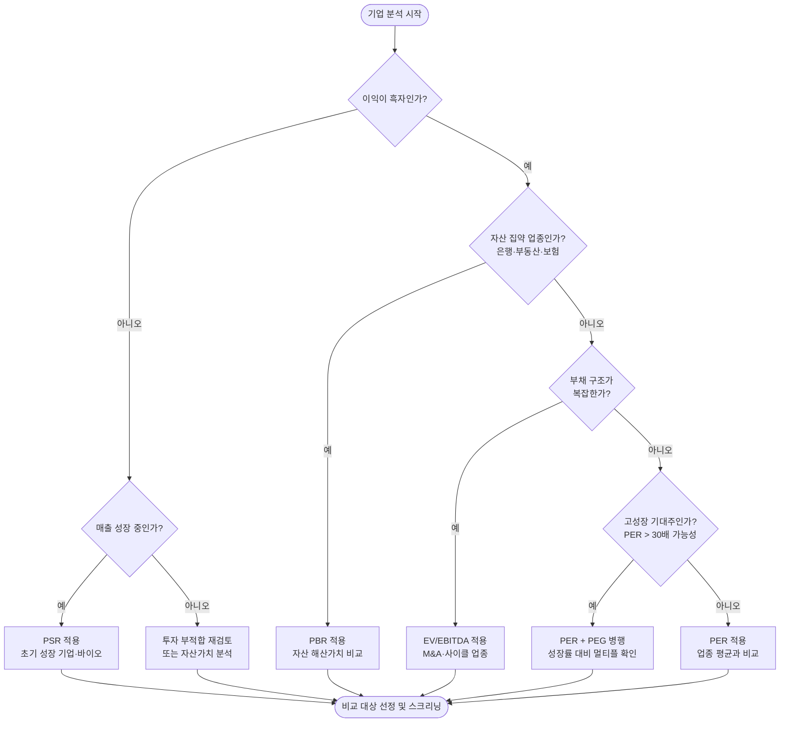
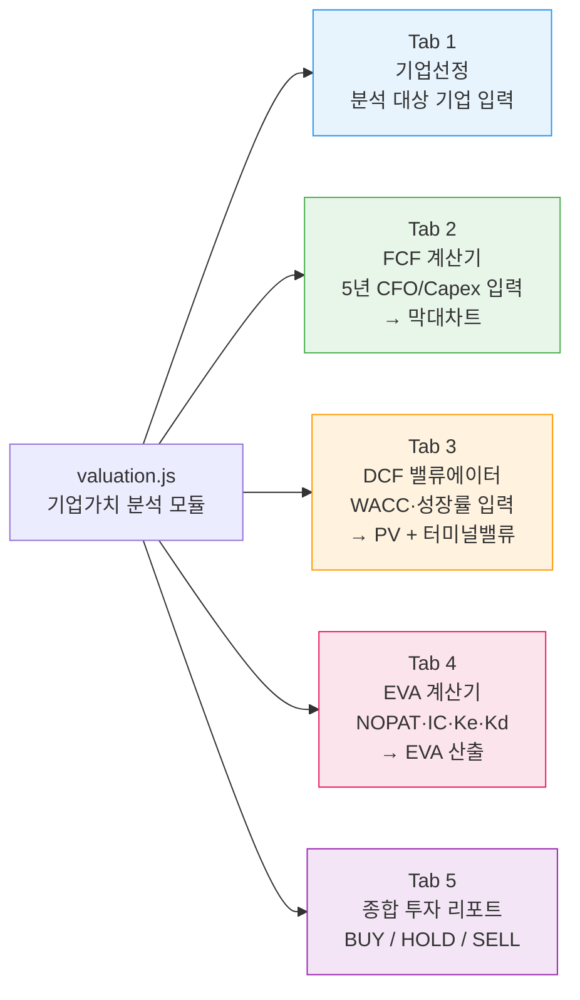
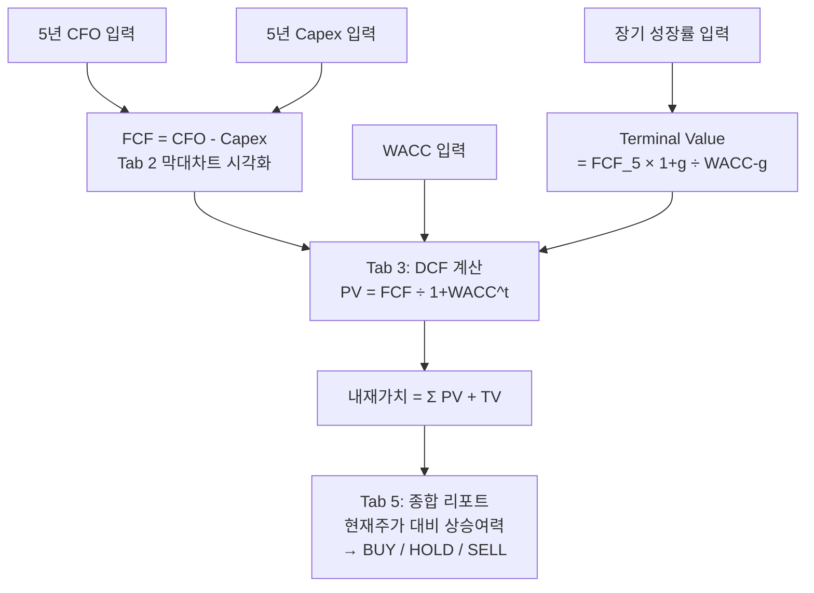

# Day 049 — 상대가치 평가 (밸류에이션 멀티플)

> **모듈 7: 투자분석 기초 방법론** | 8/10일차 | 💹 | 학습시간: 8시간


---

> 📺 **YouTube 강의**: [🎬 밸류에이션 멀티플 PER PBR](https://www.youtube.com/results?search_query=밸류에이션+멀티플+PER+PBR+주식+한국어)

## 오늘 배울 것 (아주 쉽게)

- PER (주가수익비율) 개념과 활용
- PBR, EV/EBITDA, PSR 멀티플
- 업종별 적정 멀티플 기준
- 실습: 국내 종목 멀티플 스크리닝 및 비교

---


### 1. PER (주가수익비율) 개념과 활용

> 📺 [🎬 PER 주가수익비율 뜻 활용법](https://www.youtube.com/results?search_query=PER+주가수익비율+뜻+활용법+한국어)

**PER 계산 공식**

```
PER = 주가 / 주당순이익(EPS)
    = 시가총액 / 당기순이익
```

**Python 코드 예시**

```python
# PER / PBR 계산 예시
def calc_per(price: float, eps: float) -> float:
    """주가수익비율 계산. eps <= 0 이면 None 반환 (적자 기업)."""
    if eps <= 0:
        return None
    return round(price / eps, 2)

def calc_pbr(price: float, bps: float) -> float:
    """주가순자산비율 계산."""
    if bps <= 0:
        return None
    return round(price / bps, 2)

def calc_psr(market_cap: float, revenue: float) -> float:
    """주가매출비율 계산."""
    if revenue <= 0:
        return None
    return round(market_cap / revenue, 2)

# 삼성전자 예시 (가상 수치)
samsung = {"price": 75_000, "eps": 5_000, "bps": 50_000, "revenue": 300_000_000}
samsung_market_cap = samsung["price"] * 5_969_782_550  # 발행주식수

per = calc_per(samsung["price"], samsung["eps"])   # → 15.0
pbr = calc_pbr(samsung["price"], samsung["bps"])   # → 1.5
psr = calc_psr(samsung_market_cap, samsung["revenue"])

print(f"PER: {per}배  |  PBR: {pbr}배  |  PSR: {psr:.1f}배")
```

- PER 20배 = 지금 이익 수준이라면 20년이 지나야 투자금을 회수한다는 뜻
- 높은 PER: 시장이 미래 고성장을 기대 / 낮은 PER: 저평가이거나 성장 정체·위험 반영
- **적자 기업에는 PER 계산 불가**, 일회성 이익이 섞이면 왜곡될 수 있습니다.

**멀티플 레벨별 해석 (PER 기준)**

```mermaid
quadrantChart
    title PER 수준 vs 성장률 — 밸류에이션 포지셔닝
    x-axis 낮은 성장률 --> 높은 성장률
    y-axis 낮은 PER --> 높은 PER
    quadrant-1 고성장 프리미엄 (정당한 높은 PER)
    quadrant-2 버블 위험 (성장 없는 고PER)
    quadrant-3 가치주 구간 (저PER·저성장)
    quadrant-4 숨겨진 저평가 (고성장·저PER)
    플랫폼IT: [0.85, 0.80]
    바이오성장주: [0.90, 0.90]
    반도체: [0.70, 0.65]
    소비재: [0.45, 0.40]
    은행금융: [0.30, 0.25]
    전통제조: [0.20, 0.30]
    과열성장주: [0.30, 0.85]
    가치저평가: [0.75, 0.20]
```

### 2. PBR, EV/EBITDA, PSR 멀티플

> 📺 [🎬 PBR EV EBITDA PSR 멀티플 비교](https://www.youtube.com/results?search_query=PBR+EV+EBITDA+PSR+멀티플+비교+한국어)

| 멀티플 | 공식 | 언제 유용한가 |
|--------|------|---------------|
| **PBR** | 주가 / 주당순자산(BPS) | 자산 중심 업종 (은행, 부동산), 해산 가치 비교 |
| **EV/EBITDA** | 기업가치 / EBITDA | 부채 구조 비교, 인수합병 가치 평가 |
| **PSR** | 시가총액 / 매출액 | 적자 성장 기업, 매출이 핵심인 초기 기업 |

- 이익이 불안정한 기업은 PER보다 **PSR이나 EV/EBITDA**가 더 유용할 수 있습니다.
- 어떤 멀티플이 맞는지는 기업 특성(성장 단계·자산 구조·이익 안정성)에 따라 달라집니다.

**EV/EBITDA를 조금 더 풀어서 보기**

```python
def calc_ev_ebitda(
    market_cap: float,
    total_debt: float,
    cash: float,
    ebitda: float
) -> float:
    """
    EV = 시가총액 + 순차입금(총차입금 - 현금성자산)
    EV/EBITDA = 사업 전체 가치 ÷ 감가상각 전 영업현금창출력
    """
    ev = market_cap + (total_debt - cash)
    if ebitda <= 0:
        return None
    return round(ev / ebitda, 2)

# 예시: A사(무차입) vs B사(고차입) — 시가총액 동일
ev_a = calc_ev_ebitda(market_cap=1_000_000, total_debt=50_000,  cash=200_000, ebitda=80_000)
ev_b = calc_ev_ebitda(market_cap=1_000_000, total_debt=500_000, cash=50_000,  ebitda=80_000)
# ev_a → 10.6배,  ev_b → 18.1배  ← 같은 시총이어도 EV/EBITDA 크게 다름
```

- **시가총액만 보면 놓치는 것**: 부채가 많은 회사와 무차입 회사는 같은 시가총액이어도 실제 인수 부담이 다릅니다.
- **EBITDA가 유용한 이유**: 감가상각, 이자, 세금 영향을 덜 받아 업종 내 비교가 쉬워집니다.
- **주의점**: 설비투자 부담이 큰 업종은 EBITDA가 실제 현금창출력보다 좋아 보일 수 있으니 Capex도 함께 봐야 합니다.

### 3. 업종별 적정 멀티플 기준

> 📺 [🎬 업종별 적정 PER PBR 기준](https://www.youtube.com/results?search_query=업종별+적정+PER+PBR+기준+한국어+주식)

| 업종 | 주요 멀티플 | 대략적 범위 | 이유 |
|------|-------------|-------------|------|
| 은행·금융 | PBR | 0.5~1.5배 | 자산 가치 중심 |
| 반도체 | EV/EBITDA | 10~25배 | 사이클 평탄화 목적 |
| 플랫폼·IT | PER 또는 PSR | 20~50배+ | 고성장 프리미엄 |
| 소비재·유통 | PER | 10~20배 | 안정적 이익 |
| 바이오 | PSR | 적자라 PER 미사용 | 파이프라인 가치 |

- 멀티플이 낮다고 무조건 저평가가 아니라, **성장 둔화나 재무 위험이 반영된 결과**일 수도 있습니다.

**업종별 멀티플 선택 프로세스**



### 4. 실습: 국내 종목 멀티플 스크리닝 및 비교

**쉽게 이해하기**
- 스크리닝은 많은 종목 중에서 원하는 조건에 맞는 후보를 빠르게 추리는 과정입니다.
- 예를 들어 같은 업종 안에서 PER은 낮고 영업이익률은 높은 기업을 찾으면, "실적 대비 저평가 후보"를 골라볼 수 있습니다.

**장표에서 볼 포인트**
- 이 장표는 멀티플 개념을 실제 종목 선택 과정으로 연결하는 역할을 합니다.
- 조건을 너무 많이 걸면 좋은 기업을 놓칠 수 있으니, 먼저 2~3개의 핵심 기준으로 좁힌 뒤 추가로 검토하는 방식이 효율적입니다.

**기업가치 분석용 비교 체크리스트**

| 확인 항목 | 왜 필요한가 | 실무 해석 |
|-----------|-------------|-----------|
| **동일 업종·유사 비즈니스 모델** | 멀티플 비교의 출발점 | 은행과 플랫폼 기업을 같은 기준으로 비교하면 왜곡 |
| **성장률 차이** | 높은 성장 기업은 프리미엄 가능 | 멀티플이 높아도 성장으로 설명되는지 확인 |
| **부채 구조** | EV/EBITDA 해석에 직접 영향 | 차입 급증 기업은 EV가 빠르게 높아질 수 있음 |
| **일회성 이익/손실** | PER, EBITDA 왜곡 방지 | 자산 매각 이익이 포함됐는지 점검 |
| **현금흐름과 Capex** | 숫자의 질 확인 | EBITDA가 좋아도 FCF가 약하면 할인 필요 |

---

## 🔗 Python 소스 연계

이 문서에서 학습한 멀티플 개념은 **`valuation.js`** 프론트엔드 모듈로 직접 구현되어 있습니다.

**valuation.js 탭 구조**



**Tab 2 (FCF) ↔ Tab 3 (DCF) 연계 흐름**



**Tab 4 EVA 계산 핵심 공식**

```python
# valuation.js의 EVA 계산 로직 (Python 등가 표현)
def calc_eva(nopat: float, ic: float, ke: float, kd: float,
             debt_ratio: float, tax_rate: float) -> dict:
    """
    NOPAT  = 세후 영업이익
    IC     = 투하자본 (영업자산 - 영업부채)
    WACC   = Ke × E/(D+E) + Kd × (1-t) × D/(D+E)
    EVA    = NOPAT - WACC × IC
    """
    equity_ratio = 1 - debt_ratio
    wacc = ke * equity_ratio + kd * (1 - tax_rate) * debt_ratio
    cost_of_capital = wacc * ic
    eva = nopat - cost_of_capital
    return {
        "WACC": round(wacc * 100, 2),
        "자본비용": round(cost_of_capital, 0),
        "EVA": round(eva, 0),
        "평가": "가치창출" if eva > 0 else "가치훼손"
    }

# 예시 (가상 수치)
result = calc_eva(
    nopat=500_000,       # 5억 원
    ic=3_000_000,        # 30억 원
    ke=0.10,             # 자기자본비용 10%
    kd=0.04,             # 타인자본비용 4%
    debt_ratio=0.40,     # 부채비율 40%
    tax_rate=0.22        # 법인세율 22%
)
# → {'WACC': 7.05, '자본비용': 211500, 'EVA': 288500, '평가': '가치창출'}
```

**`/api/quant/pipeline` 과의 연계**

`valuation.js`는 순수 프론트엔드 계산 모듈이며, 백엔드 `/api/quant/pipeline` API의 **Stage 4 Portfolio Construction**과 개념적으로 연결됩니다. DCF/EVA로 내재가치를 산출한 뒤 포지션 사이징 로직으로 넘기는 흐름입니다.

```mermaid
flowchart LR
    V[valuation.js\n내재가치 산출] -- "BUY 신호 종목" --> P[/api/quant/pipeline\nStage 4: Portfolio\nConstruction]
    P -- "포지션 비중·리스크" --> D[최종 투자 결정]
```

---

## 해보기 활동

멀티플 비교는 "숫자 읽기"보다 "비교 이유 설명하기"가 더 중요합니다.

1. 같은 업종 기업 3개를 골라 PER, PBR, EV/EBITDA 중 확인 가능한 값들을 표로 정리해보세요.
2. 어떤 기업은 왜 PER보다 PBR이나 PSR이 더 적합한지 한 줄로 써보세요.
3. 업종 평균보다 높은 멀티플을 받는 기업 1개를 고르고, 시장이 왜 프리미엄을 주는지 추정해보세요.
4. EV/EBITDA가 낮아 보여도 실제로는 위험할 수 있는 이유를 순부채·Capex 관점에서 적어보세요.
5. 마지막으로 "지금 가장 먼저 추가 확인하고 싶은 기업"을 1개 고르고 이유를 적어보세요.


## 다음 시간 미리보기

➡️ [Day 050](35.md) 에서 계속됩니다.
