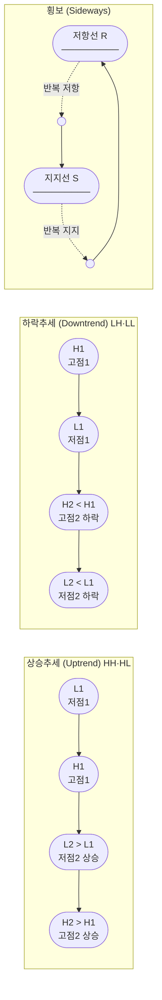
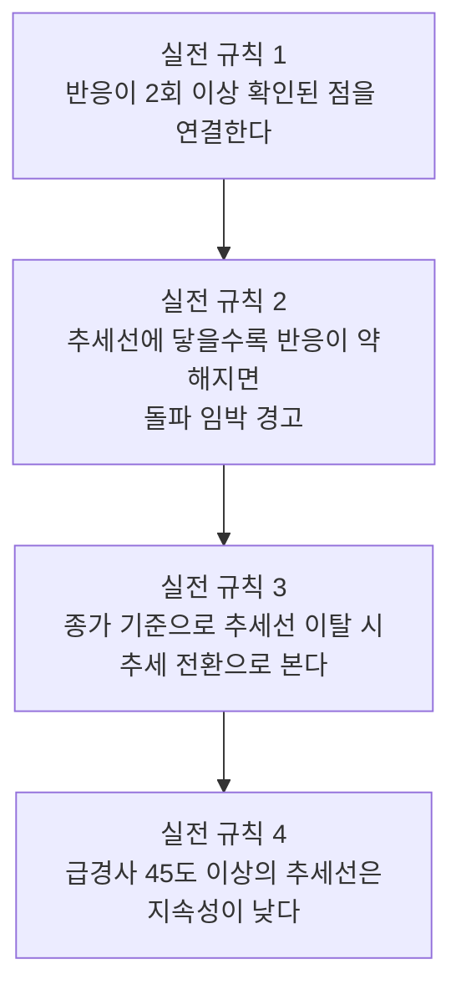
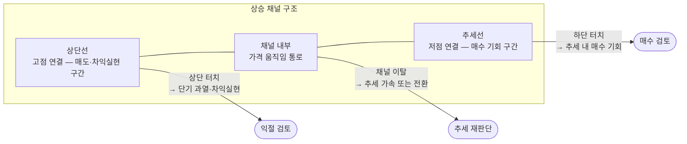
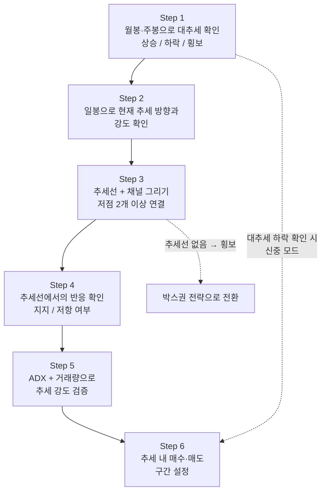
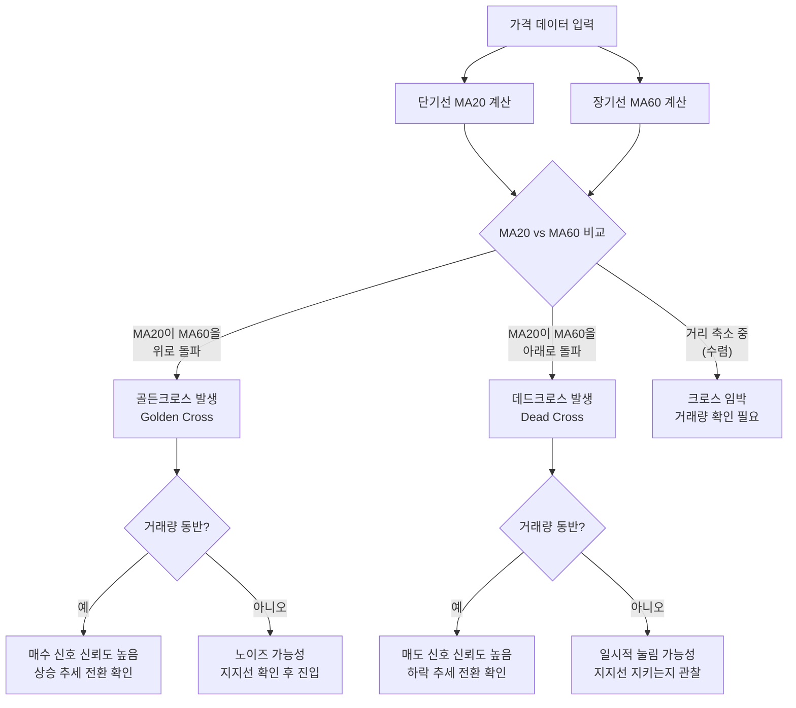
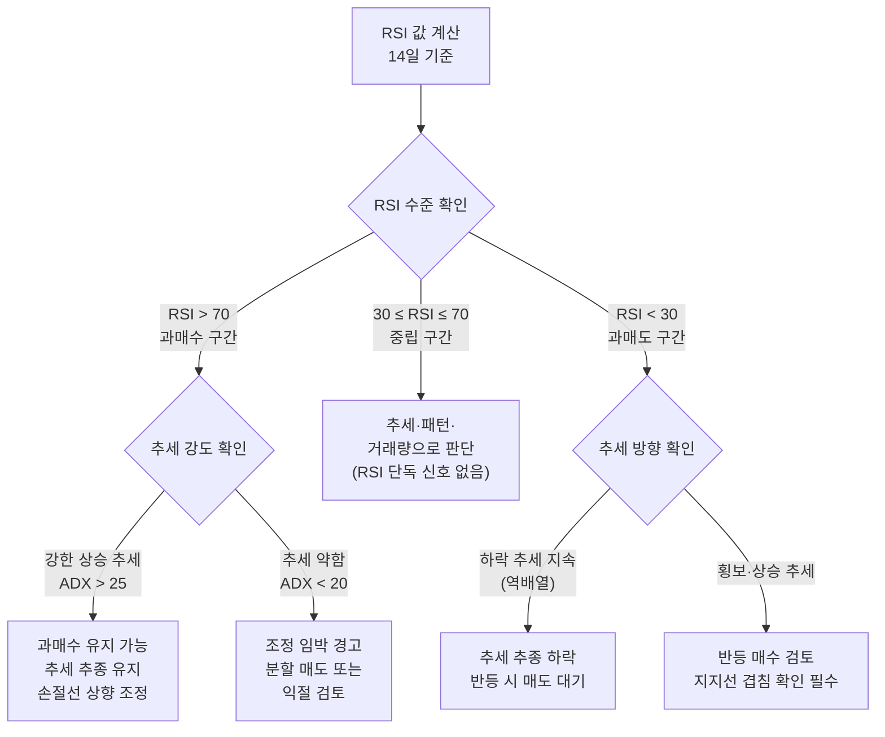
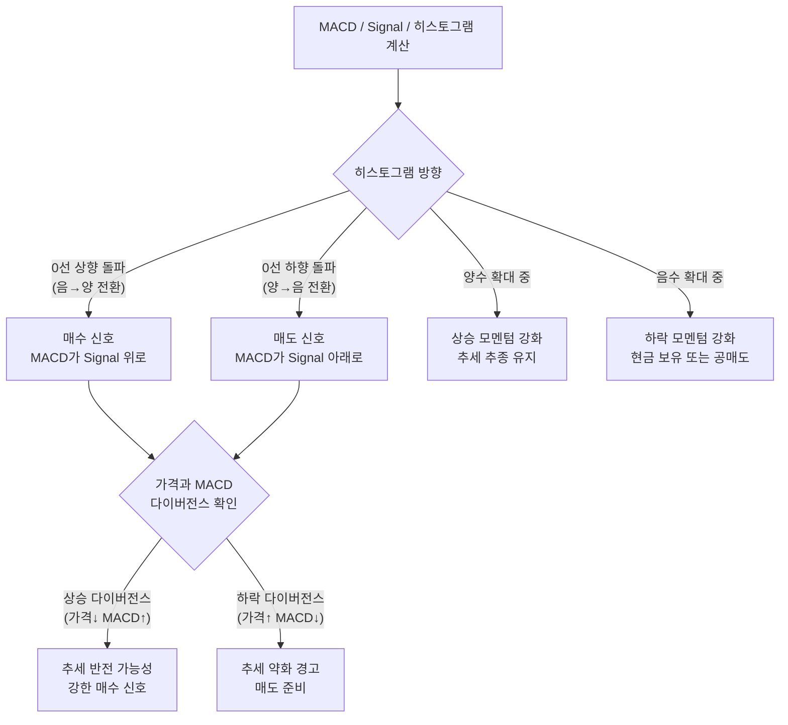
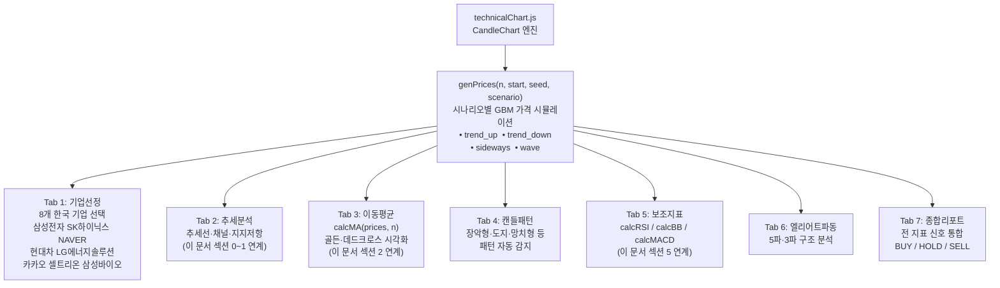
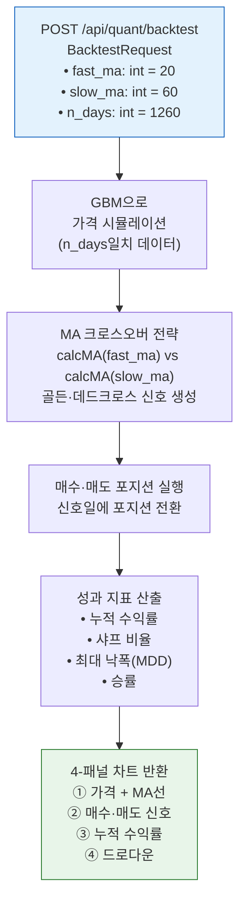
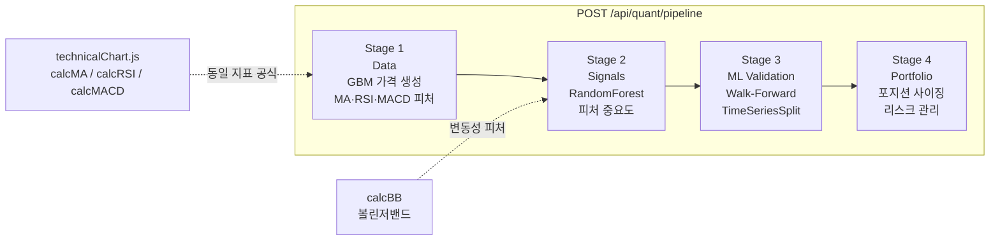

# Day 050 — 기술적 분석 I (추세 & 지표)

> **모듈 7: 투자분석 기초 방법론** | 9/10일차 | 💹 | 학습시간: 8시간


---

> 📺 **YouTube 강의**: [🎬 기술적 분석 추세 지표 이동평균](https://www.youtube.com/results?search_query=기술적분석+추세+이동평균+RSI+파이썬+한국어)

## 오늘 배울 것 (아주 쉽게)

- 지지선(Support)과 저항선(Resistance)
- 이동평균선(MA)과 골든크로스·데드크로스
- 갭(Gap) 반전 분석
- 되돌림 분석 (피보나치 되돌림)
- 보조지표: RSI, MACD, 볼린저밴드
- 실습: Python으로 기술적 지표 계산 및 시각화

---


### 0. 추세분석 (Trend Analysis) — 가장 먼저 봐야 할 것

> 📺 [🎬 추세분석 상승 하락 횡보 기술적 분석](https://www.youtube.com/results?search_query=추세분석+상승추세+하락추세+횡보+기술적분석+한국어)

**추세란 무엇인가?**

> "추세를 따라가라(Trend is your friend)" — 기술적 분석의 제1 원칙

추세는 가격이 **방향을 가지고 지속적으로 움직이는 흐름**입니다. 모든 기술적 분석은 추세 파악에서 시작합니다.

#### 추세의 세 가지 종류

| 추세 | 정의 | 특징 | 매매 관점 |
|------|------|------|-----------|
| **상승추세 (Uptrend)** | 고점과 저점이 연속해서 높아짐 (HH·HL) | 저점에서 매수 기회 발생 | 추세 방향으로 매수 |
| **하락추세 (Downtrend)** | 고점과 저점이 연속해서 낮아짐 (LH·LL) | 고점에서 매도 기회 발생 | 현금 보유 또는 공매도 |
| **횡보 (Sideways)** | 일정 범위 내에서 등락 반복 | 지지·저항 구간 매매 유효 | 박스권 상하단 역매매 |

**상승·하락·횡보 추세 구조**



#### 추세선 긋는 법 (실전)

**상승 추세선**: 연속된 **저점 2개 이상**을 이어 아래에서 위로 올라가는 선
**하락 추세선**: 연속된 **고점 2개 이상**을 이어 위에서 아래로 내려가는 선



#### 추세 채널 (Trend Channel)

추세선과 **평행한 선**을 그어 가격이 움직이는 통로(채널)를 표시합니다.



- 채널 **상단 터치**: 단기 과열, 차익실현 구간
- 채널 **하단 터치**: 추세 내 매수 기회
- 채널 **이탈**: 추세 가속 또는 추세 전환 신호

#### 추세 강도 판단

| 방법 | 기준 | 해석 |
|------|------|------|
| **ADX (평균방향성지수)** | ADX > 25 | 강한 추세 존재 |
| | ADX < 20 | 추세 없음 (횡보) |
| **거래량** | 추세 방향에서 거래량 증가 | 추세 신뢰도 상승 |
| | 추세 방향에서 거래량 감소 | 추세 약화 징후 |
| **이동평균 배열** | 단기 > 중기 > 장기 (정배열) | 상승 추세 강함 |
| | 단기 < 중기 < 장기 (역배열) | 하락 추세 강함 |

**실전 추세 분석 6단계 프로세스**



---

### 1. 지지선(Support)과 저항선(Resistance)

> 📺 [🎬 지지선 저항선 기술적 분석](https://www.youtube.com/results?search_query=지지선+저항선+기술적분석+주식+한국어)

- **지지선**: 가격이 내려오다가 자주 멈추는 구간 — 매수 세력이 모이는 가격대
- **저항선**: 올라가다가 자주 막히는 구간 — 매도 세력이 모이는 가격대

많은 투자자가 비슷한 가격대를 중요하게 보기 때문에 차트에 반복 반응 구간이 생깁니다.

- **역할 전환**: 돌파된 저항선은 이후 지지선으로, 붕괴된 지지선은 이후 저항선으로 바뀌는 경우가 많습니다.
- 선을 정확히 한 가격으로 보기보다 **여러 번 반응한 가격대 범위**로 보는 것이 실전에 가깝습니다.

**실전 활용법**

| 상황 | 대응 |
|------|------|
| 가격이 지지선 접근 + 거래량 감소 | 지지 유지 가능성 → 매수 검토 |
| 가격이 지지선 이탈 + 거래량 급증 | 지지 붕괴 → 다음 지지선으로 목표 하향 |
| 가격이 저항선 돌파 + 거래량 급증 | 돌파 신뢰 → 매수 진입 또는 목표가 상향 |
| 저항선 돌파 후 눌림목 (이전 저항 = 새 지지) | 역할 전환 확인 → 추가 매수 기회 |

**삼성전자 예시 — 역할 전환**

```
저항선 70,000원 → 3차례 저항 후 돌파
돌파 후 70,000원이 지지선으로 역할 전환
다음 목표: 이전 고점 80,000원대
```

### 2. 이동평균선(MA)과 골든크로스·데드크로스

> 📺 [🎬 이동평균선 골든크로스 데드크로스](https://www.youtube.com/results?search_query=이동평균선+골든크로스+데드크로스+한국어)

| 이동평균선 | 기간 | 용도 |
|-----------|------|------|
| MA5 (단기) | 5일 | 단기 모멘텀 |
| MA20 (중기) | 20일 | 월간 추세 |
| MA60 (중장기) | 60일 | 분기 추세 |
| MA200 (장기) | 200일 | 장기 추세 기준선 |

**골든크로스·데드크로스 발생 시나리오**



- **골든크로스**: 단기선(MA20)이 장기선(MA60)을 위로 돌파 → 상승 추세 전환 신호
- **데드크로스**: 단기선이 장기선을 아래로 돌파 → 하락 추세 전환 신호
- 크로스 하나만 보지 않고 **거래량·지지저항**과 함께 봐야 신호 신뢰도가 높아집니다.

**이동평균선 정배열·역배열 실전 판단**

```
정배열(상승 강세):  MA5 > MA20 > MA60 > MA200
역배열(하락 약세):  MA5 < MA20 < MA60 < MA200
```

| 이동평균 활용 | 실전 포인트 |
|--------------|-------------|
| MA5·MA20 골든크로스 | 단기 매수 신호, 빠르지만 노이즈 많음 |
| MA20·MA60 골든크로스 | 중기 추세 전환 신호, 신뢰도 높음 |
| 가격이 MA200 위 → 아래 이탈 | 장기 하락 추세 전환 경고 |
| MA20이 지지선 역할 | 눌림목 매수 대기 구간 |

**실전 예시**: 코스피 2020년 코로나 저점 이후 MA20 > MA60 골든크로스 발생 → 이후 12개월 상승 추세 지속

### 3. 갭(Gap) 반전 분석

> 📺 [🎬 주식 갭 분석 갭상승 갭하락](https://www.youtube.com/results?search_query=주식+갭+갭상승+갭하락+분석+한국어)

갭은 전날 종가와 다음 날 시가 사이에 가격이 크게 비어 있는 구간입니다.

| 갭 종류 | 특징 | 의미 |
|---------|------|------|
| **보통 갭** | 작은 갭, 빠르게 메움 | 일시적 수급 불균형 |
| **돌파 갭(Breakaway)** | 박스권·저항선 돌파 후 발생 | 강한 추세 시작 신호 |
| **달아나는 갭(Runaway)** | 추세 중간에 발생 | 추세 지속 신호 |
| **소진 갭(Exhaustion)** | 추세 끝에서 마지막 힘 | 추세 마감 경고 |

- 갭이 나온 뒤 거래량이 붙는지, 다시 메워지는지 확인하면 일시 반응인지 추세 시작인지 구분됩니다.

**갭 상승 후 체크리스트**

```
갭 상승 후 체크리스트:
□ 거래량이 평균의 2배 이상인가?  → 강한 추세 시작 가능성
□ 다음 날 갭을 메우려는 시도가 있는가?  → 소진갭 가능성
□ 갭 발생 전 박스권 상단을 돌파했는가?  → 돌파 갭 (추세 시작)
□ 갭 발생 후 5일 내 갭을 완전히 메우는가?  → 보통 갭 (일시적)
```

**실전 예시**: 실적 서프라이즈 발표 후 상승 갭 → 거래량 동반 + 박스권 돌파 → 돌파 갭으로 판단 → 눌림목 매수 전략 유효

### 4. 되돌림 분석 (피보나치 되돌림)

> 📺 [🎬 피보나치 되돌림 기술적 분석](https://www.youtube.com/results?search_query=피보나치+되돌림+기술적분석+한국어+주식)

피보나치 수열에서 파생된 비율을 이용해 조정이 멈출 만한 구간을 가늠합니다.

**주요 피보나치 되돌림 레벨**

| 레벨 | 의미 |
|------|------|
| 23.6% | 약한 조정 후 지지 |
| 38.2% | 일반적 조정의 지지 |
| **50.0%** | 심리적 중간점 |
| **61.8%** | 황금비율 — 강력한 지지·저항 |
| 78.6% | 깊은 되돌림 |

- 피보나치 비율을 맹신하기보다 **지지선·저항선과 겹치는 구간**을 우선적으로 신뢰합니다.

**되돌림 실전 활용**

```
실전 예시:
주가가 50,000 → 80,000원으로 상승 후 조정 시작
피보나치 되돌림 적용:
  38.2% 되돌림 = 80,000 - (80,000-50,000)×0.382 = 68,540원 → 1차 지지
  61.8% 되돌림 = 80,000 - (80,000-50,000)×0.618 = 61,460원 → 강한 지지
68,540원 구간 + MA20 지지 겹침 → 높은 신뢰도의 매수 구간
```

| 되돌림 깊이 | 추세 강도 | 대응 |
|------------|----------|------|
| 23.6% 이하 | 매우 강한 상승 추세 | 추격 매수 가능 |
| 38.2% | 건강한 조정 | 눌림목 매수 적기 |
| 61.8% | 추세 확인 구간 | 신중한 매수 |
| 78.6% 초과 | 추세 약화 가능성 | 손절 후 관망 |

### 5. 보조지표: RSI, MACD, 볼린저밴드

> 📺 [🎬 RSI MACD 볼린저밴드 사용법](https://www.youtube.com/results?search_query=RSI+MACD+볼린저밴드+기술적지표+한국어)

**RSI (Relative Strength Index, 상대강도지수)**

```
RSI = 100 - 100 / (1 + RS)
RS  = 14일 평균 상승폭 / 14일 평균 하락폭
```

> 📺 [🎬 RSI 지표 매매 전략](https://www.youtube.com/results?search_query=RSI+지표+매매전략+한국어+주식)

**RSI 신호 판단 흐름**



**MACD (Moving Average Convergence Divergence)**

```
MACD    = EMA12 - EMA26
Signal  = MACD의 9일 EMA
히스토그램 = MACD - Signal
```

> 📺 [🎬 MACD 지표 사용법 매매 전략](https://www.youtube.com/results?search_query=MACD+지표+사용법+매매전략+한국어)

**MACD 신호 판단 흐름**



**볼린저밴드 (Bollinger Bands)**

```
중심선    = MA20
상단밴드   = MA20 + 2σ (표준편차)
하단밴드   = MA20 - 2σ
```

> 📺 [🎬 볼린저밴드 설명 매매 전략](https://www.youtube.com/results?search_query=볼린저밴드+설명+매매전략+한국어+주식)

- 밴드 폭 좁아짐(수렴) → 변동성 축소, 곧 큰 움직임 예고
- 가격이 상단 터치 후 꺾임 → 과열 주의

지표 간 방향이 일치하는지 확인하는 습관이 신호 신뢰도를 높입니다.

### 6. 실습: Python으로 기술적 지표 계산 및 시각화

**쉽게 이해하기**
- 실습의 목표는 지표 수식을 외우는 것이 아니라, 가격 데이터를 넣었을 때 차트에 어떤 모습으로 나타나는지 직접 확인하는 것입니다.
- 선 하나를 그리는 데서 끝나지 않고, 지표가 실제 매수·매도 판단에 어떻게 도움을 주는지 연결해 봐야 합니다.

**장표에서 볼 포인트**
- 이 장표는 기술적 분석 개념을 실제 데이터 시각화로 연결하는 역할을 합니다.
- 계산 결과가 맞는지 확인한 뒤, 특정 구간에서 지표가 왜 그렇게 움직였는지 가격 흐름과 함께 설명할 수 있어야 합니다.

---

## 🔗 Python 소스 연계

이 문서에서 학습한 기술적 분석 개념은 **`technicalChart.js`** 와 **`/api/quant/backtest`** 백엔드 API로 직접 구현되어 있습니다.

### technicalChart.js 구조

**7개 탭과 분석 기능 흐름**



### 지표 계산 함수 상세 예시

**`calcMA(prices, n)` — 단순이동평균**

```python
# technicalChart.js의 calcMA 함수 Python 등가 구현
def calcMA(prices: list[float], n: int) -> list[float | None]:
    """
    n일 단순이동평균(SMA) 계산.
    데이터가 부족한 초기 구간은 None 반환 (JS: null).
    """
    result = [None] * (n - 1)
    for i in range(n - 1, len(prices)):
        window = prices[i - n + 1 : i + 1]
        result.append(sum(window) / n)
    return result

# 예시
prices = [100, 102, 101, 105, 107, 110, 108, 112, 115, 113]
ma5  = calcMA(prices, 5)
ma20 = calcMA(prices, 20)
# ma5  → [None, None, None, None, 103.0, 105.0, 106.2, 108.4, 110.4, 111.6]
# ma20 → [None] * 19 + [값] (데이터 부족 시 대부분 None)

# 골든크로스 감지
def detect_crossover(fast_ma, slow_ma):
    signals = []
    for i in range(1, len(fast_ma)):
        if None in (fast_ma[i-1], fast_ma[i], slow_ma[i-1], slow_ma[i]):
            continue
        if fast_ma[i-1] <= slow_ma[i-1] and fast_ma[i] > slow_ma[i]:
            signals.append({"index": i, "type": "GOLDEN_CROSS"})
        elif fast_ma[i-1] >= slow_ma[i-1] and fast_ma[i] < slow_ma[i]:
            signals.append({"index": i, "type": "DEAD_CROSS"})
    return signals
```

**`calcRSI(prices, n=14)` — 상대강도지수**

```python
def calcRSI(prices: list[float], n: int = 14) -> list[float | None]:
    """
    RSI = 100 - 100 / (1 + RS)
    RS  = n일 평균 상승폭 / n일 평균 하락폭
    Wilder 스무딩 방식 사용.
    """
    result = [None] * n
    deltas = [prices[i] - prices[i-1] for i in range(1, len(prices))]

    gains = [max(d, 0) for d in deltas]
    losses = [abs(min(d, 0)) for d in deltas]

    avg_gain = sum(gains[:n]) / n
    avg_loss = sum(losses[:n]) / n

    for i in range(n, len(deltas)):
        avg_gain = (avg_gain * (n - 1) + gains[i]) / n  # Wilder 스무딩
        avg_loss = (avg_loss * (n - 1) + losses[i]) / n

        rs = avg_gain / avg_loss if avg_loss != 0 else float('inf')
        result.append(round(100 - 100 / (1 + rs), 2))

    return result

# 예시 출력
prices_ex = [44, 44.34, 44.09, 44.15, 43.61, 44.33, 44.83, 45.10,
             45.15, 43.61, 44.33, 44.83, 45.10, 45.15, 45.98]
rsi = calcRSI(prices_ex, n=14)
# 마지막 값 → 약 70 내외 (과매수 근접)
```

**`calcBB(prices, n=20, mult=2)` — 볼린저밴드**

```python
import math

def calcBB(prices: list[float], n: int = 20, mult: float = 2.0) -> dict:
    """
    중심선 = MA20
    상단밴드 = MA20 + mult × σ
    하단밴드 = MA20 - mult × σ
    """
    upper, middle, lower = [], [], []
    for i in range(len(prices)):
        if i < n - 1:
            upper.append(None); middle.append(None); lower.append(None)
            continue
        window = prices[i - n + 1 : i + 1]
        ma = sum(window) / n
        variance = sum((p - ma) ** 2 for p in window) / n
        std = math.sqrt(variance)
        upper.append(round(ma + mult * std, 4))
        middle.append(round(ma, 4))
        lower.append(round(ma - mult * std, 4))
    return {"upper": upper, "middle": middle, "lower": lower}

# %B 지표: 현재가가 밴드 내 어디에 위치하는지 (0~1, 1 초과 = 과열)
def calc_percent_b(price, upper, lower):
    if upper is None or lower is None or upper == lower:
        return None
    return round((price - lower) / (upper - lower), 4)
```

**`calcMACD(prices)` — MACD / Signal / 히스토그램**

```python
def calcEMA(prices: list[float], n: int) -> list[float | None]:
    """지수이동평균(EMA) 계산."""
    k = 2 / (n + 1)
    result = [None] * (n - 1)
    result.append(sum(prices[:n]) / n)  # 초기값: SMA
    for i in range(n, len(prices)):
        result.append(prices[i] * k + result[-1] * (1 - k))
    return result

def calcMACD(prices: list[float],
             fast: int = 12, slow: int = 26, signal: int = 9) -> dict:
    """
    MACD    = EMA12 - EMA26
    Signal  = MACD의 9일 EMA
    Histogram = MACD - Signal
    """
    ema_fast = calcEMA(prices, fast)
    ema_slow = calcEMA(prices, slow)

    macd_line = []
    for f, s in zip(ema_fast, ema_slow):
        if f is None or s is None:
            macd_line.append(None)
        else:
            macd_line.append(round(f - s, 4))

    # Signal: None 제거 후 EMA 계산, 원래 위치에 재배치
    valid_idx = [i for i, v in enumerate(macd_line) if v is not None]
    valid_macd = [macd_line[i] for i in valid_idx]
    signal_vals_raw = calcEMA(valid_macd, signal)

    signal_line = [None] * len(macd_line)
    for idx, val in zip(valid_idx, signal_vals_raw):
        signal_line[idx] = val

    histogram = []
    for m, s in zip(macd_line, signal_line):
        if m is None or s is None:
            histogram.append(None)
        else:
            histogram.append(round(m - s, 4))

    return {"macd": macd_line, "signal": signal_line, "histogram": histogram}
```

### `/api/quant/backtest` 와의 연계

**백테스트 API 데이터 흐름**



**백테스트 파라미터 실험 가이드**

```python
# backtest.js에서 API 호출하는 파라미터 예시
import requests

# 단기 시스템 (노이즈 많음, 매매 빈번)
short_system = {"fast_ma": 5,  "slow_ma": 20, "n_days": 500}

# 기본 시스템 (기본값)
default_system = {"fast_ma": 20, "slow_ma": 60, "n_days": 1260}

# 장기 시스템 (안정적, 매매 드뭄)
long_system   = {"fast_ma": 50, "slow_ma": 200, "n_days": 2520}

for system in [short_system, default_system, long_system]:
    resp = requests.post("http://localhost:8000/api/quant/backtest", json=system)
    metrics = resp.json().get("metrics", {})
    print(f"fast={system['fast_ma']}, slow={system['slow_ma']}: "
          f"수익률={metrics.get('total_return','?')}, "
          f"MDD={metrics.get('max_drawdown','?')}")
```

### `/api/quant/pipeline` 과의 연계



Stage 1에서 생성하는 피처는 `technicalChart.js`의 `calcMA`, `calcRSI`, `calcMACD`와 **동일한 수식**을 Python으로 구현한 것입니다. 프론트엔드 차트로 먼저 신호를 눈으로 확인하고, 백엔드 파이프라인으로 ML 검증까지 이어지는 흐름을 기억하세요.

---

## 해보기 활동

오늘은 차트에서 "어디를 봐야 하는지"를 직접 표시해보세요.

1. 관심 종목 1개의 최근 차트를 보고 지지선과 저항선 후보를 각각 2개씩 적어보세요.
2. 단기 이동평균선과 장기 이동평균선이 최근에 가까워졌는지 멀어졌는지 관찰해보세요.
3. RSI, MACD, 볼린저밴드 중 1개를 골라 지금 구간이 과열·침체·추세 지속 중 무엇에 가까운지 써보세요.
4. 마지막으로 "이 차트에서 가장 먼저 확인할 위험 신호"를 한 문장으로 정리해보세요.


## 다음 시간 미리보기

➡️ [Day 051](36.md) 에서 계속됩니다.
