# Day 051 — 기술적 분석 II (패턴 & 엘리어트 파동)

> **모듈 7: 투자분석 기초 방법론** | 10/10일차 | 💹 | 학습시간: 8시간

---

> 📺 **YouTube 강의**: [🎬 기술적 분석 패턴 엘리어트 파동](https://www.youtube.com/results?search_query=기술적분석+패턴+엘리어트파동+한국어+강의)

## 오늘 배울 것

- 캔들 패턴 분석 (도지, 망치, 장악형 등)
- 차트 패턴 분석 (헤드앤숄더, 이중천장 등)
- 엘리어트 파동 이론 개요
- 실습: 종목 선정 후 기본적·기술적 분석 통합 리포트

---

## 🗓 세부 일정 (1일 8시간)

> **강의 5시간** (5개 단락 × 50분 + 도입·마무리 50분) + **실습 3시간** = 총 8시간

| 시간 | 구분 | 내용 | 형태 |
|------|------|------|------|
| 09:00 – 09:10 | 도입 | 오늘 학습 목표 확인 | 강의 |
| 09:10 – 09:30 | **1단락** 설명 20분 | 캔들 패턴 분석 (도지·망치·장악형 등) | 강의 |
| 09:30 – 10:00 | 각자 정리 & 유튜브 30분 | 노트 정리 · 관련 영상 검색 | 자율 |
| 10:00 – 10:20 | **2단락** 설명 20분 | 차트 패턴 분석 (헤드앤숄더·이중천장 등) | 강의 |
| 10:20 – 10:50 | 각자 정리 & 유튜브 30분 | 노트 정리 · 관련 영상 검색 | 자율 |
| 10:50 – 11:00 | ☕ 휴식 | — | — |
| 11:00 – 11:20 | **3단락** 설명 20분 | 엘리어트 파동 이론 개요 | 강의 |
| 11:20 – 11:50 | 각자 정리 & 유튜브 30분 | 노트 정리 · 관련 영상 검색 | 자율 |
| 11:50 – 12:10 | **4단락** 설명 20분 | 엘리어트 파동 실전 매매 전략 | 강의 |
| 12:10 – 12:40 | 각자 정리 & 유튜브 30분 | 노트 정리 · 관련 영상 검색 | 자율 |
| 12:40 – 13:00 | **5단락** 설명 20분 | 종목 선정 후 통합 리포트 구성 방법 | 강의 |
| 13:00 – 13:30 | 각자 정리 & 유튜브 30분 | 노트 정리 · 관련 영상 검색 | 자율 |
| 13:30 – 14:00 | 강의 마무리 | Q&A · 핵심 복습 | 강의 |
| 14:00 – 15:00 | 💻 **실습 1부** 60분 | 캔들·차트·엘리어트 파동 패턴 인식 코드 작성 | 실습 |
| 15:00 – 15:10 | ☕ 휴식 | — | — |
| 15:10 – 16:00 | 💻 **실습 2부** 50분 | 통합 리포트(기본적+기술적 분석) 생성 코드 작성 | 실습 |
| 16:00 – 16:10 | ☕ 휴식 | — | — |
| 16:10 – 17:00 | 💻 **실습 발표 & 리뷰** 50분 | 코드 리뷰 · 발표 · 피드백 | 실습 |

> 강의 5시간: 도입 10분 + 단락 5개×50분 + 마무리 30분 = **300분**  
> 실습 3시간: 1부 60분 + 휴식 10분 + 2부 50분 + 휴식 10분 + 발표·리뷰 50분 = **180분**

---

### 1. 캔들 패턴 분석 (도지, 망치, 장악형 등)

캔들 차트 하나(봉)는 시가·고가·저가·종가를 한눈에 보여줍니다. 캔들의 몸통 크기와 꼬리 길이가 그날의 매수·매도 심리를 나타냅니다.

**캔들의 구조**

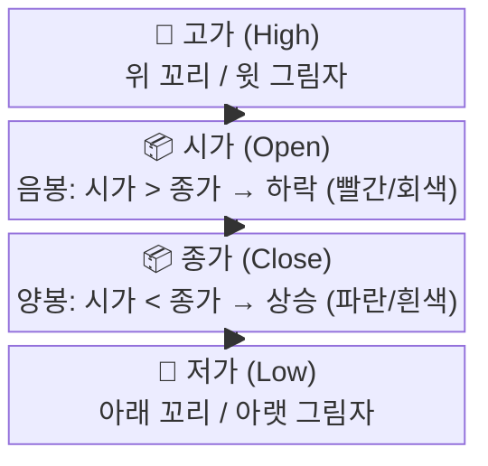

> 📺 [🎬 캔들 차트 기초 봉차트 설명](https://www.youtube.com/results?search_query=캔들차트+기초+봉차트+한국어+설명)

**OHLC 관계도**


**주요 캔들 패턴**

| 패턴 | 모양 특징 | 의미 |
|------|-----------|------|
| **도지(Doji)** | 몸통이 거의 없음 (시가≈종가) | 매수·매도 균형, 방향 전환 가능성 |
| **망치(Hammer)** | 짧은 몸통 + 긴 아래 꼬리 (하락 후 나타남) | 매도세가 결국 매수세에 밀림 → 반등 신호 |
| **역망치(Inverted Hammer)** | 짧은 몸통 + 긴 위 꼬리 (하락 후 나타남) | 매수 시도 후 저항, 반등 가능성 |
| **교수형(Hanging Man)** | 망치와 모양 같지만 상승 후 나타남 | 상승 추세 마감 신호 |
| **불리쉬 엔걸핑(Bullish Engulfing)** | 큰 양봉이 앞날 음봉 전체를 덮음 | 강한 매수 전환 신호 |
| **베어리쉬 엔걸핑(Bearish Engulfing)** | 큰 음봉이 앞날 양봉 전체를 덮음 | 강한 매도 전환 신호 |
| **샛별(Morning Star)** | 음봉 → 도지 → 양봉 3캔들 조합 | 바닥 반전 강한 신호 |

> 📺 [🎬 망치봉 도지봉 장악형 캔들 패턴](https://www.youtube.com/results?search_query=망치봉+도지봉+엔걸핑+캔들패턴+한국어)

**캔들 패턴 실전 활용 — 패턴만으로 매매하면 안 되는 이유**

| 체크 항목 | 이유 |
|-----------|------|
| 패턴 발생 위치 (지지선·저항선 근처인가?) | 위치가 맞아야 신뢰도 상승 |
| 거래량이 평균보다 많은가? | 거래량 동반 시 신호 강도 증가 |
| 다음 봉이 방향을 확인해주는가? | 확인봉 없이 단독 진입은 위험 |
| 추세 방향과 일치하는가? | 추세 역방향 패턴은 성공률 낮음 |

**실전 신뢰도 판단 흐름**

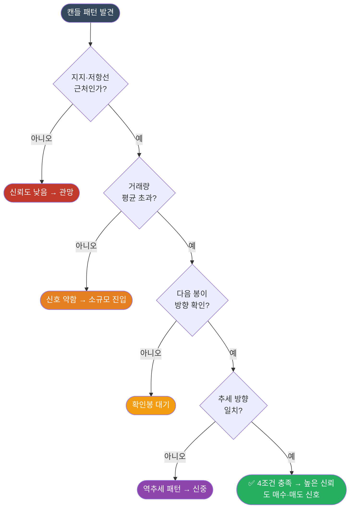

**캔들 패턴 Python 시각화**

```python
import yfinance as yf
import mplfinance as mpf

# 삼성전자 최근 3개월 캔들 차트
df = yf.download("005930.KS", period="3mo", interval="1d", auto_adjust=True)
df = df[["Open", "High", "Low", "Close", "Volume"]]
df.columns = ["Open", "High", "Low", "Close", "Volume"]

mpf.plot(
    df,
    type="candle",
    style="charles",
    title="삼성전자 캔들 차트 (최근 3개월)",
    ylabel="주가 (원)",
    volume=True,
    mav=(5, 20),
    savefig="candle_chart.png"
)
```

---

### 🔗 Python 소스 연계 — 캔들 패턴 (Section 1)

웹앱의 **Tab 4 (캔들패턴)**은 `technicalChart.js`의 `CandleChart` 클래스를 기반으로 6가지 패턴을 캔버스에 직접 그립니다.

**`technicalChart.js` Tab 4 구현 구조**

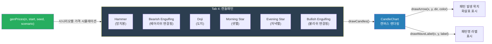

**패턴 감지 핵심 로직 (JavaScript 의사코드)**

```javascript
// CandleChart 클래스 — 주요 메서드 시그니처
class CandleChart {
    drawCandles()              // OHLC 배열 → 캔버스에 캔들 렌더링
    drawLine(prices, color)    // 이동평균선 등 꺾은선 그리기
    drawBand(upper, lower)     // 볼린저밴드 음영 영역
    drawTrendline(p1, p2)      // 추세선 (두 점 연결)
    drawHLine(price)           // 수평 지지·저항선
    drawArrow(x, y, dir, color)   // 패턴 위치 화살표 (dir: "up"/"down")
    drawWaveLabel(x, y, label)    // 파동/패턴 라벨 텍스트
}

// genPrices — 시나리오별 가격 생성
// scenario: "trend_up" | "trend_down" | "sideways" | "wave"
const prices = genPrices(n=60, start=50000, seed=42, scenario="trend_down");

// 망치봉(Hammer) 감지 조건 (Python과 동일 로직)
// 아래 꼬리 길이 > 몸통의 2배 AND 위 꼬리 없음 AND 하락 추세 후
function isHammer(open, high, low, close) {
    const body = Math.abs(close - open);
    const lowerWick = Math.min(open, close) - low;
    const upperWick = high - Math.max(open, close);
    return lowerWick > body * 2 && upperWick < body * 0.5;
}
```

**Python ↔ JavaScript 패턴 감지 대응표**

| 캔들 패턴 | Python (mplfinance) | JavaScript (technicalChart.js) |
|-----------|--------------------|---------------------------------|
| 망치봉 | `talib.CDLHAMMER()` | `isHammer(o,h,l,c)` 수식 직접 구현 |
| 도지 | `talib.CDLDOJI()` | `Math.abs(close-open) < range*0.05` |
| 엔걸핑 | `talib.CDLENGULFING()` | 전봉 몸통 포함 여부 비교 |
| 샛별 | `talib.CDLMORNINGSTAR()` | 3캔들 조합 순서 검사 |
| 시각화 | `mpf.plot(type="candle")` | `CandleChart.drawCandles()` |
| 패턴 표시 | `addplot` 화살표 | `drawArrow(x, y, "up", "#00f")` |

---

### 2. 차트 패턴 분석 (헤드앤숄더, 이중천장 등)

차트 패턴은 여러 캔들에 걸쳐 형성되는 **가격 흐름의 모양**으로, 추세 전환이나 지속을 예측하는 데 활용합니다.

> 📺 [🎬 차트 패턴 헤드앤숄더 이중천장 설명](https://www.youtube.com/results?search_query=차트패턴+헤드앤숄더+이중천장+한국어+주식)

**반전 패턴 (Reversal Patterns)**

| 패턴 | 모양 | 신호 |
|------|------|------|
| **헤드앤숄더(H&S)** | 세 봉우리 (중간이 가장 높음) | 상승 추세 종료, 하락 전환 |
| **역 헤드앤숄더** | 세 골짜기 (중간이 가장 낮음) | 하락 추세 종료, 상승 전환 |
| **이중천장(Double Top)** | M자 모양 (두 개의 비슷한 고점) | 강한 저항, 하락 전환 |
| **이중바닥(Double Bottom)** | W자 모양 (두 개의 비슷한 저점) | 강한 지지, 상승 전환 |

**헤드앤숄더 패턴 구조**

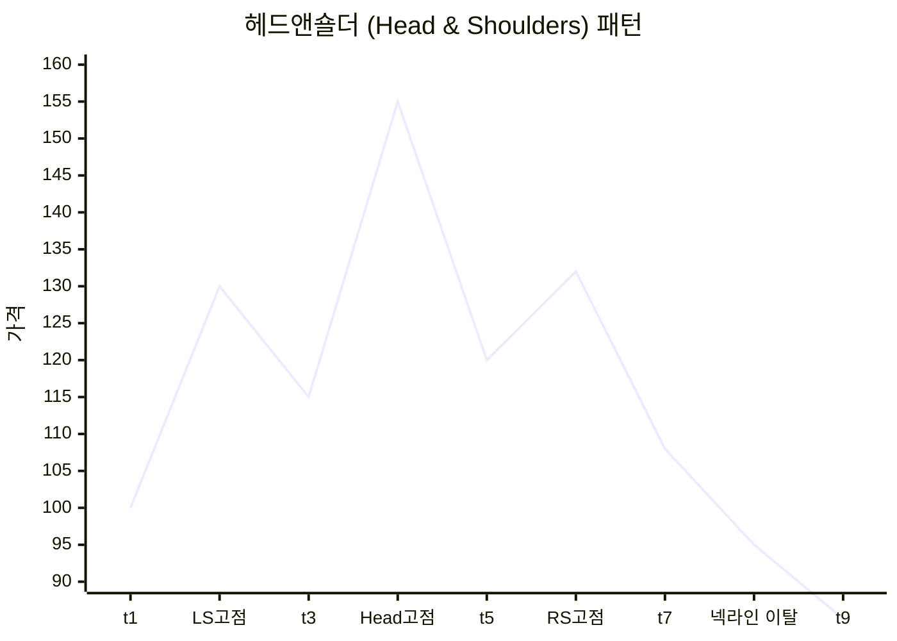

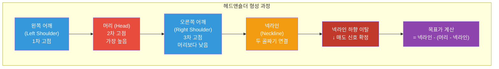

> 📺 [🎬 이중천장 이중바닥 매매 전략](https://www.youtube.com/results?search_query=이중천장+이중바닥+더블탑+매매전략+한국어)

**지속 패턴 (Continuation Patterns)**

| 패턴 | 의미 |
|------|------|
| **삼각수렴(Triangle)** | 변동성 축소 후 기존 방향으로 돌파 |
| **깃발(Flag)** | 급등/급락 후 잠시 쉬고 같은 방향 지속 |
| **페넌트(Pennant)** | 깃발과 유사하나 삼각 수렴 형태 |

**차트 패턴 실전 목표가 계산법**


**패턴 신뢰도 높이는 조건**

| 조건 | 효과 |
|------|------|
| 패턴 형성에 시간이 오래 걸릴수록 | 돌파 후 움직임이 크고 신뢰도 높음 |
| 돌파 시 거래량 급증 | 돌파의 진정성 확인 |
| 넥라인 돌파 후 눌림목에서 지지 확인 | 재진입 기회이자 패턴 확정 |
| 여러 시간대(일봉·주봉)에서 동시 형성 | 더 강한 신호 |

---

### 🔗 Python 소스 연계 — 차트 패턴 (Section 2)

**목표가 수식의 JavaScript 구현 대응**

웹앱에서는 차트 패턴의 목표가 공식을 `technicalChart.js`의 드로잉 메서드로 시각화합니다.

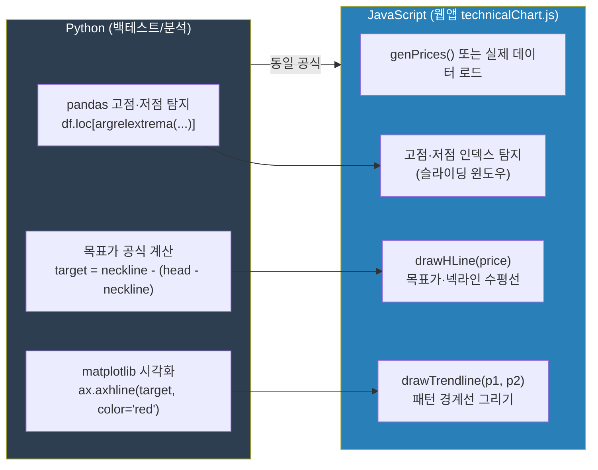

**목표가 계산 공식 JavaScript 구현 예시**

```javascript
// technicalChart.js — 패턴 목표가 계산 및 표시
function calcTargetHnS(headPrice, necklinePrice) {
    // 헤드앤숄더: 목표가 = 넥라인 - (헤드 - 넥라인)
    const amplitude = headPrice - necklinePrice;
    return necklinePrice - amplitude;
}

function calcTargetDoubleBottom(necklinePrice, bottomPrice) {
    // 이중바닥: 목표가 = 넥라인 + (넥라인 - 바닥)
    const amplitude = necklinePrice - bottomPrice;
    return necklinePrice + amplitude;
}

// CandleChart 인스턴스에 결과 표시
const chart = new CandleChart(canvas);
chart.drawHLine(necklinePrice);               // 넥라인
chart.drawHLine(targetPrice);                 // 목표가
chart.drawTrendline(shoulder1, shoulder2);    // 패턴 경계선
```

---

### 3. 엘리어트 파동 이론 (Elliott Wave Theory)

랄프 넬슨 엘리어트(Ralph Nelson Elliott)가 1930년대에 제안한 이론으로, 주가가 **군중 심리의 반복 패턴**에 따라 파동 형태로 움직인다고 봅니다.

> 📺 [🎬 엘리어트 파동이론 기초 설명](https://www.youtube.com/results?search_query=엘리어트파동이론+기초+주식+한국어+설명)

---

#### 3-1. 기본 파동 구조 — 충격 5파 + 조정 3파

상승 추세에서는 **5개의 충격파(임펄스)**와 **3개의 조정파(a-b-c)**가 한 사이클을 이룹니다.

**엘리어트 기본 8파동 구조**

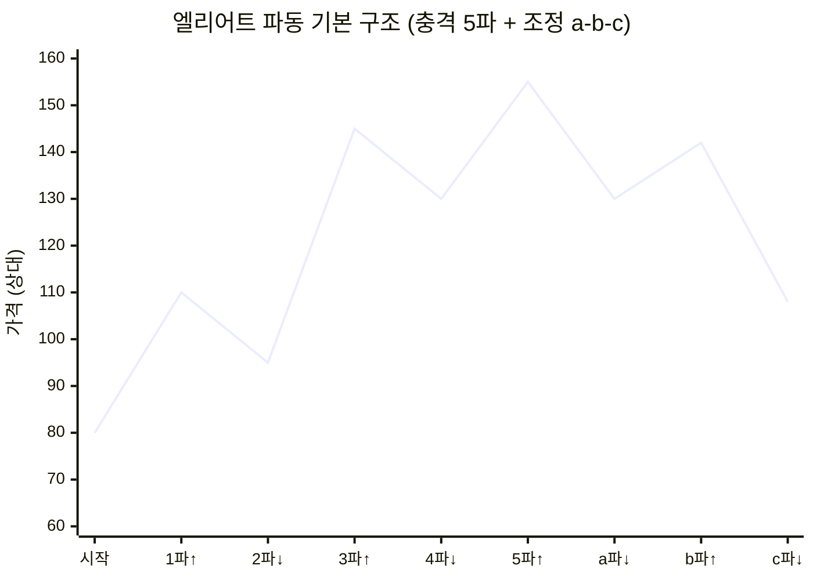

| 파동 구분 | 파동 | 방향 | 군중 심리 |
|-----------|------|------|-----------|
| 충격파(추세) | **1파** | 상승 | 소수만 인식, "반등 아닐까?" |
| 충격파(추세) | **2파** | 하락 | "역시 하락이었어" 공포 매도 |
| 충격파(추세) | **3파** | 강상승 | "진짜 상승이다!" 추세 추종 |
| 충격파(추세) | **4파** | 하락 | 이익 실현, 단기 조정 |
| 충격파(추세) | **5파** | 약상승 | "아직 올라!" 뒤늦은 매수 |
| 조정파(역추세) | **a파** | 하락 | "잠깐 조정이겠지" 낙관 |
| 조정파(역추세) | **b파** | 상승 | "역시 오르네" 반등 매수 |
| 조정파(역추세) | **c파** | 강하락 | 패닉셀, 손절 쏟아짐 |

---

#### 3-2. 절대 불변 규칙 3가지

> 이 규칙 중 하나라도 어기면 파동 카운팅을 전부 재시작해야 합니다.


---

#### 3-3. 피보나치 비율과 각 파동의 관계

엘리어트 파동이론과 피보나치 수열은 분리할 수 없습니다. 각 파동의 크기는 피보나치 비율을 따르는 경향이 있습니다.

| 파동 | 일반적 피보나치 목표 | 설명 |
|------|---------------------|------|
| **2파** (1파 되돌림) | 0.618 × 1파 크기 | 1파 상승분의 61.8% 되돌림 구간 진입 대기 |
| **3파** (1파 대비 연장) | 1.618 × 1파 크기 | 3파 목표가 = 1파 시작 + (1파 크기 × 1.618) |
| **4파** (3파 되돌림) | 0.382 × 3파 크기 | 3파 상승분의 38.2% 되돌림 (얕은 조정) |
| **5파** (1파와 동일하거나 더 짧음) | 0.618 × 3파 또는 1파와 동일 | 3파 대비 짧게 끝나면 종료 임박 신호 |
| **a파** (5파 되돌림) | 0.382~0.618 × 5파 크기 | a파 크기로 c파 목표 예측 |
| **c파** (a파 연장) | a파 크기와 동일하거나 1.618배 | c파 = a파 시작 - (a파 크기 × 1.0~1.618) |

**실전 예시 (코스피 2020~2022 가상 적용)**

```
2020.03 코스피 1,457 (바닥) → 1파 시작
2020.06 코스피 2,200 → 1파 완성 (+51%)
2020.09 코스피 1,900 → 2파 완성 (1파의 40% 되돌림 ≈ 피보나치 38.2%)
2021.01 코스피 3,266 → 3파 완성 (1파의 2.7배 ≈ 피보나치 261.8%)
2021.05 코스피 2,890 → 4파 완성 (3파의 20% 되돌림)
2021.07 코스피 3,305 → 5파 완성 (새 고점, 거래량 3파 대비 감소)
2022.09 코스피 2,155 → a-b-c 조정 완성
```

**피보나치 되돌림 수준별 파동 매핑**

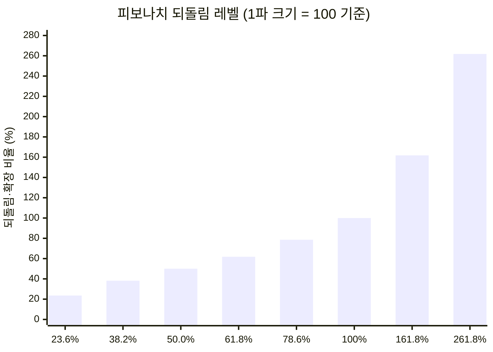

---

#### 3-4. 조정파동의 3가지 유형

5파 상승 후 나타나는 a-b-c 조정은 모두 같은 형태가 아닙니다. 3가지 주요 유형이 있습니다.

**유형 1: 지그재그(Zigzag) — 5-3-5 구조**

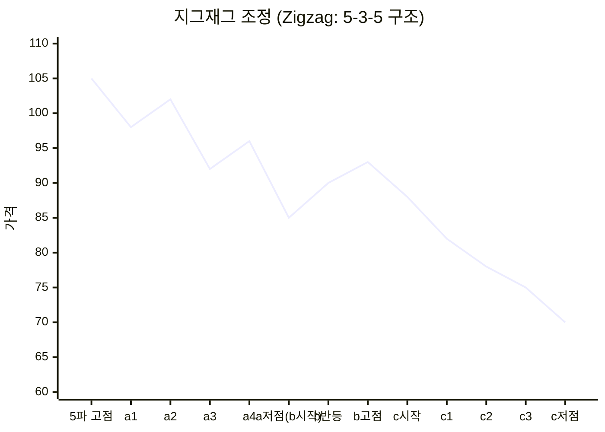

- 가장 흔한 조정 패턴
- c파가 a파 저점 아래로 하락 → 큰 되돌림
- 2파에서 자주 나타남

**유형 2: 플랫(Flat) — 3-3-5 구조**

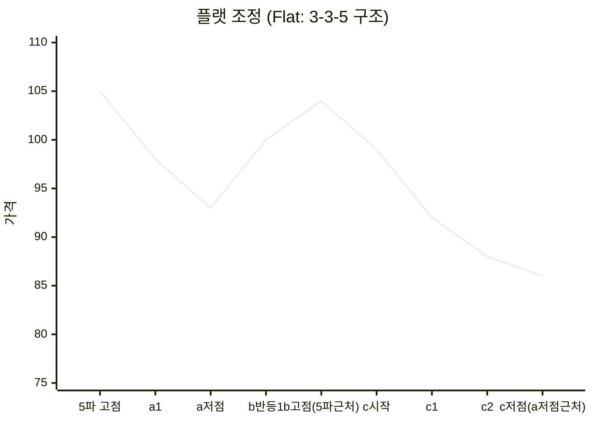

- 조정 폭이 얕아 강세장 신호
- 4파에서 자주 나타남

**유형 3: 삼각형(Triangle) — 3-3-3-3-3 구조**

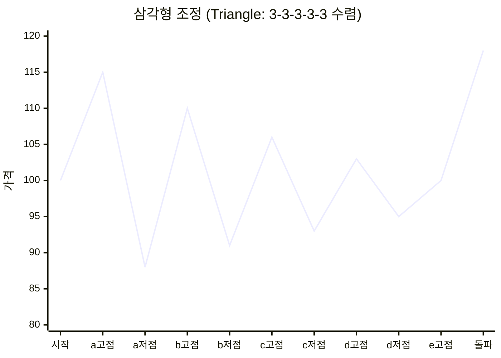

- 변동성이 점점 줄어드는 패턴
- 4파 또는 b파에서 나타남
- 삼각형 돌파 방향이 다음 추세 방향

| 유형 | 구조 | c파 위치 | 발생 위치 | 함의 |
|------|------|----------|-----------|------|
| 지그재그 | 5-3-5 | a파 저점 아래 | 주로 2파 | 큰 조정, 매수 기회 낮음 |
| 플랫 | 3-3-5 | a파 저점 근처 | 주로 4파 | 얕은 조정, 추세 강건 |
| 삼각형 | 3-3-3-3-3 | 수렴 후 돌파 | 4파·b파 | 돌파 전 에너지 축적 |

---

#### 3-5. 파동의 프랙탈 구조 (파동 속 파동)

엘리어트 파동의 핵심 특성은 **자기 유사성(프랙탈)**입니다. 큰 파동 하나가 작은 파동들의 집합입니다.

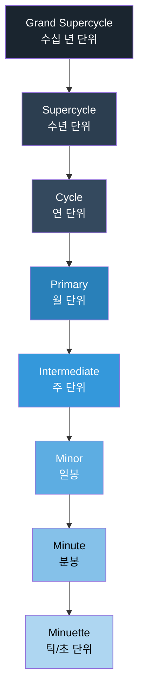

**실전 의미**: 일봉에서 보이는 5파 구조 전체가, 주봉으로 보면 단 하나의 3파일 수 있습니다.
→ 분석 시 **시간대를 여러 개 겹쳐 보는 것**이 중요합니다.

---

#### 3-6. 파동별 실전 매매 전략

| 파동 위치 | 가능한 전략 | 진입 조건 | 손절 기준 |
|-----------|------------|-----------|-----------|
| **2파 완성** | 3파 시작 예상 매수 | RSI 과매도 + 피보나치 61.8% 지지 + 거래량 반등 | 1파 시작점 이탈 시 |
| **3파 진행 중** | 추세 추종 매수 | 이전 고점 돌파 + 거래량 급증 + 정배열 | 4파 시작 조짐(다이버전스) 시 |
| **4파 완성** | 5파 예상 진입 (소형 포지션) | 피보나치 38.2% 지지 + 지지선 반등 확인 | 1파 고점 하향 이탈 시 |
| **5파 말단** | 포지션 축소 / 매도 준비 | RSI 다이버전스 + 거래량 감소 + 피보나치 확장 161.8% | 새로운 고점 형성 시 재검토 |
| **c파 완성** | 새 1파 매수 | 이전 저항선 돌파 + 거래량 회복 + MACD 골든크로스 | c파 저점 이탈 시 |

---

#### 3-7. 실전 파동 식별 6단계 프로세스

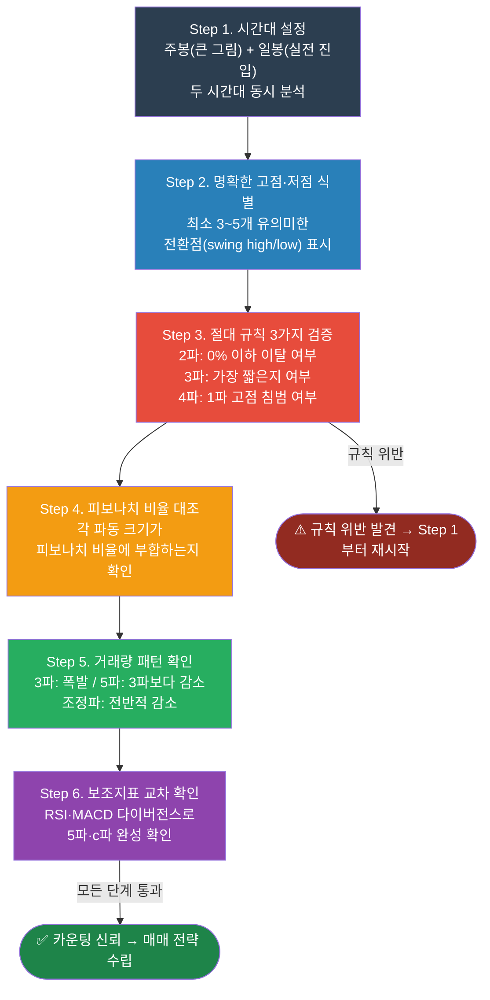

---

#### 3-8. 거래량으로 파동 확인하기

| 파동 | 기대되는 거래량 패턴 | 이유 |
|------|---------------------|------|
| 1파 | 평균 이상, 상승 시 | 소수가 먼저 매수 |
| 2파 | 1파보다 감소 | 공포 매도 후 소강 |
| **3파** | **폭발적 증가 (가장 많음)** | 추세 추종 + 뉴스 + 기관 매수 |
| 4파 | 3파보다 감소 | 이익 실현, 관망 |
| 5파 | 3파보다 적음 | 뒤늦은 개인 매수, 기관 매도 |
| a파 | 갑자기 증가 | 예상 못한 하락 |
| b파 | 감소 | 반등이지만 신뢰도 낮음 |
| c파 | 증가 (패닉셀) | 손절물량 + 공매도 |

---

#### 3-9. 실전 조합 전략 — 피보나치·보조지표 연동

```
[최강 매수 조건 — 3파 진입]
  엘리어트 2파 저점 근처
  + 피보나치 61.8% 되돌림 지지
  + RSI < 30 (과매도)
  + MACD 히스토그램 반전 (음→양)
  + 거래량 바닥 후 반등
  → 3파 상승 진입 조건 충족 → 강한 매수 신호

[최강 매도 조건 — 5파 청산]
  엘리어트 5파 고점 근처
  + 피보나치 확장 161.8% 도달
  + RSI 70 이상 + 다이버전스 발생
  + MACD 하락 전환 조짐
  + 거래량 5파가 3파보다 적음
  → a파 시작 경고 → 매도 또는 이익 실현 신호

[조정 완료 확인 — c파 바닥 매수]
  a파·c파 크기 동일 (or c파 = a파 × 1.618)
  + 피보나치 61.8~78.6% 되돌림 지지
  + 캔들 망치봉·역망치봉
  + 거래량 급감 후 반등
  → 새로운 1파 시작 가능성
```

---

#### 3-10. 주의사항 및 한계

| 항목 | 내용 |
|------|------|
| **주관성** | 파동 카운팅은 전문가마다 다를 수 있어 '정답'이 없음 |
| **후행성** | 파동이 완성돼야 확인 가능 — "지나야 보임" 비판 |
| **단독 사용 금지** | RSI·MACD·피보나치·거래량과 반드시 병행 |
| **시간대 선택** | 분봉·일봉·주봉 시간대에 따라 카운팅 결과가 달라짐 |
| **실패 확률** | 5파 이후 반드시 조정이 오지만 시점 예측은 불확실 |

> 📺 [🎬 엘리어트 파동 실전 매매 적용법](https://www.youtube.com/results?search_query=엘리어트파동+실전매매+적용법+한국주식+강의)

---

### 🔗 Python 소스 연계 — 엘리어트 파동 (Section 3)

웹앱의 **Tab 6 (엘리어트파동)**은 `technicalChart.js`가 파동 레이블과 피보나치 수평선을 자동으로 그립니다.

**Tab 6 구현 아키텍처**

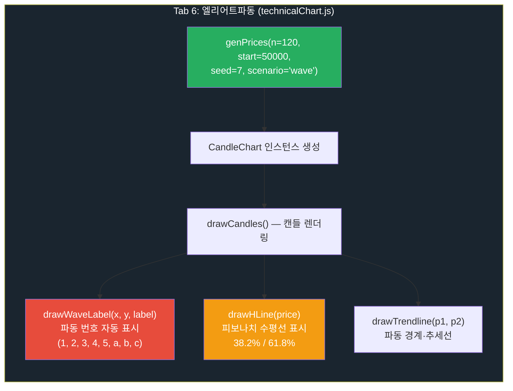

**피보나치 수평선 계산 (JavaScript)**

```javascript
// technicalChart.js — Tab 6 피보나치 수평선 자동 계산
// genPrices(n, start, seed, scenario)로 생성된 prices 배열 사용

const high = Math.max(...prices);   // 5파 고점
const low  = Math.min(...prices);   // 2파 또는 4파 저점
const range = high - low;

// 피보나치 되돌림 레벨 계산
const fib382 = high - range * 0.382;   // 38.2% 되돌림
const fib618 = high - range * 0.618;   // 61.8% 되돌림

// CandleChart에 수평선 표시
chart.drawHLine(fib382);   // drawHLine(price) — 38.2% 선
chart.drawHLine(fib618);   // drawHLine(price) — 61.8% 선

// 파동 레이블 자동 표시
// drawWaveLabel(x, y, label)
const wavePoints = detectWavePoints(prices);  // swing high/low 감지
wavePoints.forEach((pt, i) => {
    const labels = ["1", "2", "3", "4", "5", "a", "b", "c"];
    chart.drawWaveLabel(pt.x, pt.y, labels[i]);
});
```

**Python ↔ JavaScript 파동 분석 기능 대응표**

| 기능 | Python (분석 스크립트) | JavaScript (technicalChart.js) |
|------|----------------------|--------------------------------|
| 가격 데이터 | `yfinance.download()` | `genPrices(n, start, seed, scenario)` |
| 고점·저점 탐지 | `scipy.signal.argrelextrema()` | 슬라이딩 윈도우 비교 |
| 피보나치 계산 | `(high - low) * 0.618` | `range * 0.618` (동일) |
| 수평선 표시 | `ax.axhline(fib618)` | `chart.drawHLine(fib618)` |
| 파동 레이블 | `ax.annotate("3", xy=(...))` | `chart.drawWaveLabel(x, y, "3")` |
| 추세선 | `ax.plot([x1,x2],[y1,y2])` | `chart.drawTrendline(p1, p2)` |

---

### 4. 실습: 종목 선정 후 기본적·기술적 분석 통합 리포트

> 실제 증권사·자산운용사·투자은행에서 사용하는 **주식 리서치 리포트(Equity Research Report)** 수준의 통합 분석 리포트를 작성하는 전 과정을 단계별로 안내합니다.

---

#### 4-1. 통합 리포트란 무엇인가?

기본적 분석(Fundamental Analysis)과 기술적 분석(Technical Analysis)은 각각 단독으로는 한계가 있습니다.

| 구분 | 기본적 분석 | 기술적 분석 |
|------|------------|------------|
| **핵심 질문** | "이 기업이 싼가, 비싼가?" | "지금이 사야 할 때인가?" |
| **주요 도구** | PER, PBR, DCF, EV/EBITDA | MA, RSI, MACD, 볼린저밴드, 파동 |
| **시간 지평** | 중·장기 (6개월~수년) | 단·중기 (수일~수개월) |
| **한계** | 매수 타이밍을 알 수 없음 | 기업 내재가치를 알 수 없음 |

**통합 리포트**는 두 분석을 결합해 "좋은 기업을 좋은 가격과 좋은 타이밍에 사는" 의사결정 체계를 만듭니다.

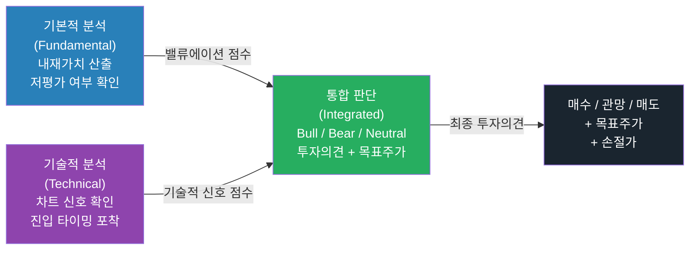

---

#### 4-2. Step 1 — 종목 선정 (스크리닝)

통합 리포트를 작성하기 전 분석 대상 종목을 체계적으로 선정합니다.

**종목 선정 3단계 깔때기(Funnel)**

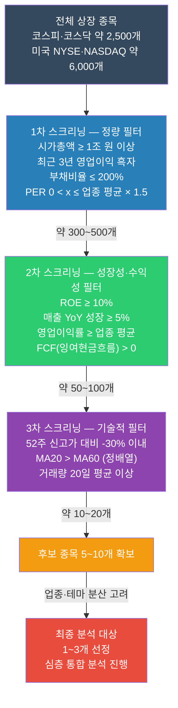

**스크리닝 Python 코드**

```python
import yfinance as yf
import pandas as pd

def screen_stocks(tickers: list[str]) -> pd.DataFrame:
    """
    종목 스크리닝 — 정량 필터 자동 적용
    반환: 기본 지표 데이터프레임
    """
    results = []
    for t in tickers:
        try:
            info = yf.Ticker(t).info
            results.append({
                "ticker":       t,
                "name":         info.get("longName", t),
                "market_cap":   info.get("marketCap", 0) / 1e12,     # 조 원
                "per":          info.get("trailingPE", None),
                "pbr":          info.get("priceToBook", None),
                "roe":          info.get("returnOnEquity", 0) * 100,  # %
                "debt_ratio":   info.get("debtToEquity", None),
                "revenue_growth": info.get("revenueGrowth", 0) * 100,
                "op_margin":    info.get("operatingMargins", 0) * 100,
            })
        except Exception:
            continue

    df = pd.DataFrame(results)
    # 1차 필터
    df = df[(df["market_cap"] >= 1) & (df["per"].between(0, 50))]
    # 2차 필터
    df = df[(df["roe"] >= 10) & (df["revenue_growth"] >= 5)]
    return df.sort_values("roe", ascending=False)

# 실행 예시 (코스피 대형주 일부)
candidates = ["005930.KS", "000660.KS", "035420.KS", "051910.KS", "006400.KS"]
screened = screen_stocks(candidates)
print(screened.to_string(index=False))
```

---

#### 4-3. Step 2 — 기본적 분석 섹션 작성

선정된 종목에 대해 5개 영역을 분석합니다.

**기본적 분석 5-Block 구조**

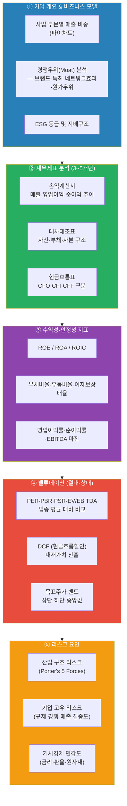

**주요 재무 지표 자동 계산 Python 코드**

```python
import yfinance as yf
import pandas as pd

def fundamental_analysis(ticker: str) -> dict:
    """기본적 분석 — 주요 지표 자동 추출"""
    stk  = yf.Ticker(ticker)
    info = stk.info

    # 밸류에이션 지표
    valuation = {
        "PER":        info.get("trailingPE"),
        "선행PER":    info.get("forwardPE"),
        "PBR":        info.get("priceToBook"),
        "PSR":        info.get("priceToSalesTrailing12Months"),
        "EV/EBITDA":  info.get("enterpriseToEbitda"),
    }

    # 수익성 지표
    profitability = {
        "ROE (%)":          round((info.get("returnOnEquity") or 0) * 100, 1),
        "ROA (%)":          round((info.get("returnOnAssets") or 0) * 100, 1),
        "영업이익률 (%)":    round((info.get("operatingMargins") or 0) * 100, 1),
        "순이익률 (%)":      round((info.get("profitMargins") or 0) * 100, 1),
        "EBITDA 마진 (%)":   round((info.get("ebitdaMargins") or 0) * 100, 1),
    }

    # 성장성 지표
    growth = {
        "매출 성장률 (%)":     round((info.get("revenueGrowth") or 0) * 100, 1),
        "영업이익 성장률 (%)": round((info.get("earningsGrowth") or 0) * 100, 1),
    }

    # 재무 안정성
    stability = {
        "부채비율 (%)":  round(info.get("debtToEquity") or 0, 1),
        "유동비율 (%)":  round((info.get("currentRatio") or 0) * 100, 1),
        "이자보상배율":  round(info.get("ebitda", 0) /
                               max(info.get("totalDebt", 1) * 0.05, 1), 1),
    }

    # DCF 간이 계산 (Simplified DCF)
    fcf         = info.get("freeCashflow", 0)
    shares      = info.get("sharesOutstanding", 1)
    wacc        = 0.09          # 가중평균자본비용 9% (가정)
    g_rate      = 0.04          # 영구 성장률 4% (가정)
    fcf_per_sh  = fcf / shares  # 주당 FCF
    dcf_value   = fcf_per_sh / (wacc - g_rate)  # Gordon Growth Model 근사

    current_price = info.get("currentPrice", info.get("regularMarketPrice", 0))
    upside = (dcf_value - current_price) / current_price * 100 if current_price else 0

    valuation_summary = {
        "현재가":       current_price,
        "DCF 내재가치": round(dcf_value, 0),
        "업사이드 (%)": round(upside, 1),
        "투자의견":     "매수" if upside > 20 else "중립" if upside > -10 else "매도",
    }

    return {
        "기업명":        info.get("longName", ticker),
        "밸류에이션":    valuation,
        "수익성":        profitability,
        "성장성":        growth,
        "재무안정성":    stability,
        "DCF 요약":      valuation_summary,
    }

# 실행 예시
result = fundamental_analysis("005930.KS")   # 삼성전자
for section, data in result.items():
    print(f"\n{'='*30}")
    print(f"[ {section} ]")
    if isinstance(data, dict):
        for k, v in data.items():
            print(f"  {k:20s}: {v}")
    else:
        print(f"  {data}")
```

---

#### 4-4. Step 3 — 기술적 분석 섹션 작성

기본적 분석으로 종목이 선정되면, 기술적 분석으로 **진입 타이밍**과 **손절/목표가**를 설정합니다.

**기술적 분석 체크리스트 (7항목)**

| 번호 | 체크 항목 | 강세 신호 (Bullish) | 약세 신호 (Bearish) |
|------|----------|-------------------|-------------------|
| ① | **추세** | MA20 > MA60 정배열 | MA20 < MA60 역배열 |
| ② | **RSI** | 30~50 구간 (과매도 회복) | 70 이상 (과매수) |
| ③ | **MACD** | 골든크로스 + 히스토그램 양전환 | 데드크로스 + 히스토그램 음전환 |
| ④ | **볼린저밴드** | 하단 터치 후 반등 | 상단 터치 후 반락 |
| ⑤ | **거래량** | 상승 시 거래량 증가 | 상승 시 거래량 감소 |
| ⑥ | **캔들 패턴** | 망치봉·불리쉬 엔걸핑·샛별 | 교수형·베어리쉬 엔걸핑·저녁별 |
| ⑦ | **차트 패턴** | 이중바닥·역H&S 돌파 | 이중천장·H&S 넥라인 이탈 |

**기술적 분석 통합 Python 코드**

```python
import yfinance as yf
import pandas as pd
import matplotlib.pyplot as plt
import matplotlib.gridspec as gridspec

def technical_analysis(ticker: str, period: str = "6mo") -> dict:
    """기술적 분석 — 7항목 체크리스트 자동 평가"""
    df = yf.download(ticker, period=period, auto_adjust=True, progress=False)
    df = df[["Open", "High", "Low", "Close", "Volume"]]
    close  = df["Close"]
    volume = df["Volume"]

    # 이동평균선
    df["MA20"] = close.rolling(20).mean()
    df["MA60"] = close.rolling(60).mean()

    # RSI (14일)
    delta = close.diff()
    gain  = delta.clip(lower=0).rolling(14).mean()
    loss  = (-delta.clip(upper=0)).rolling(14).mean()
    df["RSI"] = 100 - (100 / (1 + gain / loss))

    # MACD
    ema12 = close.ewm(span=12, adjust=False).mean()
    ema26 = close.ewm(span=26, adjust=False).mean()
    df["MACD"]   = ema12 - ema26
    df["Signal"] = df["MACD"].ewm(span=9, adjust=False).mean()
    df["Hist"]   = df["MACD"] - df["Signal"]

    # 볼린저밴드
    df["BB_mid"]   = close.rolling(20).mean()
    df["BB_upper"] = df["BB_mid"] + 2 * close.rolling(20).std()
    df["BB_lower"] = df["BB_mid"] - 2 * close.rolling(20).std()

    # 거래량 이동평균
    df["VOL_MA20"] = volume.rolling(20).mean()

    latest = df.iloc[-1]
    prev   = df.iloc[-2]

    # 7항목 신호 평가
    signals = {
        "추세 (MA 정배열)":   "🟢 강세" if latest["MA20"] > latest["MA60"] else "🔴 약세",
        "RSI":                "🟢 과매도 회복" if 30 < latest["RSI"] < 55 else
                              "🔴 과매수" if latest["RSI"] > 70 else "⚪ 중립",
        "MACD":               "🟢 골든크로스" if latest["MACD"] > latest["Signal"] and
                                                  prev["MACD"] <= prev["Signal"] else
                              "🟢 강세" if latest["MACD"] > latest["Signal"] else "🔴 약세",
        "볼린저밴드":          "🟢 하단 반등" if latest["Close"] <= latest["BB_lower"] * 1.02 else
                              "🔴 상단 저항" if latest["Close"] >= latest["BB_upper"] * 0.98 else "⚪ 중립",
        "거래량":             "🟢 평균 초과" if latest["Volume"] > latest["VOL_MA20"] else "🔴 평균 이하",
    }

    # 기술적 점수 집계
    bullish_count = sum(1 for s in signals.values() if "🟢" in s)
    bearish_count = sum(1 for s in signals.values() if "🔴" in s)
    ta_verdict    = "강세" if bullish_count >= 4 else "약세" if bearish_count >= 4 else "중립"

    return {
        "ticker":     ticker,
        "signals":    signals,
        "bullish":    bullish_count,
        "bearish":    bearish_count,
        "ta_verdict": ta_verdict,
        "df":         df,
    }
```

---

#### 4-5. Step 4 — 통합 판단 프레임워크 (스코어링)

기본적 분석과 기술적 분석 결과를 합산해 **투자의견**과 **목표주가 밴드**를 산출합니다.

**통합 스코어링 매트릭스**

| 항목 | 평가 기준 | 만점 | 가중치 |
|------|----------|------|--------|
| **기본적 분석** | | **40점** | **40%** |
| — 밸류에이션 | PER·PBR·EV/EBITDA 업종 대비 저평가 | 10점 | |
| — DCF 업사이드 | 내재가치 대비 현재가 할인율 | 10점 | |
| — 수익성·성장성 | ROE ≥ 15%, 매출 성장 ≥ 10% | 10점 | |
| — 재무 안정성 | 부채비율·이자보상배율 양호 | 10점 | |
| **기술적 분석** | | **40점** | **40%** |
| — 추세·MA | 정배열·골든크로스 | 10점 | |
| — 모멘텀 | RSI·MACD 강세 | 10점 | |
| — 볼린저밴드 | 위치·방향성 | 10점 | |
| — 거래량·패턴 | 거래량 확인·차트 패턴 | 10점 | |
| **거시·산업 환경** | | **20점** | **20%** |
| — 금리·경기 | 업종에 유리한 금리·경기 국면 | 10점 | |
| — 산업 성장성 | 업종 TAM 확대·규제 완화 | 10점 | |
| **총점** | | **100점** | **100%** |

```mermaid
flowchart TD
    FA_SCORE["기본적 분석 점수\n0~40점"]
    TA_SCORE["기술적 분석 점수\n0~40점"]
    MACRO_SCORE["거시·산업 점수\n0~20점"]
    TOTAL["총점 합산\n(0~100점)"]

    TOTAL --> JUDGE{총점 범위}
    JUDGE -->|"75점 이상"| BUY(["✅ 강력 매수\nStrong Buy\n목표주가: DCF 상단\n손절가: 지지선 -5%"])
    JUDGE -->|"60~74점"| ACCUM(["🟢 매수 (분할 매수)\nBuy\n목표주가: DCF 중앙값\n손절가: MA60 이탈"])
    JUDGE -->|"45~59점"| HOLD(["⚪ 중립·보유\nHold\n목표주가: 현재 ±10%\n손절 없음 (모니터링)"])
    JUDGE -->|"30~44점"| REDUCE(["🟡 비중 축소\nUnderperform\n목표주가: 현재 -10%"])
    JUDGE -->|"29점 이하"| SELL(["🔴 매도\nSell\n목표주가: 하방 리스크\n즉시 손절 검토"])

    FA_SCORE --> TOTAL
    TA_SCORE --> TOTAL
    MACRO_SCORE --> TOTAL

    style FA_SCORE fill:#2980b9,color:#fff
    style TA_SCORE fill:#8e44ad,color:#fff
    style MACRO_SCORE fill:#27ae60,color:#fff
    style TOTAL fill:#2c3e50,color:#fff
    style BUY fill:#1e8449,color:#fff
    style ACCUM fill:#27ae60,color:#fff
    style HOLD fill:#7f8c8d,color:#fff
    style REDUCE fill:#f39c12,color:#fff
    style SELL fill:#922b21,color:#fff
```

---

#### 4-6. Step 5 — 통합 리포트 Python 생성 코드

기본적 분석과 기술적 분석을 통합해 **단일 리포트 이미지**를 자동 생성하는 코드입니다.

```python
import yfinance as yf
import pandas as pd
import matplotlib.pyplot as plt
import matplotlib.gridspec as gridspec
import matplotlib.patches as mpatches
from matplotlib.patches import FancyBboxPatch
import numpy as np

def integrated_report(ticker: str, period: str = "1y"):
    """
    기본적·기술적 통합 분석 리포트 자동 생성
    실제 증권사 리포트에 준하는 레이아웃
    """
    # ── 데이터 수집 ──────────────────────────────────
    stk  = yf.Ticker(ticker)
    info = stk.info
    df   = yf.download(ticker, period=period, auto_adjust=True, progress=False)
    df   = df[["Open", "High", "Low", "Close", "Volume"]]
    close  = df["Close"]
    volume = df["Volume"]

    # ── 기술적 지표 계산 ──────────────────────────────
    df["MA20"]     = close.rolling(20).mean()
    df["MA60"]     = close.rolling(60).mean()
    df["MA120"]    = close.rolling(120).mean()
    df["BB_mid"]   = close.rolling(20).mean()
    df["BB_upper"] = df["BB_mid"] + 2 * close.rolling(20).std()
    df["BB_lower"] = df["BB_mid"] - 2 * close.rolling(20).std()

    delta = close.diff()
    gain  = delta.clip(lower=0).rolling(14).mean()
    loss  = (-delta.clip(upper=0)).rolling(14).mean()
    df["RSI"] = 100 - (100 / (1 + gain / loss))

    ema12 = close.ewm(span=12, adjust=False).mean()
    ema26 = close.ewm(span=26, adjust=False).mean()
    df["MACD"]   = ema12 - ema26
    df["Signal"] = df["MACD"].ewm(span=9, adjust=False).mean()
    df["Hist"]   = df["MACD"] - df["Signal"]
    df["VOL_MA"] = volume.rolling(20).mean()

    latest = df.iloc[-1]

    # ── 기본적 분석 지표 ──────────────────────────────
    name     = info.get("longName", ticker)
    sector   = info.get("sector", "N/A")
    industry = info.get("industry", "N/A")
    per      = info.get("trailingPE")
    pbr      = info.get("priceToBook")
    roe      = round((info.get("returnOnEquity") or 0) * 100, 1)
    op_margin = round((info.get("operatingMargins") or 0) * 100, 1)
    rev_growth = round((info.get("revenueGrowth") or 0) * 100, 1)
    debt_eq  = round(info.get("debtToEquity") or 0, 1)

    # DCF 간이 목표주가
    fcf      = info.get("freeCashflow", 0)
    shares   = info.get("sharesOutstanding", 1)
    dcf_val  = (fcf / shares) / (0.09 - 0.04) if shares else 0
    cur_price = info.get("currentPrice", info.get("regularMarketPrice", 0))
    upside   = (dcf_val - cur_price) / cur_price * 100 if cur_price and dcf_val else 0

    # 기술적 신호 점수
    ta_score = 0
    if latest["MA20"] > latest["MA60"]:            ta_score += 2
    if latest["RSI"] < 55 and latest["RSI"] > 30:  ta_score += 2
    if latest["MACD"] > latest["Signal"]:          ta_score += 2
    if latest["Close"] < latest["BB_upper"] * 0.99: ta_score += 1
    if latest["Volume"] > latest["VOL_MA"]:        ta_score += 1
    ta_verdict = "강세" if ta_score >= 6 else "중립" if ta_score >= 4 else "약세"

    # 투자의견
    fa_score = 0
    if per and per < 20:           fa_score += 2
    if pbr and pbr < 2:            fa_score += 2
    if roe > 15:                   fa_score += 2
    if op_margin > 10:             fa_score += 1
    if rev_growth > 10:            fa_score += 1
    if upside > 20:                fa_score += 2
    total_score = ta_score * 5 + fa_score * 5  # 0~100 환산
    if total_score >= 70:   verdict, color = "강력 매수", "#1e8449"
    elif total_score >= 55: verdict, color = "매수",     "#27ae60"
    elif total_score >= 40: verdict, color = "중립",     "#7f8c8d"
    elif total_score >= 25: verdict, color = "비중 축소","#f39c12"
    else:                   verdict, color = "매도",     "#922b21"

    # ── 레이아웃 구성 ──────────────────────────────────
    fig = plt.figure(figsize=(18, 22), facecolor="#f8f9fa")
    fig.suptitle(
        f"{name} ({ticker})  ·  종합 투자 분석 리포트",
        fontsize=16, fontweight="bold", y=0.98, color="#1a252f"
    )

    gs = gridspec.GridSpec(
        5, 3,
        figure=fig,
        height_ratios=[0.8, 3, 1.2, 1.2, 1.2],
        hspace=0.45, wspace=0.35,
        top=0.95, bottom=0.04, left=0.06, right=0.97
    )

    # ── Row 0: 헤더 요약 박스 ──────────────────────────
    ax_header = fig.add_subplot(gs[0, :])
    ax_header.axis("off")
    summary_text = (
        f"섹터: {sector}  |  업종: {industry}  |  "
        f"현재가: {cur_price:,.0f}원  |  "
        f"DCF 목표가: {dcf_val:,.0f}원  |  "
        f"업사이드: {upside:+.1f}%  |  "
        f"투자의견:  {verdict}  |  "
        f"종합점수: {total_score}점"
    )
    ax_header.text(0.5, 0.5, summary_text, ha="center", va="center",
                   fontsize=10.5, color="white",
                   bbox=dict(boxstyle="round,pad=0.5", facecolor=color, alpha=0.92),
                   transform=ax_header.transAxes)

    # ── Row 1: 메인 주가 차트 (Col 0~1) ──────────────────
    ax_main = fig.add_subplot(gs[1, :2])
    ax_main.plot(close.index, close,        label="종가",  color="#2c3e50",  lw=1.5)
    ax_main.plot(df.index, df["MA20"],      label="MA20",  color="#3498db",  lw=1.0, ls="--")
    ax_main.plot(df.index, df["MA60"],      label="MA60",  color="#e74c3c",  lw=1.0, ls="--")
    ax_main.plot(df.index, df["MA120"],     label="MA120", color="#f39c12",  lw=1.0, ls=":")
    ax_main.fill_between(df.index, df["BB_upper"], df["BB_lower"],
                         alpha=0.08, color="#8e44ad", label="볼린저밴드")
    if dcf_val > 0:
        ax_main.axhline(dcf_val,   color="#1e8449", ls="-.",  lw=1.2, label=f"DCF 목표가 {dcf_val:,.0f}")
    ax_main.set_title("주가 차트 + 이동평균 + 볼린저밴드", fontsize=11, pad=8)
    ax_main.legend(fontsize=8, loc="upper left", ncol=3)
    ax_main.grid(True, alpha=0.2)
    ax_main.set_facecolor("#fdfefe")

    # ── Row 1: 기본 지표 요약 테이블 (Col 2) ──────────────
    ax_tbl = fig.add_subplot(gs[1, 2])
    ax_tbl.axis("off")
    fa_rows = [
        ["지표", "값", "평가"],
        ["PER",  f"{per:.1f}x" if per else "N/A",       "✅" if per and per < 20 else "⚠️"],
        ["PBR",  f"{pbr:.2f}x" if pbr else "N/A",       "✅" if pbr and pbr < 2  else "⚠️"],
        ["ROE",  f"{roe:.1f}%",                          "✅" if roe > 15 else "⚠️"],
        ["영업이익률", f"{op_margin:.1f}%",               "✅" if op_margin > 10 else "⚠️"],
        ["매출 성장", f"{rev_growth:+.1f}%",              "✅" if rev_growth > 10 else "⚠️"],
        ["부채비율",  f"{debt_eq:.0f}%",                  "✅" if debt_eq < 100 else "⚠️"],
        ["DCF 업사이드", f"{upside:+.1f}%",               "✅" if upside > 20 else "⚠️"],
    ]
    tbl = ax_tbl.table(
        cellText=fa_rows[1:],
        colLabels=fa_rows[0],
        cellLoc="center", loc="center",
        bbox=[0, 0, 1, 1]
    )
    tbl.auto_set_font_size(False)
    tbl.set_fontsize(9)
    for (r, c), cell in tbl.get_celld().items():
        if r == 0:
            cell.set_facecolor("#2c3e50")
            cell.set_text_props(color="white", fontweight="bold")
        elif r % 2 == 0:
            cell.set_facecolor("#eaf0fb")
    ax_tbl.set_title("기본적 분석 지표", fontsize=11, pad=8)

    # ── Row 2: RSI (Col 0~1) ──────────────────────────────
    ax_rsi = fig.add_subplot(gs[2, :2])
    ax_rsi.plot(df.index, df["RSI"], color="#8e44ad", lw=1.2)
    ax_rsi.axhline(70, color="#e74c3c", ls="--", alpha=0.6, label="과매수(70)")
    ax_rsi.axhline(30, color="#27ae60", ls="--", alpha=0.6, label="과매도(30)")
    ax_rsi.fill_between(df.index, df["RSI"], 30, where=(df["RSI"] < 30),
                        color="#27ae60", alpha=0.2)
    ax_rsi.fill_between(df.index, df["RSI"], 70, where=(df["RSI"] > 70),
                        color="#e74c3c", alpha=0.2)
    ax_rsi.set_ylim(0, 100)
    ax_rsi.set_ylabel("RSI")
    ax_rsi.legend(fontsize=8, loc="upper right")
    ax_rsi.grid(True, alpha=0.2)
    ax_rsi.set_title("RSI (14)", fontsize=10, pad=6)
    ax_rsi.set_facecolor("#fdfefe")

    # ── Row 2: 기술적 신호 레이더 (Col 2) ─────────────────
    ax_radar = fig.add_subplot(gs[2, 2], polar=True)
    categories = ["추세", "RSI", "MACD", "BB", "거래량"]
    n_cats  = len(categories)
    scores  = [
        (2 if latest["MA20"] > latest["MA60"] else 0),
        (2 if 30 < latest["RSI"] < 55 else 0),
        (2 if latest["MACD"] > latest["Signal"] else 0),
        (1 if latest["Close"] < latest["BB_upper"] * 0.99 else 0),
        (1 if latest["Volume"] > latest["VOL_MA"] else 0),
    ]
    max_scores = [2, 2, 2, 1, 1]
    norm_scores = [s / m for s, m in zip(scores, max_scores)]
    angles  = [n / float(n_cats) * 2 * np.pi for n in range(n_cats)]
    norm_scores += norm_scores[:1]
    angles  += angles[:1]
    ax_radar.plot(angles, norm_scores, "o-", color="#2980b9", lw=2)
    ax_radar.fill(angles, norm_scores, alpha=0.25, color="#2980b9")
    ax_radar.set_xticks(angles[:-1])
    ax_radar.set_xticklabels(categories, fontsize=9)
    ax_radar.set_yticks([0.5, 1.0])
    ax_radar.set_yticklabels(["50%", "100%"], fontsize=7)
    ax_radar.set_title(f"기술적 신호\n({ta_verdict})", fontsize=10, pad=12)

    # ── Row 3: MACD (Col 0~1) ─────────────────────────────
    ax_macd = fig.add_subplot(gs[3, :2])
    ax_macd.plot(df.index, df["MACD"],   color="#3498db", lw=1.2, label="MACD")
    ax_macd.plot(df.index, df["Signal"], color="#e74c3c", lw=1.2, label="Signal")
    colors_hist = ["#27ae60" if v >= 0 else "#e74c3c" for v in df["Hist"]]
    ax_macd.bar(df.index, df["Hist"], color=colors_hist, alpha=0.4, label="Hist")
    ax_macd.axhline(0, color="black", lw=0.5)
    ax_macd.set_ylabel("MACD")
    ax_macd.legend(fontsize=8, loc="upper left")
    ax_macd.grid(True, alpha=0.2)
    ax_macd.set_title("MACD (12/26/9)", fontsize=10, pad=6)
    ax_macd.set_facecolor("#fdfefe")

    # ── Row 3: 투자의견 요약 박스 (Col 2) ─────────────────
    ax_verdict = fig.add_subplot(gs[3, 2])
    ax_verdict.axis("off")
    verdict_lines = [
        f"투자의견:  {verdict}",
        f"종합점수:  {total_score} / 100",
        f"기본적 점수: {fa_score * 5} / 50",
        f"기술적 점수: {ta_score * 5} / 50",
        "",
        f"현재가:    {cur_price:>10,.0f} 원",
        f"DCF 목표가: {dcf_val:>10,.0f} 원",
        f"업사이드:   {upside:>+10.1f} %",
        "",
        f"기술적 신호: {ta_verdict}",
        f"RSI:        {latest['RSI']:.1f}",
        f"MACD:       {'골든크로스 ✅' if latest['MACD'] > latest['Signal'] else '데드크로스 ❌'}",
    ]
    ax_verdict.text(0.05, 0.95, "\n".join(verdict_lines),
                    ha="left", va="top", fontsize=9.5, family="monospace",
                    transform=ax_verdict.transAxes,
                    bbox=dict(boxstyle="round,pad=0.6", facecolor=color, alpha=0.15,
                              edgecolor=color, lw=2))
    ax_verdict.set_title("통합 투자의견", fontsize=11, pad=8)

    # ── Row 4: 거래량 (Col 0~1) ──────────────────────────
    ax_vol = fig.add_subplot(gs[4, :2])
    vol_colors = ["#3498db" if c >= o else "#e74c3c"
                  for c, o in zip(df["Close"], df["Open"])]
    ax_vol.bar(df.index, df["Volume"], color=vol_colors, alpha=0.7, label="거래량")
    ax_vol.plot(df.index, df["VOL_MA"], color="#f39c12", lw=1.5, label="거래량 MA20")
    ax_vol.set_ylabel("거래량")
    ax_vol.legend(fontsize=8, loc="upper right")
    ax_vol.grid(True, alpha=0.2)
    ax_vol.set_title("거래량", fontsize=10, pad=6)
    ax_vol.set_facecolor("#fdfefe")

    # ── Row 4: 리스크 요인 요약 (Col 2) ──────────────────
    ax_risk = fig.add_subplot(gs[4, 2])
    ax_risk.axis("off")
    risk_text = (
        "⚠️  주요 리스크 요인\n"
        "─────────────────────\n"
        f"• 고PER 밸류에이션 부담: {'있음' if per and per > 25 else '낮음'}\n"
        f"• 고부채 재무 리스크:   {'있음' if debt_eq > 150 else '낮음'}\n"
        f"• RSI 과매수:           {'있음' if latest['RSI'] > 70 else '없음'}\n"
        f"• 역배열 추세:          {'있음' if latest['MA20'] < latest['MA60'] else '없음'}\n"
        "─────────────────────\n"
        "※ 본 리포트는 학습용이며\n"
        "   실제 투자 조언이 아닙니다."
    )
    ax_risk.text(0.05, 0.95, risk_text,
                 ha="left", va="top", fontsize=9, family="monospace",
                 transform=ax_risk.transAxes,
                 bbox=dict(boxstyle="round,pad=0.5", facecolor="#fef9e7",
                           edgecolor="#f39c12", lw=1.5))
    ax_risk.set_title("리스크 요인", fontsize=11, pad=8)

    plt.savefig(f"{ticker}_integrated_report.png", dpi=150, bbox_inches="tight",
                facecolor=fig.get_facecolor())
    plt.show()
    print(f"\n리포트 저장 완료: {ticker}_integrated_report.png")
    print(f"투자의견: {verdict}  |  총점: {total_score}/100  |  업사이드: {upside:+.1f}%")

# ── 실행 예시 ──────────────────────────────────────────
integrated_report("005930.KS")   # 삼성전자
# integrated_report("000660.KS") # SK하이닉스
# integrated_report("NVDA")      # 엔비디아
# integrated_report("AAPL")      # 애플
```

---

#### 4-7. 통합 리포트 구성 요소 — 실제 증권사·금융기관 표준 섹션

실제 Goldman Sachs, Morgan Stanley, JP Morgan, 미래에셋증권, 한국투자증권 등의 **주식 리서치 리포트(Equity Research Report)** 구조를 참고한 표준 템플릿입니다.

```mermaid
flowchart TD
    subgraph COVER["📄 표지 (Cover Page)"]
        C1["기업명 · 종목코드 · 섹터"]
        C2["투자의견 (Buy/Hold/Sell)"]
        C3["목표주가 · 현재가 · 업사이드"]
        C4["리포트 발행일 · 애널리스트 정보"]
    end

    subgraph EXEC["📋 Executive Summary (1페이지)"]
        E1["핵심 투자 포인트 3가지"]
        E2["밸류에이션 요약 테이블"]
        E3["리스크 요약"]
    end

    subgraph BIZ["🏢 기업·산업 개요 (1~2페이지)"]
        B1["비즈니스 모델 설명"]
        B2["사업 부문별 매출 비중"]
        B3["경쟁 지위 · 시장점유율"]
        B4["산업 구조 분석 (Porter's 5 Forces)"]
    end

    subgraph FIN["📊 재무 분석 (2~3페이지)"]
        F1["손익계산서 추이 (3~5개년)"]
        F2["대차대조표 분석"]
        F3["현금흐름표 (FCF 추이)"]
        F4["주요 재무비율 비교 테이블"]
    end

    subgraph VAL["💰 밸류에이션 (1~2페이지)"]
        V1["PER·PBR·EV/EBITDA 업종 비교"]
        V2["DCF 민감도 분석 테이블"]
        V3["목표주가 산출 근거"]
        V4["Bull/Base/Bear 시나리오"]
    end

    subgraph TECH["📈 기술적 분석 (1페이지)"]
        T1["주가 차트 + MA + 볼린저밴드"]
        T2["RSI · MACD · 거래량"]
        T3["지지선·저항선·목표가 표시"]
        T4["차트 패턴 및 파동 분석"]
    end

    subgraph RISK["⚠️ 리스크 요인 (0.5페이지)"]
        R1["투자 리스크 목록"]
        R2["시나리오별 영향도"]
    end

    subgraph DISC["📝 Disclaimer"]
        D1["투자 유의사항 · 법적 고지"]
    end

    COVER --> EXEC --> BIZ --> FIN --> VAL --> TECH --> RISK --> DISC

    style COVER fill:#2c3e50,color:#fff
    style EXEC  fill:#2980b9,color:#fff
    style BIZ   fill:#27ae60,color:#fff
    style FIN   fill:#8e44ad,color:#fff
    style VAL   fill:#e74c3c,color:#fff
    style TECH  fill:#f39c12,color:#000
    style RISK  fill:#7f8c8d,color:#fff
    style DISC  fill:#1a252f,color:#fff
```

---

#### 4-8. UI 제안 — 실제 금융기관 수준의 통합 분석 대시보드

> 아래는 실제 Bloomberg Terminal, Refinitiv Eikon, 키움 HTS, 미래에셋 MTS 수준의 **통합 투자분석 대시보드 UI**를 웹 앱으로 구현하는 상세 제안입니다.

##### UI 전체 레이아웃 구조

```
┌─────────────────────────────────────────────────────────────────────────────┐
│  HEADER: 종목 검색창 │ 종목명 · 현재가 · 등락률 │ 투자의견 배지 │ 날짜·시간  │
├──────────────────────────────┬──────────────────────────────────────────────┤
│  LEFT PANEL (30%)            │  CENTER PANEL (45%)                          │
│  ┌────────────────────────┐  │  ┌──────────────────────────────────────────┐│
│  │ 기업 개요              │  │  │  메인 주가 차트                          ││
│  │ · 기업명 · 종목코드    │  │  │  · 캔들 차트 (OHLCV)                    ││
│  │ · 섹터 · 업종          │  │  │  · MA20 / MA60 / MA120 오버레이         ││
│  │ · 시가총액             │  │  │  · 볼린저밴드 음영                      ││
│  │ · 52주 고/저가         │  │  │  · 거래량 바 차트 (하단)                ││
│  ├────────────────────────┤  │  │  · 지지선·저항선 자동 표시              ││
│  │ 밸류에이션 지표        │  │  │  · 이벤트 마커 (실적·배당 발표일)       ││
│  │ ┌──────┬──────┬──────┐│  │  └──────────────────────────────────────────┘│
│  │ │ PER  │ PBR  │ PSR  ││  │  ┌──────────────────┐ ┌──────────────────────┐│
│  │ │ 12.3 │ 1.8  │ 2.1  ││  │  │  RSI (14)        │ │  MACD (12/26/9)     ││
│  │ └──────┴──────┴──────┘│  │  │  [퍼플 라인]     │ │  [파랑/빨강 + 히스] ││
│  │ EV/EBITDA: 8.2x       │  │  │  ── 70 과매수 ── │ │  ── 0선 ──          ││
│  │ DCF 목표가: 85,000     │  │  │  ── 30 과매도 ── │ └──────────────────────┘│
│  │ 업사이드: +18.3%       │  │  └──────────────────┘                        │
│  ├────────────────────────┤  └──────────────────────────────────────────────┘
│  │ 수익성 지표            │
│  │ ROE:  18.5%  ✅       │  RIGHT PANEL (25%)
│  │ ROA:   9.2%  ✅       │  ┌──────────────────────────────────────────────┐
│  │ 영업이익률: 14.3% ✅   │  │  통합 투자의견                              │
│  ├────────────────────────┤  │  ┌──────────────────────────────────────────┐│
│  │ 재무 안정성            │  │  │           ✅ 매수 (Buy)                  ││
│  │ 부채비율: 65%   ✅    │  │  │         목표주가: ₩85,000               ││
│  │ 유동비율: 180%  ✅    │  │  │         현재가:   ₩71,800               ││
│  │ 이자보상: 12.4x ✅    │  │  │         업사이드: +18.3%                ││
│  ├────────────────────────┤  │  └──────────────────────────────────────────┘│
│  │ 성장성                 │  │                                              │
│  │ 매출 성장: +12.4% ✅  │  │  종합 점수: ████████░░  78 / 100            │
│  │ 영업익 성장: +8.1% ⚠️ │  │                                              │
│  └────────────────────────┘  │  기본적 분석:  ██████░░  38 / 50           │
│                               │  기술적 분석:  ██████░░  35 / 50           │
│                               │  거시·산업:    ████░░░░  15 / 20           │
│                               ├──────────────────────────────────────────────┤
│                               │  기술적 신호 체크리스트                     │
│                               │  ✅ MA 정배열  ✅ RSI 중립권               │
│                               │  ✅ MACD 골든  ⚠️ BB 상단 근처            │
│                               │  ✅ 거래량 증가                            │
│                               ├──────────────────────────────────────────────┤
│                               │  기술적 신호 레이더차트                     │
│                               │  [오각형 레이더 — 5개 지표]                 │
│                               ├──────────────────────────────────────────────┤
│                               │  ⚠️ 리스크 요인                            │
│                               │  • 고PER 밸류에이션 부담: 낮음              │
│                               │  • RSI 과매수: 없음                         │
│                               │  • 역배열 추세: 없음                        │
│                               └──────────────────────────────────────────────┘
└─────────────────────────────────────────────────────────────────────────────┘

FOOTER: 탭 네비게이션
[ 종합 대시보드 ] | [ 재무 분석 ] | [ 밸류에이션 ] | [ 기술적 분석 ] | [ 비교 분석 ] | [ 백테스트 ]
```

##### UI 상세 컴포넌트 명세

**① 헤더 (Header Bar)**

| 컴포넌트 | 기능 | 구현 방식 |
|----------|------|-----------|
| 종목 검색창 | 종목명·코드 입력 → 자동완성 | `<input>` + Fetch API (종목 DB) |
| 현재가 · 등락률 | 실시간 or 지연 시세 | WebSocket / REST polling |
| 투자의견 배지 | Buy/Hold/Sell 색상 배지 | CSS badge (green/gray/red) |
| 리포트 다운로드 | PDF 출력 버튼 | `window.print()` 또는 html2canvas |

**② 좌측 패널 — 기본적 분석 패널**

```mermaid
flowchart TD
    subgraph LeftPanel["좌측 패널 컴포넌트"]
        direction TB
        COMPANY["기업 개요 카드\n로고 · 이름 · 코드 · 섹터"]
        VAL_TABLE["밸류에이션 테이블\nPER · PBR · PSR · EV/EBITDA\n업종 평균과 색상 비교\n(초과=빨강, 할인=초록)"]
        PROFIT["수익성 미터\nROE · ROA · 영업이익률\n진행바(Progress Bar) 표시"]
        STAB["안정성 게이지\n부채비율 · 유동비율\n신호등(🟢🟡🔴) 표시"]
        GROWTH["성장성 스파크라인\n3~5개년 매출·이익 미니 차트"]
        DCF_BOX["DCF 목표가 박스\n현재가 vs 목표가 애니메이션\n업사이드 강조 표시"]
    end

    COMPANY --> VAL_TABLE --> PROFIT --> STAB --> GROWTH --> DCF_BOX
```

**③ 중앙 패널 — 차트 영역**

```mermaid
flowchart TD
    subgraph CenterPanel["중앙 패널 — 차트 영역"]
        direction TB

        TOOLBAR["차트 툴바\n기간 선택: 1M·3M·6M·1Y·3Y·5Y\n지표 토글: MA·BB·RSI·MACD·거래량\n차트 타입: 캔들·라인·OHLC"]

        MAIN_CHART["메인 차트 (Canvas / SVG)\n캔들스틱 + MA 오버레이\n볼린저밴드 음영\n이벤트 마커 (실적발표 ★)"]

        CROSSHAIR["크로스헤어 + 툴팁\n마우스 위치 날짜·가격\nOHLCV 실시간 표시"]

        INDICATOR_AREA["보조지표 서브플롯\n▸ RSI — 과매수·과매도 음영\n▸ MACD — 히스토그램 컬러\n▸ 거래량 — 양봉/음봉 색상"]

        PATTERN_OVERLAY["차트 패턴 오버레이\n감지된 패턴에 레이블 표시\n(지지선·저항선·목표가 라인)"]
    end

    TOOLBAR --> MAIN_CHART
    MAIN_CHART --> CROSSHAIR
    MAIN_CHART --> INDICATOR_AREA
    MAIN_CHART --> PATTERN_OVERLAY
```

**④ 우측 패널 — 통합 투자의견 패널**

```mermaid
flowchart TD
    subgraph RightPanel["우측 패널 — 투자의견 패널"]
        direction TB

        VERDICT_CARD["투자의견 카드\n(애니메이션 등장)\n배경색으로 Buy=초록, Sell=빨강\n목표주가 · 업사이드 강조"]

        SCORE_BAR["종합 점수 프로그레스바\n기본적 38/50\n기술적 35/50\n거시·산업 15/20\n=======\n합계 88/100"]

        CHECKLIST["기술적 신호 체크리스트\n✅·⚠️·❌ 아이콘으로\n5개 신호 한눈에 표시"]

        RADAR_CHART["레이더차트 (5각형)\n추세·RSI·MACD·BB·거래량\nCanvas 또는 Chart.js"]

        RISK_LIST["리스크 요인 아코디언\n클릭하면 상세 설명 펼침\n각 리스크별 심각도 배지"]

        SCENARIO["시나리오 분석 테이블\nBull / Base / Bear\n목표주가 · 확률(%) 표시"]
    end

    VERDICT_CARD --> SCORE_BAR --> CHECKLIST --> RADAR_CHART --> RISK_LIST --> SCENARIO
```

**⑤ 하단 탭 — 세부 분석 페이지**

| 탭 | 주요 컴포넌트 | 데이터 소스 |
|----|-------------|-----------|
| **종합 대시보드** | 3-패널 레이아웃 전체 | 위 설명 전체 |
| **재무 분석** | 손익·대차·현금흐름 3탭 + 연도별 차트 | yfinance financials |
| **밸류에이션** | PER Band 차트 + DCF 민감도 테이블 | 계산된 지표 |
| **기술적 분석** | 전체화면 차트 + 파동·패턴 분석 탭 | OHLCV 데이터 |
| **비교 분석** | 동종 업종 3~5개 종목 레이더차트 비교 | 다중 종목 병렬 |
| **백테스트** | 전략 파라미터 입력 → 누적수익률·샤프 | `/api/quant/backtest` |

---

#### 4-9. UI 구현 가이드 — 프론트엔드 아키텍처

**컴포넌트 의존 관계**

```mermaid
flowchart LR
    subgraph Frontend["프론트엔드 (Vanilla JS + Chart.js)"]
        SEARCH["StockSearch\n종목 검색 컴포넌트"]
        HEADER["HeaderBar\n현재가·등락률 표시"]
        LEFTPANEL["FundamentalPanel\n기본적 분석 카드들"]
        CHART["IntegratedChart\n캔들+MA+BB+지표\n(Canvas API / Chart.js)"]
        RIGHTPANEL["VerdictPanel\n투자의견·스코어링"]
        TABS["TabNavigator\n하단 탭 전환"]
    end

    subgraph Backend["백엔드 (FastAPI)"]
        API_STOCK["GET /api/stock/{ticker}\n기본 정보 + 재무 지표"]
        API_PRICE["GET /api/price/{ticker}\nOHLCV 시계열"]
        API_SCORE["GET /api/score/{ticker}\n통합 스코어링 결과"]
        API_BT["POST /api/quant/backtest\n백테스트 실행"]
    end

    SEARCH -->|ticker 전달| HEADER
    SEARCH -->|ticker 전달| LEFTPANEL
    SEARCH -->|ticker 전달| CHART
    SEARCH -->|ticker 전달| RIGHTPANEL

    LEFTPANEL -->|GET| API_STOCK
    CHART     -->|GET| API_PRICE
    RIGHTPANEL -->|GET| API_SCORE
    TABS      -->|POST| API_BT

    style Frontend fill:#2c3e50,color:#fff
    style Backend  fill:#1a252f,color:#fff
    style API_SCORE fill:#e74c3c,color:#fff
```

**통합 스코어링 API 엔드포인트**

```python
# backend/routers/analysis.py
from fastapi import APIRouter
from pydantic import BaseModel

router = APIRouter(prefix="/api")

class IntegratedScore(BaseModel):
    ticker:       str
    company_name: str
    current_price: float
    dcf_target:   float
    upside_pct:   float
    fa_score:     int        # 기본적 분석 점수 (0~50)
    ta_score:     int        # 기술적 분석 점수 (0~50)
    macro_score:  int        # 거시·산업 점수 (0~20)
    total_score:  int        # 합산 (0~120 → 0~100 환산)
    verdict:      str        # "강력매수" | "매수" | "중립" | "비중축소" | "매도"
    signals:      dict       # 개별 기술적 신호 딕셔너리
    risks:        list[str]  # 리스크 요인 목록

@router.get("/score/{ticker}", response_model=IntegratedScore)
async def get_integrated_score(ticker: str):
    """
    종목 통합 스코어링 API
    기본적 분석 + 기술적 분석 + 거시환경 점수 합산
    """
    ...
```

**프론트엔드 스코어 렌더링 (JavaScript)**

```javascript
// verdictPanel.js — 통합 투자의견 렌더링
async function renderVerdictPanel(ticker) {
    const data = await fetch(`/api/score/${ticker}`).then(r => r.json());

    // 투자의견 카드 색상 매핑
    const verdictColors = {
        "강력매수": "#1e8449",
        "매수":     "#27ae60",
        "중립":     "#7f8c8d",
        "비중축소": "#f39c12",
        "매도":     "#922b21",
    };

    // 투자의견 카드 업데이트
    document.getElementById("verdict-badge").textContent  = data.verdict;
    document.getElementById("verdict-badge").style.background = verdictColors[data.verdict];
    document.getElementById("target-price").textContent   = `₩${data.dcf_target.toLocaleString()}`;
    document.getElementById("upside-pct").textContent     = `${data.upside_pct > 0 ? "+" : ""}${data.upside_pct.toFixed(1)}%`;

    // 점수 프로그레스바 애니메이션
    animateProgressBar("fa-score-bar",    data.fa_score,    50);
    animateProgressBar("ta-score-bar",    data.ta_score,    50);
    animateProgressBar("macro-score-bar", data.macro_score, 20);

    // 신호 체크리스트 업데이트
    Object.entries(data.signals).forEach(([key, value]) => {
        const icon = value.includes("🟢") ? "✅" : value.includes("🔴") ? "❌" : "⚠️";
        document.getElementById(`signal-${key}`).textContent = `${icon} ${key}: ${value}`;
    });

    // 레이더차트 업데이트
    renderRadarChart("radar-canvas", data.signals);
}

function animateProgressBar(id, value, max) {
    const el  = document.getElementById(id);
    const pct = Math.round(value / max * 100);
    el.style.transition = "width 0.8s ease-in-out";
    el.style.width = `${pct}%`;
    el.textContent = `${value}/${max}`;
}
```

---

#### 4-10. 통합 리포트 실습 해보기

실제 기업에 적용해 통합 리포트를 완성하는 단계별 실습 가이드입니다.

```mermaid
flowchart TD
    STEP1["Step 1. 종목 선정\n아래 후보 중 관심 종목 1개 선정\n• 삼성전자 (005930.KS)\n• SK하이닉스 (000660.KS)\n• NAVER (035420.KS)\n• 엔비디아 (NVDA)\n• 애플 (AAPL)"]

    STEP2["Step 2. fundamental_analysis() 실행\n→ PER·PBR·ROE·DCF 수치 확인\n→ 각 지표가 업종 평균 대비\n   고평가/저평가 여부 메모"]

    STEP3["Step 3. technical_analysis() 실행\n→ 7개 체크리스트 신호 확인\n→ 강세 신호 몇 개인지 집계\n→ 진입 타이밍 적합 여부 판단"]

    STEP4["Step 4. integrated_report() 실행\n→ 통합 리포트 PNG 자동 생성\n→ 투자의견 및 총점 확인\n→ 리스크 요인 목록 검토"]

    STEP5["Step 5. 의견 작성\n→ 만약 내가 펀드매니저라면\n   이 종목에 투자하겠는가?\n→ 찬성·반대 근거 3가지씩 작성"]

    STEP6["Step 6. 비교 분석 (선택)\n같은 섹터 경쟁사 1개 추가\n→ 두 종목 총점 비교\n→ 어느 종목이 더 매력적인가?"]

    STEP1 --> STEP2 --> STEP3 --> STEP4 --> STEP5 --> STEP6

    style STEP1 fill:#2980b9,color:#fff
    style STEP2 fill:#8e44ad,color:#fff
    style STEP3 fill:#27ae60,color:#fff
    style STEP4 fill:#e74c3c,color:#fff
    style STEP5 fill:#f39c12,color:#fff
    style STEP6 fill:#1a252f,color:#fff
```

> **실습 체크포인트**
> - [ ] 선정 종목의 DCF 업사이드가 +20% 이상인가?
> - [ ] 기본적 분석 5개 항목 중 3개 이상이 "✅"인가?
> - [ ] 기술적 신호 7개 중 4개 이상이 "강세"인가?
> - [ ] 통합 점수가 60점 이상 (매수 의견)인가?
> - [ ] 리스크 요인이 3개 이하인가?
> - [ ] 경쟁사 대비 밸류에이션 이점이 있는가?

---

## 웹앱 실습 연계

### Tab 5 (보조지표) — 볼린저밴드 + RSI + MACD 통합 뷰

```mermaid
flowchart LR
    subgraph Tab5["Tab 5: 보조지표 (technicalChart.js)"]
        direction TB
        BB["calcBB(prices, n=20, mult=2)\n→ {mid, upper, lower}"]
        RSI["calcRSI(prices, n=14)\n→ RSI 배열"]
        MACD["calcMACD(prices)\n→ {macd, signal, hist}"]
        MA["calcMA(prices, n)\n→ 이동평균 배열"]
    end

    subgraph Render["렌더링"]
        MAIN["메인 캔버스\nCandleChart.drawBand(upper, lower)\nCandleChart.drawLine(mid, color)"]
        MINI1["RSI 미니 서브플롯\ndrawMiniChart(canvas, rsiData, '#8e44ad', 'RSI')"]
        MINI2["MACD 미니 서브플롯\ndrawMiniChart(canvas, macdData, '#2980b9', 'MACD')"]
    end

    BB --> MAIN
    MA --> MAIN
    RSI --> MINI1
    MACD --> MINI2

    style Tab5 fill:#2c3e50,color:#fff
    style Render fill:#1a252f,color:#fff
```

**`drawMiniChart` 함수 시그니처**

```javascript
// technicalChart.js
// drawMiniChart(canvas, data, color, title)
// canvas: HTMLCanvasElement — 서브플롯 캔버스
// data:   number[]          — RSI 또는 MACD 값 배열
// color:  string            — 선 색상 (hex 또는 CSS 색상명)
// title:  string            — 차트 상단 라벨

drawMiniChart(rsiCanvas,  calcRSI(prices, 14),    '#8e44ad', 'RSI(14)');
drawMiniChart(macdCanvas, calcMACD(prices).macd,  '#2980b9', 'MACD');
```

---

### Tab 7 (종합리포트) — 5신호 스코어링 시스템

웹앱의 Tab 7은 5개 기술적 신호에 점수를 부여해 매수/관망/매도 판단을 자동 생성합니다.

**스코어링 로직**

| 신호 | 조건 | 점수 |
|------|------|------|
| 신호 1: RSI 과매도 | RSI < 30 | +2점 |
| 신호 2: MACD 골든크로스 | MACD > Signal | +2점 |
| 신호 3: 볼린저밴드 하단 터치 | Close <= BB_lower | +1점 |
| 신호 4: 거래량 평균 초과 | Volume > MA20_volume | +1점 |
| 신호 5: 단기MA > 장기MA (정배열) | MA20 > MA60 | +1점 |
| **총점 범위** | **최소 0점 ~ 최대 7점** | — |

**스코어링 판정 흐름**

```mermaid
flowchart TD
    START([기술적 신호 수집 시작])

    S1{RSI < 30\n과매도?}
    S2{MACD > Signal\n골든크로스?}
    S3{Close <= BB_lower\n하단 터치?}
    S4{Volume > MA20_vol\n거래량 초과?}
    S5{MA20 > MA60\n정배열?}

    A1["+2점"]
    A2["+2점"]
    A3["+1점"]
    A4["+1점"]
    A5["+1점"]

    B1["0점"]
    B2["0점"]
    B3["0점"]
    B4["0점"]
    B5["0점"]

    TOTAL["총점 집계\n(최대 7점)"]

    JUDGE{총점은?}
    BUY(["✅ BUY\n5점 이상\n강한 매수 신호"])
    HOLD(["⚠️ HOLD\n3~4점\n관망·소규모 대기"])
    SELL(["🔴 SELL\n2점 이하\n매수 자제·매도 검토"])

    START --> S1
    S1 -->|예| A1
    S1 -->|아니오| B1
    A1 --> S2
    B1 --> S2

    S2 -->|예| A2
    S2 -->|아니오| B2
    A2 --> S3
    B2 --> S3

    S3 -->|예| A3
    S3 -->|아니오| B3
    A3 --> S4
    B3 --> S4

    S4 -->|예| A4
    S4 -->|아니오| B4
    A4 --> S5
    B4 --> S5

    S5 -->|예| A5
    S5 -->|아니오| B5
    A5 --> TOTAL
    B5 --> TOTAL

    TOTAL --> JUDGE
    JUDGE -->|"5점 이상"| BUY
    JUDGE -->|"3~4점"| HOLD
    JUDGE -->|"2점 이하"| SELL

    style START fill:#2c3e50,color:#fff
    style BUY fill:#1e8449,color:#fff
    style HOLD fill:#b7950b,color:#fff
    style SELL fill:#922b21,color:#fff
    style A1 fill:#27ae60,color:#fff
    style A2 fill:#27ae60,color:#fff
    style A3 fill:#27ae60,color:#fff
    style A4 fill:#27ae60,color:#fff
    style A5 fill:#27ae60,color:#fff
```

**Tab 7 스코어링 JavaScript 구현 구조**

```javascript
// technicalChart.js — Tab 7 종합리포트 스코어링
function calcSignalScore(prices, volumes) {
    let score = 0;
    const n = prices.length;

    const rsi    = calcRSI(prices, 14);
    const bb     = calcBB(prices, 20, 2);      // {mid, upper, lower}
    const macdObj = calcMACD(prices);           // {macd, signal, hist}
    const ma20   = calcMA(prices, 20);
    const ma60   = calcMA(prices, 60);
    const vol20  = calcMA(volumes, 20);         // 거래량 20일 평균

    const latestRSI    = rsi[n - 1];
    const latestPrice  = prices[n - 1];
    const latestMACD   = macdObj.macd[n - 1];
    const latestSignal = macdObj.signal[n - 1];
    const latestBBlow  = bb.lower[n - 1];
    const latestVol    = volumes[n - 1];
    const latestVol20  = vol20[n - 1];
    const latestMA20   = ma20[n - 1];
    const latestMA60   = ma60[n - 1];

    // 신호 1: RSI 과매도 (+2점)
    if (latestRSI < 30) score += 2;

    // 신호 2: MACD 골든크로스 (+2점)
    if (latestMACD > latestSignal) score += 2;

    // 신호 3: 볼린저밴드 하단 터치 (+1점)
    if (latestPrice <= latestBBlow) score += 1;

    // 신호 4: 거래량 20일 평균 초과 (+1점)
    if (latestVol > latestVol20) score += 1;

    // 신호 5: 단기MA > 장기MA 정배열 (+1점)
    if (latestMA20 > latestMA60) score += 1;

    // 판정
    if (score >= 5) return { score, verdict: "BUY" };
    if (score >= 3) return { score, verdict: "HOLD" };
    return { score, verdict: "SELL" };
}
```

---

### 백테스트 API 연계 (`/api/quant/backtest`)

웹앱의 파이썬 백엔드는 이동평균 크로스오버 전략 백테스트를 제공합니다.

```mermaid
flowchart LR
    subgraph Frontend["프론트엔드 (vanilla JS)"]
        UI["fast_ma / slow_ma / n_days\n파라미터 입력 UI"]
        FETCH["fetch('/api/quant/backtest', {method: 'POST'})"]
        IMG["차트 PNG 표시\n"]
        METRICS["지표 표시\ntotal_return / sharpe\nmax_drawdown / win_rate / n_trades"]
    end

    subgraph Backend["백엔드 (FastAPI)"]
        EP["POST /api/quant/backtest\nBacktestRequest(\n  fast_ma: int = 20,\n  slow_ma: int = 60,\n  n_days: int = 1260\n)"]
        CALC["이동평균 크로스오버\n백테스트 계산"]
        RESP["BacktestResponse\n{chart_png, metrics}"]
    end

    UI --> FETCH --> EP --> CALC --> RESP --> IMG
    RESP --> METRICS

    style Frontend fill:#2c3e50,color:#fff
    style Backend fill:#1a252f,color:#fff
    style EP fill:#e74c3c,color:#fff
```

**백테스트 Python 코드 (FastAPI 라우터 구조)**

```python
# backend/routers/quant.py — 백테스트 엔드포인트
from fastapi import APIRouter
from pydantic import BaseModel

router = APIRouter(prefix="/api/quant")

class BacktestRequest(BaseModel):
    fast_ma: int = 20    # 단기 이동평균 기간
    slow_ma: int = 60    # 장기 이동평균 기간
    n_days:  int = 1260  # 백테스트 기간 (거래일 기준, 1260일 ≈ 5년)

@router.post("/backtest")
async def run_backtest(req: BacktestRequest):
    """
    이동평균 골든크로스/데드크로스 전략 백테스트
    Returns:
        chart: PNG 이미지 (base64)
        metrics: {
            total_return: float,    # 총 수익률 (%)
            sharpe: float,          # 샤프 비율
            max_drawdown: float,    # 최대 낙폭 (%)
            win_rate: float,        # 승률 (%)
            n_trades: int           # 총 거래 횟수
        }
    """
    # fast_ma < slow_ma 조건 검사
    # 가격 데이터 생성 또는 로드 (n_days 기간)
    # MA 크로스오버 신호 계산
    # 수익률·샤프·MDD·승률 계산
    # matplotlib 차트 PNG 생성 → base64 인코딩
    ...
```

**백테스트 전략 핵심 로직 (Python)**

```python
import pandas as pd
import numpy as np

def ma_crossover_backtest(prices: pd.Series, fast: int, slow: int):
    """이동평균 크로스오버 백테스트"""
    ma_fast = prices.rolling(fast).mean()
    ma_slow = prices.rolling(slow).mean()

    # 포지션: 1(매수) / 0(현금)
    signal = (ma_fast > ma_slow).astype(int)
    signal = signal.shift(1)  # 당일 신호는 다음날 실행 (리얼리즘)

    daily_return = prices.pct_change()
    strategy_return = daily_return * signal

    # 성과 지표
    total_return  = (1 + strategy_return).prod() - 1
    sharpe        = strategy_return.mean() / strategy_return.std() * np.sqrt(252)
    cumulative    = (1 + strategy_return).cumprod()
    max_drawdown  = ((cumulative - cumulative.cummax()) / cumulative.cummax()).min()

    # 거래 횟수 및 승률
    trades    = signal.diff().abs()
    n_trades  = int(trades.sum() / 2)   # 매수+매도 쌍을 1거래로 카운트
    win_rate  = (strategy_return[strategy_return != 0] > 0).mean()

    return {
        "total_return": round(total_return * 100, 2),
        "sharpe":        round(sharpe, 2),
        "max_drawdown":  round(max_drawdown * 100, 2),
        "win_rate":      round(win_rate * 100, 1),
        "n_trades":      n_trades,
    }
```

---

## 해보기 활동

1. 관심 종목의 최근 차트를 보고 이중천장·이중바닥·헤드앤숄더 중 가장 가까운 패턴이 있는지 표시해보세요.
2. 위 Python 리포트를 실행해서 RSI·MACD·볼린저밴드 신호가 모두 같은 방향을 가리키는지 확인해보세요. 신호가 엇갈린다면 왜 그런지 생각해보세요.
3. 엘리어트 파동 관점에서 최근 주가 흐름이 어느 파동 위치에 있을 것 같은지 추정해보고, 그 근거를 두 가지 이상 써보세요.
4. 웹앱의 Tab 7 (종합리포트)를 열고 스코어링 결과가 BUY/HOLD/SELL 중 어느 판정이 나오는지 확인하세요. 각 신호별 점수를 계산해 Python 코드의 결과와 비교해보세요.
5. `/api/quant/backtest` API를 호출할 때 `fast_ma=5, slow_ma=20`과 `fast_ma=20, slow_ma=60`의 샤프 비율과 최대 낙폭을 비교해보세요.

## 모듈 7 마무리

모듈 7(투자분석 기초 방법론) 전 10일차를 완료했습니다.

| 분석 방법 | 핵심 도구 | 참고 파일 |
|-----------|-----------|-----------|
| 매크로 분석 | 금리·물가·유가·환율 | Day 042~044 |
| 산업 분석 | Porter's 5 Forces, SWOT | Day 045~046 |
| 기본적 분석 | 재무제표, PER/PBR, DCF | Day 047~049 |
| 기술적 분석 | MA·RSI·MACD·패턴·파동 | Day 050~051 |

## 다음 시간 미리보기

➡️ [Day 052](37.md) 에서 계속됩니다 — 모듈 8: 퀀트 전략 백테스트 기초
