# Day 051 — 기술적 분석 II (패턴 & 엘리어트 파동)

> **모듈 7: 투자분석 기초 방법론** | 10/10일차 | 💹 | 학습시간: 8시간

---

> 📺 **YouTube 강의**: [🎬 기술적 분석 패턴 엘리어트 파동](https://www.youtube.com/results?search_query=기술적분석+패턴+엘리어트파동+한국어+강의)

## 오늘 배울 것

- 캔들 패턴 분석 (도지, 망치, 장악형 등)
- 차트 패턴 분석 (헤드앤숄더, 이중천장 등)
- 엘리어트 파동 이론 개요
- 실습: 종목 선정 후 기본적·기술적 분석 통합 리포트

---

### 1. 캔들 패턴 분석 (도지, 망치, 장악형 등)

캔들 차트 하나(봉)는 시가·고가·저가·종가를 한눈에 보여줍니다. 캔들의 몸통 크기와 꼬리 길이가 그날의 매수·매도 심리를 나타냅니다.

**캔들의 구조**

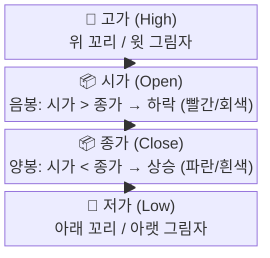

> 📺 [🎬 캔들 차트 기초 봉차트 설명](https://www.youtube.com/results?search_query=캔들차트+기초+봉차트+한국어+설명)

**OHLC 관계도**

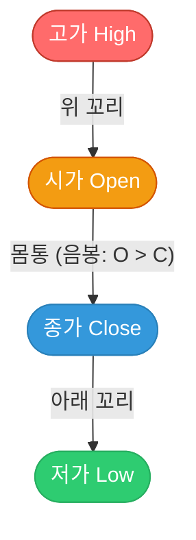

**주요 캔들 패턴**

| 패턴 | 모양 특징 | 의미 |
|------|-----------|------|
| **도지(Doji)** | 몸통이 거의 없음 (시가≈종가) | 매수·매도 균형, 방향 전환 가능성 |
| **망치(Hammer)** | 짧은 몸통 + 긴 아래 꼬리 (하락 후 나타남) | 매도세가 결국 매수세에 밀림 → 반등 신호 |
| **역망치(Inverted Hammer)** | 짧은 몸통 + 긴 위 꼬리 (하락 후 나타남) | 매수 시도 후 저항, 반등 가능성 |
| **교수형(Hanging Man)** | 망치와 모양 같지만 상승 후 나타남 | 상승 추세 마감 신호 |
| **불리쉬 엔걸핑(Bullish Engulfing)** | 큰 양봉이 앞날 음봉 전체를 덮음 | 강한 매수 전환 신호 |
| **베어리쉬 엔걸핑(Bearish Engulfing)** | 큰 음봉이 앞날 양봉 전체를 덮음 | 강한 매도 전환 신호 |
| **샛별(Morning Star)** | 음봉 → 도지 → 양봉 3캔들 조합 | 바닥 반전 강한 신호 |

> 📺 [🎬 망치봉 도지봉 장악형 캔들 패턴](https://www.youtube.com/results?search_query=망치봉+도지봉+엔걸핑+캔들패턴+한국어)

**캔들 패턴 실전 활용 — 패턴만으로 매매하면 안 되는 이유**

| 체크 항목 | 이유 |
|-----------|------|
| 패턴 발생 위치 (지지선·저항선 근처인가?) | 위치가 맞아야 신뢰도 상승 |
| 거래량이 평균보다 많은가? | 거래량 동반 시 신호 강도 증가 |
| 다음 봉이 방향을 확인해주는가? | 확인봉 없이 단독 진입은 위험 |
| 추세 방향과 일치하는가? | 추세 역방향 패턴은 성공률 낮음 |

**실전 신뢰도 판단 흐름**


**캔들 패턴 Python 시각화**

```python
import yfinance as yf
import mplfinance as mpf

# 삼성전자 최근 3개월 캔들 차트
df = yf.download("005930.KS", period="3mo", interval="1d", auto_adjust=True)
df = df[["Open", "High", "Low", "Close", "Volume"]]
df.columns = ["Open", "High", "Low", "Close", "Volume"]

mpf.plot(
    df,
    type="candle",
    style="charles",
    title="삼성전자 캔들 차트 (최근 3개월)",
    ylabel="주가 (원)",
    volume=True,
    mav=(5, 20),
    savefig="candle_chart.png"
)
```

---

### 🔗 Python 소스 연계 — 캔들 패턴 (Section 1)

웹앱의 **Tab 4 (캔들패턴)**은 `technicalChart.js`의 `CandleChart` 클래스를 기반으로 6가지 패턴을 캔버스에 직접 그립니다.

**`technicalChart.js` Tab 4 구현 구조**

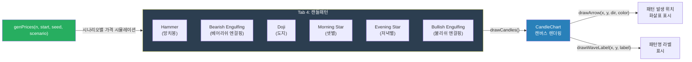

**패턴 감지 핵심 로직 (JavaScript 의사코드)**

```javascript
// CandleChart 클래스 — 주요 메서드 시그니처
class CandleChart {
    drawCandles()              // OHLC 배열 → 캔버스에 캔들 렌더링
    drawLine(prices, color)    // 이동평균선 등 꺾은선 그리기
    drawBand(upper, lower)     // 볼린저밴드 음영 영역
    drawTrendline(p1, p2)      // 추세선 (두 점 연결)
    drawHLine(price)           // 수평 지지·저항선
    drawArrow(x, y, dir, color)   // 패턴 위치 화살표 (dir: "up"/"down")
    drawWaveLabel(x, y, label)    // 파동/패턴 라벨 텍스트
}

// genPrices — 시나리오별 가격 생성
// scenario: "trend_up" | "trend_down" | "sideways" | "wave"
const prices = genPrices(n=60, start=50000, seed=42, scenario="trend_down");

// 망치봉(Hammer) 감지 조건 (Python과 동일 로직)
// 아래 꼬리 길이 > 몸통의 2배 AND 위 꼬리 없음 AND 하락 추세 후
function isHammer(open, high, low, close) {
    const body = Math.abs(close - open);
    const lowerWick = Math.min(open, close) - low;
    const upperWick = high - Math.max(open, close);
    return lowerWick > body * 2 && upperWick < body * 0.5;
}
```

**Python ↔ JavaScript 패턴 감지 대응표**

| 캔들 패턴 | Python (mplfinance) | JavaScript (technicalChart.js) |
|-----------|--------------------|---------------------------------|
| 망치봉 | `talib.CDLHAMMER()` | `isHammer(o,h,l,c)` 수식 직접 구현 |
| 도지 | `talib.CDLDOJI()` | `Math.abs(close-open) < range*0.05` |
| 엔걸핑 | `talib.CDLENGULFING()` | 전봉 몸통 포함 여부 비교 |
| 샛별 | `talib.CDLMORNINGSTAR()` | 3캔들 조합 순서 검사 |
| 시각화 | `mpf.plot(type="candle")` | `CandleChart.drawCandles()` |
| 패턴 표시 | `addplot` 화살표 | `drawArrow(x, y, "up", "#00f")` |

---

### 2. 차트 패턴 분석 (헤드앤숄더, 이중천장 등)

차트 패턴은 여러 캔들에 걸쳐 형성되는 **가격 흐름의 모양**으로, 추세 전환이나 지속을 예측하는 데 활용합니다.

> 📺 [🎬 차트 패턴 헤드앤숄더 이중천장 설명](https://www.youtube.com/results?search_query=차트패턴+헤드앤숄더+이중천장+한국어+주식)

**반전 패턴 (Reversal Patterns)**

| 패턴 | 모양 | 신호 |
|------|------|------|
| **헤드앤숄더(H&S)** | 세 봉우리 (중간이 가장 높음) | 상승 추세 종료, 하락 전환 |
| **역 헤드앤숄더** | 세 골짜기 (중간이 가장 낮음) | 하락 추세 종료, 상승 전환 |
| **이중천장(Double Top)** | M자 모양 (두 개의 비슷한 고점) | 강한 저항, 하락 전환 |
| **이중바닥(Double Bottom)** | W자 모양 (두 개의 비슷한 저점) | 강한 지지, 상승 전환 |

**헤드앤숄더 패턴 구조**

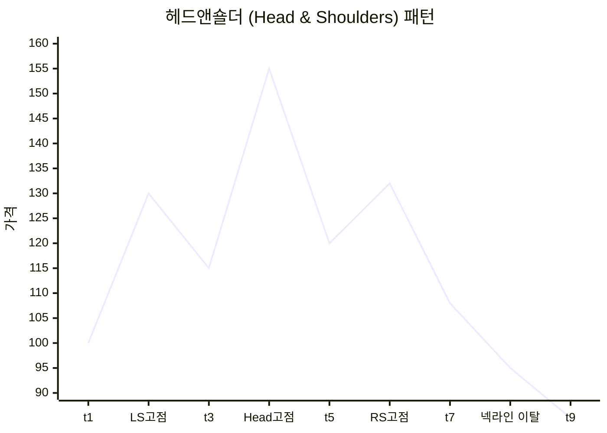

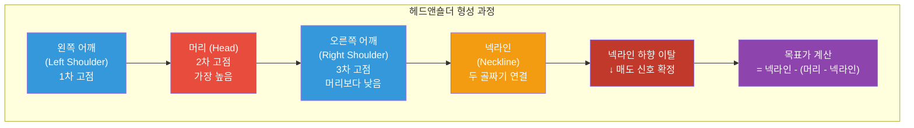

> 📺 [🎬 이중천장 이중바닥 매매 전략](https://www.youtube.com/results?search_query=이중천장+이중바닥+더블탑+매매전략+한국어)

**지속 패턴 (Continuation Patterns)**

| 패턴 | 의미 |
|------|------|
| **삼각수렴(Triangle)** | 변동성 축소 후 기존 방향으로 돌파 |
| **깃발(Flag)** | 급등/급락 후 잠시 쉬고 같은 방향 지속 |
| **페넌트(Pennant)** | 깃발과 유사하나 삼각 수렴 형태 |

**차트 패턴 실전 목표가 계산법**

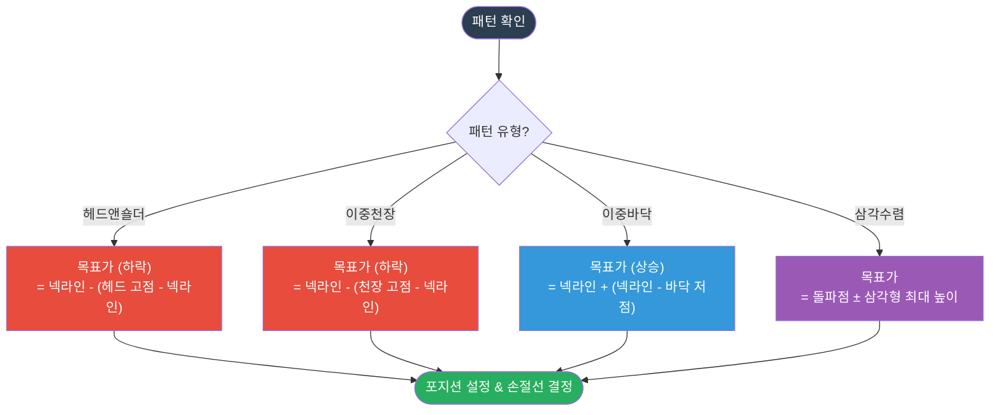

**패턴 신뢰도 높이는 조건**

| 조건 | 효과 |
|------|------|
| 패턴 형성에 시간이 오래 걸릴수록 | 돌파 후 움직임이 크고 신뢰도 높음 |
| 돌파 시 거래량 급증 | 돌파의 진정성 확인 |
| 넥라인 돌파 후 눌림목에서 지지 확인 | 재진입 기회이자 패턴 확정 |
| 여러 시간대(일봉·주봉)에서 동시 형성 | 더 강한 신호 |

---

### 🔗 Python 소스 연계 — 차트 패턴 (Section 2)

**목표가 수식의 JavaScript 구현 대응**

웹앱에서는 차트 패턴의 목표가 공식을 `technicalChart.js`의 드로잉 메서드로 시각화합니다.

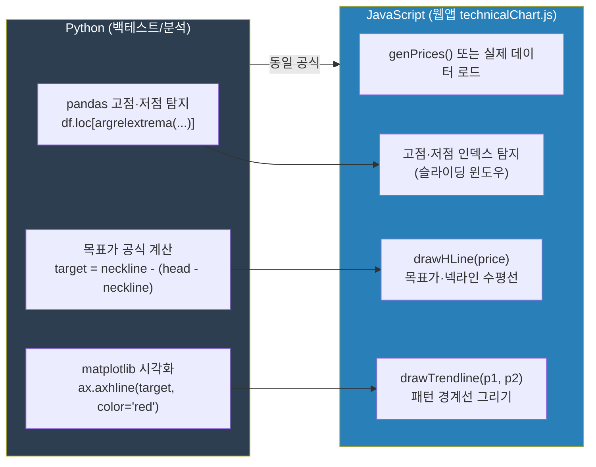

**목표가 계산 공식 JavaScript 구현 예시**

```javascript
// technicalChart.js — 패턴 목표가 계산 및 표시
function calcTargetHnS(headPrice, necklinePrice) {
    // 헤드앤숄더: 목표가 = 넥라인 - (헤드 - 넥라인)
    const amplitude = headPrice - necklinePrice;
    return necklinePrice - amplitude;
}

function calcTargetDoubleBottom(necklinePrice, bottomPrice) {
    // 이중바닥: 목표가 = 넥라인 + (넥라인 - 바닥)
    const amplitude = necklinePrice - bottomPrice;
    return necklinePrice + amplitude;
}

// CandleChart 인스턴스에 결과 표시
const chart = new CandleChart(canvas);
chart.drawHLine(necklinePrice);               // 넥라인
chart.drawHLine(targetPrice);                 // 목표가
chart.drawTrendline(shoulder1, shoulder2);    // 패턴 경계선
```

---

### 3. 엘리어트 파동 이론 (Elliott Wave Theory)

랄프 넬슨 엘리어트(Ralph Nelson Elliott)가 1930년대에 제안한 이론으로, 주가가 **군중 심리의 반복 패턴**에 따라 파동 형태로 움직인다고 봅니다.

> 📺 [🎬 엘리어트 파동이론 기초 설명](https://www.youtube.com/results?search_query=엘리어트파동이론+기초+주식+한국어+설명)

---

#### 3-1. 기본 파동 구조 — 충격 5파 + 조정 3파

상승 추세에서는 **5개의 충격파(임펄스)**와 **3개의 조정파(a-b-c)**가 한 사이클을 이룹니다.

**엘리어트 기본 8파동 구조**

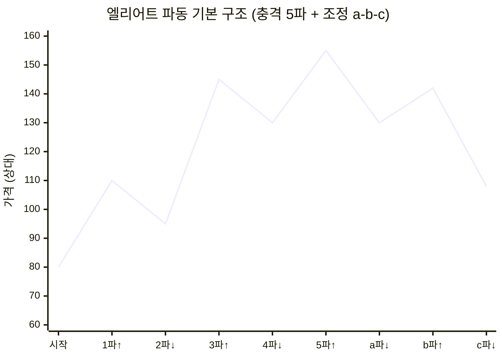

| 파동 구분 | 파동 | 방향 | 군중 심리 |
|-----------|------|------|-----------|
| 충격파(추세) | **1파** | 상승 | 소수만 인식, "반등 아닐까?" |
| 충격파(추세) | **2파** | 하락 | "역시 하락이었어" 공포 매도 |
| 충격파(추세) | **3파** | 강상승 | "진짜 상승이다!" 추세 추종 |
| 충격파(추세) | **4파** | 하락 | 이익 실현, 단기 조정 |
| 충격파(추세) | **5파** | 약상승 | "아직 올라!" 뒤늦은 매수 |
| 조정파(역추세) | **a파** | 하락 | "잠깐 조정이겠지" 낙관 |
| 조정파(역추세) | **b파** | 상승 | "역시 오르네" 반등 매수 |
| 조정파(역추세) | **c파** | 강하락 | 패닉셀, 손절 쏟아짐 |

---

#### 3-2. 절대 불변 규칙 3가지

> 이 규칙 중 하나라도 어기면 파동 카운팅을 전부 재시작해야 합니다.

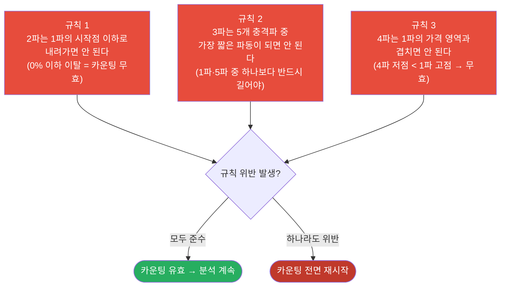

---

#### 3-3. 피보나치 비율과 각 파동의 관계

엘리어트 파동이론과 피보나치 수열은 분리할 수 없습니다. 각 파동의 크기는 피보나치 비율을 따르는 경향이 있습니다.

| 파동 | 일반적 피보나치 목표 | 설명 |
|------|---------------------|------|
| **2파** (1파 되돌림) | 0.618 × 1파 크기 | 1파 상승분의 61.8% 되돌림 구간 진입 대기 |
| **3파** (1파 대비 연장) | 1.618 × 1파 크기 | 3파 목표가 = 1파 시작 + (1파 크기 × 1.618) |
| **4파** (3파 되돌림) | 0.382 × 3파 크기 | 3파 상승분의 38.2% 되돌림 (얕은 조정) |
| **5파** (1파와 동일하거나 더 짧음) | 0.618 × 3파 또는 1파와 동일 | 3파 대비 짧게 끝나면 종료 임박 신호 |
| **a파** (5파 되돌림) | 0.382~0.618 × 5파 크기 | a파 크기로 c파 목표 예측 |
| **c파** (a파 연장) | a파 크기와 동일하거나 1.618배 | c파 = a파 시작 - (a파 크기 × 1.0~1.618) |

**실전 예시 (코스피 2020~2022 가상 적용)**

```
2020.03 코스피 1,457 (바닥) → 1파 시작
2020.06 코스피 2,200 → 1파 완성 (+51%)
2020.09 코스피 1,900 → 2파 완성 (1파의 40% 되돌림 ≈ 피보나치 38.2%)
2021.01 코스피 3,266 → 3파 완성 (1파의 2.7배 ≈ 피보나치 261.8%)
2021.05 코스피 2,890 → 4파 완성 (3파의 20% 되돌림)
2021.07 코스피 3,305 → 5파 완성 (새 고점, 거래량 3파 대비 감소)
2022.09 코스피 2,155 → a-b-c 조정 완성
```

**피보나치 되돌림 수준별 파동 매핑**

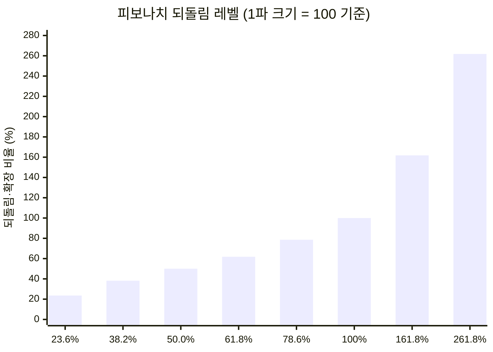

---

#### 3-4. 조정파동의 3가지 유형

5파 상승 후 나타나는 a-b-c 조정은 모두 같은 형태가 아닙니다. 3가지 주요 유형이 있습니다.

**유형 1: 지그재그(Zigzag) — 5-3-5 구조**

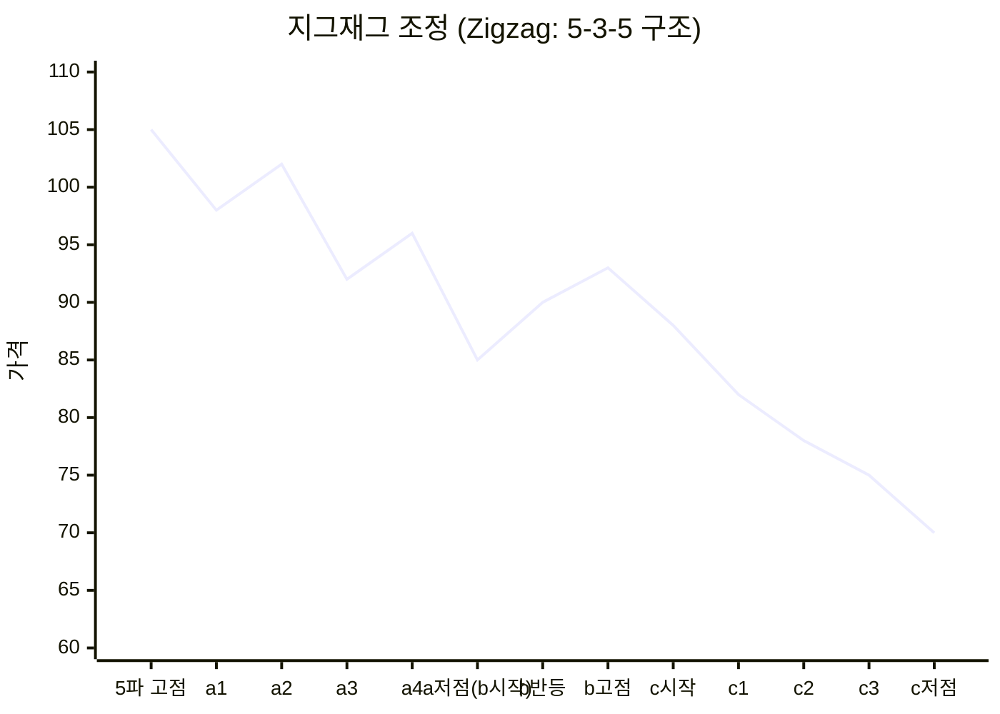

- 가장 흔한 조정 패턴
- c파가 a파 저점 아래로 하락 → 큰 되돌림
- 2파에서 자주 나타남

**유형 2: 플랫(Flat) — 3-3-5 구조**

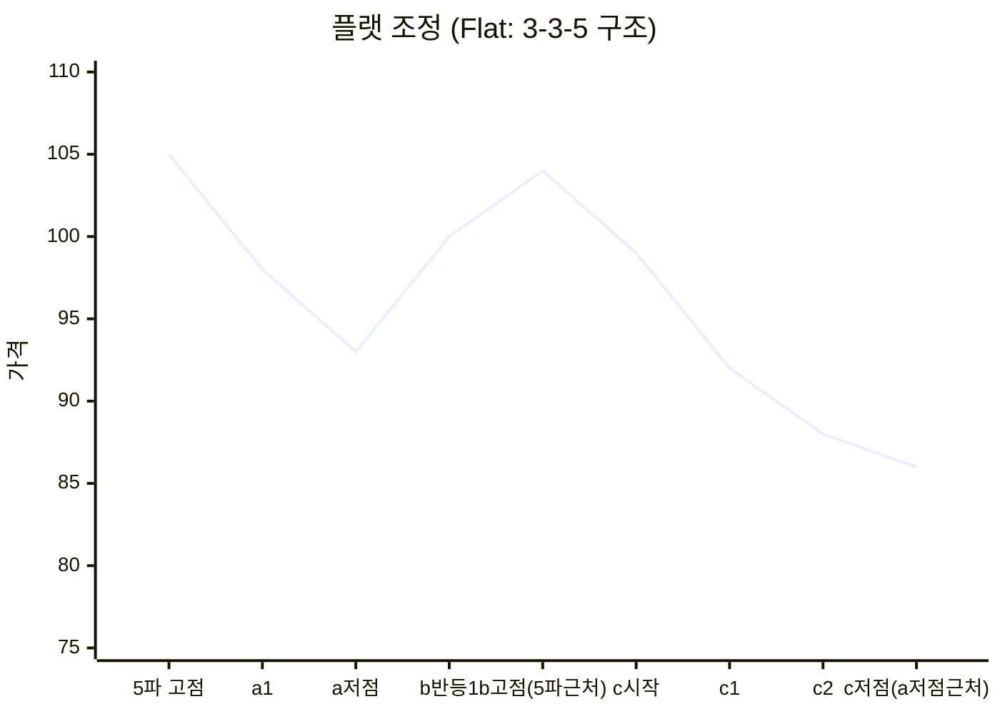

- 조정 폭이 얕아 강세장 신호
- 4파에서 자주 나타남

**유형 3: 삼각형(Triangle) — 3-3-3-3-3 구조**

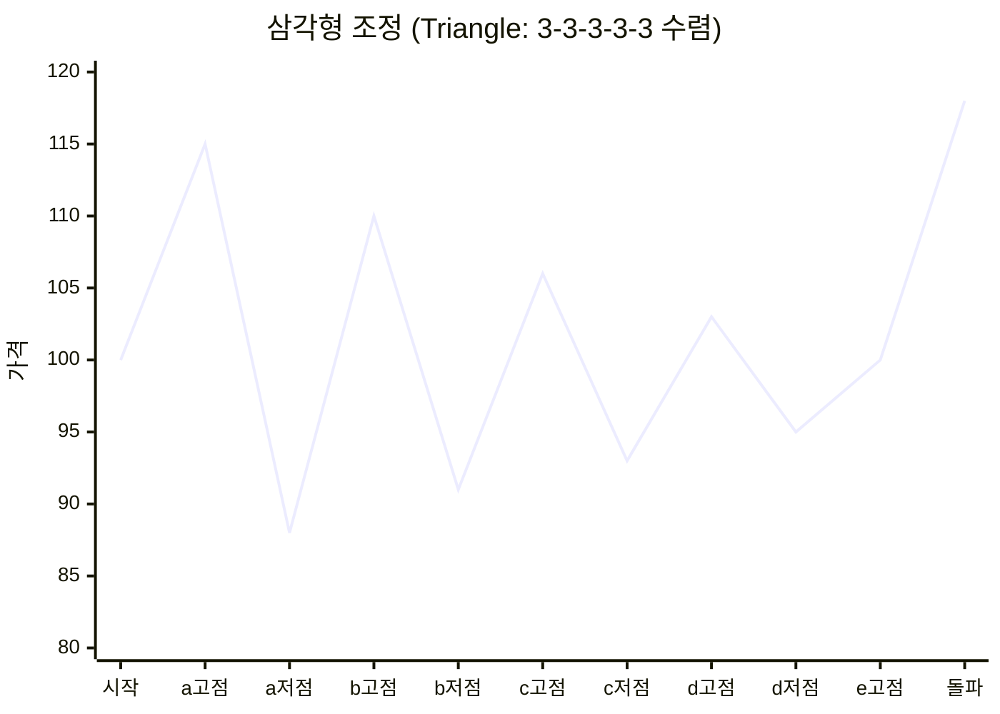

- 변동성이 점점 줄어드는 패턴
- 4파 또는 b파에서 나타남
- 삼각형 돌파 방향이 다음 추세 방향

| 유형 | 구조 | c파 위치 | 발생 위치 | 함의 |
|------|------|----------|-----------|------|
| 지그재그 | 5-3-5 | a파 저점 아래 | 주로 2파 | 큰 조정, 매수 기회 낮음 |
| 플랫 | 3-3-5 | a파 저점 근처 | 주로 4파 | 얕은 조정, 추세 강건 |
| 삼각형 | 3-3-3-3-3 | 수렴 후 돌파 | 4파·b파 | 돌파 전 에너지 축적 |

---

#### 3-5. 파동의 프랙탈 구조 (파동 속 파동)

엘리어트 파동의 핵심 특성은 **자기 유사성(프랙탈)**입니다. 큰 파동 하나가 작은 파동들의 집합입니다.

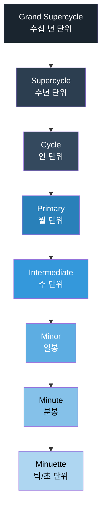

**실전 의미**: 일봉에서 보이는 5파 구조 전체가, 주봉으로 보면 단 하나의 3파일 수 있습니다.
→ 분석 시 **시간대를 여러 개 겹쳐 보는 것**이 중요합니다.

---

#### 3-6. 파동별 실전 매매 전략

| 파동 위치 | 가능한 전략 | 진입 조건 | 손절 기준 |
|-----------|------------|-----------|-----------|
| **2파 완성** | 3파 시작 예상 매수 | RSI 과매도 + 피보나치 61.8% 지지 + 거래량 반등 | 1파 시작점 이탈 시 |
| **3파 진행 중** | 추세 추종 매수 | 이전 고점 돌파 + 거래량 급증 + 정배열 | 4파 시작 조짐(다이버전스) 시 |
| **4파 완성** | 5파 예상 진입 (소형 포지션) | 피보나치 38.2% 지지 + 지지선 반등 확인 | 1파 고점 하향 이탈 시 |
| **5파 말단** | 포지션 축소 / 매도 준비 | RSI 다이버전스 + 거래량 감소 + 피보나치 확장 161.8% | 새로운 고점 형성 시 재검토 |
| **c파 완성** | 새 1파 매수 | 이전 저항선 돌파 + 거래량 회복 + MACD 골든크로스 | c파 저점 이탈 시 |

---

#### 3-7. 실전 파동 식별 6단계 프로세스


---

#### 3-8. 거래량으로 파동 확인하기

| 파동 | 기대되는 거래량 패턴 | 이유 |
|------|---------------------|------|
| 1파 | 평균 이상, 상승 시 | 소수가 먼저 매수 |
| 2파 | 1파보다 감소 | 공포 매도 후 소강 |
| **3파** | **폭발적 증가 (가장 많음)** | 추세 추종 + 뉴스 + 기관 매수 |
| 4파 | 3파보다 감소 | 이익 실현, 관망 |
| 5파 | 3파보다 적음 | 뒤늦은 개인 매수, 기관 매도 |
| a파 | 갑자기 증가 | 예상 못한 하락 |
| b파 | 감소 | 반등이지만 신뢰도 낮음 |
| c파 | 증가 (패닉셀) | 손절물량 + 공매도 |

---

#### 3-9. 실전 조합 전략 — 피보나치·보조지표 연동

```
[최강 매수 조건 — 3파 진입]
  엘리어트 2파 저점 근처
  + 피보나치 61.8% 되돌림 지지
  + RSI < 30 (과매도)
  + MACD 히스토그램 반전 (음→양)
  + 거래량 바닥 후 반등
  → 3파 상승 진입 조건 충족 → 강한 매수 신호

[최강 매도 조건 — 5파 청산]
  엘리어트 5파 고점 근처
  + 피보나치 확장 161.8% 도달
  + RSI 70 이상 + 다이버전스 발생
  + MACD 하락 전환 조짐
  + 거래량 5파가 3파보다 적음
  → a파 시작 경고 → 매도 또는 이익 실현 신호

[조정 완료 확인 — c파 바닥 매수]
  a파·c파 크기 동일 (or c파 = a파 × 1.618)
  + 피보나치 61.8~78.6% 되돌림 지지
  + 캔들 망치봉·역망치봉
  + 거래량 급감 후 반등
  → 새로운 1파 시작 가능성
```

---

#### 3-10. 주의사항 및 한계

| 항목 | 내용 |
|------|------|
| **주관성** | 파동 카운팅은 전문가마다 다를 수 있어 '정답'이 없음 |
| **후행성** | 파동이 완성돼야 확인 가능 — "지나야 보임" 비판 |
| **단독 사용 금지** | RSI·MACD·피보나치·거래량과 반드시 병행 |
| **시간대 선택** | 분봉·일봉·주봉 시간대에 따라 카운팅 결과가 달라짐 |
| **실패 확률** | 5파 이후 반드시 조정이 오지만 시점 예측은 불확실 |

> 📺 [🎬 엘리어트 파동 실전 매매 적용법](https://www.youtube.com/results?search_query=엘리어트파동+실전매매+적용법+한국주식+강의)

---

### 🔗 Python 소스 연계 — 엘리어트 파동 (Section 3)

웹앱의 **Tab 6 (엘리어트파동)**은 `technicalChart.js`가 파동 레이블과 피보나치 수평선을 자동으로 그립니다.

**Tab 6 구현 아키텍처**

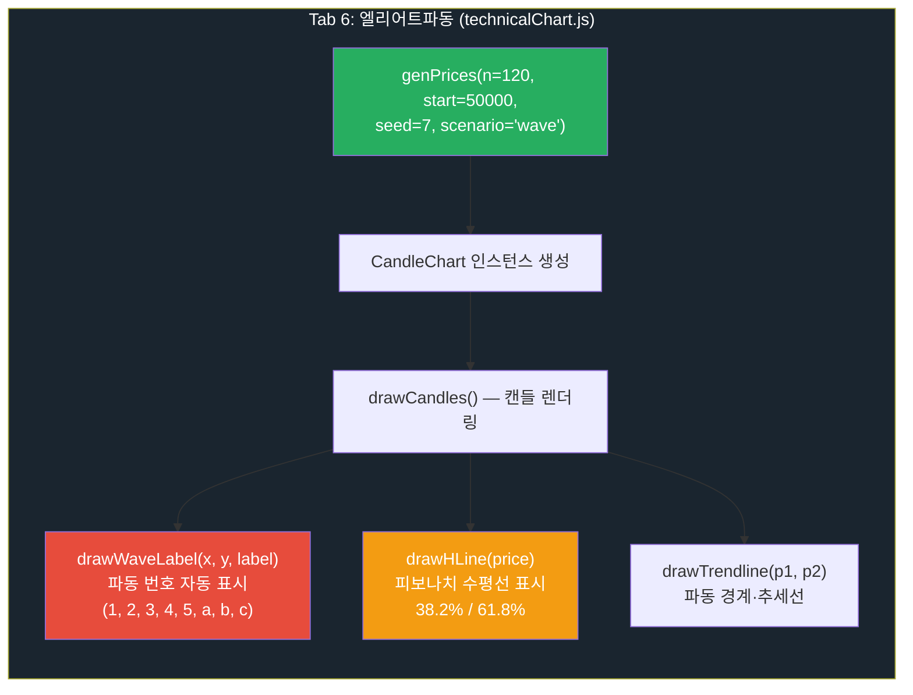

**피보나치 수평선 계산 (JavaScript)**

```javascript
// technicalChart.js — Tab 6 피보나치 수평선 자동 계산
// genPrices(n, start, seed, scenario)로 생성된 prices 배열 사용

const high = Math.max(...prices);   // 5파 고점
const low  = Math.min(...prices);   // 2파 또는 4파 저점
const range = high - low;

// 피보나치 되돌림 레벨 계산
const fib382 = high - range * 0.382;   // 38.2% 되돌림
const fib618 = high - range * 0.618;   // 61.8% 되돌림

// CandleChart에 수평선 표시
chart.drawHLine(fib382);   // drawHLine(price) — 38.2% 선
chart.drawHLine(fib618);   // drawHLine(price) — 61.8% 선

// 파동 레이블 자동 표시
// drawWaveLabel(x, y, label)
const wavePoints = detectWavePoints(prices);  // swing high/low 감지
wavePoints.forEach((pt, i) => {
    const labels = ["1", "2", "3", "4", "5", "a", "b", "c"];
    chart.drawWaveLabel(pt.x, pt.y, labels[i]);
});
```

**Python ↔ JavaScript 파동 분석 기능 대응표**

| 기능 | Python (분석 스크립트) | JavaScript (technicalChart.js) |
|------|----------------------|--------------------------------|
| 가격 데이터 | `yfinance.download()` | `genPrices(n, start, seed, scenario)` |
| 고점·저점 탐지 | `scipy.signal.argrelextrema()` | 슬라이딩 윈도우 비교 |
| 피보나치 계산 | `(high - low) * 0.618` | `range * 0.618` (동일) |
| 수평선 표시 | `ax.axhline(fib618)` | `chart.drawHLine(fib618)` |
| 파동 레이블 | `ax.annotate("3", xy=(...))` | `chart.drawWaveLabel(x, y, "3")` |
| 추세선 | `ax.plot([x1,x2],[y1,y2])` | `chart.drawTrendline(p1, p2)` |

---

### 4. 실습: 기본적·기술적 분석 통합 리포트

```python
import yfinance as yf
import pandas as pd
import matplotlib.pyplot as plt
import matplotlib.gridspec as gridspec

def technical_report(ticker: str, period: str = "6mo"):
    df = yf.download(ticker, period=period, auto_adjust=True, progress=False)
    df = df[["Open", "High", "Low", "Close", "Volume"]]

    close = df["Close"]

    # 이동평균선
    df["MA20"]  = close.rolling(20).mean()
    df["MA60"]  = close.rolling(60).mean()

    # RSI (14일)
    delta = close.diff()
    gain  = delta.clip(lower=0).rolling(14).mean()
    loss  = (-delta.clip(upper=0)).rolling(14).mean()
    rs    = gain / loss
    df["RSI"] = 100 - (100 / (1 + rs))

    # MACD
    ema12 = close.ewm(span=12, adjust=False).mean()
    ema26 = close.ewm(span=26, adjust=False).mean()
    df["MACD"]   = ema12 - ema26
    df["Signal"] = df["MACD"].ewm(span=9, adjust=False).mean()

    # 볼린저밴드
    df["BB_mid"]   = close.rolling(20).mean()
    df["BB_upper"] = df["BB_mid"] + 2 * close.rolling(20).std()
    df["BB_lower"] = df["BB_mid"] - 2 * close.rolling(20).std()

    fig = plt.figure(figsize=(14, 10))
    gs  = gridspec.GridSpec(3, 1, height_ratios=[3, 1, 1], hspace=0.05)

    # 메인 차트
    ax1 = fig.add_subplot(gs[0])
    ax1.plot(close.index, close, label="종가", color="black", linewidth=1)
    ax1.plot(df.index, df["MA20"],    label="MA20",  color="blue",  linewidth=1, linestyle="--")
    ax1.plot(df.index, df["MA60"],    label="MA60",  color="red",   linewidth=1, linestyle="--")
    ax1.fill_between(df.index, df["BB_upper"], df["BB_lower"],
                     alpha=0.1, color="gray", label="볼린저밴드")
    ax1.set_title(f"{ticker} 기술적 분석 통합 리포트", fontsize=12)
    ax1.legend(fontsize=8)
    ax1.grid(True, alpha=0.3)

    # RSI
    ax2 = fig.add_subplot(gs[1], sharex=ax1)
    ax2.plot(df.index, df["RSI"], color="purple", linewidth=1)
    ax2.axhline(70, color="red",   linestyle="--", alpha=0.5, label="과매수(70)")
    ax2.axhline(30, color="green", linestyle="--", alpha=0.5, label="과매도(30)")
    ax2.set_ylim(0, 100)
    ax2.set_ylabel("RSI")
    ax2.legend(fontsize=7)
    ax2.grid(True, alpha=0.3)

    # MACD
    ax3 = fig.add_subplot(gs[2], sharex=ax1)
    ax3.plot(df.index, df["MACD"],   color="blue",  linewidth=1, label="MACD")
    ax3.plot(df.index, df["Signal"], color="red",   linewidth=1, label="Signal")
    ax3.bar(df.index, df["MACD"] - df["Signal"],
            color=["green" if v >= 0 else "red" for v in (df["MACD"] - df["Signal"])],
            alpha=0.4, label="히스토그램")
    ax3.axhline(0, color="black", linewidth=0.5)
    ax3.set_ylabel("MACD")
    ax3.legend(fontsize=7)
    ax3.grid(True, alpha=0.3)

    plt.tight_layout()
    plt.savefig(f"{ticker}_technical.png", dpi=150, bbox_inches="tight")
    plt.show()

    # 현재 신호 요약
    latest = df.iloc[-1]
    print(f"\n=== {ticker} 현재 기술적 신호 ===")
    print(f"RSI:     {latest['RSI']:.1f}  {'⚠️ 과매수' if latest['RSI']>70 else '✅ 과매도' if latest['RSI']<30 else '중립'}")
    print(f"MACD:    {'골든크로스' if latest['MACD'] > latest['Signal'] else '데드크로스'}")
    print(f"MA20/60: {'정배열 (상승 추세)' if latest['MA20'] > latest['MA60'] else '역배열 (하락 추세)'}")
    bb_pct = (latest['Close'] - latest['BB_lower']) / (latest['BB_upper'] - latest['BB_lower'])
    print(f"볼린저밴드 위치: {bb_pct:.1%} (상단=1.0, 하단=0.0)")

# 실행 예시
technical_report("005930.KS")   # 삼성전자
# technical_report("NVDA")      # 엔비디아
```

---

## 웹앱 실습 연계

### Tab 5 (보조지표) — 볼린저밴드 + RSI + MACD 통합 뷰

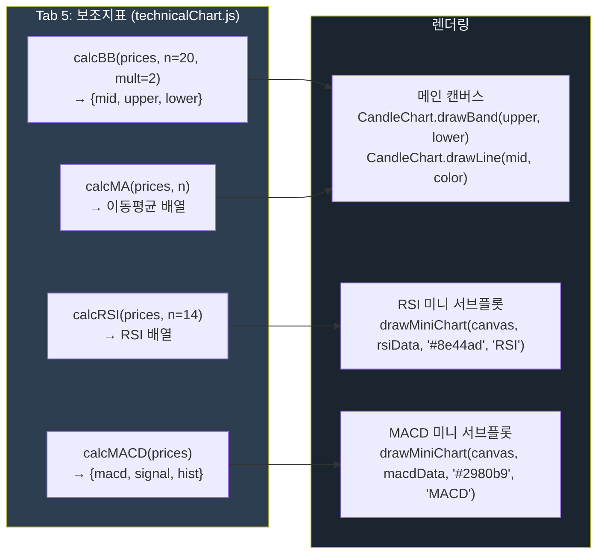

**`drawMiniChart` 함수 시그니처**

```javascript
// technicalChart.js
// drawMiniChart(canvas, data, color, title)
// canvas: HTMLCanvasElement — 서브플롯 캔버스
// data:   number[]          — RSI 또는 MACD 값 배열
// color:  string            — 선 색상 (hex 또는 CSS 색상명)
// title:  string            — 차트 상단 라벨

drawMiniChart(rsiCanvas,  calcRSI(prices, 14),    '#8e44ad', 'RSI(14)');
drawMiniChart(macdCanvas, calcMACD(prices).macd,  '#2980b9', 'MACD');
```

---

### Tab 7 (종합리포트) — 5신호 스코어링 시스템

웹앱의 Tab 7은 5개 기술적 신호에 점수를 부여해 매수/관망/매도 판단을 자동 생성합니다.

**스코어링 로직**

| 신호 | 조건 | 점수 |
|------|------|------|
| 신호 1: RSI 과매도 | RSI < 30 | +2점 |
| 신호 2: MACD 골든크로스 | MACD > Signal | +2점 |
| 신호 3: 볼린저밴드 하단 터치 | Close <= BB_lower | +1점 |
| 신호 4: 거래량 평균 초과 | Volume > MA20_volume | +1점 |
| 신호 5: 단기MA > 장기MA (정배열) | MA20 > MA60 | +1점 |
| **총점 범위** | **최소 0점 ~ 최대 7점** | — |

**스코어링 판정 흐름**

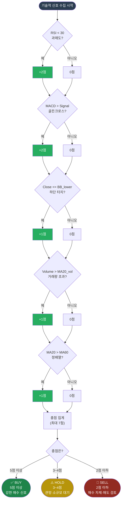

**Tab 7 스코어링 JavaScript 구현 구조**

```javascript
// technicalChart.js — Tab 7 종합리포트 스코어링
function calcSignalScore(prices, volumes) {
    let score = 0;
    const n = prices.length;

    const rsi    = calcRSI(prices, 14);
    const bb     = calcBB(prices, 20, 2);      // {mid, upper, lower}
    const macdObj = calcMACD(prices);           // {macd, signal, hist}
    const ma20   = calcMA(prices, 20);
    const ma60   = calcMA(prices, 60);
    const vol20  = calcMA(volumes, 20);         // 거래량 20일 평균

    const latestRSI    = rsi[n - 1];
    const latestPrice  = prices[n - 1];
    const latestMACD   = macdObj.macd[n - 1];
    const latestSignal = macdObj.signal[n - 1];
    const latestBBlow  = bb.lower[n - 1];
    const latestVol    = volumes[n - 1];
    const latestVol20  = vol20[n - 1];
    const latestMA20   = ma20[n - 1];
    const latestMA60   = ma60[n - 1];

    // 신호 1: RSI 과매도 (+2점)
    if (latestRSI < 30) score += 2;

    // 신호 2: MACD 골든크로스 (+2점)
    if (latestMACD > latestSignal) score += 2;

    // 신호 3: 볼린저밴드 하단 터치 (+1점)
    if (latestPrice <= latestBBlow) score += 1;

    // 신호 4: 거래량 20일 평균 초과 (+1점)
    if (latestVol > latestVol20) score += 1;

    // 신호 5: 단기MA > 장기MA 정배열 (+1점)
    if (latestMA20 > latestMA60) score += 1;

    // 판정
    if (score >= 5) return { score, verdict: "BUY" };
    if (score >= 3) return { score, verdict: "HOLD" };
    return { score, verdict: "SELL" };
}
```

---

### 백테스트 API 연계 (`/api/quant/backtest`)

웹앱의 파이썬 백엔드는 이동평균 크로스오버 전략 백테스트를 제공합니다.

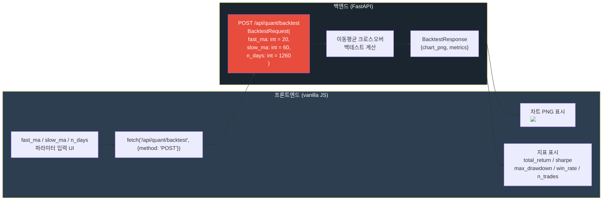

**백테스트 Python 코드 (FastAPI 라우터 구조)**

```python
# backend/routers/quant.py — 백테스트 엔드포인트
from fastapi import APIRouter
from pydantic import BaseModel

router = APIRouter(prefix="/api/quant")

class BacktestRequest(BaseModel):
    fast_ma: int = 20    # 단기 이동평균 기간
    slow_ma: int = 60    # 장기 이동평균 기간
    n_days:  int = 1260  # 백테스트 기간 (거래일 기준, 1260일 ≈ 5년)

@router.post("/backtest")
async def run_backtest(req: BacktestRequest):
    """
    이동평균 골든크로스/데드크로스 전략 백테스트
    Returns:
        chart: PNG 이미지 (base64)
        metrics: {
            total_return: float,    # 총 수익률 (%)
            sharpe: float,          # 샤프 비율
            max_drawdown: float,    # 최대 낙폭 (%)
            win_rate: float,        # 승률 (%)
            n_trades: int           # 총 거래 횟수
        }
    """
    # fast_ma < slow_ma 조건 검사
    # 가격 데이터 생성 또는 로드 (n_days 기간)
    # MA 크로스오버 신호 계산
    # 수익률·샤프·MDD·승률 계산
    # matplotlib 차트 PNG 생성 → base64 인코딩
    ...
```

**백테스트 전략 핵심 로직 (Python)**

```python
import pandas as pd
import numpy as np

def ma_crossover_backtest(prices: pd.Series, fast: int, slow: int):
    """이동평균 크로스오버 백테스트"""
    ma_fast = prices.rolling(fast).mean()
    ma_slow = prices.rolling(slow).mean()

    # 포지션: 1(매수) / 0(현금)
    signal = (ma_fast > ma_slow).astype(int)
    signal = signal.shift(1)  # 당일 신호는 다음날 실행 (리얼리즘)

    daily_return = prices.pct_change()
    strategy_return = daily_return * signal

    # 성과 지표
    total_return  = (1 + strategy_return).prod() - 1
    sharpe        = strategy_return.mean() / strategy_return.std() * np.sqrt(252)
    cumulative    = (1 + strategy_return).cumprod()
    max_drawdown  = ((cumulative - cumulative.cummax()) / cumulative.cummax()).min()

    # 거래 횟수 및 승률
    trades    = signal.diff().abs()
    n_trades  = int(trades.sum() / 2)   # 매수+매도 쌍을 1거래로 카운트
    win_rate  = (strategy_return[strategy_return != 0] > 0).mean()

    return {
        "total_return": round(total_return * 100, 2),
        "sharpe":        round(sharpe, 2),
        "max_drawdown":  round(max_drawdown * 100, 2),
        "win_rate":      round(win_rate * 100, 1),
        "n_trades":      n_trades,
    }
```

---

## 해보기 활동

1. 관심 종목의 최근 차트를 보고 이중천장·이중바닥·헤드앤숄더 중 가장 가까운 패턴이 있는지 표시해보세요.
2. 위 Python 리포트를 실행해서 RSI·MACD·볼린저밴드 신호가 모두 같은 방향을 가리키는지 확인해보세요. 신호가 엇갈린다면 왜 그런지 생각해보세요.
3. 엘리어트 파동 관점에서 최근 주가 흐름이 어느 파동 위치에 있을 것 같은지 추정해보고, 그 근거를 두 가지 이상 써보세요.
4. 웹앱의 Tab 7 (종합리포트)를 열고 스코어링 결과가 BUY/HOLD/SELL 중 어느 판정이 나오는지 확인하세요. 각 신호별 점수를 계산해 Python 코드의 결과와 비교해보세요.
5. `/api/quant/backtest` API를 호출할 때 `fast_ma=5, slow_ma=20`과 `fast_ma=20, slow_ma=60`의 샤프 비율과 최대 낙폭을 비교해보세요.

## 모듈 7 마무리

모듈 7(투자분석 기초 방법론) 전 10일차를 완료했습니다.

| 분석 방법 | 핵심 도구 | 참고 파일 |
|-----------|-----------|-----------|
| 매크로 분석 | 금리·물가·유가·환율 | Day 042~044 |
| 산업 분석 | Porter's 5 Forces, SWOT | Day 045~046 |
| 기본적 분석 | 재무제표, PER/PBR, DCF | Day 047~049 |
| 기술적 분석 | MA·RSI·MACD·패턴·파동 | Day 050~051 |

## 다음 시간 미리보기

➡️ [Day 052](37.md) 에서 계속됩니다 — 모듈 8: 퀀트 전략 백테스트 기초
