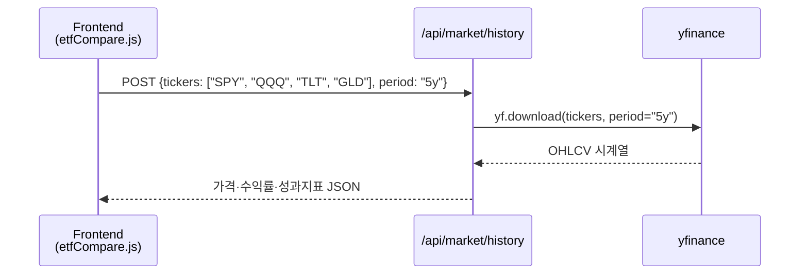
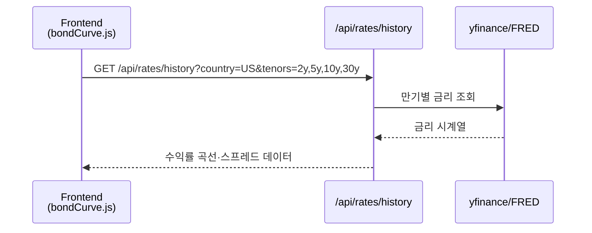

# Day 052 — 주식 및 ETF 상품 이해

> **모듈 8: 퀀트를 위한 금융 필수 지식** | 1/5일차 | 🏦 | 학습시간: 8시간

---

> 📺 **YouTube 강의**: [🎬 주식 ETF 상품 투자 이해](https://www.youtube.com/results?search_query=주식+ETF+상품+투자+한국어+설명+강의)

## 오늘 배울 것

- 주식 시장 구조: 코스피, 코스닥, 나스닥
- 주식 기본 개념: EPS, 배당, 시가총액, 유동주식
- ETF(상장지수펀드)의 구조와 종류
- ETF 운용 전략: 패시브, 액티브, 팩터 ETF
- 실습: ETF 성과 비교 분석

---

## 🗓 세부 일정 (1일 8시간)

> **강의 5시간** (5개 단락 × 50분 + 도입·마무리 50분) + **실습 3시간** = 총 8시간

| 시간 | 구분 | 내용 | 형태 |
|------|------|------|------|
| 09:00 – 09:10 | 도입 | 오늘 학습 목표 확인 | 강의 |
| 09:10 – 09:30 | **1단락** 설명 20분 | 주식 시장 구조 | 강의 |
| 09:30 – 10:00 | 각자 정리 & 유튜브 30분 | 코스피·코스닥·나스닥 비교 영상 검색 | 자율 |
| 10:00 – 10:20 | **2단락** 설명 20분 | EPS, 배당, 시가총액 | 강의 |
| 10:20 – 10:50 | 각자 정리 & 유튜브 30분 | 기업 재무지표 노트 정리 | 자율 |
| 10:50 – 11:00 | ☕ 휴식 | — | — |
| 11:00 – 11:20 | **3단락** 설명 20분 | ETF 구조와 종류 | 강의 |
| 11:20 – 11:50 | 각자 정리 & 유튜브 30분 | ETF 상품 설명서 읽기 | 자율 |
| 11:50 – 12:10 | **4단락** 설명 20분 | ETF 운용 전략 | 강의 |
| 12:10 – 12:40 | 각자 정리 & 유튜브 30분 | 패시브·액티브·팩터 ETF 사례 정리 | 자율 |
| 12:40 – 13:00 | **5단락** 설명 20분 | ETF 성과 비교 방법 | 강의 |
| 13:00 – 13:30 | 각자 정리 & 유튜브 30분 | 성과 지표 복습 | 자율 |
| 13:30 – 14:00 | 강의 마무리 | Q&A · 핵심 복습 | 강의 |
| 14:00 – 15:00 | 💻 **실습 1부** 60분 | ETF 가격 데이터 수집 및 수익률 계산 | 실습 |
| 15:00 – 15:10 | ☕ 휴식 | — | — |
| 15:10 – 16:00 | 💻 **실습 2부** 50분 | 누적수익률·변동성·MDD 비교 | 실습 |
| 16:00 – 16:10 | ☕ 휴식 | — | — |
| 16:10 – 17:00 | 💻 **실습 발표 & 리뷰** 50분 | ETF 비교 결과 발표 · 피드백 | 실습 |

> 강의 5시간: 도입 10분 + 단락 5개×50분 + 마무리 30분 = **300분**  
> 실습 3시간: 1부 60분 + 휴식 10분 + 2부 50분 + 휴식 10분 + 발표·리뷰 50분 = **180분**

---

## 🔗 참고 사이트 & 데이터 원천

> 이 문서(주식·ETF 상품 이해)의 실습에 필요한 공식 데이터 출처와 참고 사이트입니다. ⚿ 는 API 키 또는 승인이 필요한 항목입니다.

### 📊 국내 공식 데이터

| 기관 | URL | API 키 | 제공 데이터 |
|------|-----|--------|-------------|
| KRX 정보데이터시스템 | <https://data.krx.co.kr> | 불필요(웹 조회) | 주식·ETF 가격, 거래량, 상장 정보 |
| KRX Data Marketplace | <https://openapi.krx.co.kr> | ⚿ 필요 | 주식·ETF 시계열, 지수, 증권상품 |
| 금융감독원 DART | <https://opendart.fss.or.kr> | ⚿ 필요 | 사업보고서, 재무제표, 배당 |
| 네이버 금융 | <https://finance.naver.com> | 불필요 | 국내 주식·ETF 가격 참고 |
| 한국거래소 ETF | <https://etf.krx.co.kr> | 불필요 | ETF 구성종목, 순자산, 수익률 |

### 🌍 해외 공식 데이터

| 기관 | URL | API 키 | 제공 데이터 |
|------|-----|--------|-------------|
| SEC EDGAR | <https://www.sec.gov/edgar> | 불필요 | 미국 상장기업 공시 |
| Nasdaq Data Link | <https://data.nasdaq.com> | ⚿ 권장 | 미국 주식·ETF·경제 데이터 |
| ETF.com | <https://www.etf.com> | 불필요 | ETF 분류, 운용보수, 구성 |
| iShares | <https://www.ishares.com> | 불필요 | iShares ETF 구성종목·팩트시트 |
| State Street SPDR | <https://www.ssga.com> | 불필요 | SPDR ETF 상품 정보 |
| Vanguard | <https://investor.vanguard.com> | 불필요 | Vanguard ETF 상품 정보 |

### 📈 차트 & 뉴스 참고

| 분류 | 사이트 | URL | 활용 용도 |
|------|--------|-----|-----------|
| 차트 플랫폼 | TradingView | <https://www.tradingview.com> | 주식·ETF 가격 차트 |
| 시장 데이터 | Yahoo Finance | <https://finance.yahoo.com> | ETF 가격, 배당, 간단한 성과 비교 |
| 국내 금융 포탈 | 네이버 금융 | <https://finance.naver.com> | 국내 ETF 조회 |
| 금융 미디어 | 한국경제 | <https://www.hankyung.com> | ETF·증시 뉴스 |
| 금융 미디어 | 이데일리 | <https://www.edaily.co.kr> | ETF·시장 기사 |

---

### 1. 주식 시장 구조 (코스피, 코스닥, 나스닥)

> 📖 **Wikipedia**: [주식시장](https://ko.wikipedia.org/wiki/주식시장) · [코스피](https://ko.wikipedia.org/wiki/코스피) · [코스닥](https://ko.wikipedia.org/wiki/코스닥) · [나스닥](https://ko.wikipedia.org/wiki/나스닥)

**핵심 개념**

주식 시장은 기업이 자본을 조달하고 투자자가 기업의 소유권 일부를 사고파는 장소입니다. 퀀트 분석에서는 시장별 특성이 다르기 때문에, 같은 전략이라도 어느 시장에 적용하는지 먼저 구분해야 합니다.

| 시장 | 주요 특징 | 퀀트 분석 포인트 |
|------|-----------|------------------|
| 코스피 | 대형·우량 기업 중심 | 시가총액, 외국인 수급, 경기 민감도 |
| 코스닥 | 성장주·중소형주 중심 | 변동성, 거래대금, 테마 민감도 |
| 나스닥 | 기술주·성장주 비중 높음 | 금리 민감도, 성장률, 밸류에이션 |

> 📺 [🎬 코스피 코스닥 나스닥 차이](https://www.youtube.com/results?search_query=코스피+코스닥+나스닥+차이+한국어)

```python
markets = {
    "KOSPI": {"return": 0.08, "volatility": 0.18},
    "KOSDAQ": {"return": 0.12, "volatility": 0.30},
    "NASDAQ": {"return": 0.15, "volatility": 0.25},
}

for market, stats in markets.items():
    score = stats["return"] / stats["volatility"]
    print(f"{market}: 단순 위험대비수익 {score:.2f}")
```

---

### 2. 주식 기본 개념 (주당순이익, 배당 등)

> 📖 **Wikipedia**: [주당순이익](https://ko.wikipedia.org/wiki/주당순이익) · [배당](https://ko.wikipedia.org/wiki/배당) · [시가총액](https://ko.wikipedia.org/wiki/시가총액)

**핵심 개념**

주식 1주의 가치는 기업 전체 가치와 주식 수를 함께 보아야 해석할 수 있습니다.

| 지표 | 계산식 | 해석 |
|------|--------|------|
| EPS | 순이익 ÷ 발행주식수 | 1주가 벌어들인 이익 |
| PER | 주가 ÷ EPS | 이익 대비 주가 수준 |
| 배당수익률 | 주당배당금 ÷ 주가 | 현금 배당 매력 |
| 시가총액 | 주가 × 발행주식수 | 시장이 평가한 기업 전체 가치 |

> 📺 [🎬 EPS PER 배당수익률 설명](https://www.youtube.com/results?search_query=EPS+PER+배당수익률+주식+한국어)

```python
price = 50000
net_income = 1_200_000_000_000
shares = 100_000_000
dividend_per_share = 1500

eps = net_income / shares
per = price / eps
dividend_yield = dividend_per_share / price

print(f"EPS: {eps:,.0f}원")
print(f"PER: {per:.1f}배")
print(f"배당수익률: {dividend_yield:.2%}")
```

---

### 3. ETF(상장지수펀드) 개요 및 종류

> 📖 **Wikipedia**: [상장지수 펀드](https://ko.wikipedia.org/wiki/상장지수_펀드) · [인덱스 펀드](https://ko.wikipedia.org/wiki/인덱스_펀드)

**ETF란 무엇인가**

ETF는 펀드처럼 여러 자산을 담고 있지만 주식처럼 거래소에서 실시간 매매할 수 있는 상품입니다. 퀀트 실습에서는 개별 종목보다 데이터가 안정적이고, 섹터·국가·팩터를 쉽게 비교할 수 있어 자주 사용합니다.

| ETF 유형 | 예시 | 분석 포인트 |
|----------|------|-------------|
| 시장 대표 ETF | SPY, QQQ, KODEX 200 | 시장 베타 |
| 섹터 ETF | XLK, XLF, XLE | 산업 로테이션 |
| 채권 ETF | TLT, IEF, AGG | 금리 민감도 |
| 원자재 ETF | GLD, SLV, USO | 인플레이션·달러 민감도 |
| 팩터 ETF | VLUE, MTUM, QUAL | 가치·모멘텀·퀄리티 |

> 📺 [🎬 ETF란 무엇인가](https://www.youtube.com/results?search_query=ETF란+무엇인가+상장지수펀드+한국어)

---

### 4. ETF 운용 전략 (패시브, 액티브, 팩터 ETF)

> 📖 **Wikipedia**: [패시브 운용](https://ko.wikipedia.org/wiki/인덱스_펀드) · [액티브 운용](https://ko.wikipedia.org/wiki/투자신탁)

**전략별 차이**

| 전략 | 목표 | 장점 | 주의점 |
|------|------|------|--------|
| 패시브 ETF | 지수 추종 | 낮은 비용, 높은 투명성 | 시장 하락을 그대로 반영 |
| 액티브 ETF | 지수 초과수익 추구 | 운용자 판단 반영 | 높은 보수, 운용 성과 불확실 |
| 팩터 ETF | 특정 요인 노출 | 가치·모멘텀 등 규칙 기반 | 팩터 부진 구간 존재 |
| 레버리지/인버스 | 단기 방향성 거래 | 큰 수익 가능 | 장기 보유 시 복리 손실 위험 |

> 📺 [🎬 패시브 액티브 팩터 ETF 차이](https://www.youtube.com/results?search_query=패시브+액티브+팩터+ETF+차이+한국어)

---

### 5. 실습: ETF 성과 비교 분석

이번 실습의 목표는 ETF 가격 데이터를 수집해 **수익률, 누적수익률, 변동성, MDD**를 비교하는 것입니다.

```python
import yfinance as yf
import pandas as pd

tickers = ["SPY", "QQQ", "TLT", "GLD"]
prices = yf.download(tickers, start="2020-01-01", auto_adjust=True)["Close"]
returns = prices.pct_change().dropna()

cumulative = (1 + returns).cumprod()
total_return = cumulative.iloc[-1] - 1
volatility = returns.std() * (252 ** 0.5)
drawdown = cumulative / cumulative.cummax() - 1
mdd = drawdown.min()

summary = pd.DataFrame({
    "total_return": total_return,
    "volatility": volatility,
    "mdd": mdd,
}).sort_values("total_return", ascending=False)

print(summary.round(4))
```

#### 🔗 Python 소스 연계

웹앱에서는 ETF 티커를 `/api/macro/realtime` 또는 별도 시장 데이터 API에 전달해 같은 성과 비교 화면을 만들 수 있습니다.



---

## 해보기 활동

1. 국내 ETF 3개와 해외 ETF 3개를 골라 운용보수, 거래대금, 추종지수를 비교해보세요.
2. `SPY`, `QQQ`, `TLT`, `GLD`의 누적수익률과 MDD를 계산해 어떤 자산이 방어 역할을 했는지 확인해보세요.
3. 레버리지 ETF와 일반 ETF의 1년 성과를 비교하고, 변동성이 커질 때 차이가 어떻게 벌어지는지 설명해보세요.

## 다음 시간 미리보기

➡️ [Day 053](37.md#day-053--채권-상품-이해) 에서 계속됩니다 — 채권 상품 이해

---

# Day 053 — 채권 상품 이해

> **모듈 8: 퀀트를 위한 금융 필수 지식** | 2/5일차 | 🏦 | 학습시간: 8시간

---

> 📺 **YouTube 강의**: [🎬 채권 투자 국채 회사채](https://www.youtube.com/results?search_query=채권+투자+국채+회사채+한국어+설명)

## 오늘 배울 것

- 채권(Bond)의 기본 구조: 발행자, 만기, 쿠폰
- 채권 가격과 금리의 역관계
- 듀레이션(Duration)과 볼록성(Convexity)
- 채권 종류: 국채, 회사채, 하이일드채
- 실습: 채권 수익률 곡선(Yield Curve) 분석

---

## 🗓 세부 일정 (1일 8시간)

> **강의 5시간** (5개 단락 × 50분 + 도입·마무리 50분) + **실습 3시간** = 총 8시간

| 시간 | 구분 | 내용 | 형태 |
|------|------|------|------|
| 09:00 – 09:10 | 도입 | 오늘 학습 목표 확인 | 강의 |
| 09:10 – 09:30 | **1단락** 설명 20분 | 채권의 발행자·만기·쿠폰 | 강의 |
| 09:30 – 10:00 | 각자 정리 & 유튜브 30분 | 국채·회사채 기초 영상 검색 | 자율 |
| 10:00 – 10:20 | **2단락** 설명 20분 | 채권 가격과 금리의 역관계 | 강의 |
| 10:20 – 10:50 | 각자 정리 & 유튜브 30분 | 금리 변화별 채권 가격 예제 정리 | 자율 |
| 10:50 – 11:00 | ☕ 휴식 | — | — |
| 11:00 – 11:20 | **3단락** 설명 20분 | 듀레이션과 볼록성 | 강의 |
| 11:20 – 11:50 | 각자 정리 & 유튜브 30분 | 듀레이션 계산식 복습 | 자율 |
| 11:50 – 12:10 | **4단락** 설명 20분 | 채권 종류와 신용위험 | 강의 |
| 12:10 – 12:40 | 각자 정리 & 유튜브 30분 | 국채·회사채·하이일드 비교 | 자율 |
| 12:40 – 13:00 | **5단락** 설명 20분 | 수익률 곡선 분석 | 강의 |
| 13:00 – 13:30 | 각자 정리 & 유튜브 30분 | 장단기금리차 사례 정리 | 자율 |
| 13:30 – 14:00 | 강의 마무리 | Q&A · 핵심 복습 | 강의 |
| 14:00 – 15:00 | 💻 **실습 1부** 60분 | 만기별 국채금리 데이터 수집 | 실습 |
| 15:00 – 15:10 | ☕ 휴식 | — | — |
| 15:10 – 16:00 | 💻 **실습 2부** 50분 | 수익률 곡선과 스프레드 시각화 | 실습 |
| 16:00 – 16:10 | ☕ 휴식 | — | — |
| 16:10 – 17:00 | 💻 **실습 발표 & 리뷰** 50분 | 경기 신호 해석 발표 | 실습 |

> 강의 5시간: 도입 10분 + 단락 5개×50분 + 마무리 30분 = **300분**  
> 실습 3시간: 1부 60분 + 휴식 10분 + 2부 50분 + 휴식 10분 + 발표·리뷰 50분 = **180분**

---

## 🔗 참고 사이트 & 데이터 원천

> 이 문서(채권 상품 이해)의 실습에 필요한 공식 데이터 출처와 참고 사이트입니다. ⚿ 는 API 키 또는 승인이 필요한 항목입니다.

| 기관 | URL | API 키 | 제공 데이터 |
|------|-----|--------|-------------|
| 한국은행 ECOS | <https://ecos.bok.or.kr> | ⚿ 필요 | 기준금리, 국고채, 회사채, CD금리 |
| 금융투자협회 채권정보센터 | <https://www.kofiabond.or.kr> | 불필요(웹 조회) | 채권 수익률, 발행·거래 정보 |
| KOFIA OpenAPI | <https://openapi.kofia.or.kr> | ⚿ 승인 필요 | 채권 시장금리 |
| FRED | <https://fred.stlouisfed.org> | ⚿ 권장 | 미국 국채 2년·10년·30년, 스프레드 |
| U.S. Treasury | <https://home.treasury.gov> | 불필요 | 미국 국채 수익률 |
| FINRA Market Data | <https://www.finra.org/finra-data> | 불필요(일부 제한) | 미국 회사채 거래 정보 |

---

### 1. 채권(Bond) 개요 (발행자, 만기, 쿠폰)

> 📖 **Wikipedia**: [채권](https://ko.wikipedia.org/wiki/채권_(금융)) · [국채](https://ko.wikipedia.org/wiki/국채)

채권은 돈을 빌린 발행자가 정해진 이자를 지급하고 만기에 원금을 상환하겠다고 약속한 증권입니다.

| 요소 | 의미 |
|------|------|
| 발행자 | 정부, 공기업, 금융회사, 일반기업 |
| 만기 | 원금을 돌려받는 시점 |
| 쿠폰 | 정기적으로 지급되는 이자 |
| 액면가 | 만기 상환 기준 금액 |
| 신용등급 | 발행자의 상환 능력 평가 |

> 📺 [🎬 채권 발행자 만기 쿠폰 설명](https://www.youtube.com/results?search_query=채권+발행자+만기+쿠폰+설명+한국어)

---

### 2. 채권 가격과 금리의 역관계

> 📖 **Wikipedia**: [채권 가격](https://ko.wikipedia.org/wiki/채권_(금융)) · [이자율](https://ko.wikipedia.org/wiki/이자율)

시장금리가 오르면 기존 채권의 고정 쿠폰 매력이 낮아져 가격이 하락합니다. 반대로 시장금리가 내려가면 기존 채권 가격은 상승합니다.

```python
def bond_price(face_value, coupon_rate, market_rate, years):
    coupon = face_value * coupon_rate
    coupons = sum(coupon / (1 + market_rate) ** t for t in range(1, years + 1))
    principal = face_value / (1 + market_rate) ** years
    return coupons + principal

for rate in [0.03, 0.04, 0.05]:
    price = bond_price(1000, 0.04, rate, 5)
    print(f"시장금리 {rate:.0%}: 채권가격 {price:.2f}")
```

---

### 3. 듀레이션(Duration)과 볼록성(Convexity)

> 📖 **Wikipedia**: [듀레이션](https://ko.wikipedia.org/wiki/듀레이션_(금융))

듀레이션은 금리 변화에 대한 채권 가격 민감도입니다. 듀레이션이 길수록 금리가 조금만 움직여도 가격 변동이 커집니다.

| 개념 | 의미 | 투자 해석 |
|------|------|-----------|
| 맥컬리 듀레이션 | 현금흐름 회수기간의 가중평균 | 자금 회수 기간 |
| 수정 듀레이션 | 금리 1%p 변화 시 가격 변화율 | 금리 민감도 |
| 볼록성 | 금리 변화와 가격 변화의 곡률 | 큰 금리 변화 보정 |

> 📺 [🎬 듀레이션 볼록성 채권](https://www.youtube.com/results?search_query=듀레이션+볼록성+채권+한국어)

---

### 4. 채권 종류 (국채, 회사채, 하이일드채)

> 📖 **Wikipedia**: [회사채](https://ko.wikipedia.org/wiki/회사채) · [하이일드 채권](https://ko.wikipedia.org/wiki/고수익채권)

| 종류 | 위험 | 수익률 | 특징 |
|------|------|--------|------|
| 국채 | 낮음 | 낮음 | 정부 발행, 기준금리와 경기 전망 반영 |
| 지방채·공사채 | 낮음~중간 | 낮음~중간 | 공공기관·지자체 발행 |
| 투자등급 회사채 | 중간 | 중간 | 기업 신용위험 반영 |
| 하이일드채 | 높음 | 높음 | 경기 둔화기에 스프레드 확대 가능 |

---

### 5. 실습: 채권 수익률 곡선(Yield Curve) 분석

수익률 곡선은 만기별 금리를 연결한 선입니다. 보통 장기금리가 단기금리보다 높지만, 경기침체 우려가 커지면 장단기금리차가 축소되거나 역전될 수 있습니다.

```python
import yfinance as yf
import pandas as pd

tickers = {"2Y": "^IRX", "5Y": "^FVX", "10Y": "^TNX", "30Y": "^TYX"}
data = yf.download(list(tickers.values()), period="1y", auto_adjust=True)["Close"]
data = data.rename(columns={v: k for k, v in tickers.items()})

latest_curve = data.dropna().iloc[-1]
spread_10y_2y = latest_curve["10Y"] - latest_curve["2Y"]

print(latest_curve)
print(f"10Y-2Y 스프레드: {spread_10y_2y:.2f}%p")
```

#### 🔗 Python 소스 연계



---

## 해보기 활동

1. 미국 2년물과 10년물 금리 차이를 계산하고 최근 1년 동안 역전 구간이 있었는지 확인해보세요.
2. 같은 쿠폰의 3년 만기 채권과 10년 만기 채권 중 금리 변화에 더 민감한 채권을 코드로 비교해보세요.
3. 국채 ETF(`IEF`, `TLT`)와 주식 ETF(`SPY`)의 하락 구간을 비교해 채권의 방어 효과를 점검해보세요.

## 다음 시간 미리보기

➡️ [Day 054](38.md) 에서 계속됩니다 — 파생상품 이해
