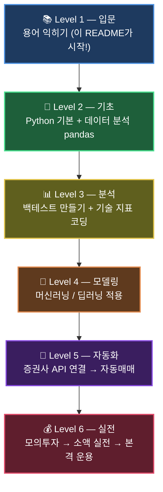

# Day 099 — 최종 프로젝트 발표 및 총정리

> **모듈 12: 나만의 투자 인디케이터 개발 및 성과 검증 프로젝트** | 15/15일차 | 📡 | 학습시간: 8시간


---

> 📺 **YouTube 강의**: [🎬 퀀트 자동매매 최종 프로젝트 발표](https://www.youtube.com/results?search_query=퀀트+자동매매+최종+프로젝트+파이썬+한국어)

## 오늘 배울 것 (아주 쉽게)

- 전체 커리큘럼 복습 및 핵심 개념 정리
- 나만의 인디케이터 + 자동매매 시스템 최종 발표
- 성과 검증 결과 공유
- 향후 학습 방향 및 커리어 로드맵 논의

---


### 1. 전체 커리큘럼 복습 및 핵심 개념 정리

**쉽게 이해하기**
- **전체 커리큘럼 복습 및 핵심 개념 정리**는 새 이론을 늘리기보다, 지금까지 만든 결과를 구조적으로 정리하는 단계입니다.
- 핵심 개념, 구현 근거, 한계와 개선안까지 1장표로 요약하면 전달력이 높아집니다.

**미니 예시**
```python
# 전체 커리큘럼 복습 및 핵심 개념 정리 미니 예시
checklist = {
    '핵심개념정리': True,
    '전략시연': True,
    '성과지표설명': False
}
done = sum(checklist.values())
print(f'발표 준비 완료율: {done / len(checklist):.0%}')
```

### 2. 나만의 인디케이터 + 자동매매 시스템 최종 발표

**쉽게 이해하기**
- **나만의 인디케이터 + 자동매매 시스템 최종 발표**는 새 이론을 늘리기보다, 지금까지 만든 결과를 구조적으로 정리하는 단계입니다.
- 핵심 개념, 구현 근거, 한계와 개선안까지 1장표로 요약하면 전달력이 높아집니다.

**미니 예시**
```python
# 나만의 인디케이터 + 자동매매 시스템 최종 발표 미니 예시
checklist = {
    '핵심개념정리': True,
    '전략시연': True,
    '성과지표설명': False
}
done = sum(checklist.values())
print(f'발표 준비 완료율: {done / len(checklist):.0%}')
```

### 3. 성과 검증 결과 공유

**쉽게 이해하기**
- **성과 검증 결과 공유** 개념은 `일별 수익률 계산 → 누적 성과 확인 → 리스크 지표 비교`로 이해하면 쉽습니다.
- 먼저 작은 구간에서 계산이 맞는지 검증한 뒤, 전체 기간으로 확장하세요.

**미니 예시**
```python
# 성과 검증 결과 공유 미니 예시
returns = [0.01, -0.02, 0.015, 0.005]
cum = 1.0
for r in returns:
    cum *= (1 + r)
print(f'누적수익률: {(cum - 1):.2%}')
```

### 4. 향후 학습 방향 및 커리어 로드맵 논의

**쉽게 이해하기**
- **향후 학습 방향 및 커리어 로드맵 논의**는 새 이론을 늘리기보다, 지금까지 만든 결과를 구조적으로 정리하는 단계입니다.
- 핵심 개념, 구현 근거, 한계와 개선안까지 1장표로 요약하면 전달력이 높아집니다.

**미니 예시**
```python
# 향후 학습 방향 및 커리어 로드맵 논의 미니 예시
checklist = {
    '핵심개념정리': True,
    '전략시연': True,
    '성과지표설명': False
}
done = sum(checklist.values())
print(f'발표 준비 완료율: {done / len(checklist):.0%}')
```

---

## 해보기 활동

오늘 배운 것을 이용해 아래 활동을 해봐요.

```python
# Day 099 실습 과제
# 1) 샘플 데이터를 준비하고
# 2) 오늘 배운 개념(지표/모델/분석 중 1개 이상)을 적용한 뒤
# 3) 결과를 한 줄 요약으로 출력해보세요.

# 예시 데이터: 일별 종가(가상의 가격 시계열)
data = [100, 103, 101, 106, 108]

# TODO: 아래에 학습 내용을 반영한 코드를 작성하세요.
result = None

print("분석 결과:", result)
```


## 다음 시간 미리보기

🎉 전체 커리큘럼을 완료했습니다! 수고하셨습니다.


---

<!-- merged from Chapter10.md -->

# Chapter 10. 다음 단계 학습 과제

> 💡 **쉽게 이해하기**: 기초 구현을 마친 후 실력을 한 단계 높이기 위한 5가지 심화 과제입니다. 모델 다양화, 비동기 처리, 실데이터 연결 등 실무에 가까운 주제를 단계적으로 도전해 봅니다.

---

### 과제 1: 모델 다양화
- Logistic Regression 대신 SVM/KNN/MLP 추가 (Chapter 11-13 참고)
- 결과 비교표 자동 생성

### 과제 2: 비동기 처리
- 긴 작업(영상 생성/이미지 생성)을 백그라운드 큐로 이동
- 작업 상태 조회 API 설계

### 과제 3: 실데이터 연결
- CSV 업로드 API
- 전처리 파이프라인 저장 및 재사용

### 과제 4: FE 고도화
- 모듈별 상태 관리
- 그래프 대시보드 (Chart.js / Plotly)
- 사용자 실험 기록 저장(localStorage 또는 DB)

### 과제 5: NLP 심화 (Chapter 14 참고)
- HuggingFace BERT 파인튜닝
- 다중 레이블 분류

학습 목표는 "스크립트 실행"을 넘어 "서비스 운영 가능한 형태"로 발전하는 것입니다.

---

## 📺 참고 유튜브 영상

| 기술 스택 | 채널 | 링크 |
|---------|------|------|
| Python 비동기 처리 (asyncio) | Tech With Tim | [Python Asyncio, Await, Async](https://www.youtube.com/watch?v=t5Bo1Je9EmE) |
| Chart.js 대시보드 | Chart.js 공식 | [Getting Started with Chart.js](https://www.youtube.com/watch?v=sE08f4iuOhA) |
| HuggingFace BERT 파인튜닝 | HuggingFace | [Fine-tuning a Pretrained Model](https://www.youtube.com/watch?v=GSt00_-0ncQ) |
| CSV 데이터 전처리 | Keith Galli | [Pandas Data Cleaning](https://www.youtube.com/watch?v=bDhvCp3_lYw) |


---

<!-- merged from Chapter21.md -->

# Chapter 21. 퀀트 마스터 로드맵 — Python 실전 코드

> 💡 **이 챕터는**: 퀀트 투자 Python 실습을 초급 → 중급 → 고급 단계로 체계적으로 안내합니다.
> 용어·개념 참조는 Chapter 20을, 4단계 실전 로드맵은 Chapter 16을 함께 보세요.

---

## 🎓 마무리: 퀀트 마스터 로드맵



---

## 🟢 초급 (Beginner) — Python으로 금융 데이터 다루기

> 목표: 코드 한 줄로 주가를 가져오고, 정리하고, 시각화하는 능력 확보

### 1단계. Python 기초

```python
# 자료형과 리스트 — 주가 데이터 표현의 기초
prices = [68000, 69500, 71000, 70200, 72300]   # 삼성전자 5일 종가
returns = [(prices[i] - prices[i-1]) / prices[i-1] for i in range(1, len(prices))]
print(f"일별 수익률: {[f'{r:.2%}' for r in returns]}")

# 딕셔너리 — OHLCV 표현
ohlcv = {"Open": 68500, "High": 71200, "Low": 67800, "Close": 70200, "Volume": 12_345_678}
print(f"당일 변동폭: {ohlcv['High'] - ohlcv['Low']:,}원")
```

### 2단계. 금융 데이터 가져오기

#### Yahoo Finance (yfinance)

```python
# pip install yfinance
import yfinance as yf
import pandas as pd

# 미국 주식 (SPY, QQQ, AAPL 등)
spy = yf.download("SPY", start="2020-01-01", end="2024-12-31")
print(spy.tail())
print(f"SPY 현재가: ${spy['Close'].iloc[-1]:.2f}")

# 한국 주식 (티커 뒤에 .KS 또는 .KQ 붙이기)
samsung = yf.download("005930.KS", start="2023-01-01")
print(f"삼성전자 현재가: {samsung['Close'].iloc[-1]:,.0f}원")

# 여러 종목 동시 다운로드
tickers = ["AAPL", "MSFT", "QQQ", "SPY"]
data = yf.download(tickers, start="2022-01-01")["Close"]
print(data.tail())
```

#### 한국 증권 데이터 (FinanceDataReader)

```python
# pip install finance-datareader
import FinanceDataReader as fdr

# 코스피 전 종목 목록
kospi = fdr.StockListing('KOSPI')
print(kospi.head())

# 삼성전자 (005930)
df = fdr.DataReader('005930', '2020-01-01')
print(df.tail())

# 코스피 지수
kospi_idx = fdr.DataReader('KS11', '2020-01-01')
```

#### 한국투자증권 KIS API (실전 자동매매용)

```python
# pip install mojito2
import mojito

# KIS API 연결 (키 발급: https://apiportal.koreainvestment.com)
broker = mojito.KoreaInvestment(
    api_key    = "YOUR_API_KEY",
    api_secret = "YOUR_API_SECRET",
    acc_no     = "12345678-01",
    mock=True,   # True=모의투자, False=실전
)
balance = broker.fetch_balance()
print(balance)
```

### 3단계. 데이터 정리 (pandas)

```python
import yfinance as yf
import pandas as pd
import numpy as np

df = yf.download("QQQ", start="2020-01-01")

# 결측치 처리
df = df.dropna()                            # NaN 행 제거
df = df.fillna(method="ffill")             # 앞값으로 채우기

# 수익률 계산
df["Daily_Return"]  = df["Close"].pct_change()              # 일별 수익률
df["Log_Return"]    = np.log(df["Close"] / df["Close"].shift(1))  # 로그 수익률
df["Cum_Return"]    = (1 + df["Daily_Return"]).cumprod() - 1      # 누적 수익률

# 이동평균 추가
df["MA20"]  = df["Close"].rolling(20).mean()
df["MA60"]  = df["Close"].rolling(60).mean()
df["MA120"] = df["Close"].rolling(120).mean()

# 연간 통계
annual_ret = df["Daily_Return"].mean() * 252
annual_vol = df["Daily_Return"].std()  * np.sqrt(252)
print(f"QQQ 연간 수익률: {annual_ret:.2%}")
print(f"QQQ 연간 변동성: {annual_vol:.2%}")

# 특정 기간 필터링
df_2023 = df.loc["2023-01-01":"2023-12-31"]
print(f"2023년 수익률: {df_2023['Cum_Return'].iloc[-1]:.2%}")
```

**초급 체크리스트:**
```
[ ] yfinance로 SPY, QQQ 데이터 다운로드
[ ] pandas DataFrame에서 Close 가격 추출
[ ] 일별 수익률 계산 (pct_change)
[ ] 이동평균선 추가 (rolling.mean)
[ ] matplotlib으로 주가 차트 그리기
```

---

## 🟡 중급 (Intermediate) — 기술적 지표 & 백테스트 & 자동매매

> 목표: 전략을 코드로 구현하고, 과거 데이터로 성과를 검증하며, 자동으로 주문까지 연결

### 1단계. 기술적 지표 구현

```python
import yfinance as yf
import numpy as np
import pandas as pd

df = yf.download("QQQ", start="2019-01-01")
close = df["Close"]

# ── RSI (Relative Strength Index) ─────────────────────────────
def calc_rsi(series: pd.Series, period: int = 14) -> pd.Series:
    delta = series.diff()
    gain  = delta.clip(lower=0).rolling(period).mean()
    loss  = (-delta.clip(upper=0)).rolling(period).mean()
    rs    = gain / loss
    return 100 - (100 / (1 + rs))

df["RSI"] = calc_rsi(close)

# ── 볼린저 밴드 (Bollinger Bands) ─────────────────────────────
def calc_bollinger(series: pd.Series, period: int = 20, std: float = 2.0):
    mid  = series.rolling(period).mean()
    band = series.rolling(period).std() * std
    return mid, mid + band, mid - band

df["BB_mid"], df["BB_up"], df["BB_dn"] = calc_bollinger(close)

# ── MACD ──────────────────────────────────────────────────────
def calc_macd(series: pd.Series, fast=12, slow=26, signal=9):
    ema_fast   = series.ewm(span=fast,   adjust=False).mean()
    ema_slow   = series.ewm(span=slow,   adjust=False).mean()
    macd_line  = ema_fast - ema_slow
    signal_line = macd_line.ewm(span=signal, adjust=False).mean()
    histogram  = macd_line - signal_line
    return macd_line, signal_line, histogram

df["MACD"], df["MACD_sig"], df["MACD_hist"] = calc_macd(close)

# ── ATR (Average True Range) — 변동성 지표 ───────────────────
def calc_atr(df_: pd.DataFrame, period: int = 14) -> pd.Series:
    hl  = df_["High"] - df_["Low"]
    hcp = (df_["High"] - df_["Close"].shift(1)).abs()
    lcp = (df_["Low"]  - df_["Close"].shift(1)).abs()
    tr  = pd.concat([hl, hcp, lcp], axis=1).max(axis=1)
    return tr.rolling(period).mean()

df["ATR"] = calc_atr(df)

print(df[["Close", "RSI", "BB_mid", "BB_up", "BB_dn", "MACD", "ATR"]].tail())
```

### 2단계. 백테스트 (전략 검증)

```python
import yfinance as yf
import numpy as np
import pandas as pd

df = yf.download("SPY", start="2015-01-01")
close = df["Close"].squeeze()

# ── 이동평균 크로스오버 전략 ──────────────────────────────────
fast, slow = 5, 20
df["MA_fast"] = close.rolling(fast).mean()
df["MA_slow"] = close.rolling(slow).mean()

# 포지션: 골든크로스=1, 데드크로스=0
df["Signal"]   = (df["MA_fast"] > df["MA_slow"]).astype(int)
df["Position"] = df["Signal"].shift(1)         # 다음날 진입 (미래 데이터 방지)

df["Ret"]          = close.pct_change()
df["Strategy_Ret"] = df["Position"] * df["Ret"]
df["BH_Ret"]       = df["Ret"]                 # Buy & Hold 벤치마크

# ── 성과 지표 계산 ────────────────────────────────────────────
def sharpe(rets, rf=0.03):
    excess = rets - rf / 252
    return float(excess.mean() / excess.std() * np.sqrt(252))

def mdd(rets):
    cum = (1 + rets).cumprod()
    return float((cum / cum.cummax() - 1).min())

def cagr(rets):
    cum = (1 + rets).cumprod()
    n   = len(rets) / 252
    return float(cum.iloc[-1] ** (1 / n) - 1)

strategy = df["Strategy_Ret"].dropna()
bh       = df["BH_Ret"].dropna()

print("=" * 40)
print(f"{'지표':16s} {'전략':>10s} {'Buy&Hold':>10s}")
print("-" * 40)
print(f"{'CAGR':16s} {cagr(strategy):>10.2%} {cagr(bh):>10.2%}")
print(f"{'Sharpe':16s} {sharpe(strategy):>10.2f} {sharpe(bh):>10.2f}")
print(f"{'MDD':16s} {mdd(strategy):>10.2%} {mdd(bh):>10.2%}")
print(f"{'총수익률':16s} {(1+strategy).prod()-1:>10.2%} {(1+bh).prod()-1:>10.2%}")
print("=" * 40)

# 합격 기준 체크
print(f"\n✅ Sharpe > 1.0: {'합격' if sharpe(strategy) > 1.0 else '미달'}")
print(f"✅ MDD > -15%:  {'합격' if mdd(strategy) > -0.15 else '미달'}")
```

### 3단계. 간단한 자동매매 로직

```python
# 실전 자동매매 골격 (KIS API / 키움 API 연결 가능)
import time
import datetime
import yfinance as yf
import numpy as np

def get_price(ticker: str) -> float:
    """현재가 조회 (실무: 증권사 API로 교체)"""
    data = yf.download(ticker, period="5d", progress=False)
    return float(data["Close"].iloc[-1])

def calc_rsi(prices, period=14) -> float:
    """RSI 계산"""
    delta = np.diff(prices)
    gain  = np.where(delta > 0, delta, 0).mean()
    loss  = np.where(delta < 0, -delta, 0).mean()
    rs    = gain / loss if loss > 0 else 1e9
    return 100 - 100 / (1 + rs)

def should_buy(ticker: str) -> bool:
    """매수 조건: RSI < 30 (과매도 구간)"""
    data   = yf.download(ticker, period="30d", progress=False)
    closes = data["Close"].values.flatten()
    rsi    = calc_rsi(closes)
    print(f"  {ticker} RSI: {rsi:.1f}")
    return rsi < 30

def execute_order(ticker: str, action: str, qty: int):
    """주문 실행 (실무: broker.create_market_buy_order 등으로 교체)"""
    print(f"[{datetime.datetime.now():%H:%M:%S}] {action.upper()} {ticker} {qty}주 @ ${get_price(ticker):.2f}")
    # broker.create_market_buy_order(ticker, qty)   # 실제 주문 라인

def run_strategy(tickers=("SPY", "QQQ"), capital=10000, risk_pct=0.01):
    """전략 실행 루프"""
    print("🤖 자동매매 시작 (Ctrl+C로 종료)")
    while True:
        for ticker in tickers:
            try:
                price = get_price(ticker)
                qty   = max(1, int(capital * risk_pct / price))
                if should_buy(ticker):
                    execute_order(ticker, "buy", qty)
            except Exception as e:
                print(f"  오류: {e}")
        print(f"  ⏳ 60초 대기...")
        time.sleep(60)   # 1분마다 체크

# run_strategy()   # 실행 시 주석 해제
print("자동매매 로직 정의 완료 — run_strategy() 호출로 시작")
```

**중급 체크리스트:**
```
[ ] RSI, 볼린저 밴드, MACD를 직접 pandas로 구현
[ ] 이동평균 크로스오버 전략 백테스트 실행 (Backtest.py 참고)
[ ] Sharpe Ratio & MDD 계산 함수 작성
[ ] 전략 vs Buy&Hold 누적 수익률 비교 차트
[ ] yfinance로 실시간 가격 조회 → 조건 판단 → 주문 골격 구현
```

---

## 🔴 고급 (Advanced) — ML 모델 & 전략 최적화 & 리스크 관리

> 목표: 머신러닝으로 예측 모델을 만들고, 포트폴리오 전체를 최적화·관리

### 1단계. 머신러닝 모델 적용

```python
import yfinance as yf
import numpy as np
import pandas as pd
from sklearn.ensemble import RandomForestClassifier
from sklearn.model_selection import TimeSeriesSplit
from sklearn.metrics import accuracy_score, classification_report
from sklearn.preprocessing import StandardScaler

# ── 피처 엔지니어링 ────────────────────────────────────────────
df = yf.download("QQQ", start="2015-01-01")
close = df["Close"].squeeze()

features = pd.DataFrame(index=df.index)
features["ret_1"]  = close.pct_change(1)
features["ret_5"]  = close.pct_change(5)
features["ret_20"] = close.pct_change(20)
features["ma_ratio_5_20"]  = close.rolling(5).mean()  / close.rolling(20).mean()
features["ma_ratio_20_60"] = close.rolling(20).mean() / close.rolling(60).mean()
delta = close.diff()
gain  = delta.clip(lower=0).rolling(14).mean()
loss  = (-delta.clip(upper=0)).rolling(14).mean()
features["rsi_14"] = 100 - 100 / (1 + gain / loss)
features["vol_20"] = close.pct_change().rolling(20).std()

# ── 타깃: 다음날 상승(1) / 하락(0) ───────────────────────────
features["target"] = (close.pct_change().shift(-1) > 0).astype(int)
features = features.dropna()

X = features.drop("target", axis=1)
y = features["target"]

# ── 시계열 교차 검증 (미래 데이터 사용 방지) ─────────────────
tscv = TimeSeriesSplit(n_splits=5)
scaler = StandardScaler()
scores = []

for train_idx, test_idx in tscv.split(X):
    X_train, X_test = X.iloc[train_idx], X.iloc[test_idx]
    y_train, y_test = y.iloc[train_idx], y.iloc[test_idx]

    X_train_s = scaler.fit_transform(X_train)
    X_test_s  = scaler.transform(X_test)

    model = RandomForestClassifier(n_estimators=200, max_depth=5, random_state=42)
    model.fit(X_train_s, y_train)
    scores.append(accuracy_score(y_test, model.predict(X_test_s)))

print(f"시계열 CV 평균 정확도: {np.mean(scores):.2%} ± {np.std(scores):.2%}")

# ── 피처 중요도 ───────────────────────────────────────────────
model.fit(scaler.fit_transform(X), y)
importances = pd.Series(model.feature_importances_, index=X.columns).sort_values(ascending=False)
print("\n피처 중요도:")
print(importances.to_string())
```

### 2단계. 전략 최적화

```python
import numpy as np
from itertools import product

def backtest_ma(prices, fast, slow, risk_free=0.03):
    """단순 MA 크로스오버 백테스트 → Sharpe 반환"""
    prices = np.asarray(prices)
    ma_f = np.convolve(prices, np.ones(fast)/fast, mode="valid")
    ma_s = np.convolve(prices, np.ones(slow)/slow, mode="valid")
    n    = min(len(ma_f), len(ma_s))
    ma_f, ma_s = ma_f[-n:], ma_s[-n:]
    pos  = (ma_f > ma_s).astype(float)
    rets = np.diff(prices[-(n+1):]) / prices[-(n+1):-1]
    pos  = pos[:-1]
    strat_ret = pos * rets
    excess    = strat_ret - risk_free / 252
    if excess.std() < 1e-9:
        return -99
    return float(excess.mean() / excess.std() * np.sqrt(252))

# 파라미터 그리드 서치
import yfinance as yf
prices = yf.download("SPY", start="2015-01-01")["Close"].dropna().values.flatten()

fast_range = range(3, 21, 2)
slow_range = range(10, 61, 5)

best_sharpe, best_params = -99, (5, 20)
results = []

for fast, slow in product(fast_range, slow_range):
    if fast >= slow:
        continue
    s = backtest_ma(prices, fast, slow)
    results.append((fast, slow, s))
    if s > best_sharpe:
        best_sharpe, best_params = s, (fast, slow)

print(f"최적 파라미터: MA{best_params[0]}/MA{best_params[1]}  Sharpe={best_sharpe:.2f}")
top5 = sorted(results, key=lambda x: x[2], reverse=True)[:5]
print("\nTop 5 파라미터 조합:")
for f, s, sh in top5:
    print(f"  MA{f:2d}/MA{s:2d}  Sharpe={sh:.2f}")
```

### 3단계. 리스크 관리

```python
import numpy as np
import pandas as pd
import yfinance as yf

# ── 포트폴리오 리스크 지표 ────────────────────────────────────
tickers  = ["SPY", "QQQ", "GLD", "TLT"]   # 주식·기술주·금·채권
data     = yf.download(tickers, start="2020-01-01")["Close"].dropna()
rets     = data.pct_change().dropna()

# 균등 가중치
weights = np.ones(len(tickers)) / len(tickers)
cov_ann = rets.cov() * 252

port_vol  = float(np.sqrt(weights @ cov_ann.values @ weights))
port_ret  = float(rets.mean().values @ weights * 252)
port_sharpe = (port_ret - 0.03) / port_vol

print(f"포트폴리오 연간 수익률: {port_ret:.2%}")
print(f"포트폴리오 연간 변동성: {port_vol:.2%}")
print(f"포트폴리오 Sharpe     : {port_sharpe:.2f}")

# ── VaR / CVaR ────────────────────────────────────────────────
port_daily = rets @ weights
confidence = 0.95
var_95  = float(np.percentile(port_daily, (1 - confidence) * 100))
cvar_95 = float(port_daily[port_daily <= var_95].mean())
capital = 100_000_000   # 1억원

print(f"\n1억원 포트폴리오 기준:")
print(f"  일별 VaR  (95%): {var_95:.2%}  → 손실 한도 {var_95*capital:,.0f}원")
print(f"  일별 CVaR (95%): {cvar_95:.2%}  → 최악 기대손실 {cvar_95*capital:,.0f}원")

# ── 포지션 사이징 (1% 리스크 룰) ─────────────────────────────
def kelly_fraction(win_rate, profit_ratio):
    """켈리 공식: 최적 베팅 비율"""
    q = 1 - win_rate
    return win_rate - q / profit_ratio

win_rate     = 0.55
profit_ratio = 1.5   # 평균 수익 / 평균 손실

kelly = kelly_fraction(win_rate, profit_ratio)
half_kelly = kelly / 2   # 실전에서는 Half Kelly 권장

print(f"\n켈리 공식 포지션 사이징:")
print(f"  승률={win_rate:.0%}, 손익비={profit_ratio}")
print(f"  Full Kelly: {kelly:.1%}")
print(f"  Half Kelly: {half_kelly:.1%}  ← 실전 권장")
print(f"  1억 기준 투자금: {half_kelly*capital:,.0f}원")
```

**고급 체크리스트:**
```
[ ] 기술 지표를 ML 피처로 변환 (RSI, MA비율, 변동성)
[ ] TimeSeriesSplit으로 과거→미래 누수 없이 교차검증
[ ] RandomForest 피처 중요도로 유효 지표 선별
[ ] 파라미터 그리드 서치로 최적 MA 조합 탐색
[ ] VaR / CVaR 계산 및 포지션 사이징 (RiskManager.py 참고)
[ ] 켈리 공식으로 최적 베팅 비율 계산
[ ] PortfolioOptimizer.py 실행 → 효율적 프론티어 확인
```

---

## ⚠️ 투자 시 꼭 기억할 3가지

1. **🚫 과거 ≠ 미래**
   백테스트가 좋아도 실전에서 다를 수 있어요.

2. **💸 잃어도 되는 돈으로만**
   투자는 절대 빚내서 하지 마세요!

3. **📚 평생 공부**
   시장은 계속 변해요. 전략도 계속 업데이트해야 해요.

---

> 💡 **이 문서는 학습용이며, 특정 투자 추천이 아닙니다.**
> 💡 **모든 투자의 책임은 본인에게 있습니다.**

---

**📅 작성일**: 2026년 5월
**📝 버전**: 1.0
**🎯 목적**: 퀀트 투자 입문자를 위한 용어 정리집

---

## 📺 YouTube 강의 검색

> [🎬 퀀트 마스터 로드맵 Python 실전 코드 관련 한국어 강의 검색](https://www.youtube.com/results?search_query=퀀트+파이썬+자동매매+백테스트+주식+한국어+강의)
