# [가이드] 금융 및 IT/데이터 관련 주요 자격증 정리

이미지에 언급된 **금융권 취업 및 디지털 역량 강화**를 위한 필수 자격증 요약 정보입니다.

---

## 1. 금융 관련 자격증
금융 실무 지식과 경제 흐름을 이해하고 있음을 증명하는 자격증입니다.

* **투자자산운용사 (펀드매니저):** 집합투자재산, 신탁재산 등을 운용하기 위해 필수적인 자격증입니다.
* **신용분석사 (CCA):** 기업의 회계 및 재무 자료를 분석하여 신용 상태를 판단하는 능력을 평가합니다.
* **AFPK / CFP:** 개인 재무설계 서비스 제공을 위한 전문 자격증으로 금융권 영업/자산관리 직군에서 선호합니다.

---

## 2. IT/데이터 관련 자격증
데이터 분석 역량과 디지털 문해력을 평가하며, 최근 금융권에서 가장 우대하는 분야입니다.

### 📊 ADsP (데이터분석 준전문가)
> 📺 **YouTube 강의**: [🎬 ADsP 시험 합격 전략](https://www.youtube.com/results?search_query=ADsP+데이터분석+준전문가+시험+한국어+강의)
* **특징:** 데이터 분석 기획과 데이터 분석 실무의 기초를 다루는 자격증입니다.
* **대상:** 데이터 분석 입문자 및 비전공자.
* **장점:** 시험 문항이 객관식(일부 단답형) 위주라 비교적 짧은 기간 내에 취득이 가능합니다.

### 🏆 ADP (데이터분석 전문가)
> 📺 **YouTube 강의**: [🎬 ADP 데이터분석 전문가 강의](https://www.youtube.com/results?search_query=ADP+데이터분석+전문가+시험+한국어+강의)
* **특징:** ADsP의 상위 등급으로, 데이터 분석 전문가로서의 고도화된 실무 능력을 증명합니다.
* **대상:** 실무 경력자 또는 전문적인 분석 능력을 갖춘 자.
* **장점:** 필기뿐만 아니라 **실기 시험**을 포함하고 있어, 취득 시 데이터 분석 분야에서 확실한 전문성을 인정받습니다.

---

## 💡 취업 전략 가이드

| 구분 | 추천 대상 | 비고 |
| :--- | :--- | :--- |
| **전통 금융 직군** | 금융 자격증 + ADsP | 디지털 역량을 갖춘 금융인 강조 |
| **디지털/IT 직군** | ADP + 금융 자격증 기초 | 금융 도메인 지식을 갖춘 IT 전문가 강조 |

> **Tip:** 최근 금융권 채용 트렌드는 '금융 지식'과 '데이터 분석력'의 **융합**입니다. 비전공자라면 상대적으로 접근이 쉬운 **ADsP**부터 시작하는 것을 추천합니다.

## 📖 목차

- [1. 투자 분석 4대 방법](#1-투자-분석-4대-방법)
- [2. 거시경제 용어](#2-거시경제-용어)
- [3. 재무제표 용어](#3-재무제표-용어)
- [4. 기업 가치 평가 용어](#4-기업-가치-평가-용어)
- [5. 기술적 분석 용어](#5-기술적-분석-용어)
- [6. 금융 상품 용어](#6-금융-상품-용어)
- [7. 자산 배분 용어](#7-자산-배분-용어)
- [8. 백테스트 & 성과 지표](#8-백테스트--성과-지표)
- [9. AI / 머신러닝 용어](#9-ai--머신러닝-용어)
- [10. 자동매매 & 개발 도구](#10-자동매매--개발-도구)
- [RAG 확장 사전: 금융공학·재무·회계·주식·자산운용 (초등 이해)](./RAG_finance_kids_glossary.md)

---

## 🧮 퀀트 투자(Quant Investment)란?

> 📺 **YouTube 강의**: [🎬 퀀트 투자 입문 — 수학으로 돈 버는 방법](https://www.youtube.com/results?search_query=퀀트투자+입문+수학+통계+한국어+설명)

**📌 한 줄 정의**: **수학 + 통계 + 컴퓨터**를 활용해 감정을 배제하고 데이터로만 투자하는 방식

**🎯 쉬운 비유**: "느낌"이 아닌 "공식"으로 주식을 사고파는 것.  
프로 바둑 기사가 경험으로 두는 수 대신, AI가 수백만 경우의 수를 계산해서 두는 것과 같습니다.

### 퀀트 투자의 3대 특징

| 특징 | 일반 투자 | 퀀트 투자 |
|------|-----------|-----------|
| **감정 배제** | 공포·탐욕에 흔들림 | 알고리즘이 규칙대로 실행 |
| **데이터 기반** | 뉴스·감에 의존 | 수십 년 데이터 분석 |
| **규칙 기반 매매** | 즉흥적 판단 | 사전 정의된 조건으로만 매매 |

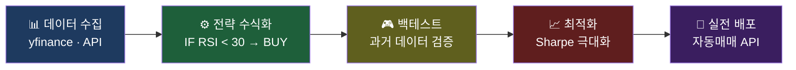

---

### 🌟 유명 퀀트 투자자 — Jim Simons (짐 사이먼스)

> 📺 **YouTube 강의**: [🎬 Jim Simons 르네상스 테크놀로지 퀀트 투자](https://www.youtube.com/results?search_query=Jim+Simons+르네상스+테크놀로지+퀀트투자+한국어)

**짐 사이먼스(James Harris Simons, 1938–2024)**는 수학자·암호학자 출신의 헤지펀드 매니저로,  
세계 최고 수준의 퀀트 투자자로 평가받습니다.

| 항목 | 내용 |
|------|------|
| 학력 | MIT 수학 학사 → 하버드 수학 박사 |
| 경력 | NSA(미국 국가안보국) 암호 해독 → MIT·스토니브룩 수학과 교수 |
| 설립 | **르네상스 테크놀로지(Renaissance Technologies)**, 1982년 |
| 대표 펀드 | **메달리온 펀드(Medallion Fund)** |

#### 메달리온 펀드 성과 (세계 최고 기록)

| 기간 | 연평균 수익률(수수료 차감 전) | 연평균 수익률(수수료 차감 후) |
|------|--------------------------|--------------------------|
| 1988~2018 (30년) | **약 66%** | **약 39%** |

- 같은 기간 워렌 버핏(버크셔 해서웨이)의 연평균: **약 20%**
- S&P 500 연평균: **약 10%**

> 💡 **1만 달러를 1988년에 투자했다면?**  
> → 30년 후 **약 420억 달러** (수수료 차감 전 기준)

#### 짐 사이먼스의 퀀트 철학

1. **수학·통계 기반**: 인간의 직관이나 뉴스가 아닌 **순수 데이터 패턴**으로 거래
2. **비밀주의**: 전략을 철저히 비공개. 금융권 출신이 아닌 **수학자·물리학자·언어학자** 채용
3. **단기 패턴 포착**: 주로 **단기(수분~수일)의 통계적 패턴** 을 자동화 매매로 착취
4. **리스크 분산**: 수천 개의 작은 포지션으로 단일 종목 리스크 최소화
5. **끊임없는 모델 개선**: 시장이 변하면 모델도 업데이트

#### 퀀트 투자 생태계 주요 인물

| 이름 | 소속 | 특징 |
|------|------|------|
| **Jim Simons** | 르네상스 테크놀로지 | 수학 기반 퀀트의 전설 |
| **Ray Dalio** | 브리지워터 어소시에이츠 | 거시 퀀트, 올웨더 포트폴리오 창시 |
| **David Shaw** | D.E. Shaw | 컴퓨터과학 기반 퀀트 |
| **Cliff Asness** | AQR Capital | 팩터 투자(모멘텀·밸류) 학술화 |
| **Peter Lynch** | 피델리티 마젤란 | 펀더멘털 + 정량 혼합 |

---

## 1. 투자 분석 4대 방법

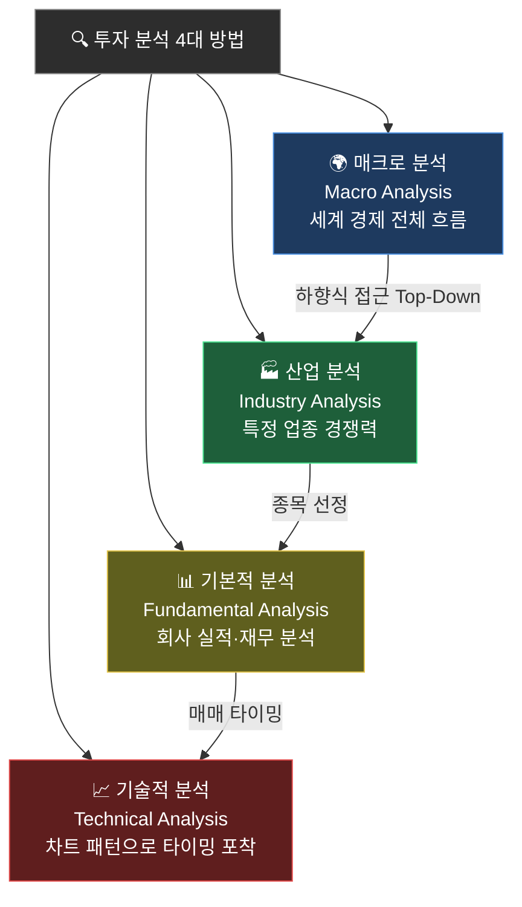

### 🌍 매크로 분석 (Macro Analysis)
> 📺 **YouTube 강의**: [🎬 거시경제 투자 분석 입문](https://www.youtube.com/results?search_query=거시경제+매크로분석+주식투자+한국어+입문)

## https://www.youtube.com/shorts/4t37q4jDpCU

**📌 한 줄 정의**: 세계 경제 전체의 흐름을 보는 분석

**🎯 쉬운 비유**: 비행기 타고 하늘에서 도시 전체를 내려다보는 것

**💡 실제 사례**:
- 2022년 미국이 금리를 올리니까 → 전 세계 주식이 떨어짐
- 2020년 코로나로 돈을 풀자 → 주식이 1년간 50% 상승

---

### 🏭 산업 분석 (Industry Analysis)
> 📺 **YouTube 강의**: [🎬 산업 분석 섹터 투자 전략](https://www.youtube.com/results?search_query=산업분석+섹터분석+주식투자+한국어)

**📌 한 줄 정의**: 특정 업종(반도체, 자동차 등)의 경쟁력을 분석

**🎯 쉬운 비유**: 어떤 동네 가게가 잘 될지 동네별로 비교하는 것

**💡 실제 사례**:
- 2023년 ChatGPT 등장 → AI 반도체 산업(엔비디아 등) 폭등
- 2020년 코로나 → 배달 산업(배달의민족, 쿠팡) 급성장

---

### 📊 기본적 분석 (Fundamental Analysis)
> 📺 **YouTube 강의**: [🎬 기본적 분석 펀더멘털 투자](https://www.youtube.com/results?search_query=기본적분석+펀더멘털+주식투자+한국어)

**📌 한 줄 정의**: 회사의 진짜 실력(매출, 이익 등)을 보는 분석

**🎯 쉬운 비유**: 친구의 시험 성적표를 보고 진짜 공부 잘하는지 확인하는 것

**💡 실제 사례**:
- 워렌 버핏 할아버지가 쓰는 방법 (세계 최고 부자 투자자)
- "이 회사 1년에 1000억 버는데 시가총액이 5000억밖에 안 되네? 싸다!" 하고 사는 방식

---

### 📈 기술적 분석 (Technical Analysis)
> 📺 **YouTube 강의**: [🎬 기술적 분석 차트 패턴 기초](https://www.youtube.com/results?search_query=기술적분석+차트분석+주식+한국어+입문)

**📌 한 줄 정의**: 차트 모양과 패턴으로 미래 가격 예측

**🎯 쉬운 비유**: 날씨 구름 모양 보고 비 올지 안 올지 맞추는 것

**💡 실제 사례**:
- "어? 이 패턴 작년에도 나왔는데 그때 30% 올랐어!" 하고 매수
- 단기 트레이더(데이트레이더)들이 많이 사용

---

## 2. 거시경제 용어

### 💰 금리 (Interest Rate)
> 📺 **YouTube 강의**: [🎬 금리와 주식시장 관계 설명](https://www.youtube.com/results?search_query=금리+주식시장+영향+한국어+설명)

**📌 한 줄 정의**: 돈을 빌리거나 맡길 때의 이자율

**🎯 쉬운 비유**: 친구한테 1만원 빌려주고 "한 달 뒤에 1만 100원 줘"라고 할 때 그 100원

**💡 실제 사례**:
- 2021년 한국 기준금리: 0.5% (역대 최저) → 사람들이 빚내서 집/주식 삼
- 2023년 한국 기준금리: 3.5% → 빚 갚기 부담돼서 부동산 하락

**⚖️ 주식과의 관계**:
- 금리 ⬆️ → 주식 ⬇️ (예금이 더 매력적)
- 금리 ⬇️ → 주식 ⬆️ (예금 이자 적으니 주식으로)

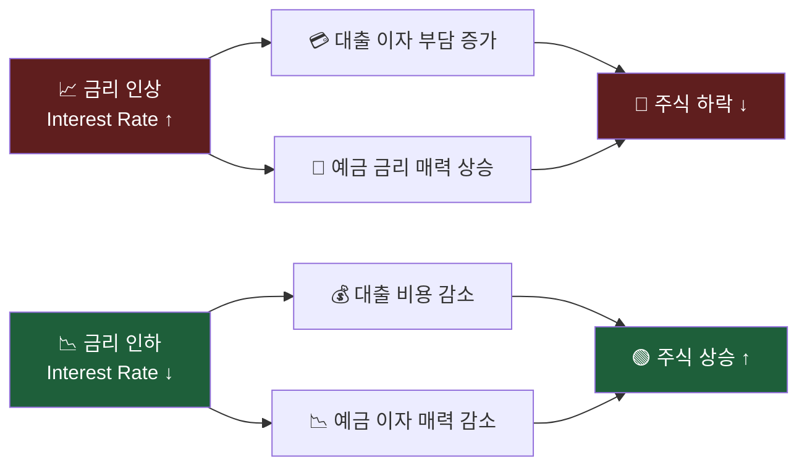

---

### 🛒 물가 (Inflation)
> 📺 **YouTube 강의**: [🎬 인플레이션 물가상승 쉬운 설명](https://www.youtube.com/results?search_query=인플레이션+물가상승+주식투자+한국어)

**📌 한 줄 정의**: 물건값이 오르는 정도

**🎯 쉬운 비유**: 작년에 1000원이던 새우깡이 올해 1500원이 된 것

**💡 실제 사례**:
- 2022년 미국 물가상승률 9.1% (40년 만에 최고)
- 짜장면이 5년 전 5000원 → 현재 7000원

---

### ⛽ 유가 (Oil Price)
> 📺 **YouTube 강의**: [🎬 유가와 경제 주식 관계](https://www.youtube.com/results?search_query=유가+원유+경제+주식+한국어+설명)

**📌 한 줄 정의**: 원유(기름) 가격

**🎯 쉬운 비유**: 모든 물건의 운송비를 결정하는 도미노 첫 조각

**💡 실제 사례**:
- 2022년 러시아-우크라이나 전쟁 → 유가 급등 → 전 세계 물가 폭등
- 유가 오르면: 항공사 ⬇️, 정유사 ⬆️

---

## 3. 재무제표 용어

### 📒 재무제표 (Financial Statements)
> 📺 **YouTube 강의**: [🎬 재무제표 읽는 법 기초](https://www.youtube.com/results?search_query=재무제표+읽는법+주식투자+한국어+기초)

**📌 한 줄 정의**: 회사의 가계부 3종 세트

**🎯 쉬운 비유**: 회사의 건강검진표

---

# 📑 재무제표 핵심 용어 및 흐름 총정리

## 1. 손익계산서의 핵심 구조
기업의 성적표인 손익계산서는 매출에서 여러 비용을 차감하며 '최종 수익'을 찾아가는 과정입니다.

| 항목 | 한글 명칭 | 의미 | 계산 공식 |
| :--- | :--- | :--- | :--- |
| **Revenue** | **매출액** | 상품/서비스를 팔고 받은 **전체 금액** (총수입) | - |
| **Operating Income** | **영업이익** | **본업** 장사를 통해 순수하게 남긴 이익 | 매출액 - 매출원가 - 판관비 |
| **Net Income** | **당기순이익** | 세금, 이자 등 **모든 비용을 뺀 최종 이익** | 영업이익 + 영업외손익 - 법인세 |

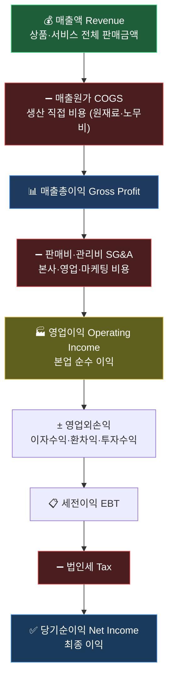

---

## 2. 영업이익 vs 당기순이익 비교

### **보통 어디가 더 큰가요?**
일반적으로 **영업이익 > 당기순이익**입니다. 영업이익에서 국가에 내는 세금(법인세)과 은행 이자(영업외비용)를 추가로 빼야 하기 때문입니다.

### **당기순이익이 더 큰 예외적인 경우**
본업보다 **본업 외 수익(영업외수익)**이 더 클 때 발생합니다.
* **자산매각이익:** 회사가 가진 땅이나 건물을 비싸게 팔았을 때
* **투자수익:** 보유한 주식이나 투자 자산에서 큰 이익이 났을 때
* **💡 주의:** 이 경우 당기순이익이 높아 보여도 기업의 기초 체력(본업)이 좋다고 단정할 수 없습니다.

---

## 3. 기업의 주식 투자 수익 처리
기업이 남는 돈으로 주식 투자를 해서 돈을 벌었을 때의 회계 처리 방식입니다.

* **분류:** 일반 기업의 경우 **'영업외수익'** 항목에 들어갑니다.
* **영업이익과의 관계:** 본업이 아니기 때문에 영업이익에는 포함되지 않습니다.
* **당기순이익과의 관계:** 최종 합계 과정에서 반영되어 당기순이익을 증가시킵니다.
* **예외:** 증권사나 자산운용사처럼 **투자가 본업인 회사**는 주식 수익이 **'영업이익'**으로 잡힙니다.

---

## 4. 인건비(직원 월급)의 회계상 위치
월급은 직원이 **어디서 어떤 일을 하느냐**에 따라 두 가지 주소로 나뉩니다.

### **① 매출원가 (생산 현장)**
* **대상:** 공장 생산직, 제품 설계 엔지니어, 공장 관리자 등
* **성격:** 제품을 직접 만드는 데 들어가는 필수 비용 (노무비)

### **② 판매비와 관리비 (본사/영업)**
* **대상:** 마케팅, 인사, 회계, 영업사원, 경영진 등
* **성격:** 제품을 팔고 회사를 유지하기 위한 간접 운영 비용 (판관비)

---

## 5. 투자자를 위한 핵심 요약 팁

1. **영업이익률을 확인하세요:** `영업이익 / 매출액`을 계산해보면 이 회사가 본업에서 얼마나 경쟁력이 있는지 알 수 있습니다.
2. **당기순이익의 '질'을 보세요:** 영업이익은 적자인데 당기순이익만 흑자라면 일회성 자산 매각 등을 의심해봐야 합니다.
3. **판관비 추이를 보세요:** 매출은 정체인데 판관비(급여, 마케팅비 등)가 급증한다면 경영 효율성이 떨어지고 있다는 신호입니다.
   
---

### 💵 손익계산서 (Income Statement)
> 📺 **YouTube 강의**: [🎬 손익계산서 읽는 법](https://www.youtube.com/results?search_query=손익계산서+읽는법+한국어+주식투자)

**📌 한 줄 정의**: 얼마 벌고 얼마 썼는지 보여주는 표

**🎯 쉬운 비유**: 한 달 용돈기입장
- 용돈 받음 (매출): 5만원
- 떡볶이 사 먹음 (비용): 2만원
- 남은 돈 (이익): 3만원

**💡 실제 사례**:
- 삼성전자 2023년 매출: 약 258조원
- 그 중 영업이익: 약 6.5조원

---

### 🏦 재무상태표 (Balance Sheet) / 대차대조표
> 📺 **YouTube 강의**: [🎬 재무상태표 대차대조표 쉬운 설명](https://www.youtube.com/results?search_query=재무상태표+대차대조표+한국어+주식)

**📌 한 줄 정의**: 지금 회사가 가진 것 vs 갚아야 할 것

**🎯 쉬운 비유**: 내 저금통 안 (자산) + 친구한테 빌린 돈 (부채)

**💡 구성**:
- **자산** = 가진 것 (현금, 건물, 재고)
- **부채** = 갚을 것 (빚)
- **자본** = 진짜 내 것 (자산 - 부채)

---

### 💸 현금흐름표 (Cash Flow Statement)
> 📺 **YouTube 강의**: [🎬 현금흐름표 쉬운 설명](https://www.youtube.com/results?search_query=현금흐름표+읽는법+한국어+주식투자)

**📌 한 줄 정의**: 실제로 돈이 들어오고 나간 흐름

**🎯 쉬운 비유**: 지갑 CCTV로 돈 움직임 다 찍은 것

**💡 왜 중요해?**
- 손익계산서엔 이익 났다고 나와도 → 현금이 없으면 망함!
- "흑자도산"이라는 말이 여기서 나옴

---

## 4. 기업 가치 평가 용어

### 🔄 밸류에이션 (Valuation)
> 📺 **YouTube 강의**: [🎬 밸류에이션 기업가치 평가 기초](https://www.youtube.com/results?search_query=밸류에이션+기업가치평가+한국어+주식)

**📌 한 줄 정의**: 회사의 적정 가격을 계산하는 것

**🎯 쉬운 비유**: 중고 자전거 살 때 "이거 얼마가 적당하지?" 고민하는 과정

---

### 📊 상대가치평가 (Multiple Valuation)
> 📺 **YouTube 강의**: [🎬 PER PBR PSR 멀티플 평가 설명](https://www.youtube.com/results?search_query=PER+PBR+PSR+주식투자+한국어+설명)

**📌 한 줄 정의**: 비슷한 회사들과 비교해서 가격 정하기

**🎯 쉬운 비유**: "옆집 아파트는 5억에 팔렸으니, 우리집도 5억쯤이겠다"

**💡 대표 멀티플**:
| 지표 | 뜻 | 쉬운 설명 |
|------|------|-----------|
| **PER** | 주가수익비율 | 1년 이익의 몇 배에 거래되나 |
| **PBR** | 주가순자산비율 | 회사 자산 대비 주가가 몇 배인가 |
| **PSR** | 주가매출비율 | 매출 대비 주가가 몇 배인가 |

---
# 주식 투자 가치평가 지표 가이드 (PER, PBR, PSR)

주식 투자 시 기업의 가치를 판단하는 가장 대표적인 세 가지 지표인 **PER, PBR, PSR**에 대해 정리한 가이드입니다.

---

## 1. PER (Price Earning Ratio, 주가수익비율)
> 📺 **YouTube 강의**: [🎬 PER 주가수익비율 쉬운 설명](https://www.youtube.com/results?search_query=PER+주가수익비율+주식투자+한국어+쉬운설명)
**"회사가 벌어들이는 이익에 비해 주가가 몇 배인가?"**

* **공식:** 주가 ÷ 1주당 순이익 (EPS)
* **핵심 의미:** 기업이 현재와 같은 수익을 유지할 때, 투자 원금을 회수하는 데 걸리는 **'기간(년)'**으로도 해석됩니다.
* **특징:**
    * 가장 널리 쓰이는 지표입니다.
    * 보통 PER이 낮으면 '저평가', 높으면 '고평가'라고 하지만, 성장성이 높은 기업은 미래 이익 기대감 때문에 PER이 높게 형성되기도 합니다.

---

## 2. PBR (Price Book-value Ratio, 주가순자산비율)
> 📺 **YouTube 강의**: [🎬 PBR 주가순자산비율 쉬운 설명](https://www.youtube.com/results?search_query=PBR+주가순자산비율+주식투자+한국어+설명)
**"회사가 가진 자산에 비해 주가가 몇 배인가?"**

* **공식:** 주가 ÷ 1주당 순자산 (BPS)
* **핵심 의미:** 기업을 당장 해산했을 때 주주가 돌려받을 수 있는 자산 가치와 주가를 비교한 것입니다.
* **특징:**
    * **PBR 1.0 미만:** 주가가 장부상 가치보다도 낮다는 뜻으로, 극심한 저평가 상태이거나 기업의 수익성에 문제가 있다고 판단합니다.
    * 주로 공장, 토지 등 실물 자산이 많은 제조업이나 금융업 분석에 유용합니다.

---

## 3. PSR (Price Sales Ratio, 주가매출비율)
> 📺 **YouTube 강의**: [🎬 PSR 주가매출비율 성장주 평가](https://www.youtube.com/results?search_query=PSR+주가매출비율+성장주+스타트업+한국어+설명)
**"회사의 매출 규모에 비해 주가가 몇 배인가?"**

* **공식:** 주가 ÷ 1주당 매출액 (SPS)
* **핵심 의미:** 이익이 아직 나지 않는 초기 성장 기업의 가치를 평가할 때 사용합니다.
* **특징:**
    * 이익은 회계 처리 방식에 따라 변동이 클 수 있지만, 매출은 상대적으로 조작이 어렵고 정직한 지표입니다.
    * 적자 상태여도 시장 점유율을 빠르게 넓혀가는 **스타트업이나 성장주**를 평가할 때 필수적입니다.

---

## 💡 한눈에 비교 요약

| 지표 | 국문 명칭 | 기준점 | 주요 질문 |
| :--- | :--- | :--- | :--- |
| **PER** | 주가수익비율 | **이익 (Earnings)** | "돈을 얼마나 잘 버는가?" |
| **PBR** | 주가순자산비율 | **자산 (Book-value)** | "가진 재산이 얼마나 많은가?" |
| **PSR** | 주가매출비율 | **매출 (Sales)** | "물건을 얼마나 많이 파는가?" |

> **투자 팁:** 하나의 지표만 보기보다는 세 지표를 종합적으로 보고, 해당 기업이 속한 산업군(섹터)의 평균치와 비교하는 것이 가장 정확합니다.

---


**💡 실제 사례**:
- 삼성전자 PER 약 15배 = 지금 사면 15년치 이익 만큼 내는 것
- 테슬라 PER 70배 → 비싸지만 미래 성장 기대

---

### 💎 절대가치평가 (Absolute Valuation)
> 📺 **YouTube 강의**: [🎬 DCF 절대가치평가 쉬운 설명](https://www.youtube.com/results?search_query=DCF+할인현금흐름+기업가치평가+한국어)

**📌 한 줄 정의**: 회사가 미래에 벌 돈을 다 합쳐서 가치 계산

**🎯 쉬운 비유**: 사과나무를 살 때 "앞으로 10년간 사과 몇 개 열릴까?"를 계산

#### 🔮 DCF (Discounted Cash Flow) - 할인 현금흐름

**📌 한 줄 정의**: 미래 현금을 현재 가치로 환산

**🎯 쉬운 비유**: "10년 뒤 받을 100만원은 지금 얼마짜리?" 계산
(시간이 지나면 돈 가치가 떨어지니까 깎아서 계산)

#### 💼 EVA (Economic Value Added) - 경제적 부가가치

**📌 한 줄 정의**: 진짜로 만들어낸 가치 (자본 비용 빼고)

**🎯 쉬운 비유**: "1억 투자해서 1천만원 벌었는데, 은행 이자가 5%면 5백만원밖에 진짜 번 게 아니네"

#### 💰 FCF (Free Cash Flow) - 잉여현금흐름

**📌 한 줄 정의**: 회사가 자유롭게 쓸 수 있는 진짜 남는 돈

**🎯 쉬운 비유**: 월급에서 생활비 다 쓰고 남은 진짜 내 용돈

---

## 5. 기술적 분석 용어

### 📈 이동평균선 (Moving Average, MA)
> 📺 **YouTube 강의**: [🎬 이동평균선 골든크로스 데드크로스](https://www.youtube.com/results?search_query=이동평균선+골든크로스+데드크로스+주식+한국어)

**📌 한 줄 정의**: 최근 며칠간 가격의 평균을 선으로 그린 것

**🎯 쉬운 비유**: 최근 5번 시험 점수 평균을 계속 그래프로 그리는 것

**💡 종류**:
- **5일선**: 최근 5일 평균 (단기 흐름)
- **20일선**: 최근 20일 평균 (한 달 흐름)
- **60일선**: 최근 60일 평균 (분기 흐름)
- **120일선**: 최근 120일 평균 (장기 흐름)

**💡 골든크로스 / 데드크로스**:
- 🟢 **골든크로스**: 단기선이 장기선을 위로 뚫음 → 상승 신호
- 🔴 **데드크로스**: 단기선이 장기선을 아래로 뚫음 → 하락 신호

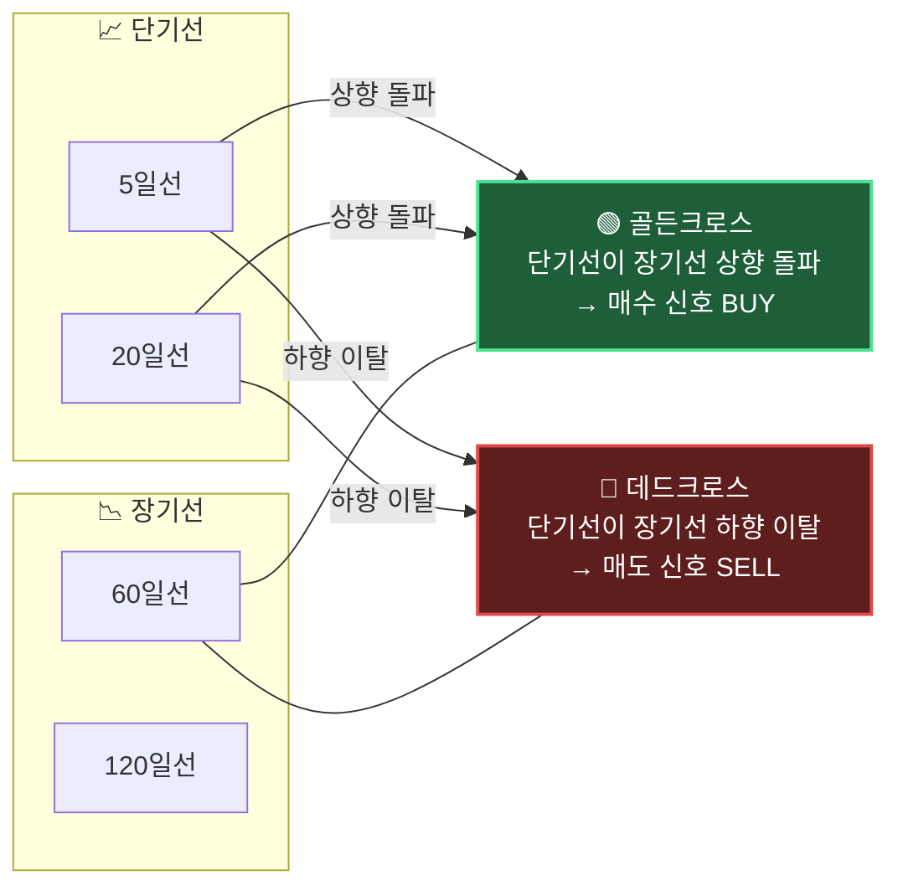

---

### 🚧 지지선 & 저항선 (Support & Resistance)
> 📺 **YouTube 강의**: [🎬 지지선 저항선 기술적 분석](https://www.youtube.com/results?search_query=지지선+저항선+기술적분석+주식+한국어)

**📌 한 줄 정의**:
- **지지선**: 가격이 잘 안 떨어지는 바닥선
- **저항선**: 가격이 잘 못 뚫는 천장선

**🎯 쉬운 비유**: 공이 바닥(지지선)에서 튀고, 천장(저항선)에 부딪혀 다시 떨어지는 것

**💡 실제 사례**:
- 비트코인이 자꾸 6만 달러 근처에서 떨어진다 → 6만 달러가 저항선
- 자꾸 4만 달러에서 튀어 오른다 → 4만 달러가 지지선

---

### 🕯️ 캔들 차트 (Candlestick Chart)
> 📺 **YouTube 강의**: [🎬 캔들차트 읽는 법 양봉 음봉](https://www.youtube.com/results?search_query=캔들차트+읽는법+양봉+음봉+주식+한국어)

**📌 한 줄 정의**: 양초 모양으로 가격 변화를 표현한 차트

**🎯 쉬운 비유**: 하루 가격을 양초 한 개로 그리기

**💡 캔들 읽는 법**:

```mermaid
flowchart TD
    subgraph Bull["🔴 양봉 (Bullish Candle) — 가격 상승"]
        B_HIGH["⬆️ 고가 High (윗꼬리)"]
        B_CLOSE["종가 Close (몸통 상단)"]
        B_OPEN["시가 Open (몸통 하단)"]
        B_LOW["⬇️ 저가 Low (아랫꼬리)"]
        B_HIGH --- B_CLOSE --- B_OPEN --- B_LOW
    end
    subgraph Bear["🔵 음봉 (Bearish Candle) — 가격 하락"]
        S_HIGH["⬆️ 고가 High (윗꼬리)"]
        S_OPEN["시가 Open (몸통 상단)"]
        S_CLOSE["종가 Close (몸통 하단)"]
        S_LOW["⬇️ 저가 Low (아랫꼬리)"]
        S_HIGH --- S_OPEN --- S_CLOSE --- S_LOW
    end
    style Bull fill:#3d0000,color:#fff,stroke:#e24a4a
    style Bear fill:#00003d,color:#fff,stroke:#4a90e2
```

> ⚠️ 한국/일본은 빨강=상승, 미국은 초록=상승 (반대!)

---

### 🌊 엘리어트 파동이론 (Elliott Wave Theory)
> 📺 **YouTube 강의**: [🎬 엘리어트 파동이론 입문 강의](https://www.youtube.com/results?search_query=엘리어트파동이론+주식+기술적분석+한국어)

**📌 한 줄 정의**: 주가는 5번 오르고 3번 내리는 파도 모양으로 움직인다는 이론

**🎯 쉬운 비유**: 바닷가 파도처럼 일정한 리듬이 있다는 생각

**💡 패턴**:

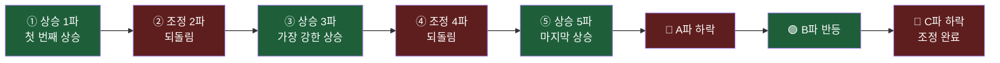

---

### 📉 RSI (Relative Strength Index, 상대강도지수)
> 📺 **YouTube 강의**: [🎬 RSI 상대강도지수 기술적 분석](https://www.youtube.com/results?search_query=RSI+상대강도지수+주식+기술적분석+한국어)

**📌 한 줄 정의**: 주식이 너무 많이 올랐는지/떨어졌는지 알려주는 지표 (0~100)

**🎯 쉬운 비유**: 운동 너무 많이 했나 체크하는 심박수 같은 것

**💡 해석**:
- **RSI > 70**: 과매수 (너무 많이 올랐다, 곧 떨어질 수도) 🔥
- **RSI < 30**: 과매도 (너무 많이 떨어졌다, 곧 오를 수도) 🧊

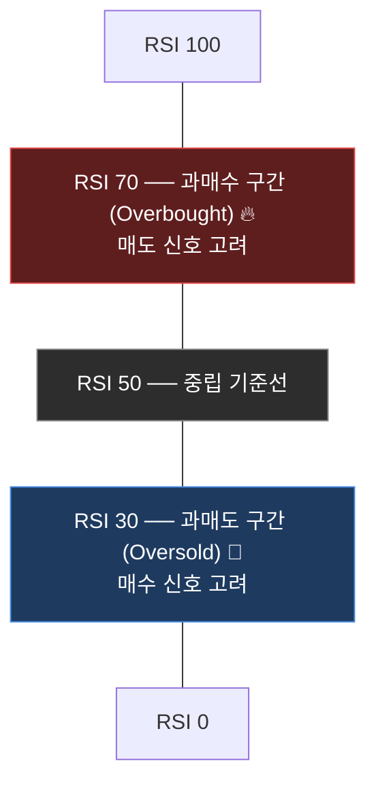

---

## 6. 금융 상품 용어

### 📈 주식 (Stock)
> 📺 **YouTube 강의**: [🎬 주식 투자 기초 입문 강의](https://www.youtube.com/results?search_query=주식투자+기초+한국어+입문+초보)

**📌 한 줄 정의**: 회사의 작은 조각을 사는 것

**🎯 쉬운 비유**: 피자 한 판을 100조각으로 나눠서 1조각 사는 것

**💡 실제 사례**:
- 삼성전자 1주 사면 → 삼성전자의 아주아주 작은 주인이 됨
- 배당금 받을 수 있고, 주가 오르면 팔아서 차익도 가능

---

### 🧺 ETF (Exchange Traded Fund)
> 📺 **YouTube 강의**: [🎬 ETF 투자 쉬운 설명 한국어](https://www.youtube.com/results?search_query=ETF+투자+한국어+설명+입문+코덱스)

**📌 한 줄 정의**: 여러 주식을 한 바구니에 담아서 거래소에서 사고파는 상품

**🎯 쉬운 비유**: 모둠 도시락 (반찬 여러 개 한 번에)

**💡 대표 ETF 한눈에 비교**:

| ETF | 운용사 | 추종 지수 | 특징 |
|-----|--------|-----------|------|
| **SPY** | State Street (SSGA) | S&P 500 | 세계 최대 ETF, 미국 500대 기업 |
| **QQQ** | Invesco | NASDAQ-100 | 빅테크 집중, 고성장·고변동성 |
| **KODEX 200** | 삼성자산운용 | KOSPI 200 | 한국 대표 200개 기업 |
| **TIGER 미국나스닥100** | 미래에셋 | NASDAQ-100 | 국내 상장 QQQ 동등 상품 |

**💡 장점**: 한 회사 망해도 다른 회사들이 있어서 위험 분산!

---

### 📈 SPY — SPDR S&P 500 ETF Trust
> 📺 **YouTube 강의**: [🎬 SPY ETF 완전 분석 한국어](https://www.youtube.com/results?search_query=SPY+ETF+S&P500+투자+한국어+설명)

**📌 한 줄 정의**: 미국 대표 500개 기업 전체에 한 번에 투자하는 세계 최대 ETF

**🎯 쉬운 비유**: 미국 경제 전체를 한 주에 담은 "미국 경제 종합선물세트"

#### 기본 정보

| 항목 | 내용 |
|------|------|
| 공식 명칭 | SPDR S&P 500 ETF Trust |
| 티커 | `SPY` (NYSE Arca) |
| 운용사 | State Street Global Advisors (SSGA) |
| 출시일 | **1993년 1월 22일** (미국 최초 ETF) |
| 운용 규모 | 약 $500B+ (세계 최대 ETF) |
| 운용 보수(TER) | **0.0945%/년** (연간) |
| 배당 | 분기 배당 (약 1.2~1.5%/년) |
| 추종 지수 | S&P 500 Index |

#### 구성 방식

S&P 500 지수는 **시가총액 가중 방식**으로 구성됩니다.  
미국 NYSE·NASDAQ에 상장된 상위 500개 기업 중 아래 기준을 충족한 종목만 편입합니다:
- 미국 법인
- 시가총액 $15.8B 이상
- 연간 흑자 (최근 4분기 기준)
- 유동 주식 비율 50% 이상

#### 주요 편입 종목 (상위 10, 기준: 2025년)

| 순위 | 종목 | 섹터 | 비중(약) |
|------|------|------|---------|
| 1 | Apple (AAPL) | 기술 | ~7% |
| 2 | Microsoft (MSFT) | 기술 | ~7% |
| 3 | NVIDIA (NVDA) | 반도체 | ~6% |
| 4 | Amazon (AMZN) | 소비재/클라우드 | ~4% |
| 5 | Meta (META) | 통신 | ~3% |
| 6 | Alphabet A (GOOGL) | 통신 | ~2% |
| 7 | Berkshire Hathaway (BRK.B) | 금융 | ~2% |
| 8 | Tesla (TSLA) | 임의소비재 | ~2% |
| 9 | Broadcom (AVGO) | 반도체 | ~2% |
| 10 | JPMorgan Chase (JPM) | 금융 | ~1% |

#### 섹터 배분 (약)

| 섹터 | 비중 |
|------|------|
| 정보기술 | ~31% |
| 금융 | ~13% |
| 헬스케어 | ~12% |
| 임의소비재 | ~10% |
| 통신서비스 | ~9% |
| 산업재 | ~8% |
| 기타 | ~17% |

#### 역사적 성과

- **연평균 수익률(CAGR)**: 약 10~11% (1993년~2024년)
- **최악의 낙폭**: -57% (2008~2009년 금융위기)
- **최고 연간 수익률**: +38% (1995년)

#### 퀀트 활용 포인트

- **벤치마크**: 모든 미국 주식 전략의 기준 수익률
- **시장 헤지**: SPY 인버스(SH) 또는 풋옵션으로 하락 헤지
- **VIX 연동**: VIX(공포지수)와 SPY 가격은 강한 음의 상관관계
- **계절성**: 11월~4월 강세("Sell in May" 전략)

```python
# SPY 수익률과 전략 수익률 비교 예시
import numpy as np
import pandas as pd

# 가상 데이터 (실무: yfinance.download("SPY", start="2020-01-01"))
np.random.seed(42)
n = 252
spy_ret    = np.random.normal(0.0004, 0.011, n)   # S&P 500 일별 수익률
strategy_ret = np.random.normal(0.0006, 0.012, n) # 전략 일별 수익률

spy_cum      = pd.Series((1 + spy_ret).cumprod())
strategy_cum = pd.Series((1 + strategy_ret).cumprod())

def sharpe(rets, rf=0.03):
    excess = rets - rf / 252
    return float(excess.mean() / excess.std() * np.sqrt(252))

def information_ratio(strategy, benchmark):
    active = strategy - benchmark
    return float(active.mean() / active.std() * np.sqrt(252))

print(f"SPY Sharpe      : {sharpe(spy_ret):.2f}")
print(f"전략 Sharpe     : {sharpe(strategy_ret):.2f}")
print(f"Information Ratio: {information_ratio(strategy_ret, spy_ret):.2f}")
print(f"전략 초과수익   : {strategy_cum.iloc[-1] - spy_cum.iloc[-1]:+.2%}")
```

---

### 📊 QQQ — Invesco QQQ Trust (NASDAQ-100 ETF)
> 📺 **YouTube 강의**: [🎬 QQQ ETF 나스닥100 완전 분석](https://www.youtube.com/results?search_query=QQQ+ETF+나스닥100+투자+한국어+설명)

**📌 한 줄 정의**: 미국 기술 중심 대형주 NASDAQ-100 지수를 추종하는 '테크 ETF'의 대명사

**🎯 쉬운 비유**: 전 세계 최강 IT 기업 100개를 한 번에 담은 "실리콘밸리 종합선물세트"

#### 기본 정보

| 항목 | 내용 |
|------|------|
| 공식 명칭 | Invesco QQQ Trust |
| 티커 | `QQQ` (NASDAQ) |
| 운용사 | **Invesco** |
| 출시일 | 1999년 3월 10일 |
| 운용 규모 | 약 $250B+ |
| 운용 보수(TER) | **0.20%/년** |
| 배당 | 분기 배당 (약 0.5~0.7%/년) |
| 추종 지수 | NASDAQ-100 Index |

#### NASDAQ-100 편입 기준

- NASDAQ에 상장 (NYSE·AMEX 제외)
- 금융주(은행·보험·투자회사) 제외
- 일평균 거래량 200,000주 이상
- 시가총액 상위 100개 비금융주

#### 주요 편입 종목 (상위 10, 기준: 2025년)

| 순위 | 종목 | 섹터 | 비중(약) |
|------|------|------|---------|
| 1 | Apple (AAPL) | 기술 | ~9% |
| 2 | Microsoft (MSFT) | 기술 | ~8% |
| 3 | NVIDIA (NVDA) | 반도체 | ~8% |
| 4 | Amazon (AMZN) | 소비재/클라우드 | ~5% |
| 5 | Meta (META) | 통신 | ~5% |
| 6 | Alphabet A (GOOGL) | 통신 | ~4% |
| 7 | Alphabet C (GOOG) | 통신 | ~4% |
| 8 | Broadcom (AVGO) | 반도체 | ~4% |
| 9 | Tesla (TSLA) | 임의소비재 | ~3% |
| 10 | Costco (COST) | 필수소비재 | ~3% |

#### SPY vs QQQ 핵심 비교

| 항목 | SPY (S&P 500) | QQQ (NASDAQ-100) |
|------|--------------|-----------------|
| 종목 수 | 500개 | 100개 |
| 섹터 | 전 섹터 (균형) | 기술·통신 집중 (70%+) |
| 연평균 수익률 | ~10~11% | ~14~15% |
| 연간 변동성 | ~15~17% | ~20~22% |
| MDD (최대낙폭) | -57% (2009) | -83% (닷컴버블) |
| 운용 보수 | 0.0945% | 0.20% |
| 배당 수익률 | ~1.2~1.5% | ~0.5~0.7% |
| 금융주 포함 | ✅ | ❌ (제외) |
| 적합 투자자 | 안정적 장기 투자 | 성장·기술 집중 투자 |

#### 관련 레버리지 파생 ETF

| ETF | 배수 | 설명 |
|-----|------|------|
| **TQQQ** | +3배 | QQQ 3배 레버리지 (초고위험) |
| **SQQQ** | -3배 | QQQ 3배 인버스 (하락 베팅) |
| **QLD** | +2배 | QQQ 2배 레버리지 |

> ⚠️ **레버리지 ETF 주의**: 장기 보유 시 '변동성 감소(Volatility Decay)' 효과로 원금이 잠식될 수 있습니다.

#### 역사적 성과 & 주요 사건

| 기간 | 사건 | QQQ 낙폭 |
|------|------|----------|
| 2000~2002 | 닷컴 버블 붕괴 | **-83%** |
| 2008~2009 | 금융위기 | -54% |
| 2022 | 금리 인상 쇼크 | -33% |
| 2023~2024 | AI 붐 회복 | +80%+ |

#### 퀀트 활용 포인트

- **모멘텀 전략**: QQQ는 강한 추세 추종 성향 → 이동평균 전략에 잘 반응
- **섹터 로테이션**: 금리 하락기에 기술주·QQQ 비중 확대
- **이중 모멘텀**: SPY vs QQQ vs 현금 상대 모멘텀 전략
- **한국 동등 상품**: TIGER 미국나스닥100 (국내 상장, 환헤지 선택 가능)

```python
# SPY vs QQQ 이중 모멘텀 전략 (시뮬레이션)
import numpy as np
import pandas as pd

np.random.seed(0)
n = 252 * 5  # 5년

# 시뮬레이션 수익률 (실무: yfinance.download(["SPY","QQQ"], ...))
spy_ret = np.random.normal(0.0004, 0.010, n)
qqq_ret = np.random.normal(0.0006, 0.014, n)
rf_ret  = np.full(n, 0.03 / 252)  # 무위험 수익률 (현금)

spy_cum = pd.Series((1 + spy_ret).cumprod())
qqq_cum = pd.Series((1 + qqq_ret).cumprod())

# 12개월 모멘텀 → 수익률 높은 자산 선택
lookback = 252
holdings = []
for i in range(lookback, n):
    spy_mom = spy_cum.iloc[i] / spy_cum.iloc[i - lookback] - 1
    qqq_mom = qqq_cum.iloc[i] / qqq_cum.iloc[i - lookback] - 1
    if max(spy_mom, qqq_mom) < 0:
        holdings.append("Cash")       # 둘 다 하락 → 현금
    elif spy_mom > qqq_mom:
        holdings.append("SPY")
    else:
        holdings.append("QQQ")

holding_series = pd.Series(holdings)
print("보유 비율:")
print(holding_series.value_counts(normalize=True).to_string())
```

---

# 🇺🇸미국 및 🇰🇷한국 주식 시장 핵심 가이드

이 문서는 미국과 한국의 주요 지수, 시장 운영 시간, 레버리지 투자, 그리고 차트 분석 도구인 트레이딩뷰에 대한 정보를 정리한 가이드입니다.

---

## 1. 미국 시장의 주요 지수와 거래소

미국 시장은 크게 3대 지수를 중심으로 움직입니다.

### 📊 주요 3대 지수
> 📺 **YouTube 강의**: [🎬 미국 주식시장 3대 지수 나스닥 S&P500 다우](https://www.youtube.com/results?search_query=미국주식+나스닥+S&P500+다우+한국어+설명)
* **나스닥 (NASDAQ):** 기술주와 성장주 중심 (Apple, NVIDIA, Microsoft 등).
* **다우 존스 (Dow Jones):** 미국 대표 우량주 30개 종목 (전통적 우량 기업).
* **S&P 500:** 미국 상장 기업 상위 500개. 경제 전체의 흐름을 가장 잘 나타내는 지표.

### 🏛️ 주요 거래소
* **NYSE (뉴욕증권거래소):** 세계 최대 규모, 전통적 대기업 상장.
* **NASDAQ (나스닥):** 전자식 거래소, 혁신 기업 및 IT 기업 상장.

---

## 2. 한국 시장의 주요 지수
> 📺 **YouTube 강의**: [🎬 코스피 코스닥 한국 주식시장 설명](https://www.youtube.com/results?search_query=코스피+코스닥+한국주식시장+한국어+설명)

미국 시장의 구조와 대응하여 이해하면 쉽습니다.

* **코스피 (KOSPI):** 미국의 '다우/S&P 500' 격. 삼성전자, 현대차 등 대형 우량주 중심.
* **코스닥 (KOSDAQ):** 미국의 '나스닥' 격. IT, 바이오, 게임 등 벤처/성장주 중심.
* **코넥스 (KONEX):** 초기 중소기업을 위한 인큐베이터 시장.

---

## 3. 주식 시장 운영 시간 (한국 시간 기준)

미국 시장은 **서머타임** 여부에 따라 시간이 변경되니 주의가 필요합니다.

| 구분 | 한국 시장 | 미국 시장 (서머타임 적용 시) | 미국 시장 (겨울) |
| :--- | :--- | :--- | :--- |
| **정규장** | **09:00 ~ 15:30** | **22:30 ~ 익일 05:00** | **23:30 ~ 익일 06:00** |
| **장전 거래** | 08:30 ~ 09:00 | 17:00 ~ 22:30 | 18:00 ~ 23:30 |
| **장후 거래** | 16:00 ~ 18:00 | 05:00 ~ 09:00 | 06:00 ~ 10:00 |

---

## 4. 레버리지(Leverage) 투자 이해하기
> 📺 **YouTube 강의**: [🎬 레버리지 ETF 투자 위험성 설명](https://www.youtube.com/results?search_query=레버리지+ETF+투자+위험성+TQQQ+한국어)

레버리지는 '지렛대'를 뜻하며, 적은 자본으로 큰 수익 또는 손실을 내는 방식입니다.

* **레버리지 ETF:** 지수 변동폭의 2배, 3배 수익을 추구 (예: TQQQ - 나스닥 3배).
* **특징:** 상승장에서는 수익이 극대화되지만, 하락장에서는 원금이 빠르게 손실됩니다. 특히 **횡보장**에서는 '음의 복리' 효과로 인해 가치가 깎일 수 있어 주의해야 합니다.
* **반대매매:** 증권사에서 빌린 돈(신용)으로 투자했을 때, 주가가 일정 수준 이하로 떨어지면 증권사가 강제로 주식을 매도하는 위험이 있습니다.

---

## 5. 트레이딩뷰 (TradingView)

> 📺 **YouTube 강의**: [🎬 트레이딩뷰 완전 정복 — 차트 분석 사용법](https://www.youtube.com/results?search_query=트레이딩뷰+차트분석+완전정복+한국어+강의)

전 세계 **5,000만 명 이상**의 투자자들이 사용하는 가장 강력한 **웹 기반 차트 분석 플랫폼**입니다.  
주식·코인·외환·원자재를 하나의 인터페이스에서 분석하고, 전 세계 트레이더와 아이디어를 공유하며, 파인 스크립트로 나만의 전략을 코딩할 수 있습니다.

### 🔍 핵심 4대 기능

#### 1️⃣ 통합 분석 — 모든 시장을 한 화면에서

| 자산군 | 대표 심볼 예시 |
|--------|---------------|
| 주식 (한국) | `KRX:005930` (삼성전자), `KRX:035720` (카카오) |
| 주식 (미국) | `NASDAQ:AAPL`, `NYSE:TSLA`, `SP:SPX` |
| 암호화폐 | `BINANCE:BTCUSDT`, `COINBASE:ETHUSD` |
| 외환 (FX) | `FX:EURUSD`, `FX:USDJPY`, `FX_IDC:USDKRW` |
| 원자재 | `COMEX:GC1!` (금), `NYMEX:CL1!` (WTI 원유) |
| 채권/지수 | `TVC:US10Y` (미 10년물), `CBOE:VIX` (공포지수) |

- **멀티 차트**: 한 화면에 최대 8개 차트를 동시 배치해 자산 간 상관관계를 한눈에 파악
- **200개 이상의 내장 보조지표**: EMA, RSI, MACD, 볼린저 밴드, 피보나치 등 즉시 사용 가능
- **타임프레임 자유 전환**: 1분봉 ~ 월봉까지 원클릭 전환

#### 2️⃣ 편의성 — 어디서나 끊김 없이

- **완전한 웹 기반**: 별도 설치 없이 브라우저(Chrome, Safari, Edge)에서 즉시 사용
- **iOS / Android 앱**: 모바일에서도 동일한 차트 레이아웃과 알림 수신
- **실시간 알림 설정**: 가격 돌파, 지표 크로스 등 이벤트 발생 시 이메일·앱 푸시·웹훅(Webhook)으로 알림
- **자동 저장 & 클라우드 동기화**: 레이아웃·아이디어·스크립트를 계정에 저장해 어디서나 불러오기

#### 3️⃣ 소셜 기능 — 전 세계 트레이더와 토론

- **퍼블리시드 아이디어(Published Ideas)**: 전문 애널리스트·개인 트레이더들이 차트에 직접 그린 분석 시나리오를 팔로우하거나 댓글로 토론
- **스크리너(Screener)**: 조건 필터링(PER, RSI, 거래량 등)으로 종목 발굴, 결과를 커뮤니티와 공유
- **팔로우 피드**: 팔로우한 트레이더의 신규 아이디어를 실시간으로 수신
- **채팅·토론방**: 심볼별 실시간 채팅으로 시장 분위기와 뉴스 즉시 공유

#### 4️⃣ 파인 스크립트 — 나만의 전략을 코딩

'파인 스크립트(Pine Script)'는 TradingView 전용 스크립팅 언어로, **보조지표·백테스트 전략·경보 조건**을 직접 구현할 수 있습니다.

```pinescript
//@version=5
strategy("골든/데드크로스 전략", overlay=true)

ma5  = ta.sma(close, 5)
ma20 = ta.sma(close, 20)

// 골든크로스: 5일선이 20일선 상향 돌파 → 매수
if ta.crossover(ma5, ma20)
    strategy.entry("Long", strategy.long)

// 데드크로스: 5일선이 20일선 하향 돌파 → 매도
if ta.crossunder(ma5, ma20)
    strategy.close("Long")

plot(ma5,  color=color.blue,  title="MA5")
plot(ma20, color=color.orange, title="MA20")
```

```pinescript
//@version=5
indicator("RSI 과매수/과매도 신호", overlay=false)

rsi_val = ta.rsi(close, 14)
plot(rsi_val, color=color.purple, title="RSI")
hline(70, "과매수", color=color.red,   linestyle=hline.style_dashed)
hline(30, "과매도", color=color.green, linestyle=hline.style_dashed)

bgcolor(rsi_val > 70 ? color.new(color.red, 85)   : na)
bgcolor(rsi_val < 30 ? color.new(color.green, 85) : na)
```

### 📊 요금제 비교

| 플랜 | 가격 | 차트 수 | 보조지표 | 알림 | 백테스트 |
|------|------|---------|---------|------|---------|
| **Free** | 무료 | 1 | 5개 | 1개 | ✅ 기본 |
| **Essential** | ~$14.95/월 | 2 | 10개 | 20개 | ✅ |
| **Plus** | ~$29.95/월 | 4 | 25개 | 100개 | ✅ |
| **Premium** | ~$59.95/월 | 8 | 무제한 | 무제한 | ✅ 고급 |

> 💡 **팁**: 무료 플랜으로도 대부분의 기술 분석과 파인 스크립트 작성이 가능합니다.

### 🔗 Python과의 연동

TradingView의 웹훅(Webhook) 알림을 FastAPI 서버로 받아 자동매매에 활용할 수 있습니다.

```python
# FastAPI로 TradingView 웹훅 수신 예시
from fastapi import FastAPI, Request

app = FastAPI()

@app.post("/webhook/tradingview")
async def tradingview_webhook(request: Request):
    """TradingView 알림 → 증권사 API 주문 연결"""
    data = await request.json()
    signal  = data.get("action")   # "buy" 또는 "sell"
    symbol  = data.get("ticker")   # 예: "AAPL"
    price   = data.get("price")
    print(f"[TradingView 신호] {symbol} {signal} @ {price}")
    # 여기서 KIS / 키움 / Binance API로 실제 주문 실행
    return {"status": "received", "signal": signal}
```

---
*본 문서는 정보 제공을 목적으로 하며, 투자의 최종 결정과 책임은 본인에게 있습니다.*

---

### 📜 채권 (Bond)
> 📺 **YouTube 강의**: [🎬 채권 투자 국채 회사채 설명](https://www.youtube.com/results?search_query=채권투자+국채+회사채+한국어+설명)

**📌 한 줄 정의**: 나라나 회사에 돈 빌려주고 이자 받는 증서

**🎯 쉬운 비유**: 친구한테 돈 빌려주고 받은 차용증

**💡 실제 사례**:
- **국채**: 나라가 발행 (제일 안전, 한국 망할 일은 거의 없으니까)
- **회사채**: 회사가 발행 (회사 신용도 따라 위험도 다름)

**💡 주식 vs 채권**:
| 구분 | 주식 | 채권 |
|------|------|------|
| 수익 | 높음 (오를 수도, 떨어질 수도) | 낮지만 안정적 |
| 위험 | 높음 | 낮음 |
| 비유 | 롤러코스터 🎢 | 천천히 가는 기차 🚂 |

---

### 🎲 파생상품 (Derivatives)
> 📺 **YouTube 강의**: [🎬 파생상품 선물 옵션 기초 설명](https://www.youtube.com/results?search_query=파생상품+선물+옵션+한국어+설명)

**📌 한 줄 정의**: 다른 상품(주식, 원자재 등)의 가격 변화에서 파생된 상품

**🎯 쉬운 비유**: "내일 비 올지 맞추기" 같은 미래 예측 베팅

**💡 종류**:
- **선물 (Futures)**: 미래 특정 시점에 사기로 약속
- **옵션 (Options)**: 살 권리 / 팔 권리를 사는 것

**⚠️ 주의**: 수익도 크지만 손실도 큼! 전문가용!

---

## 7. 자산 배분 용어

### 🥗 포트폴리오 (Portfolio)
> 📺 **YouTube 강의**: [🎬 포트폴리오 분산 투자 전략](https://www.youtube.com/results?search_query=포트폴리오+분산투자+자산배분+한국어)

**📌 한 줄 정의**: 내가 가진 투자 상품들의 조합

**🎯 쉬운 비유**: 도시락 통에 담은 여러 반찬의 조합

**💡 분산 투자 격언**:
> "계란을 한 바구니에 담지 말라" 🥚🥚🥚

한 회사에만 투자했다가 망하면 0원!
여러 군데 나눠 투자하면 한 군데 망해도 다른 데서 만회 가능!

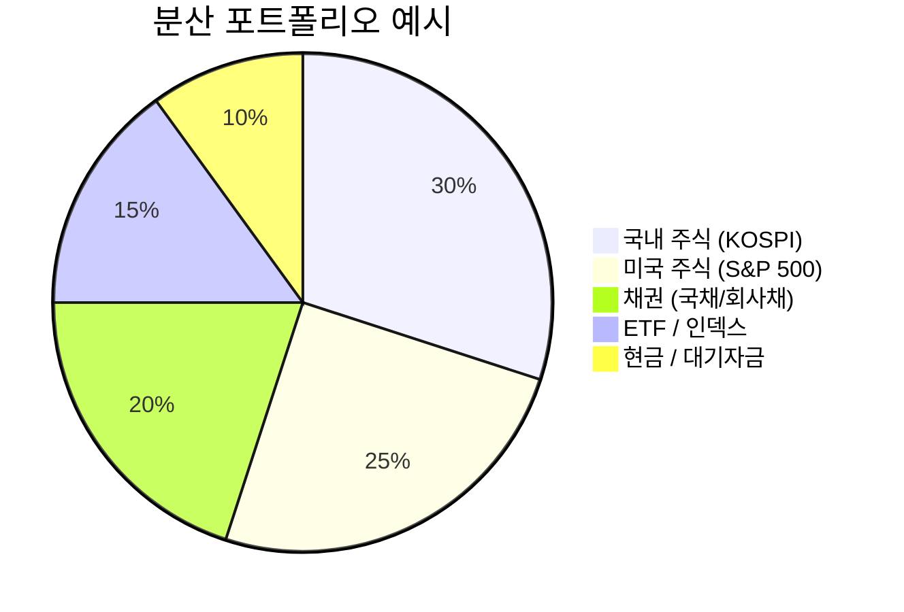

---

### 🎯 포트폴리오 이론 (Modern Portfolio Theory)
> 📺 **YouTube 강의**: [🎬 현대 포트폴리오 이론 마코위츠](https://www.youtube.com/results?search_query=현대포트폴리오이론+마코위츠+한국어+설명)

**📌 한 줄 정의**: 수학으로 최고의 투자 비율을 계산하는 이론

**💡 노벨상 받은 이론!**
- 1990년 해리 마코위츠가 노벨 경제학상 수상
- "위험을 최소로 하면서 수익을 최대로"

---

### ⚖️ 평균-분산 모델 (Mean-Variance Model)
> 📺 **YouTube 강의**: [🎬 평균 분산 포트폴리오 최적화](https://www.youtube.com/results?search_query=평균분산모델+포트폴리오최적화+한국어)

**📌 한 줄 정의**: 평균 수익(Mean)과 위험(Variance)의 황금 비율 찾기

**🎯 쉬운 비유**: 떡볶이(매움/맛) vs 김밥(안 매움/평범) 비율 정하기

---

### 🎩 블랙-리터만 모델 (Black-Litterman Model)
> 📺 **YouTube 강의**: [🎬 블랙-리터만 포트폴리오 모델 설명](https://www.youtube.com/results?search_query=블랙리터만+모델+포트폴리오+한국어)

**📌 한 줄 정의**: 시장 평균 + 내 의견 섞기

**🎯 쉬운 비유**: 친구들 평균 의견 듣고 + 내 생각 살짝 추가

**💡 실제 사례**:
- 시장 평균: 주식 60%, 채권 40%
- 내 의견: "AI가 대박날 거야!"
- 결과: 주식(특히 AI) 70%, 채권 30%

---

### ��️ 리스크 패리티 (Risk Parity)
> 📺 **YouTube 강의**: [🎬 리스크 패리티 All Weather 전략](https://www.youtube.com/results?search_query=리스크패리티+자산배분+All+Weather+한국어)

**📌 한 줄 정의**: 각 자산이 가진 위험을 똑같이 맞추는 전략

**🎯 쉬운 비유**: 시소 양쪽 무게 똑같이 맞추기

**💡 실제 사례**:
- **세계 최대 헤지펀드 브리지워터**의 'All Weather' 전략이 이 방식!
- 위험한 주식은 조금만, 안전한 채권은 많이 담아서 균형

---

## 8. 백테스트 & 성과 지표

### 🎮 백테스트 (Backtest)
> 📺 **YouTube 강의**: [🎬 파이썬 백테스트 투자 전략 검증](https://www.youtube.com/results?search_query=백테스트+파이썬+주식+투자전략+한국어)

**📌 한 줄 정의**: 과거 데이터로 내 전략이 잘 됐을지 시뮬레이션

**🎯 쉬운 비유**: 게임 본판 들어가기 전 연습 모드 돌려보기

**💡 실제 사례**:
- "20일선 위에서 사고 아래에서 팔기" 전략을 → 지난 10년 데이터에 적용 → "10년간 200% 수익이었네!" 확인

> ⚠️ 주의: 과거에 잘 됐다고 미래에도 잘 된다는 보장 없음!

---

### 📉 MDD (Maximum Drawdown, 최대낙폭)
> 📺 **YouTube 강의**: [🎬 MDD 최대낙폭 투자 성과 지표](https://www.youtube.com/results?search_query=MDD+최대낙폭+투자성과지표+한국어)

**📌 한 줄 정의**: 투자 중 가장 많이 잃었을 때의 손실률

**🎯 쉬운 비유**: 산 정상에서 가장 깊은 골짜기까지의 깊이

**💡 실제 사례**:
- 2020년 코로나 때 코스피 MDD: 약 -35%
- 1억 투자했으면 → 한때 6,500만원까지 떨어짐

**💡 기준**:
| MDD | 평가 |
|-----|------|
| -10% 이하 | 🟢 매우 안정적 |
| -20% 이하 | 🟡 무난함 |
| -30% 이하 | 🟠 위험 |
| -50% 이하 | 🔴 매우 위험 |

---

### ⚡ 샤프 비율 (Sharpe Ratio)
> 📺 **YouTube 강의**: [🎬 샤프 비율 투자 효율성 지표](https://www.youtube.com/results?search_query=샤프비율+Sharpe+Ratio+투자성과+한국어)

**📌 한 줄 정의**: 위험 1만큼 감수했을 때 얼마나 벌었나 (효율성)

**🎯 쉬운 비유**: 연비 (기름 1리터로 몇 km 가나)

**💡 계산식**:
```
샤프 비율 = (수익률 - 무위험수익률) / 변동성
```

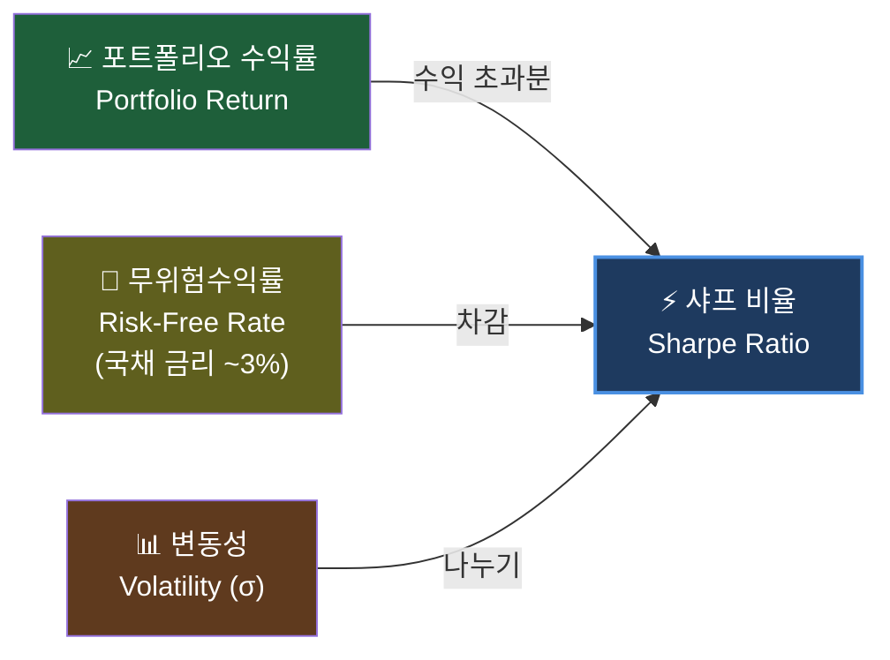

**💡 기준**:
| 샤프 비율 | 평가 |
|----------|------|
| < 1.0 | 🔴 별로 |
| 1.0 ~ 2.0 | 🟢 좋음 |
| 2.0 ~ 3.0 | ⭐ 매우 좋음 |
| > 3.0 | 🏆 최고 (대부분 사기) |

---

### 📅 시장 계절성 (Seasonality)
> 📺 **YouTube 강의**: [🎬 주식 계절성 1월효과 산타랠리](https://www.youtube.com/results?search_query=주식+계절성+1월효과+산타랠리+한국어)

**📌 한 줄 정의**: 시장이 특정 시기에 반복적으로 보이는 패턴

#### 🎄 연말 랠리 (Santa Rally)

**📌 정의**: 12월에 주가가 오르는 현상

**💡 이유**:
- 연말 보너스로 투자
- 새해 기대감
- 세금 절약을 위한 매수

#### 📆 1월 효과 (January Effect)

**📌 정의**: 1월에 작은 회사 주식이 더 잘 오르는 현상

#### 📊 요일 효과 (Day-of-Week Effect)

**📌 정의**: 요일마다 수익률이 다르다는 가설
- 월요일: 약세 경향
- 금요일: 강세 경향

> ⚠️ 최근엔 이런 효과들이 약해지는 추세

---

## 9. AI / 머신러닝 용어

### 🕷️ 웹 크롤링 (Web Crawling)
> 📺 **YouTube 강의**: [🎬 파이썬 웹크롤링 주가 데이터 수집](https://www.youtube.com/results?search_query=파이썬+웹크롤링+BeautifulSoup+주가데이터+한국어)

**📌 한 줄 정의**: 웹사이트에서 자동으로 데이터를 수집하는 기술

**🎯 쉬운 비유**: 거미가 거미줄 치며 돌아다니듯, 컴퓨터가 인터넷 돌아다니며 정보 수집

**💡 실제 사례**:
- 네이버 금융 페이지에서 1000개 회사 주가 데이터 5분만에 수집
- 뉴스 사이트에서 주식 관련 기사 1만개 자동 수집

**💡 사용 도구**:
- **BeautifulSoup**: 간단한 크롤링용 (파이썬 라이브러리)
- **Selenium**: 복잡한 웹사이트용 (브라우저 직접 조작)

---

### 🎨 클러스터링 (Clustering)
> 📺 **YouTube 강의**: [🎬 클러스터링 KMeans 비지도학습 파이썬](https://www.youtube.com/results?search_query=클러스터링+KMeans+비지도학습+파이썬+한국어)

**📌 한 줄 정의**: 비슷한 것끼리 자동으로 묶는 기술

**🎯 쉬운 비유**: 빨래 분류하기 (하얀색끼리, 컬러끼리)

**💡 실제 사례**:
- 코스피 주식 200개를 컴퓨터에 주면 → AI가 알아서 그룹화:
  - 🔴 반도체 그룹: 삼성전자, SK하이닉스
  - 🔵 자동차 그룹: 현대차, 기아
  - 🟢 화학 그룹: LG화학, SK이노베이션

**💡 대표 알고리즘**: K-Means, DBSCAN, 계층적 클러스터링

---

### 🤖 머신러닝 (Machine Learning)
> 📺 **YouTube 강의**: [🎬 머신러닝 입문 파이썬 한국어 강의](https://www.youtube.com/results?search_query=머신러닝+입문+파이썬+한국어+강의+scikit-learn)

**📌 한 줄 정의**: 컴퓨터가 데이터를 보고 스스로 패턴을 배우는 기술

**🎯 쉬운 비유**: 강아지 사진 1만장 보여주면 알아서 강아지 알아보게 되는 것

**💡 종류**:
- **지도학습**: 정답이 있는 데이터로 학습 ("이건 상승, 이건 하락")
- **비지도학습**: 정답 없이 패턴 발견 (클러스터링)
- **강화학습**: 시행착오로 학습 (게임 AI 같은 것)

---

### 🧠 딥러닝 (Deep Learning)
> 📺 **YouTube 강의**: [🎬 딥러닝 입문 파이썬 한국어 강의](https://www.youtube.com/results?search_query=딥러닝+입문+파이썬+한국어+강의+모두를위한딥러닝)

**📌 한 줄 정의**: 사람 뇌처럼 깊게 생각하는 머신러닝의 한 종류

**🎯 쉬운 비유**: 단순 계산기(머신러닝) vs 똑똑한 박사님(딥러닝)

**💡 실제 사례**:
- ChatGPT, 알파고, 자율주행차 모두 딥러닝!
- 주식에서: 30일 주가 + 거래량 + 뉴스 분석 → 내일 주가 방향 예측

---

### ⏰ 시계열 (Time Series)
> 📺 **YouTube 강의**: [🎬 시계열 분석 LSTM ARIMA 파이썬](https://www.youtube.com/results?search_query=시계열분석+LSTM+ARIMA+파이썬+한국어)

**📌 한 줄 정의**: 시간 순서대로 기록된 데이터

**🎯 쉬운 비유**: 매일 키 재고 기록한 성장 일기

**💡 실제 사례**:
- 주가 (매일 종가)
- 환율 (매시간 변화)
- 기온 (매일 측정)

**💡 시계열 분석 모델**:
- **ARIMA**: 전통적인 통계 모델
- **LSTM**: 딥러닝 기반 (장기 기억 가능)
- **Transformer**: ChatGPT의 그 기술!

---

## 10. 자동매매 & 개발 도구

### 📊 TradingView (트레이딩뷰)
> 📺 **YouTube 강의**: [🎬 트레이딩뷰 차트 분석 완전정복](https://www.youtube.com/results?search_query=트레이딩뷰+차트분석+사용법+한국어+강의)

**📌 한 줄 정의**: 전 세계 5,000만 명이 사용하는 웹 기반 통합 차트 분석 플랫폼

**🎯 쉬운 비유**: 주식계의 인스타그램 + 포토샵 + 코딩 IDE를 합친 도구

**💡 4대 핵심 기능**:

| 기능 | 설명 | 퀀트 활용 |
|------|------|-----------|
| **통합 분석** | 주식·코인·외환·원자재 차트를 한 화면에서 | 멀티 자산 상관관계 분석 |
| **편의성** | 웹/앱 연동, 실시간 알림(웹훅 포함) | FastAPI 웹훅 수신 → 자동매매 트리거 |
| **소셜 기능** | 퍼블리시드 아이디어, 팔로우, 커뮤니티 토론 | 시장 심리·센티멘트 파악 |
| **파인 스크립트** | 나만의 보조지표·백테스트 전략 코딩 | 매수/매도 신호 자동화 |

**💡 Python 연동 핵심 — 웹훅으로 자동매매 트리거**:
```python
# TradingView 알림 → FastAPI 웹훅 → 증권사 API 주문
from fastapi import FastAPI, Request
app = FastAPI()

@app.post("/webhook/tradingview")
async def tv_alert(request: Request):
    data   = await request.json()
    action = data.get("action")   # "buy" / "sell"
    ticker = data.get("ticker")
    # 여기서 KIS / 키움 / Binance API 호출
    return {"status": "received", "action": action, "ticker": ticker}
```

---

### 🌲 PineScript (파인스크립트)
> 📺 **YouTube 강의**: [🎬 파인스크립트 v5 트레이딩뷰 전략 코딩](https://www.youtube.com/results?search_query=트레이딩뷰+파인스크립트+v5+한국어+강의)

**📌 한 줄 정의**: TradingView 전용 프로그래밍 언어 (v5 최신)

**🎯 쉬운 비유**: 트레이딩뷰에서 그림 그리고 전략을 자동으로 테스트하는 전용 붓

**💡 3가지 활용 유형**:

| 유형 | 키워드 | 용도 |
|------|--------|------|
| **indicator** | `indicator()` | 차트에 보조지표 추가 |
| **strategy** | `strategy()` | 매매 로직 + 백테스트 |
| **library** | `library()` | 공통 함수 패키지화 |

**💡 실전 코드 — 골든/데드크로스 전략**:
```pinescript
//@version=5
strategy("골든/데드크로스", overlay=true, initial_capital=1000000)

ma5  = ta.sma(close, 5)
ma20 = ta.sma(close, 20)

// 골든크로스 → 매수
if ta.crossover(ma5, ma20)
    strategy.entry("Long", strategy.long)

// 데드크로스 → 청산
if ta.crossunder(ma5, ma20)
    strategy.close("Long")

plot(ma5,  color=color.blue,   title="MA5")
plot(ma20, color=color.orange, title="MA20")
```

**💡 실전 코드 — RSI 과매수/과매도 신호**:
```pinescript
//@version=5
indicator("RSI 신호", overlay=false)

rsi_val = ta.rsi(close, 14)
plot(rsi_val, color=color.purple)
hline(70, "과매수", color=color.red,   linestyle=hline.style_dashed)
hline(30, "과매도", color=color.green, linestyle=hline.style_dashed)

bgcolor(rsi_val > 70 ? color.new(color.red,   85) : na)
bgcolor(rsi_val < 30 ? color.new(color.green, 85) : na)

// 웹훅 알림 — FastAPI 서버로 JSON 전송
alertcondition(ta.crossunder(rsi_val, 70), title="RSI 과매수 이탈", message='{"action":"sell","ticker":"{{ticker}}","price":{{close}}}')
alertcondition(ta.crossover(rsi_val,  30), title="RSI 과매도 탈출", message='{"action":"buy","ticker":"{{ticker}}","price":{{close}}}')
```

**💡 Python과의 차이점**:
| 항목 | Pine Script | Python |
|------|-------------|--------|
| 실행 환경 | TradingView 클라우드 | 로컬 / 서버 |
| 백테스트 | 내장 (Strategy Tester) | backtrader / 직접 구현 |
| 데이터 | 실시간 차트 데이터 자동 연결 | yfinance / API로 수집 필요 |
| 난이도 | 쉬움 (퀀트 입문용) | 유연성 높음 (고급 모델 구현) |
| 자동매매 | 웹훅 알림으로 외부 연결 | 직접 증권사 API 호출 |

**💡 장점**: 코딩 경험이 적어도 30분이면 나만의 지표를 만들 수 있음!

---

### 🐍 Python (파이썬)
> 📺 **YouTube 강의**: [🎬 파이썬 퀀트 주식 데이터 분석](https://www.youtube.com/results?search_query=파이썬+퀀트+주식분석+한국어+강의)

**📌 한 줄 정의**: 퀀트 투자에서 가장 많이 쓰는 프로그래밍 언어

**🎯 쉬운 비유**: 만능 스위스 군용칼 🔪

**💡 핵심 라이브러리**:
| 라이브러리 | 역할 |
|----------|------|
| **pandas** | 데이터 정리 (엑셀 같은 것) |
| **numpy** | 숫자 계산 |
| **matplotlib** | 그래프 그리기 |
| **yfinance** | 야후 주가 데이터 받기 |
| **FinanceDataReader** | 한국 주가 데이터 받기 |
| **backtrader** | 백테스트 |
| **scikit-learn** | 머신러닝 |
| **PyTorch / TensorFlow** | 딥러닝 |

---

### 🔌 API (Application Programming Interface)
> 📺 **YouTube 강의**: [🎬 증권 API 파이썬 자동매매 키움](https://www.youtube.com/results?search_query=증권API+자동매매+파이썬+키움+한국어)

**📌 한 줄 정의**: 프로그램끼리 대화하는 약속된 통로

**🎯 쉬운 비유**: 식당의 메뉴판 (주문 방법이 정해져 있음)

**💡 실제 사례**:
- **한국투자증권 KIS API**: 한국 주식 자동매매
- **키움증권 OpenAPI+**: 가장 오래되고 안정적
- **이베스트 xingAPI**: 알고리즘 트레이더가 많이 사용
- **Binance API**: 암호화폐 자동매매

---

### 🤖 로보 어드바이저 (Robo-Advisor)
> 📺 **YouTube 강의**: [🎬 로보어드바이저 AI 투자 자산 배분](https://www.youtube.com/results?search_query=로보어드바이저+AI투자+자산배분+한국어)

**📌 한 줄 정의**: AI 알고리즘이 자동으로 돈을 굴려주는 서비스

**🎯 쉬운 비유**: AI 투자 비서

**💡 실제 사례**:
- 🇰🇷 **한국**: 파운트, 에임, 핀트, 불릴레오
- 🇺🇸 **미국**: Betterment, Wealthfront (원조)
- **수수료**: 일반 펀드 1~2% vs 로보 어드바이저 0.5% 이하

---

### ⚙️ 알고리즘 트레이딩 (Algorithmic Trading)
> 📺 **YouTube 강의**: [🎬 알고리즘 트레이딩 파이썬 자동 매매](https://www.youtube.com/results?search_query=알고리즘트레이딩+자동매매+파이썬+한국어)

**📌 한 줄 정의**: 미리 정해진 규칙대로 컴퓨터가 자동 매매

**🎯 쉬운 비유**: 자동 청소 로봇 (정해진 길로 알아서 청소)

**💡 종류**:
- **추세추종**: "오르면 사고, 떨어지면 판다"
- **평균회귀**: "너무 떨어지면 곧 오를 거야"
- **차익거래**: "A시장과 B시장 가격 차이로 돈 벌기"
- **고빈도매매(HFT)**: 0.001초 단위 초고속 매매 (월스트리트)

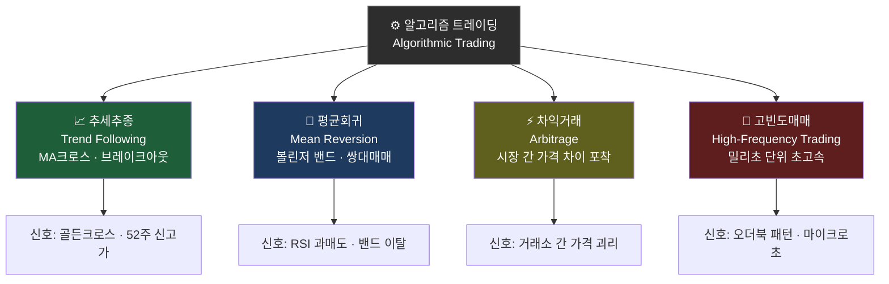

---

## 🎓 마무리: 퀀트 마스터 로드맵

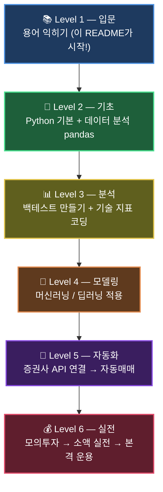

---

## 🟢 초급 (Beginner) — Python으로 금융 데이터 다루기

> 목표: 코드 한 줄로 주가를 가져오고, 정리하고, 시각화하는 능력 확보

### 1단계. Python 기초

```python
# 자료형과 리스트 — 주가 데이터 표현의 기초
prices = [68000, 69500, 71000, 70200, 72300]   # 삼성전자 5일 종가
returns = [(prices[i] - prices[i-1]) / prices[i-1] for i in range(1, len(prices))]
print(f"일별 수익률: {[f'{r:.2%}' for r in returns]}")

# 딕셔너리 — OHLCV 표현
ohlcv = {"Open": 68500, "High": 71200, "Low": 67800, "Close": 70200, "Volume": 12_345_678}
print(f"당일 변동폭: {ohlcv['High'] - ohlcv['Low']:,}원")
```

### 2단계. 금융 데이터 가져오기

#### Yahoo Finance (yfinance)

```python
# pip install yfinance
import yfinance as yf
import pandas as pd

# 미국 주식 (SPY, QQQ, AAPL 등)
spy = yf.download("SPY", start="2020-01-01", end="2024-12-31")
print(spy.tail())
print(f"SPY 현재가: ${spy['Close'].iloc[-1]:.2f}")

# 한국 주식 (티커 뒤에 .KS 또는 .KQ 붙이기)
samsung = yf.download("005930.KS", start="2023-01-01")
print(f"삼성전자 현재가: {samsung['Close'].iloc[-1]:,.0f}원")

# 여러 종목 동시 다운로드
tickers = ["AAPL", "MSFT", "QQQ", "SPY"]
data = yf.download(tickers, start="2022-01-01")["Close"]
print(data.tail())
```

#### 한국 증권 데이터 (FinanceDataReader)

```python
# pip install finance-datareader
import FinanceDataReader as fdr

# 코스피 전 종목 목록
kospi = fdr.StockListing('KOSPI')
print(kospi.head())

# 삼성전자 (005930)
df = fdr.DataReader('005930', '2020-01-01')
print(df.tail())

# 코스피 지수
kospi_idx = fdr.DataReader('KS11', '2020-01-01')
```

#### 한국투자증권 KIS API (실전 자동매매용)

```python
# pip install mojito2
import mojito

# KIS API 연결 (키 발급: https://apiportal.koreainvestment.com)
broker = mojito.KoreaInvestment(
    api_key    = "YOUR_API_KEY",
    api_secret = "YOUR_API_SECRET",
    acc_no     = "12345678-01",
    mock=True,   # True=모의투자, False=실전
)
balance = broker.fetch_balance()
print(balance)
```

### 3단계. 데이터 정리 (pandas)

```python
import yfinance as yf
import pandas as pd
import numpy as np

df = yf.download("QQQ", start="2020-01-01")

# 결측치 처리
df = df.dropna()                            # NaN 행 제거
df = df.fillna(method="ffill")             # 앞값으로 채우기

# 수익률 계산
df["Daily_Return"]  = df["Close"].pct_change()              # 일별 수익률
df["Log_Return"]    = np.log(df["Close"] / df["Close"].shift(1))  # 로그 수익률
df["Cum_Return"]    = (1 + df["Daily_Return"]).cumprod() - 1      # 누적 수익률

# 이동평균 추가
df["MA20"]  = df["Close"].rolling(20).mean()
df["MA60"]  = df["Close"].rolling(60).mean()
df["MA120"] = df["Close"].rolling(120).mean()

# 연간 통계
annual_ret = df["Daily_Return"].mean() * 252
annual_vol = df["Daily_Return"].std()  * np.sqrt(252)
print(f"QQQ 연간 수익률: {annual_ret:.2%}")
print(f"QQQ 연간 변동성: {annual_vol:.2%}")

# 특정 기간 필터링
df_2023 = df.loc["2023-01-01":"2023-12-31"]
print(f"2023년 수익률: {df_2023['Cum_Return'].iloc[-1]:.2%}")
```

**초급 체크리스트:**
```
[ ] yfinance로 SPY, QQQ 데이터 다운로드
[ ] pandas DataFrame에서 Close 가격 추출
[ ] 일별 수익률 계산 (pct_change)
[ ] 이동평균선 추가 (rolling.mean)
[ ] matplotlib으로 주가 차트 그리기
```

---

## 🟡 중급 (Intermediate) — 기술적 지표 & 백테스트 & 자동매매

> 목표: 전략을 코드로 구현하고, 과거 데이터로 성과를 검증하며, 자동으로 주문까지 연결

### 1단계. 기술적 지표 구현

```python
import yfinance as yf
import numpy as np
import pandas as pd

df = yf.download("QQQ", start="2019-01-01")
close = df["Close"]

# ── RSI (Relative Strength Index) ─────────────────────────────
def calc_rsi(series: pd.Series, period: int = 14) -> pd.Series:
    delta = series.diff()
    gain  = delta.clip(lower=0).rolling(period).mean()
    loss  = (-delta.clip(upper=0)).rolling(period).mean()
    rs    = gain / loss
    return 100 - (100 / (1 + rs))

df["RSI"] = calc_rsi(close)

# ── 볼린저 밴드 (Bollinger Bands) ─────────────────────────────
def calc_bollinger(series: pd.Series, period: int = 20, std: float = 2.0):
    mid  = series.rolling(period).mean()
    band = series.rolling(period).std() * std
    return mid, mid + band, mid - band

df["BB_mid"], df["BB_up"], df["BB_dn"] = calc_bollinger(close)

# ── MACD ──────────────────────────────────────────────────────
def calc_macd(series: pd.Series, fast=12, slow=26, signal=9):
    ema_fast   = series.ewm(span=fast,   adjust=False).mean()
    ema_slow   = series.ewm(span=slow,   adjust=False).mean()
    macd_line  = ema_fast - ema_slow
    signal_line = macd_line.ewm(span=signal, adjust=False).mean()
    histogram  = macd_line - signal_line
    return macd_line, signal_line, histogram

df["MACD"], df["MACD_sig"], df["MACD_hist"] = calc_macd(close)

# ── ATR (Average True Range) — 변동성 지표 ───────────────────
def calc_atr(df_: pd.DataFrame, period: int = 14) -> pd.Series:
    hl  = df_["High"] - df_["Low"]
    hcp = (df_["High"] - df_["Close"].shift(1)).abs()
    lcp = (df_["Low"]  - df_["Close"].shift(1)).abs()
    tr  = pd.concat([hl, hcp, lcp], axis=1).max(axis=1)
    return tr.rolling(period).mean()

df["ATR"] = calc_atr(df)

print(df[["Close", "RSI", "BB_mid", "BB_up", "BB_dn", "MACD", "ATR"]].tail())
```

### 2단계. 백테스트 (전략 검증)

```python
import yfinance as yf
import numpy as np
import pandas as pd

df = yf.download("SPY", start="2015-01-01")
close = df["Close"].squeeze()

# ── 이동평균 크로스오버 전략 ──────────────────────────────────
fast, slow = 5, 20
df["MA_fast"] = close.rolling(fast).mean()
df["MA_slow"] = close.rolling(slow).mean()

# 포지션: 골든크로스=1, 데드크로스=0
df["Signal"]   = (df["MA_fast"] > df["MA_slow"]).astype(int)
df["Position"] = df["Signal"].shift(1)         # 다음날 진입 (미래 데이터 방지)

df["Ret"]          = close.pct_change()
df["Strategy_Ret"] = df["Position"] * df["Ret"]
df["BH_Ret"]       = df["Ret"]                 # Buy & Hold 벤치마크

# ── 성과 지표 계산 ────────────────────────────────────────────
def sharpe(rets, rf=0.03):
    excess = rets - rf / 252
    return float(excess.mean() / excess.std() * np.sqrt(252))

def mdd(rets):
    cum = (1 + rets).cumprod()
    return float((cum / cum.cummax() - 1).min())

def cagr(rets):
    cum = (1 + rets).cumprod()
    n   = len(rets) / 252
    return float(cum.iloc[-1] ** (1 / n) - 1)

strategy = df["Strategy_Ret"].dropna()
bh       = df["BH_Ret"].dropna()

print("=" * 40)
print(f"{'지표':16s} {'전략':>10s} {'Buy&Hold':>10s}")
print("-" * 40)
print(f"{'CAGR':16s} {cagr(strategy):>10.2%} {cagr(bh):>10.2%}")
print(f"{'Sharpe':16s} {sharpe(strategy):>10.2f} {sharpe(bh):>10.2f}")
print(f"{'MDD':16s} {mdd(strategy):>10.2%} {mdd(bh):>10.2%}")
print(f"{'총수익률':16s} {(1+strategy).prod()-1:>10.2%} {(1+bh).prod()-1:>10.2%}")
print("=" * 40)

# 합격 기준 체크
print(f"\n✅ Sharpe > 1.0: {'합격' if sharpe(strategy) > 1.0 else '미달'}")
print(f"✅ MDD > -15%:  {'합격' if mdd(strategy) > -0.15 else '미달'}")
```

### 3단계. 간단한 자동매매 로직

```python
# 실전 자동매매 골격 (KIS API / 키움 API 연결 가능)
import time
import datetime
import yfinance as yf
import numpy as np

def get_price(ticker: str) -> float:
    """현재가 조회 (실무: 증권사 API로 교체)"""
    data = yf.download(ticker, period="5d", progress=False)
    return float(data["Close"].iloc[-1])

def calc_rsi(prices, period=14) -> float:
    """RSI 계산"""
    delta = np.diff(prices)
    gain  = np.where(delta > 0, delta, 0).mean()
    loss  = np.where(delta < 0, -delta, 0).mean()
    rs    = gain / loss if loss > 0 else 1e9
    return 100 - 100 / (1 + rs)

def should_buy(ticker: str) -> bool:
    """매수 조건: RSI < 30 (과매도 구간)"""
    data   = yf.download(ticker, period="30d", progress=False)
    closes = data["Close"].values.flatten()
    rsi    = calc_rsi(closes)
    print(f"  {ticker} RSI: {rsi:.1f}")
    return rsi < 30

def execute_order(ticker: str, action: str, qty: int):
    """주문 실행 (실무: broker.create_market_buy_order 등으로 교체)"""
    print(f"[{datetime.datetime.now():%H:%M:%S}] {action.upper()} {ticker} {qty}주 @ ${get_price(ticker):.2f}")
    # broker.create_market_buy_order(ticker, qty)   # 실제 주문 라인

def run_strategy(tickers=("SPY", "QQQ"), capital=10000, risk_pct=0.01):
    """전략 실행 루프"""
    print("🤖 자동매매 시작 (Ctrl+C로 종료)")
    while True:
        for ticker in tickers:
            try:
                price = get_price(ticker)
                qty   = max(1, int(capital * risk_pct / price))
                if should_buy(ticker):
                    execute_order(ticker, "buy", qty)
            except Exception as e:
                print(f"  오류: {e}")
        print(f"  ⏳ 60초 대기...")
        time.sleep(60)   # 1분마다 체크

# run_strategy()   # 실행 시 주석 해제
print("자동매매 로직 정의 완료 — run_strategy() 호출로 시작")
```

**중급 체크리스트:**
```
[ ] RSI, 볼린저 밴드, MACD를 직접 pandas로 구현
[ ] 이동평균 크로스오버 전략 백테스트 실행 (Backtest.py 참고)
[ ] Sharpe Ratio & MDD 계산 함수 작성
[ ] 전략 vs Buy&Hold 누적 수익률 비교 차트
[ ] yfinance로 실시간 가격 조회 → 조건 판단 → 주문 골격 구현
```

---

## 🔴 고급 (Advanced) — ML 모델 & 전략 최적화 & 리스크 관리

> 목표: 머신러닝으로 예측 모델을 만들고, 포트폴리오 전체를 최적화·관리

### 1단계. 머신러닝 모델 적용

```python
import yfinance as yf
import numpy as np
import pandas as pd
from sklearn.ensemble import RandomForestClassifier
from sklearn.model_selection import TimeSeriesSplit
from sklearn.metrics import accuracy_score, classification_report
from sklearn.preprocessing import StandardScaler

# ── 피처 엔지니어링 ────────────────────────────────────────────
df = yf.download("QQQ", start="2015-01-01")
close = df["Close"].squeeze()

features = pd.DataFrame(index=df.index)
features["ret_1"]  = close.pct_change(1)
features["ret_5"]  = close.pct_change(5)
features["ret_20"] = close.pct_change(20)
features["ma_ratio_5_20"]  = close.rolling(5).mean()  / close.rolling(20).mean()
features["ma_ratio_20_60"] = close.rolling(20).mean() / close.rolling(60).mean()
delta = close.diff()
gain  = delta.clip(lower=0).rolling(14).mean()
loss  = (-delta.clip(upper=0)).rolling(14).mean()
features["rsi_14"] = 100 - 100 / (1 + gain / loss)
features["vol_20"] = close.pct_change().rolling(20).std()

# ── 타깃: 다음날 상승(1) / 하락(0) ───────────────────────────
features["target"] = (close.pct_change().shift(-1) > 0).astype(int)
features = features.dropna()

X = features.drop("target", axis=1)
y = features["target"]

# ── 시계열 교차 검증 (미래 데이터 사용 방지) ─────────────────
tscv = TimeSeriesSplit(n_splits=5)
scaler = StandardScaler()
scores = []

for train_idx, test_idx in tscv.split(X):
    X_train, X_test = X.iloc[train_idx], X.iloc[test_idx]
    y_train, y_test = y.iloc[train_idx], y.iloc[test_idx]

    X_train_s = scaler.fit_transform(X_train)
    X_test_s  = scaler.transform(X_test)

    model = RandomForestClassifier(n_estimators=200, max_depth=5, random_state=42)
    model.fit(X_train_s, y_train)
    scores.append(accuracy_score(y_test, model.predict(X_test_s)))

print(f"시계열 CV 평균 정확도: {np.mean(scores):.2%} ± {np.std(scores):.2%}")

# ── 피처 중요도 ───────────────────────────────────────────────
model.fit(scaler.fit_transform(X), y)
importances = pd.Series(model.feature_importances_, index=X.columns).sort_values(ascending=False)
print("\n피처 중요도:")
print(importances.to_string())
```

### 2단계. 전략 최적화

```python
import numpy as np
from itertools import product

def backtest_ma(prices, fast, slow, risk_free=0.03):
    """단순 MA 크로스오버 백테스트 → Sharpe 반환"""
    prices = np.asarray(prices)
    ma_f = np.convolve(prices, np.ones(fast)/fast, mode="valid")
    ma_s = np.convolve(prices, np.ones(slow)/slow, mode="valid")
    n    = min(len(ma_f), len(ma_s))
    ma_f, ma_s = ma_f[-n:], ma_s[-n:]
    pos  = (ma_f > ma_s).astype(float)
    rets = np.diff(prices[-(n+1):]) / prices[-(n+1):-1]
    pos  = pos[:-1]
    strat_ret = pos * rets
    excess    = strat_ret - risk_free / 252
    if excess.std() < 1e-9:
        return -99
    return float(excess.mean() / excess.std() * np.sqrt(252))

# 파라미터 그리드 서치
import yfinance as yf
prices = yf.download("SPY", start="2015-01-01")["Close"].dropna().values.flatten()

fast_range = range(3, 21, 2)
slow_range = range(10, 61, 5)

best_sharpe, best_params = -99, (5, 20)
results = []

for fast, slow in product(fast_range, slow_range):
    if fast >= slow:
        continue
    s = backtest_ma(prices, fast, slow)
    results.append((fast, slow, s))
    if s > best_sharpe:
        best_sharpe, best_params = s, (fast, slow)

print(f"최적 파라미터: MA{best_params[0]}/MA{best_params[1]}  Sharpe={best_sharpe:.2f}")
top5 = sorted(results, key=lambda x: x[2], reverse=True)[:5]
print("\nTop 5 파라미터 조합:")
for f, s, sh in top5:
    print(f"  MA{f:2d}/MA{s:2d}  Sharpe={sh:.2f}")
```

### 3단계. 리스크 관리

```python
import numpy as np
import pandas as pd
import yfinance as yf

# ── 포트폴리오 리스크 지표 ────────────────────────────────────
tickers  = ["SPY", "QQQ", "GLD", "TLT"]   # 주식·기술주·금·채권
data     = yf.download(tickers, start="2020-01-01")["Close"].dropna()
rets     = data.pct_change().dropna()

# 균등 가중치
weights = np.ones(len(tickers)) / len(tickers)
cov_ann = rets.cov() * 252

port_vol  = float(np.sqrt(weights @ cov_ann.values @ weights))
port_ret  = float(rets.mean().values @ weights * 252)
port_sharpe = (port_ret - 0.03) / port_vol

print(f"포트폴리오 연간 수익률: {port_ret:.2%}")
print(f"포트폴리오 연간 변동성: {port_vol:.2%}")
print(f"포트폴리오 Sharpe     : {port_sharpe:.2f}")

# ── VaR / CVaR ────────────────────────────────────────────────
port_daily = rets @ weights
confidence = 0.95
var_95  = float(np.percentile(port_daily, (1 - confidence) * 100))
cvar_95 = float(port_daily[port_daily <= var_95].mean())
capital = 100_000_000   # 1억원

print(f"\n1억원 포트폴리오 기준:")
print(f"  일별 VaR  (95%): {var_95:.2%}  → 손실 한도 {var_95*capital:,.0f}원")
print(f"  일별 CVaR (95%): {cvar_95:.2%}  → 최악 기대손실 {cvar_95*capital:,.0f}원")

# ── 포지션 사이징 (1% 리스크 룰) ─────────────────────────────
def kelly_fraction(win_rate, profit_ratio):
    """켈리 공식: 최적 베팅 비율"""
    q = 1 - win_rate
    return win_rate - q / profit_ratio

win_rate     = 0.55
profit_ratio = 1.5   # 평균 수익 / 평균 손실

kelly = kelly_fraction(win_rate, profit_ratio)
half_kelly = kelly / 2   # 실전에서는 Half Kelly 권장

print(f"\n켈리 공식 포지션 사이징:")
print(f"  승률={win_rate:.0%}, 손익비={profit_ratio}")
print(f"  Full Kelly: {kelly:.1%}")
print(f"  Half Kelly: {half_kelly:.1%}  ← 실전 권장")
print(f"  1억 기준 투자금: {half_kelly*capital:,.0f}원")
```

**고급 체크리스트:**
```
[ ] 기술 지표를 ML 피처로 변환 (RSI, MA비율, 변동성)
[ ] TimeSeriesSplit으로 과거→미래 누수 없이 교차검증
[ ] RandomForest 피처 중요도로 유효 지표 선별
[ ] 파라미터 그리드 서치로 최적 MA 조합 탐색
[ ] VaR / CVaR 계산 및 포지션 사이징 (RiskManager.py 참고)
[ ] 켈리 공식으로 최적 베팅 비율 계산
[ ] PortfolioOptimizer.py 실행 → 효율적 프론티어 확인
```

---

## ⚠️ 투자 시 꼭 기억할 3가지

1. **🚫 과거 ≠ 미래**
   백테스트가 좋아도 실전에서 다를 수 있어요.

2. **💸 잃어도 되는 돈으로만**
   투자는 절대 빚내서 하지 마세요!

3. **📚 평생 공부**
   시장은 계속 변해요. 전략도 계속 업데이트해야 해요.

---

> 💡 **이 문서는 학습용이며, 특정 투자 추천이 아닙니다.**
> 💡 **모든 투자의 책임은 본인에게 있습니다.**

---

**📅 작성일**: 2026년 5월
**📝 버전**: 1.0
**🎯 목적**: 퀀트 투자 입문자를 위한 용어 정리집
