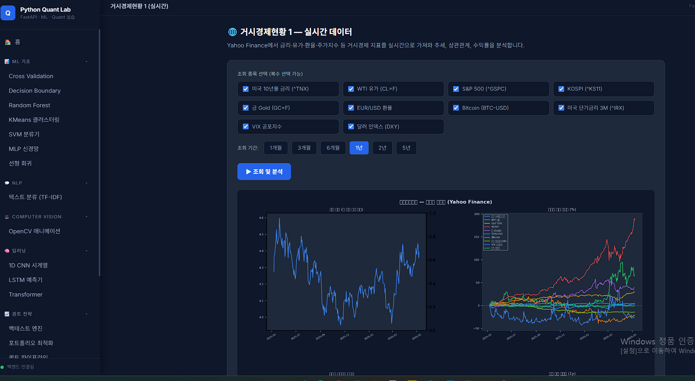

## 투자분석 기초 방법론

- 매크로 분석: 경제지표 분석(금리, 물가, 유가 등 주요 지표 보는 법), 거시경제상황 분석 실습



- 산업 분석: 산업 경쟁력 분석(산업경쟁력 개념/분석모형, 산업별 분석방법), 산업 분석 실습
- 기본적 분석:
  - 재무제표분석(손익계산서/대차대조표/현금흐름표)
  - 기업가치분석(상대가치평가 밸류에이션(멀티플), 절대가치평가 밸류에이션(DCF, EVA, FCF 등))
  - 분석기업선정 및 밸류에이션 실습
- 기술적 분석: 추세 분석(지지선과 저항선, 이동평균선, 갭 반전, 되돌림 분석 등), 패턴 분석, 캔들 차트 분석, 지표 분석, 앨리어트파동이론, 분석기업선정 및 기술적 분석

---

## 저장소 구성에 맞춘 학습 맵

- **매크로 분석 실습**
  - 프론트: `app/frontend/js/views/macroRealtime.js`, `app/frontend/js/views/macroSimulation.js`
  - API: `/api/macro/realtime`, `/api/macro/simulation`
- **산업 분석 실습**
  - 프론트: `app/frontend/js/views/industryAnalysis.js`
  - API: `/api/industry/porter`, `/api/industry/sector`, `/api/industry/peer`, `/api/industry/lifecycle`
- **기본적/퀀트 분석 실습**
  - 스크립트: `app/src/Backtest.py`, `app/src/PortfolioOptimizer.py`, `app/src/RiskManager.py`, `app/src/QuantPipeline.py`
  - API: `/api/quant/backtest`, `/api/quant/portfolio`, `/api/quant/risk`, `/api/quant/pipeline`
- **ML/DL 확장 실습**
  - 스크립트: `app/src/CrossValid.py`, `app/src/RandomForest.py`, `app/src/SVMClassifier.py`, `app/src/NeuralNetMLP.py`, `app/src/CNNTimeSeries.py`, `app/src/LSTMPredictor.py`, `app/src/TransformerTimeSeries.py`
  - API: `/api/ml/*`, `/api/dl/*`, `/api/nlp/text-classify`

---

# 📌 DART API Key 발급 방법

## 1. [DART 홈페이지 접속](ca://s?q=DART_API_홈페이지)
- 주소: [https://opendart.fss.or.kr](https://opendart.fss.or.kr)  
- 금융감독원 전자공시시스템(Open DART) 공식 사이트

---

## 2. [회원가입](ca://s?q=DART_API_회원가입)
- 오른쪽 상단 **Login** 버튼 클릭  
- ‘인증키 신청’을 선택 후 이용약관 동의 및 회원가입 진행

---

## 3. [인증키 신청](ca://s?q=DART_API_인증키_신청)
- 상단 메뉴에서 **인증키 신청/관리 → 인증키 신청** 클릭  
- API 사용 환경, 용도 등을 입력 후 신청

---

## 4. [이메일 인증](ca://s?q=DART_API_이메일_인증)
- 신청 시 입력한 이메일로 인증 메일 발송  
- 메일 본문의 인증 링크 클릭하여 완료

---

## 5. [인증키 확인](ca://s?q=DART_API_인증키_확인)
- 메뉴에서 **인증키 신청/관리 → 오픈 API 이용현황** 확인  
- 발급된 API Key 복사 후 사용 가능

---

# ⚠️ 유의사항
- **개인/기업 회원 모두 발급 가능**  
- **무료 제공**: 별도의 비용 없음  
- **사용 제한**: 하루 호출 횟수 제한 존재  
- **활용 예시**: 기업 공시자료 조회, 재무제표 분석, 데이터 분석 프로젝트

---

# 📌 결론
- DART API Key는 **금융감독원 Open DART 홈페이지에서 회원가입 후 신청**하면 발급됩니다.  
- 이메일 인증을 거친 뒤 **‘오픈 API 이용현황’ 메뉴에서 확인**할 수 있습니다.  

추가로 원하시면 [API 활용 예시 코드](ca://s?q=DART_API_활용_예시코드)나 [Python 라이브러리 dart-fss 사용법](ca://s?q=dart_fss_사용법)까지 정리해드릴 수 있습니다.

---

## 🗂️ Repository Structure

```text
.
├── app
│   ├── backend
│   │   └── main.py
│   ├── frontend
│   │   ├── index.html
│   │   ├── styles.css
│   │   └── js
│   │       ├── app.js
│   │       ├── api.js
│   │       └── views
│   └── src
│       ├── QuantPipeline.py
│       ├── Backtest.py
│       ├── PortfolioOptimizer.py
│       ├── RiskManager.py
│       ├── CrossValid.py
│       ├── DecisionBoundary.py
│       ├── LinearRegression.py
│       ├── RandomForest.py
│       ├── KMeansClustering.py
│       ├── SVMClassifier.py
│       ├── NeuralNetMLP.py
│       ├── SentimentAnalysis.py
│       ├── OpenCVCPU.py
│       ├── HuggingFaceGPU.py
│       ├── CNNTimeSeries.py
│       ├── LSTMPredictor.py
│       └── TransformerTimeSeries.py
├── docs
│   └── 01.md ~ 80.md
├── requirements.txt
└── readme.md
```

---

## 🚀 Quick Start

### 1) Python 앱 실행

#### /home/ubuntu/python-quant/app/backend/.env.example 를 .env 로 복제 후 본인 키 입력


```bash
cd /path/to/python-quant

python3 -m venv /home/ubuntu/python-quant/.venv && echo "venv created"
.venv/bin/pip install -r requirements.txt 2>&1

source /home/ubuntu/python-quant/.venv/bin/activate
cd app/backend
uvicorn main:app --host 0.0.0.0 --port 8000 --env-file .env

```
---

```bash
pkill -f uvicorn

```

- 웹앱: `http://localhost:8000`
- API 문서: `http://localhost:8000/docs`
- 기본 헬스체크: `GET /api/health`

### 2) 대표 스크립트 실행

```bash
cd /path/to/python-quant
python3 app/src/QuantPipeline.py
python3 app/src/Backtest.py
python3 app/src/RiskManager.py
python3 app/src/PortfolioOptimizer.py
```

---

## 📘 문서

- `docs/01.md` ~ `docs/80.md`: 일차별 학습 문서

---
