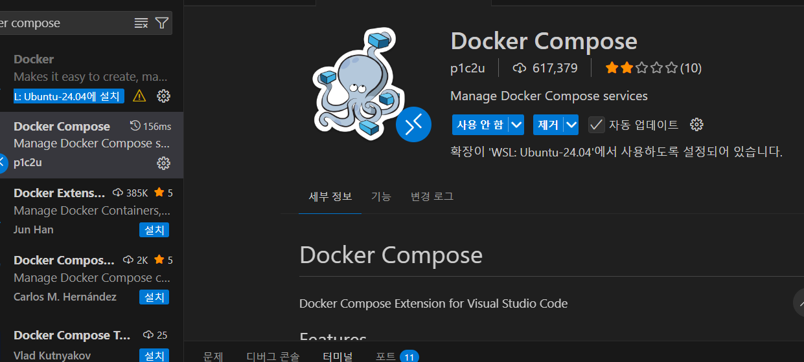

## 금융자산 knowledge 를 취업 목적으로 serving 시스템 만드는 과정

### 본 저장소의 `docs/` 폴더에 Vector DB 구축을 위한 RAG 용 자산운용 관련 내용이 있습니다.

- 이 내용은 전공여부, 본인의 지식, 경험여부와 무관하게, 자산운용 시스템을 만들기 위한 자료 입니다.
- 따라서, 쉬운 기초 내용 위주로 계속 문서를 보완 추가하면서, 차후 시스템 개발의 지식 배경을 목적으로 하며,
- 각자 이 repo 를 fork 하고, 별도 본인 repo 를 만들어 계속 본인의 repo 에 md 포맷으로 knowledge 를 축적합니다.

#### 본인의 경력, 실력과 상관없이 수업중 자신의 스케쥴대로 독립적인 연구를 할 수 있으며, 단, 수업에 방해되지 않게 해야합니다.
#### md 파일별로 각종 youtube 등의 링크가 있으므로, 헤드셋을 준비하여 개인 실습 시간에 이용 합니다.

### 🧭 시작 전 개인 준비 가이드 (필수)

이 저장소를 실제로 진행하려면, 각자 역할과 목표에 맞춰 아래 항목을 먼저 준비해야 합니다.

#### 1) 개인별 습득 기술 스택

| 구분 | 우선 습득 스택 | 이 repo에서 바로 쓰는 영역 |
|------|----------------|-----------------------------|
| 공통(전원) | Git/GitHub, Markdown, 기본 Linux 명령어, HTTP/REST, JSON, `.env` 관리 | 문서 누적, 협업, API 호출, 환경변수 세팅 |
| PM/PMO/QA | 스크럼 운영, 이슈/체크리스트 관리, 테스트 시나리오 작성, 배포 검증 | 일정관리, 산출물 검수, 릴리즈 품질 확인 |
| PL | FastAPI 구조, 프론트-백 연동 구조, API 명세 관리 | `app/backend/main.py`, `app/frontend/js/views/*` |
| Architect | Docker, Docker Compose, AWS ECR/EC2, GitHub Actions | `Dockerfile`, `docker-compose.yml`, `.github/workflows/deploy-ecr-ec2.yml` |
| Pipe Liner (RAG/DB) | MongoDB, Qdrant(Vector DB), 데이터 전처리/청킹, Python 스크립팅 | `scripts/upload_docs_to_qdrant.sh`, `scripts/init_quiz_mongodb.sh` |
| 개발자(자동화 중심) | Python 데이터 처리(`pandas`, `numpy`), 시각화, ML 기본(`scikit-learn`), API 디버깅 | `requirements.txt`, `app/src/*`, 백엔드 분석 API |

#### 2) 개인 PC 사양 (최소/권장)

| 항목 | 최소 사양(학습/문서 위주) | 권장 사양(로컬 실습 + Docker) |
|------|--------------------------|------------------------------|
| OS | Windows 11 / macOS / Ubuntu 22.04+ | Windows 11(WSL2 권장) / Ubuntu 22.04+ / macOS 최신 |
| CPU | 4코어 | 8코어 이상 |
| RAM | 16GB | 32GB 이상 |
| 저장공간 | 여유 30GB | 여유 80GB 이상(NVMe 권장) |
| 네트워크 | 가정용 브로드밴드 | 안정적 유선망 + 업로드 여유 |
| 필수 소프트웨어 | Python 3.10+, Git, VS Code | + Docker Engine/Compose, Postman/Insomnia |

> 딥러닝(`torch`, `transformers`, `diffusers`)까지 로컬에서 본격 실행하면 메모리/저장공간 요구가 커질 수 있으므로, 부족하면 클라우드(AWS EC2)로 분리 운영을 권장합니다.

#### 3) 가입해야 할 플랫폼 (필수/권장)

| 구분 | 플랫폼 | 용도 | 가입/키 |
|------|--------|------|--------|
| 필수 | GitHub | 코드 협업, Fork/PR, Actions 확인 | 가입 필수 |
| 필수 | DART Open API | 기업 공시/재무 데이터 조회 | API 키 발급 필요 (`DART_API_KEY`) |
| 필수 | 한국은행 ECOS | 금리/거시 지표 조회 | API 키 발급 필요 (`BOK_API_KEY`) |
| 권장 | FRED | 미국 거시지표 조회 | API 키 권장 (`FRED_API_KEY`) |
| 권장 | KRX Data Marketplace | 국내 시장 데이터 | API 키 권장 (`KRX_API_KEY`) |
| 권장 | TradingView / Investing.com | 차트/지표 검증 | 가입 권장 |
| 배포 시 필수 | AWS (ECR/EC2) | 컨테이너 배포, 운영 | 결제수단 등록 필요 |

#### 4) 예상 비용 (카드 청구 예상금액, 월 기준)

> 아래는 **1인 기준 추정치**이며, 실제 과금은 사용량/리전/서버 스펙에 따라 달라집니다.  
> 기본 가정은 **AWS ap-northeast-2(서울) 리전의 일반적인 소규모 사용 패턴**입니다.

| 시나리오 | 월 예상 비용(1인) | 구성 예시 |
|----------|------------------|-----------|
| 최소(로컬 학습 중심) | **₩0 ~ ₩30,000** | 로컬 실행 + 무료 API 위주 + 도메인/유료툴 미사용 |
| 권장(팀 개발/간헐 배포) | **₩30,000 ~ ₩120,000** | EC2 소형 인스턴스 + ECR/스토리지 소량 + 데이터 전송 소량 |
| 운영(상시 배포/실습 다수) | **₩120,000 ~ ₩300,000+** | 상시 서버 + 컨테이너 이미지 다수 + 트래픽 증가 |

추가로 발생할 수 있는 비용:
- 클라우드 GPU 실습(선택): 사용 시간에 따라 월 수만원~수십만원
- 유료 데이터/리서치 도구(선택): 서비스별 구독료 별도
- 팀 공용 인프라 사용 시 개인별 `1/N` 정산 필요 (`N` = 팀 인원수, 예: 4명 팀이면 각자 `1/4`)

### 팀 구성(집단지성)

- PM : 프로젝트를 리드, 스크럼 회의 주관, 비용산정, 프로덕트 오너로서의 기획, 일정관리, slack 구성
- PL : 개발 프레임웍 선정, 업무 설계, 산출물 작업(mermaid 스타일 각종 프로세스 다이어 그램)
- Architect : 아키텍트 구성(local , dev , prod), on prem , aws serving 인프라 구성, LLM Ops
- Pipe Liner : RAG 구성을 위한 자료수집, vector db 구성, ML Ops, No SQL RDBMS 구성
- PO, PMO, QA : 전체 프로세스 검증, 테스터
- 개발자 : Claude , Github Agent , Codex 등 휴먼코딩 배제함 !!!

### 선수 repo - https://github.com/edumgt/edumgt-lab-init

### 배포 repo - https://github.com/edumgt/aws-ec2-alb-lab

---

### 🔗 웹앱 API — 전체 엔드포인트 맵

| 분류 | 엔드포인트 | 설명 | 연계 프론트 |
|------|-----------|------|------------|
| **공통** | `GET /api/health` | 서버 상태 확인 | — |
| **매크로** | `POST /api/macro/realtime` | 금리·환율·유가 실시간 분석 | macroRealtime.js |
| **매크로** | `POST /api/macro/simulation` | GBM 기반 시나리오 시뮬레이션 | macroSimulation.js |
| **산업** | `POST /api/industry/porter` | Porter's 5 Forces 점수화 | industryAnalysis.js |
| **산업** | `POST /api/industry/sector` | 섹터 로테이션 분석 | industryAnalysis.js |
| **산업** | `POST /api/industry/peer` | 동종 기업 Peer Comparison | industryAnalysis.js |
| **산업** | `POST /api/industry/lifecycle` | 산업 수명주기 분석 | industryAnalysis.js |
| **DART** | `POST /api/dart/company-search` | 기업 공시 검색 (DART API) | dartCompanySearch.js |
| **퀀트** | `POST /api/quant/backtest` | 이동평균 크로스오버 백테스트 | backtest.js |
| **퀀트** | `POST /api/quant/portfolio` | MPT 포트폴리오 최적화 | portfolio.js |
| **퀀트** | `POST /api/quant/risk` | VaR·CVaR·MDD 리스크 분석 | risk.js |
| **퀀트** | `POST /api/quant/pipeline` | 멀티팩터 퀀트 파이프라인 | pipeline.js |
| **재무** | — | 재무제표 시각화 (yfinance) | financialStatement.js · valuation.js |
| **ML** | `POST /api/ml/cross-validation` | 교차검증 | crossValidation.js |
| **ML** | `GET /api/ml/decision-boundary` | 결정 경계 시각화 | decisionBoundary.js |
| **ML** | `POST /api/ml/random-forest` | 랜덤 포레스트 | randomForest.js |
| **ML** | `POST /api/ml/kmeans` | K-Means 클러스터링 | kmeans.js |
| **ML** | `POST /api/ml/svm` | SVM 분류기 | svm.js |
| **ML** | `POST /api/ml/mlp` | 다층 퍼셉트론 | mlp.js |
| **ML** | `POST /api/ml/linear-regression` | 선형·다항 회귀 | linearRegression.js |
| **DL** | `POST /api/dl/cnn-timeseries` | CNN 시계열 예측 | cnnTimeseries.js |
| **DL** | `POST /api/dl/lstm-predictor` | LSTM 주가 예측 | lstm.js |
| **DL** | `POST /api/dl/transformer-timeseries` | Transformer 시계열 예측 | transformer.js |
| **NLP** | `POST /api/nlp/text-classify` | 텍스트 감성 분류 | textClassify.js · sentiment.js |
| **CV** | `POST /api/cv/circle-animation` | OpenCV 애니메이션 | opencv.js |

---

## 🐍 Python 라이브러리 구성 (`requirements.txt`)

| 카테고리 | 패키지 | 용도 |
|----------|--------|------|
| **웹 서버** | `fastapi`, `uvicorn`, `gunicorn` | REST API 서버 |
| **데이터 처리** | `numpy`, `pandas`, `scipy`, `statsmodels` | 수치 계산·통계 분석 |
| **금융 데이터** | `yfinance`, `pykrx` | 주가·재무 데이터 수집 |
| **기술적 분석** | `pandas-ta`, `mplfinance` | 130+ 기술 지표, 캔들 차트 |
| **시각화** | `matplotlib`, `seaborn`, `plotly` | 정적·인터랙티브 차트 |
| **리포트 생성** | `reportlab`, `openpyxl`, `pyarrow` | PDF·Excel·Parquet 출력 |
| **ML** | `scikit-learn` | 분류·회귀·클러스터링 |
| **딥러닝** | `torch`, `transformers`, `diffusers` | LSTM·Transformer·이미지 생성 |
| **컴퓨터 비전** | `opencv-python` | 영상 처리 |
| **유틸리티** | `requests`, `httpx`, `python-dotenv`, `orjson`, `aiofiles` | HTTP·환경변수·직렬화 |

---

## 💡 투자 분석 관련 핵심 영어 표현

| 표현 | 의미 |
|------|------|
| **Investment Analysis** | 투자 분석 |
| **Equity Research** | 주식 리서치 (증권사 리포트) |
| **Fundamental Analysis** | 기본적 분석 (내재가치 중심) |
| **Technical Analysis** | 기술적 분석 (차트·지표 중심) |
| **Quantitative Analysis** | 계량 분석 (통계·수학 모델) |
| **Valuation** | 가치 평가 (목표주가 산출) |
| **Due Diligence** | 투자 전 심층 실사 |
| **Peer Analysis** | 동종 기업 비교 분석 |
| **Buy / Hold / Sell** | 매수 / 보유 / 매도 의견 |
| **Outperform / Underperform** | 시장 수익률 상회 / 하회 |
| **Price Target** | 목표 주가 |
| **Bullish / Bearish** | 강세 / 약세 전망 |

> 📖 용어 사전: [docs/voca.md](docs/voca.md)

---

## 🌐 참고 사이트 & API 목록

> 이 레포를 실행하고 데이터를 수집하기 위해 방문해야 할 사이트 전체 목록입니다.  
> ⚿ = API 키 발급 필요 / ✅ = 무료 공개 / 📋 = 가입·승인 필요

---

### 🇰🇷 국내 금융 당국 & 규제 기관

| 기관 | URL | 비고 | 주요 활용 |
|------|-----|------|-----------|
| **금융감독원 (FSS)** | <https://www.fss.or.kr> | ✅ | 금융 감독·규제 동향, 제재 현황 |
| **금융위원회** | <https://www.fsc.go.kr> | ✅ | 금융 정책·법령, 자본시장법 정보 |
| **한국은행 (BOK)** | <https://www.bok.or.kr> | ✅ | 통화정책, 기준금리 결정 발표 |
| **통계청** | <https://www.kostat.go.kr> | ✅ | CPI, 고용, GDP 공식 통계 |
| **기획재정부** | <https://www.moef.go.kr> | ✅ | 재정·경기 동향, 예산안 |

---

### 📊 국내 금융 데이터 API (API 키 발급 필요)

| 서비스 | URL | API 키 | `.env` 변수명 | 제공 데이터 |
|--------|-----|--------|--------------|-------------|
| **DART 전자공시시스템** | <https://opendart.fss.or.kr> | ⚿ 필요 | `DART_API_KEY` | 사업보고서, 재무제표, 공시 전체 |
| **한국은행 ECOS** | <https://ecos.bok.or.kr> | ⚿ 필요 | `BOK_API_KEY` | 기준금리, 국고채, 환율, M1/M2, CPI |
| **KRX Data Marketplace** | <https://openapi.krx.co.kr> | ⚿ 필요 | `KRX_API_KEY` | 주가·채권·지수·업종 공식 시계열 |
| **KOFIA OpenAPI** | <https://openapi.kofia.or.kr> | 📋 승인 필요 | — | 채권 시장금리, 자본시장 통계 |
| **금융감독원 금융상품한눈에** | <https://finlife.fss.or.kr> | ⚿ 필요 | — | 예·적금, 주담대, 신용대출 금리 |
| **공공데이터포털** | <https://www.data.go.kr> | ⚿ 필요 | — | 다양한 금융·경제 공공 데이터 |
| **통계청 KOSIS** | <https://kosis.kr> | ⚿ 권장 | — | CPI, PPI, 고용, GDP 시계열 |

---

### 🇺🇸 해외 금융 데이터 API

| 서비스 | URL | API 키 | `.env` 변수명 | 제공 데이터 |
|--------|-----|--------|--------------|-------------|
| **FRED (St. Louis Fed)** | <https://fred.stlouisfed.org> | ⚿ 권장 | `FRED_API_KEY` | 금리, CPI, GDP, 실업률, M2 |
| **U.S. Treasury Fiscal Data** | <https://fiscaldata.treasury.gov> | ✅ 불필요 | — | 미국 국채 금리, 재정 데이터 |
| **BLS (미국 노동통계국)** | <https://www.bls.gov/developers> | ⚿ 권장 | `BLS_API_KEY` | CPI, PPI, 실업률, 고용 원시 데이터 |
| **BEA (미국 경제분석국)** | <https://apps.bea.gov/api> | ⚿ 필요 | `BEA_API_KEY` | GDP, PCE, 국민소득 데이터 |
| **EIA (미국 에너지정보청)** | <https://www.eia.gov/opendata> | ⚿ 필요 | `EIA_API_KEY` | WTI·브렌트 유가, 천연가스, 재고 |
| **SEC EDGAR** | <https://www.sec.gov/developer> | ✅ 불필요 | — | 미국 기업 10-K/10-Q 재무제표 |
| **Alpha Vantage** | <https://www.alphavantage.co> | ⚿ 필요 | `ALPHA_VANTAGE_KEY` | 주가, 기술 지표, 펀더멘털 |
| **OECD Data** | <https://data.oecd.org> | ✅ 불필요 | — | 국가별 금리·GDP·물가 비교 |
| **World Bank Open Data** | <https://data.worldbank.org> | ✅ 불필요 | — | 글로벌 거시 지표 장기 시계열 |
| **IMF Data** | <https://www.imf.org/en/Data> | ✅ 불필요 | — | 세계경제전망(WEO), IFS 국제금융통계 |

---

### 🏦 국내 자본시장 인프라

| 기관 | URL | 활용 용도 |
|------|-----|-----------|
| **KRX 한국거래소** | <https://www.krx.co.kr> | 업종 분류, 시가총액, 거래량, 상장 기업 목록 |
| **KIND 상장공시시스템** | <https://kind.krx.co.kr> | 기업 공시 조회, 재무 요약 |
| **금융투자협회 (KOFIA)** | <https://www.kofia.or.kr> | 자본시장 통계, 채권 수익률, 펀드 정보 |
| **한국회계기준원 (KASB)** | <https://www.kasb.or.kr> | K-IFRS 회계기준 원문, 해석 사례 |
| **한국예탁결제원 (KSD)** | <https://www.ksd.or.kr> | 주식·채권 예탁 현황, 배당 정보 |

---

### 📈 차트 & 트레이딩 플랫폼

| 서비스 | URL | 활용 용도 |
|--------|-----|-----------|
| **TradingView** | <https://www.tradingview.com> | 기술적 분석 차트, 스크리너, Pine Script |
| **Investing.com** | <https://www.investing.com> | 경제 캘린더, 실시간 시세, 기술 시그널 |
| **StockCharts** | <https://stockcharts.com> | 기술 분석 패턴 사전, 지표 설명 |

---

### 📰 국내 금융 미디어 & 정보 포탈

| 서비스 | URL | 활용 용도 |
|--------|-----|-----------|
| **머니투데이 방송 (MTN)** | <https://mtn.co.kr> | 금리·경제·기업 분석 방송 |
| **한국경제TV (WOW TV)** | <https://www.wowtv.co.kr> | 시황·기술 분석·매매 전략 방송 |
| **이데일리** | <https://www.edaily.co.kr> | 경제·기업·증시 속보 |
| **연합인포맥스** | <https://news.einfomax.co.kr> | 금융·자본시장 전문 속보 |
| **네이버 금융** | <https://finance.naver.com> | 주가 차트, 재무 요약, 경제 지표 |
| **다음 금융** | <https://finance.daum.net> | 주가·섹터·테마 현황 |
| **한국경제신문 (한경)** | <https://www.hankyung.com> | 경제·증시 분석 기사 |
| **FnGuide** | <https://www.fnguide.com> | 컨센서스·리서치 리포트·재무 데이터 |
| **에프앤가이드 데이터** | <https://comp.fnguide.com> | 종목별 PER·PBR·EPS 현황 |

---

### 🏦 국내 주요 증권사 리서치센터

| 증권사 | URL | 활용 용도 |
|--------|-----|-----------|
| **미래에셋증권** | <https://securities.miraeasset.com> | 기업·산업·거시 분석 리포트 |
| **삼성증권** | <https://www.samsungpop.com> | Peer Comparison·목표주가 리포트 |
| **NH투자증권** | <https://www.nhqv.com> | DCF·기업가치 분석 리포트 |
| **키움증권 (영웅문)** | <https://www.kiwoom.com> | HTS 기술 분석, 리서치 리포트 |
| **KB증권** | <https://www.kbsec.com> | 업종별 밸류에이션 분석 |
| **신한투자증권** | <https://www.shinhaninvest.com> | 통합 리포트 양식 참고 |
| **한국투자증권** | <https://www.truefriend.com> | 재무 분석·목표주가 리포트 |
| **대신증권** | <https://www.daishin.com> | 기술적 분석 포함 주간 리포트 |

---

### 🐍 Python 라이브러리 & 개발 도구

| 라이브러리 | URL | 용도 |
|-----------|-----|------|
| yfinance | <https://pypi.org/project/yfinance> | 주가·재무·배당 데이터 수집 |
| pykrx | <https://pypi.org/project/pykrx> | 국내 시장 데이터 수집 |
| pandas-ta | <https://pypi.org/project/pandas-ta> | 130+ 기술 지표 계산 |
| mplfinance | <https://pypi.org/project/mplfinance> | 캔들 차트 시각화 |
| FastAPI | <https://fastapi.tiangolo.com> | REST API 서버 프레임워크 |
| Plotly | <https://plotly.com/python> | 인터랙티브 차트 |

---

### 🔑 API 키 발급 우선순위 안내

| 우선순위 | 서비스 | 이유 |
|---------|--------|------|
| ⭐⭐⭐ 필수 | DART (opendart.fss.or.kr) | 재무제표·공시 데이터 — 대부분의 기본적 분석에 필요 |
| ⭐⭐⭐ 필수 | 한국은행 ECOS (ecos.bok.or.kr) | 국내 금리·환율·통화량 — 매크로 분석 핵심 |
| ⭐⭐⭐ 필수 | FRED (fred.stlouisfed.org) | 글로벌 거시 지표 — 무료이고 데이터 품질 최고 |
| ⭐⭐ 권장 | EIA (eia.gov) | 유가 데이터 — 에너지 섹터 분석 시 필요 |
| ⭐⭐ 권장 | KRX Data Marketplace | 공식 국내 시장 데이터 |
| ⭐ 선택 | BLS, BEA, Alpha Vantage | yfinance/FRED로 대부분 대체 가능 |

---

# 📌 DART API Key 발급 방법

DART(전자공시시스템) API는 상장 기업의 재무제표·공시 데이터를 무료로 수집할 수 있는 공공 API입니다.

### 발급 절차

| 단계 | 내용 |
|------|------|
| 1. 홈페이지 접속 | [https://opendart.fss.or.kr](https://opendart.fss.or.kr) |
| 2. 회원가입 | 오른쪽 상단 Login → 인증키 신청 → 이용약관 동의 |
| 3. 인증키 신청 | 상단 메뉴 **인증키 신청/관리 → 인증키 신청** |
| 4. 이메일 인증 | 신청 이메일로 발송된 인증 링크 클릭 |
| 5. 키 확인 | **인증키 신청/관리 → 오픈 API 이용현황** 에서 발급된 키 복사 |

> ⚠️ **유의사항**: 무료 제공 / 개인·기업 모두 발급 가능 / 하루 호출 횟수 제한 있음  
> 발급 후 프로젝트 루트의 `app/backend/.env` 파일에 `DART_API_KEY=발급받은키` 형식으로 입력

---

## 🗂️ Repository Structure

```text
.
├── app
│   ├── backend
│   │   ├── main.py                      # FastAPI 앱 & 전체 API 라우터
│   │   └── .env.example                 # 환경변수 템플릿 (DART_API_KEY 등)
│   ├── frontend
│   │   ├── index.html
│   │   ├── styles.css
│   │   └── js
│   │       ├── app.js                   # SPA 라우터
│   │       ├── api.js                   # Fetch API 래퍼
│   │       └── views
│   │           ├── home.js
│   │           ├── macroRealtime.js     # 매크로 실시간 분석
│   │           ├── macroSimulation.js   # GBM 시뮬레이션
│   │           ├── industryAnalysis.js  # 산업 분석
│   │           ├── financialStatement.js # 재무제표
│   │           ├── dartCompanySearch.js  # DART 기업 검색
│   │           ├── valuation.js          # 밸류에이션
│   │           ├── technicalChart.js     # 기술적 분석 (7개 탭)
│   │           ├── backtest.js           # 백테스트
│   │           ├── portfolio.js          # 포트폴리오 최적화
│   │           ├── risk.js               # 리스크 분석
│   │           ├── pipeline.js           # 퀀트 파이프라인
│   │           ├── linearRegression.js   # ML: 선형 회귀
│   │           ├── decisionBoundary.js   # ML: 결정 경계
│   │           ├── randomForest.js       # ML: 랜덤 포레스트
│   │           ├── kmeans.js             # ML: K-Means
│   │           ├── svm.js                # ML: SVM
│   │           ├── mlp.js                # ML: MLP 신경망
│   │           ├── crossValidation.js    # ML: 교차검증
│   │           ├── cnnTimeseries.js      # DL: CNN 시계열
│   │           ├── lstm.js               # DL: LSTM 예측
│   │           ├── transformer.js        # DL: Transformer
│   │           ├── sentiment.js          # NLP: 감성 분석
│   │           ├── textClassify.js       # NLP: 텍스트 분류
│   │           ├── opencv.js             # CV: OpenCV
│   │           └── huggingface.js        # GenAI: 이미지 생성
│   └── src                              # 독립 실행 Python 스크립트
│       ├── QuantPipeline.py
│       ├── Backtest.py
│       ├── PortfolioOptimizer.py
│       ├── RiskManager.py
│       ├── CrossValid.py
│       ├── DecisionBoundary.py
│       ├── LinearRegression.py
│       ├── RandomForest.py
│       ├── KMeansClustering.py
│       ├── SVMClassifier.py
│       ├── NeuralNetMLP.py
│       ├── SentimentAnalysis.py
│       ├── OpenCVCPU.py
│       ├── HuggingFaceGPU.py
│       ├── CNNTimeSeries.py
│       ├── LSTMPredictor.py
│       └── TransformerTimeSeries.py
├── docs
│   ├── 27.md   Day 042 — 매크로 분석 개요 및 금리 분석
│   ├── 28.md   Day 043 — 경제지표 분석 (물가·유가 등)
│   ├── 29.md   Day 044 — 거시경제 상황 분석 실습
│   ├── 30.md   Day 045 — 산업 분석
│   ├── 31.md   Day 046 — 산업 분석 실습
│   ├── 32.md   Day 047 — 재무제표 분석 I
│   ├── 33.md   Day 048 — 재무제표 분석 II (현금흐름표 & 기업가치)
│   ├── 34.md   Day 049 — 상대가치 평가 (밸류에이션 멀티플)
│   ├── 35.md   Day 050 — 기술적 분석 I (추세 & 지표)
│   ├── 36.md   Day 051 — 기술적 분석 II + 통합 리포트
│   └── voca.md 투자분석 핵심 용어집
├── requirements.txt
└── readme.md
```

---

## 🚀 Quick Start

### 1) Python 앱 실행

#### /home/ubuntu/investment-analysis/app/backend/.env.example 를 .env 로 복제 후 본인 키 입력


```bash
python3 -m venv /home/ubuntu/investment-analysis/.venv && echo "venv created"
source /home/ubuntu/investment-analysis/.venv/bin/activate

pip install -r requirements.txt 2>&1
pip install --no-cache-dir -r requirements.txt

cd app/backend
uvicorn main:app --host 0.0.0.0 --port 8000 --env-file .env

```
---

```bash
pkill -f uvicorn

```

- 웹앱: `http://localhost:8800`
- API 문서: `http://localhost:8800/docs`
- 기본 헬스체크: `GET /api/health`


---

## 🚢 GitHub Actions → ECR → EC2 배포

새로 추가된 `/home/runner/work/investment-analysis/investment-analysis/.github/workflows/deploy-ecr-ec2.yml` 워크플로우는 아래 순서로 동작합니다.

- 확장팩에 docker compose 설치



1. `Dockerfile`로 웹앱 이미지를 빌드해 ECR에 push
2. `mongo:7` 이미지를 ECR로 복제 push
3. EC2에 `deploy/docker-compose.ec2.yml`, `deploy.env`, `backend.env` 업로드
4. EC2에서 `docker compose up -d`로 MongoDB + Qdrant(Vector DB) + 웹앱 재기동

### GitHub Secrets

- `AWS_ROLE_ARN` **또는** `AWS_ACCESS_KEY_ID`, `AWS_SECRET_ACCESS_KEY`
- `EC2_HOST`
- `EC2_USERNAME`
- `EC2_SSH_KEY`
- `BACKEND_ENV_FILE` : `app/backend/.env` 전체 내용을 멀티라인 secret 으로 저장

### GitHub Variables

- `AWS_REGION` (기본값 `ap-northeast-2`)
- `WEBAPP_ECR_REPOSITORY` (기본값 `investment-analysis-webapp`)
- `MONGODB_ECR_REPOSITORY` (기본값 `investment-analysis-mongodb`)
- `MONGODB_SOURCE_IMAGE` (기본값 `mongo:7`)
- `EC2_DEPLOY_PATH` (기본값 `/home/ubuntu/investment-analysis`)
- `WEBAPP_PORT` (기본값 `8000`)
- `VECTORDB_PORT` (기본값 `6333`)

### EC2 사전 준비

- Docker Engine 및 Docker Compose plugin 설치
- `EC2_USERNAME` 계정이 `docker` 명령을 실행할 수 있어야 함
- 인바운드 보안그룹에서 `WEBAPP_PORT` 오픈

워크플로우는 `main` 브랜치 push 또는 수동 실행(`workflow_dispatch`) 시 배포됩니다.

---

## 🧠 Vector DB(RAG) 업로드 스크립트

`docker compose up -d` 후 아래 스크립트로 `docs/*.md`를 청크/벡터화(해시 임베딩)하여 Qdrant에 업로드할 수 있습니다.

```bash
./scripts/upload_docs_to_qdrant.sh
```

옵션(환경 변수):

- `QDRANT_URL` (기본 `http://localhost:6333`)
- `QDRANT_COLLECTION` (기본 `investment_docs`)
- `DOCS_DIR` (기본 `./docs`)
- `CHUNK_SIZE` (기본 `1200`)
- `CHUNK_OVERLAP` (기본 `200`)
- `BATCH_SIZE` (기본 `128`)

예시:

```bash
QDRANT_URL=http://localhost:6333 QDRANT_COLLECTION=finance_docs ./scripts/upload_docs_to_qdrant.sh
```

---

# 퀀트 시스템 연동 가능한 증권사 API

## 주요 증권사 API 비교

| **증권사** | **API 방식** | **지원 상품** | **특징** |
|------------|--------------|---------------|-----------|
| **[한국투자증권](ca://s?q=한국투자증권_Open_API_자동매매)** | REST + WebSocket | 국내·해외주식, 채권, 선물옵션 | 국내 유일 REST API, OS 제약 없음, Python 샘플 제공 |
| **[키움증권](ca://s?q=키움증권_Open_API_자동매매)** | OCX (Windows 전용) | 국내주식 중심 | 가장 오래된 API, 커뮤니티 자료 풍부 |
| **[대신증권](ca://s?q=대신증권_CYBOS_API)** | COM (Windows 전용) | 국내주식, 파생상품 | CYBOS Plus 기반, 백테스트 자료 많음 |
| **[메리츠증권](ca://s?q=메리츠증권_Open_API)** | REST (출시 예정) | 국내주식 | 신규 API 준비 중, 무수수료 ‘슈퍼365’ 계좌와 결합 예정 |
| **[신한투자증권](ca://s?q=신한투자증권_자동감시주문_API)** | 자동감시주문 시스템 | 국내·해외주식 | 조건 충족 시 자동 주문, 대량 주문 처리 기능 |

---

## 선택 시 고려사항
- **운영체제 호환성**  
  - Windows 환경 → [키움증권](ca://s?q=키움증권_Open_API_자동매매), [대신증권](ca://s?q=대신증권_CYBOS_API)  
  - macOS/Linux/클라우드 서버 → [한국투자증권 REST API](ca://s?q=한국투자증권_Open_API_자동매매)  
- **상품 범위**: 해외주식까지 자동매매하려면 한국투자증권 API가 가장 범위가 넓음  
- **개발 난이도**: REST 기반은 HTTP 요청만으로 구현 가능해 상대적으로 쉬움  
- **커뮤니티 지원**: 키움증권은 오래된 API라 자료와 예제가 많음  

---

## ⚠️ 주의사항
- **보안 리스크**: API 키(App Key, Secret)는 계좌 접근 권한이므로 반드시 안전하게 관리해야 함  
- **호출 제한**: 초당 호출 횟수 제한 존재 → 대량 주문 시 설계 필요  
- **모의투자 환경**: 대부분 증권사에서 제공 → 실전 적용 전 백테스트 및 모의투자 권장  
- **법적 규제**: 자동매매 자체는 합법이나, 불공정거래(시세조종 등) 행위는 제재 대상  

---

👉 정리하면, **퀀트 시스템을 붙이려면 [한국투자증권 REST API](ca://s?q=한국투자증권_Open_API_자동매매)**가 가장 범용적이고 현대적인 선택지이며, Windows 환경이라면 [키움증권](ca://s?q=키움증권_Open_API_자동매매)이나 [대신증권](ca://s?q=대신증권_CYBOS_API)도 활용 가능합니다.


---
